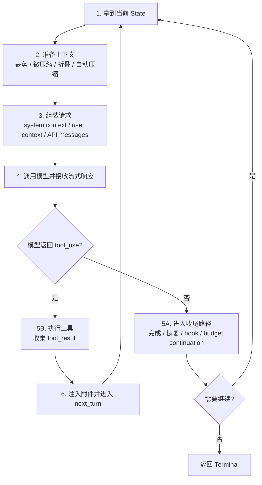

# Claude Code Agent Loop：一轮对话如何被推进

> **定位**：本章解释 `queryLoop()` 如何推进一轮 Agent 对话：准备上下文、调用模型、判断是否需要工具、执行工具或结束、必要时恢复并进入下一轮。它是全书的运行时锚点：后续讲自动压缩、工具执行、缓存、hooks、附件注入时，都可以回到本章定位它们在循环中的位置。

先把一句话放在最前面：

```text
Agent Loop 的核心不是“反复问模型”，
而是每一轮都判断：模型要不要继续行动？
```

模型回复后只有两条主路：

```text
没有 tool_use  -> 尝试收尾；如果遇到可恢复问题，就修复后重试
有 tool_use    -> 执行工具；把结果放回消息；进入下一轮
```

读懂这两条路，再看 `State`、压缩、fallback、hooks、token budget，都会顺很多。

---

## 11.1 先区分三个层级

很多人第一次看 `queryLoop()` 会混在一起：REPL、`query()`、`queryLoop()` 好像都在“跑对话”。其实它们的层级不同。

| 层级 | 人话解释 | 主要职责 |
|---|---|---|
| REPL / QueryEngine | 会话承接者 | 接收用户输入，保存会话状态，调用 `query()` |
| `query()` | 薄包装 | 调用 `queryLoop()`，结束后补齐命令 lifecycle |
| `queryLoop()` | 真正的 Agent Loop | 推进模型响应、工具调用、恢复重试和下一轮 |

所以本章真正关注的是第三层：`queryLoop()`。

---

## 11.2 入口：`query()` 只是把控制权交给 `queryLoop()`

原稿源码参考：`restored-src/src/query.ts:219-238`。当前源码仍体现同一结构：

```ts
// query.ts:219-238
export async function* query(
  params: QueryParams,
): AsyncGenerator<
  | StreamEvent
  | RequestStartEvent
  | Message
  | TombstoneMessage
  | ToolUseSummaryMessage,
  Terminal
> {
  const consumedCommandUuids: string[] = []
  const terminal = yield* queryLoop(params, consumedCommandUuids)
  // Only reached if queryLoop returned normally. Skipped on throw (error
  // propagates through yield*) and on .return() (Return completion closes
  // both generators). This gives the same asymmetric started-without-completed
  // signal as print.ts's drainCommandQueue when the turn fails.
  for (const uuid of consumedCommandUuids) {
    notifyCommandLifecycle(uuid, 'completed')
  }
  return terminal
}
```

这段代码只说明一件事：

```text
query() 不负责 Agent 的决策；
queryLoop() 才负责把一轮对话推进到底。
```

`queryLoop()` 的入口在 `src/query.ts:241`。从这里开始，系统进入一个 `while (true)` 状态机。

---

## 11.3 `State`：这一轮之后，下一轮还要记住什么

`queryLoop()` 不是一个普通循环。每一轮结束时，它都要带着更新后的状态进入下一轮。

原稿源码参考：`restored-src/src/query.ts:204-217`。

```ts
// query.ts:203-217
// Mutable state carried between loop iterations
type State = {
  messages: Message[]
  toolUseContext: ToolUseContext
  autoCompactTracking: AutoCompactTrackingState | undefined
  maxOutputTokensRecoveryCount: number
  hasAttemptedReactiveCompact: boolean
  maxOutputTokensOverride: number | undefined
  pendingToolUseSummary: Promise<ToolUseSummaryMessage | null> | undefined
  stopHookActive: boolean | undefined
  turnCount: number
  // Why the previous iteration continued. Undefined on first iteration.
  // Lets tests assert recovery paths fired without inspecting message contents.
  transition: Continue | undefined
}
```

这些字段可以分成四类：

| 类别 | 字段 | 解决的问题 |
|---|---|---|
| 对话内容 | `messages` | 下一轮模型要看到什么历史 |
| 工具环境 | `toolUseContext` | 下一轮有哪些工具、权限和运行上下文 |
| 恢复控制 | `autoCompactTracking`、`maxOutputTokensRecoveryCount`、`hasAttemptedReactiveCompact`、`maxOutputTokensOverride` | 防止恢复逻辑无限重试 |
| 循环控制 | `pendingToolUseSummary`、`stopHookActive`、`turnCount`、`transition` | 记录后台任务、hook 状态、轮次和继续原因 |

源码里还有一个很重要的注释：

```ts
// query.ts:265-279
// Mutable cross-iteration state. The loop body destructures this at the top
// of each iteration so reads stay bare-name (`messages`, `toolUseContext`).
// Continue sites write `state = { ... }` instead of 9 separate assignments.
let state: State = {
  messages: params.messages,
  toolUseContext: params.toolUseContext,
  maxOutputTokensOverride: params.maxOutputTokensOverride,
  autoCompactTracking: undefined,
  stopHookActive: undefined,
  maxOutputTokensRecoveryCount: 0,
  hasAttemptedReactiveCompact: false,
  turnCount: 1,
  pendingToolUseSummary: undefined,
  transition: undefined,
}
```

人话解释：

```text
每次 continue 前，都完整重建下一轮 State。
```

这样做的好处是：每条恢复路径都必须明确交代“下一轮带什么状态继续”，不靠零散变量偷偷变化。

---

## 11.4 一轮 Agent Loop 的主线

先不要看细节。`queryLoop()` 的一轮可以理解成 6 步：



这张图就是本章主线。后面的所有机制都可以放回这张图里定位。

---

## 11.5 第一段：进入模型前，先整理上下文

每轮开始时，`messages` 不会直接送给模型，而是先经过一条从轻到重的上下文整理管线。

| 顺序 | 机制 | 源码参考 | 人话解释 |
|---|---|---|---|
| 1 | Tool Result Budget | 原稿 `restored-src/src/query.ts:379-394` | 先控制工具结果大小，防止单轮消息过大 |
| 2 | History Snip | 原稿 `restored-src/src/query.ts:401-410` | 轻量截断旧历史，释放 token |
| 3 | Microcompact | 原稿 `restored-src/src/query.ts:414-426` | 清理旧工具结果，尽量不做完整摘要 |
| 4 | Context Collapse | 原稿 `restored-src/src/query.ts:440-447` | 用折叠视图替换部分历史 |
| 5 | Autocompact | 原稿 `restored-src/src/query.ts:454-468` | 最重的自动压缩，生成摘要后继续 |

这条管线的设计原则是：

```text
先用便宜、局部、信息损失小的方法；
不够时，再升级到更重的压缩。
```

所以自动压缩不是第一反应，而是最后几层兜底之一。

---

## 11.6 第二段：把内部消息变成 API 能接收的请求

上下文整理后，请求还要经过两类注入和一类标准化。

### 11.6.1 注入系统上下文和用户上下文

源码参考：

- `appendSystemContext`：原稿 `restored-src/src/utils/api.ts:437-447`
- `prependUserContext`：原稿 `restored-src/src/utils/api.ts:449-474`

区别很简单：

| 函数 | 放在哪里 | 典型内容 | 作用 |
|---|---|---|---|
| `appendSystemContext` | system prompt 末尾 | 当前目录、日期等系统上下文 | 给模型稳定背景 |
| `prependUserContext` | 第一条 user meta message 前 | `<system-reminder>` 包裹的用户上下文 | 让模型在对话开始前看到运行环境 |

注意一个边界：这些上下文注入是请求构建的一部分，不等于修改用户真实输入。

### 11.6.2 标准化 API 消息

API 层还要把内部消息整理成 Anthropic API 接受的格式。主流程包括：

| 步骤 | 作用 |
|---|---|
| `normalizeMessagesForAPI()` | 移除虚拟消息、重排附件、合并相邻同角色消息 |
| `ensureToolResultPairing()` | 修复 `tool_use` / `tool_result` 配对 |
| `stripAdvisorBlocks()` | 没有对应 beta header 时移除 advisor blocks |
| `stripExcessMediaItems()` | 超过媒体数量上限时移除最旧媒体 |

这一段的重点不是每个函数细节，而是：

```text
queryLoop 维护的是内部消息格式；
API 调用前必须转换成严格的 API 消息格式。
```

---

## 11.7 第三段：调用模型，边流式接收边收集结果

模型调用阶段做三件关键事：

1. 收集 assistant 消息；
2. 收集 `tool_use` blocks；
3. 处理可恢复错误和 fallback。

源码区域：原稿 `restored-src/src/query.ts:650-953`。

### 11.7.1 为什么要收集 `tool_use`

模型返回普通文本时，Agent 可能已经完成；模型返回 `tool_use` 时，说明它还要行动。

因此流式响应阶段会持续判断：

```text
这次模型只是回答？
还是要求调用工具？
```

这个判断会决定后面进入“收尾路径”还是“工具路径”。

### 11.7.2 为什么可恢复错误要先扣住

“扣留错误”这个词容易让读者停下来。可以这样理解：

```text
如果错误可以自动恢复，
就不要立刻把错误交给 UI / SDK。
先尝试恢复，恢复失败后再释放错误。
```

否则 SDK 或 UI 一看到错误就可能结束会话，后面的恢复逻辑就没有机会执行。

### 11.7.3 fallback 是同一轮内部重试

当触发 `FallbackTriggeredError` 时，系统会切换到 fallback model，并在同一轮 API 调用循环里重试。它不是进入下一轮 `queryLoop()`，而是在当前模型调用阶段完成降级。

---

## 11.8 主分岔 A：没有 `tool_use`，进入收尾或恢复

如果模型没有返回工具调用，`queryLoop()` 不会立刻结束。它会先检查几类情况：

| 检查 | 如果命中 | 继续原因 |
|---|---|---|
| prompt-too-long | 先尝试 collapse drain，再 reactive compact | `collapse_drain_retry` / `reactive_compact_retry` |
| max output tokens | 先把上限升级到 64k，再最多多轮恢复 3 次 | `max_output_tokens_escalate` / `max_output_tokens_recovery` |
| stop hooks | hook 如果返回阻塞错误，就把错误注入消息让模型修正 | `stop_hook_blocking` |
| token budget | 预算还有空间且模型提前停下，就注入 nudge 继续 | `token_budget_continuation` |
| 都没有命中 | 正常完成 | `completed` |

这条路径的核心是：

```text
没有 tool_use 不一定等于结束；
它还可能是“模型被截断了”“上下文太长了”“hook 要求修正”“预算还没用完”。
```

### 11.8.1 prompt-too-long：先轻后重

源码参考：

- collapse drain：原稿 `restored-src/src/query.ts:1169-1172`
- reactive compact：原稿 `restored-src/src/query.ts:1169-1172`

这里最重要的设计不是具体函数名，而是顺序：

```text
先提交已有的 context collapse；
不够时才做 reactive compact；
仍失败才把 prompt-too-long 暴露出去。
```

源码注释里特别提醒：prompt-too-long 时不要进入 stop hooks。原因是模型没有产生有效响应，hook 没有可评估对象；强行跑 hook 只会造成错误和重试的死循环。

### 11.8.2 max_output_tokens：先扩容，再续写

输出被截断时，恢复分两层：

| 层级 | 行为 |
|---|---|
| Escalation | 如果还没扩过，把 `maxOutputTokensOverride` 升级到 64k |
| Multi-turn recovery | 如果仍截断，注入元消息让模型从中断处继续，最多 3 次 |

恢复提示词的重点是减少废话：

```text
Output token limit hit. Resume directly — no apology, no recap of what you were doing.
Pick up mid-thought if that is where the cut happened.
Break remaining work into smaller pieces.
```

这句话的设计很工程化：不道歉、不复盘、直接接着写，并把剩余工作拆小。

---

## 11.9 主分岔 B：有 `tool_use`，执行工具并准备下一轮

如果模型返回了 `tool_use`，说明 Agent 还没有完成，它要通过工具改变世界或获取信息。

工具执行阶段源码参考：原稿 `restored-src/src/query.ts:1363-1408`。

这条路径做三件事：

1. 执行工具，得到 `tool_result`；
2. 把 `tool_result` 追加进消息；
3. 注入必要附件，然后进入下一轮。

工具执行有两种模式：

| 模式 | 说明 |
|---|---|
| `StreamingToolExecutor` | 工具调用在模型流式输出过程中就开始执行 |
| `runTools()` | 等全部 `tool_use` 收集完，再批量执行 |

工具执行细节不在本章展开。对 Agent Loop 来说，只要记住：

```text
tool_use 会让循环继续；
tool_result 会成为下一轮模型输入的一部分。
```

---

## 11.10 下一轮前：附件注入和 `next_turn`

工具结果回来后，系统还会补充一些“下一轮必须知道的信息”：

| 附件类型 | 作用 |
|---|---|
| 工具摘要 | 把上一轮工具活动压成更短的背景 |
| 队列命令 | 注入其他入口排队给当前 agent 的命令 |
| memory prefetch | 注入提前加载好的相关记忆 |
| skill discovery | 注入技能发现结果 |
| tool refresh | 如果工具列表变化，更新下一轮工具上下文 |

然后构造新的 `State`，设置：

```text
transition: { reason: 'next_turn' }
```

这意味着：

```text
模型用了工具，所以不能结束；
带着工具结果和附件，再问模型下一步。
```

---

## 11.11 Continue 和 Terminal：循环如何继续，如何结束

`queryLoop()` 的状态迁移分两类。

Continue 表示“修好状态，进入下一轮”：

| Continue reason | 触发场景 | 人话解释 |
|---|---|---|
| `next_turn` | 模型返回工具调用 | 工具结果已回来，继续让模型判断下一步 |
| `max_output_tokens_escalate` | 输出被截断，尚未扩容 | 把输出上限调高后重试 |
| `max_output_tokens_recovery` | 扩容后仍截断 | 注入续写提示，让模型接着写 |
| `reactive_compact_retry` | prompt-too-long | 压缩后重试 |
| `collapse_drain_retry` | 有待提交 collapse | 先排空 collapse，再重试 |
| `stop_hook_blocking` | hook 要求修正 | 把阻塞原因交给模型 |
| `token_budget_continuation` | 预算未用完 | 鼓励模型继续完成任务 |

Terminal 表示“这一轮会话终止”：

| Terminal reason | 人话解释 |
|---|---|
| `completed` | 模型正常完成，或可恢复路径已耗尽但不需要继续 |
| `blocking_limit` | token 到硬限制，无法继续 |
| `prompt_too_long` | prompt-too-long 且恢复失败 |
| `image_error` | 图片尺寸或格式错误 |
| `model_error` | 模型调用发生非预期异常 |
| `aborted_streaming` | 用户在模型流式响应时中断 |
| `aborted_tools` | 用户在工具执行时中断 |
| `stop_hook_prevented` | stop hook 阻止继续 |
| `hook_stopped` | 工具执行 hook 阻止后续操作 |
| `max_turns` | 达到最大轮次限制 |

这个表是调试 `queryLoop()` 的地图：看到 reason，就知道循环在哪条路上停下或继续。

---

## 11.12 单次迭代序列图

```mermaid
sequenceDiagram
    participant User as User / REPL / QueryEngine
    participant Loop as queryLoop
    participant Prep as Context Prep
    participant API as Model API
    participant Tools as Tool Executor

    User->>Loop: messages + toolUseContext
    Loop->>Prep: 裁剪 / 微压缩 / 折叠 / 自动压缩
    Prep-->>Loop: messagesForQuery
    Loop->>API: callModel(systemPrompt, messages, tools)
    API-->>Loop: assistant stream

    alt 没有 tool_use
        Loop->>Loop: 检查恢复 / hooks / token budget
        alt 需要继续
            Loop->>Loop: state = next; continue
        else 完成或失败
            Loop-->>User: Terminal
        end
    else 有 tool_use
        Loop->>Tools: execute tool_use
        Tools-->>Loop: tool_result
        Loop->>Loop: 注入附件，state.reason = next_turn
        Loop->>API: 下一轮请求
    end
```

---

## 11.13 设计模式提炼

### 模式一：完整状态重建

每个 continue 点都构造完整 `State`，而不是散落修改字段。这样可以避免“忘记重置某个恢复标记”的问题。

### 模式二：先扣留，再释放

可恢复错误不立刻交给 UI / SDK。先尝试恢复，恢复失败后再释放。这能避免上层消费者过早终止。

### 模式三：从轻到重恢复

上下文管理和错误恢复都遵循同一策略：

```text
先用便宜、局部、信息损失小的办法；
不够再升级到更重的办法。
```

### 模式四：后台任务填满等待窗口

工具摘要、记忆预取、技能发现等工作可以在模型流式响应或工具执行期间并行推进，减少用户可感知等待。

### 模式五：每种恢复都要有上限

`hasAttemptedReactiveCompact`、`maxOutputTokensRecoveryCount`、`transition` 检查都在防止死循环。Agent Loop 只要允许自动恢复，就必须有重试上限。

---

## 11.14 用户能做什么

如果你在构建自己的 Agent Loop，可以直接借鉴这些做法：

1. 把主循环写成“是否有工具调用”的双分支，而不是把所有情况揉成一团。
2. 把状态集中进一个 `State` 对象，在每个 continue 点完整重建。
3. 上下文超限时先裁剪、微压缩、折叠，再做完整摘要。
4. 对可恢复错误采用扣留机制，不要第一时间暴露给 UI / SDK。
5. 给每一种自动恢复都设置布尔标记或计数器，防止无限循环。
6. 在状态里记录 `transition reason`，方便测试和排查。

---

## 11.15 小结

`queryLoop()` 的清晰读法是：

```text
准备上下文
  -> 调模型
  -> 如果模型要工具，就执行工具并进入下一轮
  -> 如果模型不要工具，就检查是否完成或需要恢复
  -> 所有继续和终止都写成明确 reason
```

它不是普通 REPL，而是一个会主动管理上下文、工具、错误恢复和下一轮状态的 Agent 状态机。

理解了这条主线，后续章节里的自动压缩、工具执行、Prompt 构建、缓存、hooks、Skill 和多代理，就都有了运行时位置。

---

## 11.16 版本演化说明

本章核心分析基于 v2.1.88 源码。截至 v2.1.92，本章涉及的 Agent Loop 核心循环无重大结构性变化。具体信号变化见附录 E。
