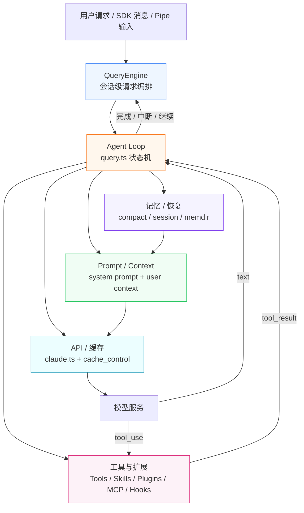

# Claude Code 架构全景：从 CLI 入口到 Agent 系统

## 1.1 前言：为什么先看全景

Claude Code 不是一个“命令行里包了一层 LLM”的简单工具。它更像一个在终端里运行的 Agent 操作系统：CLI 负责启动，React Ink 负责交互，AppState 负责共享状态，QueryEngine 和 Agent Loop 负责驱动请求，Prompt 系统负责塑造模型行为，工具 / Skill / Plugin / Hooks / MCP 负责扩展模型能触达的世界。

如果直接从某个子系统看起，读者很容易陷入局部细节：

- 看 Prompt，会以为系统核心只是提示词设计；
- 看工具，会以为系统核心只是工具注册和权限；
- 看压缩，会以为系统核心只是上下文管理；
- 看多代理，会以为系统核心只是 Agent 派生。

本章的任务是先建立一张总地图：Claude Code 从启动到响应用户请求，哪些层参与，哪些对象承接状态，哪些边界决定能力范围。后面的章节都可以挂回这张地图。

本文只整理用户指定的主线范围：架构全景、启动链路、请求链路、Agent 循环、Prompt、状态/会话/记忆、工具、Skill、Plugin、Hooks、多代理。权限系统、YOLO 分类器、提示注入防御、沙箱、Effort/Fast Mode/Thinking、Feature Flag 路线图暂不展开，只在必要处作为边界提示。

## 1.2 一句话总览

Claude Code 的运行路径可以压缩成一句话：

```text
CLI 入口先以最小成本完成分流和初始化，
再进入交互式 REPL 或非交互式 QueryEngine，
由 Agent Loop 将用户输入、Prompt、工具池、状态和记忆组装成 API 请求，
模型返回文本或 tool_use，
工具执行结果回填消息历史，
下一轮循环继续，直到完成、压缩、恢复或中断。
```

把这句话拆开，就是全书的主结构：

| 层级 | 解决的问题 | 核心文件 / 对象 | 已有或待补章节 |
|---|---|---|---|
| 启动层 | 如何尽快进入可用状态，并为不同运行模式分流 | `src/entrypoints/cli.tsx`、`src/main.tsx`、`src/entrypoints/init.ts` | 待补：启动链路 |
| UI / 交互层 | 用户如何输入、查看流式输出、审批工具、恢复会话 | `src/replLauncher.tsx`、`src/components/App.tsx`、`src/screens/REPL.tsx` | 待补：启动链路、状态总览 |
| 状态层 | 会话、权限、MCP、插件、文件历史如何跨组件共享 | `src/state/store.ts`、`src/state/AppState.tsx`、`src/state/AppStateStore.ts` | 待补：状态与会话总览 |
| 请求编排层 | 一次用户输入如何变成多轮模型调用和工具执行 | `src/QueryEngine.ts`、`src/query.ts` | 已有：Agent Loop；待补：请求链路 |
| Prompt / Context 层 | 模型看到什么身份、规则、上下文和工具说明 | `src/constants/prompts.ts`、`src/context.ts`、`src/utils/systemPrompt.ts` | 已有：Prompt 三篇 |
| 工具与扩展层 | 模型如何读写文件、调用 shell、加载 Skill、使用 MCP/Plugin/Hooks | `src/tools.ts`、`src/Tool.ts`、`src/tools/*` | 已有：工具系统、工具执行；待补：Skill、Plugin、Hooks |
| API / 缓存层 | 请求如何发送给模型，如何复用 prompt cache，如何检测缓存中断 | `src/services/api/claude.ts`、`src/utils/api.ts` | 已有：缓存三篇；待补：请求链路 |
| 记忆 / 恢复层 | 长会话如何压缩、恢复、跨会话延续 | `src/services/compact/*`、`src/utils/sessionStorage.ts`、`src/memdir/*` | 已有：压缩三篇；待补：记忆与会话恢复 |

## 1.3 核心运行链路图

下面这张图只保留一次请求推进时最核心的运行链路。启动、UI、交互式分流等外围逻辑在后续章节单独讲，这里先让读者抓住 Agent Loop 如何同时拉动 Prompt、工具、API 和记忆。



图 1-1：Claude Code 的核心运行链路。`Agent Loop` 是中心，Prompt 决定模型看到什么，工具决定模型能做什么，API / 缓存决定请求如何发出，记忆 / 恢复决定长会话如何延续。

## 1.4 启动层：先分流，再加载完整 CLI

启动层有两个入口事实需要区分：

1. 当前项目真正的 bootstrap 是 `src/entrypoints/cli.tsx`；
2. 参考文章中的 `main.tsx` 仍然是完整 CLI 的主入口，但它不是最早执行的文件。

### 1.4.1 `cli.tsx` 是轻量 bootstrap

`cli.tsx` 的职责是先做最小成本的分流：版本号、特殊 MCP / Chrome 路径、daemon worker、remote control 等快路径尽量不加载完整 CLI。

源码位置：`src/entrypoints/cli.tsx:54-75`

```typescript
/**
 * Bootstrap entrypoint - checks for special flags before loading the full CLI.
 * All imports are dynamic to minimize module evaluation for fast paths.
 * Fast-path for --version has zero imports beyond this file.
 */
async function main(): Promise<void> {
    const args = process.argv.slice(2);

    // Fast-path for --version/-v: zero module loading needed
    if (
        args.length === 1 &&
        (args[0] === "--version" || args[0] === "-v" || args[0] === "-V")
    ) {
        // MACRO.VERSION is inlined at build time
        // biome-ignore lint/suspicious/noConsole:: intentional console output
        console.log(`${MACRO.VERSION} (Claude Code)`);
        return;
    }

    // For all other paths, load the startup profiler
    const { profileCheckpoint } = await import("../utils/startupProfiler.js");
    profileCheckpoint("cli_entry");
```

这个设计让启动链路有一个“轻外壳”：只要用户走的是 `--version` 之类快路径，就不需要加载 React、工具系统、MCP、设置、认证等重模块。

### 1.4.2 当前开源恢复版的 `feature()` 是 polyfill

参考文章强调了 Anthropic 构建里的 `bun:bundle feature()`。当前项目里，`cli.tsx` 顶部直接提供了 polyfill：

源码位置：`src/entrypoints/cli.tsx:1-17`

```typescript
// Runtime polyfill for bun:bundle (build-time macros)
const feature = (_name: string) => false;
if (typeof globalThis.MACRO === "undefined") {
    (globalThis as any).MACRO = {
        VERSION: "2.1.888",
        BUILD_TIME: new Date().toISOString(),
        FEEDBACK_CHANNEL: "",
        ISSUES_EXPLAINER: "",
        NATIVE_PACKAGE_URL: "",
        PACKAGE_URL: "",
        VERSION_CHANGELOG: "",
    };
}
// Build-time constants — normally replaced by Bun bundler at compile time
(globalThis as any).BUILD_TARGET = "external";
(globalThis as any).BUILD_ENV = "production";
(globalThis as any).INTERFACE_TYPE = "stdio";
```

这意味着本文后续提到 feature-gated 模块时，要注意当前恢复版的事实：`feature()` 默认返回 `false`，很多内部功能分支在本地运行时不会启用。它们仍然说明了 Claude Code 的架构形态，但不能当成当前恢复版的默认运行路径。

### 1.4.3 `main.tsx` 是完整 CLI 主入口

进入完整 CLI 后，`main.tsx` 做三件事：

- 预热启动路径里的慢 I/O；
- 导入大量运行时能力；
- 按交互式、非交互式、恢复、远程等模式分流。

源码位置：`src/main.tsx:1-21`

```typescript
// These side-effects must run before all other imports:
// 1. profileCheckpoint marks entry before heavy module evaluation begins
// 2. startMdmRawRead fires MDM subprocesses (plutil/reg query) so they run in
//    parallel with the remaining ~135ms of imports below
// 3. startKeychainPrefetch fires both macOS keychain reads (OAuth + legacy API
//    key) in parallel — isRemoteManagedSettingsEligible() otherwise reads them
//    sequentially via sync spawn inside applySafeConfigEnvironmentVariables()
//    (~65ms on every macOS startup)
import { profileCheckpoint, profileReport } from './utils/startupProfiler.js';

// eslint-disable-next-line custom-rules/no-top-level-side-effects
profileCheckpoint('main_tsx_entry');
import { startMdmRawRead } from './utils/settings/mdm/rawRead.js';

// eslint-disable-next-line custom-rules/no-top-level-side-effects
startMdmRawRead();
import { ensureKeychainPrefetchCompleted, startKeychainPrefetch } from './utils/secureStorage/keychainPrefetch.js';

// eslint-disable-next-line custom-rules/no-top-level-side-effects
startKeychainPrefetch();
import { feature } from 'bun:bundle';
```

参考文章里的“并行预取”在当前源码中仍然成立：MDM 读取、Keychain 读取与模块加载并行，目标是压缩 CLI 进入可用状态前的等待时间。

## 1.5 初始化层：`init()` 负责建立运行环境

`main.tsx` 是调度入口，`init()` 则负责“这个进程能不能安全、稳定地跑起来”。它不是业务循环，而是环境准备层。

源码位置：`src/entrypoints/init.ts:57-88`

```typescript
export const init = memoize(async (): Promise<void> => {
  const initStartTime = Date.now()
  logForDiagnosticsNoPII('info', 'init_started')
  profileCheckpoint('init_function_start')

  // Validate configs are valid and enable configuration system
  try {
    const configsStart = Date.now()
    enableConfigs()
    logForDiagnosticsNoPII('info', 'init_configs_enabled', {
      duration_ms: Date.now() - configsStart,
    })
    profileCheckpoint('init_configs_enabled')

    // Apply only safe environment variables before trust dialog
    // Full environment variables are applied after trust is established
    const envVarsStart = Date.now()
    applySafeConfigEnvironmentVariables()

    // Apply NODE_EXTRA_CA_CERTS from settings.json to process.env early,
    // before any TLS connections. Bun caches the TLS cert store at boot
    // via BoringSSL, so this must happen before the first TLS handshake.
    applyExtraCACertsFromConfig()

    logForDiagnosticsNoPII('info', 'init_safe_env_vars_applied', {
      duration_ms: Date.now() - envVarsStart,
    })
    profileCheckpoint('init_safe_env_vars_applied')

    // Make sure things get flushed on exit
    setupGracefulShutdown()
    profileCheckpoint('init_after_graceful_shutdown')
```

`init()` 的主线是：

1. 打开配置系统；
2. 应用安全环境变量；
3. 建立退出清理；
4. 异步启动遥测、账号信息、IDE 检测、仓库检测；
5. 配置网络代理、mTLS、CA 证书；
6. 预连接 Anthropic API。

源码位置：`src/entrypoints/init.ts:153-159`

```typescript
    // Preconnect to the Anthropic API — overlap TCP+TLS handshake
    // (~100-200ms) with the ~100ms of action-handler work before the API
    // request. After CA certs + proxy agents are configured so the warmed
    // connection uses the right transport. Fire-and-forget; skipped for
    // proxy/mTLS/unix/cloud-provider where the SDK's dispatcher wouldn't
    // reuse the global pool.
    preconnectAnthropicApi()
```

这里能看到 Claude Code 的一个常见工程风格：能并行的准备工作尽早启动，但不能让失败准备工作拖垮主路径。初始化层的目的不是做业务，而是让后面的 Agent Loop 进入一个配置、网络、清理机制都可用的环境。

## 1.6 UI 层：React Ink 只是外壳，真正状态在 AppState

交互式模式下，`main.tsx` 最终会调用 `launchRepl()`。这个函数非常薄，只负责动态加载 React 组件并挂载：

源码位置：`src/replLauncher.tsx:12-22`

```typescript
export async function launchRepl(root: Root, appProps: AppWrapperProps, replProps: REPLProps, renderAndRun: (root: Root, element: React.ReactNode) => Promise<void>): Promise<void> {
  const {
    App
  } = await import('./components/App.js');
  const {
    REPL
  } = await import('./screens/REPL.js');
  await renderAndRun(root, <App {...appProps}>
      <REPL {...replProps} />
    </App>);
}
```

`App` 是交互式会话的顶层 Provider。它提供三个东西：

- `AppStateProvider`：全局状态；
- `StatsProvider`：统计信息；
- `FpsMetricsProvider`：终端 UI 性能指标。

源码位置：`src/components/App.tsx:15-18`

```typescript
/**
 * Top-level wrapper for interactive sessions.
 * Provides FPS metrics, stats context, and app state to the component tree.
 */
```

这说明 React Ink 在架构中的位置很清楚：它是交互界面和状态订阅层，不是 Agent Loop 本身。用户看到的消息、进度、权限弹窗，最终都要回到 AppState 和 QueryEngine / queryLoop 的状态变化。

## 1.7 状态层：一个 Store 连接 UI 和非 UI 逻辑

Claude Code 没有把状态散落在每个组件里。它用一个轻量 Store 连接 React UI 和命令式业务逻辑。

源码位置：`src/state/store.ts:10-34`

```typescript
export function createStore<T>(
  initialState: T,
  onChange?: OnChange<T>,
): Store<T> {
  let state = initialState
  const listeners = new Set<Listener>()

  return {
    getState: () => state,

    setState: (updater: (prev: T) => T) => {
      const prev = state
      const next = updater(prev)
      if (Object.is(next, prev)) return
      state = next
      onChange?.({ newState: next, oldState: prev })
      for (const listener of listeners) listener()
    },

    subscribe: (listener: Listener) => {
      listeners.add(listener)
      return () => listeners.delete(listener)
    },
  }
}
```

这个 Store 同时服务两类调用者：

- React 组件通过 `useAppState()` 订阅切片；
- 非 React 逻辑通过 `getState()` / `setState()` 读写状态。

默认状态由 `getDefaultAppState()` 构造，里面包括设置、权限上下文、MCP、插件、文件历史、agent 定义、任务、通知等运行时对象。

源码位置：`src/state/AppStateStore.ts:456-520`

```typescript
export function getDefaultAppState(): AppState {
  // Determine initial permission mode for teammates spawned with plan_mode_required
  // Use lazy require to avoid circular dependency with teammate.ts
  /* eslint-disable @typescript-eslint/no-require-imports */
  const teammateUtils =
    require('../utils/teammate.js') as typeof import('../utils/teammate.js')
  /* eslint-enable @typescript-eslint/no-require-imports */
  const initialMode: PermissionMode =
    teammateUtils.isTeammate() && teammateUtils.isPlanModeRequired()
      ? 'plan'
      : 'default'

  return {
    settings: getInitialSettings(),
    tasks: {},
    agentNameRegistry: new Map(),
    verbose: false,
    mainLoopModel: null, // alias, full name (as with --model or env var), or null (default)
    mainLoopModelForSession: null,
```

本章不展开状态系统的每个字段。这里先建立一个关键认知：AppState 是 UI、工具、MCP、插件、多代理之间的共享底座。后续“状态与会话总览”会专门讲它如何和 transcript、QueryEngine、文件状态、记忆系统配合。

## 1.8 请求编排层：`QueryEngine` 是会话级边界

如果说 `queryLoop()` 是 Agent 的心跳，那么 `QueryEngine` 是“每个会话的外壳”。它持有会话级状态，并把一次用户输入送入底层 Agent Loop。

源码位置：`src/QueryEngine.ts:178-185`

```typescript
/**
 * QueryEngine owns the query lifecycle and session state for a conversation.
 * It extracts the core logic from ask() into a standalone class that can be
 * used by both the headless/SDK path and (in a future phase) the REPL.
 *
 * One QueryEngine per conversation. Each submitMessage() call starts a new
 * turn within the same conversation. State (messages, file cache, usage, etc.)
 * persists across turns.
 */
```

`QueryEngine` 持有的状态包括：

- `mutableMessages`：当前会话消息历史；
- `abortController`：中断控制；
- `permissionDenials`：SDK 报告用的权限拒绝记录；
- `readFileState`：文件读取缓存；
- `discoveredSkillNames` / `loadedNestedMemoryPaths`：Skill 和嵌套记忆追踪；
- `totalUsage`：累计 token / cost 统计。

源码位置：`src/QueryEngine.ts:186-209`

```typescript
export class QueryEngine {
  private config: QueryEngineConfig
  private mutableMessages: Message[]
  private abortController: AbortController
  private permissionDenials: SDKPermissionDenial[]
  private totalUsage: NonNullableUsage
  private hasHandledOrphanedPermission = false
  private readFileState: FileStateCache
  // Turn-scoped skill discovery tracking (feeds was_discovered on
  // tengu_skill_tool_invocation). Must persist across the two
  // processUserInputContext rebuilds inside submitMessage, but is cleared
  // at the start of each submitMessage to avoid unbounded growth across
  // many turns in SDK mode.
  private discoveredSkillNames = new Set<string>()
  private loadedNestedMemoryPaths = new Set<string>()

  constructor(config: QueryEngineConfig) {
    this.config = config
    this.mutableMessages = config.initialMessages ?? []
    this.abortController = config.abortController ?? createAbortController()
    this.permissionDenials = []
    this.readFileState = config.readFileCache
    this.totalUsage = EMPTY_USAGE
  }
```

`submitMessage()` 里会先拿到工具、MCP、模型、上下文，再构建 Prompt 部分。

源码位置：`src/QueryEngine.ts:287-328`

```typescript
    headlessProfilerCheckpoint('before_getSystemPrompt')
    // Narrow once so TS tracks the type through the conditionals below.
    const customPrompt =
      typeof customSystemPrompt === 'string' ? customSystemPrompt : undefined
    const {
      defaultSystemPrompt,
      userContext: baseUserContext,
      systemContext,
    } = await fetchSystemPromptParts({
      tools,
      mainLoopModel: initialMainLoopModel,
      additionalWorkingDirectories: Array.from(
        initialAppState.toolPermissionContext.additionalWorkingDirectories.keys(),
      ),
      mcpClients,
      customSystemPrompt: customPrompt,
    })
    headlessProfilerCheckpoint('after_getSystemPrompt')
    const userContext = {
      ...baseUserContext,
      ...getCoordinatorUserContext(
        mcpClients,
        isScratchpadEnabled() ? getScratchpadDir() : undefined,
      ),
    }

    // When an SDK caller provides a custom system prompt AND has set
    // CLAUDE_COWORK_MEMORY_PATH_OVERRIDE, inject the memory-mechanics prompt.
    // The env var is an explicit opt-in signal — the caller has wired up
    // a memory directory and needs Claude to know how to use it (which
    // Write/Edit tools to call, MEMORY.md filename, loading semantics).
    // The caller can layer their own policy text via appendSystemPrompt.
    const memoryMechanicsPrompt =
      customPrompt !== undefined && hasAutoMemPathOverride()
        ? await loadMemoryPrompt()
        : null

    const systemPrompt = asSystemPrompt([
      ...(customPrompt !== undefined ? [customPrompt] : defaultSystemPrompt),
      ...(memoryMechanicsPrompt ? [memoryMechanicsPrompt] : []),
      ...(appendSystemPrompt ? [appendSystemPrompt] : []),
    ])
```

这段代码把多个已完成章节串起来了：

- Prompt 系统决定 `defaultSystemPrompt`；
- 状态系统提供额外工作目录和权限上下文；
- MCP 影响 Prompt 和工具；
- 记忆系统可能追加 memory mechanics prompt；
- 后续请求链路会继续把这些内容转成 API 请求。

## 1.9 Agent Loop：系统的心跳

`QueryEngine` 是会话边界，真正的循环在 `query.ts`。本章不重复 Agent Loop 的细节，只给它在全景图中的位置：

```text
用户输入
  -> QueryEngine.submitMessage()
  -> processUserInput()
  -> query()
  -> queryLoop()
  -> callModel()
  -> tool_use ? runTools / StreamingToolExecutor : 完成/恢复/终止
  -> 追加 messages
  -> 下一轮
```

Agent Loop 同时拉动五个子系统：

| 子系统 | 在 Loop 中承担的职责 | 对应章节 |
|---|---|---|
| Prompt / Context | 组装系统提示词、用户上下文、附件 | Prompt 系统三篇、请求链路 |
| Tool | 执行模型返回的 `tool_use` | 工具系统、工具执行编排 |
| State | 提供权限、模型、文件历史、MCP、插件等运行时状态 | 状态与会话总览 |
| Memory / Compact | 控制上下文容量，压缩和恢复长会话 | 自动压缩、状态恢复、微压缩 |
| API / Cache | 发送请求、处理流式响应、维护 prompt cache | 请求链路、缓存三篇 |

所以 Agent Loop 是全书的运行时锚点：其他章节不是孤立专题，而是它在每一轮中调用或依赖的部件。

## 1.10 Prompt 系统：模型行为的控制面

Prompt 系统在架构中的位置很特殊：它既不是 UI，也不是工具，也不是 API 客户端，但它决定模型如何理解自己的身份、任务边界、工具使用方式和输出风格。

目前已经整理了三篇：

| 文章 | 解释的问题 |
|---|---|
| `tasks/claude-code-system-prompt-architecture.md` | system prompt 如何分段、缓存、按优先级合成 |
| `tasks/claude-code-system-prompt-behavior-directives.md` | 行为指令如何让模型像工程师行动 |
| `tasks/claude-code-tool-prompts-micro-harnesses.md` | 每个工具的 description 如何成为局部行为控制器 |

在全景架构中，Prompt 系统的输入来自：

- 启动和配置：模型、输出风格、feature gates；
- 状态层：工作目录、权限上下文、MCP 客户端；
- 记忆层：CLAUDE.md、memdir、compact summary；
- 工具层：工具 description 和 JSON Schema。

Prompt 系统的输出则进入请求链路，成为 API 请求的 system blocks 和 tool schemas。

## 1.11 工具与扩展层：模型的能力边界

工具系统不是一个平铺数组，而是一条能力管线：

```text
内置 Tool 定义
  -> feature / env / mode 过滤
  -> permission deny 过滤
  -> MCP 工具融合
  -> ToolSearch / deferred loading
  -> API tool schema
  -> Agent Loop 中执行 tool_use
```

源码位置：`src/tools.ts:193-250`

```typescript
export function getAllBaseTools(): Tools {
  return [
    AgentTool,
    TaskOutputTool,
    BashTool,
    // Ant-native builds have bfs/ugrep embedded in the bun binary (same ARGV0
    // trick as ripgrep). When available, find/grep in Claude's shell are aliased
    // to these fast tools, so the dedicated Glob/Grep tools are unnecessary.
    ...(hasEmbeddedSearchTools() ? [] : [GlobTool, GrepTool]),
    ExitPlanModeV2Tool,
    FileReadTool,
    FileEditTool,
    FileWriteTool,
    NotebookEditTool,
    WebFetchTool,
    TodoWriteTool,
    WebSearchTool,
    TaskStopTool,
    AskUserQuestionTool,
    SkillTool,
    EnterPlanModeTool,
```

源码位置：`src/tools.ts:345-365`

```typescript
export function assembleToolPool(
  permissionContext: ToolPermissionContext,
  mcpTools: Tools,
): Tools {
  const builtInTools = getTools(permissionContext)

  // Filter out MCP tools that are in the deny list
  const allowedMcpTools = filterToolsByDenyRules(mcpTools, permissionContext)

  // Sort each partition for prompt-cache stability, keeping built-ins as a
  // contiguous prefix. The server's claude_code_system_cache_policy places a
  // global cache breakpoint after the last prefix-matched built-in tool; a flat
  // sort would interleave MCP tools into built-ins and invalidate all downstream
  // cache keys whenever an MCP tool sorts between existing built-ins. uniqBy
  // preserves insertion order, so built-ins win on name conflict.
  // Avoid Array.toSorted (Node 20+) — we support Node 18. builtInTools is
  // readonly so copy-then-sort; allowedMcpTools is a fresh .filter() result.
  const byName = (a: Tool, b: Tool) => a.name.localeCompare(b.name)
  return uniqBy(
    [...builtInTools].sort(byName).concat(allowedMcpTools.sort(byName)),
```

这段 `assembleToolPool()` 是一个典型全景节点：它同时涉及工具系统、MCP、权限过滤和 prompt cache 稳定性。后续 Skill、Plugin、Hooks、多代理也都可以看成扩展层的不同方向：

- Skill：把可复用指令包加载给模型；
- Plugin：把外部包安装进系统能力池；
- Hooks：让用户脚本介入生命周期；
- 多代理：让 Agent 派生 Agent，形成协作结构。

## 1.12 状态、记忆与恢复：让长会话不散架

Claude Code 的状态不是只有 messages。长会话要保持连续，需要至少四类状态协作：

| 状态类型 | 例子 | 生命周期 |
|---|---|---|
| UI / 运行时状态 | `AppState` 中的权限、MCP、插件、任务、通知 | 当前进程 |
| 会话消息状态 | `mutableMessages`、transcript、tool_result | 当前会话，可持久化 |
| 文件与上下文状态 | `readFileState`、file history、content replacements | 当前会话，压缩后可恢复 |
| 持久记忆 | CLAUDE.md、memdir、session memory | 跨会话 |

已有压缩相关三篇解决的是“上下文容量”问题：

- `tasks/claude-code-auto-compact.md`
- `tasks/claude-code-post-compact-restoration.md`
- `tasks/claude-code-microcompact.md`

但它们还需要被放回更大的状态系统中。因此后续要补两篇：

1. `状态与会话总览`：讲 AppState、QueryEngine、transcript、文件状态如何分工；
2. `会话恢复与跨会话记忆`：讲 resume、JSONL、session memory、memdir 如何延续工作。

## 1.13 API 与缓存层：请求链路的最后一段

API 层在全景图里承担两件事：

1. 把内部对象转成 Anthropic API 可接受的请求；
2. 利用 prompt cache 降低长会话成本。

目前缓存部分已经有三篇：

| 文章 | 解释的问题 |
|---|---|
| `tasks/claude-code-cache-architecture.md` | cache scope、TTL、beta header 锁存 |
| `tasks/claude-code-cache-break-detection.md` | 如何检测 cache break |
| `tasks/claude-code-cache-optimization-patterns.md` | 如何减少 cache break |

但还缺一篇“请求链路”：它应该专门讲一次 API 请求如何从内部状态组装出来，包括：

- system prompt 如何进入 `system`；
- user context 如何进入 messages；
- tool schema 如何由工具池渲染；
- betas、provider、model、thinking、cache_control 如何进入请求参数；
- streaming response 如何回到 Agent Loop；
- request 前后如何连接缓存检测。

这篇是当前书稿最需要补的胶水章节之一。

## 1.14 当前已完成文章如何归位

| 当前文件 | 在全景中的位置 |
|---|---|
| `claude-code-agent-loop.md` | 请求编排层 / 系统心跳 |
| `claude-code-system-prompt-architecture.md` | Prompt 系统：结构层 |
| `claude-code-system-prompt-behavior-directives.md` | Prompt 系统：行为层 |
| `claude-code-tool-prompts-micro-harnesses.md` | Prompt 系统：工具局部提示词 |
| `claude-code-auto-compact.md` | 记忆 / 恢复层：全量压缩 |
| `claude-code-post-compact-restoration.md` | 记忆 / 恢复层：压缩后状态恢复 |
| `claude-code-microcompact.md` | 记忆 / 恢复层：轻量上下文修剪 |
| `claude-code-cache-architecture.md` | API / 缓存层：缓存结构 |
| `claude-code-cache-break-detection.md` | API / 缓存层：可观测性 |
| `claude-code-cache-optimization-patterns.md` | API / 缓存层：优化模式 |
| `claude-code-tool-system.md` | 工具与扩展层：工具定义和注册 |
| `claude-code-tool-execution-orchestration.md` | 工具与扩展层：工具执行 |

这张表也说明后续缺口在哪里：入口主链路、状态会话记忆、Skill、Plugin、Hooks、多代理。

## 1.15 后续阅读路线

建议后续按四批继续：

1. **入口和请求主链路**
   - 架构全景（本文）
   - 启动链路
   - 请求链路

2. **状态、会话、记忆**
   - 状态与会话总览
   - CLAUDE.md 与记忆注入
   - 会话恢复与跨会话记忆
   - 自动压缩 / 压缩后恢复 / 微压缩（已完成）

3. **Prompt 和工具**
   - Prompt 三篇（已完成）
   - 工具系统（已完成）
   - 工具执行编排（已完成）
   - Skill 系统
   - Plugin 系统
   - Hooks

4. **多代理**
   - Agent 派生
   - Teams 协作
   - 远程规划（可选）

## 1.16 模式提炼

### 模式一：轻外壳启动

`cli.tsx` 先处理快路径，再动态导入完整 CLI。这个模式适合所有大型 CLI Agent：常用的轻量命令不应该为完整 UI、工具池和 API 客户端付启动成本。

### 模式二：初始化和业务循环分离

`init()` 只建立配置、网络、清理和预连接，不进入业务推理。这样 Agent Loop 可以假设环境已准备好，而初始化失败也能在更靠前的位置暴露。

### 模式三：状态 Store 同时服务 UI 和命令式逻辑

`createStore()` 很小，但它让 React 组件和非 React 模块访问同一份状态。对 Agent 系统来说，这比“UI 一份状态、后台一份状态”更可审计。

### 模式四：会话外壳和循环心跳分离

`QueryEngine` 负责会话级状态，`queryLoop()` 负责单次循环状态机。这种分离让 SDK/headless 和 REPL 可以复用核心逻辑。

### 模式五：扩展能力统一进入工具池

内置工具、MCP 工具、Skill、Plugin、多代理最终都要影响模型可见能力。统一工具池和稳定排序不仅是架构整洁问题，也是 prompt cache 稳定性问题。

## 1.17 小结

Claude Code 的架构可以理解为一个围绕 Agent Loop 展开的多层系统：

```text
启动层让进程快速进入正确模式；
UI 层让用户能看到和干预 Agent；
状态层让 UI、工具、MCP、插件共享同一份运行时事实；
QueryEngine 和 Agent Loop 把用户输入变成多轮模型调用；
Prompt 层塑造模型行为；
工具与扩展层提供行动能力；
API 与缓存层降低请求成本；
记忆与恢复层保证长会话不断线。
```

后续章节不应该再被看作互不相关的源码笔记。它们都是这张全景图上的局部放大：启动链路放大启动层，请求链路放大 API 请求构建，Prompt 三篇放大行为控制面，工具和扩展章节放大模型的行动边界，状态和记忆章节放大长会话连续性，多代理章节放大 Agent 的协作形态。
