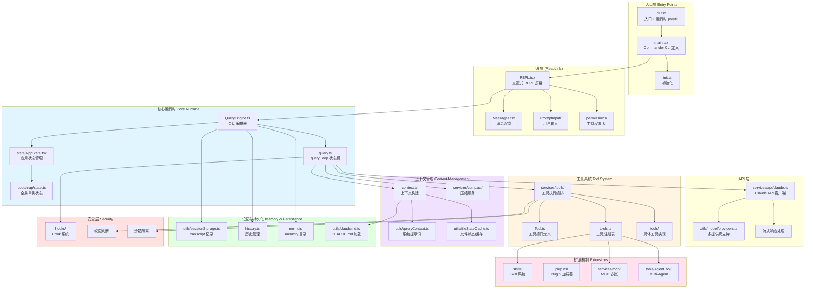
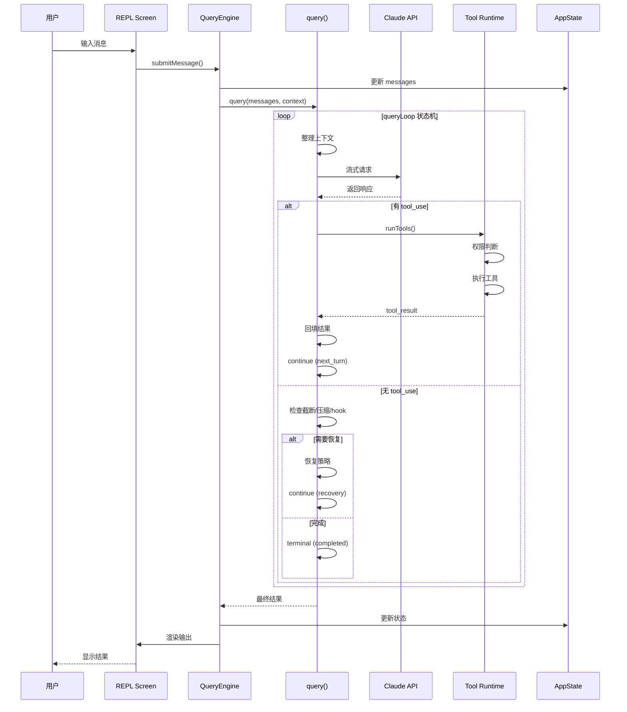
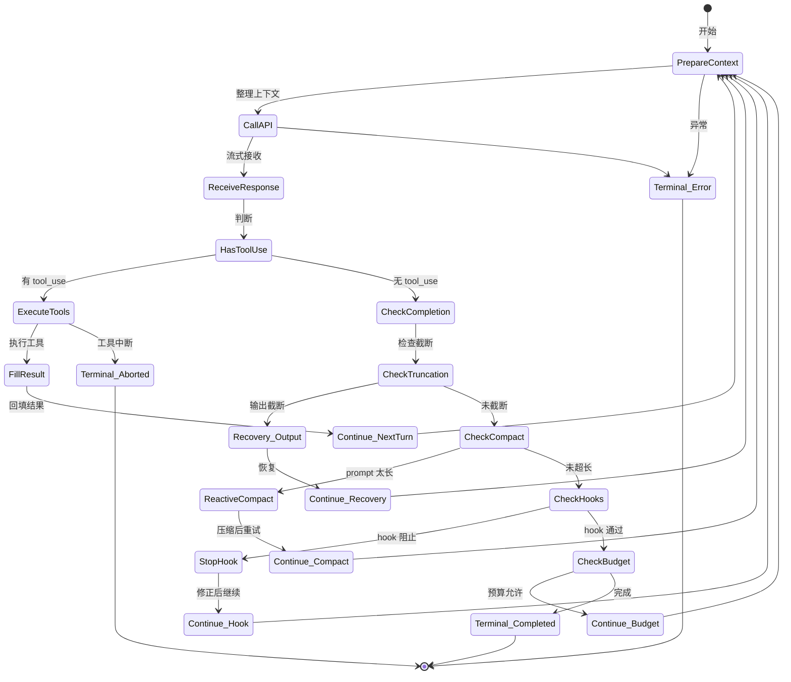
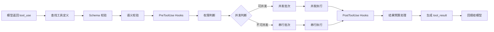
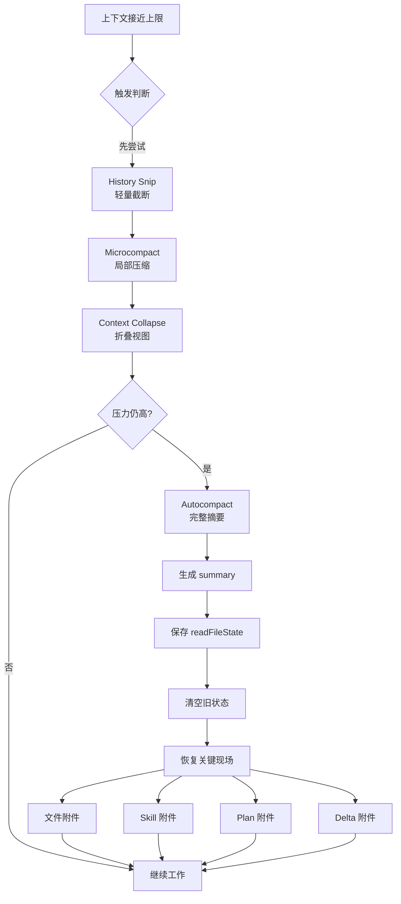

# Claude Code Agent Runtime 架构图

> 基于源码整理的架构图，展示核心运行时组件及其关系

## 整体架构

## 核心数据流

## 关键模块说明

### 1. 入口层 (Entry Points)

| 文件 | 职责 |
|------|------|
| `cli.tsx` | 真正入口，注入运行时 polyfill（feature()、MACRO、全局变量） |
| `main.tsx` | Commander.js CLI 定义，解析参数，初始化服务 |
| `init.ts` | 一次性初始化（遥测、配置、信任对话框） |

### 2. 核心运行时 (Core Runtime)

| 文件 | 职责 |
|------|------|
| `QueryEngine.ts` | 会话级编排器，管理 conversation 状态、压缩、文件历史、归因 |
| `query.ts` | 主 API 查询函数，实现 queryLoop 状态机 |
| `state/AppState.tsx` | 中央应用状态（messages、tools、permissions、MCP 连接） |
| `bootstrap/state.ts` | 模块级单例（session ID、CWD、token 计数） |

### 3. UI 层 (React/Ink)

| 目录/文件 | 职责 |
|------|------|
| `screens/REPL.tsx` | 交互式 REPL 屏幕，处理用户输入和消息显示 |
| `components/Messages.tsx` | 对话消息渲染 |
| `components/PromptInput/` | 用户输入处理 |
| `components/permissions/` | 工具权限审批 UI |
| `ink/` | 自定义 Ink 框架（forked） |

### 4. API 层

| 文件 | 职责 |
|------|------|
| `services/api/claude.ts` | 核心 API 客户端，构建请求参数，调用流式端点 |
| `utils/model/providers.ts` | 多提供商支持（Anthropic、AWS Bedrock、Google Vertex、Azure） |

### 5. 工具系统 (Tool System)

| 文件/目录 | 职责 |
|------|------|
| `Tool.ts` | 工具接口定义（name、description、inputSchema、call） |
| `tools.ts` | 工具注册表，组装工具列表 |
| `services/tools/toolOrchestration.ts` | 工具执行编排（runTools） |
| `services/tools/StreamingToolExecutor.ts` | 流式工具执行器 |
| `tools/<ToolName>/` | 具体工具实现（BashTool、FileEditTool、GrepTool、AgentTool 等） |

### 6. 上下文管理 (Context Management)

| 文件/目录 | 职责 |
|------|------|
| `context.ts` | 构建 system/user context（git status、日期、CLAUDE.md、memory） |
| `utils/queryContext.ts` | 获取系统提示词部分 |
| `services/compact/` | 压缩服务（autoCompact、reactiveCompact、microcompact） |
| `utils/fileStateCache.ts` | 文件状态缓存（模型读过哪些文件） |
| `utils/api.ts` | prependUserContext、appendSystemContext |

### 7. 记忆与持久化 (Memory & Persistence)

| 文件/目录 | 职责 |
|------|------|
| `utils/sessionStorage.ts` | transcript 记录和恢复 |
| `history.ts` | 历史管理 |
| `memdir/` | memory 目录管理 |
| `utils/claudemd.ts` | 发现和加载 CLAUDE.md 文件 |

### 8. 扩展机制 (Extensions)

| 目录 | 职责 |
|------|------|
| `skills/` | Skill 系统（按需加载专业指令） |
| `plugins/` | Plugin 加载器（外部能力包） |
| `services/mcp/` | MCP 协议实现（外部工具接入） |
| `tools/AgentTool/` | Multi-Agent 支持（子 Agent 派生） |

### 9. 安全层 (Security)

| 目录 | 职责 |
|------|------|
| `hooks/` | Hook 系统（PreToolUse、PostToolUse、Stop hooks） |
| 权限判断 | 工具执行前的权限检查 |
| 沙箱隔离 | 限制本地执行风险 |

## queryLoop 状态机

## Continue Reason 和 Terminal Reason

### Continue Reason（继续原因）

| Reason | 场景 | 含义 |
|--------|------|------|
| `next_turn` | 模型返回工具调用 | 工具结果已回来，继续让模型判断下一步 |
| `reactive_compact_retry` | prompt 太长 | 压缩后重试 |
| `max_output_tokens_recovery` | 输出被截断 | 注入续写提示，让模型继续 |
| `stop_hook_blocking` | hook 要求修正 | 把阻塞原因交给模型 |
| `token_budget_continuation` | 预算还够 | 鼓励模型继续完成 |

### Terminal Reason（终止原因）

| Reason | 含义 |
|--------|------|
| `completed` | 正常完成 |
| `prompt_too_long` | prompt 太长且恢复失败 |
| `model_error` | 模型调用异常 |
| `aborted_tools` | 工具执行被中断 |
| `hook_stopped` | hook 阻止后续继续 |
| `max_turns` | 达到最大轮次 |

## 工具执行链路

## 压缩与恢复

## 技术栈

- **运行时**: Bun (非 Node.js)
- **构建**: `bun build` 单文件打包
- **模块系统**: ESM + TSX
- **UI 框架**: React + 自定义 Ink (Terminal UI)
- **状态管理**: Zustand-style store
- **API 客户端**: Anthropic SDK
- **类型系统**: TypeScript (有 ~1341 个 tsc 错误，但不影响运行)

## 关键设计原则

1. **状态迁移显式化** - 每次 continue 和 terminal 都有明确的 reason
2. **失败可恢复** - 不同失败原因有不同恢复策略
3. **上下文生命周期管理** - Context、Memory、Compression、Cache 协同工作
4. **工具执行链** - Schema → Hooks → Permission → Concurrency → Execution → Budget
5. **多层安全防线** - Prompt → Context → Tool → Permission → Hooks → Sandbox
6. **按需扩展** - Skill、Plugin、MCP、Multi-Agent 按需加载
7. **长任务不断线** - Recovery、Resume、Fallback、Restoration 保证连续性
