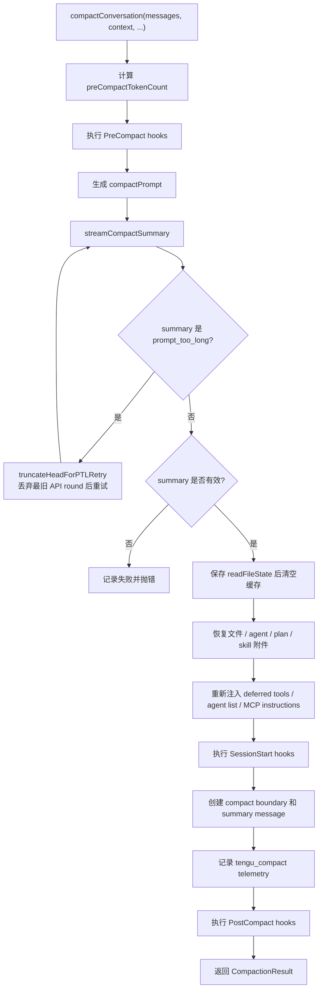
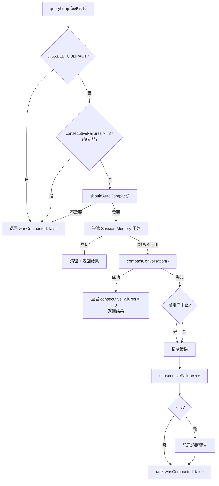

# Claude Code 自动压缩：上下文何时以及如何被压缩

## 4.1 前言：自动压缩解决什么问题

每一个 Claude Code 的长会话用户都经历过这个时刻：你正在让模型逐步重构一个复杂模块，突然发现它变得“健忘”了。它可能忘记五分钟前你明确要求保留的接口签名，或者重新建议你已经否决过的方案。

这通常不是模型突然变笨，而是上下文窗口接近上限，自动压缩刚刚发生。

压缩（compaction）是 Claude Code 上下文管理的核心机制。它决定了：

- 对话历史在什么时候被压缩；
- 被压缩时用什么提示词生成摘要；
- 压缩后哪些消息、文件和附件会被保留；
- 压缩失败时系统如何恢复；
- 用户如何通过 `/compact`、环境变量和压缩指令影响结果。

这一章的目录按“压缩生命周期”重新组织：

```text
何时触发
  -> 阈值计算与前置守卫
如何避免无限失败
  -> 连续失败熔断器
如何生成摘要
  -> 三种压缩提示词与 9 段模板
如何执行压缩
  -> compactConversation 主流程与消息重组
压缩请求本身太长怎么办
  -> PTL retry
每轮如何编排
  -> autoCompactIfNeeded
用户能做什么
  -> /compact、CLAUDE.md、环境变量、熔断恢复
设计原则
  -> 多层缓冲、渐进降级、可观测、用户可控
```

可以先记住一句话：

> 自动压缩不是简单地“把旧消息总结一下”，而是一套带阈值、缓冲、提示词模板、附件恢复、PTL 重试和熔断保护的上下文生命周期管理系统。

## 4.2 触发判定：什么时候自动压缩

自动压缩的触发条件可以用一个不等式表达：

```text
当前 token 数 >= autoCompactThreshold
```

关键在于 `autoCompactThreshold` 不是模型上下文窗口本身，而是经过两层扣减后的安全阈值。

源码位置：

- `src/services/compact/autoCompact.ts`

### 4.2.1 第一层：有效上下文窗口

第一层扣减是为压缩摘要输出预留空间。

原始代码如下：

```ts
// services/compact/autoCompact.ts:30
const MAX_OUTPUT_TOKENS_FOR_SUMMARY = 20_000

// services/compact/autoCompact.ts:33-48
export function getEffectiveContextWindowSize(model: string): number {
  const reservedTokensForSummary = Math.min(
    getMaxOutputTokensForModel(model),
    MAX_OUTPUT_TOKENS_FOR_SUMMARY,
  )
  let contextWindow = getContextWindowForModel(model, getSdkBetas())

  const autoCompactWindow = process.env.CLAUDE_CODE_AUTO_COMPACT_WINDOW
  if (autoCompactWindow) {
    const parsed = parseInt(autoCompactWindow, 10)
    if (!isNaN(parsed) && parsed > 0) {
      contextWindow = Math.min(contextWindow, parsed)
    }
  }

  return contextWindow - reservedTokensForSummary
}
```

这里做了两件事。

第一，预留压缩摘要输出空间：

```text
reservedTokensForSummary =
  min(model max output tokens, 20_000)
```

`MAX_OUTPUT_TOKENS_FOR_SUMMARY = 20_000` 来自实际压缩输出统计。源码注释写的是 p99.99 compact summary output 为 17,387 tokens，所以 20K 是带安全余量的上界。

第二，允许用环境变量缩小上下文窗口：

```text
CLAUDE_CODE_AUTO_COMPACT_WINDOW
```

注意这里使用 `Math.min(contextWindow, parsed)`。也就是说，这个变量只能缩小窗口，不能扩大模型真实窗口。它适合测试或 CI 场景：人为降低窗口，让压缩更频繁触发。

### 4.2.2 第二层：自动压缩缓冲区

第二层扣减是为触发到执行之间的额外增长留缓冲。

原始代码如下：

```ts
// services/compact/autoCompact.ts:62
export const AUTOCOMPACT_BUFFER_TOKENS = 13_000

// services/compact/autoCompact.ts:72-91
export function getAutoCompactThreshold(model: string): number {
  const effectiveContextWindow = getEffectiveContextWindowSize(model)
  const autocompactThreshold =
    effectiveContextWindow - AUTOCOMPACT_BUFFER_TOKENS

  const envPercent = process.env.CLAUDE_AUTOCOMPACT_PCT_OVERRIDE
  if (envPercent) {
    const parsed = parseFloat(envPercent)
    if (!isNaN(parsed) && parsed > 0 && parsed <= 100) {
      const percentageThreshold = Math.floor(
        effectiveContextWindow * (parsed / 100),
      )
      return Math.min(percentageThreshold, autocompactThreshold)
    }
  }

  return autocompactThreshold
}
```

核心公式是：

```text
autoCompactThreshold =
  effectiveContextWindow - AUTOCOMPACT_BUFFER_TOKENS
```

`AUTOCOMPACT_BUFFER_TOKENS = 13_000` 是压缩前的额外安全区。它防止出现这种情况：刚判断需要压缩，当前轮又产生新的工具结果、系统消息或附件，导致压缩请求本身溢出。

### 4.2.3 以 200K 上下文窗口为例

以 Claude Sonnet 4 的 200K 上下文窗口为例，默认计算可以写成：

| 项目 | 数值 | 说明 |
| --- | ---: | --- |
| 原始上下文窗口 | 200,000 | 模型窗口 |
| 压缩输出预留 | 20,000 | `MAX_OUTPUT_TOKENS_FOR_SUMMARY` |
| 有效上下文窗口 | 180,000 | 200K - 20K |
| 自动压缩缓冲 | 13,000 | `AUTOCOMPACT_BUFFER_TOKENS` |
| 自动压缩阈值 | 167,000 | 180K - 13K |

直观表达：

```text
|<------------ 200K 上下文窗口 ------------>|
|<---- 167K 可用 ---->|<- 13K 缓冲 ->|<- 20K 压缩输出预留 ->|
                      ^               ^
                自动压缩触发点     有效窗口边界
```

所以在默认配置下，大约使用到 83.5% 上下文窗口时，自动压缩会触发。

### 4.2.4 环境变量覆盖

Claude Code 提供两个环境变量影响阈值。

第一个是 `CLAUDE_CODE_AUTO_COMPACT_WINDOW`：

```ts
// services/compact/autoCompact.ts:40-46
const autoCompactWindow = process.env.CLAUDE_CODE_AUTO_COMPACT_WINDOW
if (autoCompactWindow) {
  const parsed = parseInt(autoCompactWindow, 10)
  if (!isNaN(parsed) && parsed > 0) {
    contextWindow = Math.min(contextWindow, parsed)
  }
}
```

它覆盖的是“可见窗口大小”，并且只能缩小窗口。

第二个是 `CLAUDE_AUTOCOMPACT_PCT_OVERRIDE`：

```ts
// services/compact/autoCompact.ts:79-87
const envPercent = process.env.CLAUDE_AUTOCOMPACT_PCT_OVERRIDE
if (envPercent) {
  const parsed = parseFloat(envPercent)
  if (!isNaN(parsed) && parsed > 0 && parsed <= 100) {
    const percentageThreshold = Math.floor(
      effectiveContextWindow * (parsed / 100),
    )
    return Math.min(percentageThreshold, autocompactThreshold)
  }
}
```

例如设置：

```bash
export CLAUDE_AUTOCOMPACT_PCT_OVERRIDE=50
```

会让压缩在有效窗口的 50% 处触发。但同样使用 `Math.min`，所以它只能让压缩更早触发，不能推迟到默认阈值之后。

### 4.2.5 `shouldAutoCompact()` 的前置守卫

真正判断是否压缩的是 `shouldAutoCompact()`。在比较 token 数之前，它会先经过一组守卫：

```text
shouldAutoCompact(messages, model, querySource)
  │
  ├─ querySource 是 'session_memory' 或 'compact'？ → false（防递归）
  ├─ querySource 是 'marble_origami'（ctx-agent）？ → false（防共享状态污染）
  ├─ isAutoCompactEnabled() 返回 false？ → false
  │   ├─ DISABLE_COMPACT 环境变量为 truthy？ → false
  │   ├─ DISABLE_AUTO_COMPACT 环境变量为 truthy？ → false
  │   └─ 用户配置 autoCompactEnabled = false？ → false
  ├─ REACTIVE_COMPACT 实验模式激活？ → false（让 reactive compact 接管）
  ├─ Context Collapse 激活？ → false（collapse 拥有自己的上下文管理）
  │
  └─ tokenCount >= autoCompactThreshold？ → true/false
```

这里最重要的是：自动压缩不是只看 token 数。它还必须确认当前 query source 不会递归、没有被用户或配置禁用、没有被其他上下文管理机制接管。

Context Collapse 的处理尤其值得注意。源码注释说明，autocompact 会在有效窗口约 93% 处触发，而 Context Collapse 在 90% 开始提交、95% 执行阻塞。如果两者同时运行，autocompact 会抢跑并销毁 Collapse 正准备保存的细粒度上下文。因此 Collapse 开启时，主动 autocompact 被禁用，只保留 reactive compact 作为 413 兜底。

## 4.3 熔断器：连续失败保护

触发压缩不代表压缩一定能救回来。某些会话中，压缩后的上下文仍然超过阈值，下一轮又会立即触发压缩。如果这种失败持续发生，就会形成无限压缩循环。

Claude Code 为此加了熔断器。

源码位置：

- `src/services/compact/autoCompact.ts`

### 4.3.1 问题背景

源码注释记录了真实规模数据：

```ts
// services/compact/autoCompact.ts:68-69
BQ 2026-03-10: 1,279 sessions had 50+ consecutive failures (up to 3,272) in a single session, wasting ~250K API calls/day globally.
```

这说明连续压缩失败不是边缘情况，而是会造成全局 API 浪费的系统性问题。

### 4.3.2 熔断器实现

熔断阈值是 3 次：

```ts
// services/compact/autoCompact.ts:70
const MAX_CONSECUTIVE_AUTOCOMPACT_FAILURES = 3
```

入口处先检查：

```ts
// services/compact/autoCompact.ts:257-265
if (
  tracking?.consecutiveFailures !== undefined &&
  tracking.consecutiveFailures >= MAX_CONSECUTIVE_AUTOCOMPACT_FAILURES
) {
  return { wasCompacted: false }
}
```

追踪状态通过 `AutoCompactTrackingState` 在线程循环中传递：

```ts
// services/compact/autoCompact.ts:51-60
export type AutoCompactTrackingState = {
  compacted: boolean
  turnCounter: number
  turnId: string
  consecutiveFailures?: number  // 熔断器计数器
}
```

行为规则很简单：

- 压缩成功：`consecutiveFailures` 重置为 0；
- 压缩失败：`consecutiveFailures++`；
- 连续失败达到 3 次：后续自动压缩直接跳过。

这个设计体现了一个工程判断：

> 宁可让用户手动执行 `/compact` 或开启新会话，也不要让系统用注定失败的重试浪费 API 预算。

熔断器只阻止自动压缩，不等于彻底禁用手动 `/compact`。

## 4.4 压缩提示词：摘要如何生成

当阈值触发后，Claude Code 会向模型发送一条特殊提示词，要求它把对话历史压缩成结构化摘要。

压缩质量很大程度上取决于这条提示词。

源码位置：

- `src/services/compact/prompt.ts`

### 4.4.1 三种压缩提示词变体

源码中定义了三种压缩提示词：

| 变体 | 对应场景 | 摘要视野 |
| --- | --- | --- |
| `BASE_COMPACT_PROMPT` | 全量传统压缩 | 总结整个 conversation so far |
| `PARTIAL_COMPACT_PROMPT` | 从某个位置之后压缩 | 只总结 recent messages |
| `PARTIAL_COMPACT_UP_TO_PROMPT` | 总结某个位置之前，后续消息保留 | 为 continuing session 提供前缀上下文 |

三者的差异可以用原始提示词开头看出来：

```text
BASE:
Your task is to create a detailed summary of the conversation so far

PARTIAL:
Your task is to create a detailed summary of the RECENT portion of the conversation — the messages that follow earlier retained context

PARTIAL_UP_TO:
This summary will be placed at the start of a continuing session; newer messages that build on this context will follow after your summary
```

也就是说，BASE 是“总结全部”，PARTIAL 是“总结新增部分”，PARTIAL_UP_TO 是“总结前缀，给后续保留消息铺垫上下文”。

### 4.4.2 9 段摘要模板

以 `BASE_COMPACT_PROMPT` 为例，摘要要求包含 9 个部分：

| 段落 | 名称 | 保留的信息 |
| --- | --- | --- |
| 1 | Primary Request and Intent | 用户明确请求与意图 |
| 2 | Key Technical Concepts | 技术概念、框架、架构点 |
| 3 | Files and Code Sections | 文件、代码片段、读写原因 |
| 4 | Errors and fixes | 错误、修复、用户反馈 |
| 5 | Problem Solving | 已解决问题和仍在排查的问题 |
| 6 | All user messages | 非工具结果的所有用户消息 |
| 7 | Pending Tasks | 明确要求但尚未完成的任务 |
| 8 | Current Work | 压缩前正在做什么 |
| 9 | Optional Next Step | 下一步，并要求贴近最近请求 |

这里的设计目标很明确：压缩不是普通摘要，而是为继续开发工作保留足够上下文。因此它特别强调：

- 文件名；
- full code snippets；
- function signatures；
- file edits；
- errors and fixes；
- user feedback；
- most recent work；
- direct quotes。

### 4.4.3 `<analysis>` 草稿块：质量保证但不进入后续上下文

压缩提示词要求模型先输出 `<analysis>` 块。

原始代码如下：

```ts
// prompt.ts:31-44
const DETAILED_ANALYSIS_INSTRUCTION_BASE = `Before providing your final summary,
wrap your analysis in <analysis> tags to organize your thoughts and ensure
you've covered all necessary points. In your analysis process:

1. Chronologically analyze each message and section of the conversation.
   For each section thoroughly identify:
   - The user's explicit requests and intents
   - Your approach to addressing the user's requests
   - Key decisions, technical concepts and code patterns
   - Specific details like:
     - file names
     - full code snippets
     - function signatures
     - file edits
   - Errors that you ran into and how you fixed them
   - Pay special attention to specific user feedback...
2. Double-check for technical accuracy and completeness...`
```

`<analysis>` 块的作用是让模型先按时间顺序整理对话，再生成最终摘要。关键词是：

```text
Chronologically analyze each message
```

这能减少跳跃式总结造成的遗漏。

但这个草稿块不会进入压缩后的上下文。`formatCompactSummary()` 会剥离它：

```ts
// prompt.ts:316-319
formattedSummary = formattedSummary.replace(
  /<analysis>[\s\S]*?<\/analysis>/,
  '',
)
```

这是一种“用草稿提升质量，但不把草稿留在上下文里”的设计。草稿只消耗压缩调用的输出 token，不污染后续会话。

### 4.4.4 `NO_TOOLS_PREAMBLE`：压缩时禁止工具调用

压缩请求只允许一轮响应。如果模型在压缩时调用工具，工具调用会被拒绝，导致没有摘要文本，压缩失败。

所以所有压缩提示词前面都加了强硬前言：

```ts
// prompt.ts:19-26
const NO_TOOLS_PREAMBLE = `CRITICAL: Respond with TEXT ONLY. Do NOT call any tools.

- Do NOT use Read, Bash, Grep, Glob, Edit, Write, or ANY other tool.
- You already have all the context you need in the conversation above.
- Tool calls will be REJECTED and will waste your only turn — you will fail the task.
- Your entire response must be plain text: an <analysis> block followed by a <summary> block.
`
```

结尾还有 trailer：

```ts
const NO_TOOLS_TRAILER =
  '\n\nREMINDER: Do NOT call any tools. Respond with plain text only — ' +
  'an <analysis> block followed by a <summary> block. ' +
  'Tool calls will be rejected and you will fail the task.'
```

首尾双重提醒是为了防止长提示词中前面的禁令被注意力稀释。

源码注释还记录了这个问题的规模：弱提醒在 Sonnet 4.6 上会导致工具调用失败路径达到 2.79%，而更强的 preamble 可以把这个问题压下去。

### 4.4.5 自定义压缩指令如何进入提示词

`getCompactPrompt()` 和 `getPartialCompactPrompt()` 都会把用户或 hook 提供的自定义指令追加到提示词末尾：

```ts
if (customInstructions && customInstructions.trim() !== '') {
  prompt += `\n\nAdditional Instructions:\n${customInstructions}`
}
```

这解释了为什么手动 `/compact 重点保留某些信息` 是有效的：这些文字会直接进入压缩提示词，影响摘要的选择性。

## 4.5 压缩执行流程：`compactConversation()`

`compactConversation()` 是传统压缩的核心编排器。

源码位置：

- `src/services/compact/compact.ts:389-704`

### 4.5.1 主流程概览

可以把它理解为以下流程：



### 4.5.2 先忘后想起：文件上下文恢复

压缩后，代码会清空 `readFileState` 和 `loadedNestedMemoryPaths`：

```text
context.readFileState.clear()
context.loadedNestedMemoryPaths?.clear()
```

但它不是完全丢掉文件上下文，而是先保存压缩前的文件读取状态，再通过 `createPostCompactFileAttachments()` 恢复最重要的文件。

原稿中的关键预算是：

```text
文件恢复预算：最多 5 个文件，总计 50,000 tokens，单文件上限 5,000 tokens。
```

源码常量对应：

```text
POST_COMPACT_MAX_FILES_TO_RESTORE = 5
POST_COMPACT_TOKEN_BUDGET = 50_000
POST_COMPACT_MAX_TOKENS_PER_FILE = 5_000
```

这是一种“先忘后想起”的策略：

```text
不要指望摘要完整保留所有文件内容；
压缩后重新注入最近且重要的文件内容更确定。
```

### 4.5.3 附件重新注入

压缩会吃掉之前的 delta 附件，例如：

- deferred tool declarations；
- agent list；
- MCP instructions；
- plan file；
- invoked skills；
- async agent attachments；
- SessionStart hook results。

所以 `compactConversation()` 会在压缩后重新生成这些附件，确保模型在压缩后的第一轮仍然知道当前可用工具和运行时指令。

这和前几篇的缓存边界思想一致：摘要不是唯一上下文来源，压缩后还要用结构化附件重新补齐运行时状态。

### 4.5.4 压缩后的消息结构

最终消息数组由 `buildPostCompactMessages()` 组装：

```ts
// compact.ts:330-338
[boundaryMarker, ...summaryMessages, ...messagesToKeep, ...attachments, ...hookResults]
```

各部分含义如下：

| 部分 | 作用 |
| --- | --- |
| `boundaryMarker` | 标记压缩发生的位置 |
| `summaryMessages` | 以 user message 形式注入摘要 |
| `messagesToKeep` | 部分压缩时保留的原始消息 |
| `attachments` | 文件、计划、技能、工具、MCP 等附件 |
| `hookResults` | SessionStart hooks 的结果 |

摘要消息会带一个前言：

```text
This session is being continued from a previous conversation that ran out of context.
```

如果设置 `suppressFollowUpQuestions`，还会要求模型直接继续，不要复述摘要或问用户下一步。

## 4.6 PTL 重试：压缩请求本身也太长怎么办

PTL 指的是 `prompt_too_long`。这是一种递归问题：

```text
对话太长，需要压缩；
但压缩请求本身也太长，发不进 API。
```

Claude Code 的兜底策略是：丢弃最旧的 API round，然后重试压缩。

源码位置：

- `src/services/compact/compact.ts:230-291`
- `src/services/compact/grouping.ts:22-63`

### 4.6.1 重试入口与上限

相关常量：

```ts
const MAX_PTL_RETRIES = 3
const PTL_RETRY_MARKER = '[earlier conversation truncated for compaction retry]'
```

最多重试 3 次。超过后抛出：

```ts
export const ERROR_MESSAGE_PROMPT_TOO_LONG =
  'Conversation too long. Press esc twice to go up a few messages and try again.'
```

### 4.6.2 第一步：按 API round 分组

原始代码：

```ts
// compact.ts:257
const groups = groupMessagesByApiRound(input)
```

`groupMessagesByApiRound()` 会按 API 轮次边界分组：

```ts
// grouping.ts:22-60
export function groupMessagesByApiRound(messages: Message[]): Message[][] {
  const groups: Message[][] = []
  let current: Message[] = []
  let lastAssistantId: string | undefined

  for (const msg of messages) {
    if (
      msg.type === 'assistant' &&
      msg.message.id !== lastAssistantId &&
      current.length > 0
    ) {
      groups.push(current)
      current = [msg]
    } else {
      current.push(msg)
    }
    if (msg.type === 'assistant') {
      lastAssistantId = msg.message.id
    }
  }

  if (current.length > 0) {
    groups.push(current)
  }
  return groups
}
```

为什么按 API round 分组，而不是按用户轮次？

因为一个人类用户请求可能触发多个 assistant/tool 往返。按 API round 切更细，也更安全：不会轻易拆散一个 `tool_use` 与对应 `tool_result`。

### 4.6.3 第二步：计算丢弃多少旧内容

原始逻辑：

```ts
// compact.ts:260-272
const tokenGap = getPromptTooLongTokenGap(ptlResponse)
let dropCount: number
if (tokenGap !== undefined) {
  let acc = 0
  dropCount = 0
  for (const g of groups) {
    acc += roughTokenCountEstimationForMessages(g)
    dropCount++
    if (acc >= tokenGap) break
  }
} else {
  dropCount = Math.max(1, Math.floor(groups.length * 0.2))
}
```

如果 API 返回了具体 token gap，就从最旧的组开始累加，直到覆盖差额。

如果无法解析差额，就退回到启发式：丢弃 20% 的组。

### 4.6.4 第三步：修复 assistant-first 序列

丢掉最旧组后，剩余消息可能以 assistant 开头，而 API 要求第一条消息必须是 user。

所以代码会插入合成 user marker：

```ts
// compact.ts:278-291
const sliced = groups.slice(dropCount).flat()
if (sliced[0]?.type === 'assistant') {
  return [
    createUserMessage({ content: PTL_RETRY_MARKER, isMeta: true }),
    ...sliced,
  ]
}
return sliced
```

### 4.6.5 防止 marker 累积

重试前会先剥离上一次插入的 marker：

```ts
// compact.ts:250-255
const input =
  messages[0]?.type === 'user' &&
  messages[0].isMeta &&
  messages[0].message.content === PTL_RETRY_MARKER
    ? messages.slice(1)
    : messages
```

这个细节很重要。否则第二次重试时，20% 回退策略可能只丢弃上一次插入的 marker，然后又重新加回来，导致零进展循环。

### 4.6.6 同步更新 cache-safe 参数

每次 PTL retry 截断消息后，还会更新 `cacheSafeParams`：

```ts
retryCacheSafeParams = {
  ...retryCacheSafeParams,
  forkContextMessages: truncated,
}
```

原因是压缩摘要可能走 forked-agent/cache-sharing 路径。如果只更新 `messagesToSummarize`，但 fork path 仍然读旧的 `forkContextMessages`，重试就不会真正生效。

## 4.7 `autoCompactIfNeeded()`：每轮入口如何编排

`autoCompactIfNeeded()` 是 query loop 每轮迭代中调用的入口。它把阈值判定、Session Memory、传统压缩和熔断器串在一起。

源码位置：

- `src/services/compact/autoCompact.ts:241-351`

完整流程可以画成：



这里有一个优先级值得注意：代码先尝试 Session Memory 压缩，只有 Session Memory 不可用或无法释放足够空间时，才回退到传统的 `compactConversation()`。

这体现了渐进降级：

```text
Session Memory 压缩
  -> 传统摘要压缩
  -> PTL retry
  -> 熔断
```

## 4.8 手动 `/compact` 与用户控制

自动压缩是系统自己触发的，但用户也可以主动通过 `/compact` 介入。

源码位置：

- `src/commands/compact/compact.ts`

### 4.8.1 手动压缩与自动压缩的区别

手动 `/compact` 会读取命令参数作为自定义指令：

```ts
const customInstructions = args.trim()
```

这些指令最终会传入 `compactConversation()`，并追加到压缩提示词的 `Additional Instructions` 后面。

自动压缩则传：

```ts
undefined, // No custom instructions for autocompact
true, // isAutoCompact
```

所以手动压缩的一个重要价值是：你可以告诉摘要模型重点保留什么。

### 4.8.2 用户可以怎么做

**提前手动压缩。**

不要总等自动压缩触发。完成一个子任务、准备开始下一个子任务时，可以主动执行：

```text
/compact 重点保留文件修改历史和错误修复记录，代码片段要完整
```

这类指令会影响摘要内容。

**在 CLAUDE.md 中写压缩指令。**

原稿建议的写法：

```markdown
## Compact Instructions
When summarizing the conversation focus on typescript code changes
and also remember the mistakes you made and how you fixed them.
```

这类指令会在压缩提示词中作为额外 summarization instructions 被模型看到。

**用环境变量让压缩更早触发。**

```bash
# 让压缩在 70% 时就触发（更保守，更少 PTL 错误）
export CLAUDE_AUTOCOMPACT_PCT_OVERRIDE=70

# 或者直接限制"可见窗口"为 100K（适合网络慢/预算紧张的场景）
export CLAUDE_CODE_AUTO_COMPACT_WINDOW=100000
```

**禁用自动压缩。**

```bash
# 只禁用自动压缩，保留手动 /compact
export DISABLE_AUTO_COMPACT=1

# 完全禁用所有压缩（包括手动）
export DISABLE_COMPACT=1
```

完全禁用不推荐。它意味着你需要自己管理上下文，否则可能遇到无法恢复的 `prompt_too_long`。

### 4.8.3 如何理解压缩后的“遗忘”

压缩后最容易丢的信息通常是：

1. 精确代码差异，尤其是很长的 diff；
2. 被否决方案的具体原因；
3. 早期对话里只提过一次的偏好；
4. 非当前任务主线的细枝末节。

应对方式是：

- 把长期约束写进 `CLAUDE.md`；
- 手动 `/compact` 时明确要求保留；
- 关键接口、决策和错误修复不要只在早期对话里口头提一次；
- 压缩后发现模型忘了关键约束，直接补充它，不要指望摘要一定保留。

### 4.8.4 熔断后的恢复

如果自动压缩连续失败达到熔断阈值，后续自动压缩会跳过。

你可以：

1. 手动执行 `/compact`，加上更明确的保留/舍弃指令；
2. 如果仍然失败，开启新会话；
3. 将关键长期约束放入 `CLAUDE.md`，减少依赖会话摘要。

## 4.9 目录结构优化说明

原稿按机制顺序展开，信息完整，但章节层级有两个可读性问题：

1. 所有内容都在 `1.x` 下，和系列文档前几篇的编号不连贯；
2. “阈值、熔断、提示词、执行、PTL、入口、用户操作”都很重要，但原目录没有先告诉读者它们共同构成压缩生命周期。

本篇改成 `4.x`，并按压缩生命周期组织：

| 新章节 | 读者问题 |
| --- | --- |
| 4.1 前言 | 自动压缩到底解决什么问题 |
| 4.2 触发判定 | 什么时候压缩 |
| 4.3 熔断器 | 连续失败怎么办 |
| 4.4 压缩提示词 | 摘要如何生成 |
| 4.5 执行流程 | 压缩如何落地到消息结构 |
| 4.6 PTL 重试 | 压缩请求本身太长怎么办 |
| 4.7 每轮入口 | query loop 如何编排 |
| 4.8 用户控制 | 用户能做什么 |
| 4.9 目录说明 | 为什么这样重排 |
| 4.10 小结 | 提炼设计原则 |

这样读者只看目录，就能知道自动压缩是一套从“触发”到“恢复”的完整系统，而不是一个单点函数。

## 4.10 小结：自动压缩的设计原则

自动压缩体现了几个重要的工程原则。

第一，**多层缓冲**。

20K 输出预留、13K 自动压缩缓冲、3K manual compact blocking buffer，共同避免系统在临界点溢出。
这里的 3K 指 `MANUAL_COMPACT_BUFFER_TOKENS`，用于手动压缩和阻塞保护相关路径，不参与 4.2 中 `autoCompactThreshold` 的两层减法主公式。

第二，**渐进降级**。

Session Memory 压缩优先，传统压缩兜底；传统压缩遇到 PTL 时截断旧 API round 重试；连续失败后熔断。

第三，**摘要不是唯一恢复手段**。

压缩后还会恢复文件附件、plan、skill、deferred tools、agent list、MCP instructions 和 hook results。真正的后压缩上下文是“摘要 + 结构化附件”的组合。

第四，**压缩提示词本身是工程资产**。

9 段模板、`<analysis>` 草稿块、NO_TOOLS 首尾禁令、自定义指令入口，都直接影响压缩质量。

第五，**用户仍然有控制权**。

用户可以提前 `/compact`、传入自定义压缩指令、在 `CLAUDE.md` 中写 Compact Instructions、通过环境变量提前触发或禁用自动压缩。

最后用一句话总结：

> Claude Code 的自动压缩不是单纯的摘要功能，而是一个上下文生命周期管理器：它先用阈值和缓冲决定何时压缩，再用专门提示词生成结构化摘要，随后恢复关键附件和工具上下文；当压缩失败时，通过 PTL retry 和熔断器保证系统不会陷入无限重试。
