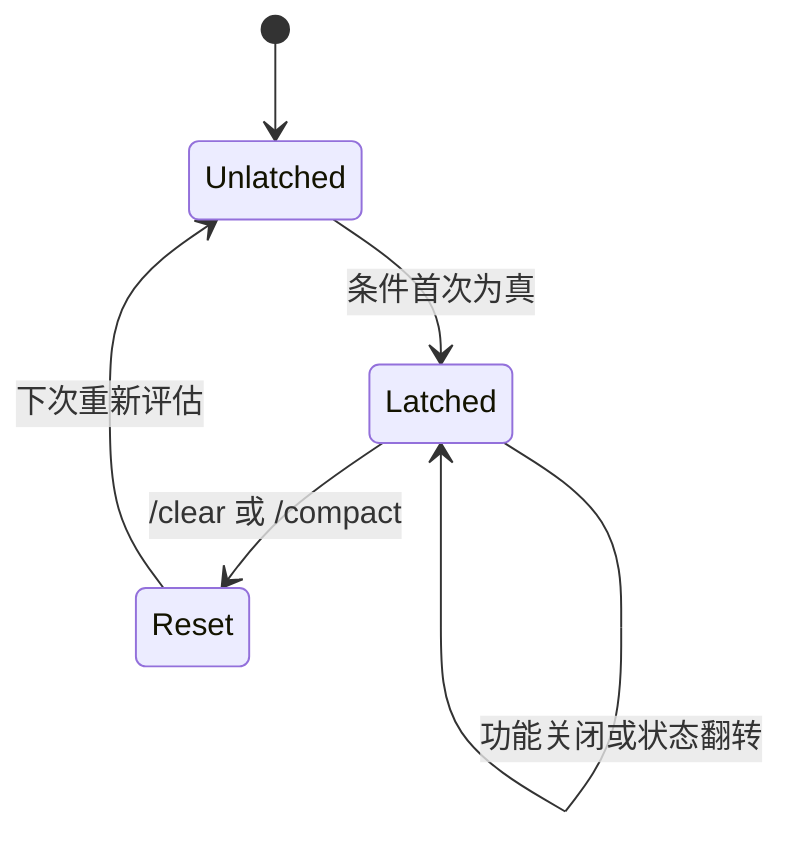

# Claude Code 缓存架构与断点设计

## 7.1 前言：缓存架构解决什么问题

Anthropic 的 Prompt Caching 依赖严格的前缀匹配：如果 API 请求的前缀与之前请求完全一致，服务端可以复用已缓存的 KV 状态；如果中间任何一个字节变化，缓存就会从变化点断开。

这带来一个非常工程化的约束：

```text
缓存收益来自稳定前缀
但 Claude Code 的请求里有大量会变化的内容
```

系统提示词会随模式、工具、MCP、记忆文件变化；工具定义会随 MCP 和插件变化；beta header、TTL、scope、effort、extra body 都可能影响服务端缓存键。

所以本章的主线是：

```text
前缀必须稳定
  -> 先用 cache_control 标出缓存断点
  -> 再用 global / org / null 分配缓存范围
  -> 用 5m / 1h TTL 控制缓存寿命
  -> 用锁存机制防止会话中途翻转
  -> 最后让缓存中断检测系统验证这些设计是否有效
```

第 8 章会讲缓存中断检测系统。本章只讲它的上游：Claude Code 如何设计缓存结构，尽量避免中断发生。

## 7.2 Prompt Caching 的基本模型

### 7.2.1 前缀匹配模型

从缓存视角看，API 请求可以粗略理解为一个序列：

```text
[系统提示词] -> [工具定义] -> [消息历史]
```

越靠前的内容越关键。

系统提示词或工具定义一旦变化，后面的消息历史即使完全相同，也无法继续命中原来的完整前缀。新消息追加在末尾，通常只影响增量部分；但前缀区变化会让大块缓存失效。

因此，Claude Code 的缓存架构围绕两件事展开：

1. 把最稳定的内容尽量放在最前面；
2. 对可能变化的内容做隔离、降级或锁存。

### 7.2.2 `cache_control` 的基本形态

要启用缓存，需要在内容块上添加 `cache_control`：

```ts
// cache_control 的基本形式
{
  type: 'ephemeral'
}

// 扩展形式（1P 专属）
{
  type: 'ephemeral',
  scope: 'global' | 'org',   // 缓存范围
  ttl: '5m' | '1h'           // 缓存生存时间
}
```

Claude Code 在工具 schema 类型里显式保留这些扩展字段：

```ts
// utils/api.ts:68-78
type BetaToolWithExtras = BetaTool & {
  strict?: boolean
  defer_loading?: boolean
  cache_control?: {
    type: 'ephemeral'
    scope?: 'global' | 'org'
    ttl?: '5m' | '1h'
  }
  eager_input_streaming?: boolean
}
```

这里的 `type: 'ephemeral'` 是基本缓存类型；`scope` 控制共享范围；`ttl` 控制缓存寿命。

### 7.2.3 统一生成 `cache_control`

系统提示词块最终通过 `getCacheControl()` 生成缓存控制对象：

```ts
// services/api/claude.ts:358-374
export function getCacheControl({
  scope,
  querySource,
}: {
  scope?: CacheScope
  querySource?: QuerySource
} = {}): {
  type: 'ephemeral'
  ttl?: '1h'
  scope?: CacheScope
} {
  return {
    type: 'ephemeral',
    ...(should1hCacheTTL(querySource) && { ttl: '1h' }),
    ...(scope === 'global' && { scope }),
  }
}
```

这个函数有两个值得注意的地方。

第一，只有 `scope === 'global'` 时才显式写入 scope。`org` 不作为显式 scope 写入，默认语义由 API 处理。

第二，TTL 由 `should1hCacheTTL(querySource)` 决定。是否使用 1 小时 TTL，不是每次随实时状态自由变化，而是经过锁存机制控制。后面 7.4 会展开。

## 7.3 三级缓存范围：global / org / null

Claude Code 使用三种缓存范围，不同范围对应不同稳定性要求。

| cacheScope | 共享范围 | 适用内容 | 设计目标 |
| --- | --- | --- | --- |
| `global` | 跨组织、跨用户 | 所有用户完全相同的静态系统提示词 | 最大化命中率和成本收益 |
| `org` | 同组织内共享 | CLI 前缀、普通系统提示词、工具 schema | 在安全边界内复用 |
| `null` | 不加缓存断点 | 计费归因、会话动态内容、用户态状态 | 避免无效缓存或泄露动态内容 |

### 7.3.1 动态边界：global 的前提

全局缓存要求内容绝对静态。Claude Code 用 `SYSTEM_PROMPT_DYNAMIC_BOUNDARY` 把系统提示词切成静态区和动态区：

```ts
/**
 * Boundary marker separating static (cross-org cacheable) content from dynamic content.
 * Everything BEFORE this marker in the system prompt array can use scope: 'global'.
 * Everything AFTER contains user/session-specific content and should not be cached.
 *
 * WARNING: Do not remove or reorder this marker without updating cache logic in:
 * - src/utils/api.ts (splitSysPromptPrefix)
 * - src/services/api/claude.ts (buildSystemPromptBlocks)
 */
export const SYSTEM_PROMPT_DYNAMIC_BOUNDARY =
  '__SYSTEM_PROMPT_DYNAMIC_BOUNDARY__'
```

插入位置在 `getSystemPrompt()` 的静态段和动态段之间：

```ts
getSimpleToneAndStyleSection(),
getOutputEfficiencySection(),
// === BOUNDARY MARKER - DO NOT MOVE OR REMOVE ===
...(shouldUseGlobalCacheScope() ? [SYSTEM_PROMPT_DYNAMIC_BOUNDARY] : []),
// --- Dynamic content (registry-managed) ---
...resolvedDynamicSections,
```

这条边界不是给模型看的，而是给下游缓存分块逻辑看的。

### 7.3.2 `splitSysPromptPrefix()` 的三条路径

`splitSysPromptPrefix()` 把系统提示词数组转成带 `cacheScope` 的块。源码注释直接总结了三种行为：

```ts
 * 1. MCP tools present (skipGlobalCacheForSystemPrompt=true):
 *    Returns up to 3 blocks with org-level caching (no global cache on system prompt):
 *    - Attribution header (cacheScope=null)
 *    - System prompt prefix (cacheScope='org')
 *    - Everything else concatenated (cacheScope='org')
 *
 * 2. Global cache mode with boundary marker (1P only, boundary found):
 *    Returns up to 4 blocks:
 *    - Attribution header (cacheScope=null)
 *    - System prompt prefix (cacheScope=null)
 *    - Static content before boundary (cacheScope='global')
 *    - Dynamic content after boundary (cacheScope=null)
 *
 * 3. Default mode (3P providers, or boundary missing):
 *    Returns up to 3 blocks with org-level caching:
 *    - Attribution header (cacheScope=null)
 *    - System prompt prefix (cacheScope='org')
 *    - Everything else concatenated (cacheScope='org')
 */
```

这三条路径对应三种缓存策略：

| 路径 | 触发条件 | 策略 |
| --- | --- | --- |
| MCP 降级路径 | `skipGlobalCacheForSystemPrompt=true` | 放弃 system prompt global，退回 org |
| global + boundary 路径 | first-party global cache 且找到 boundary | 静态区 global，动态区 null |
| 默认路径 | 第三方 provider 或无 boundary | prefix/rest 使用 org |

### 7.3.3 MCP 降级路径

当 `skipGlobalCacheForSystemPrompt` 为真时：

```ts
// utils/api.ts:326-360
if (useGlobalCacheFeature && options?.skipGlobalCacheForSystemPrompt) {
  logEvent('tengu_sysprompt_using_tool_based_cache', {
    promptBlockCount: systemPrompt.length,
  })
  // 所有内容降级为 org 范围，跳过边界标记
  // ...
}
```

完整逻辑里会跳过 `SYSTEM_PROMPT_DYNAMIC_BOUNDARY`，把除 attribution 和 CLI prefix 外的内容合并为 org block：

```ts
for (const prompt of systemPrompt) {
  if (!prompt) continue
  if (prompt === SYSTEM_PROMPT_DYNAMIC_BOUNDARY) continue // Skip boundary
  if (prompt.startsWith('x-anthropic-billing-header')) {
    attributionHeader = prompt
  } else if (CLI_SYSPROMPT_PREFIXES.has(prompt)) {
    systemPromptPrefix = prompt
  } else {
    rest.push(prompt)
  }
}
```

这个降级不是因为静态系统提示词突然不静态，而是因为 MCP 工具让请求整体的动态性变高。退回 org 是更保守、更稳定的策略。

### 7.3.4 global + boundary 路径

当 global cache 可用且找到 boundary：

```ts
// utils/api.ts:362-404（简化）
if (useGlobalCacheFeature) {
  const boundaryIndex = systemPrompt.findIndex(
    s => s === SYSTEM_PROMPT_DYNAMIC_BOUNDARY,
  )
  if (boundaryIndex !== -1) {
    // 边界之前的内容 → cacheScope: 'global'
    // 边界之后的内容 → cacheScope: null
    for (let i = 0; i < systemPrompt.length; i++) {
      if (i < boundaryIndex) {
        staticBlocks.push(block)
      } else {
        dynamicBlocks.push(block)
      }
    }
    // ...
    if (staticJoined)
      result.push({ text: staticJoined, cacheScope: 'global' })
    if (dynamicJoined)
      result.push({ text: dynamicJoined, cacheScope: null })
  }
}
```

动态区使用 `cacheScope: null` 是一个重要选择。

动态区包含 session guidance、memory、env info、MCP instructions 等内容。它们变化频率高，强行加缓存断点的收益很低，反而增加请求复杂度和 cache key 变体。

### 7.3.5 默认 org 路径

当 global 不可用，或 boundary 缺失，回到默认 org：

```ts
// utils/api.ts:411-435（默认模式）
let attributionHeader: string | undefined
let systemPromptPrefix: string | undefined
const rest: string[] = []

for (const block of systemPrompt) {
  if (block.startsWith('x-anthropic-billing-header')) {
    attributionHeader = block
  } else if (CLI_SYSPROMPT_PREFIXES.has(block)) {
    systemPromptPrefix = block
  } else {
    rest.push(block)
  }
}

const result: SystemPromptBlock[] = []
if (attributionHeader)
  result.push({ text: attributionHeader, cacheScope: null })
if (systemPromptPrefix)
  result.push({ text: systemPromptPrefix, cacheScope: 'org' })
const restJoined = rest.join('\n\n')
if (restJoined)
  result.push({ text: restJoined, cacheScope: 'org' })
```

这里 attribution header 是 `null`，因为计费归因可能包含用户或请求相关信息，不适合参与 org 共享。

### 7.3.6 从 `cacheScope` 到 API block

`buildSystemPromptBlocks()` 是 `splitSysPromptPrefix()` 的直接下游：

```ts
export function buildSystemPromptBlocks(
  systemPrompt: SystemPrompt,
  enablePromptCaching: boolean,
  options?: {
    skipGlobalCacheForSystemPrompt?: boolean
    querySource?: QuerySource
  },
): TextBlockParam[] {
  // IMPORTANT: Do not add any more blocks for caching or you will get a 400
  return splitSysPromptPrefix(systemPrompt, {
    skipGlobalCacheForSystemPrompt: options?.skipGlobalCacheForSystemPrompt,
  }).map(block => {
    return {
      type: 'text' as const,
      text: block.text,
      ...(enablePromptCaching &&
        block.cacheScope !== null && {
          cache_control: getCacheControl({
            scope: block.cacheScope,
            querySource: options?.querySource,
          }),
        }),
    }
  })
}
```

关键规则：

```text
cacheScope === null
  -> 不加 cache_control

cacheScope !== null && enablePromptCaching
  -> 加 getCacheControl()
```

源码里的 `IMPORTANT` 也很重要：不要随意增加更多缓存 block，否则可能触发 API 限制。

## 7.4 TTL 层级：默认 5 分钟与 1 小时

缓存范围回答“谁能共享缓存”，TTL 回答“缓存能活多久”。

默认 TTL 是 5 分钟。Claude Code 在满足条件时可以使用 1 小时 TTL。

### 7.4.1 `should1hCacheTTL()`

源码片段：

```ts
// services/api/claude.ts:393-434
function should1hCacheTTL(querySource?: QuerySource): boolean {
  // 3P Bedrock 用户通过环境变量 opt-in
  if (
    getAPIProvider() === 'bedrock' &&
    isEnvTruthy(process.env.ENABLE_PROMPT_CACHING_1H_BEDROCK)
  ) {
    return true
  }

  // 锁存资格检查——防止会话中途 overage 翻转改变 TTL
  let userEligible = getPromptCache1hEligible()
  if (userEligible === null) {
    userEligible =
      process.env.USER_TYPE === 'ant' ||
      (isClaudeAISubscriber() && !currentLimits.isUsingOverage)
    setPromptCache1hEligible(userEligible)
  }
  if (!userEligible) return false

  // 缓存 allowlist——同样锁存以保持会话稳定
  let allowlist = getPromptCache1hAllowlist()
  if (allowlist === null) {
    const config = getFeatureValue_CACHED_MAY_BE_STALE(
      'tengu_prompt_cache_1h_config', {}
    )
    allowlist = config.allowlist ?? []
    setPromptCache1hAllowlist(allowlist)
  }

  return (
    querySource !== undefined &&
    allowlist.some(pattern =>
      pattern.endsWith('*')
        ? querySource.startsWith(pattern.slice(0, -1))
        : querySource === pattern,
    )
  )
}
```

决策过程可以整理成表：

| 条件 | 结果 |
| --- | --- |
| Bedrock 且 `ENABLE_PROMPT_CACHING_1H_BEDROCK` | 使用 1h |
| 用户不具备资格 | 使用默认 5m |
| 用户具备资格，但 querySource 不在 allowlist | 使用默认 5m |
| 用户具备资格，querySource 命中 allowlist | 使用 1h |

### 7.4.2 为什么资格和 allowlist 都要锁存

锁存状态保存在 bootstrap state：

```ts
// bootstrap/state.ts:1700-1706
export function getPromptCache1hEligible(): boolean | null {
  return STATE.promptCache1hEligible
}

export function setPromptCache1hEligible(eligible: boolean | null): void {
  STATE.promptCache1hEligible = eligible
}
```

allowlist 也同样存入 state：

```ts
export function getPromptCache1hAllowlist(): string[] | null {
  return STATE.promptCache1hAllowlist
}

export function setPromptCache1hAllowlist(allowlist: string[] | null): void {
  STATE.promptCache1hAllowlist = allowlist
}
```

锁存的核心理由是：TTL 会进入 `cache_control`。如果会话中途从 1h 变成 5m，或从 5m 变成 1h，序列化请求就变了，缓存键也变了。

最典型的风险是 overage 翻转：

```text
会话开始：subscriber 且未 overage -> 1h TTL
会话中途：isUsingOverage 变 true -> 如果不锁存，会降回 5m
cache_control 序列化变化
服务端缓存前缀中断
```

源码注释明确说这会 bust 约 20K tokens 的 prompt cache。

### 7.4.3 TTL 决策矩阵

| Provider / 用户状态 | GrowthBook allowlist | querySource | TTL |
| --- | --- | --- | --- |
| Bedrock + env opt-in | 不需要 | 任意 | 1h |
| Ant 用户 | 命中 | 有 source | 1h |
| Claude.ai subscriber 且未 overage | 命中 | 有 source | 1h |
| subscriber 会话中途 overage | 已锁存 | 有 source | 保持会话初始 TTL |
| 未命中 allowlist | 任意 | 任意 | 默认 5m |
| `querySource` undefined | 任意 | undefined | 默认 5m |

这张表说明：1h TTL 不是简单“有资格就开”，还必须考虑 querySource 和会话稳定性。

## 7.5 Beta Header 锁存：sticky-on 防止缓存键翻转

Beta header 是服务端缓存键的一部分。会话中途添加或移除 header，会导致缓存键变化。

Claude Code 用 sticky-on latch 解决这个问题：某个 header 一旦发送过，就在当前会话持续发送，直到 `/clear` 或 `/compact` 重置。

源码注释非常直接：

```ts
// services/api/claude.ts:1405-1410
// Sticky-on latches for dynamic beta headers. Each header, once first
// sent, keeps being sent for the rest of the session so mid-session
// toggles don't change the server-side cache key and bust ~50-70K tokens.
// Latches are cleared on /clear and /compact via clearBetaHeaderLatches().
// Per-call gates (isAgenticQuery, querySource===repl_main_thread) stay
// per-call so non-agentic queries keep their own stable header set.
```

### 7.5.1 AFK 模式 Header

```ts
// services/api/claude.ts:1412-1423
let afkHeaderLatched = getAfkModeHeaderLatched() === true
if (feature('TRANSCRIPT_CLASSIFIER')) {
  if (
    !afkHeaderLatched &&
    isAgenticQuery &&
    shouldIncludeFirstPartyOnlyBetas() &&
    (autoModeStateModule?.isAutoModeActive() ?? false)
  ) {
    afkHeaderLatched = true
    setAfkModeHeaderLatched(true)
  }
}
```

AFK header 只有在 agentic query、first-party beta 条件和 Auto Mode 激活时才首次锁存。

### 7.5.2 Fast Mode Header

```ts
// services/api/claude.ts:1425-1429
let fastModeHeaderLatched = getFastModeHeaderLatched() === true
if (!fastModeHeaderLatched && isFastMode) {
  fastModeHeaderLatched = true
  setFastModeHeaderLatched(true)
}
```

Fast Mode 一旦实际进入，就把对应 header 锁住。之后 fast mode 冷却或关闭，不会改变 header 集合。

### 7.5.3 缓存编辑 Header

```ts
// services/api/claude.ts:1431-1442
let cacheEditingHeaderLatched = getCacheEditingHeaderLatched() === true
if (feature('CACHED_MICROCOMPACT')) {
  if (
    !cacheEditingHeaderLatched &&
    cachedMCEnabled &&
    getAPIProvider() === 'firstParty' &&
    options.querySource === 'repl_main_thread'
  ) {
    cacheEditingHeaderLatched = true
    setCacheEditingHeaderLatched(true)
  }
}
```

缓存编辑 header 只在 first-party、main thread、cached MC enabled 时锁存。它和第 6 章的 cached microcompact 直接相关。

### 7.5.4 锁存状态与重置

状态读写函数：

```ts
export function getAfkModeHeaderLatched(): boolean | null {
  return STATE.afkModeHeaderLatched
}

export function setAfkModeHeaderLatched(v: boolean): void {
  STATE.afkModeHeaderLatched = v
}
```

其他 header 同理，包括 fast mode、cache editing 和 thinking clear。

重置函数：

```ts
/**
 * Reset beta header latches to null. Called on /clear and /compact so a
 * fresh conversation gets fresh header evaluation.
 */
export function clearBetaHeaderLatches(): void {
  STATE.afkModeHeaderLatched = null
  STATE.fastModeHeaderLatched = null
  STATE.cacheEditingHeaderLatched = null
  STATE.thinkingClearLatched = null
}
```

锁存状态机：



### 7.5.5 Header 锁存汇总

| Header latch | 首次锁存条件 | 为什么要锁存 |
| --- | --- | --- |
| AFK / Auto Mode | agentic query + first-party beta + auto mode active | 防止 auto mode 开关改变 beta header 集 |
| Fast Mode | `isFastMode` 首次为真 | 防止 fast mode 冷却或切换改变缓存键 |
| Cache Editing | cached MC enabled + firstParty + main thread | 防止 cached microcompact header 中途加入/移除 |
| Thinking Clear | agentic query 且超过 1h gap | 防止 context management 策略中途翻转 |

## 7.6 Thinking Clear 锁存

Thinking Clear 是一个特殊锁存：它不只是 beta header，而是与 context management 策略相关。

源码片段：

```ts
// services/api/claude.ts:1446-1456
let thinkingClearLatched = getThinkingClearLatched() === true
if (!thinkingClearLatched && isAgenticQuery) {
  const lastCompletion = getLastApiCompletionTimestamp()
  if (
    lastCompletion !== null &&
    Date.now() - lastCompletion > CACHE_TTL_1HOUR_MS
  ) {
    thinkingClearLatched = true
    setThinkingClearLatched(true)
  }
}
```

触发条件是距离上次 API completion 超过 1 小时。

这背后的判断是：超过 1 小时后，即使使用 1h TTL，缓存也已经冷掉。此时可以清理累积的 thinking 内容，减少后续请求体积。

注意源码注释：

```ts
// Only latch from agentic queries so a classifier call doesn't flip the
// main thread's context_management mid-turn.
```

也就是说，只有 agentic query 能触发这个 latch，避免分类器这类旁路调用改变主线程 context management 行为。

## 7.7 缓存架构全景

把前面的机制合起来，Claude Code 的缓存架构可以看成四层。

```mermaid
flowchart TD
    A["API 请求前缀"] --> B["系统提示词分块"]
    B --> B1["attribution: cacheScope null"]
    B --> B2["CLI prefix / rest: org"]
    B --> B3["static before boundary: global"]
    B --> B4["dynamic after boundary: null"]

    A --> C["工具定义"]
    C --> C1["tool schema cache_control"]
    C --> C2["defer_loading 工具不参与实际缓存键"]
    C --> C3["advisor 等额外工具追加在 suffix"]

    A --> D["TTL 决策"]
    D --> D1["默认 5m"]
    D --> D2["allowlist + eligible -> 1h"]
    D --> D3["eligibility / allowlist 锁存"]

    A --> E["Header / Context 策略锁存"]
    E --> E1["AFK sticky-on"]
    E --> E2["Fast Mode sticky-on"]
    E --> E3["Cache Editing sticky-on"]
    E --> E4["Thinking Clear latch"]

    A --> F["第 8 章：缓存中断检测"]
    F --> F1["cacheControlHash 捕获 scope/TTL 翻转"]
    F --> F2["betas / overage / cachedMC 字段验证锁存效果"]
```



这张图的核心是：缓存架构不是单点函数，而是一套从内容分块、断点放置、TTL、header 到检测验证的链路。

## 7.8 与缓存中断检测系统的连接

第 8 章的 `promptCacheBreakDetection.ts` 会检测这些缓存架构是否稳定。

它特别追踪：

```ts
type PreviousState = {
  systemHash: number
  toolsHash: number
  /** Hash of system blocks WITH cache_control intact. Catches scope/TTL flips
   *  (global↔org, 1h↔5m) that stripCacheControl erases from systemHash. */
  cacheControlHash: number
```

`cacheControlHash` 的存在说明：scope 和 TTL 翻转不是理论风险，而是需要被专门观测的缓存中断来源。

计算逻辑：

```ts
// Hash the full system array INCLUDING cache_control — this catches
// scope flips (global↔org/none) and TTL flips (1h↔5m) that the stripped
// hash can't see because the text content is identical.
const cacheControlHash = computeHash(
  system.map(b => ('cache_control' in b ? b.cache_control : null)),
)
```

解释逻辑：

```ts
// Only report as standalone cause if nothing else explains it —
// otherwise the scope/TTL flip is a consequence, not the root cause.
parts.push('cache_control changed (scope or TTL)')
```

这正好验证了本章的核心：缓存架构里最危险的变化，不一定是文本变化，也可能只是 `cache_control` 的 scope 或 TTL 翻转。

## 7.9 用户能做什么

### 7.9.1 把最稳定内容放在最前面

Prompt caching 是前缀匹配。系统提示词、工具定义、消息历史的顺序决定了变化的影响范围。

设计自己的 Agent 时，应该把长期稳定的身份、规则、工具协议放在前缀，把用户态、时间态、运行时状态放在后面。

### 7.9.2 给系统提示词设计缓存边界

如果应用服务多个用户，应该明确区分：

- 所有用户完全一样的内容：适合 global；
- 同组织内共享的内容：适合 org；
- 用户、会话、时间、环境相关内容：不应缓存或应放在动态后缀。

`SYSTEM_PROMPT_DYNAMIC_BOUNDARY` 是这种设计的一个直接模板。

### 7.9.3 对影响缓存键的动态配置使用锁存

任何会进入 API 请求序列化结果的动态值，都要警惕中途翻转：

- beta headers；
- TTL；
- cache scope；
- model / effort；
- feature flag；
- extra body params；
- 外部工具列表。

如果它们需要会话内稳定，就用“首次评估 -> 锁存 -> 会话结束重置”的模式。

### 7.9.4 警惕 MCP / 外部工具

MCP 工具是缓存架构里最不稳定的部分之一。

外部服务器可能连接、断开、改变工具描述或 schema。检测到这类动态工具时，保守降级缓存策略通常比追求 global 命中更可靠。

### 7.9.5 用 cache read 指标验证设计

缓存架构设计得好不好，最终要看 `cache_read_input_tokens`。

如果 input 很高而 cache read 接近 0，要么前缀没有稳定下来，要么 TTL 过期，要么服务端发生路由/驱逐。第 8 章的检测系统就是为这个问题服务的。

## 7.10 设计洞察

第一，**锁存是缓存稳定性的核心模式**。

TTL 资格、allowlist、beta header、thinking clear 都使用同一模式：首次评估后在会话内稳定，避免中途翻转改变缓存键。

第二，**缓存范围是收益与稳定性的权衡**。

`global` 收益最大，但要求最严格；`org` 更保守；`null` 是主动放弃无效缓存。好的缓存设计不是到处加 cache_control，而是知道哪里不该加。

第三，**动态边界比动态判断更可靠**。

把稳定内容和动态内容用显式 boundary 分开，比在一大段字符串里隐式维护“哪些内容不该变”更可审查。

第四，**MCP 这类外部工具会放大缓存变体**。

外部工具越动态，越应该远离 global cache 前缀。工具定义动态化后，缓存策略也必须动态降级。

第五，**观测系统要覆盖非文本变化**。

scope、TTL、beta header 变化不会改提示词文本，但会改缓存键。第 8 章中 `cacheControlHash` 和 beta diff 正是为了捕获这些变化。

## 7.11 小结

Claude Code 的缓存架构可以浓缩成一句话：

> 把稳定内容推到前缀并精确打缓存断点，把动态内容隔离到边界之后，再用锁存机制保证会话中途不会改变缓存键。

本章拆解了这套架构：

1. `cache_control` 是缓存断点的载体，统一由 `getCacheControl()` 生成。
2. `splitSysPromptPrefix()` 将系统提示词分成 `global`、`org`、`null` 三种缓存范围。
3. `SYSTEM_PROMPT_DYNAMIC_BOUNDARY` 是全局缓存的关键分界线。
4. `should1hCacheTTL()` 用资格和 allowlist 锁存保证 TTL 会话内稳定。
5. beta header sticky-on latch 防止功能开关中途改变缓存键。
6. thinking clear latch 利用 1h cache 过期信号清理 thinking 内容，同时避免旁路调用污染主线程策略。
7. 第 8 章的缓存中断检测系统负责验证这些防护是否真正生效。

缓存架构的核心不是“尽可能缓存一切”，而是“只缓存稳定且值得复用的前缀”。
