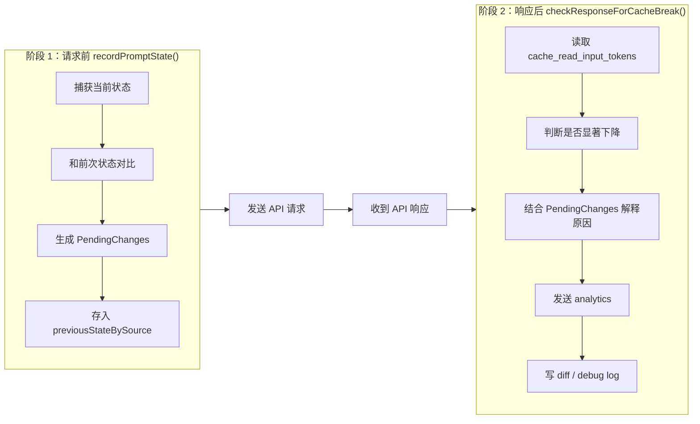
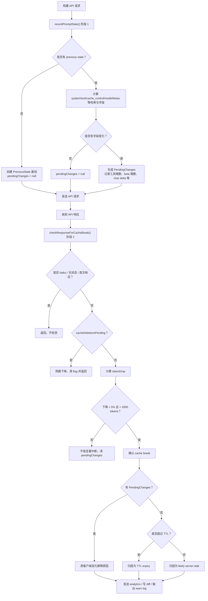

# Claude Code 缓存中断检测系统

## 8.1 前言：缓存中断为什么需要专门检测

第 7 章讨论的是缓存架构与断点设计：Claude Code 如何通过缓存范围、TTL 锁存、beta header 锁存来尽量避免缓存中断。

但缓存中断仍然会发生。

原因很现实：

- MCP 服务器重连导致工具 Schema 变化；
- 系统提示词增加了新的动态附件；
- 模型、effort、extra body 参数变化；
- beta header 或 cache_control 发生翻转；
- 服务端缓存路由、驱逐或计费统计发生差异；
- TTL 到期导致缓存自然失效。

更麻烦的是，缓存中断本身不会报错。API 不会告诉你“哪一段前缀不匹配”，它只会在响应里体现为 `cache_read_input_tokens` 下降。开发者看到的是成本变高、延迟变长，却很难知道根因。

所以本章的主线是：

```text
缓存中断是响应后才知道的事实
  -> 但根因只存在于请求前的状态差异里
  -> 因此必须请求前拍快照，响应后看 token
  -> 再把二者合并成可诊断的解释
```

这就是 Claude Code 的两阶段缓存中断检测系统：

| 阶段 | 函数 | 时机 | 作用 |
| --- | --- | --- | --- |
| 阶段 1 | `recordPromptState()` | API 请求发送前 | 捕获当前系统提示词、工具、模型、header、cache_control 等状态，并记录变化 |
| 阶段 2 | `checkResponseForCacheBreak()` | API 响应返回后 | 根据 cache token 下降确认是否真的中断，并用阶段 1 的变化解释原因 |

这一章不是讲如何优化缓存，而是讲 Claude Code 如何让缓存问题可观测。

## 8.2 两阶段检测架构

缓存中断检测必须分成两阶段，这是由问题本身的时序决定的。

如果只在响应后检测，你只能看到 `cache_read_input_tokens` 下降，却不知道请求前哪些状态变了。

如果只在请求前检测，你只能知道某些字段变了，却不知道服务端缓存是否真的被击穿。

两阶段合在一起，才有完整证据链。



### 8.2.1 阶段 1 的调用位置

阶段 1 在构建 API 请求时调用：

```ts
// services/api/claude.ts:1460-1486
if (feature('PROMPT_CACHE_BREAK_DETECTION')) {
  const toolsForCacheDetection = allTools.filter(
    t => !('defer_loading' in t && t.defer_loading),
  )
  recordPromptState({
    system,
    toolSchemas: toolsForCacheDetection,
    querySource: options.querySource,
    model: options.model,
    agentId: options.agentId,
    fastMode: fastModeHeaderLatched,
    globalCacheStrategy,
    betas,
    autoModeActive: afkHeaderLatched,
    isUsingOverage: currentLimits.isUsingOverage ?? false,
    cachedMCEnabled: cacheEditingHeaderLatched,
    effortValue: effort,
    extraBodyParams: getExtraBodyParams(),
  })
}
```

这里有两个关键设计决策。

第一，排除 `defer_loading` 工具。

延迟加载工具会被 API 层剥离，不影响实际缓存键。如果把它们放进检测快照，MCP 重连或工具发现就可能造成“工具变了”的误报。

第二，传入锁存后的 header 值。

`fastModeHeaderLatched`、`afkHeaderLatched`、`cacheEditingHeaderLatched` 是实际发送的稳定值，而不是用户当前开关的即时状态。缓存键由请求里真正发送的 header 决定，所以检测系统必须观察“发送值”，不是“意图值”。

### 8.2.2 阶段 2 的调用位置

阶段 2 在 API 响应完成后调用：

```ts
// services/api/claude.ts:2378-2392
// Check if the cache actually broke based on response tokens
if (feature('PROMPT_CACHE_BREAK_DETECTION')) {
  void checkResponseForCacheBreak(
    options.querySource,
    usage.cache_read_input_tokens,
    usage.cache_creation_input_tokens,
    messages,
    options.agentId,
    streamRequestId,
  )
}
```

这一步终于拿到了服务端返回的事实数据：

- `cache_read_input_tokens`：本次命中的缓存 token；
- `cache_creation_input_tokens`：本次新写入缓存的 token；
- `streamRequestId`：用于关联服务端请求。

阶段 2 的任务不是重新计算变化，而是用响应 token 判断“是否真的发生了缓存中断”，再使用阶段 1 保存的 `pendingChanges` 解释原因。

## 8.3 `PreviousState`：缓存键相关状态快照

阶段 1 的核心数据结构是 `PreviousState`。它记录所有客户端可观察、且可能影响服务端缓存键的状态。

### 8.3.1 字段清单

`PreviousState` 定义在 `promptCacheBreakDetection.ts`：

```ts
type PreviousState = {
  systemHash: number
  toolsHash: number
  /** Hash of system blocks WITH cache_control intact. Catches scope/TTL flips
   *  (global↔org, 1h↔5m) that stripCacheControl erases from systemHash. */
  cacheControlHash: number
  toolNames: string[]
  /** Per-tool schema hash. Diffed to name which tool's description changed
   *  when toolSchemasChanged but added=removed=0 (77% of tool breaks per
   *  BQ 2026-03-22). AgentTool/SkillTool embed dynamic agent/command lists. */
  perToolHashes: Record<string, number>
  systemCharCount: number
  model: string
  fastMode: boolean
  /** 'tool_based' | 'system_prompt' | 'none' — flips when MCP tools are
   *  discovered/removed. */
  globalCacheStrategy: string
  /** Sorted beta header list. Diffed to show which headers were added/removed. */
  betas: string[]
  /** AFK_MODE_BETA_HEADER presence — should NOT break cache anymore
   *  (sticky-on latched in claude.ts). Tracked to verify the fix. */
  autoModeActive: boolean
  /** Overage state flip — should NOT break cache anymore (eligibility is
   *  latched session-stable in should1hCacheTTL). Tracked to verify the fix. */
  isUsingOverage: boolean
  /** Cache-editing beta header presence — should NOT break cache anymore
   *  (sticky-on latched in claude.ts). Tracked to verify the fix. */
  cachedMCEnabled: boolean
  /** Resolved effort (env → options → model default). Goes into output_config
   *  or anthropic_internal.effort_override. */
  effortValue: string
  /** Hash of getExtraBodyParams() — catches CLAUDE_CODE_EXTRA_BODY and
   *  anthropic_internal changes. */
  extraBodyHash: number
  callCount: number
  pendingChanges: PendingChanges | null
  prevCacheReadTokens: number | null
  /** Set when cached microcompact sends cache_edits deletions. Cache reads
   *  will legitimately drop — this is expected, not a break. */
  cacheDeletionsPending: boolean
  buildDiffableContent: () => string
}
```

这些字段可以分成五类：

| 类型 | 字段 | 作用 |
| --- | --- | --- |
| Prompt 内容 | `systemHash`、`systemCharCount` | 检测系统提示词文本是否变化 |
| Tool 内容 | `toolsHash`、`toolNames`、`perToolHashes` | 检测工具增删或工具 Schema 变化 |
| Cache 标记 | `cacheControlHash`、`globalCacheStrategy` | 检测 scope / TTL / global 策略变化 |
| 请求配置 | `model`、`betas`、`effortValue`、`extraBodyHash` | 检测模型、header、effort、extra body 变化 |
| 检测状态 | `pendingChanges`、`prevCacheReadTokens`、`cacheDeletionsPending` | 支撑阶段 2 判定和误报抑制 |

### 8.3.2 `systemHash` 与 `cacheControlHash` 分离

哈希函数：

```ts
// promptCacheBreakDetection.ts:170-179
function computeHash(data: unknown): number {
  const str = jsonStringify(data)
  if (typeof Bun !== 'undefined') {
    const hash = Bun.hash(str)
    return typeof hash === 'bigint' ? Number(hash & 0xffffffffn) : hash
  }
  return djb2Hash(str)
}
```

系统提示词有两个不同哈希：

```ts
// promptCacheBreakDetection.ts:274-281
const systemHash = computeHash(strippedSystem)  // 不含 cache_control
const cacheControlHash = computeHash(           // 只有 cache_control
  system.map(b => ('cache_control' in b ? b.cache_control : null)),
)
```

这个分离非常重要。

`systemHash` 去掉了 `cache_control`，只看文本内容。它能回答“系统提示词文字变了吗？”

`cacheControlHash` 只看 `cache_control`。它能回答“scope 或 TTL 变了吗？”

如果没有第二个哈希，`global -> org`、`1h -> 5m` 这类变化可能被漏掉，因为提示词文本完全没变，但缓存键已经变了。

### 8.3.3 工具哈希的按需计算

工具 Schema 有聚合哈希，也有逐工具哈希：

```ts
// promptCacheBreakDetection.ts:285-286
const computeToolHashes = () =>
  computePerToolHashes(strippedTools, toolNames)
```

逐工具哈希不是每次都计算，而是在工具聚合哈希变化时才展开。原因是每个工具都要 `jsonStringify`，成本比单个聚合哈希更高。

它解决的是定位问题：当 `toolsHash` 变了，究竟是新增工具、移除工具，还是某个工具的 description / schema 变了？

源码注释里提到一个数据点：77% 的工具 break 是单个工具描述变化，而不是工具增删。这解释了为什么值得维护 `perToolHashes`。

### 8.3.4 跟踪键与隔离策略

检测状态按 query source 存在 Map 里：

```ts
// promptCacheBreakDetection.ts:101-107
const previousStateBySource = new Map<string, PreviousState>()

const MAX_TRACKED_SOURCES = 10

const TRACKED_SOURCE_PREFIXES = [
  'repl_main_thread',
  'sdk',
  'agent:custom',
  'agent:default',
  'agent:builtin',
]
```

跟踪键由 `getTrackingKey()` 计算：

```ts
// promptCacheBreakDetection.ts:149-158
function getTrackingKey(
  querySource: QuerySource,
  agentId?: AgentId,
): string | null {
  if (querySource === 'compact') return 'repl_main_thread'
  for (const prefix of TRACKED_SOURCE_PREFIXES) {
    if (querySource.startsWith(prefix)) return agentId || querySource
  }
  return null
}
```

这里有四个设计点：

- `compact` 共享 `repl_main_thread` 状态，因为它使用相同 cache-safe 参数；
- 子 Agent 用 `agentId` 隔离，避免多个同类型 Agent 互相污染；
- speculation、session_memory、prompt_suggestion 等短生命周期 source 不跟踪；
- `MAX_TRACKED_SOURCES = 10` 防止大量子 Agent 让 Map 无限增长。

## 8.4 阶段 1：`recordPromptState()` 请求前留证据

阶段 1 的目标不是判断中断，而是留下证据。

### 8.4.1 首次调用：建立基线

首次调用没有上一轮状态可以比较，只建立 `PreviousState`：

```ts
// promptCacheBreakDetection.ts:298-328
if (!prev) {
  while (previousStateBySource.size >= MAX_TRACKED_SOURCES) {
    const oldest = previousStateBySource.keys().next().value
    if (oldest !== undefined) previousStateBySource.delete(oldest)
  }

  previousStateBySource.set(key, {
    systemHash,
    toolsHash,
    cacheControlHash,
    toolNames,
    // ... 所有初始值
    callCount: 1,
    pendingChanges: null,
    prevCacheReadTokens: null,
    cacheDeletionsPending: false,
    buildDiffableContent: lazyDiffableContent,
    perToolHashes: computeToolHashes(),
  })
  return
}
```

这里 `prevCacheReadTokens` 初始为 `null`。这意味着下一次响应回来时，阶段 2 还不能做 token 下降对比，因为没有前一轮 cache read 基线。

### 8.4.2 后续调用：逐字段变化检测

后续调用会逐字段对比：

```ts
// promptCacheBreakDetection.ts:332-346
const systemPromptChanged = systemHash !== prev.systemHash
const toolSchemasChanged = toolsHash !== prev.toolsHash
const modelChanged = model !== prev.model
const fastModeChanged = isFastMode !== prev.fastMode
const cacheControlChanged = cacheControlHash !== prev.cacheControlHash
const globalCacheStrategyChanged =
  globalCacheStrategy !== prev.globalCacheStrategy
const betasChanged =
  sortedBetas.length !== prev.betas.length ||
  sortedBetas.some((b, i) => b !== prev.betas[i])
const autoModeChanged = autoModeActive !== prev.autoModeActive
const overageChanged = isUsingOverage !== prev.isUsingOverage
const cachedMCChanged = cachedMCEnabled !== prev.cachedMCEnabled
const effortChanged = effortStr !== prev.effortValue
const extraBodyChanged = extraBodyHash !== prev.extraBodyHash
```

这组字段覆盖了大多数客户端可观察的缓存键变化来源：

- prompt 文本；
- tool schema；
- model；
- fast mode；
- cache_control；
- global cache strategy；
- beta headers；
- auto mode；
- overage；
- cached microcompact；
- effort；
- extra body params。

### 8.4.3 `PendingChanges`：把变化存成可解释对象

当任一字段变化时，系统生成 `PendingChanges`：

```ts
// promptCacheBreakDetection.ts:71-99
type PendingChanges = {
  systemPromptChanged: boolean
  toolSchemasChanged: boolean
  modelChanged: boolean
  fastModeChanged: boolean
  cacheControlChanged: boolean
  globalCacheStrategyChanged: boolean
  betasChanged: boolean
  autoModeChanged: boolean
  overageChanged: boolean
  cachedMCChanged: boolean
  effortChanged: boolean
  extraBodyChanged: boolean
  addedToolCount: number
  removedToolCount: number
  systemCharDelta: number
  addedTools: string[]
  removedTools: string[]
  changedToolSchemas: string[]
  previousModel: string
  newModel: string
  prevGlobalCacheStrategy: string
  newGlobalCacheStrategy: string
  addedBetas: string[]
  removedBetas: string[]
  prevEffortValue: string
  newEffortValue: string
  buildPrevDiffableContent: () => string
}
```

这不是只存 boolean。它还记录：

- 工具增删数量；
- 具体新增/移除工具；
- 哪些工具 schema 变化；
- beta header 增删；
- model 前后值；
- effort 前后值；
- system prompt 字符变化量；
- 可生成 diff 的上一轮内容构造函数。

所以阶段 2 能输出“为什么中断”，而不是只输出“中断了”。

### 8.4.4 工具变化的精确归因

如果工具聚合哈希变化，会进一步定位变更工具：

```ts
// promptCacheBreakDetection.ts:366-378
if (toolSchemasChanged) {
  const newHashes = computeToolHashes()
  for (const name of toolNames) {
    if (!prevToolSet.has(name)) continue
    if (newHashes[name] !== prev.perToolHashes[name]) {
      changedToolSchemas.push(name)
    }
  }
  prev.perToolHashes = newHashes
}
```

工具变化被拆成三种：

| 类型 | 判断方式 | 解释 |
| --- | --- | --- |
| 新增工具 | 新工具名不在旧集合 | 可能是 MCP、插件或动态工具加载 |
| 移除工具 | 旧工具名不在新集合 | 可能是 MCP 断开或权限变化 |
| Schema 变化 | 工具名还在，但 per-tool hash 变了 | 常见于 AgentTool / SkillTool description 动态列表变化 |

这比只报告 `tools changed` 更有诊断价值。

## 8.5 阶段 2：`checkResponseForCacheBreak()` 响应后判定

阶段 2 的目标是确认缓存是否真的被击穿。

### 8.5.1 中断判定标准

核心判定：

```ts
// promptCacheBreakDetection.ts:485-493
const tokenDrop = prevCacheRead - cacheReadTokens
if (
  cacheReadTokens >= prevCacheRead * 0.95 ||
  tokenDrop < MIN_CACHE_MISS_TOKENS
) {
  state.pendingChanges = null
  return
}
```

这是一组双重门槛：

| 门槛 | 条件 | 目的 |
| --- | --- | --- |
| 相对下降 | cache read 下降超过 5% | 排除正常小幅波动 |
| 绝对下降 | token drop 超过 2,000 | 排除小基线下的比例放大 |

只有两个条件都满足，才认为发生了值得报告的 cache break。

`MIN_CACHE_MISS_TOKENS` 定义如下：

```ts
// promptCacheBreakDetection.ts:117-120
const MIN_CACHE_MISS_TOKENS = 2_000
```

### 8.5.2 特殊情况：Cache Deletion

缓存微压缩会主动删除服务端缓存内容。这会让 `cache_read_input_tokens` 合法下降，不应该被当成中断。

```ts
// promptCacheBreakDetection.ts:473-481
if (state.cacheDeletionsPending) {
  state.cacheDeletionsPending = false
  logForDebugging(
    `[PROMPT CACHE] cache deletion applied, cache read: ` +
    `${prevCacheRead} → ${cacheReadTokens} (expected drop)`,
  )
  state.pendingChanges = null
  return
}
```

`cacheDeletionsPending` 由 `notifyCacheDeletion()` 设置：

```ts
// promptCacheBreakDetection.ts:673-682
export function notifyCacheDeletion(
  querySource: QuerySource,
  agentId?: AgentId,
): void {
  const key = getTrackingKey(querySource, agentId)
  const state = key ? previousStateBySource.get(key) : undefined
  if (state) {
    state.cacheDeletionsPending = true
  }
}
```

这和第 6 章微压缩相连：主动 cache deletion 必须告诉检测器“下一次下降是预期的”。

### 8.5.3 特殊情况：Compaction

完整压缩会大幅减少消息历史，所以 cache read token 自然下降。

处理方式不是设置 pending flag，而是重置 baseline：

```ts
// promptCacheBreakDetection.ts:689-698
export function notifyCompaction(
  querySource: QuerySource,
  agentId?: AgentId,
): void {
  const key = getTrackingKey(querySource, agentId)
  const state = key ? previousStateBySource.get(key) : undefined
  if (state) {
    state.prevCacheReadTokens = null
  }
}
```

下一次响应回来时，因为 `prevCacheReadTokens === null`，检测器把它视为新基线，不报告中断。

### 8.5.4 排除模型

Haiku 模型有不同缓存行为，因此排除：

```ts
// promptCacheBreakDetection.ts:129-131
function isExcludedModel(model: string): boolean {
  return model.includes('haiku')
}
```

这是为了避免模型族差异被误报为缓存中断。

## 8.6 中断解释引擎：把 token 下降翻译成人话

确认中断之后，系统用阶段 1 的 `PendingChanges` 构造解释。

### 8.6.1 客户端变化归因

解释引擎会为不同字段生成具体文本：

```ts
// promptCacheBreakDetection.ts:496-563（简化）
const parts: string[] = []
if (changes) {
  if (changes.modelChanged) {
    parts.push(`model changed (${changes.previousModel} → ${changes.newModel})`)
  }
  if (changes.systemPromptChanged) {
    const charInfo = charDelta > 0 ? ` (+${charDelta} chars)` : ` (${charDelta} chars)`
    parts.push(`system prompt changed${charInfo}`)
  }
  if (changes.toolSchemasChanged) {
    const toolDiff = changes.addedToolCount > 0 || changes.removedToolCount > 0
      ? ` (+${changes.addedToolCount}/-${changes.removedToolCount} tools)`
      : ' (tool prompt/schema changed, same tool set)'
    parts.push(`tools changed${toolDiff}`)
  }
  if (changes.betasChanged) {
    const added = changes.addedBetas.length ? `+${changes.addedBetas.join(',')}` : ''
    const removed = changes.removedBetas.length ? `-${changes.removedBetas.join(',')}` : ''
    parts.push(`betas changed (${[added, removed].filter(Boolean).join(' ')})`)
  }
  // ... 其他字段的解释逻辑类似
}
```

这段逻辑的价值在于“具体胜于抽象”。

它不会只说 cache break，而是说：

- model 从 A 变成 B；
- system prompt 增加了多少字符；
- 工具新增/移除了多少；
- beta header 增加或减少了哪些；
- effort 从 default 变成某个值。

### 8.6.2 `cacheControlChanged` 的独立报告条件

`cacheControlChanged` 只在没有更根本原因时单独报告：

```ts
// promptCacheBreakDetection.ts:528-535
if (
  changes.cacheControlChanged &&
  !changes.globalCacheStrategyChanged &&
  !changes.systemPromptChanged
) {
  parts.push('cache_control changed (scope or TTL)')
}
```

原因是 cache_control 变化往往是其他变化的结果。

如果 global cache strategy 变了，那么 scope 变化只是策略变化的表现；如果 system prompt 变了，cache_control 结构变化也可能只是分块变化的副作用。只有在没有这些更强解释时，才单独归因为 scope 或 TTL。

### 8.6.3 TTL 过期与服务端归因

当没有客户端变化可以解释时，系统检查时间间隔：

```ts
// promptCacheBreakDetection.ts:566-588
const lastAssistantMsgOver5minAgo =
  timeSinceLastAssistantMsg !== null &&
  timeSinceLastAssistantMsg > CACHE_TTL_5MIN_MS
const lastAssistantMsgOver1hAgo =
  timeSinceLastAssistantMsg !== null &&
  timeSinceLastAssistantMsg > CACHE_TTL_1HOUR_MS

let reason: string
if (parts.length > 0) {
  reason = parts.join(', ')
} else if (lastAssistantMsgOver1hAgo) {
  reason = 'possible 1h TTL expiry (prompt unchanged)'
} else if (lastAssistantMsgOver5minAgo) {
  reason = 'possible 5min TTL expiry (prompt unchanged)'
} else if (timeSinceLastAssistantMsg !== null) {
  reason = 'likely server-side (prompt unchanged, <5min gap)'
} else {
  reason = 'unknown cause'
}
```

TTL 常量：

```ts
// promptCacheBreakDetection.ts:125-126
const CACHE_TTL_5MIN_MS = 5 * 60 * 1000
export const CACHE_TTL_1HOUR_MS = 60 * 60 * 1000
```

判断顺序很清楚：

| 情况 | 解释 |
| --- | --- |
| 有客户端变化 | 用变化列表解释 |
| 无变化，超过 1 小时 | possible 1h TTL expiry |
| 无变化，超过 5 分钟 | possible 5min TTL expiry |
| 无变化，未超过 5 分钟 | likely server-side |
| 无时间戳 | unknown cause |

### 8.6.4 “90% 服务端原因”的工程意义

源码注释：

```ts
// promptCacheBreakDetection.ts:573-576
// Post PR #19823 BQ analysis:
// when all client-side flags are false and the gap is under TTL, ~90% of breaks
// are server-side routing/eviction or billed/inference disagreement. Label
// accordingly instead of implying a CC bug hunt.
```

这段注释很重要。

它告诉我们：当客户端没有变化、时间也没超过 TTL 时，大多数 cache break 不是 Claude Code 客户端 bug，而是服务端路由、驱逐或计费/推理统计差异。

这个发现改变了诊断措辞。系统不会暗示“客户端一定哪里变了”，而是明确标记为 `likely server-side`，避免开发者追查不存在的客户端问题。

## 8.7 诊断输出：analytics、diff 和安全化

检测系统的输出有三类：analytics 事件、debug 日志、diff 文件。

### 8.7.1 Analytics 事件

`tengu_prompt_cache_break` 记录完整结构化字段：

```ts
// promptCacheBreakDetection.ts:590-644
logEvent('tengu_prompt_cache_break', {
  systemPromptChanged: changes?.systemPromptChanged ?? false,
  toolSchemasChanged: changes?.toolSchemasChanged ?? false,
  modelChanged: changes?.modelChanged ?? false,
  // ... 所有变化标志
  addedTools: (changes?.addedTools ?? []).map(sanitizeToolName).join(','),
  removedTools: (changes?.removedTools ?? []).map(sanitizeToolName).join(','),
  changedToolSchemas: (changes?.changedToolSchemas ?? []).map(sanitizeToolName).join(','),
  addedBetas: (changes?.addedBetas ?? []).join(','),
  removedBetas: (changes?.removedBetas ?? []).join(','),
  callNumber: state.callCount,
  prevCacheReadTokens: prevCacheRead,
  cacheReadTokens,
  cacheCreationTokens,
  timeSinceLastAssistantMsg: timeSinceLastAssistantMsg ?? -1,
  lastAssistantMsgOver5minAgo,
  lastAssistantMsgOver1hAgo,
  requestId: requestId ?? '',
})
```

这些字段让后续 BigQuery 分析可以回答：

- 哪类变化最常导致 cache break；
- 是否某个 beta header 仍在翻转；
- MCP 工具是否带来大量工具 schema 变化；
- TTL 过期和服务端原因各占多少；
- 某个 query source 是否异常。

### 8.7.2 Diff 文件与日志

当有客户端变化时，系统会写 diff 文件：

```ts
// promptCacheBreakDetection.ts:648-660
let diffPath: string | undefined
if (changes?.buildPrevDiffableContent) {
  diffPath = await writeCacheBreakDiff(
    changes.buildPrevDiffableContent(),
    state.buildDiffableContent(),
  )
}

const summary = `[PROMPT CACHE BREAK] ${reason} ` +
  `[source=${querySource}, call #${state.callCount}, ` +
  `cache read: ${prevCacheRead} → ${cacheReadTokens}, ` +
  `creation: ${cacheCreationTokens}${diffSuffix}]`

logForDebugging(summary, { level: 'warn' })
```

`writeCacheBreakDiff()` 使用 `createPatch` 生成 unified diff：

```ts
async function writeCacheBreakDiff(
  prevContent: string,
  newContent: string,
): Promise<string | undefined> {
  try {
    const diffPath = getCacheBreakDiffPath()
    await mkdir(getClaudeTempDir(), { recursive: true })
    const patch = createPatch(
      'prompt-state',
      prevContent,
      newContent,
      'before',
      'after',
    )
    await writeFile(diffPath, patch)
    return diffPath
  } catch {
    return undefined
  }
}
```

这让内部调试可以从 summary 直接找到前后 prompt/tool 状态的差异。

### 8.7.3 工具名称安全化

MCP 工具名由用户配置，可能泄露路径或私有信息。因此 analytics 里要脱敏：

```ts
// promptCacheBreakDetection.ts:183-185
function sanitizeToolName(name: string): string {
  return name.startsWith('mcp__') ? 'mcp' : name
}
```

内置工具名称是固定词汇表，可以直接上报；`mcp__` 开头的工具统一折叠为 `mcp`。

## 8.8 完整检测流程

把两个阶段和特殊路径串起来，完整流程如下：



这张图可以概括为一句话：

**请求前记录嫌疑人，响应后确认案发，再把嫌疑人和证据拼起来。**

## 8.9 清理机制与生命周期

检测系统还提供清理函数，避免状态长期堆积。

### 8.9.1 Agent 结束清理

```ts
// promptCacheBreakDetection.ts:700-706
// Agent 结束时清理其跟踪状态
export function cleanupAgentTracking(agentId: AgentId): void {
  previousStateBySource.delete(agentId)
}
```

调用位置：

```text
src/tools/AgentTool/runAgent.ts:825:      cleanupAgentTracking(agentId)
```

子 Agent 使用 `agentId` 作为 tracking key，结束后必须清掉，避免 Map 中残留已完成 agent 的 prompt 状态。

### 8.9.2 全局重置

```ts
// promptCacheBreakDetection.ts:700-706
// 完全重置（/clear 命令）
export function resetPromptCacheBreakDetection(): void {
  previousStateBySource.clear()
}
```

`/clear` 会清理对话和相关缓存状态，因此 cache break detection 的 previous state 也不再有意义。

## 8.10 用户能做什么

这套机制对使用 Claude Code 的普通用户主要是幕后基础设施，但对构建 Agent 系统的人很有借鉴价值。

### 8.10.1 建立 cache read 基线

不要只看 input tokens。要记录正常请求中的 `cache_read_input_tokens`，建立“正常命中”基线。

没有基线，就无法判断一次下降是异常，还是正常 TTL 过期。

Claude Code 使用双门槛：

```text
下降超过 5%
且
绝对下降超过 2,000 tokens
```

你的系统也应该根据上下文规模设置类似的噪声过滤。

### 8.10.2 请求前记录状态

如果想解释 cache break，必须在请求发送前记录状态。

至少记录：

- system prompt hash；
- tool schema hash；
- tool name list；
- cache_control / TTL / scope；
- model；
- beta headers；
- dynamic body params。

响应后再想回溯，很多状态已经变了，证据会丢。

### 8.10.3 区分客户端变化和服务端原因

当 cache read 下降时，先看客户端是否变化。

如果客户端没变、时间没超过 TTL，很多时候就是服务端路由、驱逐或统计差异。不要把每次 cache miss 都当成客户端 bug。

### 8.10.4 对动态工具做细粒度归因

如果系统有 MCP、插件、动态 Agent、Skill 这类机制，不要只记录“工具变了”。

应该进一步区分：

- 工具新增；
- 工具移除；
- 工具名不变但 Schema / description 变化。

后者在 Claude Code 的数据里非常常见，也更适合通过稳定 description 或列表外移来优化。

### 8.10.5 把动态内容放到缓存边界之后

缓存中断检测能告诉你哪里变了，但最好的策略还是减少变化。

系统提示词里稳定的“宪法规则”放前面，运行时状态、用户状态、工具动态列表放后面或附件里。这和前面系统提示词架构篇里的 `SYSTEM_PROMPT_DYNAMIC_BOUNDARY` 是同一条原则。

## 8.11 设计洞察

第一，**两阶段不是偏好，而是时序约束**。

请求前才能知道什么变了，响应后才能知道是否真的中断。两阶段是这个问题的自然结构。

第二，**检测系统不优化缓存，但让优化成为可能**。

`tengu_prompt_cache_break` 事件和 diff 文件不会直接减少 token，但它们能指出优化方向。没有可观测性，就无法判断锁存、工具列表外移、动态边界这些设计是否有效。

第三，**不要把所有 cache miss 都归因给客户端**。

“90% 服务端原因”的数据点很重要。好的诊断系统应该承认不确定性，而不是硬编一个客户端原因。

第四，**误报抑制必须和优化机制联动**。

微压缩和全量压缩都会让 cache read 下降。如果检测器不知道这些主动操作，就会把优化当事故。

第五，**诊断信息要能落到具体字段**。

“缓存中断了”没有行动价值；“AgentTool schema changed, same tool set” 才能指导工程师去查动态 agent list。

## 8.12 小结

Claude Code 的缓存中断检测系统可以浓缩成一句话：

> 请求前拍下所有可能影响缓存键的状态，响应后用 cache token 判断是否真的中断，再用请求前的变化清单解释中断原因。

本章拆解了这套系统的关键设计：

1. `recordPromptState()` 在请求前建立 `PreviousState`，捕获 system prompt、tool schema、cache_control、model、betas、effort、extra body 等状态。
2. `checkResponseForCacheBreak()` 在响应后用 `cache_read_input_tokens` 双门槛确认中断。
3. `PendingChanges` 负责把字段变化保存成可解释对象。
4. `notifyCacheDeletion()` 和 `notifyCompaction()` 负责抑制主动上下文管理带来的误报。
5. analytics、diff 文件和 debug log 构成了完整诊断输出。

这套系统本身不减少任何 token，但它让缓存问题从“成本突然升高”变成“可定位、可归因、可迭代”的工程问题。
