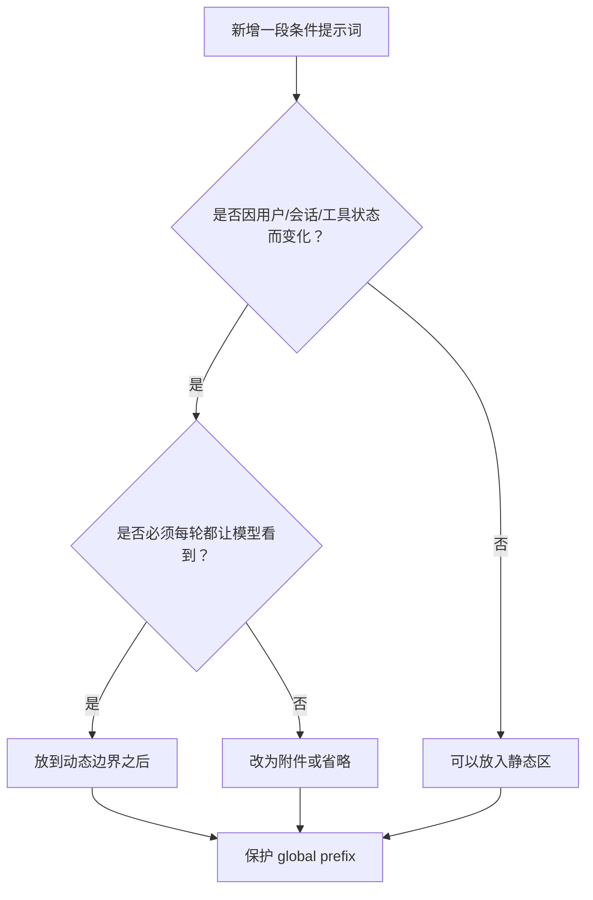
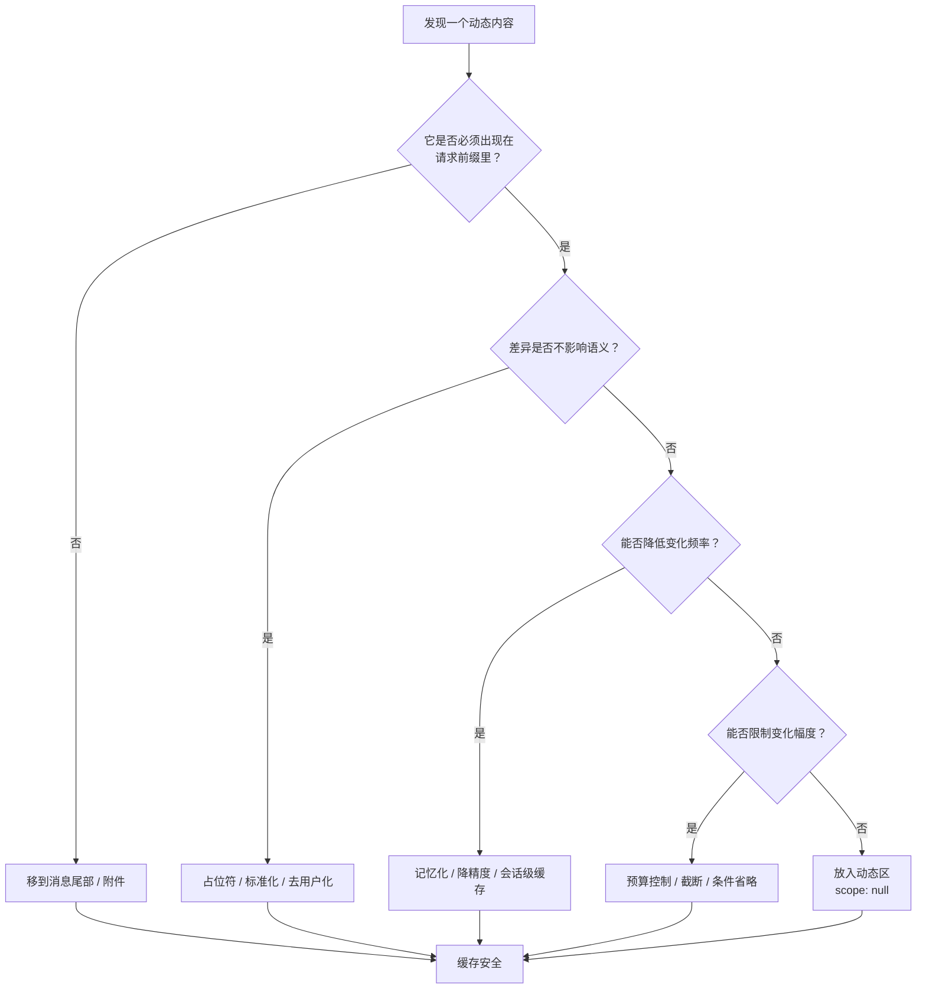

# Claude Code 缓存优化模式

定位：本章分析 Claude Code 中 8 个命名缓存优化模式。它们共同遵循一条路径：先识别会让 prompt cache 前缀抖动的变化源，再判断这个变化是否真的必须出现在前缀里，最后用记忆化、降精度、附件化、占位符、预算控制或会话级缓存，把“每轮变化”压成“会话稳定”。

前置依赖：第 7 章《缓存架构与断点设计》、第 8 章《缓存中断检测系统》。

适用场景：想把 prompt caching 从“API 开关”升级为“系统设计原则”的读者。

---

## 9.1 从检测到优化：本章主线

第 7 章讲的是缓存防御层：`cache_control` 放在哪里，`global/org/null` 如何分配，TTL 和 beta header 为什么要锁存。第 8 章讲的是缓存诊断层：当 `cache_read_input_tokens` 掉下来时，Claude Code 如何判断是系统提示词变了、工具 schema 变了、header 变了，还是服务端路由/驱逐导致。

本章讲第三层：主动优化。

也就是说，不只是发现缓存中断，而是把中断原因一个个消掉。Claude Code 的做法可以概括为一条非常朴素但有效的工程公式：

```text
识别变化源 -> 理解变化本质 -> 将动态变为静态
```

这句话里的“静态”不是永远不变，而是更精确地说：在对缓存有害的位置尽量不变。

Anthropic Prompt Caching 的关键约束是前缀逐字节匹配。越靠近 API 请求前端的内容，变化的破坏性越大：

```text
[工具 Schema] -> [系统提示词] -> [消息历史] -> [附件 / 新消息]
      高破坏性          高破坏性          中等             低
```

所以本章的 8 个模式都在回答同一个问题：

> 这个动态内容，能不能不要出现在高破坏性的前缀里？如果必须出现，能不能降低它的变化频率、变化幅度或用户维度差异？

---

## 9.2 模式全景

| 模式 | 变化源 | 破坏位置 | 优化手段 | 结果 |
| --- | --- | --- | --- | --- |
| 日期记忆化 | 当前日期跨天变化 | system prompt | `memoize(getLocalISODate)` | 每会话日期稳定 |
| 月度粒度 | 工具提示词中的时间上下文 | tool schema | 日粒度降为月粒度 | 每月变化，而非每天变化 |
| Agent 列表附件化 | 动态 Agent 列表 | AgentTool description | 从工具描述移到消息附件 | 工具 schema 静态化 |
| Skill 列表预算 | 动态技能列表膨胀 | SkillTool description | 1% context window + 单条截断 | 控制体积与抖动 |
| `$TMPDIR` 占位符 | 用户 UID 导致路径不同 | BashTool prompt | 用环境变量替代用户路径 | 跨用户字节一致 |
| 条件段落省略 | runtime bit 条件分支 | global system prefix | 移到动态边界后或省略 | 避免 2^N 前缀变体 |
| 工具 Schema 会话缓存 | GrowthBook / prompt drift | tool schema | 首次渲染后 Map 缓存 | 每请求变化降为每会话稳定 |
| Schema 缓存键特化 | 同名工具不同 schema | tool schema cache | key 包含 `inputJSONSchema` | 避免 stale schema 功能错误 |

这 8 个模式可以分成三类：

| 类别 | 典型模式 | 核心思想 |
| --- | --- | --- |
| 降低变化频率 | 日期记忆化、月度粒度、工具 Schema 会话缓存 | 内容还在前缀里，但不再每轮变化 |
| 移动变化位置 | Agent 列表附件化、条件段落移到动态边界后 | 内容仍然动态，但放到缓存破坏性更低的位置 |
| 消除无意义差异 | `$TMPDIR`、Skill 预算、Schema key 特化 | 把用户差异、体积抖动或缓存误命中变成可控变量 |

---

## 9.3 模式一：日期记忆化 `getSessionStartDate()`

这一模式解决的是一个很小但很真实的问题：日期字符串每天都会变，但日期变化不应该击穿整个会话缓存。

### 9.3.1 变化源

Claude Code 的系统提示词需要告诉模型当前日期。基础函数是 `getLocalISODate()`：

```ts
// constants/common.ts:4-15
export function getLocalISODate(): string {
  if (process.env.CLAUDE_CODE_OVERRIDE_DATE) {
    return process.env.CLAUDE_CODE_OVERRIDE_DATE
  }

  const now = new Date()
  const year = now.getFullYear()
  const month = String(now.getMonth() + 1).padStart(2, '0')
  const day = String(now.getDate()).padStart(2, '0')
  return `${year}-${month}-${day}`
}
```

如果一个用户在 23:59 发起请求，系统提示词里是 `2026-04-01`；00:01 再发起请求，变成 `2026-04-02`。从语义上看只是日期更新；从缓存系统看，这是系统提示词前缀的字节变化。

一个字符变化，就足以让前缀缓存从变化位置之后断开。

### 9.3.2 静态化手段

Claude Code 用会话级记忆化锁住日期：

```ts
// constants/common.ts:24
export const getSessionStartDate = memoize(getLocalISODate)
```

源码注释把这个权衡说得非常直接：

```ts
// constants/common.ts:17-23
// Memoized for prompt-cache stability — captures the date once at session start.
// The main interactive path gets this behavior via memoize(getUserContext) in
// context.ts; simple mode (--bare) calls getSystemPrompt per-request and needs
// an explicit memoized date to avoid busting the cached prefix at midnight.
// When midnight rolls over, getDateChangeAttachments appends the new date at
// the tail (though simple mode disables attachments, so the trade-off there is:
// stale date after midnight vs. ~entire-conversation cache bust — stale wins).
```

默认路径里，日期变化可以通过尾部附件补充；simple mode 没有附件机制，所以选择保留旧日期。这个选择不是因为旧日期更正确，而是因为“日期略旧”比“整个会话缓存击穿”代价小得多。

simple mode 的系统提示词使用的就是记忆化日期：

```ts
// constants/prompts.ts:448-453
if (isEnvTruthy(process.env.CLAUDE_CODE_SIMPLE)) {
  return [
    `You are Claude Code, Anthropic's official CLI for Claude.\n\nCWD: ${getCwd()}\nDate: ${getSessionStartDate()}`,
  ]
}
```

跨天时，主路径用附件在消息尾部补充新日期：

```ts
// utils/attachments.ts:1416-1444
export function getDateChangeAttachments(
  messages: Message[] | undefined,
): Attachment[] {
  const currentDate = getLocalISODate()
  const lastDate = getLastEmittedDate()

  if (lastDate === null) {
    // First turn — just record, no attachment needed
    setLastEmittedDate(currentDate)
    return []
  }

  if (currentDate === lastDate) {
    return []
  }

  setLastEmittedDate(currentDate)

  // Assistant mode: flush yesterday's transcript to the per-day file so
  // the /dream skill (1–5am local) finds it even if no compaction fires
  // today. Fire-and-forget; writeSessionTranscriptSegment buckets by
  // message timestamp so a multi-day gap flushes each day correctly.
  if (feature('KAIROS')) {
    if (getKairosActive() && messages !== undefined) {
      sessionTranscriptModule?.flushOnDateChange(messages, currentDate)
    }
  }

  return [{ type: 'date_change', newDate: currentDate }]
}
```

### 9.3.3 为什么有效

这个模式的核心不是“缓存日期”，而是“把日期的新鲜度从前缀移到尾部”。

| 方案 | 日期是否新鲜 | 是否保护前缀缓存 | 代价 |
| --- | --- | --- | --- |
| 每轮调用 `getLocalISODate()` | 是 | 否 | 午夜击穿前缀 |
| `getSessionStartDate()` | 会话内可能旧 | 是 | 日期略旧 |
| 日期变化附件 | 是 | 是 | 只增加尾部消息成本 |

这是缓存优化里最常见的取舍：在不影响核心任务正确性的地方，宁可让某个辅助信息略旧，也不要让高价值前缀抖动。

---

## 9.4 模式二：月度粒度 `getLocalMonthYear()`

日期记忆化解决的是系统提示词里的日期；月度粒度解决的是工具提示词里的时间上下文。

### 9.4.1 变化源

工具提示词也可能需要当前时间。例如 WebSearchTool 需要让模型理解“当前搜索环境”的时间背景。如果在工具 description 里写完整日期，那么工具 schema 每天都会变。

工具 schema 的位置比普通消息更靠前，它一变，后续缓存都会受影响。

### 9.4.2 静态化手段

Claude Code 没有在工具提示词中使用完整日期，而是使用月度粒度：

```ts
// constants/common.ts:28-33
export function getLocalMonthYear(): string {
  const date = process.env.CLAUDE_CODE_OVERRIDE_DATE
    ? new Date(process.env.CLAUDE_CODE_OVERRIDE_DATE)
    : new Date()
  return date.toLocaleString('en-US', { month: 'long', year: 'numeric' })
}
```

源码注释明确说明了目的：

```ts
// constants/common.ts:26-27
// Returns "Month YYYY" (e.g. "February 2026") in the user's local timezone.
// Changes monthly, not daily — used in tool prompts to minimize cache busting.
```

WebSearchTool 使用这个函数生成描述：

```ts
// tools/WebSearchTool/prompt.ts:5-7
export function getWebSearchPrompt(): string {
  const currentMonthYear = getLocalMonthYear()
  return `
```

### 9.4.3 两种时间精度的分工

| 信息位置 | 需要的时间精度 | 优化方式 | 原因 |
| --- | --- | --- | --- |
| system prompt simple mode | 日期 | 会话记忆化 | 会话内稳定比实时日期更重要 |
| 普通消息尾部附件 | 日期 | 日期变化时追加 | 尾部变化不破坏前缀 |
| tool description | 月份 | 月度粒度 | 工具 schema 不能每天抖动 |

这个模式的启发是：时间不是一个统一字段，而是一组按位置分级的信息。越靠前，时间精度越应该谨慎。

---

## 9.5 模式三：Agent 列表附件化

这一模式解决的是动态列表污染工具 schema 的问题，也是本章中收益最清晰的优化之一。

### 9.5.1 变化源

AgentTool 的工具描述需要告诉模型有哪些 agent 可用。问题是 agent 列表不是静态的：

- MCP 服务器异步连接可能带来新的 agent；
- `/reload-plugins` 会刷新插件列表；
- 权限模式变化会改变 agent 可用性；
- `allowedAgentTypes` 会限制当前工具调用能派生哪些 agent。

如果这些内容直接嵌在 AgentTool description 里，那么每次列表变化都会改变工具 schema。

源码注释量化了这个问题：

```ts
// tools/AgentTool/prompt.ts:50-57
 * of embedded in the tool description. When true, getPrompt() returns a static
 * description and attachments.ts emits an agent_listing_delta attachment.
 *
 * The dynamic agent list was ~10.2% of fleet cache_creation tokens: MCP async
 * connect, /reload-plugins, or permission-mode changes mutate the list →
 * description changes → full tool-schema cache bust.
 *
 * Override with CLAUDE_CODE_AGENT_LIST_IN_MESSAGES=true/false for testing.
```

### 9.5.2 静态化手段

开关逻辑如下：

```ts
// tools/AgentTool/prompt.ts:59-64
export function shouldInjectAgentListInMessages(): boolean {
  if (isEnvTruthy(process.env.CLAUDE_CODE_AGENT_LIST_IN_MESSAGES)) return true
  if (isEnvDefinedFalsy(process.env.CLAUDE_CODE_AGENT_LIST_IN_MESSAGES))
    return false
  return getFeatureValue_CACHED_MAY_BE_STALE('tengu_agent_list_attach', false)
}
```

当这个函数返回 true 时，AgentTool 的 description 变成静态说明；具体 agent 列表改由附件注入：

```ts
// utils/attachments.ts:1491-1496
export function getAgentListingDeltaAttachment(
  toolUseContext: ToolUseContext,
  messages: Message[] | undefined,
): Attachment[] {
  if (!shouldInjectAgentListInMessages()) return []
```

这相当于把内容从：

```text
工具 Schema 前缀：AgentTool description 内联 agent 列表
```

移动到：

```text
消息尾部：agent_listing_delta attachment
```

### 9.5.3 为什么有效

这不是简单的“换个地方放文本”。关键差异是缓存破坏半径不同：

| 放置位置 | 变化时影响 |
| --- | --- |
| AgentTool description | 工具 schema 变，整个工具数组和下游消息缓存可能失效 |
| agent_listing_delta 附件 | 只影响当前消息尾部，不击穿已缓存工具 schema |

10.2% 的 fleet cache_creation tokens 说明：动态工具描述不是小问题，而是系统级成本来源。

这个模式可以抽象为：

```text
动态目录不要写进工具说明。
工具说明描述能力，动态目录通过消息附件声明。
```

---

## 9.6 模式四：Skill 列表预算

SkillTool 的问题和 AgentTool 类似：它也需要给模型一个动态列表。但它的优化方向不是完全外移，而是预算约束和渐进降级。

### 9.6.1 变化源

技能列表会随着项目、插件、用户配置变化而变化。列表越长，越容易造成两个问题：

1. 工具 description 体积膨胀，首次 cache creation 成本上升；
2. 列表轻微变化就改变大块 schema 文本，增加缓存抖动。

### 9.6.2 静态化手段：1% 上下文预算

源码将技能列表预算固定为上下文窗口的 1%：

```ts
// tools/SkillTool/prompt.ts:20-23
// Skill listing gets 1% of the context window (in characters)
export const SKILL_BUDGET_CONTEXT_PERCENT = 0.01
export const CHARS_PER_TOKEN = 4
export const DEFAULT_CHAR_BUDGET = 8_000 // Fallback: 1% of 200k × 4
```

预算计算函数：

```ts
// tools/SkillTool/prompt.ts:31-41
export function getCharBudget(contextWindowTokens?: number): number {
  if (Number(process.env.SLASH_COMMAND_TOOL_CHAR_BUDGET)) {
    return Number(process.env.SLASH_COMMAND_TOOL_CHAR_BUDGET)
  }
  if (contextWindowTokens) {
    return Math.floor(
      contextWindowTokens * CHARS_PER_TOKEN * SKILL_BUDGET_CONTEXT_PERCENT,
    )
  }
  return DEFAULT_CHAR_BUDGET
}
```

每个技能条目还有独立硬上限：

```ts
// tools/SkillTool/prompt.ts:25-29
// Per-entry hard cap. The listing is for discovery only — the Skill tool loads
// full content on invoke, so verbose whenToUse strings waste turn-1 cache_creation
// tokens without improving match rate. Applies to all entries, including bundled,
// since the cap is generous enough to preserve the core use case.
export const MAX_LISTING_DESC_CHARS = 250
```

截断逻辑保留条目开头：

```ts
// tools/SkillTool/prompt.ts:43-49
function getCommandDescription(cmd: Command): string {
  const desc = cmd.whenToUse
    ? `${cmd.description} - ${cmd.whenToUse}`
    : cmd.description
  return desc.length > MAX_LISTING_DESC_CHARS
    ? desc.slice(0, MAX_LISTING_DESC_CHARS - 1) + '\u2026'
    : desc
}
```

### 9.6.3 为什么有效

SkillTool 的预算不是为了让列表“好看”，而是为了让动态目录的变化幅度有上限。

| 优化点 | 缓存意义 |
| --- | --- |
| 总预算 1% context window | 防止工具 description 无限膨胀 |
| 单条 250 字符 | 防止某个 skill 的 verbose `whenToUse` 污染前缀 |
| 完整技能内容调用时再加载 | 目录只用于发现，不承担执行说明 |
| 预算超出后渐进截断 | 变化被限制在有限文本范围内 |

这个模式可以称为“预算即稳定”：只要动态列表有固定预算，列表变化就不再能无限扩大缓存破坏半径。

---

## 9.7 模式五：`$TMPDIR` 占位符

这一模式解决的是跨用户全局缓存中的一个经典问题：用户环境路径不同，但语义相同。

### 9.7.1 变化源

BashTool 的 sandbox 提示词需要告诉模型哪些路径可写。临时目录通常类似：

```text
/private/tmp/claude-1001/
/private/tmp/claude-1002/
```

这些路径里的 UID 因用户而异。如果直接嵌入提示词，那么每个用户看到的 BashTool description 都不同。即使提示词语义完全一样，字节也无法跨用户命中 global cache。

### 9.7.2 静态化手段

源码用 `$TMPDIR` 替换用户特定路径：

```ts
// tools/BashTool/prompt.ts:186-190
// Replace the per-UID temp dir literal (e.g. /private/tmp/claude-1001/) with
// "$TMPDIR" so the prompt is identical across users — avoids busting the
// cross-user global prompt cache. The sandbox already sets $TMPDIR at runtime.
const claudeTempDir = getClaudeTempDir()
const normalizeAllowOnly = (paths: string[]): string[] =>
  [...new Set(paths)].map(p => (p === claudeTempDir ? '$TMPDIR' : p))
```

提示词还明确要求模型使用这个变量：

```ts
// tools/BashTool/prompt.ts:258-260
const items: Array<string | string[]> = [
  ...sandboxOverrideItems,
  'For temporary files, always use the `$TMPDIR` environment variable. TMPDIR is automatically set to the correct sandbox-writable directory in sandbox mode. Do NOT use `/tmp` directly - use `$TMPDIR` instead.',
]
```

### 9.7.3 为什么有效

`$TMPDIR` 不是一个语法美化，而是缓存标准化手段。

| 原始路径策略 | `$TMPDIR` 策略 |
| --- | --- |
| 每个用户路径不同 | 所有用户提示词相同 |
| 破坏 global cache 复用 | 保留跨用户字节一致性 |
| 模型看到绝对路径 | 模型看到稳定环境变量 |
| 语义正确但缓存不友好 | 语义正确且缓存友好 |

这个模式适用于所有“用户不同但语义相同”的字段：路径、用户名、临时资源 ID、容器目录、session-scoped handle。只要运行时能解析，就优先用稳定占位符。

---

## 9.8 模式六：条件段落省略与动态边界

这一模式解决的是 feature flag 和 runtime bit 把静态区切成指数级变体的问题。

### 9.8.1 变化源

系统提示词里常常有这种条件：

```text
如果有 Agent 工具，加一段 Agent 指南。
如果启用了 Skill discovery，加一段 Skill 指南。
如果是非交互会话，删掉交互说明。
```

这些条件单看都合理，但如果它们出现在 global cache 前缀里，问题会被放大。N 个布尔条件不是 N 种变化，而是最多 `2^N` 种前缀变体。

源码注释直接指出了这个风险：

```ts
// constants/prompts.ts:343-348
/**
 * Session-variant guidance that would fragment the cacheScope:'global'
 * prefix if placed before SYSTEM_PROMPT_DYNAMIC_BOUNDARY. Each conditional
 * here is a runtime bit that would otherwise multiply the Blake2b prefix
 * hash variants (2^N). See PR #24490, #24171 for the same bug class.
 *
```

### 9.8.2 静态化手段

Claude Code 用 `SYSTEM_PROMPT_DYNAMIC_BOUNDARY` 把高稳定静态区和会话动态区切开：

```ts
// constants/prompts.ts:568-575
getActionsSection(),
getUsingYourToolsSection(enabledTools),
getSimpleToneAndStyleSection(),
getOutputEfficiencySection(),
// === BOUNDARY MARKER - DO NOT MOVE OR REMOVE ===
...(shouldUseGlobalCacheScope() ? [SYSTEM_PROMPT_DYNAMIC_BOUNDARY] : []),
// --- Dynamic content (registry-managed) ---
...resolvedDynamicSections,
```

条件段落不是完全禁止，而是要放对地方：

| 条件内容类型 | 推荐位置 |
| --- | --- |
| 所有用户完全一致 | 边界前，可 global cache |
| 会话工具、Skill、Agent、交互模式相关 | 边界后，动态区 |
| 高频变化列表 | 消息附件 |
| 对行为收益很低的条件说明 | 直接省略或改为稳定通用措辞 |

### 9.8.3 为什么有效

条件段落省略的本质是减少前缀变体数量。它不是不让系统提示词表达条件，而是不让条件进入全局可缓存前缀。



这和第 7 章的缓存边界是一套逻辑：global prefix 只放“宪法级稳定内容”，运行时事实去动态区。

---

## 9.9 模式七：工具 Schema 会话级缓存

这一模式解决的是工具 schema 每轮重新渲染带来的微小漂移。

### 9.9.1 变化源

工具 schema 的生成不是纯静态操作，它可能受到以下因素影响：

- GrowthBook feature flag，例如 `tengu_tool_pear`、`tengu_fgts`；
- 工具 `prompt()` 中的动态内容；
- MCP 重连导致的外部工具 schema 变化；
- 工具输入 schema 的转换结果。

如果每轮请求都重新生成工具 schema，那么 GrowthBook 缓存刷新或动态 prompt drift 都可能造成字节变化。工具 schema 位于请求前端，这类变化非常昂贵。

### 9.9.2 静态化手段

Claude Code 把渲染后的工具 schema 做会话级缓存：

```ts
// utils/toolSchemaCache.ts:1-27
// Session-scoped cache of rendered tool schemas. Tool schemas render at server
// position 2 (before system prompt), so any byte-level change busts the entire
// ~11K-token tool block AND everything downstream. GrowthBook gate flips
// (tengu_tool_pear, tengu_fgts), MCP reconnects, or dynamic content in
// tool.prompt() drift all cause this churn. Memoizing per-session locks the schema
// bytes at first render — mid-session GB refreshes no longer bust the cache.

type CachedSchema = BetaTool & {
  strict?: boolean
  eager_input_streaming?: boolean
}

const TOOL_SCHEMA_CACHE = new Map<string, CachedSchema>()

export function getToolSchemaCache(): Map<string, CachedSchema> {
  return TOOL_SCHEMA_CACHE
}

export function clearToolSchemaCache(): void {
  TOOL_SCHEMA_CACHE.clear()
}
```

在 `toolToAPISchema()` 中，工具 schema 的基础部分只在首次渲染：

```ts
// utils/api.ts:136-151
// Session-stable base schema: name, description, input_schema, strict,
// eager_input_streaming. These are computed once per session and cached to
// prevent mid-session GrowthBook flips (tengu_tool_pear, tengu_fgts) or
// tool.prompt() drift from churning the serialized tool array bytes.
// See toolSchemaCache.ts for rationale.
//
// Cache key includes inputJSONSchema when present. StructuredOutput instances
// share the name 'StructuredOutput' but carry different schemas per workflow
// call — name-only keying returned a stale schema (5.4% → 51% err rate, see
// PR#25424). MCP tools also set inputJSONSchema but each has a stable schema,
// so including it preserves their GB-flip cache stability.
const cacheKey =
  'inputJSONSchema' in tool && tool.inputJSONSchema
    ? `${tool.name}:${jsonStringify(tool.inputJSONSchema)}`
    : tool.name
const cache = getToolSchemaCache()
let base = cache.get(cacheKey)
```

登出或认证状态切换时清理缓存：

```ts
// utils/auth.ts:1239-1241
getClaudeAIOAuthTokens.cache?.clear?.()
clearBetasCaches()
clearToolSchemaCache()
```

### 9.9.3 为什么有效

这个模式把工具 schema 的变化频率从“每次请求”降为“每个会话”。

| 不缓存工具 schema | 会话级缓存工具 schema |
| --- | --- |
| 每轮重新评估 feature flag | 首次渲染后稳定 |
| `tool.prompt()` 轻微变化会击穿缓存 | 后续复用同一字节序列 |
| GrowthBook 刷新可能改变请求前缀 | 会话内不受中途刷新影响 |
| 更实时 | 更缓存友好 |

它和第 7 章中的 TTL / beta header 锁存是一类思想：会话开始后，宁可使用一个略微陈旧但一致的值，也不要让缓存键在会话中途漂移。

---

## 9.10 模式八：Schema 缓存键特化

工具 Schema 会话缓存还带来一个新问题：缓存本身可能误命中。

### 9.10.1 变化源

大多数工具可以用 `tool.name` 作为缓存键，因为工具名唯一且 schema 稳定。但 StructuredOutput 是例外：不同工作流可能共用同一个工具名 `StructuredOutput`，却携带不同的 `inputJSONSchema`。

如果只用名字做缓存键，第一次渲染的 schema 会被后续工作流错误复用。这不是缓存命中率问题，而是功能正确性问题。

源码注释记录了这个 bug 的影响：

```ts
// utils/api.ts:142-146
// Cache key includes inputJSONSchema when present. StructuredOutput instances
// share the name 'StructuredOutput' but carry different schemas per workflow
// call — name-only keying returned a stale schema (5.4% → 51% err rate, see
// PR#25424). MCP tools also set inputJSONSchema but each has a stable schema,
// so including it preserves their GB-flip cache stability.
```

### 9.10.2 静态化手段

缓存键包含 `inputJSONSchema`：

```ts
// utils/api.ts:147-149
const cacheKey =
  'inputJSONSchema' in tool && tool.inputJSONSchema
    ? `${tool.name}:${jsonStringify(tool.inputJSONSchema)}`
    : tool.name
```

这一步非常关键：缓存优化不能只追求稳定，还必须保证正确命中。

### 9.10.3 为什么有效

| 缓存键 | 命中率 | 正确性 |
| --- | --- | --- |
| `tool.name` | 高 | StructuredOutput 会误命中 |
| `tool.name + inputJSONSchema` | 略低 | 按 schema 精确区分 |

这是一条容易被忽略的缓存设计原则：

```text
缓存键必须覆盖所有影响语义的输入。
不影响语义的差异要归一化；影响语义的差异必须进入 key。
```

`$TMPDIR` 模式是在删除“不影响语义的差异”；Schema key 特化是在保留“影响语义的差异”。两者看似相反，其实是同一条原则的两面。

---

## 9.11 共同决策流程

把 8 个模式合在一起，可以抽象出下面这条缓存优化决策树：



这条树可以解释本章所有模式：

| 决策分支 | 对应模式 |
| --- | --- |
| 移到消息尾部 / 附件 | Agent 列表附件化、日期变化附件 |
| 占位符 / 标准化 | `$TMPDIR` |
| 记忆化 / 降精度 | 日期记忆化、月度粒度、工具 Schema 会话缓存 |
| 预算控制 / 截断 | Skill 列表预算 |
| 动态区 `scope: null` | 条件段落放到 `SYSTEM_PROMPT_DYNAMIC_BOUNDARY` 之后 |
| 精确缓存键 | Schema 缓存键特化 |

---

## 9.12 常见陷阱

| 陷阱 | 为什么危险 | 更好的做法 |
| --- | --- | --- |
| 在系统提示词前缀放当前时间 | 每分钟或每天击穿缓存 | 记忆化，或放到消息尾部附件 |
| 在工具 description 里内联动态列表 | 工具 schema 变化会影响所有下游缓存 | 移到附件或 delta 消息 |
| 把用户路径写死进提示词 | 不同用户无法共享 global cache | 用环境变量或稳定占位符 |
| 用 feature flag 控制静态区段落出现/消失 | 前缀变体指数增长 | 放到动态边界后，或改为稳定措辞 |
| 为了命中率用过粗缓存键 | 可能复用错误 schema | key 必须包含语义相关输入 |
| 不设动态列表预算 | 列表膨胀导致 cache_creation 成本失控 | 总预算 + 单条硬上限 + 渐进截断 |

---

## 9.13 用户能做什么

### 9.13.1 对 API 调用者

1. 审计请求前缀中的动态内容。
   日期、时间、用户路径、配置值、动态工具列表、实验开关，都要逐一判断是否必须出现在前缀。

2. 把动态事实推到消息尾部。
   只要模型不需要在工具选择前看到它，就优先用附件、system-reminder 或普通消息注入。

3. 给工具 schema 做会话级缓存。
   工具 schema 一旦在会话首轮渲染，后续请求应尽量复用同一字节序列。

4. 设计缓存键时区分“语义差异”和“环境噪声”。
   用户 UID、临时目录、随机路径是环境噪声；不同 JSON schema 是语义差异。前者归一化，后者进入 key。

5. 为动态目录设置预算。
   技能、插件、API endpoint、agent 列表都可能增长。没有预算的目录最终会变成缓存成本黑洞。

### 9.13.2 对 Claude Code 用户

1. 复用会话比频繁新建会话更缓存友好。
   新会话意味着重新创建系统提示词和工具 schema 缓存。

2. 避免频繁修改项目级记忆文件。
   `CLAUDE.md` / `AGENTS.md` 属于高价值上下文，频繁变化会影响缓存稳定性。

3. 长时间离开后不要期待缓存仍然完整命中。
   TTL 过期是正常现象。此时微压缩和后续 cache creation 是设计内行为。

4. 如果构建自己的 Agent，优先实现缓存中断检测。
   没有 `cache_read_input_tokens` 基线，就无法知道优化是否有效。

---

## 9.14 小结

本章的 8 个缓存优化模式，其实都在执行同一条工程判断：

```text
动态内容不是不能存在，而是不能随便出现在高价值缓存前缀里。
```

Claude Code 的做法可以总结为五句话：

1. 能不放前缀，就移到消息尾部。
2. 必须放前缀，就降低变化频率。
3. 用户维度不同但语义相同，就用占位符归一化。
4. 动态列表会膨胀，就设置预算和截断。
5. 缓存键既不能太细导致命中率低，也不能太粗导致语义误命中。

第 7 章建立了缓存架构的防御层，第 8 章建立了缓存中断的检测层，本章则展示了优化层：通过一个个小而明确的模式，把变化源从缓存前缀中剥离、降频或标准化。

这也是 Claude Code 缓存工程最值得复用的经验：缓存优化不是最后加的性能补丁，而是每个产生提示词文本的位置都要主动承担的设计约束。
