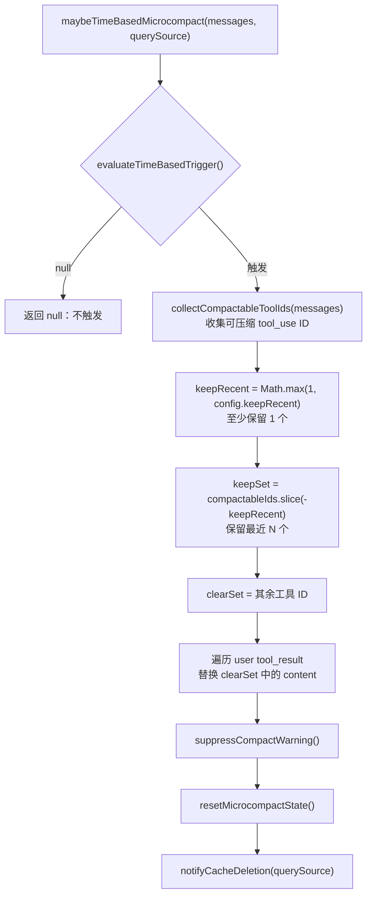

# Claude Code 微压缩：精准上下文修剪

## 6.1 前言：比全量压缩更轻的上下文修剪

> "The cheapest token is the one you never send."

第 4 章讲的是自动压缩：当上下文接近窗口上限时，Claude Code 通过一次 LLM 调用，把整段对话压成结构化摘要。第 5 章继续讲压缩后的状态恢复：摘要之后，文件、Skill、Plan、Delta 附件如何被补回来。

本章讲另一种更轻量的机制：**微压缩（microcompact）**。

微压缩解决的是一个更早、更细的问题：不要等上下文快满了才做全量摘要，而是在工具结果已经过时、缓存状态允许、或 API 可以服务端处理时，提前把低价值内容修掉。

它和全量压缩的差异很明确：

| 维度 | 全量自动压缩 | 微压缩 |
| --- | --- | --- |
| 触发时机 | 上下文接近窗口上限 | 工具结果过多、缓存过期、API 策略命中 |
| 是否调用 LLM 生成摘要 | 是 | 否 |
| 修改对象 | 整段对话历史 | 主要是旧工具结果、tool inputs、thinking blocks |
| 信息损失形态 | 原始对话变成摘要 | 指定工具结果被清除或服务端删除 |
| 目标 | 防止上下文溢出 | 减少无效 token 继续增长 |

本章的主线是：

```text
全量压缩代价高
  -> 先用时间触发清理冷缓存场景
  -> 再用缓存微压缩处理热缓存场景
  -> 同时用 API Context Management 做声明式服务端清理
  -> 通过工具集合、缓存中断检测和子代理隔离保证副作用可控
```

Claude Code 中有三种微压缩机制：

| 机制 | 执行位置 | 是否修改本地消息 | 是否依赖服务端缓存 | 适用场景 |
| --- | --- | --- | --- | --- |
| 基于时间的微压缩 | 客户端，API 调用前 | 是，把旧 `tool_result.content` 替换成占位文本 | 不依赖，反而假设缓存已过期 | 长时间离开后，缓存已经冷掉 |
| 缓存微压缩 | 客户端生成 `cache_edits`，API 层发送 | 否，本地消息不变 | 依赖 warm cache 和 cache editing | 实时会话中精准删除服务端缓存里的旧工具结果 |
| API Context Management | API 请求参数 | 否，由服务端执行 | 由 API 管理 | 声明式清理 tool uses / thinking blocks |

三者的优先级也不是并列随缘：

```text
microcompactMessages()
  -> 时间触发先执行，命中后短路
  -> 缓存微压缩其次，只在 main thread + feature/model 支持时执行
  -> API Context Management 独立作为请求参数发送
```

这条优先级背后的判断是：**冷缓存就直接改内容，热缓存才值得做 cache editing。**

## 6.2 基于时间的微压缩：缓存过期后的批量清理

基于时间的微压缩处理的是“用户离开很久再回来”的场景。

如果距离上一条 assistant 消息已经超过 1 小时，服务端 prompt cache 基本已经过期。下一次请求反正要重新写入完整前缀，那么先把旧工具结果清掉，就能减少 cache creation 成本。

### 6.2.1 配置参数

配置通过 GrowthBook 功能开关 `tengu_slate_heron` 下发，类型为 `TimeBasedMCConfig`：

```ts
// services/compact/timeBasedMCConfig.ts:18-28
export type TimeBasedMCConfig = {
  /** Master switch. When false, time-based microcompact is a no-op. */
  enabled: boolean
  /** Trigger when (now − last assistant timestamp) exceeds this many minutes. */
  gapThresholdMinutes: number
  /** Keep this many most-recent compactable tool results. */
  keepRecent: number
}

const TIME_BASED_MC_CONFIG_DEFAULTS: TimeBasedMCConfig = {
  enabled: false,
  gapThresholdMinutes: 60,
  keepRecent: 5,
}
```

三个参数分别控制：

| 参数 | 默认值 | 作用 |
| --- | ---: | --- |
| `enabled` | `false` | 总开关，默认灰度关闭 |
| `gapThresholdMinutes` | `60` | 距离上一条 assistant 消息超过多少分钟触发 |
| `keepRecent` | `5` | 保留最近多少个可压缩工具结果 |

`gapThresholdMinutes: 60` 是一个保守选择。源码注释说明它对齐服务端 1 小时 cache TTL：超过这个时间后，缓存本来就会失效，因此清理旧内容不会额外制造一次本来不存在的 cache miss。

### 6.2.2 触发判定

`evaluateTimeBasedTrigger()` 是一个纯判定函数，不直接修改消息：

```ts
// microCompact.ts:422-444
export function evaluateTimeBasedTrigger(
  messages: Message[],
  querySource: QuerySource | undefined,
): { gapMinutes: number; config: TimeBasedMCConfig } | null {
  const config = getTimeBasedMCConfig()
  if (!config.enabled || !querySource || !isMainThreadSource(querySource)) {
    return null
  }
  const lastAssistant = messages.findLast(m => m.type === 'assistant')
  if (!lastAssistant) {
    return null
  }
  const gapMinutes =
    (Date.now() - new Date(lastAssistant.timestamp).getTime()) / 60_000
  if (!Number.isFinite(gapMinutes) || gapMinutes < config.gapThresholdMinutes) {
    return null
  }
  return { gapMinutes, config }
}
```

这里有两个容易忽略的守卫：

第一，`config.enabled` 必须开启。

第二，`querySource` 必须存在且属于 main thread。

这和缓存微压缩的 `isMainThreadSource()` 有细微差异。`isMainThreadSource(undefined)` 为了向后兼容会把 `undefined` 视为主线程，但时间触发这里显式要求 `querySource` 存在。原因是 `/context`、`/compact`、`analyzeContext` 这类分析性调用可能不带 source，它们不应该因为“时间间隔很久”而改写消息内容。

### 6.2.3 执行流程

当触发条件满足时，`maybeTimeBasedMicrocompact()` 会保留最近 N 个可压缩工具结果，清除更早的结果。



核心修改逻辑：

```ts
// microCompact.ts:470-492
let tokensSaved = 0
const result: Message[] = messages.map(message => {
  if (message.type !== 'user' || !Array.isArray(message.message.content)) {
    return message
  }
  let touched = false
  const newContent = message.message.content.map(block => {
    if (
      block.type === 'tool_result' &&
      clearSet.has(block.tool_use_id) &&
      block.content !== TIME_BASED_MC_CLEARED_MESSAGE
    ) {
      tokensSaved += calculateToolResultTokens(block)
      touched = true
      return { ...block, content: TIME_BASED_MC_CLEARED_MESSAGE }
    }
    return block
  })
  if (!touched) return message
  return {
    ...message,
    message: { ...message.message, content: newContent },
  }
})
```

这段代码有两个设计点。

第一，它用不可变方式构造新消息数组，而不是原地改消息。只有 `touched` 的 user message 会被复制并替换 content。

第二，`block.content !== TIME_BASED_MC_CLEARED_MESSAGE` 是幂等性保护。已经清过的内容不会重复计入 `tokensSaved`，多次执行不会不断放大统计值。

### 6.2.4 副作用链

时间触发微压缩不仅改消息，还必须协调周边状态：

```ts
suppressCompactWarning()
// Cached-MC state (module-level) holds tool IDs registered on prior turns.
// We just content-cleared some of those tools AND invalidated the server
// cache by changing prompt content. If cached-MC runs next turn with the
// stale state, it would try to cache_edit tools whose server-side entries
// no longer exist. Reset it.
resetMicrocompactState()
// We just changed the prompt content — the next response's cache read will
// be low, but that's us, not a break. Tell the detector to expect a drop.
// notifyCacheDeletion (not notifyCompaction) because it's already imported
// here and achieves the same false-positive suppression — adding the second
// symbol to the import was flagged by the circular-deps check.
// Pass the actual querySource: getTrackingKey returns the full source string
// (e.g. 'repl_main_thread:outputStyle:custom'), not just the prefix.
if (feature('PROMPT_CACHE_BREAK_DETECTION') && querySource) {
  notifyCacheDeletion(querySource)
}
```

这条副作用链说明微压缩不是孤立优化：

- `suppressCompactWarning()`：既然释放了上下文空间，就不应该继续吓用户“上下文快满”；
- `resetMicrocompactState()`：消息内容被改了，服务端缓存也被破坏，旧的 cached MC 状态不能再用；
- `notifyCacheDeletion()`：下一次 cache read token 降低是预期行为，不应该被误报为 cache break。

源码注释中特别提到 `notifyCacheDeletion` 而不是 `notifyCompaction`，原因不是语义更完美，而是避免新增 import 触发循环依赖检查。这是大型代码库里很真实的工程折中。

## 6.3 缓存微压缩：不破坏本地消息的精准手术

时间触发适合冷缓存：反正缓存过期，可以直接改本地消息。

缓存微压缩适合热缓存：服务端缓存仍有价值，不能因为清理旧工具结果而破坏整个 cached prefix。

它的核心思路是：本地消息不改，只向 API 发送 `cache_edits`，让服务端在缓存里删除指定工具结果。

### 6.3.1 入口优先级：时间触发先短路

`microcompactMessages()` 先执行时间触发，再尝试缓存微压缩：

```ts
// microCompact.ts:267-270
const timeBasedResult = maybeTimeBasedMicrocompact(messages, querySource)
if (timeBasedResult) {
  return timeBasedResult
}
```

源码注释把互斥关系讲得很清楚：

```ts
// Time-based trigger runs first and short-circuits. If the gap since the
// last assistant message exceeds the threshold, the server cache has expired
// and the full prefix will be rewritten regardless — so content-clear old
// tool results now, before the request, to shrink what gets rewritten.
// Cached MC (cache-editing) is skipped when this fires: editing assumes a
// warm cache, and we just established it's cold.
```

这就是微压缩的核心分流：

| 缓存状态 | 使用机制 | 原因 |
| --- | --- | --- |
| cold cache | 时间触发微压缩 | 缓存已过期，直接改内容更简单 |
| warm cache | 缓存微压缩 | 保留缓存前缀，只发删除指令 |

### 6.3.2 cached MC 的启用条件

缓存微压缩不是只要 feature 开启就会运行。它还要求 cached MC 配置启用、模型支持 cache editing，并且 query source 属于 main thread：

```ts
// microCompact.ts:275-285
if (feature('CACHED_MICROCOMPACT')) {
  const mod = await getCachedMCModule()
  const model = toolUseContext?.options.mainLoopModel ?? getMainLoopModel()
  if (
    mod.isCachedMicrocompactEnabled() &&
    mod.isModelSupportedForCacheEditing(model) &&
    isMainThreadSource(querySource)
  ) {
    return await cachedMicrocompactPath(messages, querySource)
  }
}
```

这里先只看启用条件。为什么必须限制在 main thread、以及 `isMainThreadSource()` 为什么使用 prefix match，放到 6.7 统一解释，避免同一个点分散在两处。

### 6.3.3 工具注册与阈值判定

缓存微压缩先扫描消息，注册可压缩工具结果：

```ts
// microCompact.ts:313-329
const compactableToolIds = new Set(collectCompactableToolIds(messages))
// Second pass: register tool results grouped by user message
for (const message of messages) {
  if (message.type === 'user' && Array.isArray(message.message.content)) {
    const groupIds: string[] = []
    for (const block of message.message.content) {
      if (
        block.type === 'tool_result' &&
        compactableToolIds.has(block.tool_use_id) &&
        !state.registeredTools.has(block.tool_use_id)
      ) {
        mod.registerToolResult(state, block.tool_use_id)
        groupIds.push(block.tool_use_id)
      }
    }
    mod.registerToolMessage(state, groupIds)
  }
}
```

这里是两段式扫描：

1. 从 assistant 消息里收集可压缩工具的 `tool_use` ID；
2. 再到 user 消息里找到对应的 `tool_result`，注册进 cached MC 状态。

按 user message 分组注册，是为了让后续 API 层能把 `cache_edits` 放回正确的消息位置附近。

当前仓库里的 `cachedMicrocompact.ts` 是 stub，但 `microCompact.ts` 保留了调用契约：注册工具、按配置判断删除、创建 cache edits block、记录 pinned edits。这篇只分析可见契约，不把 stub 当作完整实现。

### 6.3.4 `pendingCacheEdits` 的单次消费

当有工具结果需要删除时，缓存微压缩会创建 `cache_edits` block：

```ts
// microCompact.ts:334-339
const toolsToDelete = mod.getToolResultsToDelete(state)

if (toolsToDelete.length > 0) {
  const cacheEdits = mod.createCacheEditsBlock(state, toolsToDelete)
  if (cacheEdits) {
    pendingCacheEdits = cacheEdits
  }
```

`pendingCacheEdits` 不是立即发送，而是由 API 层消费。

消费函数是单次语义：

```ts
export function consumePendingCacheEdits():
  | import('./cachedMicrocompact.js').CacheEditsBlock
  | null {
  const edits = pendingCacheEdits
  pendingCacheEdits = null
  return edits
}
```

API 层在定义 `paramsFromContext` 之前消费一次：

```ts
// claude.ts:1531-1532
const consumedCacheEdits = cachedMCEnabled ? consumePendingCacheEdits() : null
const consumedPinnedEdits = cachedMCEnabled ? getPinnedCacheEdits() : []
```

原稿里强调的点很重要：不能在 `paramsFromContext` 内部消费，因为它可能被日志、重试等路径调用多次。单次消费放在外面，可以避免第一次调用把 edits “偷走”，导致真正请求反而没有带上。

### 6.3.5 `cache_edits` 的 API 插入

API 层的 block 类型：

```ts
type CachedMCEditsBlock = {
  type: 'cache_edits'
  edits: { type: 'delete'; cache_reference: string }[]
}
```

`addCacheBreakpoints()` 会把新旧 `cache_edits` 织入消息数组。

第一步，重新插入 pinned edits：

```ts
// claude.ts:3128-3139
for (const pinned of pinnedEdits ?? []) {
  const msg = result[pinned.userMessageIndex]
  if (msg && msg.role === 'user') {
    if (!Array.isArray(msg.content)) {
      msg.content = [{ type: 'text', text: msg.content as string }]
    }
    const dedupedBlock = deduplicateEdits(pinned.block)
    if (dedupedBlock.edits.length > 0) {
      insertBlockAfterToolResults(msg.content, dedupedBlock)
    }
  }
}
```

第二步，插入新的 edits，并 pin 到当前位置：

```ts
// Insert new cache_edits into the last user message and pin them
if (newCacheEdits && result.length > 0) {
  const dedupedNewEdits = deduplicateEdits(newCacheEdits)
  if (dedupedNewEdits.edits.length > 0) {
    for (let i = result.length - 1; i >= 0; i--) {
      const msg = result[i]
      if (msg && msg.role === 'user') {
        if (!Array.isArray(msg.content)) {
          msg.content = [{ type: 'text', text: msg.content as string }]
        }
        insertBlockAfterToolResults(msg.content, dedupedNewEdits)
        // Pin so this block is re-sent at the same position in future calls
        pinCacheEdits(i, newCacheEdits as any)
```

为什么 pinned edits 需要每轮重复发送？

因为服务端需要看到一致的编辑历史，才能在缓存前缀中重建“哪些内容已经被删除”的状态。`cache_edits` 不是一次性本地副作用，而是需要持续出现在相同位置的缓存编辑说明。

### 6.3.6 baseline 与真实删除量

缓存微压缩不会用客户端估算作为最终节省量，而是等待 API 返回 `cache_deleted_input_tokens`。

操作前先记录 baseline：

```ts
// microCompact.ts:374-383
const lastAsst = messages.findLast(m => m.type === 'assistant')
const baseline =
  lastAsst?.type === 'assistant'
    ? ((
        lastAsst.message.usage as unknown as Record<
          string,
          number | undefined
        >
      )?.cache_deleted_input_tokens ?? 0)
    : 0
```

API 响应后再算 delta：

```ts
// query.ts:873-891
if (feature('CACHED_MICROCOMPACT') && pendingCacheEdits) {
  const lastAssistant = assistantMessages.at(-1)
  // The API field is cumulative/sticky across requests, so we
  // subtract the baseline captured before this request to get the delta.
  const usage = lastAssistant?.message.usage
  const cumulativeDeleted = usage
    ? ((usage as unknown as Record<string, number>)
        .cache_deleted_input_tokens ?? 0)
    : 0
  const deletedTokens = Math.max(
    0,
    cumulativeDeleted - pendingCacheEdits.baselineCacheDeletedTokens,
  )
```

这里的关键是：`cache_deleted_input_tokens` 是累积值，不是单次值。只有用当前累积值减去操作前 baseline，才是本次 microcompact 的实际删除量。

## 6.4 API Context Management：声明式上下文管理

前两种微压缩是客户端命令式逻辑：客户端判断、客户端决定删什么、客户端协调副作用。

API Context Management 是声明式逻辑：客户端把策略放进请求，服务端根据策略执行。

### 6.4.1 配置类型

`getAPIContextManagement()` 返回的配置结构很薄：

```ts
// apiMicrocompact.ts:59-62
export type ContextManagementConfig = {
  edits: ContextEditStrategy[]
}
```

策略类型有两种：

```ts
// apiMicrocompact.ts:36-53
| {
    type: 'clear_tool_uses_20250919'
    trigger?: {
      type: 'input_tokens'
      value: number        // 当 input tokens 超过此值时触发
    }
    keep?: {
      type: 'tool_uses'
      value: number        // 保留最近 N 个工具使用
    }
    clear_tool_inputs?: boolean | string[]  // 清除哪些工具的输入
    exclude_tools?: string[]                // 排除哪些工具
    clear_at_least?: {
      type: 'input_tokens'
      value: number        // 至少清除这么多 tokens
    }
  }
```

```ts
// apiMicrocompact.ts:54-56
| {
    type: 'clear_thinking_20251015'
    keep: { type: 'thinking_turns'; value: number } | 'all'
  }
```

第一类处理 tool uses，第二类处理 thinking blocks。

### 6.4.2 thinking 清理策略

`getAPIContextManagement()` 会根据 thinking 状态决定是否加入 `clear_thinking_20251015`：

```ts
// apiMicrocompact.ts:64-88
export function getAPIContextManagement(options?: {
  hasThinking?: boolean
  isRedactThinkingActive?: boolean
  clearAllThinking?: boolean
}): ContextManagementConfig | undefined {
  const {
    hasThinking = false,
    isRedactThinkingActive = false,
    clearAllThinking = false,
  } = options ?? {}

  const strategies: ContextEditStrategy[] = []

  // 策略 1: thinking 管理
  if (hasThinking && !isRedactThinkingActive) {
    strategies.push({
      type: 'clear_thinking_20251015',
      keep: clearAllThinking
        ? { type: 'thinking_turns', value: 1 }
        : 'all',
    })
  }
  // ...
}
```

三种状态可以整理成表：

| 条件 | 策略 |
| --- | --- |
| 没有 thinking | 不添加 thinking 清理策略 |
| 有 thinking 且 redact-thinking active | 不添加策略，因为 redacted block 没有模型可见内容 |
| 有 thinking 且 `clearAllThinking=false` | `keep: 'all'`，交给模型/API 默认策略 |
| 有 thinking 且 `clearAllThinking=true` | `keep: { type: 'thinking_turns', value: 1 }`，只保留最近 1 个 thinking turn |

`value` 不能设为 0。源码注释说明 API schema 要求 `value >= 1`，省略 edit 又会回退到模型策略默认值，可能无法达到“清掉 thinking”的目的。

### 6.4.3 工具清理的两种模式

API 工具清理默认只对 `USER_TYPE === 'ant'` 生效，并由环境变量打开。

模式一：清除工具结果输入。

```ts
// apiMicrocompact.ts:104-124
if (useClearToolResults) {
  const strategy: ContextEditStrategy = {
    type: 'clear_tool_uses_20250919',
    trigger: { type: 'input_tokens', value: triggerThreshold },
    clear_at_least: {
      type: 'input_tokens',
      value: triggerThreshold - keepTarget,
    },
    clear_tool_inputs: TOOLS_CLEARABLE_RESULTS,
  }
  strategies.push(strategy)
}
```

模式二：清除工具使用，同时排除写入类工具。

```ts
// apiMicrocompact.ts:128-149
if (useClearToolUses) {
  const strategy: ContextEditStrategy = {
    type: 'clear_tool_uses_20250919',
    trigger: { type: 'input_tokens', value: triggerThreshold },
    clear_at_least: {
      type: 'input_tokens',
      value: triggerThreshold - keepTarget,
    },
    exclude_tools: TOOLS_CLEARABLE_USES,
  }
  strategies.push(strategy)
}
```

默认参数是：

| 参数 | 默认值 | 含义 |
| --- | ---: | --- |
| `DEFAULT_MAX_INPUT_TOKENS` | 180,000 | 超过该输入规模后触发 |
| `DEFAULT_TARGET_INPUT_TOKENS` | 40,000 | 清理后目标保留规模 |
| `clear_at_least` | 140,000 | 至少清理 `180K - 40K` |

可以通过 `API_MAX_INPUT_TOKENS` 和 `API_TARGET_INPUT_TOKENS` 覆盖。

### 6.4.4 API 请求中的挂载位置

API 层构造 context management：

```ts
const contextManagement = getAPIContextManagement({
  hasThinking,
  isRedactThinkingActive: betasParams.includes(REDACT_THINKING_BETA_HEADER),
  clearAllThinking: thinkingClearLatched,
})
```

只有在 beta header 存在时才真正挂到请求参数里：

```ts
...(contextManagement &&
  useBetas &&
  betasParams.includes(CONTEXT_MANAGEMENT_BETA_HEADER) && {
    context_management: contextManagement,
  }),
```

这保证了声明式策略不会被发送到不支持该 beta 的 API 环境。

## 6.5 可压缩工具集：三套名单不是一回事

微压缩容易被误解成“所有工具结果都会清”。实际上不同机制有不同工具集合。

### 6.5.1 客户端微压缩工具集

时间触发和缓存微压缩共用 `COMPACTABLE_TOOLS`：

```ts
// microCompact.ts:41-50
const COMPACTABLE_TOOLS = new Set<string>([
  FILE_READ_TOOL_NAME,      // Read
  ...SHELL_TOOL_NAMES,       // Bash (多个 shell 变体)
  GREP_TOOL_NAME,            // Grep
  GLOB_TOOL_NAME,            // Glob
  WEB_SEARCH_TOOL_NAME,      // WebSearch
  WEB_FETCH_TOOL_NAME,       // WebFetch
  FILE_EDIT_TOOL_NAME,       // Edit
  FILE_WRITE_TOOL_NAME,      // Write
])
```

它覆盖读取、搜索、网页、Shell，以及 Edit/Write 的结果。

### 6.5.2 API clear_tool_inputs 工具集

```ts
// apiMicrocompact.ts:19-26
const TOOLS_CLEARABLE_RESULTS = [
  ...SHELL_TOOL_NAMES,
  GLOB_TOOL_NAME,
  GREP_TOOL_NAME,
  FILE_READ_TOOL_NAME,
  WEB_FETCH_TOOL_NAME,
  WEB_SEARCH_TOOL_NAME,
]
```

这组偏向“输出大、可重新获取”的工具：Shell、搜索、读文件、Web。

### 6.5.3 API exclude_tools 工具集

```ts
// apiMicrocompact.ts:28-32
const TOOLS_CLEARABLE_USES = [
  FILE_EDIT_TOOL_NAME,       // Edit
  FILE_WRITE_TOOL_NAME,      // Write
  NOTEBOOK_EDIT_TOOL_NAME,   // NotebookEdit
]
```

这组是写入类工具。它们在 API 模式下通过 `exclude_tools` 参与策略，而不是放进 `clear_tool_inputs`。

### 6.5.4 三套名单对比

| 工具类型 | 客户端微压缩 `COMPACTABLE_TOOLS` | API `TOOLS_CLEARABLE_RESULTS` | API `TOOLS_CLEARABLE_USES` | 说明 |
| --- | --- | --- | --- | --- |
| Shell / Bash | 是 | 是 | 否 | 输出常大，适合清理 |
| Glob | 是 | 是 | 否 | 搜索结果可重跑 |
| Grep | 是 | 是 | 否 | 搜索结果可重跑 |
| FileRead | 是 | 是 | 否 | 文件内容可重新读取 |
| WebFetch / WebSearch | 是 | 是 | 否 | Web 结果通常较大 |
| FileEdit / FileWrite | 是 | 否 | 是 | 客户端可清结果，API 侧按 tool uses 策略处理 |
| NotebookEdit | 否 | 否 | 是 | 只出现在 API tool uses 策略里 |

这个差异说明客户端和服务端负责的清理粒度不同。客户端主要围绕 tool result；API Context Management 可以更细地处理 tool uses、tool inputs 和 thinking blocks。

## 6.6 缓存中断检测：让预期下降不被误报

微压缩会减少 cache read tokens。如果检测器不知情，就会把这种预期下降误判为缓存中断。

Claude Code 用两个通知函数协调。

### 6.6.1 `notifyCacheDeletion()`

源码片段：

```ts
// promptCacheBreakDetection.ts:673-682
export function notifyCacheDeletion(
  querySource: QuerySource,
  agentId?: AgentId,
): void {
  const key = getTrackingKey(querySource, agentId)
  const state = key ? previousStateBySource.get(key) : undefined
  if (state) {
    state.cacheDeletionsPending = true
  }
}
```

下一次检测时，如果看到 `cacheDeletionsPending`，就跳过本次 cache break 检测：

```ts
// promptCacheBreakDetection.ts:472-481
if (state.cacheDeletionsPending) {
  state.cacheDeletionsPending = false
  logForDebugging(
    `[PROMPT CACHE] cache deletion applied, cache read: ${prevCacheRead}
     → ${cacheReadTokens} (expected drop)`,
  )
  state.pendingChanges = null
  return
}
```

调用场景：

- 缓存微压缩发送 `cache_edits` 后；
- 时间触发微压缩修改消息内容后。

语义是：下一次 cache read 下降是预期的，只跳过这一次。

### 6.6.2 `notifyCompaction()`

源码片段：

```ts
// promptCacheBreakDetection.ts:689-698
export function notifyCompaction(
  querySource: QuerySource,
  agentId?: AgentId,
): void {
  const key = getTrackingKey(querySource, agentId)
  const state = key ? previousStateBySource.get(key) : undefined
  if (state) {
    state.prevCacheReadTokens = null
  }
}
```

调用场景是完整 compact 或 auto compact 完成后。

语义是：对话历史已经被大幅改变，上一轮 `cache_read_tokens` 不再有比较意义，所以直接清掉 baseline。

### 6.6.3 两个通知函数的区别

| 函数 | 用于 | 做法 | 语义 |
| --- | --- | --- | --- |
| `notifyCacheDeletion()` | 微压缩 / cache edits | 设置 `cacheDeletionsPending = true` | 下一次下降是预期删除，不要误报 |
| `notifyCompaction()` | 全量压缩 | 设置 `prevCacheReadTokens = null` | 历史已重写，重新建立 baseline |

这两个函数体现了一个原则：上下文管理操作必须让观测系统知道“这是我主动做的”，否则可观测性会变成噪音源。

## 6.7 子代理隔离：为什么 cached MC 只跑主线程

子代理有自己的对话历史。缓存微压缩如果不隔离，会出现跨对话污染。

源码注释已经说明风险：

```ts
// Only run cached MC for the main thread to prevent forked agents
// (session_memory, prompt_suggestion, etc.) from registering their
// tool_results in the global cachedMCState, which would cause the main
// thread to try deleting tools that don't exist in its own conversation.
```

问题根源是 `cachedMCState` 是模块级全局状态，不是每个 agent 独立一份。

因此 cached MC 必须满足：

- feature 开启；
- cached MC 配置启用；
- 模型支持 cache editing；
- querySource 属于 main thread。

`isMainThreadSource()` 的实现使用 prefix match，而不是精确等于 `repl_main_thread`：

```ts
// microCompact.ts:249-251
function isMainThreadSource(querySource: QuerySource | undefined): boolean {
  return !querySource || querySource.startsWith('repl_main_thread')
}
```

这是因为 `promptCategory.ts` 会把非默认输出样式编码进 querySource，例如 `repl_main_thread:outputStyle:<style>`。如果只做精确匹配，使用自定义输出样式的主线程会被误排除。

时间触发也要求显式 main-thread querySource。API Context Management 则作为请求级配置存在，是否生效由 API beta 和请求上下文控制。

## 6.8 用户能做什么

### 6.8.1 理解“工具结果消失”

如果长会话后期看到旧工具结果变成：

```text
[Old tool result content cleared]
```

这通常不是模型幻觉，而是时间触发微压缩主动清理了旧工具结果。

需要重新参考时，让模型重新执行搜索或重新读取文件，比要求它回忆旧结果更可靠。

### 6.8.2 长时间离开后的预期管理

离开超过 1 小时再回来，时间触发微压缩可能清除大部分旧工具结果，只保留最近几个。

这是为了减少冷缓存重写成本。回来后让模型重新读取关键文件，是正常且高效的操作。

### 6.8.3 把长期约束放到记忆文件

微压缩主要清理工具结果，不会清掉系统提示词中的项目记忆。

如果某些信息必须长期生效，例如：

- 项目架构约定；
- 关键文件路径；
- 禁止使用的方案；
- 测试命令；
- 发布流程。

更稳的做法是写入 `CLAUDE.md` 或项目规则，而不是只让它出现在一次工具输出里。

### 6.8.4 控制工具输出规模

微压缩会帮你清理旧工具结果，但最省 token 的方式仍然是少产生无效输出。

更好的使用方式：

- 用更精确的 grep pattern；
- 读取文件时指定范围；
- 避免让模型一次性 dump 大量日志；
- 搜索后让模型提炼结论，而不是长期依赖原始输出。

### 6.8.5 知道哪些工具更容易被清理

搜索、读取、Shell、Web 这类工具结果最容易被清理，因为它们通常体积大、可重新获取。

写入类工具在不同机制里处理方式不同。客户端微压缩可处理 FileEdit/FileWrite 的结果，API Context Management 通过另一套 tool uses 策略处理写入类工具。

这能帮助你解释长会话里的行为变化：模型不是“突然忘了所有东西”，而是旧工具输出被预算机制修掉了。

## 6.9 设计模式总结

微压缩系统体现了几条可复用的工程模式。

第一，**按缓存冷热分流**。

冷缓存场景直接改内容，热缓存场景用 cache editing。不要为了“统一实现”牺牲缓存效率。

第二，**命令式与声明式并存**。

客户端微压缩适合做细粒度、可观测、可插入边界消息的操作；API Context Management 适合交给服务端按 token 阈值执行。

第三，**副作用显式协调**。

微压缩会影响 warning、cached MC state、cache break detection。源码用显式函数调用串起因果链，比隐式事件更容易审查。

第四，**一次性状态要单次消费**。

`consumePendingCacheEdits()` 取出后立刻清空，避免多次构造请求参数时重复或丢失 edits。这适用于任何跨模块传递“一次性操作”的场景。

第五，**观测系统要理解主动优化**。

如果系统主动删除缓存内容，却不通知 cache break detector，监控就会误报。优化机制必须和观测机制一起设计。

第六，**子代理共享状态要非常谨慎**。

只要状态是模块级全局，就必须明确作用域。cached MC 排除子代理，是为了避免跨对话删除不存在的工具结果。

## 6.10 版本演化：v2.1.91 的相关信号

以下分析基于 v2.1.91 bundle 信号对比，结合 v2.1.88 源码推断。

### 6.10.1 冷压缩（Cold Compact）

v2.1.91 引入了 `tengu_cold_compact` 事件，暗示在现有“热压缩”之外，新增了一种更偏冷启动或空闲后清理的策略。

可以把它放进本章的主线理解：当缓存已经冷掉时，系统更愿意用低成本方式清掉旧上下文，而不是等到上下文压力变成紧急压缩。

### 6.10.2 压缩确认 UI

新增 `tengu_autocompact_dialog_opened` 事件表明 v2.1.91 引入了压缩确认 UI。

这和 v2.1.88 中较静默的压缩体验不同：压缩从后台自动行为，开始变成用户可见、可理解的上下文管理事件。

### 6.10.3 快速回填熔断器

`tengu_auto_compact_rapid_refill_breaker` 指向一个边缘问题：压缩后，如果大量工具结果很快重新填满上下文，系统可能进入“压缩 -> 回填 -> 再压缩”的循环。

快速回填熔断器的意义是：压缩不能只看当前是否释放了空间，还要看释放后是否马上被填回。如果是，就应该中断循环，避免无意义 API 开销。

### 6.10.4 手动压缩追踪

`tengu_autocompact_command` 将用户手动触发的 `/compact` 与系统自动触发的压缩区分开。

这让遥测能回答一个关键问题：上下文管理是用户主动选择的，还是系统为了维持运行被动触发的。

## 6.11 小结：微压缩是全量压缩前的精细修剪

微压缩不是自动压缩的替代品，而是它的前置减压层。

它做的事更小、更早、更便宜：

- 时间触发微压缩在缓存过期后清掉旧工具结果，减少下一次 cache creation；
- 缓存微压缩在缓存仍热时用 `cache_edits` 删除服务端缓存内容，不破坏本地消息；
- API Context Management 把 tool uses 和 thinking blocks 的清理交给服务端声明式执行；
- 缓存中断检测和子代理隔离保证这些优化不会制造误报或跨会话污染。

一句话总结：

> Claude Code 的微压缩是一套精准上下文修剪系统：它不等上下文溢出才摘要，而是在工具结果变旧、缓存状态变化或 API 策略命中时，提前把低价值 token 从上下文路径中移走。
