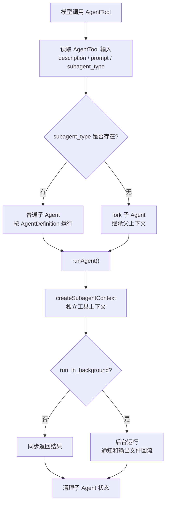

# Claude Code 多代理：任务如何交给子 Agent

> **定位**：本章只讲清楚一件事：主 Agent 如何通过 AgentTool 把任务交给子 Agent。重点是派生入口、角色定义、普通子 Agent 与 fork 子 Agent 的分岔、`runAgent()` 隔离运行、同步/后台回流和清理边界。不展开 Agent 内部 queryLoop 细节。

多代理系统的核心问题是：

```text
主 Agent 需要并行或隔离处理子任务，
但不能让子 Agent 污染主上下文、继承错误权限，或在后台失控。
```

所以它的主线是：

```text
AgentTool 发起派生
  -> AgentDefinition 决定角色
  -> subagent_type 决定普通子 Agent 还是 fork
  -> runAgent 构造独立运行舱
  -> 同步返回或后台通知
  -> 清理身份、缓存、MCP、文件状态
```

---

## 19.1 先看一条主线



这张图就是本章全部逻辑。不要把多代理理解成“几个模型自由聊天”。在 Claude Code 里，它仍然是一次工具调用，只是这个工具启动了另一个 Agent。

---

## 19.2 AgentTool 是唯一派生入口

子 Agent 不是随便启动的。主 Agent 必须调用 `AgentTool`。

源码参考：`src/tools/AgentTool/AgentTool.tsx:81-88`

```typescript
// Base input schema without multi-agent parameters
const baseInputSchema = lazySchema(() => z.object({
  description: z.string().describe('A short (3-5 word) description of the task'),
  prompt: z.string().describe('The task for the agent to perform'),
  subagent_type: z.string().optional().describe('The type of specialized agent to use for this task'),
  model: z.enum(['sonnet', 'opus', 'haiku']).optional().describe("Optional model override for this agent. Takes precedence over the agent definition's model frontmatter. If omitted, uses the agent definition's model, or inherits from the parent."),
  run_in_background: z.boolean().optional().describe('Set to true to run this agent in the background. You will be notified when it completes.')
}));
```

这几个字段对应多代理的关键决策：

| 字段 | 作用 |
|---|---|
| `description` | 给用户和系统看的短任务名 |
| `prompt` | 子 Agent 真正要执行的任务 |
| `subagent_type` | 指定专业 Agent；缺省时通常走 fork |
| `model` | 可覆盖子 Agent 使用的模型 |
| `run_in_background` | 是否后台运行 |

关键是 `subagent_type`：

```text
填了 subagent_type：选择一个定义好的专业 Agent。
不填 subagent_type：更像 fork 当前 Agent 去做旁路任务。
```

---

## 19.3 AgentDefinition 决定“这个子 Agent 是谁”

AgentTool 只是入口。真正决定子 Agent 身份的是 `AgentDefinition`。

源码参考：`src/tools/AgentTool/loadAgentsDir.ts:105-132`

```typescript
// Base type with common fields for all agents
export type BaseAgentDefinition = {
  agentType: string
  whenToUse: string
  tools?: string[]
  disallowedTools?: string[]
  skills?: string[] // Skill names to preload (parsed from comma-separated frontmatter)
  mcpServers?: AgentMcpServerSpec[] // MCP servers specific to this agent
  hooks?: HooksSettings // Session-scoped hooks registered when agent starts
  color?: AgentColorName
  model?: string
  effort?: EffortValue
  permissionMode?: PermissionMode
  maxTurns?: number // Maximum number of agentic turns before stopping
  filename?: string // Original filename without .md extension (for user/project/managed agents)
  baseDir?: string
  criticalSystemReminder_EXPERIMENTAL?: string // Short message re-injected at every user turn
  requiredMcpServers?: string[] // MCP server name patterns that must be configured for agent to be available
  background?: boolean // Always run as background task when spawned
  initialPrompt?: string // Prepended to the first user turn (slash commands work)
  memory?: AgentMemoryScope // Persistent memory scope
  isolation?: 'worktree' | 'remote' // Run in an isolated git worktree, or remotely in CCR (ant-only)
  pendingSnapshotUpdate?: { snapshotTimestamp: string }
```

读这个类型时抓住四类信息：

| 类别 | 字段 |
|---|---|
| 何时使用 | `agentType`、`whenToUse` |
| 能力边界 | `tools`、`disallowedTools`、`skills`、`mcpServers` |
| 推理配置 | `model`、`effort`、`maxTurns` |
| 运行隔离 | `permissionMode`、`background`、`memory`、`isolation` |

也就是说，AgentDefinition 不是一段 prompt，而是一份“子 Agent 运行配置”。

---

## 19.4 模型如何知道有哪些 Agent

模型要能委派，必须先看到可用 Agent 列表。AgentTool 会把 AgentDefinition 格式化成列表。

源码参考：`src/tools/AgentTool/prompt.ts:43-64`

```typescript
export function formatAgentLine(agent: AgentDefinition): string {
  const toolsDescription = getToolsDescription(agent)
  return `- ${agent.agentType}: ${agent.whenToUse} (Tools: ${toolsDescription})`
}

/**
 * Whether the agent list should be injected as an attachment message instead
 * of embedded in the tool description. When true, getPrompt() returns a static
 * description and attachments.ts emits an agent_listing_delta attachment.
 *
 * The dynamic agent list was ~10.2% of fleet cache_creation tokens: MCP async
 * connect, /reload-plugins, or permission-mode changes mutate the list →
 * description changes → full tool-schema cache bust.
 *
 * Override with CLAUDE_CODE_AGENT_LIST_IN_MESSAGES=true/false for testing.
 */
export function shouldInjectAgentListInMessages(): boolean {
```

这里有两个点：

1. Agent 列表告诉模型“什么时候用哪个 Agent”；
2. 列表可能通过附件注入，而不是塞进工具描述，以保护工具 schema 缓存稳定。

---

## 19.5 两条派生路径：普通子 Agent 与 fork

多代理最重要的分岔是：

| 路径 | 触发方式 | 核心特点 |
|---|---|---|
| 普通子 Agent | 指定 `subagent_type` | 使用某个 AgentDefinition，适合专业角色 |
| fork 子 Agent | 省略 `subagent_type` | 继承父上下文，适合并行探索或旁路执行 |

可以这样理解：

```text
普通子 Agent = 找一个专业同事来做事。
fork 子 Agent = 复制当前上下文，开一条旁路线。
```

两者最后都会进入 `runAgent()`，但上下文构造不同：

- 普通子 Agent 重点是按 AgentDefinition 重建身份、工具、权限和系统提示词；
- fork 重点是继承父上下文，尽量保持缓存一致，同时避免把中间工具噪音拉回主上下文。

---

## 19.6 `runAgent()` 是子 Agent 的运行边界

`runAgent()` 是子 Agent 真正独立运行的入口。

源码参考：`src/tools/AgentTool/runAgent.ts:248-330`

关键参数可以分成几类：

| 参数 | 作用 |
|---|---|
| `agentDefinition` | 子 Agent 身份 |
| `promptMessages` | 子 Agent 初始任务 |
| `toolUseContext` | 父上下文来源 |
| `availableTools` / `allowedTools` | 子 Agent 工具池与允许规则 |
| `forkContextMessages` | fork 路径继承的父消息 |
| `isAsync` | 是否后台运行 |
| `override` | 覆盖 system/user context、agentId、abortController 等 |
| `contentReplacementState` | 恢复工具结果替换状态，保护 prompt cache |
| `useExactTools` | fork 路径保持工具前缀一致 |

这说明 `runAgent()` 的职责不是“简单再调用一次模型”，而是：

```text
为子 Agent 重新构造一个可运行的 Agent Loop 环境。
```

---

## 19.7 createSubagentContext：给子 Agent 独立运行舱

子 Agent 不能直接复用父 Agent 的全部运行上下文。它需要一个独立的 `ToolUseContext`。

源码参考：`src/tools/AgentTool/runAgent.ts:700-712`

```typescript
  const agentToolUseContext = createSubagentContext(toolUseContext, {
    options: agentOptions,
    agentId,
    agentType: agentDefinition.agentType,
    messages: initialMessages,
    readFileState: agentReadFileState,
    abortController: agentAbortController,
    getAppState: agentGetAppState,
    // Sync agents share these callbacks with parent
    shareSetAppState: !isAsync,
    shareSetResponseLength: true, // Both sync and async contribute to response metrics
    criticalSystemReminder_EXPERIMENTAL:
      agentDefinition.criticalSystemReminder_EXPERIMENTAL,
```

这个“运行舱”隔离了几件事：

| 隔离对象 | 为什么要隔离 |
|---|---|
| `agentId` / `agentType` | 区分不同子 Agent 的日志、状态和缓存 |
| `messages` | 子 Agent 有自己的对话历史 |
| `readFileState` | 防止文件状态缓存互相污染 |
| `abortController` | 子 Agent 可独立中断 |
| `getAppState` | 子 Agent 可看到自己的工具和权限状态 |

多代理能安全运行，靠的不是“提示词说不要干扰主 Agent”，而是运行上下文真的隔开了。

---

## 19.8 同步返回与后台运行

AgentTool 支持同步和后台两种回流方式：

| 方式 | 适合什么 | 结果怎么回来 |
|---|---|---|
| 同步 | 小任务、主 Agent 立刻需要结果 | tool_result 直接返回 |
| 后台 | 长任务、可并行任务 | 通知、状态、输出文件回流 |

`run_in_background` 是显式参数；AgentDefinition 也可以声明 `background`。

关键设计是：

```text
后台 Agent 不能阻塞主 Agent；
但必须有可观察状态和完成通知。
```

因此后台路径会保留 agent metadata、输出文件和通知通道。主 Agent 不应该猜测后台结果，而是等通知或读取明确输出。

---

## 19.9 生命周期清理：子 Agent 结束后必须拆干净

子 Agent 会创建自己的状态、MCP 连接、文件缓存、tracking key、perfetto registry 等。结束时必须清理。

源码参考：`src/tools/AgentTool/runAgent.ts:825-832`

关键清理动作包括：

| 清理项 | 目的 |
|---|---|
| `cleanupAgentTracking(agentId)` | 清掉缓存中断检测里的子 Agent 状态 |
| `agentToolUseContext.readFileState.clear()` | 释放克隆的文件状态缓存 |
| `initialMessages.length = 0` | 释放 fork 继承的消息数组 |
| MCP cleanup | 关闭 agent-specific MCP server |
| unregister registry | 移除性能/可观测性注册 |

这一步容易被忽视，但它决定了多代理是否能长期稳定运行。

---

## 19.10 容易误解的边界

| 误解 | 正确理解 |
|---|---|
| 多代理就是多个模型自由聊天 | 子 Agent 必须通过 AgentTool 派生 |
| `subagent_type` 可有可无，没有语义 | 它是普通子 Agent 与 fork 的关键分岔 |
| 子 Agent 继承父 Agent 的所有工具限制 | 子 Agent 会按自己的 AgentDefinition 和权限上下文重建工具池 |
| fork 会把所有中间输出带回主上下文 | fork 重点是隔离中间噪音，只回流结果 |
| 后台 Agent 可以让主 Agent 猜结果 | 不可以，主 Agent 应等通知或明确输出 |
| 子 Agent 结束就自然消失 | 需要显式清理 tracking、文件缓存、MCP 等状态 |

---

## 19.11 设计模式总结

### 模式一：派生也是工具调用

把“启动子 Agent”放进 Tool 系统，可以复用权限、可观测性、结果预算和中断机制。

### 模式二：角色定义和任务输入分离

AgentDefinition 描述“这个角色是谁”；AgentTool input 描述“这次让它做什么”。

### 模式三：普通子 Agent 与 fork 分流

专业角色用普通子 Agent；并行探索和旁路任务用 fork。

### 模式四：上下文隔离靠运行结构，不靠口头约束

`createSubagentContext()` 为子 Agent 构造独立消息、文件状态、权限、abort signal 和 app state。

### 模式五：后台运行必须有回流机制

后台 Agent 不能阻塞主线程，但必须通过通知、状态和输出文件回流。

---

## 19.12 对我们的启发

如果你在设计多 Agent 系统，可以借鉴：

1. 把派生 Agent 设计成工具调用，而不是隐藏控制流。
2. 用 AgentDefinition 描述角色，用 prompt 描述本次任务。
3. 明确区分“专业子 Agent”和“fork 当前上下文”。
4. 子 Agent 必须有独立上下文和清理逻辑。
5. 后台任务必须可观察，不能依赖主 Agent 猜测结果。
6. 动态 Agent 列表最好用附件等方式注入，避免工具 schema 抖动。

---

## 19.13 小结

多代理系统可以用一条线讲清楚：

```text
模型调用 AgentTool；
AgentDefinition 决定子 Agent 身份；
subagent_type 决定普通子 Agent 还是 fork；
runAgent 构造独立运行环境；
子 Agent 同步返回或后台通知；
结束后清理身份、缓存、MCP 和文件状态。
```

这套设计让 Claude Code 可以把复杂任务拆出去做，同时尽量保持主上下文干净、权限边界明确、后台任务可观察。

