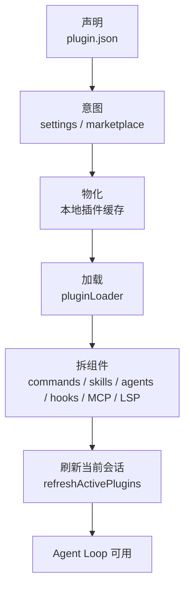

# Claude Code Plugin 系统：外部能力包如何进入当前会话

> **定位**：本章只讲清楚一件事：一个外部 Plugin 如何从“被声明/安装”变成当前 Agent 会话可用的 commands、skills、agents、hooks、MCP/LSP 等能力。不讲插件开发教程，不展开每种能力内部实现。

Plugin 系统的核心问题是：

```text
外部能力包可以来自很多地方，
但当前会话只能使用已经校验、缓存、加载并激活过的能力。
```

所以 Plugin 不是 Skill 的同义词。更准确地说：

```text
Plugin = 能力分发包
Skill  = Plugin 可能提供的一种能力
```

---

## 17.1 先看一条主线

```text
plugin.json 声明能力
  -> settings / marketplace 表达安装意图
  -> reconciler 物化到本地缓存
  -> pluginLoader 校验并读取插件
  -> component loaders 拆成内部组件
  -> refreshActivePlugins 交换进当前会话
  -> Agent Loop 使用这些能力
```

对应流程图：



这篇文章只沿着这条线讲，不把每个组件都展开成独立专题。

---

## 17.2 Plugin 到底是什么

Plugin 是一个能力包。它可以同时携带多种能力：

| Plugin 能力 | 进入 Claude Code 后变成什么 |
|---|---|
| `commands` | slash command / prompt command |
| `skills` | SkillTool 可发现的专业指令 |
| `agents` | AgentTool 可委派的 AgentDefinition |
| `hooks` | Hook 系统里的事件处理规则 |
| `mcpServers` | MCP 工具、资源或命令来源 |
| `lspServers` | 语言服务能力 |
| `outputStyles` | 输出风格 |
| `settings` / `userConfig` | 插件配置 |

源码里 `PluginManifestSchema` 把这些能力组合成一个 manifest。

源码参考：`src/utils/plugins/schemas.ts:884-898`

```typescript
export const PluginManifestSchema = lazySchema(() =>
  z.object({
    ...PluginManifestMetadataSchema().shape,
    ...PluginManifestHooksSchema().partial().shape,
    ...PluginManifestCommandsSchema().partial().shape,
    ...PluginManifestAgentsSchema().partial().shape,
    ...PluginManifestSkillsSchema().partial().shape,
    ...PluginManifestOutputStylesSchema().partial().shape,
    ...PluginManifestChannelsSchema().partial().shape,
    ...PluginManifestMcpServerSchema().partial().shape,
    ...PluginManifestLspServerSchema().partial().shape,
    ...PluginManifestSettingsSchema().partial().shape,
    ...PluginManifestUserConfigSchema().partial().shape,
  }),
)
```

这段 schema 说明一件事：

```text
Plugin 的边界是“能力声明集合”，不是某一种能力本身。
```

---

## 17.3 第一段：声明和安装意图是两回事

`plugin.json` 只说明插件“能提供什么”。但用户是否想安装、启用、更新它，是另一层意图。

| 层 | 回答的问题 | 典型来源 |
|---|---|---|
| manifest | 这个插件能提供什么 | 插件目录里的 `plugin.json` |
| install intent | 用户想安装哪个插件 | settings / marketplace |
| enabled state | 当前是否启用 | settings / 会话配置 |

这三层分开很重要：

```text
声明能力，不等于已经安装；
安装到本地，不等于当前会话已经激活。
```

---

## 17.4 第二段：Reconciler 把安装意图变成本地文件

外部来源不稳定：marketplace 可能是远端仓库，NPM 包可能需要下载，session-only plugin 可能来自命令行目录。运行时不能每次都直接依赖远端来源。

因此 reconciler 做的是“物化”：

```text
把 settings / marketplace 里的安装意图，
变成 ~/.claude/plugins/ 下可读取的本地插件缓存。
```

源码参考：

- `src/utils/plugins/reconciler.ts:2-7`
- `src/utils/plugins/reconciler.ts:114`
- `src/utils/plugins/headlessPluginInstall.ts:94-137`

读者只需要抓住：

```text
reconciler 不负责把插件能力装进会话；
它只负责保证本地有一份可加载的插件文件。
```

---

## 17.5 第三段：pluginLoader 校验并读取插件

当本地有插件文件后，`pluginLoader` 才开始工作。它负责：

| 动作 | 目的 |
|---|---|
| 读取插件目录 | 找到 manifest 和组件目录 |
| 校验 manifest | 防止无效字段进入运行时 |
| 收集 enabled / disabled / errors | 当前可用性可观察 |
| 解析 hooks / settings 等 | 为后续组件 loader 做准备 |

源码参考：

- `src/utils/plugins/pluginLoader.ts:987`
- `src/utils/plugins/pluginLoader.ts:1033`
- `src/utils/plugins/pluginLoader.ts:1147-1168`

这里不要把 loader 讲成“最终激活”。它只是把本地文件读成结构化插件对象。是否进入当前会话，要等 refresh。

---

## 17.6 第四段：组件加载器把 Plugin 拆回内部系统

Plugin 进入 Claude Code 后，不再以“Plugin”这个整体被模型使用。它会被拆成已有内部系统能理解的组件。

| Plugin 组件 | 进入哪个内部系统 | 源码锚点 |
|---|---|---|
| commands / skills | Command / Skill 系统 | `src/utils/plugins/loadPluginCommands.ts` |
| agents | AgentDefinition / AgentTool | `src/utils/plugins/loadPluginAgents.ts:231` |
| hooks | Hook 注册表 | `src/utils/plugins/loadPluginHooks.ts:91` |
| MCP servers | MCP 连接管理 | `src/utils/plugins/mcpPluginIntegration.ts:131` |
| LSP servers | LSP 集成 | `src/utils/plugins/lspPluginIntegration.ts:57` |

这一步是 Plugin 系统最关键的边界：

```text
Plugin 负责分发；
真正运行时，能力分别进入 Command、Skill、Agent、Hook、MCP、LSP 等系统。
```

所以 Plugin 文档不需要重复解释 Skill、Agent、Hook 的内部逻辑。它只需要说明：Plugin 如何把这些能力送到对应系统。

---

## 17.7 第五段：refreshActivePlugins 交换进当前会话

加载出来的组件不会自动进入当前 Agent 会话。`refreshActivePlugins()` 才是运行时交换点。

源码注释把三层模型写得很清楚。

源码参考：`src/utils/plugins/refresh.ts:1-14`

```typescript
/**
 * Layer-3 refresh primitive: swap active plugin components in the running session.
 *
 * Three-layer model (see reconciler.ts for Layer-2):
 * - Layer 1: intent (settings)
 * - Layer 2: materialization (~/.claude/plugins/) — reconcileMarketplaces()
 * - Layer 3: active components (AppState) — this file
 *
 * Called from:
 * - /reload-plugins command (interactive, user-initiated)
 * - print.ts refreshPluginState() (headless, auto before first query with SYNC_PLUGIN_INSTALL)
 * - performBackgroundPluginInstallations() (background, auto after new marketplace install)
 *
 * NOT called from:
```

`refreshActivePlugins()` 的主动作：

| 动作 | 意义 |
|---|---|
| 清理 plugin caches | 确保读取最新插件状态 |
| `loadAllPlugins()` | 得到 enabled / disabled / errors |
| 读取 plugin commands / agents | 准备交换进 AppState |
| 加载 hooks | 更新 hook 注册 |
| 加载 MCP / LSP | 让连接管理器看到新服务 |
| 更新 AppState | 当前会话实际可用能力变化 |

源码参考：`src/utils/plugins/refresh.ts:72-120`

这一步之后，Plugin 才真正影响当前 Agent 会话。

---

## 17.8 三种触发 refresh 的场景

| 场景 | 谁触发 | 为什么需要 |
|---|---|---|
| 交互式 `/reload-plugins` | 用户显式触发 | 用户知道磁盘或配置变了 |
| headless 首轮前刷新 | print/headless 路径 | 非交互式也要拿到最新插件能力 |
| 后台安装完成后刷新 | background install | 新安装插件可进入会话 |

这说明 Plugin 的激活不是“启动时一次性完成”。它可以在会话中刷新，但刷新点必须明确，避免插件能力静默漂移。

---

## 17.9 容易误解的边界

| 误解 | 正确理解 |
|---|---|
| Plugin 就是 Skill | Plugin 是能力包，Skill 只是其中一种能力 |
| 安装了插件就立刻进入当前会话 | 还需要加载和 refresh |
| pluginLoader 负责全部事情 | loader 只读文件和校验，refresh 才交换进会话 |
| Plugin 能力直接给模型 | 会被拆成 Command、Skill、Agent、Hook、MCP 等内部组件 |
| `/reload-plugins` 只是重新读目录 | 它会清 cache、重读插件、重新装配组件并更新当前会话 |
| Plugin 文档要解释 Skill/Agent/Hook 的全部细节 | 不需要，这些属于对应系统章节 |

---

## 17.10 设计模式总结

### 模式一：声明、物化、激活分层

manifest 只是声明；reconciler 负责本地物化；refresh 才把组件交换进当前会话。

### 模式二：外部包拆成内部组件

Plugin 不创建一套新运行时，而是把能力拆进已有系统：Command、Skill、Agent、Hook、MCP、LSP。

### 模式三：本地缓存稳定化外部来源

远端 marketplace、NPM、Git 等来源先变成本地缓存，再进入 loader，避免每次会话依赖远端状态。

### 模式四：刷新是显式边界

插件变化不会无声无息进入运行时。通过 `/reload-plugins`、headless refresh、后台安装完成等明确入口更新当前会话。

---

## 17.11 对我们的启发

如果你在设计自己的 Agent 插件系统，可以借鉴：

1. 不要让外部插件直接进入模型上下文；先声明、校验、缓存、加载。
2. 把“安装意图”和“当前会话已激活”分开。
3. 插件应该分发能力，而不是复制一套运行时。
4. 插件能力进入系统后，应当复用已有 Command / Skill / Agent / Hook 抽象。
5. 设计一个显式 refresh 边界，避免运行时能力静默变化。

---

## 17.12 小结

Plugin 系统可以用一条线讲清楚：

```text
Plugin 声明一组能力；
settings / marketplace 表达安装意图；
reconciler 把它变成本地缓存；
pluginLoader 校验并读取；
component loaders 拆成内部组件；
refreshActivePlugins 把组件交换进当前会话；
Agent Loop 才真正能使用这些能力。
```

这套设计的价值在于：外部能力可以持续扩展，但进入 Agent 运行时之前必须经过稳定、可审查、可刷新的边界。

