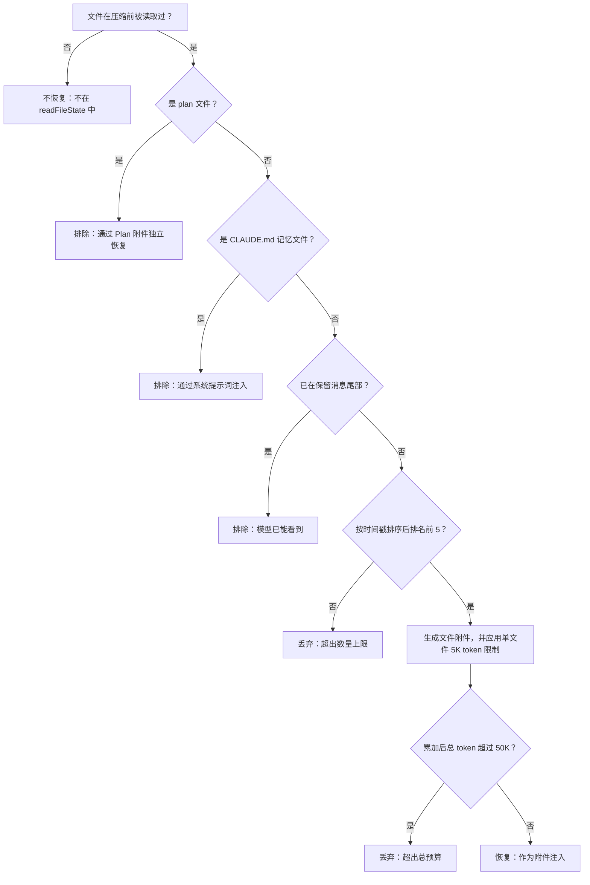
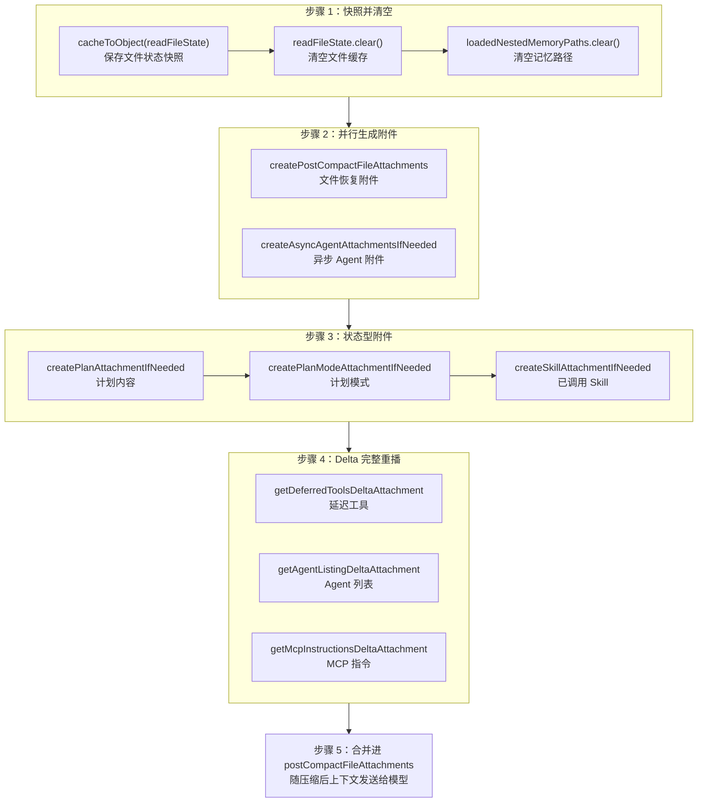

# Claude Code 压缩后的文件状态保留

## 5.1 前言：压缩之后，为什么还需要恢复

> "Compression without restoration is just data loss with extra steps."

第 4 章讲的是自动压缩：什么时候触发、如何生成摘要、失败时怎样重试和熔断。但压缩的故事并不在“摘要生成成功”处结束。

压缩会把长对话浓缩成一条 summary message。这样做节省了上下文，但也制造了一个新的问题：模型失去了大量“刚刚还知道”的工作状态。

它可能不再知道：

- 刚读过哪些文件；
- 哪些文件内容仍然值得继续放在上下文里；
- 当前是否处于 Plan Mode；
- 之前加载过哪些 Skill；
- 是否还有后台 Agent 在运行；
- 之前通过 delta 附件声明过哪些工具、Agent 列表和 MCP 指令。

所以本章的主线不是“压缩如何摘要”，而是解释另一个工程问题：

**压缩会主动制造上下文断层，Claude Code 必须在压缩后选择性地把关键状态补回来。**

这套恢复机制可以看成一条链：

```text
压缩前快照
  -> 清空旧状态
  -> 文件附件恢复
  -> Skill 附件恢复
  -> Plan / PlanMode 附件恢复
  -> 异步 Agent 状态恢复
  -> Delta 工具与指令完整重播
  -> 形成压缩后的可继续工作上下文
```

目录结构也按这条链组织：

| 章节 | 回答的问题 |
| --- | --- |
| 5.2 压缩前快照 | 为什么先保存现场再清空 |
| 5.3 文件恢复 | 哪些文件会被恢复，预算如何限制 |
| 5.4 Skill 恢复 | 已调用技能如何跨压缩保留 |
| 5.5 刻意不恢复 | 为什么不恢复完整技能列表 |
| 5.6 Plan / PlanMode | 计划内容和计划模式如何保留 |
| 5.7 Delta 重播 | 工具、Agent、MCP 指令如何重新声明 |
| 5.8 完整编排 | 所有恢复步骤如何串起来 |
| 5.9 用户策略 | 长会话里该如何利用这套机制 |
| 5.10 版本演化 | 后续版本如何继续优化上下文预算 |

## 5.2 压缩前快照：先存再清

压缩恢复的第一步，不是在压缩后做什么，而是在压缩前先保存好现场。

### 5.2.1 `cacheToObject + clear`：快照-清空模式

源码片段：

```ts
// services/compact/compact.ts:517-522
// Store the current file state before clearing
const preCompactReadFileState = cacheToObject(context.readFileState)

// Clear the cache
context.readFileState.clear()
context.loadedNestedMemoryPaths?.clear()
```

这三行代码实现了一个典型的“快照-清空”模式。

第一步是快照。`cacheToObject(context.readFileState)` 将内存中的 `FileStateCache` 转成普通对象，记录压缩前模型读过的文件、文件内容和最后读取时间戳。

第二步是清空。`context.readFileState.clear()` 清除文件状态缓存，`context.loadedNestedMemoryPaths?.clear()` 清除已加载的嵌套记忆路径。

这里最容易误解的一点是：清空不是为了丢数据，而是为了让系统状态和模型视角重新对齐。

压缩后，旧对话已经被摘要替换。模型从上下文里看不到之前完整的 Read 结果。如果系统还保留旧的 `readFileState`，后续逻辑可能误以为模型仍然掌握这些文件内容，从而跳过必要的重新注入。先清空，再有选择地恢复，才能保证“模型实际看到的上下文”和“系统认为模型知道的状态”一致。

### 5.2.2 为什么不能全部恢复

一次长会话里，模型可能读过几十甚至上百个文件。如果压缩后把所有文件内容都注入回来，就会出现一个反讽的循环：

```text
压缩刚省出的上下文
  -> 立刻被恢复附件重新填满
  -> 下一轮又接近压缩阈值
```

所以恢复不是“尽量完整”，而是“有预算地选择”。

压缩后的状态恢复，本质上是一个预算分配问题：

- 哪些状态必须恢复；
- 哪些状态可以摘要里保留；
- 哪些状态有独立通道；
- 哪些状态恢复成本高于收益；
- 哪些状态应该被明确丢弃。

后面的文件、Skill、Plan、Delta 附件，都是这套预算分配的不同实现。

## 5.3 文件恢复：最近 5 个文件、单文件 5K、总预算 50K

文件恢复解决的是压缩后最常见的断层：模型刚刚读过一个文件，但压缩后上下文里没有原始文件内容了。

Claude Code 的策略不是恢复全部文件，而是恢复“最近、非重复、非特殊、预算内”的文件。

### 5.3.1 五个常量构成恢复预算

源码片段：

```ts
// services/compact/compact.ts:122-130
export const POST_COMPACT_MAX_FILES_TO_RESTORE = 5
export const POST_COMPACT_TOKEN_BUDGET = 50_000
export const POST_COMPACT_MAX_TOKENS_PER_FILE = 5_000
export const POST_COMPACT_MAX_TOKENS_PER_SKILL = 5_000
export const POST_COMPACT_SKILLS_TOKEN_BUDGET = 25_000
```

这五个常量把压缩后的恢复分成两条预算线：文件预算和 Skill 预算。

| 常量 | 数值 | 控制对象 | 含义 |
| --- | ---: | --- | --- |
| `POST_COMPACT_MAX_FILES_TO_RESTORE` | 5 | 文件数量 | 最多恢复最近 5 个文件 |
| `POST_COMPACT_TOKEN_BUDGET` | 50,000 | 文件总量 | 文件附件总 token 预算 |
| `POST_COMPACT_MAX_TOKENS_PER_FILE` | 5,000 | 单文件 | 每个文件最多注入约 5K token |
| `POST_COMPACT_MAX_TOKENS_PER_SKILL` | 5,000 | 单 Skill | 每个已调用 Skill 最多保留约 5K token |
| `POST_COMPACT_SKILLS_TOKEN_BUDGET` | 25,000 | Skill 总量 | Skill 附件总 token 预算 |

这张表是理解本章的关键：压缩后的恢复不是一套单一规则，而是多条并行预算。

以 200K 上下文窗口为例，压缩后的摘要通常会占用一部分空间，文件恢复最多 50K，Skill 恢复最多 25K。即使两者都接近上限，也仍然为后续对话留出相当大的空间。

这也是这套机制的平衡点：恢复足够上下文，让模型能继续工作；但不把压缩刚释放的空间马上吃光。

### 5.3.2 文件恢复的核心逻辑

源码片段：

```ts
// services/compact/compact.ts:1415-1464
export async function createPostCompactFileAttachments(
  readFileState: Record<string, { content: string; timestamp: number }>,
  toolUseContext: ToolUseContext,
  maxFiles: number,
  preservedMessages: Message[] = [],
): Promise<AttachmentMessage[]> {
  const preservedReadPaths = collectReadToolFilePaths(preservedMessages)
  const recentFiles = Object.entries(readFileState)
    .map(([filename, state]) => ({ filename, ...state }))
    .filter(
      file =>
        !shouldExcludeFromPostCompactRestore(
          file.filename,
          toolUseContext.agentId,
        ) && !preservedReadPaths.has(expandPath(file.filename)),
    )
    .sort((a, b) => b.timestamp - a.timestamp)
    .slice(0, maxFiles)
  // ...
}
```

这段逻辑可以拆成四层过滤。

第一层：从压缩前快照中拿到所有读过的文件。

`Object.entries(readFileState)` 表示候选池只来自压缩前模型确实读过的文件。没有被读过的文件不会凭空恢复。

第二层：排除特殊文件。

`shouldExcludeFromPostCompactRestore()` 排除计划文件和记忆文件。它们不是不重要，而是有独立恢复通道：Plan 文件通过 Plan 附件恢复，CLAUDE.md 记忆通过系统提示词注入。

第三层：排除已经在保留消息尾部出现的文件。

`preservedReadPaths` 来自 `collectReadToolFilePaths(preservedMessages)`。部分压缩场景会保留一段最近消息，如果某个 Read 结果已经在这段消息中可见，就不需要通过附件重复注入。

第四层：按最后读取时间排序，取最近的 `maxFiles` 个。

`.sort((a, b) => b.timestamp - a.timestamp).slice(0, maxFiles)` 体现了一个工程假设：最近读过的文件，最可能是接下来还要继续编辑或引用的文件。

### 5.3.3 恢复时重新读取磁盘内容

文件进入候选列表后，Claude Code 会并行生成附件：

```ts
const results = await Promise.all(
  recentFiles.map(async file => {
    const attachment = await generateFileAttachment(
      file.filename,
      {
        ...toolUseContext,
        fileReadingLimits: {
          maxTokens: POST_COMPACT_MAX_TOKENS_PER_FILE,
        },
      },
      'tengu_post_compact_file_restore_success',
      'tengu_post_compact_file_restore_error',
      'compact',
    )
    return attachment ? createAttachmentMessage(attachment) : null
  }),
)
```

这里有一个细节很重要：恢复时不是直接使用快照里的 `content`，而是通过 `generateFileAttachment()` 重新读取文件。

这意味着如果文件在压缩期间被外部编辑器、脚本或其他进程修改，恢复附件会反映磁盘上的当前内容，而不是压缩前缓存里的旧内容。

这是一种更偏向正确性的选择：压缩后的模型应该看到当前文件状态，而不是旧快照。

### 5.3.4 总预算守门

即使只恢复 5 个文件，也不能无限注入。最后还有一道总预算过滤：

```ts
// services/compact/compact.ts:1452-1463
let usedTokens = 0
return results.filter((result): result is AttachmentMessage => {
  if (result === null) {
    return false
  }
  const attachmentTokens = roughTokenCountEstimation(jsonStringify(result))
  if (usedTokens + attachmentTokens <= POST_COMPACT_TOKEN_BUDGET) {
    usedTokens += attachmentTokens
    return true
  }
  return false
})
```

这个 filter 是文件恢复的最后一道闸门。

它按顺序累加附件 token 数，只要加入当前附件会超过 `POST_COMPACT_TOKEN_BUDGET`，就丢弃这个附件。由于前面已经按时间戳排序，预算压力下被保留的仍然是更近、更可能有用的文件。

### 5.3.5 “恢复 vs 丢弃”决策树

文件恢复不是简单的“最近 5 个”。它是一条多层管线：



这棵树揭示了 Claude Code 的恢复哲学：先排除有独立通道或已可见的内容，再按最近性排序，最后用 token 预算兜底。

### 5.3.6 dedup stub 与保留尾部

部分压缩会保留最近消息。为了避免重复恢复，系统会扫描保留消息里的 Read 工具调用：

```ts
/**
 * Scan messages for Read tool_use blocks and collect their file_path inputs
 * (normalized via expandPath). Used to dedup post-compact file restoration
 * against what's already visible in the preserved tail.
 *
 * Skips Reads whose tool_result is a dedup stub — the stub points at an
 * earlier full Read that may have been compacted away, so we want
 * createPostCompactFileAttachments to re-inject the real content.
 */
function collectReadToolFilePaths(messages: Message[]): Set<string> {
```

这里的例外很关键：如果保留尾部里只有一个 dedup stub，它并不等价于完整文件内容。

dedup stub 只是指向更早的完整 Read 结果，而那个完整结果可能已经被压缩掉了。因此这种情况下，文件仍然需要通过 post-compact file attachment 重新注入真实内容。

## 5.4 Skill 重注入：`invokedSkills` 的选择性恢复

文件恢复解决“模型看过哪些文件”的问题。Skill 恢复解决另一个问题：模型曾经加载过的行为约束，压缩后还在不在。

### 5.4.1 为什么 Skill 需要独立恢复

Skill 是 Claude Code 的扩展能力系统。用户调用某个 Skill 后，Skill 的说明和规则会被注入对话。

压缩后，这些指令会随旧消息消失。但 Skill 往往包含关键行为约束，例如：

- 代码审查时应该关注什么；
- 提交前必须执行哪些验证；
- 某类任务应该遵循哪些固定流程；
- 输出格式有什么要求。

如果这些规则不恢复，压缩后的模型可能继续做任务，却不再遵守已经加载过的 Skill 约束。

### 5.4.2 Skill 恢复机制

源码片段：

```ts
// services/compact/compact.ts:1494-1534
export function createSkillAttachmentIfNeeded(
  agentId?: string,
): AttachmentMessage | null {
  const invokedSkills = getInvokedSkillsForAgent(agentId)

  if (invokedSkills.size === 0) {
    return null
  }

  // Sorted most-recent-first so budget pressure drops the least-relevant skills.
  let usedTokens = 0
  const skills = Array.from(invokedSkills.values())
    .sort((a, b) => b.invokedAt - a.invokedAt)
    .map(skill => ({
      name: skill.skillName,
      path: skill.skillPath,
      content: truncateToTokens(
        skill.content,
        POST_COMPACT_MAX_TOKENS_PER_SKILL,
      ),
    }))
    .filter(skill => {
      const tokens = roughTokenCountEstimation(skill.content)
      if (usedTokens + tokens > POST_COMPACT_SKILLS_TOKEN_BUDGET) {
        return false
      }
      usedTokens += tokens
      return true
    })

  if (skills.length === 0) {
    return null
  }

  return createAttachmentMessage({
    type: 'invoked_skills',
    skills,
  })
}
```

Skill 恢复和文件恢复很像：都按最近性排序，都有单项上限和总预算。但 Skill 恢复有两个更具体的设计点。

第一，按 agent 隔离。

`getInvokedSkillsForAgent(agentId)` 只返回当前 agent 作用域内调用过的 Skill。这样可以避免主线程的 Skill 泄露到子 Agent，或子 Agent 的 Skill 污染主线程。

第二，优先截断，不优先整段丢弃。

源码注释解释了原因：

```ts
// Skills can be large (verify=18.7KB, claude-api=20.1KB). Previously re-injected
// unbounded on every compact → 5-10K tok/compact. Per-skill truncation beats
// dropping — instructions at the top of a skill file are usually the critical
// part. Budget sized to hold ~5 skills at the per-skill cap.
```

Skill 文件通常把关键说明放在开头，后面才是参考材料、示例或细节。因此“保留头部、截断尾部”比“整个 Skill 丢掉”更符合实际使用。

### 5.4.3 Skill 预算怎么算

Skill 有两层预算：

| 预算 | 数值 | 含义 |
| --- | ---: | --- |
| 单 Skill 上限 | 5,000 token | 每个 Skill 最多保留头部约 5K token |
| Skill 总预算 | 25,000 token | 最多约容纳 5 个满额 Skill |

如果实际 Skill 较短，25K 预算可以覆盖更多 Skill。如果一次会话调用了很多大型 Skill，系统会按 `invokedAt` 保留最近调用的 Skill，较早的 Skill 在预算压力下被丢弃。

这和文件恢复使用同一条原则：**最近使用过的状态，更可能与当前任务相关。**

## 5.5 刻意不恢复的内容：`sentSkillNames`

状态恢复并不意味着“所有东西都补回来”。Claude Code 里最有代表性的反例是 `sentSkillNames`。

### 5.5.1 源码中的反直觉选择

源码片段：

```ts
// services/compact/compact.ts:524-529
// Intentionally NOT resetting sentSkillNames: re-injecting the full
// skill_listing (~4K tokens) post-compact is pure cache_creation with
// marginal benefit. The model still has SkillTool in its schema and
// invoked_skills attachment (below) preserves used-skill content. Ants
// with EXPERIMENTAL_SKILL_SEARCH already skip re-injection via the
// early-return in getSkillListingAttachments.
```

`sentSkillNames` 记录哪些 Skill 名称列表已经发送给模型。如果压缩后把它重置，下一轮请求就会重新注入完整的 Skill listing。

但源码明确选择不重置。

原因不是忘了恢复，而是恢复不划算：

- 完整 Skill listing 约 4K token，主要增加 cache creation 成本；
- 模型仍然通过 Tool schema 知道 `SkillTool` 的存在；
- 真正已经使用过的 Skill 内容，会通过 `invoked_skills` 附件恢复；
- 实验性 Skill Search 场景本来也会跳过完整 listing 重注入。

### 5.5.2 这个选择说明了什么

这是一条非常有代表性的上下文预算原则：

**恢复机制不是为了还原压缩前的全部上下文，而是为了恢复继续工作所必需的最小状态。**

完整 Skill listing 是“可能有帮助”的信息，但不是“继续当前任务必须拥有”的信息。已调用 Skill 的内容才是高价值状态，所以它被恢复；完整列表则被刻意保留为已发送状态，避免压缩后重复注入。

## 5.6 Plan 和 PlanMode：内容与模式分开恢复

Plan 相关状态有两层：计划内容和计划模式。它们必须分开恢复，因为它们回答的是两个不同问题。

- Plan 附件回答：当前计划是什么；
- PlanMode 附件回答：压缩后是否仍应以 plan 模式工作。

### 5.6.1 Plan 附件：恢复计划内容

源码片段：

```ts
// services/compact/compact.ts:545-548
const planAttachment = createPlanAttachmentIfNeeded(context.agentId)
if (planAttachment) {
  postCompactFileAttachments.push(planAttachment)
}
```

`createPlanAttachmentIfNeeded()` 会检查当前 agent 是否有活跃计划文件：

```ts
export function createPlanAttachmentIfNeeded(
  agentId?: AgentId,
): AttachmentMessage | null {
  const planContent = getPlan(agentId)

  if (!planContent) {
    return null
  }

  const planFilePath = getPlanFilePath(agentId)

  return createAttachmentMessage({
    type: 'plan_file_reference',
    planFilePath,
    planContent,
  })
}
```

Plan 文件在普通文件恢复阶段会被 `shouldExcludeFromPostCompactRestore()` 排除，正是因为它有这条独立恢复通道。

这避免了同一个计划文件既作为普通 file attachment 注入，又作为 plan attachment 注入，造成重复和预算浪费。

### 5.6.2 PlanMode 附件：恢复行为模式

源码片段：

```ts
// services/compact/compact.ts:552-555
const planModeAttachment = await createPlanModeAttachmentIfNeeded(context)
if (planModeAttachment) {
  postCompactFileAttachments.push(planModeAttachment)
}
```

`createPlanModeAttachmentIfNeeded()` 检查当前是否处于 plan mode：

```ts
export async function createPlanModeAttachmentIfNeeded(
  context: ToolUseContext,
): Promise<AttachmentMessage | null> {
  const appState = context.getAppState()
  if (appState.toolPermissionContext.mode !== 'plan') {
    return null
  }

  const planFilePath = getPlanFilePath(context.agentId)
  const planExists = getPlan(context.agentId) !== null

  return createAttachmentMessage({
    type: 'plan_mode',
    reminderType: 'full',
    isSubAgent: !!context.agentId,
    planFilePath,
    planExists,
  })
}
```

这里的关键是 `type: 'plan_mode'` 和 `reminderType: 'full'`。

Plan 内容告诉模型“你正在围绕这个计划工作”；PlanMode 告诉模型“你仍然处于计划模式，不要把自己切回普通执行模式”。

如果只恢复计划内容，不恢复模式，模型可能知道计划，却开始直接执行；如果只恢复模式，不恢复计划，模型知道要规划，却不知道之前的计划是什么。两者必须配套。

## 5.7 Delta 附件：工具和指令的完整重播

压缩不仅吃掉了文件和 Skill 指令，也吃掉了先前通过 delta 附件逐步声明给模型的动态信息。

Delta 附件包括：

- deferred tools；
- Agent 列表；
- MCP instructions。

压缩后，模型需要重新知道这些动态能力和指令。

### 5.7.1 三类 Delta 的重播逻辑

源码片段：

```ts
// services/compact/compact.ts:563-585
// Compaction ate prior delta attachments. Re-announce from the current
// state so the model has tool/instruction context on the first
// post-compact turn. Empty message history → diff against nothing →
// announces the full set.
for (const att of getDeferredToolsDeltaAttachment(
  context.options.tools,
  context.options.mainLoopModel,
  [],
  { callSite: 'compact_full' },
)) {
  postCompactFileAttachments.push(createAttachmentMessage(att))
}
for (const att of getAgentListingDeltaAttachment(context, [])) {
  postCompactFileAttachments.push(createAttachmentMessage(att))
}
for (const att of getMcpInstructionsDeltaAttachment(
  context.options.mcpClients,
  context.options.tools,
  context.options.mainLoopModel,
  [],
)) {
  postCompactFileAttachments.push(createAttachmentMessage(att))
}
```

这段代码的精妙之处在于传入空数组 `[]` 作为消息历史。

正常对话中，delta 函数会比较“当前状态”和“消息历史中已经声明过的内容”，只发送差异。

压缩后，旧消息已经被摘要替换。传入空数组，等于告诉 diff 逻辑：历史里什么都没有。于是 delta 函数会重新宣布完整集合。

这是一种复用已有增量机制的设计：不需要另写一套“压缩后完整声明”逻辑，只要把 diff 基线设为空。

### 5.7.2 三类 Delta 各自恢复什么

| Delta 附件 | 恢复内容 | 为什么压缩后要重播 |
| --- | --- | --- |
| `getDeferredToolsDeltaAttachment` | 延迟加载工具声明 | 旧工具引用可能在压缩摘要中丢失，模型需要知道当前可用工具 schema |
| `getAgentListingDeltaAttachment` | 当前可用 Agent 类型和说明 | Agent 列表可能受 MCP、插件、权限变化影响，需要按当前状态重告知 |
| `getMcpInstructionsDeltaAttachment` | MCP 服务器指令 | MCP server 可在轮次间连接或断开，压缩后必须按当前连接状态重新声明 |

`callSite: 'compact_full'` 则为遥测提供区分：这是压缩后的完整重播，不是普通轮次里的增量更新。

### 5.7.3 异步 Agent 附件

除了 Agent 列表，后台运行中的异步 Agent 也需要恢复。

源码片段：

```ts
// services/compact/compact.ts:532-539
const [fileAttachments, asyncAgentAttachments] = await Promise.all([
  createPostCompactFileAttachments(
    preCompactReadFileState,
    context,
    POST_COMPACT_MAX_FILES_TO_RESTORE,
  ),
  createAsyncAgentAttachmentsIfNeeded(context),
])
```

`createAsyncAgentAttachmentsIfNeeded()` 会检查当前 app state 中的本地 agent task：

```ts
export async function createAsyncAgentAttachmentsIfNeeded(
  context: ToolUseContext,
): Promise<AttachmentMessage[]> {
  const appState = context.getAppState()
  const asyncAgents = Object.values(appState.tasks).filter(
    (task): task is LocalAgentTaskState => task.type === 'local_agent',
  )

  return asyncAgents.flatMap(agent => {
    if (
      agent.retrieved ||
      agent.status === 'pending' ||
      agent.agentId === context.agentId
    ) {
      return []
    }
    return [
      createAttachmentMessage({
        type: 'task_status',
        taskId: agent.agentId,
        taskType: 'local_agent',
        description: agent.description,
        status: agent.status,
        deltaSummary:
          agent.status === 'running'
            ? (agent.progress?.summary ?? null)
            : (agent.error ?? null),
        outputFilePath: getTaskOutputPath(agent.agentId),
      }),
    ]
  })
}
```

这防止压缩后模型忘记已有后台任务，从而重复启动同类 Agent。

注意文件恢复和异步 Agent 附件是并行生成的。两者没有依赖关系，`Promise.all` 可以减少压缩后恢复阶段的等待时间。

## 5.8 完整编排：压缩后状态如何重新组装

把上面的机制放回 `compactConversation()` 中，压缩后的恢复顺序可以看成五步。



这张图里最重要的是“不同状态走不同通道”：

| 状态类型 | 恢复通道 | 策略 |
| --- | --- | --- |
| 最近文件 | file attachment | 最近 5 个，单文件 5K，总预算 50K |
| 已调用 Skill | invoked_skills attachment | 按 agent 隔离，单 Skill 5K，总预算 25K |
| 完整 Skill listing | 不恢复 | 保留 `sentSkillNames`，避免约 4K token 重注入 |
| Plan 内容 | plan_file_reference | 独立于普通文件预算 |
| Plan Mode | plan_mode | 恢复行为模式 |
| 异步 Agent | task_status | 防止重复启动或忘记后台任务 |
| deferred tools / Agent list / MCP instructions | delta attachments | 用空历史触发完整重播 |

所以压缩后的上下文不是单纯的 summary，而是：

```text
summary message
  + restored file attachments
  + invoked skills
  + plan / plan mode
  + async agent task status
  + full delta replay
```

这就是为什么第 4 章里的压缩不能只理解为摘要功能。真正让长会话能继续的是“摘要 + 状态恢复”的组合。

## 5.9 用户能做什么

理解恢复机制后，长会话里可以更主动地保护关键上下文。

### 5.9.1 保持文件读取聚焦

压缩后最多恢复最近读取的 5 个文件。

如果你让模型在一个任务里先读 20 个文件，压缩后只有最近 5 个有机会自动恢复。早期读过的参考文件、测试文件、类型定义，可能都不会出现在压缩后的上下文中。

更稳的做法是：

- 不要一开始就让模型“把所有相关文件读一遍”；
- 优先读取接下来马上要编辑或引用的文件；
- 如果某个文件很关键但很久没读过，在压缩前后让模型重新 Read 一次，刷新它的重要性和时间戳；
- 关键约束写入项目记忆文件，而不是只在对话早期提一次。

### 5.9.2 对大文件要有截断预期

每个恢复文件最多约 5K token。不要把 5K token 理解成“能恢复一个大文件的大部分内容”；实际能覆盖多少行取决于语言、空行、注释、缩进和代码密度。

如果正在编辑超大文件，压缩后模型很可能只看到恢复附件中的一部分内容。

更稳的做法是：

- 让模型用 Read 的 offset/limit 重新读取目标区域；
- 在压缩前明确指出关键函数、类名或行号范围；
- 把不可丢失的架构约束写入 `CLAUDE.md` 或计划文件；
- 将过大的文件操作拆成更小的局部任务。

### 5.9.3 Skill 文件要把关键指令放在前面

Skill 恢复采用头部截断策略。

这意味着 Skill 文件应该按重要性排序：

```text
关键行为规则
  -> 必须遵守的工作流
  -> 输出格式
  -> 常见错误
  -> 示例和参考资料
```

不要把最关键的约束放在 Skill 文件末尾。压缩后，尾部内容最容易被截断。

### 5.9.4 用 Plan Mode 跨越压缩边界

复杂任务如果可能跨越压缩边界，Plan Mode 是最稳的承载方式之一。

原因是 Plan 有独立恢复通道，不和普通文件争夺 50K 文件预算。PlanMode 也会单独恢复，确保模型压缩后仍然保持计划模式。

对于长重构、迁移、批量修复这类任务，建议先让模型产出计划，再逐步执行。

### 5.9.5 识别压缩后的“遗忘模式”

压缩后如果模型出现这些行为，通常不是随机退化，而是恢复策略的自然后果：

| 现象 | 可能原因 |
| --- | --- |
| 重新读取刚读过的文件 | 该文件未进入最近 5 个，或被预算过滤 |
| 忘记早期参考文件 | 早期 Read 未被恢复，摘要也没保留细节 |
| 不再遵守某个 Skill 的边缘规则 | Skill 尾部内容被 5K 截断 |
| 重复启动类似 Agent | 异步 Agent 已 retrieved、pending 或作用域不同，未生成 task_status |
| 重新提出被否决方案 | 摘要更偏向保留“做了什么”，被否决原因可能丢失 |

应对策略不是追求 100% 恢复，而是把关键状态放到更可靠的通道：计划、记忆文件、最近 Read、手动 `/compact` 指令。

### 5.9.6 多次压缩会降低早期细节密度

恢复附件每次都会从当前状态重新生成：

- 文件状态会清空并最多恢复 5 个；
- Skill 内容每次从原始内容截断，不会“截断的截断”；
- Delta 附件会按当前状态完整重播；
- Plan 和 PlanMode 会按当前状态恢复。

但摘要本身是不可逆的。

第二次压缩总结的是“第一次摘要 + 后续对话”，第三次压缩总结的是“第二次摘要 + 后续对话”。越早的细节，越容易在多次摘要中被压缩掉。

所以超长任务不要完全依赖自动压缩。关键节点可以主动执行 `/compact`，并附加自定义指令，明确告诉摘要模型保留哪些信息。

## 5.10 小结：压缩不是遗忘，而是选择性记忆

压缩后的状态恢复体现了 Claude Code 在信息完整性和 token 经济性之间的精细平衡。

第一，**先清空再恢复，保证状态一致**。

`readFileState` 和 nested memory paths 会在压缩后清空，然后通过附件重新注入关键状态。这样系统不会误以为模型仍然知道旧上下文。

第二，**不同状态走不同恢复通道**。

文件、Skill、Plan、PlanMode、异步 Agent、Delta 工具声明，分别有不同的恢复方式和预算规则。

第三，**恢复是选择性的**。

最近性排序、特殊文件排除、单项上限、总预算过滤，共同决定哪些内容能跨过压缩边界。

第四，**刻意不恢复也是设计**。

`sentSkillNames` 不重置，是为了避免压缩后重复注入约 4K token 的完整 Skill listing。恢复机制追求的是继续工作所需的最小状态，不是还原全部历史。

第五，**Delta 重播复用了增量机制**。

把消息历史传空数组，就能让现有 delta 函数生成完整声明。这是一个简洁、低重复的工程设计。

一句话总结：

> Claude Code 的压缩后恢复不是把旧上下文原样搬回来，而是把“继续工作必需的状态”按文件、Skill、计划、Agent 和工具声明分通道补回；它让压缩从一次信息损失，变成一次有预算的上下文重建。

## 5.11 版本演化：恢复机制之外的上下文预算优化

本节保留原稿中的版本演化线索。它们不改变本章主线，但能说明 Claude Code 后续版本仍在围绕同一个目标优化：减少无效上下文占用，让压缩前后都更稳。

### 5.11.1 v2.1.91：`staleReadFileStateHint` 与文件状态追踪

以下分析基于 v2.1.91 bundle 信号对比，结合 v2.1.88 源码推断。

v2.1.91 在工具结果元数据中新增 `staleReadFileStateHint` 字段，当工具执行（如 Bash 命令）导致已读取文件的 mtime 发生变化时，系统会向模型发送陈旧提示。

这扩展了本章描述的文件状态追踪体系：第 5 章关注压缩后如何恢复文件上下文，而 `staleReadFileStateHint` 关注的是单轮内或跨工具调用时，如何提醒模型“你之前读过的文件状态可能已经过期”。

v2.1.88 中 `readFileState` 缓存（cli/print.ts:1147-1177）已存在于源码中，v2.1.91 将其暴露为模型可感知的输出字段。

### 5.11.2 v2.1.100：Tool Result Dedup

以下分析基于 v2.1.100 bundle 信号对比，结合 v2.1.88 源码推断。

v2.1.100 引入了工具结果去重机制（`tengu_tool_result_dedup`）。当模型连续调用同一工具获取相同内容时，系统不再重复注入完整结果，而是用短引用 ID 替换。

原稿中的逆向片段：

```ts
// v2.1.100 bundle 逆向 — 去重命中时的替换
let H = `<result r=${j} from your ${$.toolName} call earlier — refer to that output>`;
d("tengu_tool_result_dedup", {
  hit: true,
  toolName: OK(K),
  originalBytes: A,
  savedBytes: A - H.length  // 追踪节省的字节数
});
return { ...q, content: H };

// 去重未命中时的注册
r += 1;
let j = `r${_.counter}`;   // 短 ID：r1, r2, r3...
_.seen.set(w, { shortId: j, toolName: K });
d("tengu_tool_result_dedup", {
  hit: false,
  toolName: OK(K),
  originalBytes: A,
  savedBytes: 0
});
```

工作原理是：系统维护一个 `seen` Map，以工具结果内容的哈希为 key，存储短 ID 和工具名。首次出现的结果正常注入，后续相同结果替换为短引用。

这和压缩后文件恢复是互补关系：

- 文件恢复负责压缩后补回关键文件；
- 工具结果去重负责压缩前减少重复内容增长；
- 两者共同降低上下文窗口被重复文件内容消耗的概率。

### 5.11.3 v2.1.100：`sdk-tools.d.ts` 变化

v2.1.100 对工具类型定义做了两处小调整：

1. `originalFile: string → string | null`：Edit 工具的 `originalFile` 字段放宽为可空，支持新建文件场景。
2. `toolStats` 统计字段：新增 7 维度的会话级工具使用统计，为成本分析和行为洞察提供量化数据。

这些变化与本章的直接恢复流程不是同一层，但共同指向一个趋势：Claude Code 越来越重视文件状态、工具结果和上下文预算的可观测性。
