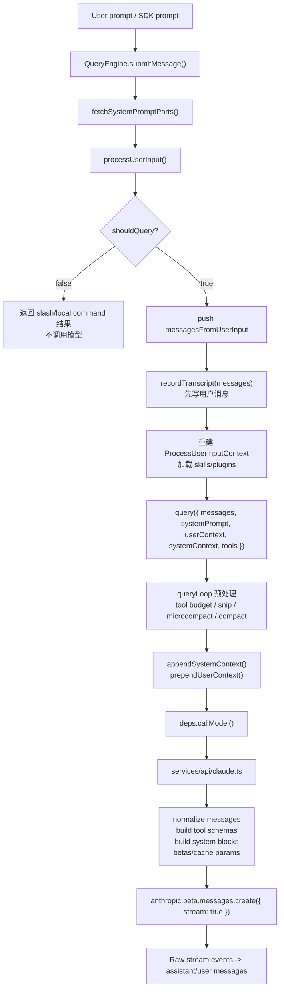

# Claude Code 请求链路：一次用户输入如何变成模型流

> **定位**：本章分析 Claude Code 中一次用户输入从进入会话、被处理为消息、写入 transcript、交给 `query()`，再被构造成 Anthropic API streaming 请求的完整链路。前置依赖：第 1 章《架构全景》、第 2 章《启动链路》。适用场景：想理解“用户按下回车之后，到模型开始流式返回之前”中间发生了什么的读者。

本章的主线是：

```text
用户输入
  -> QueryEngine.submitMessage()
  -> processUserInput()
  -> transcript 先落盘
  -> query()
  -> 上下文预处理与注入
  -> deps.callModel()
  -> claude.ts 构建 API 参数
  -> Anthropic streaming response
```

它和《Agent Loop》的边界是：本章讲“一次请求如何被包装和发送出去”，不重复 `queryLoop()` 的完整状态机；它和 Prompt / Cache / Tool 章节的边界是：本章只讲这些系统如何进入请求参数，不展开它们各自的内部设计。

---

## 3.1 请求链路总览



这条链路有三个关键分界：

1. `QueryEngine` 是会话边界，负责把用户输入变成可查询消息并维护 transcript。
2. `query()` / `queryLoop()` 是运行边界，负责上下文预算、恢复策略和模型流编排。
3. `claude.ts` 是 API 边界，负责把内部结构规范化为 Anthropic API 参数。

---

## 3.2 第一段：`QueryEngine.submitMessage()` 接收用户输入

`QueryEngine` 每次收到用户输入，都会进入 `submitMessage()`。它先从配置中取出本轮需要的运行材料：工作目录、命令、工具、MCP client、模型、预算、系统提示词覆盖项等。

源码参考：`src/QueryEngine.ts:211-238`

```typescript
  async *submitMessage(
    prompt: string | ContentBlockParam[],
    options?: { uuid?: string; isMeta?: boolean },
  ): AsyncGenerator<SDKMessage, void, unknown> {
    const {
      cwd,
      commands,
      tools,
      mcpClients,
      verbose = false,
      thinkingConfig,
      maxTurns,
      maxBudgetUsd,
      taskBudget,
      canUseTool,
      customSystemPrompt,
      appendSystemPrompt,
      userSpecifiedModel,
      fallbackModel,
      jsonSchema,
      getAppState,
      setAppState,
      replayUserMessages = false,
      includePartialMessages = false,
      agents = [],
      setSDKStatus,
      orphanedPermission,
    } = this.config
```

这说明请求链路不是只有 `prompt` 字符串。用户输入只是入口，真正进入模型前需要合并：

| 输入来源 | 进入请求的作用 |
|---|---|
| `prompt` | 本轮用户消息 |
| `commands` | slash/local command 的解释能力 |
| `tools` | API tools schema 与工具执行上下文 |
| `mcpClients` | MCP 指令、工具、资源上下文 |
| `customSystemPrompt` / `appendSystemPrompt` | 系统提示词覆盖或追加 |
| `thinkingConfig` / model / budget | 模型请求参数 |
| `getAppState` / `setAppState` | 权限、MCP、fast mode、状态更新通道 |

`submitMessage()` 还会在每轮开始清空 turn-scoped skill discovery 状态，并设置当前工作目录：

源码参考：`src/QueryEngine.ts:240-285`

```typescript
    this.discoveredSkillNames.clear()
    setCwd(cwd)
    const persistSession = !isSessionPersistenceDisabled()
    const startTime = Date.now()

    // Wrap canUseTool to track permission denials
    const wrappedCanUseTool: CanUseToolFn = async (
      tool,
      input,
      toolUseContext,
      assistantMessage,
      toolUseID,
      forceDecision,
    ) => {
      const result = await canUseTool(
        tool,
        input,
        toolUseContext,
        assistantMessage,
        toolUseID,
        forceDecision,
      )

      // Track denials for SDK reporting
      if (result.behavior !== 'allow') {
        this.permissionDenials.push({
          type: 'permission_denial',
          tool_name: sdkCompatToolName(tool.name),
          tool_use_id: toolUseID,
          tool_input: input,
        })
      }

      return result
    }

    const initialAppState = getAppState()
    const initialMainLoopModel = userSpecifiedModel
      ? parseUserSpecifiedModel(userSpecifiedModel)
      : getMainLoopModel()

    const initialThinkingConfig: ThinkingConfig = thinkingConfig
      ? thinkingConfig
      : shouldEnableThinkingByDefault() !== false
        ? { type: 'adaptive' }
        : { type: 'disabled' }
```

注意这里的 `wrappedCanUseTool`：请求链路并不执行工具，但它要把权限回调包好，交给后续 Agent Loop 和工具执行层。这样 SDK/headless 路径可以在最终结果中报告 permission denial。

---

## 3.3 第二段：先构建 Prompt 组件，但不立刻发请求

`submitMessage()` 接下来构建系统提示词组件。这里调用的是 `fetchSystemPromptParts()`，得到默认系统提示词、用户上下文和系统上下文。

源码参考：`src/QueryEngine.ts:287-328`

```typescript
    headlessProfilerCheckpoint('before_getSystemPrompt')
    // Narrow once so TS tracks the type through the conditionals below.
    const customPrompt =
      typeof customSystemPrompt === 'string' ? customSystemPrompt : undefined
    const {
      defaultSystemPrompt,
      userContext: baseUserContext,
      systemContext,
    } = await fetchSystemPromptParts({
      tools,
      mainLoopModel: initialMainLoopModel,
      additionalWorkingDirectories: Array.from(
        initialAppState.toolPermissionContext.additionalWorkingDirectories.keys(),
      ),
      mcpClients,
      customSystemPrompt: customPrompt,
    })
    headlessProfilerCheckpoint('after_getSystemPrompt')
    const userContext = {
      ...baseUserContext,
      ...getCoordinatorUserContext(
        mcpClients,
        isScratchpadEnabled() ? getScratchpadDir() : undefined,
      ),
    }

    // When an SDK caller provides a custom system prompt AND has set
    // CLAUDE_COWORK_MEMORY_PATH_OVERRIDE, inject the memory-mechanics prompt.
    // The env var is an explicit opt-in signal — the caller has wired up
    // a memory directory and needs Claude to know how to use it (which
    // Write/Edit tools to call, MEMORY.md filename, loading semantics).
    // The caller can layer their own policy text via appendSystemPrompt.
    const memoryMechanicsPrompt =
      customPrompt !== undefined && hasAutoMemPathOverride()
        ? await loadMemoryPrompt()
        : null

    const systemPrompt = asSystemPrompt([
      ...(customPrompt !== undefined ? [customPrompt] : defaultSystemPrompt),
      ...(memoryMechanicsPrompt ? [memoryMechanicsPrompt] : []),
      ...(appendSystemPrompt ? [appendSystemPrompt] : []),
    ])
```

这里有一个很重要的分层：

- `systemPrompt` 是系统提示词数组，后面会进入 API 的 `system` blocks；
- `systemContext` 会在 `query()` 中追加到系统提示词末尾；
- `userContext` 会在 `query()` 中作为 `<system-reminder>` 前置到消息数组。

也就是说，请求链路先把 Prompt 组件准备好，但真正的 API 注入发生在 `query()` 里。这让 `QueryEngine` 保持会话级编排职责，不提前承担 API 参数细节。

---

## 3.4 第三段：`processUserInput()` 把输入变成消息

用户输入不会直接进入 `query()`。它先经过 `processUserInput()`，这个函数处理 string / content blocks、图片、粘贴内容、slash command、hooks 和附件。

`submitMessage()` 先构造一个 `ProcessUserInputContext`。

源码参考：`src/QueryEngine.ts:338-360`

```typescript
    let processUserInputContext: ProcessUserInputContext = {
      messages: this.mutableMessages,
      // Slash commands that mutate the message array (e.g. /force-snip)
      // call setMessages(fn).  In interactive mode this writes back to
      // AppState; in print mode we write back to mutableMessages so the
      // rest of the query loop (push at :389, snapshot at :392) sees
      // the result.  The second processUserInputContext below (after
      // slash-command processing) keeps the no-op — nothing else calls
      // setMessages past that point.
      setMessages: fn => {
        this.mutableMessages = fn(this.mutableMessages)
      },
      onChangeAPIKey: () => {},
      handleElicitation: this.config.handleElicitation,
      options: {
        commands,
        debug: false, // we use stdout, so don't want to clobber it
        tools,
        verbose,
        mainLoopModel: initialMainLoopModel,
        thinkingConfig: initialThinkingConfig,
        mcpClients,
        mcpResources: {},
```

然后调用 `processUserInput()`。

源码参考：`src/QueryEngine.ts:413-431`

```typescript
    const {
      messages: messagesFromUserInput,
      shouldQuery,
      allowedTools,
      model: modelFromUserInput,
      resultText,
    } = await processUserInput({
      input: prompt,
      mode: 'prompt',
      setToolJSX: () => {},
      context: {
        ...processUserInputContext,
        messages: this.mutableMessages,
      },
      messages: this.mutableMessages,
      uuid: options?.uuid,
      isMeta: options?.isMeta,
      querySource: 'sdk',
    })
```

`processUserInput()` 本身先做输入规范化，再进入 base 处理和 UserPromptSubmit hooks。

源码参考：`src/utils/processUserInput/processUserInput.ts:85-140`

```typescript
export async function processUserInput({
  input,
  preExpansionInput,
  mode,
  setToolJSX,
  context,
  pastedContents,
  ideSelection,
  messages,
  setUserInputOnProcessing,
  uuid,
  isAlreadyProcessing,
  querySource,
  canUseTool,
  skipSlashCommands,
  bridgeOrigin,
  isMeta,
  skipAttachments,
}: {
  input: string | Array<ContentBlockParam>
  /**
   * Input before [Pasted text #N] expansion. Used for ultraplan keyword
   * detection so pasted content containing the word cannot trigger. Falls
   * back to the string `input` when unset.
   */
  preExpansionInput?: string
  mode: PromptInputMode
  setToolJSX: SetToolJSXFn
  context: ProcessUserInputContext
  pastedContents?: Record<number, PastedContent>
  ideSelection?: IDESelection
  messages?: Message[]
  setUserInputOnProcessing?: (prompt?: string) => void
  uuid?: string
  isAlreadyProcessing?: boolean
  querySource?: QuerySource
  canUseTool?: CanUseToolFn
  /**
   * When true, input starting with `/` is treated as plain text.
   * Used for remotely-received messages (bridge/CCR) that should not
   * trigger local slash commands or skills.
   */
  skipSlashCommands?: boolean
  /**
   * When true, slash commands matching isBridgeSafeCommand() execute even
   * though skipSlashCommands is set. See QueuedCommand.bridgeOrigin.
   */
  bridgeOrigin?: boolean
  /**
   * When true, the resulting UserMessage gets `isMeta: true` (user-hidden,
   * model-visible). Propagated from `QueuedCommand.isMeta` for queued
   * system-generated prompts.
   */
  isMeta?: boolean
  skipAttachments?: boolean
}): Promise<ProcessUserInputBaseResult> {
```

图片和多媒体输入会在这里被处理，而不是等到 API 层才处理。

源码参考：`src/utils/processUserInput/processUserInput.ts:306-345`

```typescript
  // Normalized view of `input` with image blocks resized. For string input
  // this is just `input`; for array input it's the processed blocks. We pass
  // this (not raw `input`) to processTextPrompt so resized/normalized image
  // blocks actually reach the API — otherwise the resize work above is
  // discarded for the regular prompt path. Also normalizes bridge inputs
  // where iOS may send `mediaType` instead of `media_type` (mobile-apps#5825).
  let normalizedInput: string | ContentBlockParam[] = input

  if (typeof input === 'string') {
    inputString = input
  } else if (input.length > 0) {
    queryCheckpoint('query_image_processing_start')
    const processedBlocks: ContentBlockParam[] = []
    for (const block of input) {
      if (block.type === 'image') {
        const resized = await maybeResizeAndDownsampleImageBlock(block)
        // Collect image metadata for isMeta message
        if (resized.dimensions) {
          const metadataText = createImageMetadataText(resized.dimensions)
          if (metadataText) {
            imageMetadataTexts.push(metadataText)
          }
        }
        processedBlocks.push(resized.block)
      } else {
        processedBlocks.push(block)
      }
    }
    normalizedInput = processedBlocks
    queryCheckpoint('query_image_processing_end')
    // Extract the input string from the last content block if it is text,
    // and keep track of the preceding content blocks
    const lastBlock = processedBlocks[processedBlocks.length - 1]
    if (lastBlock?.type === 'text') {
      inputString = lastBlock.text
      precedingInputBlocks = processedBlocks.slice(0, -1)
    } else {
      precedingInputBlocks = processedBlocks
    }
  }
```

如果 UserPromptSubmit hook 阻止请求，链路会在这里短路，不进入模型调用。

源码参考：`src/utils/processUserInput/processUserInput.ts:178-209`

```typescript
  // Execute UserPromptSubmit hooks and handle blocking
  queryCheckpoint('query_hooks_start')
  const inputMessage = getContentText(input) || ''

  for await (const hookResult of executeUserPromptSubmitHooks(
    inputMessage,
    appState.toolPermissionContext.mode,
    context,
    context.requestPrompt,
  )) {
    // We only care about the result
    if (hookResult.message?.type === 'progress') {
      continue
    }

    // Return only a system-level error message, erasing the original user input
    if (hookResult.blockingError) {
      const blockingMessage = getUserPromptSubmitHookBlockingMessage(
        hookResult.blockingError,
      )
      return {
        messages: [
          // TODO: Make this an attachment message
          createSystemMessage(
            `${blockingMessage}\n\nOriginal prompt: ${input}`,
            'warning',
          ),
        ],
        shouldQuery: false,
        allowedTools: result.allowedTools,
      }
    }
```

因此，请求链路在真正进入模型前已经有三种可能结果：

| 结果 | 含义 | 后续 |
|---|---|---|
| `shouldQuery = true` | 需要模型响应 | 进入 `query()` |
| `shouldQuery = false`，有 local/slash 输出 | 本地命令已处理 | 直接 yield result |
| hook blocking / prevent continuation | 生命周期钩子阻止 | 返回系统消息或短路 |

---

## 3.5 第四段：用户消息先写入 transcript

处理后的用户消息会先进入 `mutableMessages`，然后在进入 `query()` 前写入 transcript。

源码参考：`src/QueryEngine.ts:433-466`

```typescript
    // Push new messages, including user input and any attachments
    this.mutableMessages.push(...messagesFromUserInput)

    // Update params to reflect updates from processing /slash commands
    const messages = [...this.mutableMessages]

    // Persist the user's message(s) to transcript BEFORE entering the query
    // loop. The for-await below only calls recordTranscript when ask() yields
    // an assistant/user/compact_boundary message — which doesn't happen until
    // the API responds. If the process is killed before that (e.g. user clicks
    // Stop in cowork seconds after send), the transcript is left with only
    // queue-operation entries; getLastSessionLog filters those out, returns
    // null, and --resume fails with "No conversation found". Writing now makes
    // the transcript resumable from the point the user message was accepted,
    // even if no API response ever arrives.
    //
    // --bare / SIMPLE: fire-and-forget. Scripted calls don't --resume after
    // kill-mid-request. The await is ~4ms on SSD, ~30ms under disk contention
    // — the single largest controllable critical-path cost after module eval.
    // Transcript is still written (for post-hoc debugging); just not blocking.
    if (persistSession && messagesFromUserInput.length > 0) {
      const transcriptPromise = recordTranscript(messages)
      if (isBareMode()) {
        void transcriptPromise
      } else {
        await transcriptPromise
        if (
          isEnvTruthy(process.env.CLAUDE_CODE_EAGER_FLUSH) ||
          isEnvTruthy(process.env.CLAUDE_CODE_IS_COWORK)
        ) {
          await flushSessionStorage()
        }
      }
    }
```

这段是请求链路中最容易被低估的可靠性设计：**用户消息必须先于模型响应落盘**。否则用户发出请求后立刻中断进程，resume 时可能找不到这次对话。

`--bare` 路径采用 fire-and-forget，是另一个权衡：脚本模式更看重延迟，不太需要 kill-mid-request 后 resume；交互式和 cowork 场景则优先保证恢复性。

---

## 3.6 第五段：本地命令短路，真实请求进入 `query()`

如果 `processUserInput()` 返回 `shouldQuery = false`，`submitMessage()` 会直接输出本地结果，并返回成功 result，不进入模型。

源码参考：`src/QueryEngine.ts:559-643`

```typescript
    if (!shouldQuery) {
      // Return the results of local slash commands.
      // Use messagesFromUserInput (not replayableMessages) for command output
      // because selectableUserMessagesFilter excludes local-command-stdout tags.
      for (const msg of messagesFromUserInput) {
        if (
          msg.type === 'user' &&
          typeof msg.message.content === 'string' &&
          (msg.message.content.includes(`<${LOCAL_COMMAND_STDOUT_TAG}>`) ||
            msg.message.content.includes(`<${LOCAL_COMMAND_STDERR_TAG}>`) ||
            msg.isCompactSummary)
        ) {
          yield {
            type: 'user',
            message: {
              ...msg.message,
              content: stripAnsi(msg.message.content),
            },
            session_id: getSessionId(),
            parent_tool_use_id: null,
            uuid: msg.uuid,
            timestamp: msg.timestamp,
            isReplay: !msg.isCompactSummary,
            isSynthetic: msg.isMeta || msg.isVisibleInTranscriptOnly,
          } as unknown as SDKUserMessageReplay
        }

        // Local command output — yield as a synthetic assistant message so
        // RC renders it as assistant-style text rather than a user bubble.
        // Emitted as assistant (not the dedicated SDKLocalCommandOutputMessage
        // system subtype) so mobile clients + session-ingress can parse it.
        if (
          msg.type === 'system' &&
          msg.subtype === 'local_command' &&
          typeof msg.content === 'string' &&
          (msg.content.includes(`<${LOCAL_COMMAND_STDOUT_TAG}>`) ||
            msg.content.includes(`<${LOCAL_COMMAND_STDERR_TAG}>`))
        ) {
          yield localCommandOutputToSDKAssistantMessage(msg.content, msg.uuid)
        }
```

如果需要查询模型，则进入 `query()`。

源码参考：`src/QueryEngine.ts:679-690`

```typescript
    for await (const message of query({
      messages,
      systemPrompt,
      userContext,
      systemContext,
      canUseTool: wrappedCanUseTool,
      toolUseContext: processUserInputContext,
      fallbackModel,
      querySource: 'sdk',
      maxTurns,
      taskBudget,
    })) {
```

这里的参数正好展示了 `QueryEngine` 和 `query()` 的分工：

| `query()` 参数 | 来源 | 作用 |
|---|---|---|
| `messages` | `mutableMessages` 快照 | 本轮 API 输入历史 |
| `systemPrompt` | Prompt 组装结果 | 模型行为约束 |
| `userContext` | `fetchSystemPromptParts()` + coordinator | 作为 meta user reminder 注入 |
| `systemContext` | `fetchSystemPromptParts()` | 追加到 system prompt |
| `toolUseContext` | `ProcessUserInputContext` | 工具、状态、权限、MCP、memory 通道 |
| `canUseTool` | 包装后的权限回调 | 后续工具执行时使用 |

---

## 3.7 第六段：`query()` 中的上下文预处理与注入

进入 `query()` 后，请求并不会立刻发给 API。`queryLoop()` 先走上下文预处理管线，详见《Agent Loop》《自动压缩》《微压缩》。本章只保留它在请求链路中的位置：预处理后的 `messagesForQuery` 才会进入 API 调用。

在发出模型请求前，系统会构造完整系统提示词：

源码参考：`src/query.ts:449-451`

```typescript
    const fullSystemPrompt = asSystemPrompt(
      appendSystemContext(systemPrompt, systemContext),
    )
```

`appendSystemContext()` 的实现很直接：把 context 键值对追加到 system prompt 末尾。

源码参考：`src/utils/api.ts:437-447`

```typescript
export function appendSystemContext(
  systemPrompt: SystemPrompt,
  context: { [k: string]: string },
): string[] {
  return [
    ...systemPrompt,
    Object.entries(context)
      .map(([key, value]) => `${key}: ${value}`)
      .join('\n'),
  ].filter(Boolean)
}
```

用户上下文则不是 system prompt，而是在 API 调用时前置为一条 meta user message。

源码参考：`src/query.ts:659-689`

```typescript
          for await (const message of deps.callModel({
            messages: prependUserContext(messagesForQuery, userContext),
            systemPrompt: fullSystemPrompt,
            thinkingConfig: toolUseContext.options.thinkingConfig,
            tools: toolUseContext.options.tools,
            signal: toolUseContext.abortController.signal,
            options: {
              async getToolPermissionContext() {
                const appState = toolUseContext.getAppState()
                return appState.toolPermissionContext
              },
              model: currentModel,
              ...(config.gates.fastModeEnabled && {
                fastMode: appState.fastMode,
              }),
              toolChoice: undefined,
              isNonInteractiveSession:
                toolUseContext.options.isNonInteractiveSession,
              fallbackModel,
              onStreamingFallback: () => {
                streamingFallbackOccured = true
              },
              querySource,
              agents: toolUseContext.options.agentDefinitions.activeAgents,
              allowedAgentTypes:
                toolUseContext.options.agentDefinitions.allowedAgentTypes,
              hasAppendSystemPrompt:
                !!toolUseContext.options.appendSystemPrompt,
              maxOutputTokensOverride,
              fetchOverride: dumpPromptsFetch,
```

`prependUserContext()` 会生成 `<system-reminder>`。

源码参考：`src/utils/api.ts:449-474`

```typescript
export function prependUserContext(
  messages: Message[],
  context: { [k: string]: string },
): Message[] {
  if (process.env.NODE_ENV === 'test') {
    return messages
  }

  if (Object.entries(context).length === 0) {
    return messages
  }

  return [
    createUserMessage({
      content: `<system-reminder>\nAs you answer the user's questions, you can use the following context:\n${Object.entries(
        context,
      )
        .map(([key, value]) => `# ${key}\n${value}`)
        .join('\n')}

      IMPORTANT: this context may or may not be relevant to your tasks. You should not respond to this context unless it is highly relevant to your task.\n</system-reminder>\n`,
      isMeta: true,
    }),
    ...messages,
  ]
}
```

这个分层很重要：

| 内容 | 注入位置 | 原因 |
|---|---|---|
| 系统提示词主体 | API `system` | 最高优先级行为约束 |
| `systemContext` | system prompt 末尾 | 与系统提示词一起进入缓存分块 |
| `userContext` | meta user message 前缀 | 给模型可忽略的环境信息 |
| 用户消息历史 | messages | 保持真实对话顺序 |

---

## 3.8 第七段：API 层先构建工具 Schema

`deps.callModel()` 最终进入 `src/services/api/claude.ts`。API 层首先处理工具 schema 和全局缓存策略。

源码参考：`src/services/api/claude.ts:1208-1247`

```typescript
  const useGlobalCacheFeature = shouldUseGlobalCacheScope()
  const willDefer = (t: Tool) =>
    useToolSearch && (deferredToolNames.has(t.name) || shouldDeferLspTool(t))
  // MCP tools are per-user → dynamic tool section → can't globally cache.
  // Only gate when an MCP tool will actually render (not defer_loading).
  const needsToolBasedCacheMarker =
    useGlobalCacheFeature &&
    filteredTools.some(t => t.isMcp === true && !willDefer(t))

  // Ensure prompt_caching_scope beta header is present when global cache is enabled.
  if (
    useGlobalCacheFeature &&
    !betas.includes(PROMPT_CACHING_SCOPE_BETA_HEADER)
  ) {
    betas.push(PROMPT_CACHING_SCOPE_BETA_HEADER)
  }

  // Determine global cache strategy for logging
  const globalCacheStrategy: GlobalCacheStrategy = useGlobalCacheFeature
    ? needsToolBasedCacheMarker
      ? 'none'
      : 'system_prompt'
    : 'none'

  // Build tool schemas, adding defer_loading for MCP tools when tool search is enabled
  // Note: We pass the full `tools` list (not filteredTools) to toolToAPISchema so that
  // ToolSearchTool's prompt can list ALL available MCP tools. The filtering only affects
  // which tools are actually sent to the API, not what the model sees in tool descriptions.
  const toolSchemas = await Promise.all(
    filteredTools.map(tool =>
      toolToAPISchema(tool, {
        getToolPermissionContext: options.getToolPermissionContext,
        tools,
        agents: options.agents,
        allowedAgentTypes: options.allowedAgentTypes,
        model: options.model,
        deferLoading: willDefer(tool),
      }),
    ),
  )
```

这段把工具系统、ToolSearch、MCP 和缓存范围连接到一起：

- `filteredTools` 决定实际发送给 API 的工具；
- `tools` 全量列表仍会传给 `toolToAPISchema()`，因为 ToolSearch 需要知道全部可发现工具；
- MCP 工具如果实际渲染，会影响全局缓存策略；
- tool schema 构建是并行的，因为每个工具 description/schema 可以独立生成。

---

## 3.9 第八段：消息标准化与 system blocks 构建

API 层必须把内部消息结构转换成 Anthropic API 接受的格式。

源码参考：`src/services/api/claude.ts:1260-1316`

```typescript
  // Normalize messages before building system prompt (needed for fingerprinting)
  // Instrumentation: Track message count before normalization
  logEvent('tengu_api_before_normalize', {
    preNormalizedMessageCount: messages.length,
  })

  queryCheckpoint('query_message_normalization_start')
  let messagesForAPI = normalizeMessagesForAPI(messages, filteredTools)
  queryCheckpoint('query_message_normalization_end')

  // Model-specific post-processing: strip tool-search-specific fields if the
  // selected model doesn't support tool search.
  //
  // Why is this needed in addition to normalizeMessagesForAPI?
  // - normalizeMessagesForAPI uses isToolSearchEnabledNoModelCheck() because it's
  //   called from ~20 places (analytics, feedback, sharing, etc.), many of which
  //   don't have model context. Adding model to its signature would be a large refactor.
  // - This post-processing uses the model-aware isToolSearchEnabled() check
  // - This handles mid-conversation model switching (e.g., Sonnet → Haiku) where
  //   stale tool-search fields from the previous model would cause 400 errors
  //
  // Note: For assistant messages, normalizeMessagesForAPI already normalized the
  // tool inputs, so stripCallerFieldFromAssistantMessage only needs to remove the
  // 'caller' field (not re-normalize inputs).
  if (!useToolSearch) {
    messagesForAPI = messagesForAPI.map(msg => {
      switch (msg.type) {
        case 'user':
          // Strip tool_reference blocks from tool_result content
          return stripToolReferenceBlocksFromUserMessage(msg)
        case 'assistant':
          // Strip 'caller' field from tool_use blocks
          return stripCallerFieldFromAssistantMessage(msg)
        default:
          return msg
      }
    })
  }

  // Repair tool_use/tool_result pairing mismatches that can occur when resuming
  // remote/teleport sessions. Inserts synthetic error tool_results for orphaned
  // tool_uses and strips orphaned tool_results referencing non-existent tool_uses.
  messagesForAPI = ensureToolResultPairing(messagesForAPI)

  // Strip advisor blocks — the API rejects them without the beta header.
  if (!betas.includes(ADVISOR_BETA_HEADER)) {
    messagesForAPI = stripAdvisorBlocks(messagesForAPI)
  }

  // Strip excess media items before making the API call.
  // The API rejects requests with >100 media items but returns a confusing error.
  // Rather than erroring (which is hard to recover from in Cowork/CCD), we
  // silently drop the oldest media items to stay within the limit.
  messagesForAPI = stripExcessMediaItems(
    messagesForAPI,
    API_MAX_MEDIA_PER_REQUEST,
  )
```

这条标准化管线的目标不是优化，而是让请求合法：

| 步骤 | 解决的问题 |
|---|---|
| `normalizeMessagesForAPI()` | 内部消息类型转 API 消息 |
| model-aware tool search stripping | 避免不支持 ToolSearch 的模型收到过期字段 |
| `ensureToolResultPairing()` | 修复 resume/remote 中 tool_use 与 tool_result 不配对 |
| `stripAdvisorBlocks()` | 没有 beta header 时移除 API 不接受的 block |
| `stripExcessMediaItems()` | 避免超过 API 媒体数量限制 |

随后系统提示词会加入 attribution header、CLI sysprompt prefix、advisor/chrome 附加说明，并构建成 system blocks。

源码参考：`src/services/api/claude.ts:1358-1380`

```typescript
  // filter(Boolean) works by converting each element to a boolean - empty strings become false and are filtered out.
  systemPrompt = asSystemPrompt(
    [
      getAttributionHeader(fingerprint),
      getCLISyspromptPrefix({
        isNonInteractive: options.isNonInteractiveSession,
        hasAppendSystemPrompt: options.hasAppendSystemPrompt,
      }),
      ...systemPrompt,
      ...(advisorModel ? [ADVISOR_TOOL_INSTRUCTIONS] : []),
      ...(injectChromeHere ? [CHROME_TOOL_SEARCH_INSTRUCTIONS] : []),
    ].filter(Boolean),
  )

  // Prepend system prompt block for easy API identification
  logAPIPrefix(systemPrompt)

  const enablePromptCaching =
    options.enablePromptCaching ?? getPromptCachingEnabled(options.model)
  const system = buildSystemPromptBlocks(systemPrompt, enablePromptCaching, {
    skipGlobalCacheForSystemPrompt: needsToolBasedCacheMarker,
    querySource: options.querySource,
  })
```

这也是请求链路和缓存架构的连接点：`buildSystemPromptBlocks()` 会根据系统提示词边界、MCP 工具和 querySource 生成带 cache control 的 system blocks。

---

## 3.10 第九段：缓存检测、betas、extra body 进入参数闭包

在真正创建 API 参数前，`claude.ts` 会记录 prompt cache break 检测所需的请求前状态。

源码参考：`src/services/api/claude.ts:1461-1487`

```typescript
  if (feature('PROMPT_CACHE_BREAK_DETECTION')) {
    // Exclude defer_loading tools from the hash -- the API strips them from the
    // prompt, so they never affect the actual cache key. Including them creates
    // false-positive "tool schemas changed" breaks when tools are discovered or
    // MCP servers reconnect.
    const toolsForCacheDetection = allTools.filter(
      t => !('defer_loading' in t && t.defer_loading),
    )
    // Capture everything that could affect the server-side cache key.
    // Pass latched header values (not live state) so break detection
    // reflects what we actually send, not what the user toggled.
    recordPromptState({
      system,
      toolSchemas: toolsForCacheDetection,
      querySource: options.querySource,
      model: options.model,
      agentId: options.agentId,
      fastMode: fastModeHeaderLatched,
      globalCacheStrategy,
      betas,
      autoModeActive: afkHeaderLatched,
      isUsingOverage: currentLimits.isUsingOverage ?? false,
      cachedMCEnabled: cacheEditingHeaderLatched,
      effortValue: effort,
      extraBodyParams: getExtraBodyParams(),
    })
  }
```

接着，缓存编辑的 pending state 会在 `paramsFromContext` 定义前被消费一次。

源码参考：`src/services/api/claude.ts:1529-1539`

```typescript
  // Consume pending cache edits ONCE before paramsFromContext is defined.
  // paramsFromContext is called multiple times (logging, retries), so consuming
  // inside it would cause the first call to steal edits from subsequent calls.
  const consumedCacheEdits = cachedMCEnabled ? consumePendingCacheEdits() : null
  const consumedPinnedEdits = cachedMCEnabled ? getPinnedCacheEdits() : []

  // Capture the betas sent in the last API request, including the ones that
  // were dynamically added, so we can log and send it to telemetry.
  let lastRequestBetas: string[] | undefined

  const paramsFromContext = (retryContext: RetryContext) => {
```

这里有一个重要设计：`paramsFromContext` 会在日志、重试、实际请求等路径被多次调用，所以不能把“一次性消费”的逻辑放进它内部。否则第一次调用可能是日志，真正请求时 cache edits 已经被偷走。

`paramsFromContext()` 内部会合并：

- model；
- messages + cache breakpoints；
- system blocks；
- tools；
- betas；
- metadata；
- max tokens；
- thinking；
- context management；
- extra body；
- output config；
- speed。

最终返回 API 参数对象。

源码参考：`src/services/api/claude.ts:1700-1729`

```typescript
    return {
      model: normalizeModelStringForAPI(options.model),
      messages: addCacheBreakpoints(
        messagesForAPI,
        enablePromptCaching,
        options.querySource,
        useCachedMC,
        consumedCacheEdits as any,
        consumedPinnedEdits as any,
        options.skipCacheWrite,
      ),
      system,
      tools: allTools,
      tool_choice: options.toolChoice,
      ...(useBetas && { betas: betasParams }),
      metadata: getAPIMetadata(),
      max_tokens: maxOutputTokens,
      thinking,
      ...(temperature !== undefined && { temperature }),
      ...(contextManagement &&
        useBetas &&
        betasParams.includes(CONTEXT_MANAGEMENT_BETA_HEADER) && {
          context_management: contextManagement,
        }),
      ...extraBodyParams,
      ...(Object.keys(outputConfig).length > 0 && {
        output_config: outputConfig,
      }),
      ...(speed !== undefined && { speed }),
    }
```

这就是一次模型请求的最终形态。

---

## 3.11 第十段：发送 streaming request

API 层最后通过 `withRetry()` 获取 client、构建参数、捕获请求，然后调用 streaming API。

源码参考：`src/services/api/claude.ts:1777-1837`

```typescript
  try {
    queryCheckpoint('query_client_creation_start')
    const generator = withRetry(
      () =>
        getAnthropicClient({
          maxRetries: 0, // Disabled auto-retry in favor of manual implementation
          model: options.model,
          fetchOverride: options.fetchOverride,
          source: options.querySource,
        }),
      async (anthropic, attempt, context) => {
        attemptNumber = attempt
        isFastModeRequest = context.fastMode ?? false
        start = Date.now()
        attemptStartTimes.push(start)
        // Client has been created by withRetry's getClient() call. This fires
        // once per attempt; on retries the client is usually cached (withRetry
        // only calls getClient() again after auth errors), so the delta from
        // client_creation_start is meaningful on attempt 1.
        queryCheckpoint('query_client_creation_end')

        const params = paramsFromContext(context)
        captureAPIRequest(params, options.querySource) // Capture for bug reports

        maxOutputTokens = params.max_tokens

        // Fire immediately before the fetch is dispatched. .withResponse() below
        // awaits until response headers arrive, so this MUST be before the await
        // or the "Network TTFB" phase measurement is wrong.
        queryCheckpoint('query_api_request_sent')
        if (!options.agentId) {
          headlessProfilerCheckpoint('api_request_sent')
        }

        // Generate and track client request ID so timeouts (which return no
        // server request ID) can still be correlated with server logs.
        // First-party only — 3P providers don't log it (inc-4029 class).
        clientRequestId =
          getAPIProvider() === 'firstParty' && isFirstPartyAnthropicBaseUrl()
            ? randomUUID()
            : undefined

        // Use raw stream instead of BetaMessageStream to avoid O(n²) partial JSON parsing
        // BetaMessageStream calls partialParse() on every input_json_delta, which we don't need
        // since we handle tool input accumulation ourselves
        // biome-ignore lint/plugin: main conversation loop handles attribution separately
        const result = await anthropic.beta.messages
          .create(
            { ...params, stream: true },
            {
              signal,
              ...(clientRequestId && {
                headers: { [CLIENT_REQUEST_ID_HEADER]: clientRequestId },
              }),
            },
          )
          .withResponse()
        queryCheckpoint('query_response_headers_received')
        streamRequestId = result.request_id
        streamResponse = result.response
        return result.data
```

这里保留了两个工程细节：

1. SDK 自动重试被禁用，改用 Claude Code 自己的 `withRetry()`，因为上层需要控制 fallback、streaming tombstone、错误扣留和恢复策略。
2. 使用 raw stream 而不是 `BetaMessageStream`，避免对 tool input JSON delta 做 O(n²) partial parsing；tool input 累积由主循环自己处理。

从 `result.data` 开始，控制权进入流式事件解析和 Agent Loop 的后续分支：assistant message、tool_use、tool_result、fallback、错误恢复等。这些已经属于《Agent Loop》和《工具执行编排》的范围。

---

## 3.12 请求链路的边界图

```mermaid
flowchart LR
    subgraph QE["QueryEngine 层"]
      A["submitMessage()"]
      B["processUserInput()"]
      C["recordTranscript()"]
    end

    subgraph LOOP["query / queryLoop 层"]
      D["context preprocessing"]
      E["append/prepend context"]
      F["deps.callModel()"]
    end

    subgraph API["API 层 claude.ts"]
      G["toolToAPISchema()"]
      H["normalizeMessagesForAPI()"]
      I["buildSystemPromptBlocks()"]
      J["paramsFromContext()"]
      K["anthropic.beta.messages.create()"]
    end

    A --> B --> C --> D --> E --> F --> G --> H --> I --> J --> K
```



| 层 | 本章讲什么 | 留给其他章节 |
|---|---|---|
| `QueryEngine` | 输入处理、会话消息、transcript、是否查询模型 | 状态总览、会话恢复 |
| `query()` | 上下文预处理后如何调用 `callModel()` | Agent Loop 完整状态机 |
| `claude.ts` | API 参数如何被构建和发送 | 缓存架构、缓存中断检测 |
| Prompt | 如何进入 `system` / `userContext` | Prompt 三篇 |
| Tool | 如何进入 `tools` schema | 工具系统、工具执行编排 |

---

## 3.13 设计模式总结

### 模式一：先处理用户输入，再进入模型

用户输入不是字符串直通 API。它先经过 slash command、hooks、多媒体处理、附件和本地短路。这样模型只收到真正需要它处理的请求。

### 模式二：用户消息先落盘

`recordTranscript(messages)` 发生在进入 `query()` 前。即使模型还没返回，用户请求也已经可恢复。这是会话恢复的基础。

### 模式三：Prompt 组件早准备，API 注入晚发生

`QueryEngine` 构建 `systemPrompt/userContext/systemContext`，但具体 `appendSystemContext()` 和 `prependUserContext()` 在 `query()` 发请求时发生。这样会话层和 API 层职责分明。

### 模式四：API 层做最后合法化

`claude.ts` 不相信上游消息天然合法。它再次 normalize、repair pairing、strip unsupported blocks、strip excess media。这是一道面向 API contract 的最后闸门。

### 模式五：一次性状态在参数闭包外消费

`consumePendingCacheEdits()` 不能放进 `paramsFromContext()`，因为后者会被日志和重试多次调用。一次性状态必须在闭包外消费，避免被非请求路径偷走。

### 模式六：流式请求由上层控制

Claude Code 使用 raw stream，并禁用 SDK 自动重试。这让上层 Agent Loop 可以统一处理 fallback、tombstone、工具流和错误恢复。

---

## 3.14 对我们的启发

如果你在构建自己的 Agent 请求链路，可以直接借鉴以下做法：

1. 不要把用户输入直接送给模型。先做本地命令、附件、多媒体和 hook 处理。
2. 在调用模型前先持久化用户消息，保证“请求已接受”这一状态可恢复。
3. 把系统提示词、用户上下文、系统上下文拆开管理，在最后一刻按 API 语义注入。
4. API 层必须有独立的消息合法化管线，不要假设内部消息历史永远符合 API contract。
5. 工具 schema 构建应并行执行，但工具列表顺序和缓存断点要保持稳定。
6. 对会被多次调用的参数构建函数，避免在内部执行一次性消费或有副作用的逻辑。
7. 如果你的 Agent 需要复杂恢复策略，优先掌控 streaming 和 retry，而不是完全交给 SDK 默认行为。

---

## 3.15 小结

请求链路连接了启动后的会话世界和模型 API 世界：

1. `QueryEngine.submitMessage()` 接收用户输入，准备 Prompt、工具、状态和权限回调。
2. `processUserInput()` 将输入变成消息，并处理 slash command、hooks、多媒体和附件。
3. 用户消息在进入模型前先写入 transcript，确保会话可恢复。
4. `query()` 接手后做上下文预处理，并在 API 调用前注入 `systemContext` 和 `userContext`。
5. `claude.ts` 构建工具 schema、标准化消息、构建 system blocks、记录缓存检测状态，并生成最终 API 参数。
6. 最后通过 `anthropic.beta.messages.create({ stream: true })` 发起流式请求。

这章的核心不是 API 调用本身，而是调用前的分层整理：**请求不是被发送出去的，它是被逐层收敛出来的。** 只有理解这条链路，后续的 Agent Loop、Prompt、工具、缓存、会话恢复才不会像一堆互相纠缠的细节，而能落在各自清晰的位置上。
