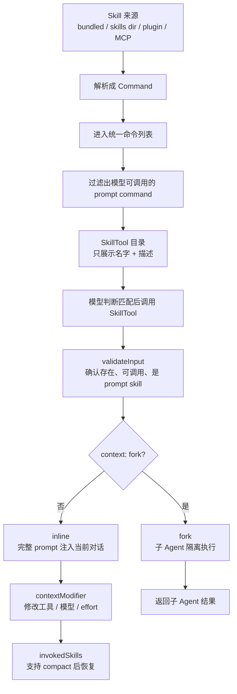

# Claude Code Skill 系统：专业指令如何按需进入 Agent Loop

> **定位**：本章讲清楚 Claude Code 的 Skill 系统：一个 skill 如何被发现、如何以轻量目录展示给模型、模型如何调用 `SkillTool`、完整指令如何进入当前对话，以及 inline / fork 两种执行方式有什么差别。
> 不讲 Skill 编写教程，不展开每个内置 Skill 的具体内容。

Skill 系统解决的核心问题是：

```text
专业能力很多，
但不能把每个能力的完整 prompt 都塞进每次请求。
```

Claude Code 的做法是：

```text
发现阶段：只给模型 skill 名字和简短描述；
调用阶段：模型选中某个 skill 后，再加载完整指令；
执行阶段：完整指令要么注入当前对话，要么交给子 Agent 隔离执行。
```

一句话总结：

```text
Skill 不是一个个独立工具，而是一套“按需加载的专业指令系统”。
```

---

## 16.1 先分清三个对象：Skill、Command、SkillTool

这篇最容易混乱的地方，是把 Skill、Command、Tool 混在一起。先把三者分开：

| 对象 | 人话解释 | 在链路里的位置 |
|---|---|---|
| Skill | 一份专业指令能力，比如 commit、review-pr、pdf | 来源内容 |
| Command | Claude Code 内部统一表示 slash command / prompt command 的结构 | 注册表形态 |
| SkillTool | 模型用来调用 skill 的通用工具 | 模型入口 |

所以不是“每个 skill 都是一个 Tool”。更准确的关系是：

```text
很多 skill -> 统一成 Command -> 由一个 SkillTool 按名字调用
```

SkillTool 的输入 schema 很简单：skill 名称和可选参数。

源码参考：`src/tools/SkillTool/SkillTool.ts:292-299`

```typescript
export const inputSchema = lazySchema(() =>
  z.object({
    skill: z
      .string()
      .describe('The skill name. E.g., "commit", "review-pr", or "pdf"'),
    args: z.string().optional().describe('Optional arguments for the skill'),
  }),
)
type InputSchema = ReturnType<typeof inputSchema>
```

SkillTool 本身是一个普通工具，但它调用的是 prompt command。

源码参考：`src/tools/SkillTool/SkillTool.ts:332-345`

```typescript
export const SkillTool: Tool<InputSchema, Output, Progress> = buildTool({
  name: SKILL_TOOL_NAME,
  searchHint: 'invoke a slash-command skill',
  maxResultSizeChars: 100_000,
  get inputSchema(): InputSchema {
    return inputSchema()
  },
  get outputSchema(): OutputSchema {
    return outputSchema()
  },

  description: async ({ skill }) => `Execute skill: ${skill}`,

  prompt: async () => getPrompt(getProjectRoot()),
```

这就是 Skill 系统的基本结构：

```text
SkillTool 只有一个；
具体能力通过 skill 参数选择。
```

---

## 16.2 一图看懂 Skill 生命周期



读这张图时抓住一个重点：

```text
Skill 的完整内容不会一开始就给模型；
只有模型调用 SkillTool 后，完整指令才进入上下文。
```

---

## 16.3 Skill 从哪里来：多来源，统一成 Command

Skill 可以来自内置包、用户目录、插件、MCP 或管理策略。源码用 `LoadedFrom` 标记来源。

源码参考：`src/skills/loadSkillsDir.ts:67-74`

```typescript
export type LoadedFrom =
  | 'commands_DEPRECATED'
  | 'skills'
  | 'plugin'
  | 'managed'
  | 'bundled'
  | 'mcp'
```

这些来源的差异只存在于加载阶段。一旦进入运行时，后续都按 `Command` 处理。

| 来源 | 典型位置 | 进入系统后的形态 |
|---|---|---|
| `bundled` | CLI 内置技能 | `Command` |
| `skills` | 用户或项目 `.claude/skills` | `Command` |
| `plugin` | 插件中的 `skills/` 或 `commands/` | `Command` |
| `mcp` | MCP prompt skill | `Command` |
| `managed` | 管理策略注入 | `Command` |
| `commands_DEPRECATED` | 旧 slash command 目录 | `Command` |

SkillTool 不需要关心来源细节。它通过 `getAllCommands()` 拿到统一列表。

源码参考：`src/tools/SkillTool/SkillTool.ts:77-94`

```typescript
/**
 * Gets all commands including MCP skills/prompts from AppState.
 * SkillTool needs this because getCommands() only returns local/bundled skills.
 */
async function getAllCommands(context: ToolUseContext): Promise<Command[]> {
  // Only include MCP skills (loadedFrom === 'mcp'), not plain MCP prompts.
  // Before this filter, the model could invoke MCP prompts via SkillTool
  // if it guessed the mcp__server__prompt name — they weren't discoverable
  // but were technically reachable.
  const mcpSkills = context
    .getAppState()
    .mcp.commands.filter(
      cmd => cmd.type === 'prompt' && cmd.loadedFrom === 'mcp',
    )
  if (mcpSkills.length === 0) return getCommands(getProjectRoot())
  const localCommands = await getCommands(getProjectRoot())
  return uniqBy([...localCommands, ...mcpSkills], 'name')
}
```

这里有一个重要边界：

```text
MCP prompt 不自动等于 MCP skill；
只有 loadedFrom === 'mcp' 且 type === 'prompt' 的 command 才能被 SkillTool 调用。
```

---

## 16.4 为什么不把所有 Skill 都变成 Tool

如果每个 skill 都变成一个独立工具，会带来两个问题：

| 问题 | 后果 |
|---|---|
| 工具 schema 膨胀 | 每次请求都要带大量工具描述，前缀成本高 |
| 动态列表抖动 | 插件、项目 skill、MCP 变化会频繁改变工具 schema |

SkillTool 的设计正好避开这两个问题：

```text
工具 schema 里只有 SkillTool；
skill 列表作为轻量目录展示；
完整 prompt 到调用时才加载。
```

这也是 Skill 和 Tool 的根本差别：

| 维度 | Tool | Skill |
|---|---|---|
| 请求前是否暴露完整 schema | 是 | 否 |
| 模型如何选择 | 直接选工具名 | 先看目录，再调用 SkillTool |
| 内容何时进入上下文 | 请求构建时 | 调用时 |
| 主要用途 | 执行外部动作 | 注入专业指令 / 工作流 |

---

## 16.5 模型如何发现 Skill：SkillTool 目录

SkillTool prompt 不放完整技能内容，只告诉模型什么时候应该调用 SkillTool。

源码参考：`src/tools/SkillTool/prompt.ts:173-196`

```typescript
export const getPrompt = memoize(async (_cwd: string): Promise<string> => {
  return `Execute a skill within the main conversation

When users ask you to perform tasks, check if any of the available skills match. Skills provide specialized capabilities and domain knowledge.

When users reference a "slash command" or "/<something>" (e.g., "/commit", "/review-pr"), they are referring to a skill. Use this tool to invoke it.

How to invoke:
- Use this tool with the skill name and optional arguments
- Examples:
  - \`skill: "pdf"\` - invoke the pdf skill
  - \`skill: "commit", args: "-m 'Fix bug'"\` - invoke with arguments
  - \`skill: "review-pr", args: "123"\` - invoke with arguments
  - \`skill: "ms-office-suite:pdf"\` - invoke using fully qualified name

Important:
- Available skills are listed in system-reminder messages in the conversation
- When a skill matches the user's request, this is a BLOCKING REQUIREMENT: invoke the relevant Skill tool BEFORE generating any other response about the task
- NEVER mention a skill without actually calling this tool
- Do not invoke a skill that is already running
- Do not use this tool for built-in CLI commands (like /help, /clear, etc.)
- If you see a <${COMMAND_NAME_TAG}> tag in the current conversation turn, the skill has ALREADY been loaded - follow the instructions directly instead of calling this tool again
`
})
```

这段 prompt 建立了三条行为规则：

1. 匹配 skill 时，必须先调用 SkillTool；
2. 不允许只口头说“我会用某 skill”；
3. 如果当前轮已经加载了 skill，就不要重复调用。

所以 SkillTool 的目录不是说明书，而是一个“按需加载开关”。

---

## 16.6 Skill 目录为什么要有预算

Skill 列表只是发现用途，不是执行用途。它越长，每次请求前缀越贵，也越容易影响缓存稳定性。

源码参考：`src/tools/SkillTool/prompt.ts:20-41`

```typescript
// Skill listing gets 1% of the context window (in characters)
export const SKILL_BUDGET_CONTEXT_PERCENT = 0.01
export const CHARS_PER_TOKEN = 4
export const DEFAULT_CHAR_BUDGET = 8_000 // Fallback: 1% of 200k × 4

// Per-entry hard cap. The listing is for discovery only — the Skill tool loads
// full content on invoke, so verbose whenToUse strings waste turn-1 cache_creation
// tokens without improving match rate. Applies to all entries, including bundled,
// since the cap is generous enough to preserve the core use case.
export const MAX_LISTING_DESC_CHARS = 250

export function getCharBudget(contextWindowTokens?: number): number {
  if (Number(process.env.SLASH_COMMAND_TOOL_CHAR_BUDGET)) {
    return Number(process.env.SLASH_COMMAND_TOOL_CHAR_BUDGET)
  }
  if (contextWindowTokens) {
    return Math.floor(
      contextWindowTokens * CHARS_PER_TOKEN * SKILL_BUDGET_CONTEXT_PERCENT,
    )
  }
  return DEFAULT_CHAR_BUDGET
}
```

预算策略可以概括为：

| 限制 | 目的 |
|---|---|
| 总目录不超过上下文窗口约 1% | 防止能力目录挤占工作上下文 |
| 单条描述最多 250 字符 | 防止 verbose 描述浪费 token |
| 完整内容调用时加载 | 保证发现阶段轻量 |

这体现了 Skill 系统的核心取舍：

```text
发现阶段足够让模型选对；
执行阶段再给完整指令。
```

---

## 16.7 调用前验证：SkillTool 不是任意命令执行器

模型调用 SkillTool 后，系统不会直接执行。`validateInput()` 会先检查：

| 检查项 | 目的 |
|---|---|
| skill 名称非空 | 防止空调用 |
| 去掉 leading slash | 兼容 `/commit` 这种写法 |
| command 是否存在 | 防止模型猜不存在的 skill |
| `disableModelInvocation` | 防止某些 command 被模型调用 |
| `type === 'prompt'` | 防止 SkillTool 执行非 prompt command |

源码参考：`src/tools/SkillTool/SkillTool.ts:355-431`

关键片段：

```typescript
    // Check if command has model invocation disabled
    if (foundCommand.disableModelInvocation) {
      return {
        result: false,
        message: `Skill ${normalizedCommandName} cannot be used with ${SKILL_TOOL_NAME} tool due to disable-model-invocation`,
        errorCode: 4,
      }
    }

    // Check if command is a prompt-based command
    if (foundCommand.type !== 'prompt') {
      return {
        result: false,
        message: `Skill ${normalizedCommandName} is not a prompt-based skill`,
        errorCode: 5,
      }
    }
```

这层验证明确了 SkillTool 的边界：

```text
SkillTool 只能调用 prompt-based、允许模型调用的 skill。
```

---

## 16.8 调用后有两条执行路径：inline 或 fork

验证通过后，SkillTool 进入 `call()`。这里出现最关键的分岔：

```text
默认 inline：把 skill 指令注入当前对话；
context: fork：启动子 Agent 隔离执行。
```

源码参考：`src/tools/SkillTool/SkillTool.ts:581-645`

关键片段：

```typescript
    // Check if skill should run as a forked sub-agent
    if (command?.type === 'prompt' && command.context === 'fork') {
      return executeForkedSkill(
        command,
        commandName,
        args,
        context,
        canUseTool,
        parentMessage,
        onProgress,
      )
    }
```

两条路径的差别：

| 路径 | 发生什么 | 适合什么 |
|---|---|---|
| inline | skill prompt 变成新消息，进入当前 Agent Loop | 需要主 Agent 继续执行的工作流 |
| fork | skill prompt 交给子 Agent，结果再返回主线程 | 需要隔离上下文、减少噪音或独立完成的任务 |

---

## 16.9 inline skill：完整指令注入当前对话

inline 是默认路径。它不是“skill 自己把任务做完”，而是：

```text
SkillTool 展开 skill prompt；
把完整指令注入当前对话；
下一轮模型按这份指令继续工作。
```

源码参考：

- `src/tools/SkillTool/SkillTool.ts:581-645`
- `src/tools/SkillTool/SkillTool.ts:729-756`

inline 的关键结果是 `newMessages`。这些消息会带着 `sourceToolUseID` 进入后续 loop，让模型知道这是由某次 SkillTool 调用加载出来的指令。

所以 inline skill 的真实语义是：

```text
把一份专业工作流说明书放进当前 Agent 的下一轮上下文。
```

---

## 16.10 fork skill：用子 Agent 隔离执行

如果 skill 声明 `context: fork`，SkillTool 会走 `executeForkedSkill()`。

源码参考：

- `src/tools/SkillTool/SkillTool.ts:118-130`
- `src/tools/SkillTool/SkillTool.ts:221-236`
- `src/tools/SkillTool/SkillTool.ts:844-863`

fork skill 的特点：

| 特点 | 说明 |
|---|---|
| 继承必要上下文 | 子 Agent 获得执行 skill 所需上下文 |
| 隔离工具噪音 | 子 Agent 的中间工具输出不会全部污染主上下文 |
| 返回结果摘要 | 主 Agent 接收 skill 执行结果 |
| 适合重任务 | 比如复杂审查、长文档处理、独立分析 |

fork skill 和普通 AgentTool 委派很像，但触发来源不同：

```text
AgentTool 委派是模型主动派生；
fork skill 是 skill frontmatter 决定执行上下文。
```

---

## 16.11 Skill 可以临时改变下一轮上下文

Skill 不只是注入文字。它还可以通过 `contextModifier` 修改下一轮工具、模型或 effort。

源码参考：`src/tools/SkillTool/SkillTool.ts:767-840`

关键影响：

| 能改变什么 | 例子 | 为什么要显式 |
|---|---|---|
| allowed tools | skill 声明需要某些工具 | 下一轮工具边界清晰 |
| model | skill 指定更适合的模型 | 避免隐式切换 |
| effort | skill 指定推理强度 | 只影响这条 skill 链路 |

这让 skill 成为一种“临时工作流覆盖层”：

```text
它可以带来新的指令、新的工具允许范围、新的模型偏好；
但这些变化必须通过 contextModifier 显式进入下一轮。
```

---

## 16.12 压缩后为什么还记得用过的 Skill

长会话压缩后，原始消息可能被摘要替代。如果 skill 指令只靠 transcript 留存，压缩后很容易丢。

因此 SkillTool 与 `invokedSkills` 状态相连。

源码参考：

- `src/tools/SkillTool/SkillTool.ts:37-41`
- `src/tools/SkillTool/SkillTool.ts:762-765`
- `src/tools/SkillTool/SkillTool.ts:286-289`

相关清理片段：

```typescript
  } finally {
    // Release skill content from invokedSkills state
    clearInvokedSkillsForAgent(agentId)
  }
```

这条链路的含义是：

```text
Skill 内容不是“自然”撑过压缩；
它有 invokedSkills 这条专门的恢复通道。
```

这部分和压缩后恢复章节衔接：压缩后，系统可以把已调用 skill 的关键内容重新注入，避免模型突然忘记正在遵守的工作流指令。

---

## 16.13 容易误解的边界

| 误解 | 正确理解 |
|---|---|
| Skill 是 Tool | Skill 是 prompt command；SkillTool 才是调用它的工具 |
| 每个 slash command 都能被模型调用 | 只有 prompt-based 且未禁用 model invocation 的 command 可以 |
| Skill 列表就是完整内容 | 列表只是发现目录；完整内容调用时加载 |
| Plugin Skill 和普通 Skill 完全不同 | 来源不同，进入运行时后都统一成 Command |
| fork skill 就是普通 AgentTool 委派 | fork skill 是由 skill 的 `context: fork` 声明触发 |
| Skill 调用后立即完成任务 | inline skill 只是注入指令，下一轮模型继续执行 |
| 压缩后 skill 自然还在 | `invokedSkills` 是专门恢复通道 |

---

## 16.14 设计模式总结

### 模式一：能力目录和完整内容分离

发现阶段只展示名字、描述和 whenToUse；完整 prompt 调用时才进入上下文。

### 模式二：多来源统一成 Command

Bundled、用户目录、Plugin、MCP 最终都归一到 `Command`，后续执行路径不用关心来源。

### 模式三：一个工具入口，多份专业指令

SkillTool 只有一个，具体 skill 通过参数选择。这比把每个 skill 注册成一个工具更稳定、更省 token。

### 模式四：预算感知的发现列表

Skill 列表受上下文 1% 和单条 250 字符限制，防止能力越多，请求越膨胀。

### 模式五：inline 和 fork 分离

轻量工作流 inline 注入当前对话；重任务或噪音大的任务 fork 给子 Agent。

### 模式六：上下文影响显式化

Skill 对工具、模型、effort 的影响通过 `contextModifier` 进入下一轮，而不是偷偷改全局状态。

---

## 16.15 对我们的启发

如果你在设计自己的 Agent Skill 系统，可以借鉴：

1. 不要把每个技能都做成独立工具；用一个 `SkillTool` 加 skill name 参数即可。
2. 发现阶段只展示轻量目录，执行阶段再加载完整指令。
3. 所有来源统一成一个 command / skill 数据结构，减少执行路径分叉。
4. 给能力目录设置 token 预算，避免插件越多、请求越贵。
5. 让 skill 声明执行上下文：inline 或 fork。
6. Skill 对工具、模型、推理配置的影响必须显式进入下一轮上下文。
7. 长会话里要为已调用 skill 设计恢复通道，不能指望摘要自然保留所有指令。

---

## 16.16 小结

Claude Code 的 Skill 系统可以用一条线讲清楚：

```text
多来源 skill
  -> 统一成 Command
  -> 作为轻量目录展示给模型
  -> 模型调用 SkillTool
  -> 完整 prompt 按需加载
  -> inline 注入当前对话，或 fork 给子 Agent
  -> contextModifier 显式影响下一轮
  -> invokedSkills 支持压缩后恢复
```

这套设计让 Claude Code 可以拥有很多专业能力，但不让每次请求都背上完整 prompt 和工具 schema 的成本。
