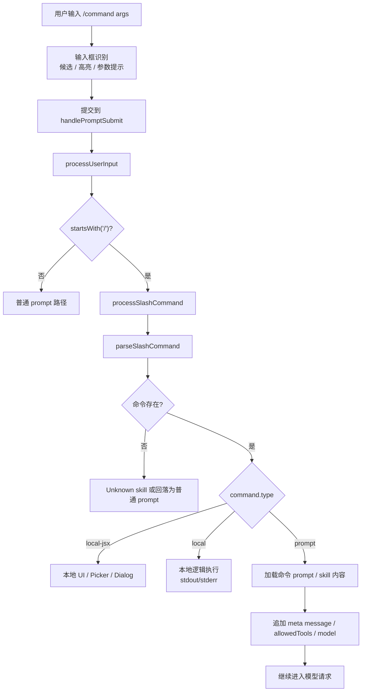

# Claude Code Slash Command：用户输入一个命令后发生了什么

> **定位**：本文只讲 Claude Code 中 `/command args` 这类 slash command 的执行链路。重点是解释命令如何从输入框候选、解析、查找、分派，进入本地 UI、本地逻辑或模型 prompt。最后用 Dream / Auto Dream 作为专例，说明“手动命令”和“后台自动整理”为什么相似但不是同一条路径。

它和《请求链路》的关系是：请求链路讲“一次用户输入如何变成模型流”；本文把其中的 slash command 分支单独放大。它和 Skill / Plugin 文档的关系是：Skill / Plugin 讲能力从哪里来；本文讲这些能力在用户输入 `/` 后如何被调度。

---

## 1. 先看整体链路

用户输入 `/command args` 后，不会被当成普通文本直接送给模型。Claude Code 会先在本地做一轮命令处理：

```text
用户输入 /command args
  -> PromptInput / useTypeahead 识别 slash command 候选
  -> REPL 提交输入
  -> handlePromptSubmit()
  -> processUserInput()
  -> processSlashCommand()
  -> parseSlashCommand()
  -> hasCommand() / getCommand()
  -> 按 command.type 分派
      local-jsx  -> 本地 Ink UI
      local      -> 本地函数执行，返回 stdout/stderr
      prompt     -> 展开成模型可见的 meta prompt，再进入 Agent Loop
```

用运行时分界看，就是：



这里有一个重要判断：

```text
slash command 是本地运行时能力入口，
不是模型自己“看到斜杠后决定执行命令”。
```

模型只会看到 prompt 型命令展开后的内容；很多本地命令根本不会进入模型。

---

## 2. 命令从哪里来

`commands` 不是一个单一数组写死在 UI 里。`getCommands(cwd)` 会把多个来源合并起来：

| 来源 | 作用 |
|---|---|
| bundled skills | 随 CLI 内置的技能，例如 verify、remember、batch 等 |
| builtin plugin skills | 内置插件提供的技能 |
| skill dir commands | 用户或项目目录中的 skills / legacy commands |
| workflow commands | workflow 脚本生成的命令 |
| plugin commands | 插件 manifest 中声明的命令 |
| plugin skills | 插件提供的技能 |
| built-in commands | `/config`、`/model`、`/memory` 等内置命令 |
| dynamic skills | 运行中发现并加入的动态技能 |

源码上，`loadAllCommands()` 并行读取 skills、plugin commands、workflow commands，然后再拼上内置命令；`getCommands()` 再按 availability 和 `isEnabled()` 做过滤。

参考：

- `code-src/src/commands.ts:449`：`loadAllCommands()` 合并命令来源。
- `code-src/src/commands.ts:476`：`getCommands(cwd)` 返回当前用户可用命令。
- `code-src/src/commands.ts:688`：`findCommand()` 支持 `name`、展示名和 alias。

这意味着同一个 `/xxx` 是否可见，取决于当前 cwd、插件状态、feature flag、认证状态和命令自己的 `isEnabled()`。

---

## 3. 输入阶段：斜杠先触发候选，不触发执行

在交互界面里，用户输入 `/` 时，最先响应的是输入框和 typeahead，而不是命令执行器。

`PromptInput` 会调用 `findSlashCommandPositions(displayedValue)` 找出输入中的 `/command` 片段，然后用 `hasCommand(commandName, commands)` 过滤出真实命令，给合法命令做高亮。

参考：

- `code-src/src/components/PromptInput/PromptInput.tsx:526`：找 slash command 位置并过滤合法命令。
- `code-src/src/utils/suggestions/commandSuggestions.ts:552`：`findSlashCommandPositions()` 匹配 `/command` 形式。

候选列表由 `useTypeahead()` 维护。它会在 prompt 模式下识别输入是否以 `/` 开头：

```text
/              -> 展示命令候选
/con           -> 按命令名过滤
/resume xxx    -> 进入 /resume 的参数补全逻辑
/add-dir path  -> 进入目录补全逻辑
```

参考：

- `code-src/src/hooks/useTypeahead.tsx:729`：决定是否展示 slash command suggestions。
- `code-src/src/hooks/useTypeahead.tsx:775`：调用 `generateCommandSuggestions()` 生成候选。

所以，输入阶段只做三件事：

1. 识别这像不像命令。
2. 展示候选、补全、参数提示。
3. 帮用户把输入编辑成一个合法命令字符串。

真正执行要等用户提交。

---

## 4. 提交阶段：`processUserInput()` 打开 slash 分支

用户按下回车后，REPL 会把输入交给 `handlePromptSubmit()`，再进入 `processUserInput()`。

交互态里还有一个小优化：REPL 会先识别输入是不是 slash command，并对“运行中也允许立即执行”的 `local-jsx` 命令做特殊处理。这样像某些本地 picker / dialog 命令，不必排队等当前模型请求结束。

参考：

- `code-src/src/screens/REPL.tsx:3146`：REPL 的提交入口。
- `code-src/src/screens/REPL.tsx:3165`：解析 slash command 名称和参数，检查可立即执行的 `local-jsx` 命令。
- `code-src/src/screens/REPL.tsx:3492`：常规路径进入 `handlePromptSubmit()`。
- `code-src/src/utils/handlePromptSubmit.ts:476`：`handlePromptSubmit()` 调用 `processUserInput()`。

`processUserInput()` 的关键分支是：

```typescript
if (
  inputString !== null &&
  !effectiveSkipSlash &&
  inputString.startsWith('/')
) {
  const { processSlashCommand } = await import('./processSlashCommand.js')
  const slashResult = await processSlashCommand(...)
  return addImageMetadataMessage(slashResult, imageMetadataTexts)
}
```

参考：

- `code-src/src/utils/processUserInput/processUserInput.ts:531`：slash command 分支入口。

这里还有一个容易忽略的点：普通 prompt 会先抽取附件、`@` 引用、IDE selection 等上下文；但 slash command 的附件处理更克制。

```text
如果是 prompt 模式且输入以 / 开头：
  通常不走普通 prompt 的附件抽取
  由命令自身或 prompt 型命令后续逻辑处理需要的内容
```

这能避免把 `/config`、`/model` 这种本地命令误当成普通用户请求。

---

## 5. 解析阶段：`parseSlashCommand()` 很简单

解析规则在 `parseSlashCommand()` 里：

```text
trim 输入
确认以 / 开头
去掉 /
按空格拆分
第一个词是 commandName
后面的内容合并成 args
如果第二个词是 (MCP)，标记为 MCP 命令
```

例子：

```text
/search foo bar
  -> commandName = search
  -> args = foo bar

/mcp:tool (MCP) arg1 arg2
  -> commandName = mcp:tool (MCP)
  -> args = arg1 arg2
  -> isMcp = true
```

参考：

- `code-src/src/utils/slashCommandParsing.ts:25`：`parseSlashCommand()` 实现。

如果用户只输入 `/` 并提交，解析会失败，返回：

```text
Commands are in the form `/command [args]`
```

参考：

- `code-src/src/utils/processUserInput/processSlashCommand.tsx:310`：解析失败的错误文案。

---

## 6. 查找阶段：未知命令不一定都是错误

解析出 `commandName` 后，`processSlashCommand()` 会先用 `hasCommand(commandName, context.options.commands)` 判断命令是否存在。

如果不存在，有两种情况。

第一种：看起来像命令名，且不是绝对路径。

```text
/foobar
  -> Unknown skill: foobar
  -> shouldQuery = false
  -> 不进入模型
```

参考：

- `code-src/src/utils/processUserInput/processSlashCommand.tsx:332`：未知命令检查。
- `code-src/src/utils/processUserInput/processSlashCommand.tsx:343`：像命令名但不存在时返回 `Unknown skill`。

第二种：像绝对路径或其他用户文本。

```text
/tmp/a.txt 这个文件是什么
  -> 如果判断为路径语义
  -> 回落为普通 prompt
  -> shouldQuery = true
```

这个设计避免把 Unix 绝对路径误判为 slash command。

---

## 7. 分派阶段：三类命令走三条路径

命令存在后，`getMessagesForSlashCommand()` 会读取命令定义，然后按 `command.type` 分派。

类型定义本身也体现了这个边界：`Command` 是 `PromptCommand | LocalCommand | LocalJSXCommand` 的联合。

参考：

- `code-src/src/types/command.ts:25`：`PromptCommand` 提供 `getPromptForCommand(args, context)`。
- `code-src/src/types/command.ts:74`：`LocalCommand` 加载后调用 `call(args, context)`。
- `code-src/src/types/command.ts:144`：`LocalJSXCommand` 加载后调用 `call(onDone, context, args)` 并返回 React 节点。
- `code-src/src/types/command.ts:205`：`Command` 联合类型。

### 7.1 `local-jsx`：本地 UI 命令

`local-jsx` 命令会加载一个 Ink/React 组件，直接在本地终端里显示 UI。典型形态是 picker、dialog、设置面板。

执行过程大致是：

```text
command.load()
  -> mod.call(onDone, context, args)
  -> 返回 JSX
  -> setToolJSX({ jsx, shouldHidePromptInput: true, ... })
  -> 用户在本地 UI 中操作
  -> onDone() 结束命令
```

参考：

- `code-src/src/utils/processUserInput/processSlashCommand.tsx:551`：`local-jsx` 分支。
- `code-src/src/utils/processUserInput/processSlashCommand.tsx:609`：加载并调用命令模块。
- `code-src/src/utils/processUserInput/processSlashCommand.tsx:630`：把 JSX 挂到本地 UI。

这类命令通常不需要模型参与。比如改主题、选模型、打开配置面板，本质是本地状态或 UI 操作。

### 7.2 `local`：本地函数命令

`local` 命令不渲染复杂 UI，而是加载模块并执行本地函数：

```text
command.load()
  -> mod.call(args, context)
  -> 返回 skip / compact / text result
```

如果返回普通文本，运行时会生成一条 local command 输出：

```text
<local-command-stdout>...</local-command-stdout>
```

如果抛错，则生成：

```text
<local-command-stderr>...</local-command-stderr>
```

参考：

- `code-src/src/utils/processUserInput/processSlashCommand.tsx:657`：`local` 分支。
- `code-src/src/utils/processUserInput/processSlashCommand.tsx:668`：加载并调用本地命令模块。
- `code-src/src/utils/processUserInput/processSlashCommand.tsx:707`：普通文本输出。
- `code-src/src/utils/processUserInput/processSlashCommand.tsx:714`：错误输出。

这类命令也通常不进入模型。它们更像 CLI 的本地子命令。

### 7.3 `prompt`：把命令展开成模型任务

`prompt` 命令是最接近“技能”的类型。它不会直接把 `/command args` 原样发给模型，而是调用命令自己的 `getPromptForCommand(args, context)`，生成一组 content blocks。

随后运行时会构造几类消息：

| 消息 | 作用 |
|---|---|
| command metadata | 告诉 UI 和 transcript 当前运行了哪个命令 |
| meta user message | 把命令展开后的 prompt 内容放进模型上下文 |
| attachment messages | 从命令内容中抽取必要附件 |
| command_permissions attachment | 附带该命令声明的 allowedTools、model 等 |

参考：

- `code-src/src/utils/processUserInput/processSlashCommand.tsx:723`：`prompt` 分支。
- `code-src/src/utils/processUserInput/processSlashCommand.tsx:869`：调用 `getPromptForCommand()`。
- `code-src/src/utils/processUserInput/processSlashCommand.tsx:887`：解析命令声明的 allowedTools。
- `code-src/src/utils/processUserInput/processSlashCommand.tsx:902`：构造 metadata、meta prompt、权限附件。

`prompt` 命令会返回 `shouldQuery = true`，所以后续会继续走模型请求和 Agent Loop。

也就是说：

```text
/some-skill args
  不是“模型看到 /some-skill”
  而是“本地运行时把 /some-skill 展开成一段专门 prompt，再交给模型”
```

如果 prompt 命令声明 `context: 'fork'`，还会走 forked sub-agent 路径，而不是在主对话里直接展开。

参考：

- `code-src/src/utils/processUserInput/processSlashCommand.tsx:726`：`command.context === 'fork'` 时执行 forked slash command。

---

## 8. 命令结果如何影响后续模型请求

`processSlashCommand()` 最终返回的是 `ProcessUserInputBaseResult`，核心字段是：

| 字段 | 含义 |
|---|---|
| `messages` | 本次输入转化出的消息，可能是 command 输出，也可能是 meta prompt |
| `shouldQuery` | 是否继续调用模型 |
| `allowedTools` | prompt 命令额外授予的工具权限 |
| `model` / `effort` | prompt 命令指定的模型或推理强度 |
| `resultText` | 非交互模式下可直接返回的文本 |
| `nextInput` / `submitNextInput` | 命令结束后预填或继续提交下一段输入 |

`QueryEngine.submitMessage()` 会把这些消息 push 到会话消息列表；如果 `shouldQuery = false`，就直接把本地命令结果返回，不进入 `query()`。如果 `shouldQuery = true`，才继续进入模型请求。

参考：

- `code-src/src/QueryEngine.ts:419`：调用 `processUserInput()`。
- `code-src/src/QueryEngine.ts:436`：把处理后的消息写回当前 messages。
- `code-src/src/QueryEngine.ts:560`：`shouldQuery = false` 时返回本地命令结果。

这就是 slash command 和普通 prompt 最大的分界：

```text
普通 prompt：默认要进模型。
slash command：先本地解释，只有 prompt 型命令才进模型。
```

---

## 9. Dream 专例：手动 `/dream` 和 Auto Dream 的关系

Dream 是一个很适合观察命令系统边界的例子，因为它同时出现了两个概念：

```text
手动 /dream：
  用户显式输入 slash command，触发 dream skill。

Auto Dream：
  用户没有输入 /dream，而是在 turn 结束后由后台 housekeeping 条件触发。
```

二者目标相似，都是做 memory consolidation，但入口和权限边界不同。

### 9.1 手动 `/dream`：入口存在，但当前源码树不完整

当前源码里，bundled skills 初始化时有一个条件入口：

```typescript
if (feature('KAIROS') || feature('KAIROS_DREAM')) {
  const { registerDreamSkill } = require('./dream.js')
  registerDreamSkill()
}
```

参考：

- `code-src/src/skills/bundled/index.ts:35`：条件注册 `registerDreamSkill()`。

但是在当前外部源码树中，`code-src/src/skills/bundled/dream.ts` 并不存在。因此本文不能完整还原手动 `/dream` 的 `getPromptForCommand()` 实现。

能确认的是：Auto Dream 的 prompt 是从 `dream.ts` 抽出来的公共构造函数：

```typescript
// Extracted from dream.ts so auto-dream ships independently of KAIROS
```

参考：

- `code-src/src/services/autoDream/consolidationPrompt.ts:1`：说明该 prompt 从 `dream.ts` 抽出。
- `code-src/src/services/autoDream/consolidationPrompt.ts:10`：`buildConsolidationPrompt()` 构造 Dream prompt。
- `code-src/src/services/autoDream/consolidationLock.ts:126`：`recordConsolidation()` 用于手动 dream stamp，但当前 checkout 未看到调用点。

因此，手动 `/dream` 可以按 prompt 型 slash command 理解：

```text
用户输入 /dream
  -> slash command 解析
  -> 找到 dream prompt command
  -> 加载 dream prompt
  -> 让模型在主 loop 中执行 memory consolidation
```

但当前 checkout 里可完整追踪的是 Auto Dream。

### 9.2 Auto Dream：不是用户 slash command，而是后台任务

Auto Dream 的初始化发生在后台 housekeeping：

```text
startBackgroundHousekeeping()
  -> initAutoDream()
```

参考：

- `code-src/src/utils/backgroundHousekeeping.ts:31`：后台 housekeeping 启动。
- `code-src/src/utils/backgroundHousekeeping.ts:37`：初始化 Auto Dream。

真正触发发生在 turn 结束后的 stop hooks：

```text
handleStopHooks
  -> 非 bare mode
  -> 主线程，不是 subagent
  -> executeAutoDream(stopHookContext, appendSystemMessage)
```

参考：

- `code-src/src/query/stopHooks.ts:133`：`--bare` / SIMPLE 跳过后台 bookkeeping。
- `code-src/src/query/stopHooks.ts:154`：主线程 turn end 调用 `executeAutoDream()`。

这条路径说明：

```text
Auto Dream 不需要用户输入 /dream。
它是在正常对话结束后，作为后台整理任务被尝试触发。
```

### 9.3 Auto Dream 的触发门槛

Auto Dream 不是每轮都会跑。它有多层 gate：

| Gate | 条件 |
|---|---|
| 模式 gate | KAIROS active 时不跑；remote mode 不跑 |
| memory gate | auto-memory 必须启用 |
| enable gate | `autoDreamEnabled` 或 GrowthBook 默认启用 |
| time gate | 默认距离上次整理至少 24 小时 |
| session gate | 默认至少 5 个历史 session 被修改 |
| throttle gate | session 扫描失败后 10 分钟内不重复扫描 |
| lock gate | 防止多个进程同时整理同一 memory dir |

参考：

- `code-src/src/utils/settings/types.ts:950`：`autoDreamEnabled` setting schema。
- `code-src/src/services/autoDream/config.ts:13`：`isAutoDreamEnabled()` 读取用户设置或 GrowthBook。
- `code-src/src/tools/ConfigTool/supportedSettings.ts:64`：ConfigTool 支持 `autoDreamEnabled`。
- `code-src/src/components/memory/MemoryFileSelector.tsx:222`：Memory UI toggle 写入 `userSettings.autoDreamEnabled`。
- `code-src/src/services/autoDream/autoDream.ts:64`：默认 `minHours = 24`、`minSessions = 5`。
- `code-src/src/services/autoDream/autoDream.ts:96`：`isGateOpen()` 检查 KAIROS、remote、auto-memory 和 enabled。
- `code-src/src/services/autoDream/autoDream.ts:131`：time gate。
- `code-src/src/services/autoDream/autoDream.ts:154`：session gate。

这个设计的重点是节制：

```text
Auto Dream 是低频、后台、条件触发的记忆整理，
不是每轮对话结束都 fork 一个 agent。
```

### 9.4 Auto Dream 如何执行

当所有 gate 通过后，Auto Dream 会：

1. 获取 memory root 和 transcript dir。
2. 构造 consolidation prompt。
3. 注册一个 `DreamTask`，让后台任务 UI 可见。
4. 调用 `runForkedAgent()` 开一个 forked agent。
5. 限制该 agent 的可用工具范围。
6. 监听 agent 消息，记录进度和 touched files。
7. 完成后把“Improved memory files”类系统消息追加回主 transcript。

核心执行片段在 `autoDream.ts`：

```text
buildConsolidationPrompt(...)
  -> runForkedAgent({
       promptMessages,
       canUseTool: createAutoMemCanUseTool(memoryRoot),
       querySource: 'auto_dream',
       forkLabel: 'auto_dream',
       skipTranscript: true,
       onMessage: makeDreamProgressWatcher(...)
     })
```

参考：

- `code-src/src/services/autoDream/autoDream.ts:211`：准备 memory root 和 transcript dir。
- `code-src/src/services/autoDream/autoDream.ts:217`：给 Auto Dream 添加只读 Bash 约束说明。
- `code-src/src/services/autoDream/autoDream.ts:223`：构造 consolidation prompt。
- `code-src/src/services/autoDream/autoDream.ts:225`：调用 `runForkedAgent()`。
- `code-src/src/services/autoDream/autoDream.ts:228`：限制可用工具。
- `code-src/src/services/autoDream/autoDream.ts:229`：标记 `querySource: 'auto_dream'`。
- `code-src/src/services/autoDream/autoDream.ts:231`：`skipTranscript: true`，避免 forked agent 自己污染主 transcript。
- `code-src/src/services/autoDream/autoDream.ts:236`：fork 成功后完成 DreamTask。
- `code-src/src/services/autoDream/autoDream.ts:239`：如果捕获到 touched files，则通过 `appendSystemMessage` 回填主 transcript 摘要。
- `code-src/src/tasks/DreamTask/DreamTask.ts:106`：DreamTask completion note 由 inline `appendSystemMessage` 承担。
- `code-src/src/utils/forkedAgent.ts:489`：`runForkedAgent()` 创建隔离的 subagent context。
- `code-src/src/utils/forkedAgent.ts:543`：forked agent 内部继续运行 `query()`。
- `code-src/src/utils/forkedAgent.ts:526`：`skipTranscript: true` 时跳过 sidechain transcript / agentId 创建。

注意这里的权限差异：

```text
手动 /dream：
  在主 loop 中运行，使用普通权限路径。

Auto Dream：
  在 forked agent 中运行，并额外限制 Bash 为只读探索类命令。
```

源码注释也明确说，这段限制只放在 Auto Dream 的 `extra` 中，不放进共享 prompt body，因为手动 `/dream` 使用普通权限。

参考：

- `code-src/src/services/autoDream/autoDream.ts:214`：说明手动 `/dream` 和 Auto Dream 的工具约束不能混用。

### 9.5 DreamTask：后台任务可见、可停止

Auto Dream 虽然是后台 forked agent，但不是完全不可见。它会注册一个 `DreamTask`：

```text
registerDreamTask()
  -> type = dream
  -> status = running
  -> phase = starting
  -> sessionsReviewing
  -> filesTouched
  -> turns
  -> abortController
```

参考：

- `code-src/src/tasks/DreamTask/DreamTask.ts:52`：注册 Dream task。
- `code-src/src/tasks/DreamTask/DreamTask.ts:60`：生成 dream task id。
- `code-src/src/tasks/DreamTask/DreamTask.ts:63`：task type 是 `dream`。

`makeDreamProgressWatcher()` 会监听 forked agent 的 assistant 消息：

| 内容 | 处理 |
|---|---|
| text block | 合并成进度文本 |
| tool_use block | 只记录数量 |
| Edit / Write tool 的 file_path | 收集 touched files |

参考：

- `code-src/src/services/autoDream/autoDream.ts:282`：Dream progress watcher。
- `code-src/src/services/autoDream/autoDream.ts:292`：处理 text / tool_use block。
- `code-src/src/services/autoDream/autoDream.ts:297`：识别 Edit / Write touched file。

用户也可以从后台任务 UI 停止 dream task。停止时会 abort forked agent，并回滚 consolidation lock 的 mtime，让后续有机会重试。

参考：

- `code-src/src/tasks/DreamTask/DreamTask.ts:132`：`DreamTask` 定义。
- `code-src/src/tasks/DreamTask/DreamTask.ts:136`：`kill()` 停止运行中的 dream task。
- `code-src/src/tasks/DreamTask/DreamTask.ts:153`：停止后回滚 lock。
- `code-src/src/components/tasks/BackgroundTasksDialog.tsx:199`：BackgroundTasksDialog 将 dream task 纳入任务列表。
- `code-src/src/components/tasks/BackgroundTasksDialog.tsx:268`：运行中的 dream task 支持 stop。
- `code-src/src/components/tasks/BackgroundTasksDialog.tsx:395`：dream task 有详情视图。

### 9.6 consolidation lock：mtime 就是 lastConsolidatedAt

Auto Dream 用 memory dir 下的 `.consolidate-lock` 做锁。这个文件有两个作用：

```text
文件内容：持有锁的 PID
文件 mtime：lastConsolidatedAt
```

参考：

- `code-src/src/services/autoDream/consolidationLock.ts:1`：说明 lock file 的 mtime 是 lastConsolidatedAt。
- `code-src/src/services/autoDream/consolidationLock.ts:32`：`readLastConsolidatedAt()` 读取 mtime。
- `code-src/src/services/autoDream/consolidationLock.ts:49`：`tryAcquireConsolidationLock()` 写 PID 并返回旧 mtime。
- `code-src/src/services/autoDream/consolidationLock.ts:87`：失败时 `rollbackConsolidationLock()` 回滚 mtime。

这个设计很小，但作用很关键：

1. 用一个文件同时表达“上次整理时间”和“当前是否有进程正在整理”。
2. 失败时可以把 mtime 回滚到整理前，避免失败也被当成成功整理。
3. 进程崩溃后可以用 PID 和 stale 时间判断是否回收锁。

---

## 10. 手动命令和 Auto Dream 的差异总结

| 维度 | 手动 `/dream` | Auto Dream |
|---|---|---|
| 入口 | 用户输入 slash command | turn 结束后的 stop hooks |
| 是否经过 `processSlashCommand()` | 是 | 否 |
| 触发频率 | 用户决定 | 默认 24h + 5 sessions + lock |
| 执行上下文 | 主 Agent Loop 中的 prompt command | forked agent |
| transcript | 正常进入 slash command / prompt 路径 | forked agent `skipTranscript`，只回填摘要 |
| 工具约束 | 普通手动命令权限路径 | Auto Dream 额外限制 Bash 为只读探索 |
| UI | slash command 的常规展示 | `DreamTask` 后台任务展示 |
| 停止方式 | 取决于主 loop / 命令执行 | 后台任务 kill，abort controller + lock rollback |

这个例子能说明 Claude Code 的一个通用模式：

```text
同一个能力可以有多个入口。

手动入口走 slash command，
自动入口走后台 hook / task，
二者可以复用 prompt 和 memory 规则，
但不共享完整执行边界。
```

---

## 11. 设计启发

### 11.1 不要把命令交给模型自由解释

`/command` 先由本地运行时解析和查表。模型只处理 prompt 型命令展开后的任务内容。

这样做的好处是：

- 本地 UI 命令不会误进模型。
- 未知命令可以明确报错。
- 命令可以声明自己的 allowed tools、model、effort。
- 插件和 skills 可以统一进入同一套命令分派。

### 11.2 命令类型要表达执行边界

`local-jsx`、`local`、`prompt` 的区别不是 UI 分类，而是执行边界：

| 类型 | 边界 |
|---|---|
| `local-jsx` | 本地交互界面 |
| `local` | 本地命令函数 |
| `prompt` | 模型任务注入 |

读源码时如果忽略这个差异，很容易把所有 slash command 都误解成“给模型的一段提示词”。

### 11.3 自动化入口应该和手动入口分开建模

Auto Dream 没有复用用户输入 `/dream` 的入口，而是在 stop hooks 后台触发，并用 forked agent、lock、DreamTask 和只读工具约束重新建了一条自动化路径。

这说明自动化任务需要额外回答几个问题：

- 什么时候触发？
- 如何避免重复触发？
- 如何不污染主 transcript？
- 如何暴露进度和停止能力？
- 失败后下次是否能重试？

这些问题不是手动 slash command 自然具备的，必须在后台任务层单独处理。

---

## 12. 源码阅读索引

| 主题 | 文件 |
|---|---|
| 命令来源合并 | `code-src/src/commands.ts` |
| 输入框 slash 高亮 | `code-src/src/components/PromptInput/PromptInput.tsx` |
| typeahead 候选 | `code-src/src/hooks/useTypeahead.tsx` |
| slash 位置匹配 | `code-src/src/utils/suggestions/commandSuggestions.ts` |
| slash 解析 | `code-src/src/utils/slashCommandParsing.ts` |
| 用户输入预处理 | `code-src/src/utils/processUserInput/processUserInput.ts` |
| slash command 分派 | `code-src/src/utils/processUserInput/processSlashCommand.tsx` |
| QueryEngine 接收处理结果 | `code-src/src/QueryEngine.ts` |
| bundled dream 入口痕迹 | `code-src/src/skills/bundled/index.ts` |
| Auto Dream 配置 | `code-src/src/services/autoDream/config.ts` |
| Auto Dream 主逻辑 | `code-src/src/services/autoDream/autoDream.ts` |
| Dream prompt 构造 | `code-src/src/services/autoDream/consolidationPrompt.ts` |
| Auto Dream lock | `code-src/src/services/autoDream/consolidationLock.ts` |
| DreamTask 后台任务 | `code-src/src/tasks/DreamTask/DreamTask.ts` |
| turn end hook | `code-src/src/query/stopHooks.ts` |
| 后台 housekeeping | `code-src/src/utils/backgroundHousekeeping.ts` |
