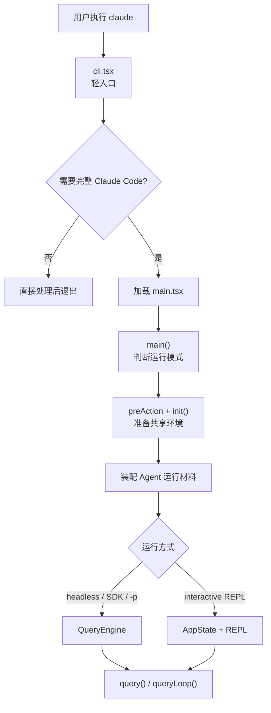

# Claude Code 启动链路：Agent 会话如何被启动

> **定位**：本章只讲一件事：用户执行 `claude` 之后，Claude Code 如何把一次命令启动成一个可运行的 Agent 会话。  
> 不展开 Agent Loop、工具执行、缓存、权限细节；这些都在后续章节。

启动链路的核心问题是：

```text
CLI 入口必须轻，
但 Agent 真正开始工作前，
必须准备好一整套运行材料。
```

这里的“运行材料”包括：运行模式、工作目录、权限上下文、工具池、命令/技能、Agent 定义、MCP、模型配置和会话状态。

所以本章主线很简单：

```text
判断是否要启动 Agent
  -> 准备共享环境
  -> 装配 Agent 运行材料
  -> 交给 REPL 或 QueryEngine
  -> 进入 query() / queryLoop()
```

---

## 2.1 先看终点：启动链路要交付什么

启动链路结束时，系统要交付的不是一个“页面”，而是一个能驱动 Agent 工作的运行包。


| 运行材料     | 它解决什么问题                              | 后续谁使用                        |
| -------- | ------------------------------------ | ---------------------------- |
| 运行模式     | 这次是交互式 REPL，还是 `-p` / SDK / headless | `main.tsx` 分流                |
| 工作目录     | Agent 应该在哪个项目里工作                     | `setup()`、工具、命令、记忆           |
| 权限上下文    | 哪些工具允许、拒绝、需要询问                       | 工具执行层                        |
| 工具池      | Bash、Read、Edit、Grep、MCP tools 等      | Prompt / API / Tool Executor |
| 命令与技能    | Slash commands、内置技能、插件技能             | REPL / headless 命令处理         |
| Agent 定义 | 可派生的 agent 类型和描述                     | AgentTool                    |
| MCP 连接   | 外部工具、命令和资源来源                         | 工具池与附件                       |
| 模型配置     | 默认模型、fallback、thinking 设置            | API 请求构建                     |
| 会话状态     | AppState 或 QueryEngine 状态            | 后续每一轮 Agent Loop             |


后文每一节都围绕这张表：这些材料在哪里产生，最后交给谁。

---

## 2.2 一图看懂 Agent 启动链路




一句话读图：

```text
cli.tsx 负责轻量分流；
main.tsx 负责装配 Agent；
QueryEngine 或 REPL 负责把 Agent 带进 queryLoop。
```

---

## 2.3 第一步：`cli.tsx` 只负责进入正确轨道

`src/entrypoints/cli.tsx` 是真正的进程入口。它不负责装配 Agent，只负责判断是否需要加载完整 CLI。

源码参考：`src/entrypoints/cli.tsx:302-315`

```typescript
    // No special flags detected, load and run the full CLI
    const { startCapturingEarlyInput } = await import("../utils/earlyInput.js");
    startCapturingEarlyInput();
    profileCheckpoint("cli_before_main_import");
    const { main: cliMain } = await import("../main.jsx");
    profileCheckpoint("cli_after_main_import");
    await cliMain();
    profileCheckpoint("cli_after_main_complete");
```

这里最关键的是：

```text
只有确认要进入完整 Claude Code，才 import("../main.jsx")。
```

它不是 Agent 启动主体，只是把请求送进 `main.tsx`。

---

## 2.4 第二步：`main()` 先判断 Agent 的运行方式

进入 `main.tsx` 后，第一件重要事是判断这次是不是交互式会话。因为 REPL 和 headless 都会启动 Agent，但承接方式不同。（REPL = 有交互界面，可以一轮一轮继续聊。headless = 没有持续界面，给一次输入，跑完输出结果。）

源码参考：`src/main.tsx:797-813`

```typescript
  const cliArgs = process.argv.slice(2);
  const hasPrintFlag = cliArgs.includes('-p') || cliArgs.includes('--print');
  const hasInitOnlyFlag = cliArgs.includes('--init-only');
  const hasSdkUrl = cliArgs.some(arg => arg.startsWith('--sdk-url'));
  const isNonInteractive = hasPrintFlag || hasInitOnlyFlag || hasSdkUrl || !process.stdout.isTTY;

  // Stop capturing early input for non-interactive modes
  if (isNonInteractive) {
    stopCapturingEarlyInput();
  }

  // Set simplified tracking fields
  const isInteractive = !isNonInteractive;
  setIsInteractive(isInteractive);
```

这一步回答的问题是：

```text
Agent 是持续陪用户对话，
还是只处理一次输入并输出结果？
```

这个判断会影响后面走 QueryEngine 还是 REPL。

---

## 2.5 第三步：`preAction + init()` 准备共享环境

Commander 的 `preAction` 是“真正执行命令前的准备点”。只有命令真的要运行，才会执行 `init()`。

源码参考：

- `src/main.tsx:884-917`
- `src/entrypoints/init.ts:57-88`
- `src/entrypoints/init.ts:142-159`

这一层做的是共享环境准备：


| 准备项     | 为什么 Agent 启动前必须有            |
| ------- | --------------------------- |
| 配置系统    | 后续权限、模型、MCP、命令都依赖配置         |
| 安全环境变量  | 需要在信任边界明确前先应用安全子集           |
| 证书与网络准备 | 第一次 API / MCP 连接前要能正确建立 TLS |
| 退出清理    | 会话结束时要能刷新日志、状态、后台任务         |


这里不需要展开所有实现细节。对启动链路来说，它的作用就是：

```text
在装配 Agent 前，把所有运行方式共享的地基铺好。
```

---

## 2.6 第四步：装配 Agent 的“手脚”——权限和工具

Agent 能不能执行 Bash、能不能读写文件、是否需要询问用户，都先由权限上下文决定。然后工具池根据这个上下文生成。

源码参考：`src/main.tsx:1747-1755`

```typescript
    const initResult = await initializeToolPermissionContext({
      allowedToolsCli: allowedTools,
      disallowedToolsCli: disallowedTools,
      baseToolsCli: baseTools,
      permissionMode,
      allowDangerouslySkipPermissions,
      addDirs: addDir
    });
    let toolPermissionContext = initResult.toolPermissionContext;
```

源码参考：`src/main.tsx:1864-1869`

```typescript
    maybeActivateProactive(options);
    let tools = getTools(toolPermissionContext);
```

这一步得到两个核心对象：

```text
toolPermissionContext：Agent 做事的边界。
tools：模型实际能看到和调用的工具。
```

这就是 Agent 启动最重要的一步之一：先把“能做什么”和“不能做什么”定下来，再让模型开始行动。

---

## 2.7 第五步：装配 Agent 的工作流——命令、技能和 Agent 定义

工具回答“能做什么操作”。命令、技能和 Agent 定义回答“有哪些可复用工作流”和“能派生什么角色”。

源码参考：

- `src/main.tsx:1903-1934`
- `src/main.tsx:2022-2030`

这一步的主线是：

```text
setup() 确定项目现场；
initBuiltinPlugins() / initBundledSkills() 注册内置扩展；
getCommands() 加载命令和技能入口；
getAgentDefinitionsWithOverrides() 加载可派生的 Agent 定义。
```

这里不要被“并行加载”“预先启动读取”这些性能细节带偏。它们只是让启动更快；真正的 Agent 逻辑是：把项目可用的工作流能力收集起来。

---

## 2.8 第六步：装配外部能力和模型配置

Agent 还要知道外部世界和推理后端：


| 材料                    | 来源            | 用途         |
| --------------------- | ------------- | ---------- |
| MCP clients           | MCP 连接结果      | 外部工具、命令、资源 |
| MCP tools             | MCP 工具声明      | 合并进工具池     |
| MCP commands          | MCP 命令声明      | 合并进命令列表    |
| model / fallbackModel | CLI 参数、配置、默认值 | API 调用     |
| thinkingConfig        | 参数和默认策略       | 请求构建       |


源码参考：

- `src/main.tsx:2453-2488`
- `src/main.tsx:2017-2020`
- `src/main.tsx:3071-3090`

这一步可以概括为：

```text
本地工具和工作流准备好后，
再把外部工具来源和模型推理配置放进同一个会话包。
```

---

## 2.9 第七步：按运行方式交给 QueryEngine 或 REPL

到这里，Agent 运行材料已经齐了。最后只剩一个问题：谁来承接这次会话？

### 非交互式：交给 QueryEngine

非交互式路径会创建 headless AppState，然后用 QueryEngine 管理会话。

源码参考：

- `src/main.tsx:2620-2653`
- `src/QueryEngine.ts:178-185`
- `src/QueryEngine.ts:1274-1313`

QueryEngine 的源码注释已经把它的职责说得很清楚：

```typescript
 * QueryEngine owns the query lifecycle and session state for a conversation.
 * It extracts the core logic from ask() into a standalone class that can be
 * used by both the headless/SDK path and (in a future phase) the REPL.
 *
 * One QueryEngine per conversation. Each submitMessage() call starts a new
 * turn within the same conversation. State (messages, file cache, usage, etc.)
 * persists across turns.
 */
```

人话解释：

```text
headless 没有持续 UI，
所以需要 QueryEngine 承担“会话状态 + 每轮 query 调用”的职责。
```

### 交互式：交给 AppState + REPL

交互式路径会把材料放进 `AppState` 和 `sessionConfig`，然后启动 `<App><REPL /></App>`。

源码参考：

- `src/main.tsx:3071-3090`
- `src/replLauncher.tsx:12-22`
- `src/screens/REPL.tsx:2797-2805`

REPL 每次收到用户输入后，再调用 `query()`：

```typescript
    for await (const event of query({
      messages: messagesIncludingNewMessages,
      systemPrompt,
      userContext,
      systemContext,
      canUseTool,
      toolUseContext,
      querySource: getQuerySourceForREPL()
    })) {
```

人话解释：

```text
REPL 负责持续接收用户输入；
每一轮输入再进入 query() / queryLoop()。
```

---

## 2.10 两条路径不是两套 Agent


| 维度            | headless / SDK / `-p`    | interactive REPL        |
| ------------- | ------------------------ | ----------------------- |
| 用户输入          | 一次性输入                    | 持续输入                    |
| 状态承接者         | QueryEngine              | AppState + REPL         |
| Agent Loop 入口 | QueryEngine 调用 `query()` | REPL 每轮调用 `query()`     |
| 共享材料          | 权限、工具、命令、Agent、MCP、模型配置  | 权限、工具、命令、Agent、MCP、模型配置 |


所以不要讲成“两套 Agent”。更准确的说法是：

```text
同一套 Agent 运行材料，
根据运行方式交给两个承接者：
headless 交给 QueryEngine，
interactive 交给 REPL。
```

---

## 2.11 启动链路到哪里结束

本章的边界是：

```text
到 query() / queryLoop() 开始为止。
```

不在本章展开：


| 不展开               | 放到哪里       |
| ----------------- | ---------- |
| `queryLoop()` 状态机 | Agent Loop |
| system prompt 构建  | Prompt 系统  |
| 工具执行与并发           | 工具执行编排     |
| Skill 发现与加载       | Skill 系统   |
| Plugin 安装与刷新      | Plugin 系统  |
| 子 Agent 派生        | 多代理        |
| 压缩和会话恢复           | 状态、会话、记忆   |


这样边界会更清楚：启动链路负责“把 Agent 启动起来”，不是负责解释 Agent 运行时的所有行为。

---

## 2.12 讲给别人听的版本

可以按 6 句话讲：

1. `cli.tsx` 是轻入口，只判断是否需要进入完整 Claude Code。
2. `main.tsx` 先判断运行方式：交互式 REPL，还是 headless / SDK / `-p`。
3. `preAction` 和 `init()` 在真正执行命令前准备共享环境。
4. 然后系统装配 Agent 运行材料：权限、工具、命令、技能、Agent 定义、MCP、模型和状态。
5. 如果是 headless，这些材料交给 QueryEngine。
6. 如果是 REPL，这些材料放进 AppState 和 sessionConfig，后续每轮用户输入再调用 `query()`。

一句话总结：

```text
启动链路的本质不是“打开 CLI”，而是把 Agent 会话需要的运行材料装配好，并交给正确的运行面。
```

