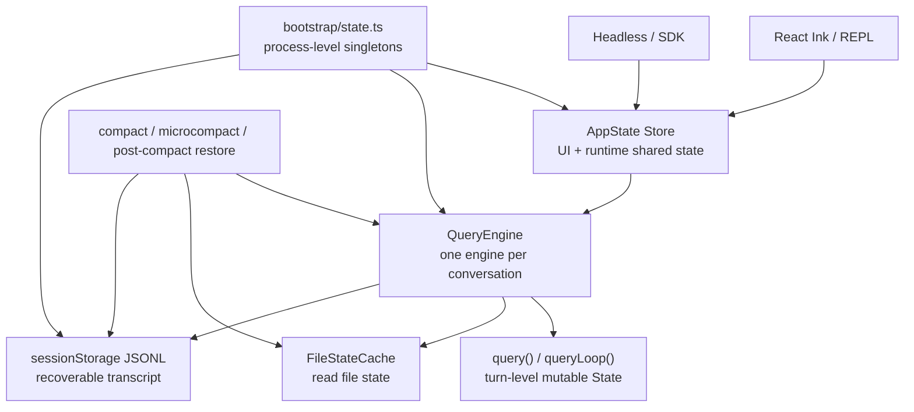

# Claude Code 状态与会话总览：从运行态到可恢复历史

> **定位**：本章分析 Claude Code 的状态分层：`AppState` 管 UI 和运行时共享状态，`QueryEngine` 管单个会话的请求生命周期，`bootstrap/state.ts` 管进程级单例，`sessionStorage.ts` 管 transcript 持久化，`FileStateCache` 管模型已读文件状态，压缩/恢复机制则在这些状态之间做选择性重建。前置依赖：第 1 章《架构全景》、第 3 章《请求链路》。适用场景：想理解 Claude Code 为什么不是“一个 messages 数组走天下”的读者。

本章主线：

```text
Claude Code 的状态不是一份大对象，而是一组不同寿命的容器
  -> 当前进程正在发生什么：AppState
  -> 当前 conversation 记住什么：QueryEngine
  -> 当前 turn 如何继续：queryLoop State
  -> 当前 CLI 进程的全局事实：bootstrap/state.ts
  -> 跨进程如何恢复：sessionStorage JSONL
  -> 模型已经看过哪些文件：FileStateCache
  -> 压缩/恢复在这些容器之间重建必要上下文
```

读这章时只抓一个判断标准：**状态活多久，就应该放在哪一层。** 当前 turn 的恢复计数不该写入 transcript；UI 里的 progress 不该污染 resume；跨会话可恢复的消息不能只待在内存里；会影响缓存键和 session identity 的锁存状态也不该散落在 UI 组件里。

这章不展开自动压缩、压缩后恢复、微压缩、CLAUDE.md 记忆注入的内部细节。它只回答一个问题：这些子系统依附在哪些状态层上，以及为什么不能混放。

---

## 4.1 先抓主线：一次会话会穿过哪些状态容器



这张图可以从上到下读：

1. REPL 或 headless 入口先进入 `AppState` 这一层，拿到当前进程里的工具、MCP、权限、UI 与扩展状态。
2. 一段 conversation 由 `QueryEngine` 接管，它持有消息、文件缓存、usage 和本会话的请求上下文。
3. 每次请求进入 `queryLoop()` 后，会生成一份 turn 级 State，用来控制本轮如何压缩、恢复、执行工具和继续循环。
4. 与会话身份、prompt cache、系统提示词 section cache 相关的稳定单例放在 `bootstrap/state.ts`。
5. 真正可跨进程恢复的消息写入 `sessionStorage` 的 JSONL transcript。
6. 模型看过哪些文件，由 `FileStateCache` 单独记录；压缩和恢复会读它，但它不是 transcript。

所以本章不是按文件名讲状态，而是按生命周期讲状态。

---

## 4.2 状态边界总表：按生命周期而不是按数据类型理解

六类状态的边界如下：

| 状态层 | 生命周期 | 代表文件 | 主要职责 |
|---|---|---|---|
| UI / 运行时共享状态 | 当前进程，随 AppState 更新 | `src/state/AppStateStore.ts`、`src/state/store.ts` | 权限上下文、MCP、插件、任务、通知、hooks、UI 状态 |
| 会话级请求状态 | 一个 conversation | `src/QueryEngine.ts` | 消息数组、usage、文件缓存、权限拒绝、skill discovery |
| turn 级循环状态 | `queryLoop()` 单次/多次迭代 | `src/query.ts` | 本轮消息、工具上下文、压缩追踪、恢复计数 |
| 进程级单例状态 | 当前 CLI 进程 | `src/bootstrap/state.ts` | sessionId、prompt cache 锁存、系统提示词 section cache、telemetry、session flags |
| 持久 transcript | 跨进程，可 resume | `src/utils/sessionStorage.ts` | JSONL 会话消息、parent chain、file history/attribution snapshots |
| 文件状态缓存 | 当前会话，可被压缩恢复利用 | `src/utils/fileStateCache.ts` | 模型已读文件内容、mtime/offset/limit、LRU 限制 |

这一分层能避免两个极端：

1. 把所有状态都塞进 `AppState`，导致 UI、API、会话恢复互相耦合；
2. 把所有状态都落盘，导致进程内快速状态更新变慢且难清理。

后面章节就按这张表展开：先讲运行时共享层，再讲 conversation 层，再讲 turn 层、process 层、persistent 层，最后单独解释文件状态缓存为什么既像“记忆”，又不能和 transcript 混为一谈。

---

## 4.3 运行时共享层：`AppState` 管“当前进程正在发生什么”

`AppState` 是 REPL、工具、MCP、插件、hooks、多代理任务共同观察和修改的运行态。它不是 transcript，也不是模型上下文，而是当前 CLI 进程里的共享底座。

默认状态由 `getDefaultAppState()` 构造。

源码参考：`src/state/AppStateStore.ts:456-520`

```typescript
export function getDefaultAppState(): AppState {
  // Determine initial permission mode for teammates spawned with plan_mode_required
  // Use lazy require to avoid circular dependency with teammate.ts
  /* eslint-disable @typescript-eslint/no-require-imports */
  const teammateUtils =
    require('../utils/teammate.js') as typeof import('../utils/teammate.js')
  /* eslint-enable @typescript-eslint/no-require-imports */
  const initialMode: PermissionMode =
    teammateUtils.isTeammate() && teammateUtils.isPlanModeRequired()
      ? 'plan'
      : 'default'

  return {
    settings: getInitialSettings(),
    tasks: {},
    agentNameRegistry: new Map(),
    verbose: false,
    mainLoopModel: null, // alias, full name (as with --model or env var), or null (default)
    mainLoopModelForSession: null,
    statusLineText: undefined,
    expandedView: 'none',
    isBriefOnly: false,
    showTeammateMessagePreview: false,
    selectedIPAgentIndex: -1,
    coordinatorTaskIndex: -1,
    viewSelectionMode: 'none',
    footerSelection: null,
    kairosEnabled: false,
    remoteSessionUrl: undefined,
    remoteConnectionStatus: 'connecting',
    remoteBackgroundTaskCount: 0,
    replBridgeEnabled: false,
    replBridgeExplicit: false,
    replBridgeOutboundOnly: false,
    replBridgeConnected: false,
    replBridgeSessionActive: false,
    replBridgeReconnecting: false,
    replBridgeConnectUrl: undefined,
    replBridgeSessionUrl: undefined,
    replBridgeEnvironmentId: undefined,
    replBridgeSessionId: undefined,
    replBridgeError: undefined,
    replBridgeInitialName: undefined,
    showRemoteCallout: false,
    toolPermissionContext: {
      ...getEmptyToolPermissionContext(),
      mode: initialMode,
    },
    agent: undefined,
    agentDefinitions: { activeAgents: [], allAgents: [] },
    fileHistory: {
      snapshots: [],
      trackedFiles: new Set(),
      snapshotSequence: 0,
    },
    attribution: createEmptyAttributionState(),
    mcp: {
      clients: [],
      tools: [],
      commands: [],
      resources: {},
      pluginReconnectKey: 0,
    },
    plugins: {
```

后半段继续包含 todos、通知、elicitation、session hooks、inbox、sandbox request、prompt suggestion、speculation、fast mode 等运行态。

源码参考：`src/state/AppStateStore.ts:530-568`

```typescript
    todos: {},
    remoteAgentTaskSuggestions: [],
    notifications: {
      current: null,
      queue: [],
    },
    elicitation: {
      queue: [],
    },
    thinkingEnabled: shouldEnableThinkingByDefault(),
    promptSuggestionEnabled: shouldEnablePromptSuggestion(),
    sessionHooks: new Map(),
    inbox: {
      messages: [],
    },
    workerSandboxPermissions: {
      queue: [],
      selectedIndex: 0,
    },
    pendingWorkerRequest: null,
    pendingSandboxRequest: null,
    promptSuggestion: {
      text: null,
      promptId: null,
      shownAt: 0,
      acceptedAt: 0,
      generationRequestId: null,
    },
    speculation: IDLE_SPECULATION_STATE,
    speculationSessionTimeSavedMs: 0,
    skillImprovement: {
      suggestion: null,
    },
    authVersion: 0,
    initialMessage: null,
    effortValue: undefined,
    activeOverlays: new Set<string>,
    fastMode: false,
  }
}
```

可以把 `AppState` 理解为“当前进程里可被 UI 和工具共同观察/修改的世界”。它包括：

| AppState 区域 | 代表字段 | 用途 |
|---|---|---|
| UI 状态 | `expandedView`、`footerSelection`、`notifications` | 控制终端界面展示 |
| 工具与权限上下文 | `toolPermissionContext` | 供工具执行、请求构建读取 |
| MCP 状态 | `mcp.clients/tools/commands/resources` | 外部工具和资源集合 |
| Plugin / Skill 附属状态 | `plugins`、`skillImprovement` | 扩展系统运行态 |
| 多代理与任务 | `tasks`、`agentDefinitions`、`inbox` | 后台任务、Agent 协作 |
| 会话辅助状态 | `fileHistory`、`attribution`、`sessionHooks` | 可被 transcript / hooks / 恢复使用 |

`AppState` 不适合放所有东西。比如 `sessionId` 不在这里，而在 `bootstrap/state.ts`；文件内容缓存不直接放这里，而在 `QueryEngine` 的 `readFileState`；可恢复消息则写入 transcript。

### 4.3.1 `createStore()` 只是 AppState 的容器

Claude Code 的 store 很小。它不是复杂状态框架，而是一个带 `getState`、`setState`、`subscribe` 的不可变更新容器。

源码参考：`src/state/store.ts:1-34`

```typescript
type Listener = () => void
type OnChange<T> = (args: { newState: T; oldState: T }) => void

export type Store<T> = {
  getState: () => T
  setState: (updater: (prev: T) => T) => void
  subscribe: (listener: Listener) => () => void
}

export function createStore<T>(
  initialState: T,
  onChange?: OnChange<T>,
): Store<T> {
  let state = initialState
  const listeners = new Set<Listener>()

  return {
    getState: () => state,

    setState: (updater: (prev: T) => T) => {
      const prev = state
      const next = updater(prev)
      if (Object.is(next, prev)) return
      state = next
      onChange?.({ newState: next, oldState: prev })
      for (const listener of listeners) listener()
    },

    subscribe: (listener: Listener) => {
      listeners.add(listener)
      return () => listeners.delete(listener)
    },
  }
}
```

这个 store 的设计重点：

- 更新只能通过 `updater(prev) => next`；
- `Object.is(next, prev)` 时不通知；
- `onChange` 可以做持久化、日志或外部同步；
- React UI 和非 React 模块都能通过同一接口读写状态。

这就是 `AppState` 能同时服务 REPL、headless、工具、MCP、插件和多代理的基础。

---

## 4.4 会话层：`QueryEngine` 管“一段 conversation 记住什么”

`QueryEngine` 的源码注释非常直接：一个 engine 对应一个 conversation；每次 `submitMessage()` 是同一 conversation 内的一轮。

源码参考：`src/QueryEngine.ts:178-210`

```typescript
 * QueryEngine owns the query lifecycle and session state for a conversation.
 * It extracts the core logic from ask() into a standalone class that can be
 * used by both the headless/SDK path and (in a future phase) the REPL.
 *
 * One QueryEngine per conversation. Each submitMessage() call starts a new
 * turn within the same conversation. State (messages, file cache, usage, etc.)
 * persists across turns.
 */
export class QueryEngine {
  private config: QueryEngineConfig
  private mutableMessages: Message[]
  private abortController: AbortController
  private permissionDenials: SDKPermissionDenial[]
  private totalUsage: NonNullableUsage
  private hasHandledOrphanedPermission = false
  private readFileState: FileStateCache
  // Turn-scoped skill discovery tracking (feeds was_discovered on
  // tengu_skill_tool_invocation). Must persist across the two
  // processUserInputContext rebuilds inside submitMessage, but is cleared
  // at the start of each submitMessage to avoid unbounded growth across
  // many turns in SDK mode.
  private discoveredSkillNames = new Set<string>()
  private loadedNestedMemoryPaths = new Set<string>()

  constructor(config: QueryEngineConfig) {
    this.config = config
    this.mutableMessages = config.initialMessages ?? []
    this.abortController = config.abortController ?? createAbortController()
    this.permissionDenials = []
    this.readFileState = config.readFileCache
    this.totalUsage = EMPTY_USAGE
  }
```

`QueryEngine` 持有的不是 UI 状态，而是会话级请求状态：

| 字段 | 生命周期 | 作用 |
|---|---|---|
| `mutableMessages` | conversation 内跨轮次 | 当前消息历史 |
| `readFileState` | conversation 内跨轮次 | 文件读取缓存 |
| `totalUsage` | conversation 内累计 | SDK/headless 结果统计 |
| `permissionDenials` | conversation 内累计 | SDK 结果报告 |
| `discoveredSkillNames` | turn 内为主，跨两次 context rebuild | Skill 调用归因 |
| `loadedNestedMemoryPaths` | conversation 内 | 嵌套记忆文件加载去重 |

### 4.4.1 `ask()` 为 headless 创建一次性 engine

非交互式路径通过 `ask()` 包装 `QueryEngine`。

源码参考：`src/QueryEngine.ts:1204-1285`

```typescript
/**
 * Sends a single prompt to the Claude API and returns the response.
 * Assumes that claude is being used non-interactively -- will not
 * ask the user for permissions or further input.
 *
 * Convenience wrapper around QueryEngine for one-shot usage.
 */
export async function* ask({
  commands,
  prompt,
  promptUuid,
  isMeta,
  cwd,
  tools,
  mcpClients,
  verbose = false,
  thinkingConfig,
  maxTurns,
  maxBudgetUsd,
  taskBudget,
  canUseTool,
  mutableMessages = [],
  getReadFileCache,
  setReadFileCache,
  customSystemPrompt,
  appendSystemPrompt,
  userSpecifiedModel,
  fallbackModel,
  jsonSchema,
  getAppState,
  setAppState,
  abortController,
  replayUserMessages = false,
  includePartialMessages = false,
  handleElicitation,
  agents = [],
  setSDKStatus,
  orphanedPermission,
}: {
```

`ask()` 创建 engine 时会 clone read file cache：

源码参考：`src/QueryEngine.ts:1273-1285`

```typescript
}): AsyncGenerator<SDKMessage, void, unknown> {
  const engine = new QueryEngine({
    cwd,
    tools,
    commands,
    mcpClients,
    agents: agents ?? [],
    canUseTool,
    getAppState,
    setAppState,
    initialMessages: mutableMessages,
    readFileCache: cloneFileStateCache(getReadFileCache()),
```

这个 clone 很关键：headless 请求获得的是一份会话级文件状态视图，不直接共享外部 cache 引用。这样一个请求内部可以安全更新自己的 `readFileState`，最后再由调用方决定如何合并或替换。

---

## 4.5 Turn 层：`queryLoop()` 管“这一轮如何继续”

本章不重复《Agent Loop》的状态机，但要说明它在状态分层中的位置。

`QueryEngine` 是 conversation 级；`queryLoop()` 内部的 `State` 是 turn/loop 级。它携带的是“当前这次模型-工具循环怎么继续”的状态，比如：

- 当前 `messages`；
- `toolUseContext`；
- 自动压缩追踪；
- max output tokens 恢复计数；
- reactive compact 是否尝试过；
- pending tool summary；
- transition reason。

这类状态不应该进入 `AppState`，也不应该写入 transcript。它们是执行当前请求时的临时控制状态，循环结束后就失效。

到这里为止，状态寿命已经明显分开：

```text
AppState：进程中可观察/修改的运行时世界
QueryEngine：一个 conversation 的消息、文件、usage 状态
queryLoop State：一次请求内部的循环控制状态
```

---

## 4.6 进程层：`bootstrap/state.ts` 管“当前 CLI 进程的全局事实”

`bootstrap/state.ts` 维护大量进程级状态。它不依赖 React，也不是某个 `QueryEngine` 的字段，而是当前 CLI 进程的全局事实来源。这里的状态通常有两个特点：要么会影响整个进程的行为，要么必须在不同子系统之间保持一致。

源码参考：`src/bootstrap/state.ts:81-100`

```typescript
  sessionSource: string | undefined
  questionPreviewFormat: 'markdown' | 'html' | undefined
  flagSettingsPath: string | undefined
  flagSettingsInline: Record<string, unknown> | null
  allowedSettingSources: SettingSource[]
  sessionIngressToken: string | null | undefined
  oauthTokenFromFd: string | null | undefined
  apiKeyFromFd: string | null | undefined
  // Telemetry state
  meter: Meter | null
  sessionCounter: AttributedCounter | null
  locCounter: AttributedCounter | null
  prCounter: AttributedCounter | null
  commitCounter: AttributedCounter | null
  costCounter: AttributedCounter | null
  tokenCounter: AttributedCounter | null
  codeEditToolDecisionCounter: AttributedCounter | null
  activeTimeCounter: AttributedCounter | null
  statsStore: { observe(name: string, value: number): void } | null
  sessionId: SessionId
```

同一个 state 里还包含系统提示词缓存、session-only flags、invoked skills、prompt cache 锁存器和最后一次 API request 信息。

源码参考：`src/bootstrap/state.ts:176-256`

```typescript
  // Track invoked skills for preservation across compaction
  // Keys are composite: `${agentId ?? ''}:${skillName}` to prevent cross-agent overwrites
  invokedSkills: Map<
    string,
    {
      skillName: string
      skillPath: string
      content: string
      invokedAt: number
      agentId: string | null
    }
  >
  // Track slow operations for dev bar display (ant-only)
  slowOperations: Array<{
    operation: string
    durationMs: number
    timestamp: number
  }>
  // SDK-provided betas (e.g., context-1m-2025-08-07)
  sdkBetas: string[] | undefined
  // Main thread agent type (from --agent flag or settings)
  mainThreadAgentType: string | undefined
  // Remote mode (--remote flag)
  isRemoteMode: boolean
  // Direct connect server URL (for display in header)
  directConnectServerUrl: string | undefined
  // System prompt section cache state
  systemPromptSectionCache: Map<string, string | null>
  // Last date emitted to the model (for detecting midnight date changes)
  lastEmittedDate: string | null
  // Additional directories from --add-dir flag (for CLAUDE.md loading)
  additionalDirectoriesForClaudeMd: string[]
  // Channel server allowlist from --channels flag (servers whose channel
  // notifications should register this session). Parsed once in main.tsx —
  // the tag decides trust model: 'plugin' → marketplace verification +
  // allowlist, 'server' → allowlist always fails (schema is plugin-only).
  // Either kind needs entry.dev to bypass allowlist.
  allowedChannels: ChannelEntry[]
  // True if any entry in allowedChannels came from
  // --dangerously-load-development-channels (so ChannelsNotice can name the
  // right flag in policy-blocked messages)
  hasDevChannels: boolean
  // Dir containing the session's `.jsonl`; null = derive from originalCwd.
  sessionProjectDir: string | null
  // Cached prompt cache 1h TTL allowlist from GrowthBook (session-stable)
  promptCache1hAllowlist: string[] | null
  // Cached 1h TTL user eligibility (session-stable). Latched on first
  // evaluation so mid-session overage flips don't change the cache_control
  // TTL, which would bust the server-side prompt cache.
  promptCache1hEligible: boolean | null
  // Sticky-on latch for AFK_MODE_BETA_HEADER. Once auto mode is first
  // activated, keep sending the header for the rest of the session so
  // Shift+Tab toggles don't bust the ~50-70K token prompt cache.
  afkModeHeaderLatched: boolean | null
  // Sticky-on latch for FAST_MODE_BETA_HEADER. Once fast mode is first
  // enabled, keep sending the header so cooldown enter/exit doesn't
  // double-bust the prompt cache. The `speed` body param stays dynamic.
  fastModeHeaderLatched: boolean | null
  // Sticky-on latch for the cache-editing beta header. Once cached
  // microcompact is first enabled, keep sending the header so mid-session
  // GrowthBook/settings toggles don't bust the prompt cache.
  cacheEditingHeaderLatched: boolean | null
  // Sticky-on latch for clearing thinking from prior tool loops. Triggered
  // when >1h since last API call (confirmed cache miss — no cache-hit
  // benefit to keeping thinking). Once latched, stays on so the newly-warmed
  // thinking-cleared cache isn't busted by flipping back to keep:'all'.
  thinkingClearLatched: boolean | null
  // Current prompt ID (UUID) correlating a user prompt with subsequent OTel events
  promptId: string | null
  // Last API requestId for the main conversation chain (not subagents).
  // Updated after each successful API response for main-session queries.
  // Read at shutdown to send cache eviction hints to inference.
  lastMainRequestId: string | undefined
  // Timestamp (Date.now()) of the last successful API call completion.
  // Used to compute timeSinceLastApiCallMs in tengu_api_success for
  // correlating cache misses with idle time (cache TTL is ~5min).
  lastApiCompletionTimestamp: number | null
  // Set to true after compaction (auto or manual /compact). Consumed by
  // logAPISuccess to tag the first post-compaction API call so we can
  // distinguish compaction-induced cache misses from TTL expiry.
  pendingPostCompaction: boolean
```

初始化时会生成新的 `sessionId`。

源码参考：`src/bootstrap/state.ts:331-423`

```typescript
    sessionId: randomUUID() as SessionId,
    parentSessionId: undefined,
    // Logger state
    loggerProvider: null,
    eventLogger: null,
    // Meter provider state
    meterProvider: null,
    tracerProvider: null,
    // Agent color state
    agentColorMap: new Map(),
    agentColorIndex: 0,
    // Last API request for bug reports
    lastAPIRequest: null,
    lastAPIRequestMessages: null,
    // Last auto-mode classifier request(s) for /share transcript
    lastClassifierRequests: null,
    cachedClaudeMdContent: null,
    // In-memory error log for recent errors
    inMemoryErrorLog: [],
    // Session-only plugins from --plugin-dir flag
    inlinePlugins: [],
    // Explicit --chrome / --no-chrome flag value (undefined = not set on CLI)
    chromeFlagOverride: undefined,
    // Use cowork_plugins directory instead of plugins
    useCoworkPlugins: false,
    // Session-only bypass permissions mode flag (not persisted)
    sessionBypassPermissionsMode: false,
    // Scheduled tasks disabled until flag or dialog enables them
    scheduledTasksEnabled: false,
    sessionCronTasks: [],
    sessionCreatedTeams: new Set(),
    // Session-only trust flag (not persisted to disk)
    sessionTrustAccepted: false,
    // Session-only flag to disable session persistence to disk
    sessionPersistenceDisabled: false,
    // Track if user has exited plan mode in this session
    hasExitedPlanMode: false,
    // Track if we need to show the plan mode exit attachment
    needsPlanModeExitAttachment: false,
    // Track if we need to show the auto mode exit attachment
    needsAutoModeExitAttachment: false,
    // Track if LSP plugin recommendation has been shown this session
    lspRecommendationShownThisSession: false,
    // SDK init event state
    initJsonSchema: null,
    registeredHooks: null,
    // Cache for plan slugs
    planSlugCache: new Map(),
    // Track teleported session for reliability logging
    teleportedSessionInfo: null,
    // Track invoked skills for preservation across compaction
    invokedSkills: new Map(),
    // Track slow operations for dev bar display
    slowOperations: [],
    // SDK-provided betas
    sdkBetas: undefined,
    // Main thread agent type
    mainThreadAgentType: undefined,
    // Remote mode
    isRemoteMode: false,
    ...(process.env.USER_TYPE === 'ant'
      ? {
          replBridgeActive: false,
        }
      : {}),
    // Direct connect server URL
    directConnectServerUrl: undefined,
    // System prompt section cache state
    systemPromptSectionCache: new Map(),
    // Last date emitted to the model
    lastEmittedDate: null,
    // Additional directories from --add-dir flag (for CLAUDE.md loading)
    additionalDirectoriesForClaudeMd: [],
    // Channel server allowlist from --channels flag
    allowedChannels: [],
    hasDevChannels: false,
    // Session project dir (null = derive from originalCwd)
    sessionProjectDir: null,
    // Prompt cache 1h allowlist (null = not yet fetched from GrowthBook)
    promptCache1hAllowlist: null,
    // Prompt cache 1h eligibility (null = not yet evaluated)
    promptCache1hEligible: null,
    // Beta header latches (null = not yet triggered)
    afkModeHeaderLatched: null,
    fastModeHeaderLatched: null,
    cacheEditingHeaderLatched: null,
    thinkingClearLatched: null,
    // Current prompt ID
    promptId: null,
    lastMainRequestId: undefined,
    lastApiCompletionTimestamp: null,
    pendingPostCompaction: false,
```

### 4.6.1 Session switch 必须同时切换 `sessionId` 和 `sessionProjectDir`

恢复会话时，不能只改 `sessionId`。源码用 `switchSession()` 原子地切换 `sessionId` 与 transcript 所在目录。

源码参考：`src/bootstrap/state.ts:457-489`

```typescript
 * Atomically switch the active session. `sessionId` and `sessionProjectDir`
 * always change together — there is no separate setter for either, so they
 * cannot drift out of sync (CC-34).
 *
 * @param projectDir — directory containing `<sessionId>.jsonl`. Omit (or
 *   pass `null`) for sessions in the current project — the path will derive
 *   from originalCwd at read time. Pass `dirname(transcriptPath)` when the
 *   session lives in a different project directory (git worktrees,
 *   cross-project resume). Every call resets the project dir; it never
 *   carries over from the previous session.
 */
export function switchSession(
  sessionId: SessionId,
  projectDir: string | null = null,
): void {
  // Drop the outgoing session's plan-slug entry so the Map stays bounded
  // across repeated /resume. Only the current session's slug is ever read
  // (plans.ts getPlanSlug defaults to getSessionId()).
  STATE.planSlugCache.delete(STATE.sessionId)
  STATE.sessionId = sessionId
  STATE.sessionProjectDir = projectDir
  sessionSwitched.emit(sessionId)
}

const sessionSwitched = createSignal<[id: SessionId]>()

/**
 * Register a callback that fires when switchSession changes the active
 * sessionId. bootstrap can't import listeners directly (DAG leaf), so
 * callers register themselves. concurrentSessions.ts uses this to keep the
 * PID file's sessionId in sync with --resume.
 */
export const onSessionSwitch = sessionSwitched.subscribe
```

这说明 `bootstrap/state.ts` 不只是“放几个全局变量”。它还承担 session identity 的一致性边界：`sessionId`、`sessionProjectDir`、PID registry、transcript path 必须同步。

---

## 4.7 持久层：transcript 是可恢复的会话事实

不是所有运行时状态都要写入 transcript。`sessionStorage.ts` 明确定义了哪些 entry 是 transcript message。

源码参考：`src/utils/sessionStorage.ts:128-146`

```typescript
/**
 * Type guard to check if an entry is a transcript message.
 * Transcript messages include user, assistant, attachment, and system messages.
 * IMPORTANT: This is the single source of truth for what constitutes a transcript message.
 * loadTranscriptFile() uses this to determine which messages to load into the chain.
 *
 * Progress messages are NOT transcript messages. They are ephemeral UI state
 * and must not be persisted to the JSONL or participate in the parentUuid
 * chain. Including them caused chain forks that orphaned real conversation
 * messages on resume (see #14373, #23537).
 */
export function isTranscriptMessage(entry: Entry): entry is TranscriptMessage {
  return (
    entry.type === 'user' ||
    entry.type === 'assistant' ||
    entry.type === 'attachment' ||
    entry.type === 'system'
  )
}
```

transcript path 来自当前 sessionId 和 projectDir。

源码参考：`src/utils/sessionStorage.ts:202-225`

```typescript
export function getTranscriptPath(): string {
  const projectDir = getSessionProjectDir() ?? getProjectDir(getOriginalCwd())
  return join(projectDir, `${getSessionId()}.jsonl`)
}

export function getTranscriptPathForSession(sessionId: string): string {
  // When asking for the CURRENT session's transcript, honor sessionProjectDir
  // the same way getTranscriptPath() does. Without this, hooks get a
  // transcript_path computed from originalCwd while the actual file was
  // written to sessionProjectDir (set by switchActiveSession on resume/branch)
  // — different directories, so the hook sees MISSING (gh-30217). CC-34
  // made sessionId + sessionProjectDir atomic precisely to prevent this
  // kind of drift; this function just wasn't updated to read both.
  //
  // For OTHER session IDs we can only guess via originalCwd — we don't
  // track a sessionId→projectDir map. Callers wanting a specific other
  // session's path should pass fullPath explicitly (most save* functions
  // already accept this).
  if (sessionId === getSessionId()) {
    return getTranscriptPath()
  }
  const projectDir = getProjectDir(getOriginalCwd())
  return join(projectDir, `${sessionId}.jsonl`)
}
```

写入 transcript 时，系统会去重已写消息，并维护 parent chain。

源码参考：`src/utils/sessionStorage.ts:1409-1450`

```typescript
export async function recordTranscript(
  messages: Message[],
  teamInfo?: TeamInfo,
  startingParentUuidHint?: UUID,
  allMessages?: readonly Message[],
): Promise<UUID | null> {
  const cleanedMessages = cleanMessagesForLogging(messages, allMessages)
  const sessionId = getSessionId() as UUID
  const messageSet = await getSessionMessages(sessionId)
  const newMessages: typeof cleanedMessages = []
  let startingParentUuid: UUID | undefined = startingParentUuidHint
  let seenNewMessage = false
  for (const m of cleanedMessages) {
    if (messageSet.has(m.uuid as UUID)) {
      // Only track skipped messages that form a prefix. After compaction,
      // messagesToKeep appear AFTER new CB/summary, so this skips them.
      if (!seenNewMessage && isChainParticipant(m)) {
        startingParentUuid = m.uuid as UUID
      }
    } else {
      newMessages.push(m)
      seenNewMessage = true
    }
  }
  if (newMessages.length > 0) {
    await getProject().insertMessageChain(
      newMessages,
      false,
      undefined,
      startingParentUuid,
      teamInfo,
    )
  }
  // Return the last ACTUALLY recorded chain-participant's UUID, OR the
  // prefix-tracked UUID if no new chain participants were recorded. This lets
  // callers (useLogMessages) maintain the correct parent chain even when the
  // slice is all-recorded (rewind, /resume scenarios where every message is
  // already in messageSet). Progress is skipped — it's written to the JSONL
  // but nothing chains TO it (see isChainParticipant).
  const lastRecorded = newMessages.findLast(isChainParticipant)
  return (lastRecorded?.uuid as UUID | undefined) ?? startingParentUuid ?? null
}
```

这就是为什么《请求链路》强调“用户消息先落盘”：transcript 是 resume 的事实来源，而不是 UI 当前显示的消息数组。

---

## 4.8 会话恢复从 transcript 重建 LogOption

恢复会话时，系统从 JSONL 读取消息、summary、custom title、file history snapshot、attribution snapshot、context collapse commit、content replacement 等，然后从 leaf message 反向构建 conversation chain。

源码参考：`src/utils/sessionStorage.ts:2289-2345`

```typescript
/**
 * Loads a transcript from a JSON or JSONL file and converts it to LogOption format
 * @param filePath Path to the transcript file (.json or .jsonl)
 * @returns LogOption containing the transcript messages
 * @throws Error if file doesn't exist or contains invalid data
 */
export async function loadTranscriptFromFile(
  filePath: string,
): Promise<LogOption> {
  if (filePath.endsWith('.jsonl')) {
    const {
      messages,
      summaries,
      customTitles,
      tags,
      fileHistorySnapshots,
      attributionSnapshots,
      contextCollapseCommits,
      contextCollapseSnapshot,
      leafUuids,
      contentReplacements,
      worktreeStates,
    } = await loadTranscriptFile(filePath)

    if (messages.size === 0) {
      throw new Error('No messages found in JSONL file')
    }

    // Find the most recent leaf message using pre-computed leaf UUIDs
    const leafMessage = findLatestMessage(messages.values(), msg =>
      leafUuids.has(msg.uuid),
    )

    if (!leafMessage) {
      throw new Error('No valid conversation chain found in JSONL file')
    }

    // Build the conversation chain backwards from leaf to root
    const transcript = buildConversationChain(messages, leafMessage)

    const summary = summaries.get(leafMessage.uuid)
    const customTitle = customTitles.get(leafMessage.sessionId as UUID)
    const tag = tags.get(leafMessage.sessionId as UUID)
    const sessionId = leafMessage.sessionId as UUID
    return {
      ...convertToLogOption(
        transcript,
        0,
        summary,
        customTitle,
        buildFileHistorySnapshotChain(fileHistorySnapshots, transcript),
        tag,
        filePath,
        buildAttributionSnapshotChain(attributionSnapshots, transcript),
        undefined,
        contentReplacements.get(sessionId) ?? [],
      ),
```

这里先建立一个认知：resume 不是简单读取全文件再拼数组。它要找到最新 leaf、沿 parent chain 构建有效对话链，并恢复一组累计状态。

因此 transcript 的角色很明确：它不是运行时缓存，也不是 UI 快照，而是“哪些消息构成可恢复会话”的事实来源。会话恢复与跨会话记忆会在后续章节单独展开。

---

## 4.9 文件状态缓存：模型“看过哪些文件”的会话记忆

`FileStateCache` 容易和 transcript 混淆，因为它也在“记住过去”。但它记住的不是对话链，而是一个更局部的问题：模型是否已经看过某个文件的哪些内容。

它是一个带路径规范化的 LRU cache，记录模型通过 Read 或自动注入看到的文件内容与读取参数。

源码参考：`src/utils/fileStateCache.ts:4-30`

```typescript
export type FileState = {
  content: string
  timestamp: number
  offset: number | undefined
  limit: number | undefined
  // True when this entry was populated by auto-injection (e.g. CLAUDE.md) and
  // the injected content did not match disk (stripped HTML comments, stripped
  // frontmatter, truncated MEMORY.md). The model has only seen a partial view;
  // Edit/Write must require an explicit Read first. `content` here holds the
  // RAW disk bytes (for getChangedFiles diffing), not what the model saw.
  isPartialView?: boolean
}

// Default max entries for read file state caches
export const READ_FILE_STATE_CACHE_SIZE = 100

// Default size limit for file state caches (25MB)
// This prevents unbounded memory growth from large file contents
const DEFAULT_MAX_CACHE_SIZE_BYTES = 25 * 1024 * 1024

/**
 * A file state cache that normalizes all path keys before access.
 * This ensures consistent cache hits regardless of whether callers pass
 * relative vs absolute paths with redundant segments (e.g. /foo/../bar)
 * or mixed path separators on Windows (/ vs \).
 */
```

实现使用 `LRUCache`，并按内容字节数计 size。

源码参考：`src/utils/fileStateCache.ts:30-93`

```typescript
export class FileStateCache {
  private cache: LRUCache<string, FileState>

  constructor(maxEntries: number, maxSizeBytes: number) {
    this.cache = new LRUCache<string, FileState>({
      max: maxEntries,
      maxSize: maxSizeBytes,
      sizeCalculation: value => Math.max(1, Buffer.byteLength(value.content)),
    })
  }

  get(key: string): FileState | undefined {
    return this.cache.get(normalize(key))
  }

  set(key: string, value: FileState): this {
    this.cache.set(normalize(key), value)
    return this
  }

  has(key: string): boolean {
    return this.cache.has(normalize(key))
  }

  delete(key: string): boolean {
    return this.cache.delete(normalize(key))
  }

  clear(): void {
    this.cache.clear()
  }

  get size(): number {
    return this.cache.size
  }

  get max(): number {
    return this.cache.max
  }

  get maxSize(): number {
    return this.cache.maxSize
  }

  get calculatedSize(): number {
    return this.cache.calculatedSize
  }

  keys(): Generator<string> {
    return this.cache.keys()
  }

  entries(): Generator<[string, FileState]> {
    return this.cache.entries()
  }

  dump(): ReturnType<LRUCache<string, FileState>['dump']> {
    return this.cache.dump()
  }

  load(entries: ReturnType<LRUCache<string, FileState>['dump']>): void {
    this.cache.load(entries)
  }
}
```

辅助函数显示它会被 clone、merge、转 object，用于请求、SDK、压缩恢复等场景。

源码参考：`src/utils/fileStateCache.ts:108-142`

```typescript
// Helper function to convert cache to object (used by compact.ts)
export function cacheToObject(
  cache: FileStateCache,
): Record<string, FileState> {
  return Object.fromEntries(cache.entries())
}

// Helper function to get all keys from cache (used by several components)
export function cacheKeys(cache: FileStateCache): string[] {
  return Array.from(cache.keys())
}

// Helper function to clone a FileStateCache
// Preserves size limit configuration from the source cache
export function cloneFileStateCache(cache: FileStateCache): FileStateCache {
  const cloned = createFileStateCacheWithSizeLimit(cache.max, cache.maxSize)
  cloned.load(cache.dump())
  return cloned
}

// Merge two file state caches, with more recent entries (by timestamp) overriding older ones
export function mergeFileStateCaches(
  first: FileStateCache,
  second: FileStateCache,
): FileStateCache {
  const merged = cloneFileStateCache(first)
  for (const [filePath, fileState] of second.entries()) {
    const existing = merged.get(filePath)
    // Only override if the new entry is more recent
    if (!existing || fileState.timestamp > existing.timestamp) {
      merged.set(filePath, fileState)
    }
  }
  return merged
}
```

文件状态缓存不是 transcript 的替代品。它记录的是“模型是否已经看过文件内容”，用于编辑前置条件、压缩后恢复、变更检测等。transcript 记录的是“对话发生了什么”。

一句话区分：

```text
transcript 让会话能恢复；
FileStateCache 让工具知道模型是否真的看过文件。
```

---

## 4.10 压缩与恢复如何跨状态层工作

已有三篇压缩相关文档分别解释：

- 自动压缩：什么时候把长会话摘要化；
- 压缩后状态恢复：压缩后如何恢复文件、技能、计划、delta 附件；
- 微压缩：如何轻量清理工具结果。

放到本章的状态模型里，压缩不是新的一层状态，而是一次跨层操作：它改写 conversation 当前消息表示，同时从文件缓存、技能记录、计划状态、delta 附件等旁路状态中恢复必要上下文。

它们的位置是：

| 机制 | 读哪些状态 | 写/改哪些状态 | 本章中的定位 |
|---|---|---|---|
| 自动压缩 | `messages`、token usage、system/user context | 新的 post-compact messages、compact boundary、transcript | 会话消息状态重写 |
| 压缩后文件恢复 | `readFileState`、invoked skills、plan state、delta state | attachment messages、恢复后的文件/skill/context | 状态断层后的选择性重建 |
| 微压缩 | tool_result blocks、cache edit state | 清理内容或 cache_edits | 上下文空间管理 |
| session resume | JSONL transcript、file history snapshots、content replacements | `LogOption`、messages、恢复状态 | 持久状态回放 |

核心区别：

```text
压缩：改变当前会话的消息表示
恢复：把必要运行态重新注入模型上下文
resume：从持久 transcript 重建会话视图
```

这也是本章主线的回扣：状态分层不是为了“分类好看”，而是为了在压缩、恢复、resume 这些断点上知道应该丢什么、留什么、重建什么。

---

## 4.11 容易混淆的状态边界

| 容易混淆的对象 | 正确理解 |
|---|---|
| `AppState.messages` | 当前架构里会话消息核心在 `QueryEngine.mutableMessages` / transcript，不应把 UI 状态等同于 API 历史 |
| `bootstrap/state.ts` | 进程级单例，不是 React store，也不是持久 transcript |
| `FileStateCache` | 文件内容状态，不是用户可见消息历史 |
| transcript JSONL | 可恢复事实来源，但不包含所有 ephemeral UI progress |
| compact summary | 当前上下文的压缩表示，不等于完整原始历史 |
| CLAUDE.md / memory | 持久指令/记忆来源，会在 Prompt/Context 注入，不等同于会话 transcript |

这些边界能帮助读者理解为什么同一个信息可能看似出现多次：比如文件路径既可能在 transcript 中作为消息出现，也可能在 `readFileState` 中作为 cache key 出现，还可能在压缩后作为 attachment 恢复。它们服务的是不同目的。

---

## 4.12 设计模式总结

### 模式一：按生命周期分层，而不是按数据类型分层

消息、文件、工具、权限都可能跨多个层级出现。Claude Code 的分层依据不是“这是消息还是文件”，而是“它活多久、谁需要读写、是否需要恢复”。

### 模式二：UI 状态和会话事实分离

progress、spinner、expanded view 是 UI 状态；user/assistant/attachment/system message 才进入 transcript。这样 resume 不会被临时 UI 事件污染。

### 模式三：进程级锁存器集中放在 bootstrap state

prompt cache TTL、beta header latch、system prompt section cache 这类会影响全局请求稳定性的状态集中在 `bootstrap/state.ts`，避免散落在 UI 或 QueryEngine 中。

### 模式四：会话消息先落盘，运行态可重建

用户消息进入模型前先写 transcript。相比之下，文件缓存、skill discovery、UI selection 等状态可以在 resume 或压缩后重新推导/恢复。

### 模式五：文件状态用 LRU 和 size limit 控制

模型读过的文件可能很大，所以 `FileStateCache` 同时限制条目数量和总字节数，并规范化路径，避免 cache key 抖动。

---

## 4.13 对我们的启发

如果你在设计自己的 Agent 状态系统，可以借鉴：

1. 把状态按生命周期拆开：turn、conversation、process、persistent，不要塞进一个大对象。
2. UI 状态不要参与可恢复会话链，避免 resume 后出现无意义 progress 或 forked chain。
3. 会话标识和 transcript 路径必须原子切换，避免 resume 到 A 会话却写入 B 路径。
4. 用户消息应在模型调用前写入持久存储，保证中断后仍可恢复。
5. 文件内容缓存要有 LRU 和大小限制；“模型看过文件”与“对话里出现过文件路径”要分开管理。
6. 压缩不是状态系统的替代品，它只是当前上下文表示的一次重写；压缩后仍需要从其他状态层恢复关键上下文。
7. 进程级锁存状态要集中管理，尤其是会影响缓存键、session identity 和 telemetry 的状态。

---

## 4.14 小结

Claude Code 的状态系统可以用六层理解：

1. `AppState`：当前进程里 UI、工具、MCP、插件、多代理共享的运行时状态。
2. `QueryEngine`：一个 conversation 的消息、文件缓存、usage、permission denial 等会话级状态。
3. `queryLoop State`：一次请求内部的临时循环控制状态。
4. `bootstrap/state.ts`：进程级单例，保存 sessionId、系统提示词缓存、prompt cache 锁存器、telemetry 和 session flags。
5. `sessionStorage.ts`：持久 transcript，决定哪些消息可恢复、如何构建 parent chain。
6. `FileStateCache`：记录模型已读文件内容，用于编辑、压缩恢复和文件变更感知。

这套设计的核心是：**不同状态有不同寿命，不同寿命必须有不同容器。** 只有把状态边界理清，后续的记忆注入、会话恢复、压缩后状态重建、Skill/Plugin/Hooks、多代理协作才不会互相踩踏。
