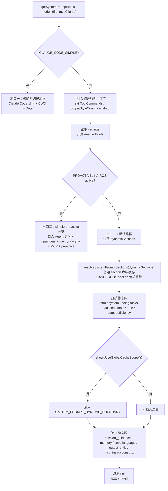

# Claude Code 系统提示词架构：分段、分界与最终选择

## 1.1 前言：Claude Code 系统提示词在解决什么问题

系统提示词架构是 Claude Code 中“看不见但处处生效”的基础设施。它不是简单地把一段系统提示词发给模型，而是在解决一个更工程化的矛盾：

> 系统提示词越来越长，运行时变量越来越多；但 prompt cache 又要求请求前缀尽可能稳定。

Claude Code 的解法可以概括为六层：

1. **分段**：用 `systemPromptSection` 把提示词拆成有名字的段落。
2. **易变**：用 `DANGEROUS_uncachedSystemPromptSection` 标记必须每轮重算的段落。
3. **分界**：用 `SYSTEM_PROMPT_DYNAMIC_BOUNDARY` 切开静态区和动态区。
4. **分拣**：用 `splitSysPromptPrefix` 把系统提示词转换成带缓存策略的 API blocks。
5. **构建**：用 `getSystemPrompt` 生成默认系统提示词数组。
6. **选择**：用 `buildEffectiveSystemPrompt` 在多种提示词来源之间选择最终生效版本。

本章按照系统提示词从“定义”到“发送 API”的路径展开：

```text
systemPromptSection 注册段落
  -> resolveSystemPromptSections 解析段落
  -> getSystemPrompt 拼出默认系统提示词数组
  -> SYSTEM_PROMPT_DYNAMIC_BOUNDARY 标记静态 / 动态边界
  -> buildEffectiveSystemPrompt 选择最终提示词来源
  -> splitSysPromptPrefix 转成带 cacheScope 的 API blocks
  -> buildSystemPromptBlocks 生成最终 API 请求格式
```

一句话说清楚：

> Claude Code 把系统提示词当成一个工程系统来设计：先把内容模块化，再把缓存边界显式化，最后用清晰的优先级链决定哪个提示词真正生效。

## 1.2 第一层：分段注册表

第一层解决的是“系统提示词怎么组织”的问题。

如果系统提示词只是一个巨大字符串，后续会遇到三个麻烦：

- 很难定位某条行为指令来自哪里；
- 很难知道某段内容是否可以缓存；
- 很难只刷新真正变化的部分。

Claude Code 把系统提示词拆成 section，也就是提示词段落。每个 section 都有自己的名称、计算函数和缓存策略。

源码位置：

- `src/constants/systemPromptSections.ts`

### 1.2.1 `SystemPromptSection` 的核心抽象

核心类型可以简化理解为：

```ts
type SystemPromptSection = {
  name: string
  compute: () => string | null | Promise<string | null>
  cacheBreak: boolean
}
```

其中：

- `name` 是段落名称，也是缓存键；
- `compute` 是生成提示词文本的函数；
- `cacheBreak` 表示该段是否绕过缓存，`false` 表示可以记忆化，`true` 表示每轮重算。

这个抽象的价值在于：提示词不再是不可拆解的一坨文本，而是变成了可命名、可定位、可缓存、可审查的段落。

### 1.2.2 `systemPromptSection`：普通可记忆化段落

普通段落通过 `systemPromptSection` 创建：

```ts
systemPromptSection(name, compute)
```

它返回的 section 中：

```ts
cacheBreak: false
```

语义是：首次解析时执行 `compute`，把结果写入缓存；后续轮次如果缓存命中，直接复用旧值。

适合放在普通 section 里的内容包括：

- 会话生命周期内基本稳定的说明；
- 只需要首次加载的 memory prompt；
- 配置读取结果；
- 模型相关但本轮不会频繁变化的指令。

### 1.2.3 `resolveSystemPromptSections`：从 section 到字符串

section 本身只是定义，真正把 section 转成字符串的是 `resolveSystemPromptSections`：

```ts
export async function resolveSystemPromptSections(
  sections: SystemPromptSection[],
): Promise<(string | null)[]> {
  const cache = getSystemPromptSectionCache()

  return Promise.all(
    sections.map(async s => {
      if (!s.cacheBreak && cache.has(s.name)) {
        return cache.get(s.name) ?? null
      }

      const value = await s.compute()
      setSystemPromptSectionCacheEntry(s.name, value)
      return value
    }),
  )
}
```

这段逻辑有几个关键设计。

第一，**并行解析**。

`Promise.all` 会同时解析所有 section。各段之间没有顺序依赖，所以可以一次性发起计算，等待全部完成后返回结果数组。

第二，**`null` 是有效结果**。

某些段落在当前条件下不需要出现，可以返回 `null`。`null` 也会被缓存，避免后续轮次重复执行同样的条件判断。

第三，**普通段落只计算一次**。

如果 `cacheBreak` 是 `false`，并且缓存里已经有同名段落，直接返回缓存值。

第四，**易变段落每轮重算**。

如果 `cacheBreak` 是 `true`，即使缓存里有旧值，也会重新执行 `compute`。

缓存存储在全局状态里的 `STATE.systemPromptSectionCache`，类型是：

```ts
Map<string, string | null>
```

选择全局 state 而不是模块局部变量，是为了让 `/clear`、`/compact`、进入或退出 worktree 等操作能够统一清空相关状态。

### 1.2.4 缓存生命周期：`/clear`、`/compact` 与状态重置

section 缓存不是永久缓存。Claude Code 通过 `clearSystemPromptSections` 统一清理：

```ts
export function clearSystemPromptSections(): void {
  clearSystemPromptSectionState()
  clearBetaHeaderLatches()
}
```

主要触发场景包括：

- `/clear`：用户显式清除对话历史；
- `/compact`：上下文被压缩；
- 进入或退出 worktree 等可能改变环境上下文的操作。

清理 section 缓存的原因很直接：这些操作之后，会话环境可能已经变化。工作目录、配置、工具状态、模型能力判断都可能与之前不同，如果继续使用旧缓存，模型收到的系统提示词就可能不准确。

这里同时调用了 `clearBetaHeaderLatches()`。它清理的是 beta header 的锁存状态。某些 API header 是否启用会被记录下来；清空会话或压缩上下文后，需要重新判断当前请求是否仍然应该带这些 header。

## 1.3 第二层：易变段落与缓存约束

第二层解决的是“哪些内容不能缓存”的问题。

普通 `systemPromptSection` 默认会复用首次计算结果。但有些内容如果复用旧值，会导致功能性错误。这类内容应该使用：

```ts
DANGEROUS_uncachedSystemPromptSection(name, compute, reason)
```

### 1.3.1 `DANGEROUS_uncachedSystemPromptSection` 的语义

这个工厂函数返回：

```ts
cacheBreak: true
```

也就是说，它创建的段落每次解析都会重新执行 `compute`，不会复用旧值。

`DANGEROUS_` 前缀不是说代码危险，而是在提醒开发者：这类段落可能降低 prompt cache 命中率。它应该只用于“内容确实会在会话内变化，而且旧值会导致功能错误”的场景。

`reason` 参数虽然在运行时没有参与逻辑，但它是代码审查里的约束。新增易变段落时，开发者必须解释为什么这段必须每轮重算。

### 1.3.2 为什么 MCP instructions 必须每轮重算

源码中的实际案例是 `mcp_instructions`：

```ts
DANGEROUS_uncachedSystemPromptSection(
  'mcp_instructions',
  () =>
    isMcpInstructionsDeltaEnabled()
      ? null
      : getMcpInstructionsSection(mcpClients),
  'MCP servers connect/disconnect between turns',
)
```

MCP server 可能在两轮对话之间连接或断开。

假设第一轮只有 MCP server A，系统提示词缓存了 A 的说明。第三轮 MCP server B 也连接了，如果 `mcp_instructions` 仍然复用第一轮缓存，模型就永远看不到 B 的说明。

所以这类段落必须每轮重算。

这也是 `reason` 参数的意义：它把“为什么绕过缓存”变成了显式设计决策，而不是隐藏在实现里的随手选择。

### 1.3.3 `token_budget` 从 DANGEROUS 降级的案例

源码注释里还记录了一个反向案例：`token_budget` 曾经是易变段落。

它过去根据当前 token budget 动态变化，因此会在 budget 切换时破坏大量缓存。后来的解决方案不是继续每轮重算，而是改写提示词文本，让它在没有预算时自然成为 no-op。这样它就可以降级为普通 `systemPromptSection`。

这个案例说明一个重要原则：

> 不要一发现动态条件就立刻使用每轮重算。优先考虑能不能把提示词写成稳定文本，让运行时条件在语义上自然失效。

新增 `DANGEROUS_uncachedSystemPromptSection` 前，应该能回答三个问题：

1. 这段内容是否真的会在会话中变化？
2. 如果复用旧值，是否会导致功能性错误？
3. 是否可以通过改写提示词，把它变成普通可缓存段落？

## 1.4 第三层：静态 / 动态边界

第三层解决的是“哪些内容可以进入全局缓存前缀”的问题。

即使 section 可以缓存，也不能把所有 section 都放进同一个缓存前缀。因为有些内容和用户、会话、工具状态有关，一旦进入全局缓存前缀，就会制造大量缓存变体。

`SYSTEM_PROMPT_DYNAMIC_BOUNDARY` 就是为了解决这个问题。

### 1.4.1 `SYSTEM_PROMPT_DYNAMIC_BOUNDARY` 是什么

Claude Code 在系统提示词数组中插入了一个边界标记：

```ts
export const SYSTEM_PROMPT_DYNAMIC_BOUNDARY =
  '__SYSTEM_PROMPT_DYNAMIC_BOUNDARY__'
```

源码位置：

- `src/constants/prompts.ts`

这个标记不是给模型看的。它不会进入最终发送给模型的文本。它的作用是告诉后续缓存分拣逻辑：

```text
边界之前：尽量稳定的静态区，可以使用 global cache
边界之后：用户、会话、运行时相关的动态区，不使用 global cache
```

边界只在 `shouldUseGlobalCacheScope()` 为真时插入。也就是说，只有当前 provider 和 beta 条件支持 global cache 时，才启用这套静态 / 动态切分逻辑。

### 1.4.2 `getSystemPrompt` 中的静态区与动态区

在 `getSystemPrompt` 的默认路径里，返回数组大致是这样：

```text
[
  getSimpleIntroSection(...),
  getSimpleSystemSection(),
  getSimpleDoingTasksSection(),
  getActionsSection(),
  getUsingYourToolsSection(...),
  getSimpleToneAndStyleSection(),
  getOutputEfficiencySection(),

  SYSTEM_PROMPT_DYNAMIC_BOUNDARY,

  session_guidance,
  memory,
  ant_model_override,
  env_info_simple,
  language,
  output_style,
  mcp_instructions,
  scratchpad,
  frc,
  summarize_tool_results,
  ...
]
```

更准确地说，边界前不是“绝对所有用户都完全一样”的内容，而是 Claude Code 尽量保持稳定、低变体的公共前缀。边界后才放更容易随用户、会话或运行时变化的内容，例如：

- memory；
- 当前环境信息；
- 语言偏好；
- 输出风格；
- MCP instructions；
- session-specific guidance。

这样做的收益是：系统提示词中最重、最稳定的前缀可以被 API 后端缓存和复用，而会话相关内容不会破坏这个稳定前缀。

### 1.4.3 为什么 session guidance 必须放在边界之后

`getSessionSpecificGuidanceSection` 是一个很好的例子。

它会根据当前会话状态生成工具使用提示，例如：

- 是否有 `ask_user_question` 工具；
- 是否是交互式会话；
- 是否有 Agent 工具；
- 是否启用了探索类子 Agent；
- 是否有 Skill 工具；
- 是否启用了 Discover Skills；
- 是否启用了验证 Agent。

这些条件都可能因用户、工具集、运行模式而变化。如果把它们放进边界前的静态区，会导致静态前缀出现大量变体。

可以把问题想象成这样：

```text
hasAgentTool: true / false
hasSkills: true / false
isInteractive: true / false
hasDiscoverSkills: true / false
...
```

每多一个条件分支，静态前缀的哈希变体就会增加。如果这些分支进入 global cache 前缀，缓存命中率会快速下降。

所以 Claude Code 把这类内容放进动态区：

```ts
systemPromptSection('session_guidance', () =>
  getSessionSpecificGuidanceSection(enabledTools, skillToolCommands),
)
```

这一点很关键：

> 和会话状态有关的提示词，可以被 section 记忆化，但不应该进入 global cache 的静态前缀。

## 1.5 第四层：API 前的缓存分拣

`getSystemPrompt` 返回的是 `string[]`。这个数组只是逻辑上的系统提示词，还没有告诉 API 哪些块可以缓存。

真正负责分配缓存策略的是 `splitSysPromptPrefix`。

这里先讲下游分拣规则，再回到 1.6 看 `getSystemPrompt` 的完整构建流程。这样读者能先理解 `SYSTEM_PROMPT_DYNAMIC_BOUNDARY` 为什么重要，再看它是如何被放进默认系统提示词数组里的。

源码位置：

- `src/utils/api.ts`

### 1.5.1 `splitSysPromptPrefix` 解决的问题

`splitSysPromptPrefix` 的输入是系统提示词字符串数组，输出是带缓存作用域的 block 数组：

```ts
{
  text: string
  cacheScope: 'global' | 'org' | null
}
```

其中：

- `global` 表示可以跨组织共享缓存；
- `org` 表示可以在组织内共享缓存；
- `null` 表示不加缓存控制。

它会先把输入里的字符串分成四类：

1. **计费 / 归因头**：以 `x-anthropic-billing-header` 开头，永远不缓存。
2. **CLI 开篇前缀**：命中 `CLI_SYSPROMPT_PREFIXES` 的固定开头。
3. **动态边界标记**：`SYSTEM_PROMPT_DYNAMIC_BOUNDARY`，只作为分界线，不进入最终文本。
4. **普通内容**：其余系统提示词正文。

然后根据运行时条件选择三条路径。

### 1.5.2 路径一：强制跳过 global cache

触发条件：

```text
shouldUseGlobalCacheScope() === true
并且
options.skipGlobalCacheForSystemPrompt === true
```

这表示当前环境本来支持 global cache，但这一轮不适合给 system prompt 使用 global cache。

典型场景是 MCP 工具实际渲染到了请求中。MCP tool schema 是用户级动态内容，此时全局缓存的收益和安全性都需要更谨慎地处理。

这条路径会：

- 跳过 `SYSTEM_PROMPT_DYNAMIC_BOUNDARY`；
- 把普通内容全部合并；
- 使用 `org` cache，而不是 `global` cache。

结果类似：

```text
[
  attributionHeader: cacheScope null,
  systemPromptPrefix: cacheScope org,
  restJoined: cacheScope org
]
```

### 1.5.3 路径二：global cache + boundary

触发条件：

```text
shouldUseGlobalCacheScope() === true
未强制跳过 global cache
并且系统提示词中存在 SYSTEM_PROMPT_DYNAMIC_BOUNDARY
```

这是缓存效率最高的主路径。

它会根据 boundary 把普通内容切成两部分：

```text
boundary 之前 -> staticBlocks
boundary 之后 -> dynamicBlocks
```

最终结果类似：

```text
[
  attributionHeader: cacheScope null,
  systemPromptPrefix: cacheScope null,
  staticJoined: cacheScope global,
  dynamicJoined: cacheScope null
]
```

这里最关键的是：

```text
staticJoined -> cacheScope: 'global'
```

这意味着静态系统提示词前缀可以被 API 后端跨组织复用。对于包含大量行为规范、工具规则和安全约束的系统提示词来说，这能显著降低重复计算成本。

### 1.5.4 路径三：默认 org cache

触发条件：

```text
global cache 未启用
或
global cache 启用但没有找到 boundary
```

这是兜底路径。

它不会按静态 / 动态区切分，而是把所有普通内容合并成一个 `org` cache block。

结果类似：

```text
[
  attributionHeader: cacheScope null,
  systemPromptPrefix: cacheScope org,
  restJoined: cacheScope org
]
```

对于不支持 global cache 的 provider，这仍然可以获得组织级别的缓存收益。

### 1.5.5 判断顺序与 API 请求格式

源码判断顺序可以概括为：

```text
shouldUseGlobalCacheScope() && skipGlobalCacheForSystemPrompt
  -> 路径一：强制跳过 global cache

否则，如果 shouldUseGlobalCacheScope()
  -> 找 boundary
    -> 找到：路径二，global cache + boundary
    -> 找不到：路径三，默认 org cache

否则
  -> 路径三，默认 org cache
```

`splitSysPromptPrefix` 的直接消费者是 `buildSystemPromptBlocks`。它会把 `SystemPromptBlock[]` 转成 Anthropic API 需要的 `TextBlockParam[]`：

```ts
return splitSysPromptPrefix(systemPrompt, {
  skipGlobalCacheForSystemPrompt: options?.skipGlobalCacheForSystemPrompt,
}).map(block => ({
  type: 'text',
  text: block.text,
  ...(enablePromptCaching && block.cacheScope !== null && {
    cache_control: getCacheControl({
      scope: block.cacheScope,
      querySource: options?.querySource,
    }),
  }),
}))
```

映射规则很简单：

- `cacheScope === null`：不加 `cache_control`；
- `cacheScope === 'org'`：加组织级缓存控制；
- `cacheScope === 'global'`：加全局缓存控制。

一句话总结：

> `splitSysPromptPrefix` 是 system prompt 上桌前的分拣器。它识别计费头、CLI 前缀、边界标记和普通内容，再根据当前是否能用 global cache，决定普通内容是切成 static / dynamic 两块，还是合并成 org 级缓存块。

## 1.6 第五层：系统提示词的完整构建流程

第五层回到内容构建本身：默认系统提示词到底是怎么生成的。

`getSystemPrompt` 是默认系统提示词的主入口。

源码位置：

- `src/constants/prompts.ts`

它接收：

```ts
export async function getSystemPrompt(
  tools: Tools,
  model: string,
  additionalWorkingDirectories?: string[],
  mcpClients?: MCPServerConnection[],
): Promise<string[]>
```

它返回的是 `string[]`，也就是还没有分配缓存策略的系统提示词数组。

### 1.6.1 `getSystemPrompt` 的三条出口

这个函数有三条出口。



出口一是极简模式。如果设置了：

```text
CLAUDE_CODE_SIMPLE=1
```

就返回一条最小系统提示词：

```text
You are Claude Code, Anthropic's official CLI for Claude.

CWD: ...
Date: ...
```

这通常用于调试、基线对照或减少变量干扰。

出口二是 `PROACTIVE / KAIROS` 模式。如果相关特性启用并处于 active 状态，`getSystemPrompt` 会走一个更扁平的 `simple-proactive` 分支。

这个分支不使用动态 section 注册表，也不插入 `SYSTEM_PROMPT_DYNAMIC_BOUNDARY`。它直接按固定顺序拼接：

1. 自治 Agent 身份说明；
2. system reminders；
3. memory prompt；
4. environment info；
5. language section；
6. MCP instructions；
7. scratchpad instructions；
8. function result clearing；
9. summarize tool results；
10. proactive section。

出口三是默认路径，也是最重要的主路径。

### 1.6.2 默认路径的完整流水线

默认路径先并行获取运行时上下文：

```ts
const [skillToolCommands, outputStyleConfig, envInfo] = await Promise.all([
  getSkillToolCommands(cwd),
  getOutputStyleConfig(),
  computeSimpleEnvInfo(model, additionalWorkingDirectories),
])
```

然后得到：

```ts
const settings = getInitialSettings()
const enabledTools = new Set(tools.map(_ => _.name))
```

接着注册动态 sections，调用：

```ts
const resolvedDynamicSections =
  await resolveSystemPromptSections(dynamicSections)
```

最后拼出数组：

```ts
return [
  getSimpleIntroSection(outputStyleConfig),
  getSimpleSystemSection(),
  outputStyleConfig === null ||
  outputStyleConfig.keepCodingInstructions === true
    ? getSimpleDoingTasksSection()
    : null,
  getActionsSection(),
  getUsingYourToolsSection(enabledTools),
  getSimpleToneAndStyleSection(),
  getOutputEfficiencySection(),

  ...(shouldUseGlobalCacheScope() ? [SYSTEM_PROMPT_DYNAMIC_BOUNDARY] : []),

  ...resolvedDynamicSections,
].filter(s => s !== null)
```

可以把默认路径总结成：

```text
预取运行时上下文
  -> 注册动态 section
  -> resolve 动态 section
  -> 拼接静态区
  -> 条件插入 dynamic boundary
  -> 拼接动态区
  -> 返回 string[]
```

注意，`getSystemPrompt` 只负责把内容按顺序排好。真正的 `global`、`org`、`null` 缓存标签，是后面的 `splitSysPromptPrefix` 决定的。

### 1.6.3 动态 section 注册表总览

标准路径中注册的动态段落构成了动态区的全部内容：

| section 名称 | 类型 | 内容 |
| --- | --- | --- |
| `session_guidance` | 普通缓存 | 工具、Skill、Agent、交互模式相关提示 |
| `memory` | 普通缓存 | CLAUDE.md / memory prompt |
| `ant_model_override` | 普通缓存 | Anthropic 内部模型覆盖提示 |
| `env_info_simple` | 普通缓存 | CWD、OS、Shell 等环境信息 |
| `language` | 普通缓存 | 语言偏好 |
| `output_style` | 普通缓存 | 输出风格配置 |
| `mcp_instructions` | 每轮重算 | MCP server instructions |
| `scratchpad` | 普通缓存 | 草稿本指令 |
| `frc` | 普通缓存 | 函数结果清理指令 |
| `summarize_tool_results` | 普通缓存 | 工具结果摘要指令 |
| `numeric_length_anchors` | 普通缓存 | Ant 内部长度锚点 |
| `token_budget` | 普通缓存 | Token 预算说明 |
| `brief` | 普通缓存 | KAIROS brief 相关段落 |

唯一的 `DANGEROUS_uncachedSystemPromptSection` 是 `mcp_instructions`，这和 1.3 节的分析一致。其他段落都通过普通 section 记忆化，在会话生命周期内尽量复用。

## 1.7 第六层：最终有效提示词的优先级

`getSystemPrompt` 构建的是默认系统提示词。但实际运行时，还有其他来源可能覆盖或补充默认系统提示词。

最终选择逻辑由 `buildEffectiveSystemPrompt` 负责。

源码位置：

- `src/utils/systemPrompt.ts`

### 1.7.1 `buildEffectiveSystemPrompt` 的五级优先级

优先级可以写成：

```text
0. overrideSystemPrompt
1. coordinator system prompt
2. agent system prompt
3. customSystemPrompt
4. defaultSystemPrompt

+ appendSystemPrompt
```

这个函数的重点是“替换优先”，不是把所有来源无脑合并。这样可以避免多个系统提示词来源互相冲突，让最终行为更可预测。

### 1.7.2 Override / Coordinator / Agent / Custom / Default

**Override** 是最高优先级。

如果存在 `overrideSystemPrompt`，直接返回它：

```ts
if (overrideSystemPrompt) {
  return asSystemPrompt([overrideSystemPrompt])
}
```

这会忽略所有其他来源，包括 `appendSystemPrompt`。

**Coordinator** 是协调器模式提示词。

如果启用了 `COORDINATOR_MODE`，并且环境变量 `CLAUDE_CODE_COORDINATOR_MODE` 为真，同时没有 main-thread agent，就使用 coordinator 专用系统提示词。

这里使用 lazy require 引入 coordinator 模块，避免模块加载时出现循环依赖。

**Agent** 是 Agent 自己的系统提示词。

普通模式下：

```text
agentSystemPrompt 替换 defaultSystemPrompt
```

Proactive / Kairos active 模式下：

```text
defaultSystemPrompt + Custom Agent Instructions
```

也就是说，proactive 模式里 agent prompt 是追加到默认自治 Agent prompt 后面，而不是完全替换。

**Custom** 是用户通过 `--system-prompt` 或 `--system-prompt-file` 提供的系统提示词。

如果没有更高优先级来源，它会替换默认系统提示词。

**Default** 是 `getSystemPrompt` 构建出的默认系统提示词数组。

如果没有 override、coordinator、agent、custom，则使用 default。

### 1.7.3 `appendSystemPrompt` 的补充语义

如果存在 `appendSystemPrompt`，它会追加到最终数组末尾，除非已经被最高优先级的 `overrideSystemPrompt` 截断。

核心逻辑可以简化为：

```ts
return asSystemPrompt([
  ...(agentSystemPrompt
    ? [agentSystemPrompt]
    : customSystemPrompt
      ? [customSystemPrompt]
      : defaultSystemPrompt),
  ...(appendSystemPrompt ? [appendSystemPrompt] : []),
])
```

可以把这条优先级链理解为：

> 高优先级来源负责“替换”，`appendSystemPrompt` 负责“补充”。这比把多个来源混合合并更安全。

## 1.8 缓存优化契约：设计约束与常见陷阱

这套架构隐含了一组缓存优化契约。违反这些约束，缓存命中率可能会明显下降。

### 1.8.1 静态区不要放会话变量

边界前的内容会进入 global cache 前缀。这里应该避免放入：

- 用户 ID；
- 会话 ID；
- 当前时间；
- 当前工作目录；
- 动态工具状态；
- MCP server 状态；
- 运行时计数器。

这些变量会让静态前缀产生大量不同版本，从而降低 global cache 命中率。

### 1.8.2 每轮重算必须说明原因

新增 `DANGEROUS_uncachedSystemPromptSection` 时，应该能回答：

1. 这段内容是否真的会在会话中变化？
2. 如果复用旧值，是否会导致功能性错误？
3. 是否可以通过改写提示词，把它变成普通可缓存段落？

`reason` 参数就是为了让这个判断显式化。

### 1.8.3 MCP 工具可能触发 global cache 降级

当 MCP 工具 schema 实际进入请求时，系统提示词可能会跳过 global cache，退回 org 级缓存。

这是因为 MCP 工具 schema 是用户级动态内容。即使系统提示词的静态区本身可以全局缓存，请求里已经包含了不能全局共享的大块动态内容。

### 1.8.4 边界位置是架构不变量

`SYSTEM_PROMPT_DYNAMIC_BOUNDARY` 的位置不是普通实现细节。它决定了哪些内容进入 global cache，哪些内容留在请求本地。

移动或删除这个边界，会改变所有第一方用户的系统提示词缓存行为。

## 1.9 工程模式总结

### 1.9.1 模式一：分段记忆化

适用问题：

> 大型提示词中，一部分内容稳定，一部分内容动态。全量重算浪费资源，全量缓存又容易过期。

方案：

- 把提示词拆成有名字的段落；
- 每个段落声明自己的计算函数；
- 默认段落首次计算后缓存；
- 易变段落每轮重算，并要求提供理由。

代码形态：

```text
systemPromptSection(name, compute)
DANGEROUS_uncachedSystemPromptSection(name, compute, reason)
resolveSystemPromptSections(sections)
```

### 1.9.2 模式二：缓存边界分区

适用问题：

> API 支持 prompt caching，但系统提示词里混有用户、会话和运行时变量。

方案：

- 在提示词数组里插入边界标记；
- 边界前放低变体、可复用的静态内容；
- 边界后放会话相关的动态内容；
- 下游根据边界分配不同 cache scope。

代码形态：

```text
static sections
SYSTEM_PROMPT_DYNAMIC_BOUNDARY
dynamic sections
```

### 1.9.3 模式三：优先级链合成

适用问题：

> 多种运行模式都可能提供系统提示词，需要明确谁覆盖谁。

方案：

- 定义线性优先级链；
- 高优先级来源替换低优先级来源；
- 只保留一个明确的 append 机制用于补充说明；
- 避免把多个来源的系统提示词无条件合并。

Claude Code 的优先级是：

```text
override > coordinator > agent > custom > default
```

## 1.10 对我们的启发

Claude Code 的系统提示词架构给出的启发是：

> 系统提示词不要写成一坨大字符串，而要像工程代码一样模块化、可缓存、可审查、可监控。

具体可以落到五条实践上。

第一，**把系统提示词拆成多个模块**。

例如拆成“身份定义”“工具规则”“安全策略”“输出格式”“环境信息”等段落。这样每段内容负责什么行为更清楚，修改时也更容易定位。

第二，**对每轮重算的内容设置使用约束**。

如果某段提示词不能缓存，开发者应该写清楚原因。这样可以避免因为随手加入动态内容而破坏整体缓存命中率。

第三，**把会话相关变量放到缓存边界之后**。

如果 API 支持 prompt caching，提示词前缀应该尽量稳定。用户 ID、会话 ID、当前时间、当前目录、动态工具状态等内容，都应该放在缓存边界之后。

第四，**定义明确的提示词优先级**。

当系统支持普通模式、Agent 模式、协调器模式、用户自定义提示词时，必须明确谁覆盖谁。相比“合并”，替换语义通常更安全、更可预测。

第五，**持续监控缓存命中率**。

这套架构的价值最终体现在缓存命中率上。如果命中率突然下降，优先检查是否有人把新的条件分支、用户变量或运行时状态放进了静态区。

最后可以用一句话收束全文：

> `systemPromptSection` 解决“怎么组织”；`DANGEROUS_uncachedSystemPromptSection` 解决“什么必须新鲜”；`SYSTEM_PROMPT_DYNAMIC_BOUNDARY` 解决“哪里可以缓存”；`splitSysPromptPrefix` 解决“如何告诉 API 缓存”；`getSystemPrompt` 解决“默认提示词如何生成”；`buildEffectiveSystemPrompt` 解决“多个提示词来源谁说了算”。这些部分串起来，构成了 Claude Code 的系统提示词架构。
