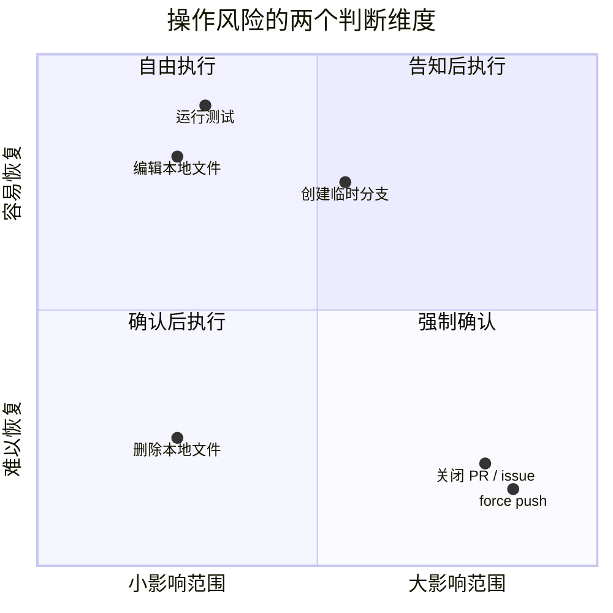

# Claude Code 系统提示词行为指令：六种让模型像工程师行动的模式

## 2.1 前言：行为指令在系统提示词中解决什么问题

第一篇分析的是 Claude Code 系统提示词的组装架构：段落注册、缓存边界、多来源合成。那部分更像骨骼，决定系统提示词如何被构建、缓存和发送。

这一篇关注骨骼上的肌肉：系统提示词里的行为指令。

这些指令真正塑造了 Claude Code 的工程师气质。它们让模型少做无关改动、失败后先诊断、高风险操作前先确认、优先使用专用工具、合理委托子 Agent，并用数字约束输出长度。

从源码看，Claude Code 的行为指令不是随意堆砌的“规则列表”，而是一组可复用的模式语言。它们共同解决一个核心问题：

> 大语言模型天然倾向于多做、快答、泛化、猜测和使用训练数据中最常见的工具；行为指令的作用，是把这些默认倾向拉回到工程协作所需的边界内。

本章将这些行为指令整理为 6 种模式：

1. **极简主义指令**：压制过度工程。
2. **渐进式升级**：避免失败后过早放弃或盲目重试。
3. **可逆性意识**：按风险决定是否需要用户确认。
4. **工具偏好引导**：把模型从通用 Bash 命令引向专用工具。
5. **Agent 委托指引**：规范 fork / subagent 的使用边界。
6. **数值锚定**：用具体数字替代模糊的“简洁一点”。

可以把它们理解为一套行为控制层：

```text
任务范围      -> 极简主义指令
失败处理      -> 渐进式升级
风险操作      -> 可逆性意识
工具选择      -> 工具偏好引导
多 Agent 协作 -> Agent 委托指引
输出长度      -> 数值锚定
```

## 2.2 模式一：极简主义指令

极简主义指令解决的是“模型太愿意多做一点”的问题。

在普通对话里，模型多补充一些内容通常是好事。但在代码任务里，“多做一点”经常变成过度工程：顺手重构、添加配置项、补上用不到的错误处理、引入提前抽象、给没改过的代码加注释。

Claude Code 用极简主义指令把模型的热心限制在任务实际需要的范围内。

源码主要位置：

- `src/constants/prompts.ts:199-213`

### 2.2.1 模式定义

核心思想：

> 明确禁止超出任务范围的改动，并用具体反面案例告诉模型“不该做什么”。

这类指令通常采用三层结构：

```text
总原则：不要做任务之外的改动
反面案例：bug fix 不需要顺手清理周围代码
判断锚点：三行重复代码优于过早抽象
```

这比单纯说“保持简单”更有效，因为“简单”很模糊，而“不要添加功能、不要顺手重构、不要为一次性操作创建 helper”是可执行的。

### 2.2.2 源码例子

**例子一：不要添加超出要求的功能**

源码中先给出总原则：不要添加用户没有要求的功能、重构或“改进”。随后用三个反面案例校准边界：

- bug 修复不需要顺手清理周围代码；
- 简单功能不需要额外配置能力；
- 不要给没改过的代码添加 docstring、注释或类型标注。

这一段的价值在于，它把“不要越界”从抽象原则变成了具体场景判断。

**例子二：不要为不可能的场景添加防御**

另一条指令要求模型不要为不可能发生的情况添加错误处理、fallback 或 validation。它还给出一个清晰边界：

```text
只在系统边界做校验：用户输入、外部 API。
内部代码和框架保证可以信任。
```

这条指令压制的是 LLM 常见的“防御性编程泛滥”。模型在训练数据中见过大量“最佳实践”，会倾向于把每条路径都包上额外保护。但在内部代码中，这些保护常常只是噪音。

**例子三：三行重复代码优于过早抽象**

源码中有一句非常关键的数量锚点：

```text
Three similar lines of code is better than a premature abstraction.
```

这句话的作用是覆盖模型默认的 DRY 启发式。没有这个锚点时，模型容易看到两三处相似代码就抽 helper。这里明确告诉模型：少量重复可以接受，过早抽象更糟。

### 2.2.3 为什么有效

第一，**反面案例比正面规则更容易遵循**。

“保持简单”太抽象；“不要在 bug fix 中顺手清理周围代码”更具体。模型可以把当前行为与反面案例直接对照。

第二，**数量锚点会打断默认启发式**。

“三行重复代码”给了模型一个可判断的门槛。它不再只能依赖训练数据中的 DRY 倾向。

第三，**场景分类减少歧义**。

“bug fix”“simple feature”“one-time operation”这些分类，让模型先判断任务类型，再决定是否允许额外动作。

### 2.2.4 可复用模板

```text
不要在任务范围之外添加 {功能 / 重构 / 改进}。
{任务类型 A} 不需要 {常见的过度工程行为 A}。
{任务类型 B} 不需要 {常见的过度工程行为 B}。
不要为 {不可能发生的场景} 添加 {错误处理 / fallback / validation}。
只在 {明确边界} 做额外处理。
{N} 行重复代码优于过早抽象。
```

## 2.3 模式二：渐进式升级

渐进式升级解决的是“失败后如何行动”的问题。

LLM 面对失败时常见两种极端：

- 很快放弃，转而向用户求助；
- 盲目重试同一个命令或同一种方案。

Claude Code 的指令在这两个极端之间定义了一条中间路径：先诊断，再尝试有针对性的修复，最后才升级给用户。

源码主要位置：

- `src/constants/prompts.ts:233`
- `src/tools/BashTool/prompt.ts:304-318`

### 2.3.1 模式定义

核心思想：

> 失败不是立刻求助，也不是无限重试；失败后应先读错误、检查假设、做聚焦修复，真正卡住后再升级。

可以抽象成三阶段协议：

```text
失败
  -> 诊断：读错误，检查假设
  -> 调整：尝试一个聚焦修复
  -> 升级：真正卡住后再问用户
```

### 2.3.2 源码例子

**例子一：失败处理三阶段**

系统提示词要求：如果一个方法失败，先诊断原因，再切换策略。诊断动作包括：

- read the error；
- check your assumptions；
- try a focused fix。

然后它用双边约束卡住两个极端：

```text
不要盲目重试完全相同的动作；
也不要在一次失败后就放弃一个仍然可行的方案。
```

最后才是升级条件：只有在调查后确实卡住时，才通过 `ask_user_question` 请求用户帮助。

**例子二：高风险 Git 操作前先找替代方案**

Bash 工具提示词要求，在执行 destructive git operations 之前，先考虑是否有更安全的替代方案。

这不是简单禁止 `git reset --hard` 或 `git push --force`，而是要求模型在执行前完成一次推理：

```text
有没有更安全的方法能达到同样目标？
```

**例子三：不要在 sleep 循环中重试失败命令**

Bash 工具还明确说：

```text
Do not retry failing commands in a sleep loop — diagnose the root cause.
```

这是渐进式升级模式的最小形式：一句话同时包含禁止行为和替代动作。

### 2.3.3 为什么有效

第一，**双边约束创造合理张力**。

“不要盲目重试”和“不要一次失败就放弃”同时存在，迫使模型在失败后做一次判断：我是在重复，还是在基于新信息调整？

第二，**阶段顺序贴合工程调试流程**。

读错误、检查假设、聚焦修复，是工程师处理失败的自然顺序。模型可以把这套协议直接映射到下一步行动。

第三，**求助被设定为最后手段**。

这能减少不必要的用户打断，提高自主完成率，同时避免模型在真正不确定时硬编答案。

### 2.3.4 可复用模板

```text
当 {操作 / 方案} 失败时，先 {诊断动作}：
- {具体诊断步骤 1}
- {具体诊断步骤 2}
- {具体诊断步骤 3}

不要盲目重试完全相同的操作。
也不要在一次失败后就放弃仍然可行的方案。
只在 {明确升级条件} 时才 {升级动作}，不要把它作为遇到阻力时的第一反应。
```

## 2.4 模式三：可逆性意识

可逆性意识解决的是“哪些操作可以直接做，哪些操作必须确认”的问题。

这是 Claude Code 行为指令中最接近工程风险管理的一组。它不是只列危险命令，而是给模型建立一个判断框架：看操作是否可逆、影响范围有多大、是否会影响共享系统或他人的工作。

源码主要位置：

- `src/constants/prompts.ts:255-266`
- `src/tools/BashTool/prompt.ts:87-94`

### 2.4.1 模式定义

核心思想：

> 按照操作的可逆性和影响范围分级；本地、可逆的操作可以自由执行；不可逆或影响共享系统的操作应先确认。

可逆性意识主要看两个维度：

- **可逆性**：操作是否容易恢复？
- **影响范围**：操作只影响本地，还是会影响共享系统、远端仓库、外部用户？

可以画成一个决策矩阵：



### 2.4.2 源码例子

**例子一：可逆性与影响范围**

系统提示词要求模型认真考虑 action 的 `reversibility` 和 `blast radius`。

它明确区分了两类操作：

- 可以自由执行：本地、可逆的操作，例如编辑文件、运行测试；
- 需要确认：难以恢复、影响共享系统、风险高或破坏性的操作。

这比“不要做危险操作”更好，因为它教给模型一个泛化框架。遇到新操作时，模型可以自己评估，而不是只靠枚举表。

**例子二：四类需要确认的操作**

源码列出了四类典型高风险操作：

| 类型 | 示例 |
| --- | --- |
| 破坏性操作 | 删除文件或分支、drop database table、kill process、`rm -rf`、覆盖未提交改动 |
| 难以恢复的操作 | force push、`git reset --hard`、修改已发布 commit、降级依赖、修改 CI/CD |
| 影响共享状态的操作 | push、创建或关闭 PR / issue、发送 Slack / email、修改权限或基础设施 |
| 上传到第三方工具 | pastebin、gist、在线图表工具等可能被缓存或索引的服务 |

这些列表不是为了穷举所有危险操作，而是为了校准模型对风险的感觉。

**例子三：Git Safety Protocol**

Bash 工具中的 Git 安全协议更严格，连续使用 `NEVER` 和 `CRITICAL` 标记：

- 不要更新 git config；
- 不要运行 destructive git commands，除非用户明确要求；
- 不要跳过 hooks，除非用户明确要求；
- 不要 force push 到 main / master；
- commit hook 失败后应创建新 commit，而不是 amend 旧 commit。

其中 amend 规则尤其值得注意。源码解释了原因：pre-commit hook 失败时，新 commit 实际没有发生；此时 `--amend` 会修改前一个 commit，可能破坏已有工作。

这类因果解释能让模型在类似场景中泛化规则，而不是机械背诵命令列表。

**例子四：一次授权不等于永久授权**

系统提示词还明确说：用户批准一次 action，不代表在所有上下文中都批准。

这条规则建立了“授权作用域”的概念：

```text
Authorization stands for the scope specified, not beyond.
```

它防止模型把一次 `git push` 许可泛化成以后都可以随意 push。

### 2.4.3 为什么有效

第一，**维度分析比枚举更能泛化**。

危险操作不可能穷举。可逆性和影响范围给了模型一个通用评估框架。

第二，**NEVER + unless 提供精确边界**。

“NEVER 做 X，除非用户明确要求”比“尽量避免 X”更少歧义。

第三，**因果解释帮助模型迁移规则**。

amend 的例子解释了为什么规则存在。模型理解原因后，更容易在新场景中做出一致判断。

第四，**授权作用域阻止过度泛化**。

用户一次批准只覆盖当次请求范围，不会自动扩展到未来所有类似操作。

### 2.4.4 可复用模板

```text
在执行操作前，评估它的可逆性和影响范围。
你可以自由执行 {本地且可逆的操作列表}。
对于 {难以恢复 / 影响共享系统 / 破坏性} 的操作，在执行前与用户确认。

绝对不要：
- {危险操作 1}，除非用户明确要求
- {危险操作 2}，除非用户明确要求
- {最微妙的危险操作}，因为 {因果解释}

用户一次批准 {操作} 不代表在所有上下文中批准。
授权只限于用户明确指定的范围。
```

## 2.5 模式四：工具偏好引导

工具偏好引导解决的是“模型默认爱用 Bash”的问题。

Claude Code 提供了 Read、Edit、Write、Glob、Grep 等专用工具。但模型训练数据里充满了 `cat`、`grep`、`sed`、`find`、`echo` 等 Unix 命令。如果不加引导，模型自然会倾向于用 Bash 完成文件读取、搜索和编辑。

工具偏好引导把这种默认路径重定向到专用工具。

源码主要位置：

- `src/constants/prompts.ts:269-305`
- `src/tools/BashTool/prompt.ts:280-365`

### 2.5.1 模式定义

核心思想：

> 在系统提示词和工具描述中同时说明：某类任务应该使用专用工具，而不是通用 Bash 命令。

这类指令通常采用映射表：

```text
读文件：Use Read, NOT cat/head/tail
编辑文件：Use Edit, NOT sed/awk
搜索文件：Use Glob, NOT find
搜索内容：Use Grep, NOT grep/rg
写文件：Use Write, NOT echo/cat <<EOF
```

### 2.5.2 源码例子

**例子一：Bash 工具描述中的前置拦截**

Bash 工具描述开头就提醒模型：除非用户明确要求，或已经确认专用工具不能完成任务，否则不要用 Bash 跑 `find`、`grep`、`cat`、`sed`、`awk`、`echo` 等命令。

随后给出映射：

| 任务 | 推荐工具 | 不推荐命令 |
| --- | --- | --- |
| 文件搜索 | `Glob` | `find` / `ls` |
| 内容搜索 | `Grep` | `grep` / `rg` |
| 读文件 | `Read` | `cat` / `head` / `tail` |
| 编辑文件 | `Edit` | `sed` / `awk` |
| 写文件 | `Write` | `echo >` / heredoc |
| 沟通 | 直接输出文本 | `echo` / `printf` |

这个位置很关键：当模型准备调用 Bash 时，工具描述里的这段文字会在决策路径上直接拦截它。

**例子二：系统提示词中的冗余强化**

系统提示词里也有一段类似规则：不要在有相关专用工具时用 Bash。理由是专用工具更容易让用户理解和审查你的工作。

这和 Bash 工具描述形成冗余强化：

```text
系统提示词里先讲一次；
Bash 工具描述里再拦截一次。
```

这不是重复浪费，而是为了覆盖模型注意力路径。模型可能先读系统提示词，也可能在选择 Bash 时才读工具描述；两个位置都放规则，可以提高命中率。

**例子三：嵌入式搜索工具的条件适配**

源码中还有一个条件：

```ts
const embedded = hasEmbeddedSearchTools()
```

当内部构建把搜索能力嵌入到 shell alias 里时，提示词会跳过“用 Glob/Grep 替代 find/grep”的部分。这样可以避免指令和实际工具环境冲突。

### 2.5.3 为什么有效

第一，**在工具选择的最早点截获决策**。

模型选择 Bash 时，会看到 Bash 工具描述。把“不要用 Bash 做这些事”放在工具描述前部，相当于在选择落地前介入。

第二，**Use X, NOT Y 的格式减少歧义**。

这种格式把开放式选择变成了直接映射，降低模型犹豫。

第三，**冗余强化覆盖注意力盲区**。

长上下文中注意力会分散。系统提示词和工具描述两处重复，可以提高约束被看到的概率。

第四，**条件适配避免自相矛盾**。

当运行环境不同，提示词也会相应调整，避免模型收到不适用的工具偏好。

### 2.5.4 可复用模板

```text
当需要 {操作类别} 时，使用 {专用工具名}，而不是 {通用命令列表}。
使用专用工具可以 {用户体验 / 审查 / 权限控制收益}。

{通用工具名} 仅用于 {明确合法用途}。
如果不确定，默认使用专用工具；只有在 {回退条件} 下才使用通用工具。
```

## 2.6 模式五：Agent 委托指引

Agent 委托指引解决的是“多 Agent 协作会引入新的失败模式”的问题。

当一个 Agent 可以派生 fork 或子 Agent 时，系统会多出几类风险：

- 主 Agent 把中间输出读回上下文，污染自己的窗口；
- 主 Agent 在 fork 结果返回前猜测结果；
- fork 子 Agent 继承父提示词后继续 fork，造成递归；
- 子 Agent 输出太散，主 Agent 难以消费结果。

Claude Code 用一组非常明确的行为规则约束这些风险。

源码主要位置：

- `src/tools/AgentTool/prompt.ts:80-96`
- `src/tools/AgentTool/forkSubagent.ts:171-197`

### 2.6.1 模式定义

核心思想：

> 为 fork / subagent 定义精确的委托规则：什么时候 fork，fork 后不要偷看，不要抢跑，不要递归委托，最终只返回结构化结果。

这类指令不是简单说“多用子 Agent”，而是处理委托带来的上下文卫生和结果可信度问题。

### 2.6.2 源码例子

**例子一：何时 fork**

Agent 工具提示词给出一个判断标准：

```text
是否需要再次使用这些中间输出？
```

如果中间工具输出不值得保留在主上下文里，就适合 fork。这个标准不是任务大小，而是输出是否值得进入主 Agent 的上下文。

源码还给出两个场景：

- 研究任务：开放问题可以 fork；能拆成独立问题时，可以并行 fork；
- 实现任务：超过少量编辑的实现工作，更适合 fork。

**例子二：不要偷看**

Agent 工具提示词用了一个很短的锚点：

```text
Don't peek.
```

意思是：工具结果里会包含 `output_file` 路径，但主 Agent 不应该中途读取或 tail 它，除非用户明确要求查看进度。

原因也写得很清楚：读取中间 transcript 会把 fork 的工具噪音拉进主上下文，违背 fork 的目的。

这条规则本质上是在保护主 Agent 的上下文窗口。

**例子三：不要抢跑**

另一条短锚点是：

```text
Don't race.
```

它防止主 Agent 在 fork 返回之前编造或预测结果。

源码还穷举了禁止形式：

- 不要写成 prose；
- 不要写成 summary；
- 不要写成 structured output。

如果用户在通知到来前追问，应该回复 fork 仍在运行，给状态，不给猜测。

**例子四：fork 子 Agent 的身份锚定**

fork 子 Agent 会继承父 Agent 的上下文和系统提示词，而父提示词可能包含“默认 fork”的指令。为了防止递归，源码在 fork 子 Agent 的消息开头插入强身份锚定：

```text
STOP. READ THIS FIRST.

You are a forked worker process. You are NOT the main agent.
```

随后明确说：父提示词中的 default to forking 是给 parent 的，当前 worker 已经是 fork，不要再派生 sub-agent。

这是一种很重要的技巧：

> 当子上下文会继承父提示词里的矛盾指令时，不要假设模型能自行消解；要显式指出矛盾，并覆盖它。

fork 子 Agent 还被要求：

- 不要对话、提问或建议下一步；
- 不要在工具调用之间输出文本；
- 严格待在 directive scope 内；
- 报告保持在 500 words 以内；
- 响应必须以 `Scope:` 开头；
- 用固定字段报告结果。

### 2.6.3 为什么有效

第一，**拟人化短语建立直觉**。

`Don't peek` 和 `Don't race` 比“不要读取中间输出文件”和“不要预测结果”更容易记住，也更容易在边界情况中触发。

第二，**穷举式格式禁止封住规避路径**。

禁止编造成 prose、summary、structured output，可以减少模型换一种格式偷偷猜测的空间。

第三，**显式解决矛盾指令**。

fork 子 Agent 会看到父提示词中的委托规则。源码直接承认这一点，并明确说那条规则不适用于你。

第四，**结构化报告降低主 Agent 消费成本**。

固定输出字段让主 Agent 更容易把 fork 结果纳入后续决策，也能限制子 Agent 的发挥空间。

### 2.6.4 可复用模板

```text
## 何时委托
当 {中间输出不值得保留在主上下文} 时，fork / delegate。
判断标准是 {定性标准}，不是 {常见误判标准}。

## 委托后
- 不要偷看：不要读取 {子 Agent 中间输出}，等待完成通知。
  原因：{上下文污染的具体后果}。
- 不要抢跑：在 {子 Agent 返回前}，不要以任何形式
  （{格式列表}）预测或编造其结果。
  如果用户追问，回复 {状态信息}，而不是猜测。

## 子 Agent 身份
你是 {worker / fork / child agent}，不是主 Agent。
父提示词中的 {可能导致递归的指令} 不适用于你。
直接执行，不要再委托。
最终按 {固定字段列表} 报告结果。
```

## 2.7 模式六：数值锚定

数值锚定解决的是“定性长度要求约束力太弱”的问题。

“简洁一些”“不要太长”“保持简短”都很模糊。模型对这些词的理解来自训练分布，不同场景下差异很大。

数值锚定把主观判断变成可度量的约束。

源码主要位置：

- `src/constants/prompts.ts:527-534`
- `src/tools/AgentTool/forkSubagent.ts:185`
- `src/tools/BashTool/prompt.ts:100-103`

### 2.7.1 模式定义

核心思想：

> 用具体数字替代模糊形容词，让模型有一个可以直接对照的输出标尺。

数值锚定可以约束：

- 词数；
- 句数；
- 行数；
- 报告长度；
- 工具调用之间的解释长度。

### 2.7.2 源码例子

**例子一：工具调用间文字长度限制**

源码中有一个 ant-only 段落：

```text
Length limits: keep text between tool calls to ≤25 words.
Keep final responses to ≤100 words unless the task requires more detail.
```

注释说明，这比定性的 `be concise` 约有 1.2% 的 output token reduction，并且先在内部用户中衡量质量影响。

这里有两个不同的锚点：

| 场景 | 数值 | 语义 |
| --- | --- | --- |
| 工具调用之间 | ≤25 words | 尽量少解释，快速继续行动 |
| 最终响应 | ≤100 words | 默认简短，但允许复杂任务突破 |

**例子二：fork 子 Agent 的报告长度**

fork 子 Agent 被要求：

```text
Keep your report under 500 words unless the directive specifies otherwise.
```

这是为了保护主 Agent 的上下文。fork 报告会回到主上下文里，过长就会浪费 token；500 words 是“足够说明结果”和“不要污染上下文”之间的折中。

**例子三：commit message 的句数限制**

Git commit 指令要求生成：

```text
1-2 sentences
```

这不是词数锚定，而是句数锚定。它和“focus on why rather than what”配合，同时限制长度和内容重点。

### 2.7.3 ant-only 灰度策略

数值锚定目前有一部分是 ant-only：

```ts
process.env.USER_TYPE === 'ant'
```

这说明 Claude Code 对行为指令也采用类似灰度实验的方法：新的提示词策略先给内部用户使用，观察 token、质量和行为变化，再决定是否扩大范围。

可以整理成表格：

| 指令 | 部署范围 | 目标 | 备注 |
| --- | --- | --- | --- |
| `≤25 words` between tool calls | ant-only | 减少工具间解释文本 | 注释记录约 1.2% output token reduction |
| `≤100 words` final response | ant-only | 默认短回复 | 带有复杂任务豁免 |
| fork report under 500 words | fork 子 Agent | 控制回流上下文大小 | 除非 directive 另有说明 |
| commit message 1-2 sentences | Git commit 流程 | 控制提交说明长度 | 同时强调 why 而不是 what |

### 2.7.4 为什么有效

第一，**数字消除主观解释空间**。

`25 words` 比 `concise` 更明确。模型可以围绕数字形成输出长度预期。

第二，**锚定效应会改变生成分布**。

提示词里的数字会成为模型生成时的参考点，即使不是严格计数，也会显著拉低输出长度。

第三，**硬限制和软豁免可以同时存在**。

例如 `≤100 words unless the task requires more detail`。默认短，但复杂任务可以突破。

### 2.7.5 可复用模板

```text
长度限制：
- {输出类型 A} 保持在 ≤{N} 词 / 句 / 行以内。
- {输出类型 B} 保持在 ≤{M} 词 / 句 / 行以内，除非 {豁免条件}。

保持事实性和简洁性。
如果必须超过限制，原因应来自任务复杂度，而不是解释过程本身。
```

## 2.8 六种模式的共同结构

这六种行为指令虽然作用不同，但底层结构很一致。

| 模式 | 压制的默认倾向 | 使用的提示词手法 |
| --- | --- | --- |
| 极简主义指令 | 多做、顺手重构、过度抽象 | 反面案例 + 数量锚点 |
| 渐进式升级 | 过早求助或盲目重试 | 阶段协议 + 双边约束 |
| 可逆性意识 | 忽视操作风险 | 风险维度 + NEVER / unless |
| 工具偏好引导 | 默认使用 Bash / shell 命令 | Use X, NOT Y + 冗余强化 |
| Agent 委托指引 | 上下文污染、抢跑、递归派生 | 短锚点 + 身份覆盖 + 结构化报告 |
| 数值锚定 | “简洁”解释空间过大 | 具体数字 + 软豁免 |

可以看到，Claude Code 的行为指令很少只说“应该怎样”。它更常用的是：

- 明确禁止常见错误；
- 给出反面案例；
- 加入数量或范围锚点；
- 说明例外条件；
- 解释为什么规则存在；
- 在系统提示词和工具描述中重复关键约束。

这正是它们有效的原因。

## 2.9 对我们的启发

如果要把 Claude Code 的行为指令模式迁移到自己的 Agent 系统，可以总结为五条实践。

第一，**不要只写价值观，要写可执行边界**。

“保持简单”不如“不要为一次性操作创建 helper，三行重复代码优于过早抽象”。

第二，**给失败处理写协议**。

不要只说“遇到问题要解决”。更好的写法是：先读错误，再检查假设，再做聚焦修复，最后才问用户。

第三，**按风险维度管理权限**。

不要只列危险命令。要让模型理解可逆性、影响范围、共享状态和授权作用域。

第四，**把工具偏好写在工具选择路径上**。

如果不希望模型用 Bash 做文件读写搜索，就要在 Bash 工具描述里明确写：Use Read / Edit / Grep / Glob, NOT cat / sed / grep / find。

第五，**用数字替代模糊形容词**。

“简洁”可以变成 `≤25 words`、`≤100 words`、`1-2 sentences`、`under 500 words`。数字不是为了机械计数，而是为了给模型一个稳定锚点。

最后用一句话收束：

> Claude Code 的行为指令不是单纯的“规则堆叠”，而是一套围绕模型默认倾向设计的约束系统。它通过反面案例、阶段协议、风险维度、工具映射、身份锚定和数值限制，把模型从“泛泛地帮忙”引导到“像有经验的工程师一样行动”。
