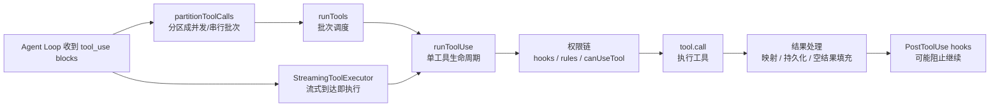
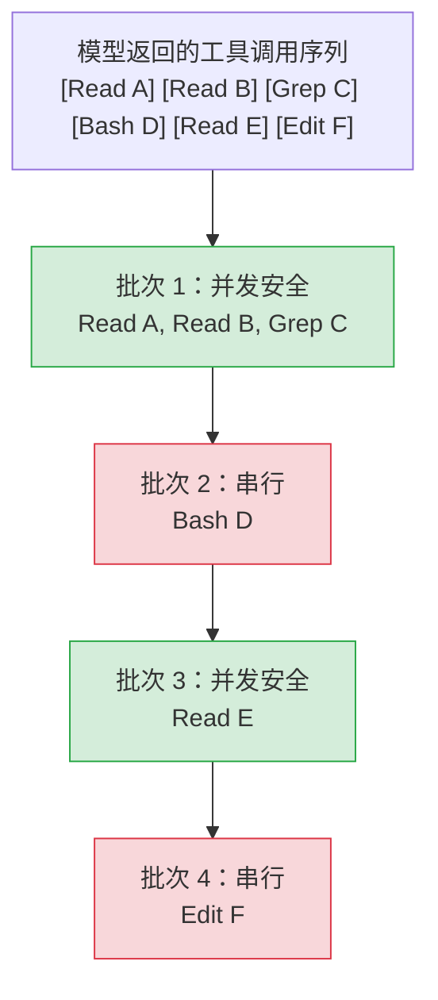
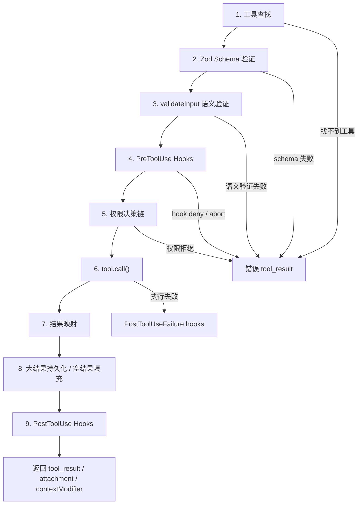
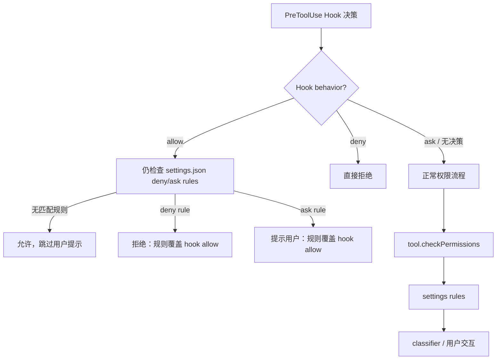

# Claude Code 工具执行编排：权限、并发、流式与中断

定位：本章分析 Claude Code 如何把模型返回的 `tool_use` 变成真实执行结果：工具调用如何分区调度，单工具执行经历哪些生命周期步骤，权限决策链如何层层过滤，大结果如何被持久化，流式执行器如何处理并发、进度与中断。

前置依赖：第 10 章《工具系统》、第 11 章《Agent Loop》。

适用场景：想理解 Claude Code 如何并发执行工具调用、做权限检查、流式输出工具进度、并管理大结果的读者。

---

## 12.1 本章在 Agent Loop 中的位置

第 11 章已经看到：当模型返回 `tool_use` block 时，`queryLoop()` 进入工具执行阶段。

这一步看似只是“执行工具”，实际要同时解决四个问题：

1. 哪些工具可以并发，哪些必须串行；
2. 每个工具执行前如何通过权限链；
3. 流式响应中 tool_use 还没全部到齐时，能不能先跑已经到达的工具；
4. 工具结果过大、为空、出错或被 hook 阻止时，如何保持消息结构和上下文稳定。

本章主线如下：



这一篇和第 10 章的区别是：第 10 章讲工具如何定义和进入工具池；本章讲工具如何在运行时被调度、执行、截断和中断。

---

## 12.2 为什么工具执行编排至关重要

一次 Agent 循环中，模型可能同时请求多个工具。例如：

```text
Read A
Read B
Grep C
Bash D
Edit E
```

这些工具不能无脑并行。

`Read/Grep` 是只读的，并行执行能节省时间；但 `Bash D` 可能修改文件、切换分支、启动进程；`Edit E` 会写文件。如果把它们全部并行，就可能出现读到旧状态、写入互相覆盖、测试基于半成品运行等问题。

Claude Code 的工具编排层解决三个核心矛盾：

| 矛盾 | 解决方式 |
| --- | --- |
| 并行能提速，但写操作会破坏一致性 | 基于 `isConcurrencySafe(input)` 做分区调度 |
| 模型能调用工具，但危险操作要由用户控制 | PreToolUse hooks + permission rules + `canUseTool` |
| 工具结果提供真实信息，但可能撑爆上下文 | 单工具阈值 + 单消息聚合预算 + 持久化预览 |

对应核心文件：

| 文件 | 职责 |
| --- | --- |
| `src/services/tools/toolOrchestration.ts` | 批次分区与 runTools 调度 |
| `src/services/tools/toolExecution.ts` | 单工具执行生命周期 |
| `src/services/tools/toolHooks.ts` | Pre/Post hooks 与权限决策 |
| `src/services/tools/StreamingToolExecutor.ts` | 流式并发执行器 |
| `src/utils/toolResultStorage.ts` | 大结果持久化、空结果填充、聚合预算 |

---

## 12.3 `partitionToolCalls`：先把工具调用分成可执行批次

工具执行的第一步是分区：把模型返回的工具调用序列拆成交替的并发安全批次和串行批次。



### 12.3.1 分区算法

原稿源码参考：`restored-src/src/services/tools/toolOrchestration.ts:91-116`。

```ts
function partitionToolCalls(
  toolUseMessages: ToolUseBlock[],
  toolUseContext: ToolUseContext,
): Batch[] {
  return toolUseMessages.reduce((acc: Batch[], toolUse) => {
    const tool = findToolByName(toolUseContext.options.tools, toolUse.name)
    const parsedInput = tool?.inputSchema.safeParse(toolUse.input)
    const isConcurrencySafe = parsedInput?.success
      ? (() => {
          try {
            return Boolean(tool?.isConcurrencySafe(parsedInput.data))
          } catch {
            return false  // 保守策略：解析失败视为不安全
          }
        })()
      : false
    if (isConcurrencySafe && acc[acc.length - 1]?.isConcurrencySafe) {
      acc[acc.length - 1]!.blocks.push(toolUse)  // 合并到上一个并发批次
    } else {
      acc.push({ isConcurrencySafe, blocks: [toolUse] })  // 新建批次
    }
    return acc
  }, [])
}
```

当前源码对应实现：

```ts
// services/tools/toolOrchestration.ts:91-116
function partitionToolCalls(
  toolUseMessages: ToolUseBlock[],
  toolUseContext: ToolUseContext,
): Batch[] {
  return toolUseMessages.reduce((acc: Batch[], toolUse) => {
    const tool = findToolByName(toolUseContext.options.tools, toolUse.name)
    const parsedInput = tool?.inputSchema.safeParse(toolUse.input)
    const isConcurrencySafe = parsedInput?.success
      ? (() => {
          try {
            return Boolean(tool?.isConcurrencySafe(parsedInput.data))
          } catch {
            // If isConcurrencySafe throws (e.g., due to shell-quote parse failure),
            // treat as not concurrency-safe to be conservative
            return false
          }
        })()
      : false
    if (isConcurrencySafe && acc[acc.length - 1]?.isConcurrencySafe) {
      acc[acc.length - 1]!.blocks.push(toolUse)
    } else {
      acc.push({ isConcurrencySafe, blocks: [toolUse] })
    }
    return acc
  }, [])
}
```

### 12.3.2 三个关键决策

| 决策 | 作用 |
| --- | --- |
| 先 `safeParse` 再调用 `isConcurrencySafe` | 模型输入无效时，不做乐观并发判断 |
| `isConcurrencySafe` 抛错则 false | 失败即关闭，安全性未知时串行 |
| 连续并发安全工具贪心合并 | 保持相对顺序，同时最大化并发 |

这不是全局最优调度算法，但它足够简单、可解释、稳定。Agent 系统中，调度算法的可审计性比极限吞吐更重要。

### 12.3.3 `isConcurrencySafe` 是输入感知的

`isConcurrencySafe` 是 Tool 接口上的方法，默认 false。不同工具的策略不同：

| 工具 | 并发安全性 | 原因 |
| --- | --- | --- |
| FileRead / Glob / Grep | 始终 true | 纯读取，无副作用 |
| BashTool | 取决于命令 | `ls` 可以并发，`git checkout` 不行 |
| FileEdit / FileWrite | false | 修改文件系统 |
| AgentTool | false | 启动子 Agent，可能修改状态 |

BashTool 的原稿源码参考：`restored-src/src/tools/BashTool/BashTool.tsx:434-436`。

```ts
isConcurrencySafe(input) {
  return this.isReadOnly?.(input) ?? false;
},
```

也就是说，Bash 并发安全不是工具级属性，而是命令级属性。

---

## 12.4 `runTools`：批次调度引擎

`runTools()` 是批量工具执行入口。它遍历 `partitionToolCalls()` 输出的批次：

- 并发安全批次走 `runToolsConcurrently()`；
- 非并发安全批次走 `runToolsSerially()`。

原稿源码参考：`restored-src/src/services/tools/toolOrchestration.ts:19-82`。

```ts
// services/tools/toolOrchestration.ts:19-82
export async function* runTools(
  toolUseMessages: ToolUseBlock[],
  assistantMessages: AssistantMessage[],
  canUseTool: CanUseToolFn,
  toolUseContext: ToolUseContext,
): AsyncGenerator<MessageUpdate, void> {
  let currentContext = toolUseContext
  for (const { isConcurrencySafe, blocks } of partitionToolCalls(
    toolUseMessages,
    currentContext,
  )) {
    if (isConcurrencySafe) {
      const queuedContextModifiers: Record<
        string,
        ((context: ToolUseContext) => ToolUseContext)[]
      > = {}
      // Run read-only batch concurrently
      for await (const update of runToolsConcurrently(
        blocks,
        assistantMessages,
        canUseTool,
        currentContext,
      )) {
```

### 12.4.1 并发路径：结果并发，Context 修改延迟

并发批次通过 `all()` 合并多个 async generator，默认并发上限 10：

```ts
// services/tools/toolOrchestration.ts:8-11
function getMaxToolUseConcurrency(): number {
  return (
    parseInt(process.env.CLAUDE_CODE_MAX_TOOL_USE_CONCURRENCY || '', 10) || 10
  )
}
```

原稿简化代码：

```ts
async function* runToolsConcurrently(...) {
  yield* all(
    toolUseMessages.map(async function* (toolUse) {
      yield* runToolUse(toolUse, ...)
      markToolUseAsComplete(toolUseContext, toolUse.id)
    }),
    getMaxToolUseConcurrency(),  // 默认 10，可通过环境变量覆盖
  )
}
```

当前源码：

```ts
// services/tools/toolOrchestration.ts:152-176
async function* runToolsConcurrently(
  toolUseMessages: ToolUseBlock[],
  assistantMessages: AssistantMessage[],
  canUseTool: CanUseToolFn,
  toolUseContext: ToolUseContext,
): AsyncGenerator<MessageUpdateLazy, void> {
  yield* all(
    toolUseMessages.map(async function* (toolUse) {
      toolUseContext.setInProgressToolUseIDs(prev =>
        new Set(prev).add(toolUse.id),
      )
      yield* runToolUse(
        toolUse,
        assistantMessages.find(_ =>
          Array.isArray(_.message.content) && _.message.content.some(
            _ => _.type === 'tool_use' && _.id === toolUse.id,
          ),
        )!,
        canUseTool,
        toolUseContext,
      )
      markToolUseAsComplete(toolUseContext, toolUse.id)
    }),
    getMaxToolUseConcurrency(),
  )
}
```

并发批次中的 context modifier 不会立即应用。`runTools()` 先按 toolUseID 收集，批次结束后按原始 block 顺序应用：

```ts
// services/tools/toolOrchestration.ts:31-63
const queuedContextModifiers: Record<
  string,
  ((context: ToolUseContext) => ToolUseContext)[]
> = {}
// ...
if (update.contextModifier) {
  const { toolUseID, modifyContext } = update.contextModifier
  if (!queuedContextModifiers[toolUseID]) {
    queuedContextModifiers[toolUseID] = []
  }
  queuedContextModifiers[toolUseID].push(modifyContext)
}
// ...
for (const block of blocks) {
  const modifiers = queuedContextModifiers[block.id]
  if (!modifiers) {
    continue
  }
  for (const modifier of modifiers) {
    currentContext = modifier(currentContext)
  }
}
yield { newContext: currentContext }
```

这是避免竞态的关键：并发执行可以交错产出消息，但对上下文的结构性修改必须按工具顺序提交。

### 12.4.2 串行路径：每个工具后立即应用 Context

串行路径按顺序执行，每个工具产出的 context modifier 立即生效：

```ts
// services/tools/toolOrchestration.ts:118-149
async function* runToolsSerially(
  toolUseMessages: ToolUseBlock[],
  assistantMessages: AssistantMessage[],
  canUseTool: CanUseToolFn,
  toolUseContext: ToolUseContext,
): AsyncGenerator<MessageUpdate, void> {
  let currentContext = toolUseContext

  for (const toolUse of toolUseMessages) {
    toolUseContext.setInProgressToolUseIDs(prev =>
      new Set(prev).add(toolUse.id),
    )
    for await (const update of runToolUse(
      toolUse,
      assistantMessages.find(_ =>
        Array.isArray(_.message.content) && _.message.content.some(
          _ => _.type === 'tool_use' && _.id === toolUse.id,
        ),
      )!,
      canUseTool,
      currentContext,
    )) {
      if (update.contextModifier) {
        currentContext = update.contextModifier.modifyContext(currentContext)
      }
      yield {
        message: update.message,
        newContext: currentContext,
      }
    }
    markToolUseAsComplete(toolUseContext, toolUse.id)
  }
}
```

这保证写操作能看到前一个写操作更新后的上下文。

---

## 12.5 单工具执行生命周期

无论走并发还是串行，最终都会进入 `runToolUse()` 和 `checkPermissionsAndCallTool()`。



### 12.5.1 工具查找

原稿源码参考：`restored-src/src/services/tools/toolExecution.ts:337`。

```ts
// services/tools/toolExecution.ts:337-356
export async function* runToolUse(
  toolUse: ToolUseBlock,
  assistantMessage: AssistantMessage,
  canUseTool: CanUseToolFn,
  toolUseContext: ToolUseContext,
): AsyncGenerator<MessageUpdateLazy, void> {
  const toolName = toolUse.name
  // First try to find in the available tools (what the model sees)
  let tool = findToolByName(toolUseContext.options.tools, toolName)

  // If not found, check if it's a deprecated tool being called by alias
  // (e.g., old transcripts calling "KillShell" which is now an alias for "TaskStop")
  // Only fall back for tools where the name matches an alias, not the primary name
  if (!tool) {
    const fallbackTool = findToolByName(getAllBaseTools(), toolName)
    // Only use fallback if the tool was found via alias (deprecated name)
    if (fallbackTool && fallbackTool.aliases?.includes(toolName)) {
      tool = fallbackTool
    }
  }
```

先查当前可用工具池，再查 deprecated alias。这保证旧会话里的工具名仍可能被兼容。

### 12.5.2 Schema 验证与语义验证

原稿源码参考：`restored-src/src/services/tools/toolExecution.ts:599`。

```ts
// services/tools/toolExecution.ts:599-680
async function checkPermissionsAndCallTool(
  tool: Tool,
  toolUseID: string,
  input: { [key: string]: boolean | string | number },
  toolUseContext: ToolUseContext,
  canUseTool: CanUseToolFn,
  assistantMessage: AssistantMessage,
  messageId: string,
  requestId: string | undefined,
  mcpServerType: McpServerType,
  mcpServerBaseUrl: ReturnType<typeof getLoggingSafeMcpBaseUrl>,
  onToolProgress: (
    progress: ToolProgress<ToolProgressData> | ProgressMessage<HookProgress>,
  ) => void,
): Promise<MessageUpdateLazy[]> {
  // Validate input types with zod (surprisingly, the model is not great at generating valid input)
  const parsedInput = tool.inputSchema.safeParse(input)
  if (!parsedInput.success) {
```

Zod 验证失败会返回 error tool_result。之后还有工具特定语义验证：

```ts
// services/tools/toolExecution.ts:682-687
// Validate input values. Each tool has its own validation logic
const isValidCall = await tool.validateInput?.(
  parsedInput.data,
  toolUseContext,
)
if (isValidCall?.result === false) {
```

这两层验证分工清楚：

| 验证 | 检查什么 |
| --- | --- |
| Zod schema | 类型、字段、结构 |
| `validateInput()` | 文件是否存在、路径是否合法、业务约束 |

延迟工具 schema 未发送时，Zod 错误还会附加提示，引导模型先用 ToolSearch 加载 schema。

### 12.5.3 PreToolUse Hooks

PreToolUse hooks 在权限决策前运行，可以修改输入、给出权限建议、阻止继续或补充上下文。

原稿源码参考：`restored-src/src/services/tools/toolExecution.ts:800-862`。

```ts
// services/tools/toolExecution.ts:800
for await (const result of runPreToolUseHooks(
```

hook 可以设置 `preventContinuation`：

```ts
// services/tools/toolHooks.ts:500-508
if (result.preventContinuation) {
  yield {
    type: 'preventContinuation',
    shouldPreventContinuation: true,
  }
  if (result.stopReason) {
    yield { type: 'stopReason', stopReason: result.stopReason }
  }
}
```

注意：`preventContinuation` 不等于“不执行工具”。如果 hook 没有 deny，工具仍可能执行；只是执行完后不再进入下一轮模型推理。

---

## 12.6 权限决策链：Hook 不能覆盖用户 deny

权限系统由 `resolveHookPermissionDecision()` 协调。原稿源码参考：`restored-src/src/services/tools/toolHooks.ts:332-433`。

源码注释直接写出不变量：

```ts
// services/tools/toolHooks.ts:322-330
 * Resolve a PreToolUse hook's permission result into a final PermissionDecision.
 *
 * Encapsulates the invariant that hook 'allow' does NOT bypass settings.json
 * deny/ask rules — checkRuleBasedPermissions still applies (inc-4788 analog).
 * Also handles the requiresUserInteraction/requireCanUseTool guards and the
 * 'ask' forceDecision passthrough.
 *
 * Shared by toolExecution.ts (main query loop) and REPLTool/toolWrappers.ts
 * (REPL inner calls) so the permission semantics stay in lockstep.
```

### 12.6.1 权限链路



### 12.6.2 Hook allow 仍要过规则

```ts
// services/tools/toolHooks.ts:347-405
if (hookPermissionResult?.behavior === 'allow') {
  const hookInput = hookPermissionResult.updatedInput ?? input

  // Hook provided updatedInput for an interactive tool — the hook IS the
  // user interaction (e.g. headless wrapper that collected AskUserQuestion
  // answers). Treat as non-interactive for the rule-check path.
  const interactionSatisfied =
    requiresInteraction && hookPermissionResult.updatedInput !== undefined

  if ((requiresInteraction && !interactionSatisfied) || requireCanUseTool) {
    logForDebugging(
      `Hook approved tool use for ${tool.name}, but canUseTool is required`,
    )
    return {
      decision: await canUseTool(
        tool,
        hookInput,
        toolUseContext,
        assistantMessage,
        toolUseID,
      ),
      input: hookInput,
    }
  }

  // Hook allow skips the interactive prompt, but deny/ask rules still apply.
  const ruleCheck = await checkRuleBasedPermissions(
    tool,
    hookInput,
    toolUseContext,
  )
```

当规则命中 deny：

```ts
// services/tools/toolHooks.ts:386-390
if (ruleCheck.behavior === 'deny') {
  logForDebugging(
    `Hook approved tool use for ${tool.name}, but deny rule overrides: ${ruleCheck.message}`,
  )
  return { decision: ruleCheck, input: hookInput }
}
```

这个设计体现纵深防御：自动化 hook 可以减少用户打扰，但不能突破用户配置的安全边界。

---

## 12.7 `StreamingToolExecutor`：流式到达即执行

批量模式要等所有 `tool_use` 到齐后再分区执行；流式模式不同。`StreamingToolExecutor` 在工具调用块刚从 API 流里解析出来时，就可以把它加入队列并尝试启动。

### 12.7.1 状态模型

每个工具有四种状态：

```text
queued -> executing -> completed -> yielded
```

| 状态 | 含义 |
| --- | --- |
| `queued` | 已注册但未开始 |
| `executing` | 正在执行 |
| `completed` | 已完成，结果缓冲 |
| `yielded` | 结果已交给消费者 |

`addTool()` 会解析输入并计算并发安全性：

```ts
// services/tools/StreamingToolExecutor.ts:104-123
const parsedInput = toolDefinition.inputSchema.safeParse(block.input)
const isConcurrencySafe = parsedInput?.success
  ? (() => {
      try {
        return Boolean(toolDefinition.isConcurrencySafe(parsedInput.data))
      } catch {
        return false
      }
    })()
  : false
this.tools.push({
  id: block.id,
  block,
  assistantMessage,
  status: 'queued',
  isConcurrencySafe,
  pendingProgress: [],
})

void this.processQueue()
```

### 12.7.2 并发控制

原稿源码参考：`restored-src/src/services/tools/StreamingToolExecutor.ts:129-135`。

```ts
private canExecuteTool(isConcurrencySafe: boolean): boolean {
  const executingTools = this.tools.filter(t => t.status === 'executing')
  return (
    executingTools.length === 0 ||
    (isConcurrencySafe && executingTools.every(t => t.isConcurrencySafe))
  )
}
```

规则很简单：

| 当前执行状态 | 新工具是否能启动 |
| --- | --- |
| 没有工具执行 | 可以 |
| 有工具执行，且新工具与所有执行中工具都并发安全 | 可以 |
| 有任何非并发安全工具执行 | 不可以 |
| 新工具非并发安全且已有工具执行 | 不可以 |

`processQueue()` 会从队列头开始尝试启动：

```ts
// services/tools/StreamingToolExecutor.ts:140-150
private async processQueue(): Promise<void> {
  for (const tool of this.tools) {
    if (tool.status !== 'queued') continue

    if (this.canExecuteTool(tool.isConcurrencySafe)) {
      await this.executeTool(tool)
    } else {
      // Can't execute this tool yet, and since we need to maintain order for non-concurrent tools, stop here
      if (!tool.isConcurrencySafe) break
    }
  }
}
```

### 12.7.3 Bash 错误级联中断

原稿源码参考：`restored-src/src/services/tools/StreamingToolExecutor.ts:357-363`。

```ts
if (tool.block.name === BASH_TOOL_NAME) {
  this.hasErrored = true
  this.erroredToolDescription = this.getToolDescription(tool)
  this.siblingAbortController.abort('sibling_error')
}
```

当前源码上下文：

```ts
// services/tools/StreamingToolExecutor.ts:354-363
if (isErrorResult) {
  thisToolErrored = true
  // Only Bash errors cancel siblings. Bash commands often have implicit
  // dependency chains (e.g. mkdir fails → subsequent commands pointless).
  // Read/WebFetch/etc are independent — one failure shouldn't nuke the rest.
  if (tool.block.name === BASH_TOOL_NAME) {
    this.hasErrored = true
    this.erroredToolDescription = this.getToolDescription(tool)
    this.siblingAbortController.abort('sibling_error')
  }
}
```

这是选择性级联：Bash 兄弟命令可能有隐式依赖，所以一个 Bash 失败会取消同级 Bash；但 Read/WebFetch/Grep 这类独立工具不受影响。

关键是 `siblingAbortController` 是子控制器：

```ts
// services/tools/StreamingToolExecutor.ts:45-48
// Child of toolUseContext.abortController. Fires when a Bash tool errors
// so sibling subprocesses die immediately instead of running to completion.
// Aborting this does NOT abort the parent — query.ts won't end the turn.
private siblingAbortController: AbortController
```

它杀兄弟工具，不杀整个 Agent Loop。

### 12.7.4 用户中断与 interrupt behavior

每个工具可以声明中断行为：`cancel` 或 `block`。没有声明时默认 `block`：

```ts
// services/tools/StreamingToolExecutor.ts:233-240
private getToolInterruptBehavior(tool: TrackedTool): 'cancel' | 'block' {
  const definition = findToolByName(this.toolDefinitions, tool.block.name)
  if (!definition?.interruptBehavior) return 'block'
  try {
    return definition.interruptBehavior()
  } catch {
    return 'block'
  }
}
```

当前是否可中断会同步给 UI：

```ts
// services/tools/StreamingToolExecutor.ts:254-259
private updateInterruptibleState(): void {
  const executing = this.tools.filter(t => t.status === 'executing')
  this.toolUseContext.setHasInterruptibleToolInProgress?.(
    executing.length > 0 &&
      executing.every(t => this.getToolInterruptBehavior(t) === 'cancel'),
  )
}
```

### 12.7.5 进度消息即时传递

结果要保持顺序，但进度可以立即 yield：

```ts
// services/tools/StreamingToolExecutor.ts:417-438
for (const tool of this.tools) {
  // Always yield pending progress messages immediately, regardless of tool status
  while (tool.pendingProgress.length > 0) {
    const progressMessage = tool.pendingProgress.shift()!
    yield { message: progressMessage, newContext: this.toolUseContext }
  }

  if (tool.status === 'yielded') {
    continue
  }

  if (tool.status === 'completed' && tool.results) {
    tool.status = 'yielded'

    for (const message of tool.results) {
      yield { message, newContext: this.toolUseContext }
    }

    markToolUseAsComplete(this.toolUseContext, tool.id)
  } else if (tool.status === 'executing' && !tool.isConcurrencySafe) {
    break
  }
}
```

等待机制用 `Promise.race` 避免轮询：

```ts
// services/tools/StreamingToolExecutor.ts:465-483
// If we still have executing tools but nothing completed, wait for any to complete
// OR for progress to become available
if (
  this.hasExecutingTools() &&
  !this.hasCompletedResults() &&
  !this.hasPendingProgress()
) {
  const executingPromises = this.tools
    .filter(t => t.status === 'executing' && t.promise)
    .map(t => t.promise!)

  // Also wait for progress to become available
  const progressPromise = new Promise<void>(resolve => {
    this.progressAvailableResolve = resolve
  })

  if (executingPromises.length > 0) {
    await Promise.race([...executingPromises, progressPromise])
  }
}
```

---

## 12.8 工具结果管理：预算、持久化与空结果填充

工具结果是上下文窗口最大的风险来源之一。Claude Code 使用三道防线：

1. 单工具持久化阈值；
2. 单消息聚合预算；
3. 空结果占位。

### 12.8.1 单工具持久化阈值

原稿源码参考：`restored-src/src/utils/toolResultStorage.ts:55-78`。

```ts
// utils/toolResultStorage.ts:55-78
export function getPersistenceThreshold(
  toolName: string,
  declaredMaxResultSizeChars: number,
): number {
  // Infinity = hard opt-out. Read self-bounds via maxTokens; persisting its
  // output to a file the model reads back with Read is circular. Checked
  // before the GB override so tengu_satin_quoll can't force it back on.
  if (!Number.isFinite(declaredMaxResultSizeChars)) {
    return declaredMaxResultSizeChars
  }
  const overrides = getFeatureValue_CACHED_MAY_BE_STALE<Record<
    string,
    number
  > | null>(PERSIST_THRESHOLD_OVERRIDE_FLAG, {})
  const override = overrides?.[toolName]
  if (
    typeof override === 'number' &&
    Number.isFinite(override) &&
    override > 0
  ) {
    return override
  }
  return Math.min(declaredMaxResultSizeChars, DEFAULT_MAX_RESULT_SIZE_CHARS)
}
```

优先级：

| 优先级 | 来源 |
| --- | --- |
| 1 | `Infinity` hard opt-out，例如 Read |
| 2 | GrowthBook 覆盖 `tengu_satin_quoll` |
| 3 | 工具声明 `maxResultSizeChars` |
| 4 | 全局上限 `DEFAULT_MAX_RESULT_SIZE_CHARS = 50_000` |

全局上限定义：

```ts
// constants/toolLimits.ts:13
export const DEFAULT_MAX_RESULT_SIZE_CHARS = 50_000
```

### 12.8.2 持久化到磁盘

原稿源码参考：`restored-src/src/utils/toolResultStorage.ts:137`。

```ts
// utils/toolResultStorage.ts:137-175
export async function persistToolResult(
  content: NonNullable<ToolResultBlockParam['content']>,
  toolUseId: string,
): Promise<PersistedToolResult | PersistToolResultError> {
  const isJson = Array.isArray(content)

  // Check for non-text content - we can only persist text blocks
  if (isJson) {
    const hasNonTextContent = content.some(block => block.type !== 'text')
    if (hasNonTextContent) {
      return {
        error: 'Cannot persist tool results containing non-text content',
      }
    }
  }

  await ensureToolResultsDir()
  const filepath = getToolResultPath(toolUseId, isJson)
  const contentStr = isJson ? jsonStringify(content, null, 2) : content

  // tool_use_id is unique per invocation and content is deterministic for a
  // given id, so skip if the file already exists. This prevents re-writing
  // the same content on every API turn when microcompact replays the
  // original messages. Use 'wx' instead of a stat-then-write race.
```

预览尽量在换行处截断：

```ts
// utils/toolResultStorage.ts:339-356
export function generatePreview(
  content: string,
  maxBytes: number,
): { preview: string; hasMore: boolean } {
  if (content.length <= maxBytes) {
    return { preview: content, hasMore: false }
  }

  // Find the last newline within the limit to avoid cutting mid-line
  const truncated = content.slice(0, maxBytes)
  const lastNewline = truncated.lastIndexOf('\n')

  // If we found a newline reasonably close to the limit, use it
  // Otherwise fall back to the exact limit
  const cutPoint = lastNewline > maxBytes * 0.5 ? lastNewline : maxBytes

  return { preview: content.slice(0, cutPoint), hasMore: true }
}
```

模型最终看到的是类似：

```xml
<persisted-output>
Output too large (245.0 KB). Full output saved to: /path/to/tool-results/abc123.txt

Preview (first 2.0 KB):
[前 2000 字节的内容...]
...
</persisted-output>
```

### 12.8.3 单消息聚合预算

聚合预算防止并行工具集体撑爆上下文。原稿源码参考：`restored-src/src/constants/toolLimits.ts:49`。

```ts
// constants/toolLimits.ts:35-49
/**
 * Default maximum aggregate size in characters for tool_result blocks within
 * a SINGLE user message (one turn's batch of parallel tool results). When a
 * message's blocks together exceed this, the largest blocks in that message
 * are persisted to disk and replaced with previews until under budget.
 * Messages are evaluated independently — a 150K result in one turn and a
 * 150K result in the next are both untouched.
 *
 * This prevents N parallel tools from each hitting the per-tool max and
 * collectively producing e.g. 10 × 40K = 400K in one turn's user message.
 *
 * Overridable at runtime via GrowthBook flag tengu_hawthorn_window — see
 * getPerMessageBudgetLimit() in toolResultStorage.ts.
 */
export const MAX_TOOL_RESULTS_PER_MESSAGE_CHARS = 200_000
```

预算可由 GrowthBook 覆盖：

```ts
// utils/toolResultStorage.ts:416-433
 * (tengu_hawthorn_window) wins when present and a finite positive number;
 * otherwise falls back to the hardcoded constant. Defensive typeof/finite
 * check: GrowthBook's cache returns `cached !== undefined ? cached : default`,
 * so a flag served as null/string/NaN leaks through.
 */
export function getPerMessageBudgetLimit(): number {
  const override = getFeatureValue_CACHED_MAY_BE_STALE<number | null>(
    'tengu_hawthorn_window',
    null,
  )
```

### 12.8.4 `ContentReplacementState`：为缓存稳定而记住替换决策

原稿源码参考：`restored-src/src/utils/toolResultStorage.ts:390-393`。

```ts
// utils/toolResultStorage.ts:367-393
// --- Message-level aggregate tool result budget ---
//
// Tracks replacement state across turns so enforceToolResultBudget makes the
// same choices every time (preserves prompt cache prefix).

/**
 * Per-conversation-thread state for the aggregate tool result budget.
 * State must be stable to preserve prompt cache:
 *   - seenIds: results that have passed through the budget check (replaced
 *     or not). Once seen, a result's fate is frozen for the conversation.
 *   - replacements: subset of seenIds that were persisted to disk and
 *     replaced with previews, mapped to the exact preview string shown to
 *     the model. Re-application is a Map lookup — no file I/O, guaranteed
 *     byte-identical, cannot fail.
 *
 * Lifecycle: one instance per conversation thread, carried on ToolUseContext.
 * Main thread: REPL provisions once, never resets — stale entries after
 * /clear, rewind, resume, or compact are never looked up (tool_use_ids are
 * UUIDs) so they're harmless. Subagents: createSubagentContext clones the
 * parent's state by default (cache-sharing forks like agentSummary need
 * identical decisions), or resumeAgentBackground threads one reconstructed
 * from sidechain records.
 */
export type ContentReplacementState = {
  seenIds: Set<string>
  replacements: Map<string, string>
}
```

这里的重点不是“省 token”，而是“保持同一条消息在后续 API 调用中字节一致”。一旦某个 tool_result 被替换，后续都用同一个替换文本，避免 prompt cache 抖动。

### 12.8.5 空结果填充

空 tool_result 会诱发某些模型误判回合边界。源码注释很直白：

```ts
// utils/toolResultStorage.ts:280-295
// inc-4586: Empty tool_result content at the prompt tail causes some models
// (notably capybara) to emit the \n\nHuman: stop sequence and end their turn
// with zero output. The server renderer inserts no \n\nAssistant: marker after
// tool results, so a bare </function_results>\n\n pattern-matches to a turn
// boundary. Several tools can legitimately produce empty output (silent-success
// shell commands, MCP servers returning content:[], REPL statements, etc.).
// Inject a short marker so the model always has something to react to.
if (isToolResultContentEmpty(content)) {
  logEvent('tengu_tool_empty_result', {
    toolName: sanitizeToolNameForAnalytics(toolName),
  })
  return {
    ...toolResultBlock,
    content: `(${toolName} completed with no output)`,
  }
}
```

这是典型的模型接口工程：不是所有“语义上空”的内容都适合真的传空。

---

## 12.9 Stop Hooks：工具执行后的中断点

PreToolUse 和 PostToolUse hooks 都可以阻止后续循环继续。

### 12.9.1 PreToolUse prevent continuation

PreToolUse hook 设置 `preventContinuation` 后，工具仍可能执行；执行后会追加 `hook_stopped_continuation` 附件：

```ts
// services/tools/toolExecution.ts:1571-1582
// If hook indicated to prevent continuation after successful execution, yield a stop reason message
if (shouldPreventContinuation) {
  resultingMessages.push({
    message: createAttachmentMessage({
      type: 'hook_stopped_continuation',
      message: stopReason || 'Execution stopped by hook',
      hookName: `PreToolUse:${tool.name}`,
      toolUseID: toolUseID,
      hookEvent: 'PreToolUse',
    }),
  })
}
```

Agent Loop 在工具阶段检测到这类附件后返回 `hook_stopped`。

### 12.9.2 PostToolUse prevent continuation

PostToolUse hook 是更自然的中断点：工具执行完，hook 根据结果判断是否继续。

```ts
// services/tools/toolHooks.ts:118-129
if (result.preventContinuation) {
  yield {
    message: createAttachmentMessage({
      type: 'hook_stopped_continuation',
      message:
        result.stopReason || 'Execution stopped by PostToolUse hook',
      hookName: `PostToolUse:${tool.name}`,
      toolUseID: toolUseID,
      hookEvent: 'PostToolUse',
    }),
  }
  return
}
```

### 12.9.3 MCP 输出可被 PostToolUse hooks 修改

PostToolUse hooks 可以更新 MCP 工具输出：

```ts
// services/tools/toolHooks.ts:145-151
// If hooks provided updatedMCPToolOutput, yield it if this is an MCP tool
if (result.updatedMCPToolOutput && isMcpTool(tool)) {
  toolOutput = result.updatedMCPToolOutput as Output
  yield {
    updatedMCPToolOutput: toolOutput,
  }
}
```

执行层收到后，对 MCP 工具替换输出：

```ts
// services/tools/toolExecution.ts:1494-1497
if ('updatedMCPToolOutput' in hookResult) {
  if (isMcpTool(tool)) {
    toolOutput = hookResult.updatedMCPToolOutput
  }
}
```

这说明 hooks 不只是旁路日志系统，而是能影响工具结果和后续 loop 走向的控制面。

---

## 12.10 版本演化信号

### 12.10.1 v2.1.91：`staleReadFileStateHint`

以下分析基于 v2.1.91 bundle 信号对比。

v2.1.91 的 `sdk-tools.d.ts` 在工具结果元数据中新增 `staleReadFileStateHint` 字段。当工具执行导致已读取文件的 mtime 变化时，系统自动生成陈旧提示。这是工具执行编排层的一个新增输出通道，让模型能够感知自身操作对文件系统的副作用。

这和第 5 章的压缩后文件状态恢复是同一条状态追踪思路：模型不仅需要知道“读过什么”，还要知道“读过的东西是否已经被后续操作改变”。

### 12.10.2 v2.1.92：AdvisorTool

以下分析基于 v2.1.92 bundle 字符串信号推断，无完整源码佐证。

v2.1.92 的工具列表中出现了新名字：`AdvisorTool`。配合事件信号 `tengu_advisor_command`、`tengu_advisor_dialog_shown`、`tengu_advisor_tool_call`、`tengu_advisor_result`，以及 `advisor_model`、`advisor_redacted_result`、`advisor_tool_token_usage`，可以推断这是一个内嵌顾问 Agent。

它与传统工具不同：Read/Bash/Edit/Grep 都是执行类工具，直接读取环境或改变环境；AdvisorTool 更像“建议类工具”，可能在执行前提供额外判断。

`CLAUDE_CODE_DISABLE_ADVISOR_TOOL` 的存在说明它可被禁用。这符合 Claude Code 一贯的渐进式自主原则：新能力可以启用，但要保留退出开关。

### 12.10.3 v2.1.92：工具结果去重

`tengu_tool_result_dedup` 事件揭示了工具结果层的去重机制。它与 v2.1.91 的 `tengu_file_read_reread` 构成链条：

| 层级 | 信号 | 作用 |
| --- | --- | --- |
| 输入侧 | `tengu_file_read_reread` | 发现重复读取同一文件 |
| 输出侧 | `tengu_tool_result_dedup` | 相同工具结果不重复占上下文 |
| 全局侧 | compact / microcompact | 长会话中进一步清理 |

这强化了本章的核心主题：上下文卫生不是单点机制，而是工具执行链路每一层都要承担的责任。

---

## 12.11 模式提炼

| 模式 | 在源码中的体现 | 可复用经验 |
| --- | --- | --- |
| 贪心合并的流水线分区 | `partitionToolCalls()` 合并连续并发安全工具 | 在顺序一致性和并发效率之间取简单中间方案 |
| 失败即关闭 | schema 失败、`isConcurrencySafe` 抛错都视为不安全 | 安全性未知时不要乐观并发 |
| 输入感知并发 | BashTool 委托 `isReadOnly(input)` | 并发安全应由本次输入决定 |
| Context 修改延迟提交 | 并发批次收集 modifier，批次结束按顺序应用 | 防止并发工具竞态修改上下文 |
| 选择性错误级联 | Bash 错误取消 Bash 兄弟，不影响 Read/WebFetch | 错误传播要按语义边界控制 |
| 双层结果预算 | 单工具阈值 + 单消息聚合预算 | 防止单点和并行工具集体撑爆上下文 |
| 缓存稳定的替换决策 | `ContentReplacementState` 冻结 replacement fate | 同一历史消息后续必须字节一致 |
| 空结果占位 | `(toolName completed with no output)` | 语义空不等于传输空 |
| Hooks 作为控制面 | Pre/Post hooks 可改输入、改 MCP 输出、阻止继续 | hooks 不只是日志，而是生命周期扩展点 |

---

## 12.12 用户能做什么

如果你在设计自己的 Agent 工具执行层，可以直接借鉴以下做法：

1. 实现基于输入的并发分区。
   不要按工具名粗暴判断。`Bash(ls)` 和 `Bash(rm)` 是完全不同的风险。

2. 并发安全默认 false。
   输入解析失败、判断函数报错、工具未声明安全属性，都应回到串行执行。

3. 把并发工具的 context 修改延迟到批次结束。
   并发执行可以交错产出消息，但共享上下文修改必须按确定顺序提交。

4. 对 shell 错误做选择性级联。
   同批 Bash 命令常有隐式依赖，一个失败可以取消兄弟 Bash；但不要杀掉独立只读工具，更不要中止整个 Agent Loop。

5. 做两层结果预算。
   单工具结果过大要持久化；单消息聚合过大也要从最大结果开始替换。

6. 记住替换决策。
   一旦某个 tool_result 被替换，后续请求必须使用同一替换内容，保护 prompt cache。

7. 空结果也要给占位文本。
   模型接口里，空结果可能被误读为边界。显式写出“completed with no output”更安全。

8. 权限链要纵深防御。
   Hook 的 allow 不能覆盖用户 deny；自动化授权永远不能突破用户规则。

9. 把 hooks 设计成生命周期扩展点。
   Pre hook 适合改输入和权限建议，Post hook 适合基于结果决定是否继续。

---

## 12.13 小结

工具执行编排层是在三股力量之间找平衡：

| 力量 | 目标 | 风险 |
| --- | --- | --- |
| 并发 | 更快完成多个读取/搜索 | 写操作竞态、不一致 |
| 权限 | 让危险操作受控 | 用户被频繁打扰或规则被绕过 |
| 上下文管理 | 给模型足够真实结果 | 工具输出撑爆窗口、破坏缓存 |

Claude Code 的答案是一条分层管线：

```text
tool_use blocks
  -> partitionToolCalls
  -> runTools / StreamingToolExecutor
  -> runToolUse
  -> PreToolUse hooks
  -> permission decision
  -> tool.call
  -> result mapping / persistence
  -> PostToolUse hooks
  -> tool_result / attachment
```

本章和第 11 章的关系是：第 11 章给出了 Agent Loop 的全局地图，本章放大了其中“工具执行阶段”的内部机械结构。

一句话总结：

```text
Claude Code 不是简单执行模型给出的工具调用，而是在每一次工具调用周围包上并发安全、权限决策、结果预算、hook 扩展和中断语义。
```
