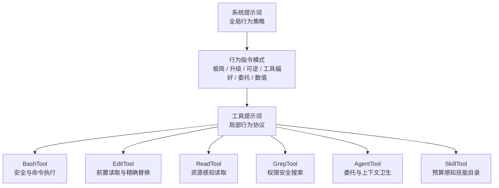
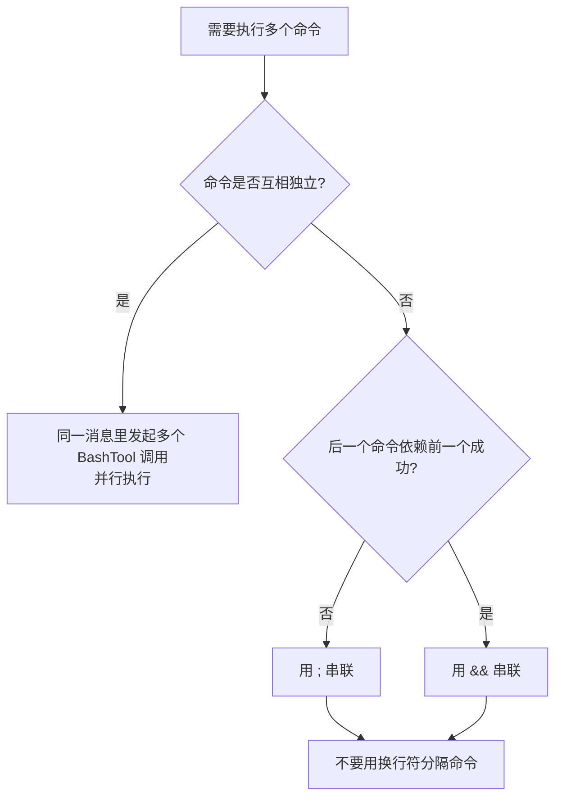
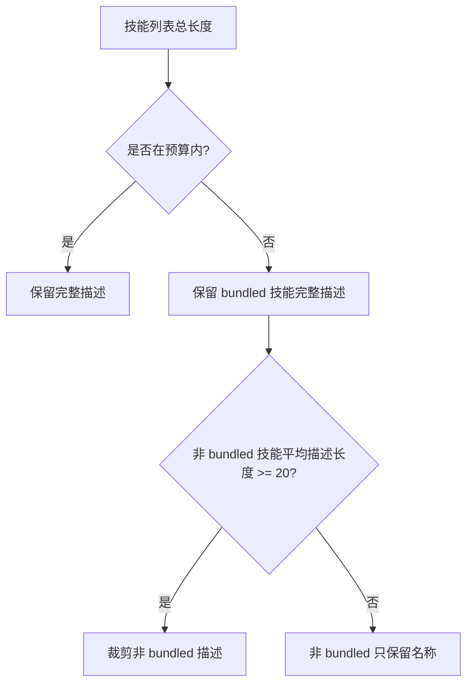
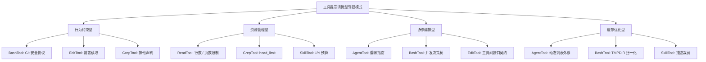

# Claude Code 工具提示词：作为微型驾驭器的 description 设计

## 3.1 前言：工具提示词为什么是“局部行为控制层”

第一篇讲的是系统提示词的宏观架构：段落注册、缓存边界、多来源合成。第二篇讲的是系统提示词中的行为指令：极简主义、渐进式升级、可逆性意识、工具偏好、Agent 委托和数值锚定。

这一篇继续往下走一层：工具提示词。

在 Anthropic API 中，工具的 `description` 字段表面上只是告诉模型“这个工具做什么”。但 Claude Code 并没有把它当作普通功能说明，而是把每个工具的 description 写成一个微型驾驭器。

它不只描述能力，还会约束模型：

- 什么时候该用这个工具；
- 什么时候不该用这个工具；
- 使用前需要满足什么前置条件；
- 输出太大时怎么控制；
- 风险操作前如何确认；
- 工具之间的输入输出接口如何衔接；
- 动态能力和运行时状态如何对齐。

这和第二篇的行为模式是一体两面：

```text
系统提示词：全局行为层
  -> 规定模型整体应该像什么样的工程师

工具提示词：局部行为层
  -> 规定模型在使用某个工具时应该怎样行动
```

可以把它理解成 Claude Code 的双层驾驭架构：



本章会分析六个核心工具：

| 工具 | 局部风险 | 主要驾驭手法 | 对应第二篇模式 |
| --- | --- | --- | --- |
| `BashTool` | 万能工具滥用、危险命令、轮询、沙箱绕过 | 流量导向、安全协议、并发决策树、策略透明化 | 工具偏好、可逆性、渐进式升级 |
| `FileEditTool` | 未读先改、替换不唯一、行号前缀误用 | 前置条件、精确接口契约、最小唯一上下文 | 极简主义、数值锚定 |
| `FileReadTool` | 一次读取过大、能力声明失真 | 默认限制、分段读取、多媒体能力声明 | 数值锚定、资源约束 |
| `GrepTool` | 绕过权限搜索、结果集过大、语法误用 | 排他性声明、安全默认值、语法提醒 | 工具偏好、数值锚定 |
| `AgentTool` | 委托模糊、上下文污染、结果抢跑、缓存失效 | fork 纪律、prompt 写作指南、动态内容外移 | Agent 委托、数值锚定 |
| `SkillTool` | 技能列表膨胀、重复加载、先答后调技能 | 预算截断、阻塞调用协议、重复加载防护 | 数值锚定、工具偏好 |

## 3.2 工具提示词的本质：不是说明书，而是行为契约

工具 description 常见写法是：

```text
这个工具可以做 X，参数是 A/B/C。
```

Claude Code 的工具提示词更像：

```text
这个工具可以做 X。
优先在这些场景使用。
不要在这些场景使用。
如果要做 Y，请改用另一个工具。
如果失败，先诊断这个原因。
如果输出很大，使用这个限制参数。
如果涉及风险，先确认或走安全流程。
```

因此它承担五类职责：

1. **功能说明**：工具能做什么。
2. **使用边界**：什么时候该用，什么时候不该用。
3. **安全约束**：哪些操作危险，如何确认或降级。
4. **接口协议**：如何处理上游工具的输出格式。
5. **资源管理**：如何控制 token、上下文和缓存成本。

这也是“微型驾驭器”的含义：每个工具提示词都在局部范围内重新塑造模型行为。

## 3.3 BashTool：最复杂的微型驾驭器

`BashTool` 是 Claude Code 中提示词最长、约束最密集的工具。原因很简单：Bash 是一个万能工具。

万能工具的问题在于，它既强大，又容易绕过其他工具的结构化输入、权限校验和用户可审查性。所以 BashTool 的 description 必须承担最多的行为控制。

源码位置：

- `src/tools/BashTool/prompt.ts`

### 3.3.1 BashTool 的局部风险

BashTool 主要面对五类风险：

| 风险 | 具体表现 | 对应约束 |
| --- | --- | --- |
| 过度使用万能工具 | 用 `cat`、`grep`、`sed`、`find` 代替专用工具 | 工具偏好矩阵 |
| 危险 Git 操作 | `reset --hard`、force push、跳过 hook | Git Safety Protocol |
| 命令组织不当 | 该并行的串行，该串行的混在一起 | 多命令并发指南 |
| 盲目 sleep / 轮询 | `sleep && retry`、等待后台任务时反复 poll | sleep 反模式抑制 |
| 沙箱策略不透明 | 模型不知道哪些路径 / 网络可用 | JSON 内联安全策略 |

这几类风险分别对应第二篇的三种行为模式：工具偏好引导、可逆性意识、渐进式升级。

### 3.3.2 工具偏好矩阵：把流量导向专用工具

BashTool 的 description 开头就拦截模型默认倾向：

```text
避免用 Bash 跑 find、grep、cat、head、tail、sed、awk、echo。
除非用户明确要求，或已经确认专用工具无法完成任务。
```

随后给出工具映射表：

| 操作 | 应该用 | 不该用 |
| --- | --- | --- |
| 文件搜索 | `Glob` | `find` / `ls` |
| 内容搜索 | `Grep` | `grep` / `rg` |
| 读文件 | `Read` | `cat` / `head` / `tail` |
| 编辑文件 | `Edit` | `sed` / `awk` |
| 写文件 | `Write` | `echo >` / heredoc |
| 沟通 | 直接输出文本 | `echo` / `printf` |

这就是第二篇“工具偏好引导”模式在工具 description 中的局部实现。

关键点不是“Bash 不能做这些事”，而是“专用工具更适合做这些事”。源码也给出理由：专用工具更容易让用户理解、审查工具调用，并配合权限控制。

还有一个重要细节：当 `hasEmbeddedSearchTools()` 为真时，`find` 和 `grep` 不再被导向 Glob / Grep。因为内部构建可能已经把搜索能力嵌入 shell 环境，此时继续提示“不要用 find/grep”会造成工具环境和提示词矛盾。

可复用经验：

> 对万能工具，不要只描述它能做什么。必须在最前面写清楚哪些任务应该交给更专用的工具。

### 3.3.3 命令执行指南：把 shell 经验编码成决策树

BashTool 不只告诉模型“能执行命令”，还规定命令应该怎样组织：

- 创建目录或文件前，先 `ls` 验证父目录；
- 带空格的路径必须双引号；
- 尽量使用绝对路径，少用 `cd`；
- 默认超时 2 分钟，可设置更长但有上限；
- 长任务可以用 `run_in_background`；
- 独立命令应并行调用多个 BashTool；
- 有依赖的命令用 `&&`；
- 允许前一个失败但仍要继续时才用 `;`；
- 不要用换行符分隔命令。

这是一棵小型决策树：



这体现了工具提示词的一个特点：它可以把隐性的工程经验压缩成模型可执行的分支规则。

### 3.3.4 Git 安全协议：可逆性意识的深度实现

BashTool 中的 Git Safety Protocol 是第二篇“可逆性意识”的工具级实现。

它用 `NEVER` 和 `CRITICAL` 标出高风险行为：

| 禁令 | 防止的问题 |
| --- | --- |
| 不更新 git config | 避免污染用户持久配置 |
| 不运行 destructive git commands，除非用户明确要求 | 避免丢失本地工作 |
| 不跳过 hooks 或签名，除非用户明确要求 | 避免绕过项目质量门禁 |
| 不 force push 到 main / master | 避免破坏共享主分支 |
| hook 失败后创建新 commit，不要 amend | 避免误改前一个 commit |
| staging 时优先添加具体文件 | 避免误提交 secrets 或大文件 |
| 没有用户明确要求时不 commit | 避免过度主动 |

最值得注意的是 amend 规则。源码解释了因果链：

```text
pre-commit hook 失败时，commit 实际没有发生。
这时 --amend 修改的是上一个 commit，而不是“重试当前 commit”。
```

这不是单纯禁令，而是带原因的禁令。模型理解原因后，更容易在类似场景里泛化规则。

### 3.3.5 沙箱配置内联：让模型在生成阶段自检

当 sandbox 启用时，BashTool 会把文件系统和网络限制以结构化形式写入提示词：

```text
Filesystem: {...}
Network: {...}
Ignored violations: {...}
```

这是一种“策略透明化”设计：运行时可以拒绝违规命令，但更好的做法是让模型在生成命令前就知道哪些路径、网络和 Unix socket 可用。

源码还做了两个缓存优化：

- 对路径数组 `dedup`，避免 SandboxManager 合并多层配置后重复消耗 token；
- 把用户特定临时目录归一化成 `$TMPDIR`，避免跨用户 prompt cache 被不同路径打碎。

这说明工具提示词不只要管行为，还要管自身的 token 成本和缓存稳定性。

### 3.3.6 sleep 反模式抑制：失败后先诊断

BashTool 专门有一组指令压制 `sleep` 滥用：

- 能立即运行的命令之间不要 sleep；
- 长任务用 `run_in_background`；
- 失败命令不要用 sleep loop 重试，要诊断根因；
- 等后台任务完成时不要 poll，等待通知；
- 必须 sleep 时保持短时长。

这就是第二篇“渐进式升级”模式的工具级落点：不要用等待和重试掩盖问题，先诊断。

## 3.4 FileEditTool：把“编辑前先读”变成硬约束

`FileEditTool` 的提示词比 BashTool 短很多，但它承担一个非常关键的任务：防止模型基于幻觉编辑文件。

源码位置：

- `src/tools/FileEditTool/prompt.ts`

### 3.4.1 局部风险：未读先改与替换不精确

FileEditTool 主要面对三类风险：

| 风险 | 表现 | 提示词机制 |
| --- | --- | --- |
| 未读先改 | 模型猜测文件内容并编辑 | 前置读取强制 |
| 替换目标不唯一 | `old_string` 匹配多处或匹配不到 | 唯一性要求 |
| Read/Edit 接口错位 | 把行号前缀也放进 `old_string` | 行号前缀声明 |

### 3.4.2 前置读取强制：提示词层 + 运行时层双保险

EditTool 第一条规则就是：

```text
编辑前必须至少使用一次 Read 工具。
如果没有读取就编辑，这个工具会报错。
```

这不是建议，而是工具运行时会检查的前置条件。

这是一种非常重要的设计：

```text
提示词层：提前告诉模型规则，减少浪费调用
运行时层：真正强制检查，防止错误编辑
```

可复用经验：

> 当工具 B 的正确性依赖工具 A 的先行调用时，不要只靠提示词提醒。提示词负责引导，运行时负责兜底。

### 3.4.3 最小唯一 `old_string`：极简主义与数值锚定

EditTool 要求 `old_string` 必须在文件中唯一。否则编辑会失败。模型可以通过两种方式解决：

- 扩大 `old_string` 的上下文，让它唯一；
- 使用 `replace_all` 替换所有实例。

对内部用户，还有一个更细的提示：

```text
通常 2-4 adjacent lines 就足够唯一。
避免包含 10+ lines 的上下文。
```

这同时体现了第二篇的两个模式：

- **极简主义指令**：不要为了“稳妥”塞入过多上下文；
- **数值锚定**：用 2-4 行和 10+ 行给模型明确边界。

这背后是 token 经济学。`old_string` 太长会显著增加工具调用成本，也更容易因为无关上下文变化导致匹配失败。

### 3.4.4 行号前缀声明：工具间接口契约

ReadTool 输出会带行号前缀。EditTool 提示词明确告诉模型：

```text
行号前缀之后才是真正的文件内容。
不要把行号前缀放进 old_string 或 new_string。
```

这是一种“工具间接口声明”。

ReadTool 的输出格式并不等于文件内容本身。EditTool 需要模型完成一个格式转换：看懂 Read 输出，但只把真实内容用于替换。这个接口契约如果不写清楚，模型很容易把行号、箭头或 tab 也复制进 `old_string`。

## 3.5 FileReadTool：资源感知的读取策略

`FileReadTool` 看似只是读取文件，但它的 description 重点在控制资源：不要一次性把上下文塞满，也不要声明运行时不支持的能力。

源码位置：

- `src/tools/FileReadTool/prompt.ts`

### 3.5.1 局部风险：读太多、读错形态、能力承诺失真

| 风险 | 表现 | 提示词机制 |
| --- | --- | --- |
| 读取过大 | 大文件一次性注入太多内容 | 默认 2000 行限制 |
| 读取策略不匹配 | 明知目标位置仍读完整文件 | offset / limit 引导 |
| 多媒体能力不清晰 | 图片、PDF、notebook 处理不明确 | 能力声明 |
| 运行时能力失真 | 提示词承诺不支持的 PDF 能力 | 条件注入 |

### 3.5.2 2000 行默认限制：安全默认值

ReadTool 默认从文件开头读取最多 2000 行。

这个数字不是随意的。它大到足够覆盖多数单文件理解场景，又小到不会轻易吃掉整个上下文窗口。

这对应第二篇的“数值锚定”：用明确数字限制默认行为，而不是模糊地说“不要读太多”。

### 3.5.3 offset / limit：两种读取语气

ReadTool 定义了两种 offset / limit 引导：

| 模式 | 提示语气 | 适用场景 |
| --- | --- | --- |
| 默认读取 | 建议不传 offset / limit，读取完整文件 | 首次理解文件 |
| 定向读取 | 已知道目标位置时，只读那一部分 | 大文件或精准定位 |

这不是简单参数说明，而是在不同任务阶段引导不同读取策略：

```text
先理解全局；
再精准读取局部。
```

### 3.5.4 多媒体能力声明：能力与运行时对齐

ReadTool 明确声明可以读取图片、Jupyter notebook，并在支持 PDF 时声明 PDF 能力。

PDF 规则尤其有意思：

```text
超过 10 页的大 PDF 必须提供 pages 参数。
每次最多 20 页。
```

这是渐进式资源限制：小文件直接读，大文件必须分页。

PDF 能力还由 `isPDFSupported()` 条件控制。如果运行时不支持 PDF，提示词中就不声明 PDF 支持。这样可以避免模型尝试调用一个运行时无法兑现的能力。

可复用经验：

> 工具提示词中的能力声明必须和运行时能力对齐。不要让提示词承诺运行时做不到的事。

## 3.6 GrepTool：用排他性声明保护权限和上下文

`GrepTool` 的提示词很短，但每一行都在保护一个边界：搜索必须走带权限检查和结果限制的专用工具，而不是 Bash 里的 `grep` / `rg`。

源码位置：

- `src/tools/GrepTool/prompt.ts`
- `src/tools/GrepTool/GrepTool.ts`

### 3.6.1 局部风险：绕过权限、语法误用、结果爆炸

| 风险 | 表现 | 提示词 / 实现机制 |
| --- | --- | --- |
| 绕过权限 | 用 Bash 直接跑 `rg` | `ALWAYS use Grep` / `NEVER invoke grep or rg` |
| 搜索语法误用 | 把 grep 语法误认为 ripgrep 语法 | ripgrep 语法提醒 |
| 跨行搜索失败 | 默认只匹配单行 | `multiline: true` 场景说明 |
| 结果过大 | 搜索输出填满上下文 | `head_limit` 默认 250，0 为无限制 |

### 3.6.2 排他性声明：和 BashTool 形成双向闭环

GrepTool 第一条使用规则是：

```text
搜索任务总是使用 Grep。
不要通过 Bash 调用 grep 或 rg。
```

BashTool 说“内容搜索不要用 Bash grep，去用 Grep”。GrepTool 说“搜索任务必须用我”。这构成双向闭环。

它背后的原因不是工具洁癖，而是安全边界：GrepTool 包裹了读权限检查、ignore pattern、版本控制目录排除和输出限制。Bash 直接调用 `rg` 会绕过这些层。

这对应第二篇的“工具偏好引导”：不仅在通用工具里导流，也在专用工具里声明排他性。

### 3.6.3 语法提示：只暴露模型需要知道的差异

GrepTool 提醒模型：

- 支持完整 regex；
- 使用的是 ripgrep 语法，不是 grep；
- literal braces 需要转义；
- 默认只做单行匹配，跨行匹配要设置 `multiline: true`。

注意这里没有把底层参数 `-U --multiline-dotall` 暴露给模型，而是用“什么时候设置 multiline”来解释。

这是一条工具提示词原则：

> 给模型任务语义，不给它不必要的底层实现细节。

### 3.6.4 `head_limit`：安全默认值 + 逃生舱口

GrepTool 的 `head_limit` 默认是 250。传 0 表示无限制，但提示词提醒要谨慎使用，因为大结果集会浪费上下文。

这是一种非常通用的设计：

```text
默认值保守，保护上下文；
逃生舱口显式，保留灵活性；
提示词说明适用场景，减少滥用。
```

## 3.7 AgentTool：把委托变成可控协议

`AgentTool` 是工具提示词中最复杂的协作型工具。它不是执行一个动作，而是把任务交给另一个执行主体。因此它要解决的不只是“怎么用工具”，而是“怎么写好委托”。

源码位置：

- `src/tools/AgentTool/prompt.ts`
- `src/tools/AgentTool/forkSubagent.ts`

### 3.7.1 局部风险：委托不清、上下文污染、缓存失效

| 风险 | 表现 | 提示词机制 |
| --- | --- | --- |
| 委托不清 | 子 Agent 收到模糊任务 | prompt 写作指南 |
| 上下文污染 | 主 Agent 读取 fork 中间输出 | `Don't peek` |
| 抢跑猜测 | fork 未返回就编造结果 | `Don't race` |
| 递归派生 | fork 继承父提示词后继续 fork | 子 Agent 身份锚定 |
| 动态列表破坏缓存 | agent list 频繁变化导致工具 schema cache bust | 动态内容外移 |

这几乎完整复用了第二篇的“Agent 委托指引”模式。

### 3.7.2 agent 列表：从工具 description 外移到消息流

AgentTool 的 agent 列表可以有两种注入方式：

- 直接内联到工具 description；
- 移到 `<system-reminder>` / attachment 消息中。

源码注释说明，动态 agent list 曾占用工具 schema cache_creation tokens 的显著比例。MCP 异步连接、插件重载、权限变化都会改变 agent list，从而导致工具 description 变化，触发缓存重建。

把动态列表外移后，工具 description 可以保持静态：

```text
Available agent types are listed in <system-reminder> messages.
```

这和第一篇的系统提示词缓存边界是同一种思想：动态内容不要污染可缓存前缀。

可复用经验：

> 当工具 description 中某段内容频繁变化，并且会破坏工具 schema 缓存时，把它移到消息流或附件里。

### 3.7.3 fork 指引：继承上下文，但保持上下文卫生

当 fork subagent 启用时，AgentTool 会告诉模型：

```text
当中间工具输出不值得保留在主上下文中时，fork 自己。
判断标准是“我以后还需要这个输出吗”，不是任务大小。
```

然后给出三条纪律：

- `Don't peek`：不要读取 fork 的中间 output_file；
- `Don't race`：fork 返回前不要预测或编造结果；
- fork prompt 是 directive，只写要做什么，不要重讲背景。

这和第二篇完全呼应：Agent 委托的关键不是“多派生”，而是保持主上下文干净、结果可信。

### 3.7.4 prompt 写作指南：不要把理解委托出去

AgentTool 里最重要的一句是：

```text
Never delegate understanding.
```

它禁止模型写这种委托：

```text
based on your findings, fix the bug
```

因为这会把综合判断推给子 Agent。父 Agent 应该先理解问题，再把具体 scope、文件、行号、目标和排除项写进 prompt。

这是一种“委派质量保障”模式：

```text
父 Agent 负责理解；
子 Agent 负责执行或独立验证；
prompt 必须证明父 Agent 已经理解了上下文。
```

## 3.8 SkillTool：预算感知的动态目录

`SkillTool` 的独特之处在于：它不仅控制模型行为，还控制自己的提示词体积。

技能列表会随着插件、内置 skill、用户配置不断增长。如果不加限制，它会成为一个越来越大的工具 description，吞掉上下文和缓存预算。

源码位置：

- `src/tools/SkillTool/prompt.ts`

### 3.8.1 局部风险：列表膨胀与调用时机错误

| 风险 | 表现 | 提示词 / 实现机制 |
| --- | --- | --- |
| 技能列表过大 | turn-1 工具提示词占用过多 token | 1% 上下文预算 |
| 单个描述过长 | `whenToUse` 太冗长 | 每条 250 字符硬上限 |
| 总预算超限 | 技能生态增长 | 三级截断策略 |
| 先答后调技能 | 模型先输出分析，再调用 skill | `BLOCKING REQUIREMENT` |
| 重复加载 | 当前轮 skill 已加载还再次调用 | `<command-name>` 标签防护 |

### 3.8.2 1% 上下文预算：工具提示词也要有成本意识

SkillTool 给技能列表分配固定预算：

```text
context window 的 1%
默认 8000 字符
```

这体现了一个关键判断：技能列表只是目录，不是内容。模型只需要看到足够的信息来决定是否调用某个 skill，完整 skill 内容应该在调用后再加载。

这和第二篇的“数值锚定”同源：用明确数字控制模型能看到多少动态列表。

### 3.8.3 三级截断：完整描述 -> 裁剪描述 -> 仅名称

SkillTool 的列表生成有三级降级：



这套策略体现了优先级：

```text
内置技能完整性 > 第三方技能描述 > 第三方技能名称
```

它不是简单截断，而是有价值排序的降级。

### 3.8.4 调用协议：匹配技能后必须先调用

SkillTool 的核心行为约束是：

```text
当 skill 匹配用户请求时，这是 BLOCKING REQUIREMENT：
在生成任何关于任务的回复前，先调用相关 Skill tool。
```

这防止一种常见错误：模型先按自己的理解回答，之后才加载 skill。这样前半段回答可能和 skill 的真实指令冲突。

还有一条重复加载防护：如果当前轮已经出现 `<command-name>` 标签，说明 skill 已加载，应直接遵循指令，不要再次调用 SkillTool。

## 3.9 六个工具的模式映射

把六个工具放在一起看，会发现它们不是六套孤立提示词，而是在不同局部风险上复用第二篇的行为模式。

| 工具 | 主要风险 | 微型驾驭器设计 | 对应行为模式 |
| --- | --- | --- | --- |
| `BashTool` | 万能工具滥用、危险命令、sleep 轮询 | 工具映射、安全协议、并发决策树、沙箱内联 | 工具偏好、可逆性、渐进式升级 |
| `FileEditTool` | 未读先改、替换不唯一、行号误用 | 前置读取、唯一 `old_string`、接口契约 | 极简主义、数值锚定 |
| `FileReadTool` | 大文件占满上下文、能力失真 | 2000 行默认、offset/limit、PDF 条件声明 | 数值锚定、资源约束 |
| `GrepTool` | 绕过权限、搜索结果爆炸 | 排他声明、ripgrep 语法提示、head_limit | 工具偏好、数值锚定 |
| `AgentTool` | 委托质量差、上下文污染、动态列表破坏缓存 | prompt 写作指南、Don't peek/race、agent list 外移 | Agent 委托、缓存边界 |
| `SkillTool` | 动态目录膨胀、重复加载、先答后调技能 | 1% 预算、三级截断、阻塞调用协议 | 数值锚定、工具偏好 |

也可以按工具提示词承担的功能重新分类：



这个图说明：一个工具通常不只属于一个类别。BashTool 同时是行为约束型、协作编排型、缓存优化型；GrepTool 同时是行为约束型和资源管理型。

## 3.10 设计工具提示词的七条原则

从六个工具的设计中，可以提炼出七条通用原则。

### 3.10.1 原则一：为万能工具建立流量导向表

如果一个工具功能覆盖面很广，就要在 description 开头写清楚哪些场景应该改用专用工具。

推荐格式：

```text
Avoid using this tool for {任务列表}.
Instead:
- {任务 A}: Use {专用工具 A} (NOT {通用命令})
- {任务 B}: Use {专用工具 B} (NOT {通用命令})
```

### 3.10.2 原则二：双向闭环比单向提醒可靠

不要只在 BashTool 里说“搜索请用 Grep”。还要在 GrepTool 里说“搜索必须用 Grep，不要用 Bash grep”。

双向闭环结构是：

```text
通用工具：不要用我做 X，用专用工具 Y。
专用工具：做 X 总是用我，不要回到通用工具。
```

### 3.10.3 原则三：前置条件要提示词声明 + 运行时强制

EditTool 的“编辑前必须 Read”就是典型例子。

提示词负责让模型提前知道规则，运行时负责真正阻止违规调用。只有其中一层都不够稳。

### 3.10.4 原则四：能力声明必须和运行时对齐

ReadTool 的 PDF 支持由 `isPDFSupported()` 条件控制。

如果运行时做不到，就不要在提示词中承诺。否则模型会反复尝试一个不存在的能力，浪费上下文和工具调用。

### 3.10.5 原则五：安全默认值 + 显式逃生舱口

GrepTool 的 `head_limit=250` 和 `head_limit=0` 是好例子。

推荐结构：

```text
默认限制为 {N}，防止 {资源问题}。
如果确实需要，可以显式传 {escape hatch}，但要谨慎使用。
```

### 3.10.6 原则六：动态内容外移，保护工具 schema 缓存

AgentTool 的 agent list 会频繁变化，所以可以移到 message / attachment，而不是写死在工具 description 里。

这和系统提示词里的 `SYSTEM_PROMPT_DYNAMIC_BOUNDARY` 是同一种思想：

```text
稳定内容留在可缓存前缀；
动态内容移到后面或单独通道。
```

### 3.10.7 原则七：工具 description 本身也要预算管理

SkillTool 对技能列表设置 1% 上下文预算和三级截断，说明工具提示词不能无限增长。

当工具生态会动态扩张时，必须回答：

- 总描述预算是多少？
- 哪些条目优先保留完整描述？
- 超预算时如何降级？
- 是否需要只保留名称？

## 3.11 用户能做什么

如果你在设计自己的 Agent 工具提示词，可以直接应用以下实践。

1. **把每个工具当成一个局部行为协议来写**。

   不要只写“这个工具能做什么”。还要写什么时候用、什么时候不用、失败时怎么办、输出太大时怎么限制。

2. **先识别这个工具的局部风险**。

   Bash 的风险是万能滥用和危险命令；Edit 的风险是未读先改；Read 的风险是读太多；Agent 的风险是委托不清和上下文污染。

3. **把第二篇的行为模式映射到工具层**。

   工具偏好、可逆性、渐进式升级、Agent 委托和数值锚定都不只属于系统提示词，也可以嵌入具体工具 description。

4. **为高输出工具设置默认限制**。

   搜索、读取、列表、日志类工具都应该有默认上限，并提供显式解除方式。

5. **把工具间接口写清楚**。

   如果工具 B 消费工具 A 的输出，就在 B 的 description 里说明 A 的输出格式，以及哪些部分不能原样复制。

6. **让提示词能力和运行时能力同步**。

   动态能力要动态注入，不支持时不要声明。

7. **把动态列表和长目录预算化**。

   插件、技能、Agent、API endpoint 列表都可能增长。不要让它们无限塞进工具 description。

## 3.12 小结：工具提示词是全局行为模式的局部落地

工具提示词是 Claude Code 驾驭体系中最接地的一层。

系统提示词设定全局人格，行为指令规定全局工程习惯，而工具提示词把这些习惯落到每个具体动作上：

```text
BashTool 把“工具偏好 / 可逆性 / 渐进式升级”落到命令执行。
EditTool 把“极简主义 / 数值锚定 / 前置条件”落到文件修改。
ReadTool 把“资源意识 / 能力对齐”落到上下文读取。
GrepTool 把“工具偏好 / 安全默认值”落到搜索。
AgentTool 把“Agent 委托协议”落到多 Agent 协作。
SkillTool 把“数值锚定 / 预算意识”落到动态技能目录。
```

所以，优秀的工具提示词不是功能文档，而是行为契约。它告诉模型的不只是“这个工具能做什么”，更是“如何安全、节制、可审查地使用这个工具”。
