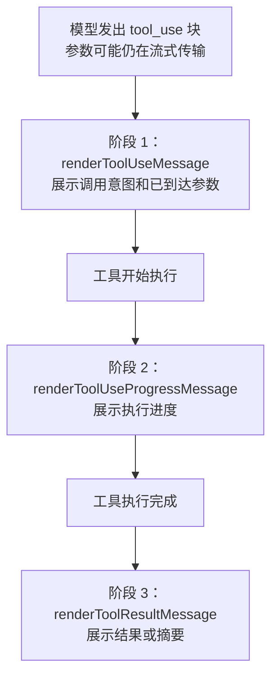

# Claude Code 工具系统：40+ 个工具作为模型的双手

定位：本章拆解 Claude Code 的工具系统。它管理 40+ 个内置工具和不限数量的 MCP 扩展工具，但这些工具不是一个平铺数组，而是一条完整管线：定义 -> 默认值补全 -> 注册 -> 过滤 -> MCP 融合 -> API Schema 生成 -> 调用 -> 结果预算 -> UI 渲染。

前置依赖：第 3 章《工具提示词作为微型驾驭器》、第 7 章《缓存架构与断点设计》。

适用场景：想理解 Claude Code 如何把“模型会调用工具”这件事工程化为一套可扩展、可权限控制、可缓存、可展示的系统。

---

## 10.1 主线：工具不是数组，而是管线

Claude Code 的工具系统要同时满足五个目标：

1. 让模型知道有哪些能力；
2. 让运行时能校验工具输入；
3. 让权限系统能在调用前和调用中介入；
4. 让上下文预算不会被工具结果打爆；
5. 让用户在终端里看见工具正在做什么。

所以工具系统不能只是：

```ts
const tools = [BashTool, GrepTool, FileReadTool]
```

它必须是一条管线：


这篇文档按这条链路展开。先看最底层的接口契约，再看工具如何进入池子，最后看工具调用后如何被预算控制和渲染出来。

---

## 10.2 Tool 接口契约：所有工具共享同一张身份证

所有工具，无论是内置的 `BashTool`、`GrepTool`，还是通过 MCP 协议加载的第三方工具，都要满足同一个 TypeScript 契约。源码参考：`src/Tool.ts:362-695`。

### 10.2.1 核心字段一览

| 字段 | 类型 / 形态 | 作用 | 设计含义 |
| --- | --- | --- | --- |
| `name` | `string` | 工具唯一名称 | API schema、权限匹配、MCP 去重都依赖它 |
| `aliases` | `string[]` | 兼容旧名称 | 工具重命名时不破坏历史调用 |
| `searchHint` | `string` | ToolSearch 关键词短语 | 延迟加载工具需要被搜索到 |
| `description(...)` / `prompt(...)` | `Promise<string>` | 发给模型的工具说明 | 可以根据权限和工具池动态生成 |
| `inputSchema` | Zod schema | 工具输入定义 | 同时用于运行时校验和 JSON Schema 生成 |
| `inputJSONSchema` | JSON Schema | MCP / StructuredOutput 直传 schema | 避免无法从 Zod 表达的外部 schema 丢失 |
| `call(...)` | async function | 真正执行工具 | 接收上下文、权限回调、进度回调 |
| `isConcurrencySafe(input)` | function | 是否可并发 | 输入感知，而不是工具级固定判断 |
| `isReadOnly(input)` | function | 是否只读 | 影响权限、并发和风险分类 |
| `isDestructive(input)` | optional function | 是否破坏性操作 | 用于更强确认和风险提示 |
| `maxResultSizeChars` | `number` | 单工具结果持久化阈值 | 防止单个工具撑爆上下文 |
| `shouldDefer` | boolean | 是否延迟加载 | 与 ToolSearch 机制配合 |
| `alwaysLoad` | boolean | 是否永远首轮加载完整 schema | 核心工具或关键 MCP 工具不能被延迟 |
| `renderToolUseMessage` | React renderer | 工具刚被调用时展示 | 支持 `Partial<Input>` 流式参数 |
| `renderToolUseProgressMessage` | optional renderer | 工具执行中展示 | 长任务可持续反馈 |
| `renderToolResultMessage` | optional renderer | 工具完成后展示 | 结果进入终端 UI |
| `renderGroupedToolUse` | optional renderer | 并行同类工具分组展示 | 非 verbose 模式压缩屏幕占用 |

带默认值的字段不要求每个工具手写，`buildTool()` 会补上保守默认值。这个点在 10.3 节展开。

### 10.2.2 三个关键设计选择

第一，`description` 是函数而不是静态字符串。

同一个工具在不同权限模式下可能需要不同说明。例如用户配置了 deny 规则，工具描述可以主动告诉模型“不要尝试这些操作”。这让工具提示词成为运行时策略的一部分，而不是一段固定文档。

第二，`inputSchema` 使用 Zod。

Zod 的价值不只是类型提示，而是运行时校验。模型生成的参数是外部输入，必须经过 schema 检查。后续发送给 API 的 `input_schema` 也可以从 Zod 转成 JSON Schema。

第三，`call` 接收 `canUseTool` 回调。

工具执行不是一次性门禁。`AgentTool` 这类工具在启动子 Agent 时，还要判断子 Agent 是否有权使用某些工具；`BashTool` 也可能在复合命令里有更细粒度风险。权限检查必须能贯穿执行过程。

源码中的 `call` 签名体现了这个设计：

```ts
// Tool.ts:379-385
call(
  args: z.infer<Input>,
  context: ToolUseContext,
  canUseTool: CanUseToolFn,
  parentMessage: AssistantMessage,
  onProgress?: ToolCallProgress<P>,
): Promise<ToolResult<Output>>
```

### 10.2.3 渲染契约：工具在 UI 中也有生命周期

Tool 接口里最容易被忽略的是渲染方法。它们不是“展示细节”，而是用户信任链路的一部分：

```text
renderToolUseMessage          // 工具被调用时展示
renderToolUseProgressMessage  // 工具执行中展示进度
renderToolResultMessage       // 工具执行完成后展示结果
```

`renderToolUseMessage` 的输入是 `Partial<Input>`：

```ts
// Tool.ts:601-608
/**
 * Render the tool use message. Note that `input` is partial because we render
 * the message as soon as possible, possibly before tool parameters have fully
 * streamed in.
 */
renderToolUseMessage(
  input: Partial<z.infer<Input>>,
  options: { theme: ThemeName; verbose: boolean; commands?: Command[] },
): React.ReactNode
```

原因很直接：API 会流式返回工具参数，JSON 还没完整到达时，UI 也要能先展示“模型正在调用哪个工具”。用户不应该等到参数全部解析完成才看到动静。

---

## 10.3 `buildTool()`：用失败关闭默认值补齐工具

每个具体工具不是直接导出一个裸对象，而是通过 `buildTool()` 构建。源码参考：`src/Tool.ts:783-792`。

### 10.3.1 工厂函数本身很简单

```ts
// Tool.ts:783-792
export function buildTool<D extends AnyToolDef>(def: D): BuiltTool<D> {
  // The runtime spread is straightforward; the `as` bridges the gap between
  // the structural-any constraint and the precise BuiltTool<D> return. The
  // type semantics are proven by the 0-error typecheck across all 60+ tools.
  return {
    ...TOOL_DEFAULTS,
    userFacingName: () => def.name,
    ...def,
  } as BuiltTool<D>
}
```

运行时只是对象展开：默认值在前，工具定义在后，工具自己写的字段覆盖默认值。

真正重要的是默认值的选择。

### 10.3.2 默认值遵循“失败关闭”

`TOOL_DEFAULTS` 的注释明确写出默认策略：

```ts
// Tool.ts:743-769
/**
 * Build a complete `Tool` from a partial definition, filling in safe defaults
 * for the commonly-stubbed methods. All tool exports should go through this so
 * that defaults live in one place and callers never need `?.() ?? default`.
 *
 * Defaults (fail-closed where it matters):
 * - `isEnabled` → `true`
 * - `isConcurrencySafe` → `false` (assume not safe)
 * - `isReadOnly` → `false` (assume writes)
 * - `isDestructive` → `false`
 * - `checkPermissions` → `{ behavior: 'allow', updatedInput }` (defer to general permission system)
 * - `toAutoClassifierInput` → `''` (skip classifier — security-relevant tools must override)
 * - `userFacingName` → `name`
 */
const TOOL_DEFAULTS = {
  isEnabled: () => true,
  isConcurrencySafe: (_input?: unknown) => false,
  isReadOnly: (_input?: unknown) => false,
  isDestructive: (_input?: unknown) => false,
  checkPermissions: (
    input: { [key: string]: unknown },
    _ctx?: ToolUseContext,
  ): Promise<PermissionResult> =>
    Promise.resolve({ behavior: 'allow', updatedInput: input }),
  toAutoClassifierInput: (_input?: unknown) => '',
  userFacingName: (_input?: unknown) => '',
}
```

这里最关键的是两个默认值：

| 默认值 | 含义 | 安全效果 |
| --- | --- | --- |
| `isConcurrencySafe: false` | 默认不能并发 | 新工具忘记声明时不会被并行调度 |
| `isReadOnly: false` | 默认不是只读 | 新工具忘记声明时按可能写入处理 |

这就是“失败关闭”：工具开发者忘了写安全属性时，系统不会乐观地把它当作安全工具。

### 10.3.3 GrepTool 主动声明安全属性

源码示例来自 `src/tools/GrepTool/GrepTool.ts:160-194`：

```ts
export const GrepTool = buildTool({
  name: GREP_TOOL_NAME,
  searchHint: 'search file contents with regex (ripgrep)',
  maxResultSizeChars: 20_000,
  strict: true,
  // ...
  isConcurrencySafe() { return true },   // 搜索是安全的并发操作
  isReadOnly() { return true },           // 搜索不修改文件
  // ...
})
```

当前源码中的主体也是同一设计：

```ts
// tools/GrepTool/GrepTool.ts:160-188
export const GrepTool = buildTool({
  name: GREP_TOOL_NAME,
  searchHint: 'search file contents with regex (ripgrep)',
  // 20K chars - tool result persistence threshold
  maxResultSizeChars: 20_000,
  strict: true,
  async description() {
    return getDescription()
  },
  userFacingName() {
    return 'Search'
  },
  getToolUseSummary,
  getActivityDescription(input) {
    const summary = getToolUseSummary(input)
    return summary ? `Searching for ${summary}` : 'Searching'
  },
  get inputSchema(): InputSchema {
    return inputSchema()
  },
  get outputSchema(): OutputSchema {
    return outputSchema()
  },
  isConcurrencySafe() {
    return true
  },
  isReadOnly() {
    return true
  },
```

搜索工具天然只读，明确覆盖默认值是合理的。

### 10.3.4 BashTool 是输入感知安全

源码示例来自 `src/tools/BashTool/BashTool.tsx:434-441`：

```ts
isConcurrencySafe(input) {
  return this.isReadOnly?.(input) ?? false;
},
isReadOnly(input) {
  const compoundCommandHasCd = commandHasAnyCd(input.command);
  const result = checkReadOnlyConstraints(input, compoundCommandHasCd);
  return result.behavior === 'allow';
},
```

这段代码说明：BashTool 不能被简单标记成“安全”或“不安全”。`git status`、`ls`、`grep` 这类命令可以并发；`git push`、`rm`、写文件命令不应该并发。

因此工具属性必须接收 `input`：

```text
工具安全属性 = f(工具类型, 本次输入)
```

这比“工具级别固定权限”精细得多，也是后续并发调度和权限系统的基础。

---

## 10.4 `tools.ts`：工具从定义进入工具池

`src/tools.ts` 是工具池的组装中心。它回答的问题是：在当前环境、当前权限、当前运行模式下，模型最终能看到哪些工具？

### 10.4.1 第一层：启动期条件加载

原稿中举了两个典型例子：

```ts
const SleepTool =
  feature('PROACTIVE') || feature('KAIROS')
    ? require('./tools/SleepTool/SleepTool.js').SleepTool
    : null

const cronTools = feature('AGENT_TRIGGERS')
  ? [
      require('./tools/ScheduleCronTool/CronCreateTool.js').CronCreateTool,
      require('./tools/ScheduleCronTool/CronDeleteTool.js').CronDeleteTool,
      require('./tools/ScheduleCronTool/CronListTool.js').CronListTool,
    ]
  : []
```

这类工具不是靠最终过滤隐藏，而是在 feature flag 未启用时根本不进入工具变量。

还有环境变量驱动的内部工具：

```ts
const REPLTool =
  process.env.USER_TYPE === 'ant'
    ? require('./tools/REPLTool/REPLTool.js').REPLTool
    : null
```

这一层解决的是“这个构建或这个环境是否应该存在该工具”。

### 10.4.2 第二层：`getAllBaseTools()` 组装基础工具池

原稿简化版：

```ts
export function getAllBaseTools(): Tools {
  return [
    AgentTool,
    TaskOutputTool,
    BashTool,
    ...(hasEmbeddedSearchTools() ? [] : [GlobTool, GrepTool]),
    FileReadTool,
    FileEditTool,
    FileWriteTool,
    // ... 省略 30+ 个工具
    ...(isToolSearchEnabledOptimistic() ? [ToolSearchTool] : []),
  ]
}
```

当前源码中的结构相同，只是工具集合更完整：

```ts
// tools.ts:193-250
export function getAllBaseTools(): Tools {
  return [
    AgentTool,
    TaskOutputTool,
    BashTool,
    // Ant-native builds have bfs/ugrep embedded in the bun binary (same ARGV0
    // trick as ripgrep). When available, find/grep in Claude's shell are aliased
    // to these fast tools, so the dedicated Glob/Grep tools are unnecessary.
    ...(hasEmbeddedSearchTools() ? [] : [GlobTool, GrepTool]),
    ExitPlanModeV2Tool,
    FileReadTool,
    FileEditTool,
    FileWriteTool,
    NotebookEditTool,
    WebFetchTool,
    TodoWriteTool,
    WebSearchTool,
    TaskStopTool,
    AskUserQuestionTool,
    SkillTool,
    EnterPlanModeTool,
    ...(process.env.USER_TYPE === 'ant' ? [ConfigTool] : []),
    ...(process.env.USER_TYPE === 'ant' ? [TungstenTool] : []),
```

这里的 `hasEmbeddedSearchTools()` 是一个缓存和工具体验相关的条件：在内置 `bfs/ugrep` 可用时，shell 中的 find/grep 已经被优化，独立 `GlobTool/GrepTool` 可以省略，减少工具数量和模型决策负担。

### 10.4.3 第三层：`getTools()` 运行时过滤

`getTools()` 做三类过滤。

第一类是简单模式：

```ts
// tools.ts:271-297
export const getTools = (permissionContext: ToolPermissionContext): Tools => {
  // Simple mode: only Bash, Read, and Edit tools
  if (isEnvTruthy(process.env.CLAUDE_CODE_SIMPLE)) {
    // --bare + REPL mode: REPL wraps Bash/Read/Edit/etc inside the VM, so
    // return REPL instead of the raw primitives. Matches the non-bare path
    // below which also hides REPL_ONLY_TOOLS when REPL is enabled.
    if (isReplModeEnabled() && REPLTool) {
      const replSimple: Tool[] = [REPLTool]
      if (
        feature('COORDINATOR_MODE') &&
        coordinatorModeModule?.isCoordinatorMode()
      ) {
        replSimple.push(TaskStopTool, getSendMessageTool())
      }
      return filterToolsByDenyRules(replSimple, permissionContext)
    }
    const simpleTools: Tool[] = [BashTool, FileReadTool, FileEditTool]
```

第二类是权限拒绝过滤：

```ts
// tools.ts:253-269
/**
 * Filters out tools that are blanket-denied by the permission context.
 * A tool is filtered out if there's a deny rule matching its name with no
 * ruleContent (i.e., a blanket deny for that tool).
 *
 * Uses the same matcher as the runtime permission check (step 1a), so MCP
 * server-prefix rules like `mcp__server` strip all tools from that server
 * before the model sees them — not just at call time.
 */
export function filterToolsByDenyRules<
  T extends {
    name: string
    mcpInfo?: { serverName: string; toolName: string }
  },
>(tools: readonly T[], permissionContext: ToolPermissionContext): T[] {
  return tools.filter(tool => !getDenyRuleForTool(permissionContext, tool))
}
```

第三类是模式和 `isEnabled()` 过滤：

```ts
// tools.ts:309-326
// Filter out tools that are denied by the deny rules
let allowedTools = filterToolsByDenyRules(tools, permissionContext)

// When REPL mode is enabled, hide primitive tools from direct use.
// They're still accessible inside REPL via the VM context.
if (isReplModeEnabled()) {
  const replEnabled = allowedTools.some(tool =>
    toolMatchesName(tool, REPL_TOOL_NAME),
  )
  if (replEnabled) {
    allowedTools = allowedTools.filter(
      tool => !REPL_ONLY_TOOLS.has(tool.name),
    )
  }
}

const isEnabled = allowedTools.map(_ => _.isEnabled())
return allowedTools.filter((_, i) => isEnabled[i])
```

这一层解决的是“这个用户、这个会话、这个模式下是否应该暴露该工具”。

---

## 10.5 MCP 融合：外部工具进入同一个池子

内置工具过滤完成后，还要把 MCP 工具合并进来。源码参考：`src/tools.ts:345-367`。

```ts
export function assembleToolPool(
  permissionContext: ToolPermissionContext,
  mcpTools: Tools,
): Tools {
  const builtInTools = getTools(permissionContext)
  const allowedMcpTools = filterToolsByDenyRules(mcpTools, permissionContext)
  const byName = (a: Tool, b: Tool) => a.name.localeCompare(b.name)
  return uniqBy(
    [...builtInTools].sort(byName).concat(allowedMcpTools.sort(byName)),
    'name',
  )
}
```

当前源码的注释把两个关键点说得更清楚：

```ts
// tools.ts:345-366
export function assembleToolPool(
  permissionContext: ToolPermissionContext,
  mcpTools: Tools,
): Tools {
  const builtInTools = getTools(permissionContext)

  // Filter out MCP tools that are in the deny list
  const allowedMcpTools = filterToolsByDenyRules(mcpTools, permissionContext)

  // Sort each partition for prompt-cache stability, keeping built-ins as a
  // contiguous prefix. The server's claude_code_system_cache_policy places a
  // global cache breakpoint after the last prefix-matched built-in tool; a flat
  // sort would interleave MCP tools into built-ins and invalidate all downstream
  // cache keys whenever an MCP tool sorts between existing built-ins. uniqBy
  // preserves insertion order, so built-ins win on name conflict.
  // Avoid Array.toSorted (Node 20+) — we support Node 18. builtInTools is
  // readonly so copy-then-sort; allowedMcpTools is a fresh .filter() result.
  const byName = (a: Tool, b: Tool) => a.name.localeCompare(b.name)
  return uniqBy(
    [...builtInTools].sort(byName).concat(allowedMcpTools.sort(byName)),
    'name',
  )
}
```

这里有三个设计点：

| 设计 | 作用 |
| --- | --- |
| MCP 工具也走 `filterToolsByDenyRules()` | 用户 deny 规则在外部工具上同样生效 |
| 内置工具和 MCP 工具分别排序 | 稳定缓存键，不让动态 MCP 插入内置前缀中间 |
| `uniqBy(..., 'name')` 保留内置工具优先 | 名称冲突时内置工具胜出 |

这和第 7 章的缓存架构直接相关：工具列表顺序不是 UI 偏好，而是缓存键的一部分。MCP 工具越动态，越不能让它打乱内置工具的连续前缀。

---

## 10.6 工具结果大小预算：防止模型的“双手”撑爆上下文

工具给模型提供真实世界信息，但信息越真实，越可能巨大。一次 `grep`、一次测试日志、一次网页抓取，都可能返回几万字符。Claude Code 用两级预算控制工具结果。

### 10.6.1 第一层：单工具结果上限

每个工具通过 `maxResultSizeChars` 声明自己的结果大小上限。Tool 接口注释说明了语义：

```ts
// Tool.ts:457-466
/**
 * Maximum size in characters for tool result before it gets persisted to disk.
 * When exceeded, the result is saved to a file and Claude receives a preview
 * with the file path instead of the full content.
 *
 * Set to Infinity for tools whose output must never be persisted (e.g. Read,
 * where persisting creates a circular Read→file→Read loop and the tool
 * already self-bounds via its own limits).
 */
maxResultSizeChars: number
```

常见工具的上限：

| 工具 | `maxResultSizeChars` | 设计含义 |
| --- | ---: | --- |
| BashTool | `30_000` | 测试、编译、shell 输出需要较多上下文 |
| GrepTool | `20_000` | 搜索结果过大通常说明查询太宽 |
| FileReadTool | `Infinity` | 避免 Read 结果被持久化后再 Read，形成循环 |
| FileEditTool | `100_000` | diff / 编辑结果通常可较大 |
| FileWriteTool | `100_000` | 写入结果保持较宽上限 |
| GlobTool | `100_000` | 文件列表可能较长 |
| WebFetchTool | `100_000` | 网页正文可能较长 |
| WebSearchTool | `100_000` | 搜索结果块较多 |
| AgentTool | `100_000` | 子 Agent 摘要和上下文可能较大 |
| SkillTool | `100_000` | 技能内容加载需要较宽预算 |

系统还有全局硬顶：

```ts
// constants/toolLimits.ts:5-13
/**
 * Default maximum size in characters for tool results before they get persisted
 * to disk. When exceeded, the result is saved to a file and the model receives
 * a preview with the file path instead of the full content.
 *
 * Individual tools may declare a lower maxResultSizeChars, but this constant
 * acts as a system-wide cap regardless of what tools declare.
 */
export const DEFAULT_MAX_RESULT_SIZE_CHARS = 50_000
```

因此单工具预算不是“工具想给多少就给多少”，而是工具阈值和系统阈值共同约束。

### 10.6.2 第二层：单消息聚合上限

并行工具调用会把多个 `tool_result` 放进同一条 user message。即使每个工具都没超单工具上限，多个结果合起来也可能过大。

所以系统还设置单消息聚合预算：

```ts
// constants/toolLimits.ts:35-49
/**
 * Default maximum aggregate size in characters for tool_result blocks within
 * a SINGLE user message (one turn's batch of parallel tool results). When a
 * message's blocks together exceed this, the largest blocks in that message
 * are persisted to disk and replaced with previews until under budget.
 * Messages are evaluated independently — a 150K result in one turn and a
 * 150K result in the next are both untouched.
 *
 * This prevents N parallel tools from each hitting the per-tool max and
 * collectively producing e.g. 10 × 40K = 400K in one turn's user message.
 *
 * Overridable at runtime via GrowthBook flag tengu_hawthorn_window — see
 * getPerMessageBudgetLimit() in toolResultStorage.ts.
 */
export const MAX_TOOL_RESULTS_PER_MESSAGE_CHARS = 200_000
```

两层预算的关系：

| 层级 | 防止什么问题 | 例子 |
| --- | --- | --- |
| 单工具上限 | 单个工具输出失控 | `grep` 返回 10 万行 |
| 单消息聚合上限 | 并行工具集体爆炸 | 10 个工具各返回 40K，总计 400K |

这就是工具系统里的上下文经济学：模型需要工具结果，但不能无限制地吃工具结果。

---

## 10.7 三阶段渲染：让用户看见工具生命周期

工具调用在终端 UI 中不是一次性输出，而是三阶段渐进过程。



### 10.7.1 阶段一：意图展示

`renderToolUseMessage` 在工具参数还没完整流完时就可以渲染，因此输入是 `Partial<Input>`。这一点在 10.2.3 已经看过。

它解决的是“用户不要等黑箱”的问题：模型刚决定调用 Bash、Read、Grep，用户就能看见。

### 10.7.2 阶段二：进度展示

`renderToolUseProgressMessage` 是可选方法：

```ts
// Tool.ts:623-634
/**
 * Optional. When omitted, no progress UI is shown while the tool runs.
 */
renderToolUseProgressMessage?(
  progressMessagesForMessage: ProgressMessage<P>[],
  options: {
    tools: Tools
    verbose: boolean
    terminalSize?: { columns: number; rows: number }
    inProgressToolCallCount?: number
    isTranscriptMode?: boolean
  },
): React.ReactNode
```

BashTool 的进度阈值是 2 秒：

```ts
// tools/BashTool/BashTool.tsx:54-57
// Progress display constants
const PROGRESS_THRESHOLD_MS = 2000; // Show progress after 2 seconds
// In assistant mode, blocking bash auto-backgrounds after this many ms in the main agent
const ASSISTANT_BLOCKING_BUDGET_MS = 15_000;
```

这类进度 UI 对长任务很重要。测试、构建、子 Agent 运行、WebFetch 都可能超过几秒；没有进度，用户只能猜 Agent 卡住了还是正在工作。

### 10.7.3 阶段三：结果展示

`renderToolResultMessage` 也是可选方法：

```ts
// Tool.ts:562-580
/**
 * Optional. When omitted, the tool result renders nothing (same as returning
 * null). Omit for tools whose results are surfaced elsewhere (e.g., TodoWrite
 * updates the todo panel, not the transcript).
 */
renderToolResultMessage?(
  content: Output,
  progressMessagesForMessage: ProgressMessage<P>[],
  options: {
    style?: 'condensed'
    theme: ThemeName
    tools: Tools
    verbose: boolean
    isTranscriptMode?: boolean
    isBriefOnly?: boolean
    /** Original tool_use input, when available. Useful for compact result
     * summaries that reference what was requested (e.g. "Sent to #foo"). */
    input?: unknown
  },
): React.ReactNode
```

有些工具结果不需要在对话流里展示，例如 TodoWriteTool 的结果可能由专用面板承载。接口允许工具选择“模型可见”和“用户 UI 可见”的不同呈现方式。

### 10.7.4 分组渲染：并行调用不刷屏

同一轮多个同类工具并行执行时，逐个渲染会很占屏幕。`renderGroupedToolUse` 允许非 verbose 模式下合并展示：

```ts
// Tool.ts:669-678
/**
 * Renders multiple parallel instances of this tool as a group.
 * @returns React node to render, or null to fall back to individual rendering
 */
/**
 * Renders multiple tool uses as a group (non-verbose mode only).
 * In verbose mode, individual tool uses render at their original positions.
 * @returns React node to render, or null to fall back to individual rendering
 */
renderGroupedToolUse?(
```

这里的 UI 策略和工具结果预算是同一类思想：默认紧凑，必要时展开。

---

## 10.8 具体工具体现出的设计差异

### 10.8.1 BashTool：无限语义空间，所以必须输入感知

BashTool 是最复杂的工具，因为 shell 命令几乎可以表达任意行为。它需要：

- 解析命令判断是否只读；
- 感知复合命令和管道；
- 只允许只读命令并发；
- 超过 2 秒展示进度；
- 跟踪 shell 命令导致的文件变化；
- 在 sandbox 中执行。

它的输出上限是：

```text
tools/BashTool/BashTool.tsx:424
maxResultSizeChars: 30_000
```

比 GrepTool 宽松，因为测试输出、编译错误、堆栈信息通常需要更多上下文。

### 10.8.2 GrepTool：只读并发的典型

GrepTool 的模型很简单：搜索不修改文件，因此它可以无条件声明：

```text
isConcurrencySafe() -> true
isReadOnly() -> true
```

这让调度器可以放心并行多个 grep。搜索结果上限设为 `20_000`，也在提示模型：如果搜索结果过大，应该收窄查询，而不是把整个世界塞进上下文。

### 10.8.3 FileReadTool：`Infinity` 是为了避免循环

FileReadTool 的 `maxResultSizeChars` 是 `Infinity`：

```text
tools/FileReadTool/FileReadTool.ts:342
maxResultSizeChars: Infinity
```

这不是“Read 可以无限输出”。Read 工具有自己的 `maxTokens`、文件大小、PDF 页数等限制。这里的 `Infinity` 是为了避免一种循环：

```text
Read 大文件 -> 结果被持久化成文件路径 -> 模型再 Read 这个持久化文件
```

所以 FileReadTool 的结果不走通用持久化机制，而由 Read 自己控制输出规模。

---

## 10.9 延迟加载与 ToolSearch：工具太多时不要一次性全给模型

当 MCP 工具大量接入后，把所有工具完整 schema 都发给模型，会带来三个问题：

1. 工具 schema token 成本上升；
2. 模型选择工具的负担上升；
3. 动态 MCP 工具更容易破坏缓存。

Claude Code 用 ToolSearch 和 `defer_loading` 做延迟加载。

### 10.9.1 工具如何声明可延迟

Tool 接口里有两个相关字段：

```ts
// Tool.ts:438-449
/**
 * When true, this tool is deferred (sent with defer_loading: true) and requires
 * ToolSearch to be used before it can be called.
 */
readonly shouldDefer?: boolean
/**
 * When true, this tool is never deferred — its full schema appears in the
 * initial prompt even when ToolSearch is enabled. For MCP tools, set via
 * `_meta['anthropic/alwaysLoad']`. Use for tools the model must see on
 * turn 1 without a ToolSearch round-trip.
 */
readonly alwaysLoad?: boolean
```

`searchHint` 则提供短能力描述，帮助 ToolSearch 做关键词匹配。

### 10.9.2 哪些工具会延迟

ToolSearch 的判定逻辑：

```ts
// tools/ToolSearchTool/prompt.ts:54-108
 * Check if a tool should be deferred (requires ToolSearch to load).
 * A tool is deferred if:
 * - It's an MCP tool (always deferred - workflow-specific)
 * - It has shouldDefer: true
 *
 * A tool is NEVER deferred if it has alwaysLoad: true (MCP tools set this via
 * _meta['anthropic/alwaysLoad']). This check runs first, before any other rule.
 */
export function isDeferredTool(tool: Tool): boolean {
  // Explicit opt-out via _meta['anthropic/alwaysLoad'] — tool appears in the
  // initial prompt with full schema. Checked first so MCP tools can opt out.
  if (tool.alwaysLoad === true) return false

  // MCP tools are always deferred (workflow-specific)
  if (tool.isMcp === true) return true

  // Never defer ToolSearch itself — the model needs it to load everything else
  if (tool.name === TOOL_SEARCH_TOOL_NAME) return false
```

### 10.9.3 API Schema 如何带上 `defer_loading`

API schema 生成时，`defer_loading` 是 per-request overlay，不写进会话级缓存 base：

```ts
// utils/api.ts:211-225
// Per-request overlay: defer_loading and cache_control vary by call
// (tool search defers different tools per turn; cache markers move).
// Explicit field copy avoids mutating the cached base and sidesteps
// BetaTool.cache_control's `| null` clashing with our narrower type.
const schema: BetaToolWithExtras = {
  name: base.name,
  description: base.description,
  input_schema: base.input_schema,
  ...(base.strict && { strict: true }),
  ...(base.eager_input_streaming && { eager_input_streaming: true }),
}

// Add defer_loading if requested (for tool search feature)
if (options.deferLoading) {
  schema.defer_loading = true
}
```

这和第 9 章的工具 Schema 缓存是一致的：稳定内容缓存成 base，每轮变化的字段作为 overlay 叠加，避免污染缓存本体。

---

## 10.10 设计模式提炼

| 模式 | 在 Claude Code 中的体现 | 可迁移经验 |
| --- | --- | --- |
| 失败关闭默认值 | `isConcurrencySafe=false`、`isReadOnly=false` | 新工具忘记声明时按危险处理 |
| 输入感知属性 | BashTool 根据命令判断只读与并发 | 安全属性应是 `f(input)`，不是工具级常量 |
| 分层过滤 | feature/env -> registry -> deny rules -> mode -> `isEnabled()` | 不同过滤层解决不同问题 |
| 内置优先融合 | `assembleToolPool()` 中内置工具排在 MCP 前 | 外部扩展不能覆盖核心能力 |
| 稳定排序 | 内置与 MCP 分区排序 | 工具顺序也是缓存键 |
| 分层预算 | 单工具上限 + 单消息聚合上限 | 防止单点和并行结果共同撑爆上下文 |
| 渐进渲染 | 意图 -> 进度 -> 结果 | 用户需要看见 Agent 的动作 |
| 延迟加载 | `shouldDefer` + ToolSearch | 工具太多时先给目录，再按需加载 schema |

这些模式共同服务同一句话：

```text
让工具能力可扩展，但让危险、噪声和成本默认受控。
```

---

## 10.11 用户能做什么

如果你在构建自己的 AI Agent 工具系统，可以直接复用以下做法。

1. 采用失败关闭默认值。
   `isReadOnly`、`isConcurrencySafe`、`isDestructive` 这类字段默认都应保守。让工具作者主动声明安全，而不是系统默认信任。

2. 让工具描述成为函数。
   权限模式、组织策略、当前工具池都会影响工具说明。静态字符串无法表达这些运行时差异。

3. 用 Zod 或等价 schema 做运行时校验。
   模型参数是外部输入，不要只靠 TypeScript 类型。

4. 给工具结果设置两层预算。
   单工具预算防单点爆炸，单消息预算防并行爆炸。

5. 工具排序要稳定。
   如果使用 prompt caching，工具顺序变化就是缓存键变化。内置工具保持连续前缀，动态扩展工具放后面。

6. 为大量工具设计延迟加载。
   当工具数量进入几十上百，模型不应该首轮看到所有完整 schema。用关键词目录和按需加载降低 token 成本。

7. 实现三阶段 UI。
   工具调用不是只给模型看的，也要给用户看。意图、进度、结果三阶段能显著提升用户对 Agent 的可控感。

---

## 10.12 小结

Claude Code 的工具系统不是“40+ 个工具的列表”，而是一套围绕工具生命周期建立的工程系统：

- `Tool` 接口定义工具必须提供什么；
- `buildTool()` 用失败关闭默认值补齐工具；
- `tools.ts` 用多层过滤决定当前会话能看见什么；
- `assembleToolPool()` 把内置工具和 MCP 工具稳定融合；
- 结果预算控制工具输出的上下文成本；
- 三阶段渲染让用户看见工具执行过程；
- ToolSearch 延迟加载让大规模工具集不会压垮首轮提示词。

这套系统的设计哲学可以总结为：

```text
让正确的工具容易被模型使用，让危险的工具必须经过权限和上下文约束，让过大的工具结果自动降级。
```

工具是模型的双手；Claude Code 的工具系统，就是给这双手加上骨架、关节、传感器和限位器。
