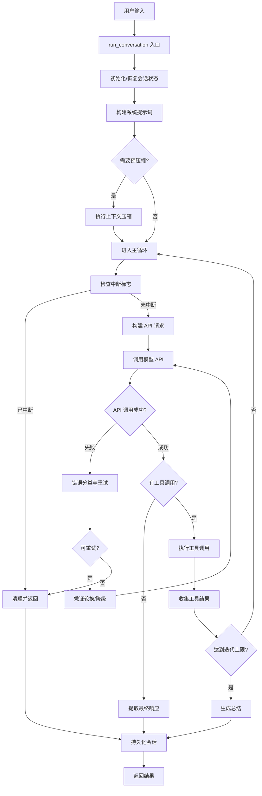
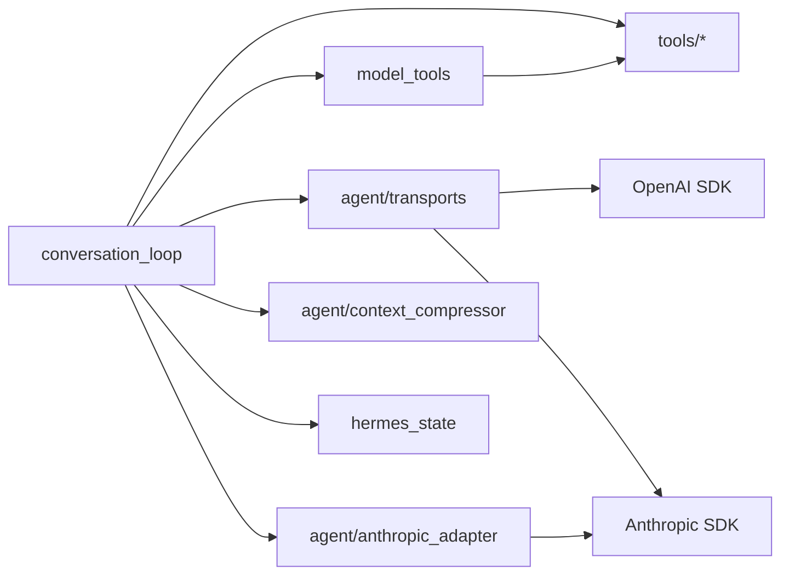

# Agent Runtime / 对话主循环 技术设计方案

## 1. 模块定位

**职责范围：**
- 管理用户与 AI 模型之间的完整对话生命周期
- 协调工具调用（Tool Calling）的执行与结果处理
- 处理 API 重试、降级、凭证轮换等容错逻辑
- 管理上下文压缩、会话持久化、内存管理
- 提供流式输出、中断控制、并发工具执行等运行时能力

**不负责的内容：**
- 具体工具的实现逻辑（由 `tools/` 目录下各工具模块负责）
- 模型提供商的底层 HTTP 通信（由 `agent/transports/` 和各 adapter 负责）
- 用户界面渲染（由 CLI/TUI/Gateway 等前端负责）
- 配置文件解析与管理（由 `hermes_cli/config.py` 负责）

## 2. 核心能力

1. **对话循环管理**：驱动"用户输入 → 模型推理 → 工具调用 → 模型响应"的完整循环
2. **工具调用编排**：支持顺序执行和并发执行，处理工具结果的聚合与错误恢复
3. **容错与降级**：API 失败重试、凭证池轮换、fallback 模型切换
4. **上下文管理**：自动压缩历史消息、管理 token 预算、支持 prompt caching
5. **流式输出**：支持 streaming API，实时推送模型输出给前端
6. **中断控制**：支持用户中断当前对话，取消正在执行的工具
7. **会话持久化**：将对话历史保存到 SQLite 和 JSON 日志
8. **内存与技能管理**：集成外部记忆系统、技能库、背景审查机制

## 3. 关键入口文件

| 文件路径 | 主要类/函数 | 作用 | 为什么重要 |
|---------|------------|------|-----------|
| `run_agent.py` | `AIAgent` 类 | Agent 的主类，封装所有运行时状态和配置 | 系统的核心入口，所有对话都通过这个类启动 |
| `agent/conversation_loop.py` | `run_conversation()` | 对话主循环的完整实现（~3900 行） | 驱动整个对话流程，是理解系统运行逻辑的关键 |
| `agent/agent_init.py` | `init_agent()` | AIAgent 的初始化逻辑（~1400 行） | 负责提供商检测、凭证解析、工具加载等启动逻辑 |
| `agent/chat_completion_helpers.py` | `interruptible_api_call()`, `build_api_kwargs()` | API 调用的封装与参数构建 | 处理非流式 API 调用、超时检测、中断控制 |
| `agent/tool_executor.py` | `execute_tool_calls_sequential()`, `execute_tool_calls_concurrent()` | 工具调用的顺序/并发执行 | 决定工具如何被调度和执行 |
| `agent/agent_runtime_helpers.py` | 各种运行时辅助函数 | 凭证轮换、错误分类、消息清理等 | 提供运行时所需的各种工具函数 |

## 4. 运行时流程

### 4.1 整体流程图



### 4.2 详细步骤说明

#### 步骤 1：会话初始化（`run_conversation` 入口）
**源码位置**：`agent/conversation_loop.py:187-400`

1. **安全 stdio 安装**：防止 headless 环境下的 broken pipe 错误
2. **会话 DB 确保**：调用 `_ensure_db_session()` 创建或恢复 SQLite 会话行
3. **日志上下文绑定**：通过 `set_session_context()` 标记当前线程的 session_id
4. **恢复主运行时**：如果上一轮使用了 fallback，恢复到主模型
5. **用户消息清理**：去除 surrogate 字符，防止 JSON 序列化崩溃
6. **任务 ID 生成**：为并发任务隔离 VM 环境
7. **重置重试计数器**：清空上一轮的各种重试状态
8. **连接健康检查**：检测并清理僵尸 TCP 连接

**关键代码片段**：
```python
# agent/conversation_loop.py:217-220
_install_safe_stdio()
agent._ensure_db_session()
set_session_context(agent.session_id)
agent._restore_primary_runtime()
```

#### 步骤 2：系统提示词构建与缓存
**源码位置**：`agent/conversation_loop.py:406-420`

系统提示词在会话首次调用时构建，后续复用缓存：
- 如果 `_cached_system_prompt` 为空，调用 `_restore_or_build_system_prompt()`
- 对于继续的会话（Gateway 场景），从 session DB 恢复已存储的提示词
- 这样做是为了保持 Anthropic prompt cache 的前缀一致性

**为什么重要**：
- Anthropic 的 prompt caching 要求系统提示词字节级稳定
- 重建会导致缓存失效，增加 token 成本

#### 步骤 3：预飞行上下文压缩
**源码位置**：`agent/conversation_loop.py:422-489`

在进入主循环前，检查历史消息是否已超过模型上下文限制：
- 估算当前 token 数（包括工具 schema）
- 如果超过阈值，执行 `_compress_context()`
- 可能需要多轮压缩（最多 3 轮）

**触发条件**：
```python
if (agent.compression_enabled 
    and len(messages) > protect_first_n + protect_last_n + 1
    and _preflight_tokens >= threshold_tokens):
```

#### 步骤 4：主循环（工具调用迭代）
**源码位置**：`agent/conversation_loop.py:598-1500+`

这是整个系统的核心，循环条件：
```python
while (api_call_count < agent.max_iterations 
       and agent.iteration_budget.remaining > 0) 
       or agent._budget_grace_call:
```

每次迭代包含：
1. **中断检查**：`if agent._interrupt_requested`
2. **预算消耗**：`agent.iteration_budget.consume()`
3. **消息准备**：构建 `api_messages`，注入上下文、插件内容
4. **API 调用**：通过 `_interruptible_api_call()` 或流式调用
5. **响应处理**：解析 `finish_reason`、提取工具调用
6. **工具执行**：调用 `_execute_tool_calls()`
7. **结果追加**：将工具结果加入 `messages`

#### 步骤 5：API 调用与重试
**源码位置**：`agent/chat_completion_helpers.py:79-500+`

API 调用在后台线程执行，支持：
- **超时检测**：如果超过 `stale_timeout`，强制关闭连接
- **中断响应**：主线程可以随时中断 API 调用
- **错误分类**：通过 `classify_api_error()` 判断是否可重试
- **凭证轮换**：401/403 错误时尝试刷新 token 或切换凭证池
- **降级切换**：如果主模型失败，切换到 `fallback_model`

**重试策略**：
```python
max_retries = agent._api_max_retries  # 默认 5
while retry_count < max_retries:
    try:
        response = api_call()
        break
    except Exception as e:
        classified = classify_api_error(e)
        if classified.should_retry:
            retry_count += 1
            time.sleep(jittered_backoff(retry_count))
        else:
            raise
```

#### 步骤 6：工具调用执行
**源码位置**：`agent/tool_executor.py`

工具调用有两种执行模式：

**顺序执行**（`execute_tool_calls_sequential`）：
- 逐个执行工具调用
- 适用于有副作用的工具（如 `terminal`、`write_file`）
- 每个工具执行完后立即追加结果到 `messages`

**并发执行**（`execute_tool_calls_concurrent`）：
- 使用 `ThreadPoolExecutor` 并发执行
- 适用于只读工具（如 `read_file`、`web_search`）
- 结果按原始顺序收集后统一追加

**并发判断逻辑**（`agent/tool_dispatch_helpers.py:_should_parallelize_tool_batch`）：
```python
# 如果包含破坏性工具，不并发
if any(tool in _NEVER_PARALLEL_TOOLS for tool in tool_names):
    return False
# 如果所有工具都是并发安全的，可以并发
if all(tool in _PARALLEL_SAFE_TOOLS for tool in tool_names):
    return True
# 对于文件操作，检查路径是否重叠
if all(tool in _PATH_SCOPED_TOOLS for tool in tool_names):
    return not _paths_overlap(tool_calls)
```

#### 步骤 7：响应处理与循环退出
**源码位置**：`agent/conversation_loop.py:1500-1800+`

循环退出条件：
1. **模型返回最终响应**：`finish_reason == "stop"` 且无工具调用
2. **达到迭代上限**：`api_call_count >= max_iterations`
3. **用户中断**：`agent._interrupt_requested == True`
4. **预算耗尽**：`iteration_budget.remaining == 0`
5. **工具防护触发**：重复失败的工具调用被拦截

退出后执行：
- 提取 `final_response`（模型的最后一条文本输出）
- 调用 `_persist_session()` 保存到 SQLite 和 JSON
- 触发后台审查（memory/skill review）
- 返回结果字典

#### 步骤 8：会话持久化
**源码位置**：`run_agent.py:1171-1298`

持久化包含两个目标：
1. **SQLite 数据库**（`hermes_state.py:SessionDB`）：
   - 每条消息作为一行存储
   - 支持跨会话检索（session_search 工具）
   
2. **JSON 日志**（可选，通过 `sessions.write_json_snapshots` 启用）：
   - 完整会话快照
   - 用于外部工具消费

**关键方法**：
```python
def _persist_session(messages, conversation_history):
    _drop_trailing_empty_response_scaffolding(messages)
    _apply_persist_user_message_override(messages)
    _session_messages = messages
    _save_session_log(messages)  # JSON
    _flush_messages_to_session_db(messages, conversation_history)  # SQLite
```

## 5. 核心数据结构 / 状态

### 5.1 AIAgent 实例状态

**源码位置**：`agent/agent_init.py`

| 状态字段 | 类型 | 作用 |
|---------|------|------|
| `session_id` | str | 会话唯一标识符，用于隔离不同对话 |
| `model` | str | 当前使用的模型名称（如 `claude-opus-4-7`） |
| `provider` | str | 提供商标识（如 `anthropic`, `openai`, `nous`） |
| `base_url` | str | API 端点 URL |
| `api_key` | str | 认证密钥 |
| `api_mode` | str | API 协议模式（`chat_completions`, `anthropic_messages`, `codex_responses`） |
| `tools` | List[Dict] | 可用工具的 JSON Schema 定义 |
| `max_iterations` | int | 单轮对话最大工具调用迭代次数（默认 90） |
| `iteration_budget` | IterationBudget | 跨子 agent 的共享迭代预算 |
| `_cached_system_prompt` | str | 缓存的系统提示词（用于 prompt caching） |
| `_session_messages` | List[Dict] | 当前会话的完整消息历史 |
| `context_compressor` | ContextCompressor | 上下文压缩引擎实例 |
| `_credential_pool` | CredentialPool | 凭证池（用于轮换） |
| `_fallback_model` | Dict | 降级模型配置 |
| `_interrupt_requested` | bool | 中断标志 |
| `_tool_guardrails` | ToolCallGuardrailController | 工具调用防护控制器 |

### 5.2 消息格式

**源码位置**：`agent/conversation_loop.py`

系统使用 OpenAI 兼容的消息格式：

```python
# 用户消息
{
    "role": "user",
    "content": "用户输入的文本"
}

# 助手消息（带工具调用）
{
    "role": "assistant",
    "content": "模型的文本响应",
    "tool_calls": [
        {
            "id": "call_abc123",
            "type": "function",
            "function": {
                "name": "read_file",
                "arguments": '{"file_path": "/path/to/file"}'
            }
        }
    ],
    "reasoning_content": "模型的推理过程（可选）",
    "finish_reason": "tool_calls"
}

# 工具结果消息
{
    "role": "tool",
    "tool_call_id": "call_abc123",
    "tool_name": "read_file",
    "content": "文件内容..."
}
```

### 5.3 运行时配置

**源码位置**：`hermes_cli/config.py`

配置通过 `~/.hermes/config.yaml` 加载：

```yaml
model: claude-opus-4-7
provider: anthropic
max_iterations: 90

compression:
  enabled: true
  threshold_tokens: 180000
  protect_first_n: 3
  protect_last_n: 10

fallback_model:
  model: claude-sonnet-4-6
  provider: anthropic

providers:
  anthropic:
    api_key: sk-ant-...
    request_timeout_seconds: 1800
    stale_timeout_seconds: 300
```

### 5.4 会话数据库 Schema

**源码位置**：`hermes_state.py:SessionDB`

SQLite 表结构：

```sql
CREATE TABLE sessions (
    session_id TEXT PRIMARY KEY,
    source TEXT,  -- 'cli', 'gateway', 'tui'
    model TEXT,
    system_prompt TEXT,
    created_at TIMESTAMP,
    updated_at TIMESTAMP
);

CREATE TABLE messages (
    id INTEGER PRIMARY KEY AUTOINCREMENT,
    session_id TEXT,
    role TEXT,  -- 'user', 'assistant', 'tool'
    content TEXT,
    tool_name TEXT,
    tool_calls TEXT,  -- JSON
    tool_call_id TEXT,
    finish_reason TEXT,
    reasoning TEXT,
    created_at TIMESTAMP,
    FOREIGN KEY (session_id) REFERENCES sessions(session_id)
);
```

## 6. 与其他模块的关系

### 6.1 依赖的模块



**详细说明**：

1. **model_tools.py**：
   - 提供 `get_tool_definitions()` 获取工具 schema
   - 提供 `handle_function_call()` 分发工具调用
   - 作用：工具注册与调度的中心

2. **agent/transports/**：
   - 封装不同 API 协议（chat_completions, anthropic_messages, codex_responses）
   - 统一接口：`transport.call(api_kwargs)` 和 `transport.stream(api_kwargs)`
   - 作用：屏蔽不同提供商的协议差异

3. **agent/anthropic_adapter.py**：
   - 将 OpenAI 格式消息转换为 Anthropic 格式
   - 处理 Anthropic 特有的 `thinking` blocks
   - 作用：支持 Claude 模型的原生协议

4. **agent/context_compressor.py**：
   - 实现上下文压缩算法（保护首尾消息，压缩中间）
   - 支持插件式压缩引擎（默认使用辅助模型总结）
   - 作用：突破模型上下文窗口限制

5. **hermes_state.py**：
   - 提供 `SessionDB` 类管理 SQLite 数据库
   - 支持会话创建、消息追加、跨会话检索
   - 作用：持久化对话历史

6. **tools/**：
   - 各种工具的具体实现（terminal, read_file, web_search 等）
   - 每个工具暴露一个函数，接收参数字典，返回结果字符串
   - 作用：提供 Agent 的实际能力

### 6.2 被调用的场景

**CLI 入口**（`cli.py`）：
```python
agent = AIAgent(model="claude-opus-4-7", provider="anthropic")
result = agent.run_conversation("帮我分析这个文件")
print(result["final_response"])
```

**Gateway 入口**（`hermes_gateway/`）：
```python
# 每条消息创建新的 AIAgent 实例
agent = AIAgent(
    session_id=session_id,
    conversation_history=load_history(session_id)
)
result = agent.run_conversation(user_message)
send_to_client(result["final_response"])
```

**批量运行器**（`batch_runner.py`）：
```python
agent = AIAgent(save_trajectories=True)
for query in queries:
    result = agent.run_conversation(query)
    save_trajectory(result)
```

### 6.3 模块边界

**conversation_loop 的职责边界**：
- ✅ 负责：对话流程控制、重试逻辑、工具调度
- ❌ 不负责：工具的具体实现、HTTP 请求的底层细节

**与 tools 的边界**：
- conversation_loop 通过 `handle_function_call()` 调用工具
- 工具返回字符串结果，不关心对话上下文
- 工具可以通过 `get_active_env()` 等辅助函数获取运行时信息

**与 transports 的边界**：
- conversation_loop 构建 `api_kwargs`（标准格式）
- transport 负责转换为提供商特定格式并发送请求
- transport 返回标准化的响应对象

## 7. 错误处理与降级策略

### 7.1 错误分类

**源码位置**：`agent/error_classifier.py:classify_api_error()`

系统将 API 错误分为以下类别：

| 错误类型 | HTTP 状态码 | 处理策略 |
|---------|------------|---------|
| `RATE_LIMIT` | 429 | 等待 `Retry-After`，或切换凭证池 |
| `AUTH_FAILURE` | 401, 403 | 刷新 token，或轮换凭证 |
| `CONTEXT_LENGTH` | 400 (特定消息) | 触发上下文压缩 |
| `INVALID_REQUEST` | 400 | 不重试，直接返回错误 |
| `SERVER_ERROR` | 500, 502, 503 | 重试 + 指数退避 |
| `TIMEOUT` | - | 重试，可能切换到 fallback |
| `NETWORK_ERROR` | - | 重试 + 清理僵尸连接 |

**分类逻辑示例**：
```python
def classify_api_error(error: Exception) -> ErrorClassification:
    if error.status_code == 429:
        return ErrorClassification(
            reason=FailoverReason.RATE_LIMIT,
            should_retry=True,
            should_rotate_credential=True
        )
    elif error.status_code in (401, 403):
        if is_entitlement_failure(error):
            return ErrorClassification(
                reason=FailoverReason.ENTITLEMENT,
                should_retry=False
            )
        return ErrorClassification(
            reason=FailoverReason.AUTH_FAILURE,
            should_retry=True,
            should_refresh_token=True
        )
    # ... 更多分类逻辑
```

### 7.2 重试策略

**源码位置**：`agent/conversation_loop.py:936-1500+`

重试循环的核心逻辑：

```python
max_retries = 5
retry_count = 0

while retry_count < max_retries:
    try:
        response = api_call(api_kwargs)
        break  # 成功，退出重试
    except Exception as e:
        classified = classify_api_error(e)
        
        if not classified.should_retry:
            raise  # 不可重试错误，直接抛出
        
        # 尝试恢复策略
        if classified.should_refresh_token:
            if agent._try_refresh_credentials():
                continue  # 刷新成功，重试
        
        if classified.should_rotate_credential:
            if agent._recover_with_credential_pool():
                retry_count = 0  # 重置计数
                continue
        
        # 指数退避
        retry_count += 1
        if retry_count < max_retries:
            delay = jittered_backoff(retry_count)
            time.sleep(delay)
        else:
            # 尝试 fallback
            if agent._try_activate_fallback():
                retry_count = 0
                continue
            raise  # 所有策略都失败，抛出
```

### 7.3 凭证轮换

**源码位置**：`agent/agent_runtime_helpers.py:recover_with_credential_pool()`

当遇到 401/403/429 错误时，系统尝试从凭证池切换到另一个可用凭证：

```python
def _recover_with_credential_pool(agent, status_code, classified_reason):
    pool = agent._credential_pool
    if pool is None or not pool.has_available():
        return False
    
    # 标记当前凭证为耗尽
    pool.mark_exhausted(agent.api_key, cooldown_seconds=3600)
    
    # 获取下一个可用凭证
    next_entry = pool.get_next_available()
    if next_entry is None:
        return False
    
    # 切换凭证
    agent._swap_credential(next_entry)
    agent._emit_status(f"🔄 Rotated to next credential in pool")
    return True
```

### 7.4 Fallback 模型切换

**源码位置**：`agent/chat_completion_helpers.py:try_activate_fallback()`

当主模型持续失败时，切换到配置的 fallback 模型：

```python
def _try_activate_fallback(agent, reason=None):
    if agent._fallback_activated:
        return False  # 已经在 fallback，不再切换
    
    fallback = agent._fallback_model
    if not fallback:
        return False
    
    # 保存主运行时配置
    agent._primary_runtime = {
        "model": agent.model,
        "provider": agent.provider,
        "base_url": agent.base_url,
        "api_key": agent.api_key,
    }
    
    # 切换到 fallback
    agent.model = fallback["model"]
    agent.provider = fallback["provider"]
    agent.base_url = fallback.get("base_url", "")
    agent.api_key = fallback.get("api_key", "")
    
    agent._fallback_activated = True
    agent._emit_status(f"⚠️ Switched to fallback model: {agent.model}")
    return True
```

### 7.5 上下文压缩降级

**源码位置**：`agent/conversation_compression.py:compress_context()`

当遇到 `context_length_exceeded` 错误时，自动触发压缩：

```python
if "context_length_exceeded" in error_message:
    if compression_attempts < max_compression_attempts:
        compression_attempts += 1
        messages, system_prompt = agent._compress_context(
            messages, system_message,
            approx_tokens=current_tokens
        )
        # 重置重试计数，用压缩后的消息重试
        retry_count = 0
        continue
```

**压缩策略**：
1. 保护前 N 条消息（系统提示词 + 初始上下文）
2. 保护后 M 条消息（最近的对话）
3. 压缩中间部分（使用辅助模型生成摘要）
4. 生成新的 session_id，标记为压缩会话

### 7.6 工具调用防护

**源码位置**：`agent/tool_guardrails.py`

防止模型陷入重复失败的工具调用循环：

```python
class ToolCallGuardrailController:
    def after_call(self, tool_name, args, result, failed):
        # 记录调用历史
        signature = self._compute_signature(tool_name, args)
        self._history.append((signature, failed))
        
        # 检测重复失败
        recent_failures = [
            sig for sig, fail in self._history[-5:]
            if sig == signature and fail
        ]
        
        if len(recent_failures) >= 3:
            return ToolGuardrailDecision(
                action="halt",
                code="REPEATED_FAILURE",
                should_halt=True,
                message="Tool call failed 3 times with same arguments"
            )
        
        return ToolGuardrailDecision(action="allow")
```

当触发防护时，系统会：
1. 在工具结果中追加警告信息
2. 设置 `_tool_guardrail_halt_decision` 标志
3. 在下一次迭代时提前退出循环，生成总结

---

## 8. 扩展与修改指南

### 8.1 添加新的 API 协议支持

**步骤**：
1. 在 `agent/transports/` 创建新的 transport 类
2. 实现 `call()` 和 `stream()` 方法
3. 在 `agent/transports/__init__.py` 注册新协议
4. 在 `agent/agent_init.py` 添加协议检测逻辑

**示例**：
```python
# agent/transports/my_protocol.py
class MyProtocolTransport:
    def call(self, api_kwargs):
        # 转换 api_kwargs 为提供商格式
        provider_request = self._convert_request(api_kwargs)
        response = requests.post(url, json=provider_request)
        # 转换响应为标准格式
        return self._convert_response(response)
    
    def stream(self, api_kwargs):
        # 流式调用实现
        pass
```

### 8.2 添加新的错误恢复策略

**步骤**：
1. 在 `agent/error_classifier.py` 添加新的错误类型
2. 在 `agent/conversation_loop.py` 的重试循环中添加处理分支
3. 实现恢复逻辑（如新的凭证刷新方法）

**示例**：
```python
# agent/error_classifier.py
class FailoverReason(Enum):
    MY_NEW_ERROR = "my_new_error"

# agent/conversation_loop.py
if classified.reason == FailoverReason.MY_NEW_ERROR:
    if agent._try_recover_from_my_error():
        retry_count = 0
        continue
```

### 8.3 自定义上下文压缩策略

**步骤**：
1. 继承 `ContextCompressor` 类
2. 实现 `compress()` 方法
3. 在 `agent/agent_init.py` 中注册自定义压缩器

**示例**：
```python
class MyCompressor(ContextCompressor):
    def compress(self, messages, system_prompt, **kwargs):
        # 自定义压缩逻辑
        compressed = my_compression_algorithm(messages)
        return compressed, system_prompt
```

### 8.4 添加新的工具调用模式

**步骤**：
1. 在 `agent/tool_dispatch_helpers.py` 定义新的工具分类
2. 在 `_should_parallelize_tool_batch()` 添加判断逻辑
3. 如需新的执行模式，在 `agent/tool_executor.py` 添加新函数

**示例**：
```python
# 定义需要特殊处理的工具
_STREAMING_TOOLS = {"video_generate", "audio_transcribe"}

def _should_use_streaming_execution(tool_calls):
    tool_names = {tc.function.name for tc in tool_calls}
    return any(t in _STREAMING_TOOLS for t in tool_names)
```

### 8.5 调试技巧

**启用详细日志**：
```python
agent = AIAgent(verbose_logging=True, log_prefix_chars=200)
```

**保存轨迹用于分析**：
```python
agent = AIAgent(save_trajectories=True)
# 轨迹保存到 trajectory_samples.jsonl
```

**查看会话历史**：
```bash
sqlite3 ~/.hermes/state.db
SELECT * FROM messages WHERE session_id = 'xxx';
```

**断点调试关键路径**：
```python
# 在 agent/conversation_loop.py 的主循环入口设置断点
# 行号：598
while (api_call_count < agent.max_iterations ...):
    breakpoint()  # 在这里暂停
```

---

## 9. 性能优化要点

### 9.1 Prompt Caching

**源码位置**：`agent/prompt_caching.py`

- 系统提示词保持字节级稳定，复用 Anthropic 的 prompt cache
- 在最后 3 条消息上设置 cache breakpoint
- 可节省 ~75% 的输入 token 成本

### 9.2 并发工具执行

**源码位置**：`agent/tool_executor.py`

- 只读工具（read_file, web_search）自动并发执行
- 使用 ThreadPoolExecutor，最多 8 个并发线程
- 可显著减少工具密集型任务的延迟

### 9.3 连接复用

**源码位置**：`agent/agent_runtime_helpers.py`

- 使用 TCP keepalive 保持连接活跃
- 检测并清理僵尸连接，避免超时
- 共享 OpenAI client 实例，减少握手开销

### 9.4 上下文压缩

**源码位置**：`agent/conversation_compression.py`

- 预飞行压缩：在 API 调用前主动压缩
- 增量压缩：每次只压缩中间部分，保护首尾
- 压缩后重置重试计数器，避免误判

---

## 10. 已知限制与待确认点

### 10.1 已知限制

1. **最大迭代次数硬限制**：
   - 默认 90 次，超过后强制退出
   - 复杂任务可能需要手动增加 `max_iterations`

2. **上下文压缩质量依赖辅助模型**：
   - 压缩使用较小的模型生成摘要
   - 可能丢失重要细节

3. **并发工具执行的限制**：
   - 只支持无副作用的工具
   - 有副作用的工具必须顺序执行

4. **流式输出的延迟**：
   - 流式 API 调用在后台线程执行
   - 中断响应有 ~100ms 延迟

### 10.2 待确认点

1. **Codex App Server 模式的完整流程**：
   - `api_mode == "codex_app_server"` 时的执行路径
   - 与标准模式的差异（需要阅读 `agent/codex_runtime.py`）

2. **背景审查机制的触发条件**：
   - `_should_review_memory` 和 `_should_review_skill` 的具体逻辑
   - 审查结果如何影响后续对话（需要阅读 `agent/background_review.py`）

3. **插件系统的完整能力**：
   - `pre_llm_call` 和 `post_llm_call` 钩子的所有用途
   - 插件如何修改对话流程（需要阅读 `hermes_cli/plugins.py`）

4. **Checkpoint 机制的实现细节**：
   - `_checkpoint_mgr` 的快照策略
   - 如何恢复到历史检查点（需要阅读相关代码）

---

## 11. 参考资料

### 11.1 核心源码文件

- `run_agent.py:326-4154` - AIAgent 类定义
- `agent/conversation_loop.py:187-1800+` - run_conversation 主循环
- `agent/agent_init.py:74-1400+` - AIAgent 初始化逻辑
- `agent/chat_completion_helpers.py:79-500+` - API 调用封装
- `agent/tool_executor.py:65-400+` - 工具执行逻辑
- `agent/error_classifier.py` - 错误分类与重试策略
- `agent/context_compressor.py` - 上下文压缩实现

### 11.2 相关文档

- `docs/venv安装指南.md` - 环境配置
- `docs/Hermes启动命令分析.md` - CLI 入口分析
- `docs/KANBAN页面启动指南.md` - Gateway 架构

### 11.3 测试文件

- `tests/test_agent_runtime.py` - 运行时单元测试
- `tests/test_tool_execution.py` - 工具执行测试
- `tests/test_context_compression.py` - 压缩逻辑测试


