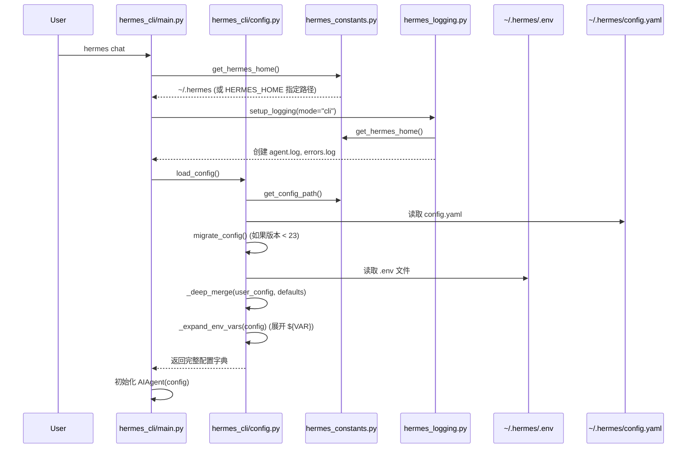
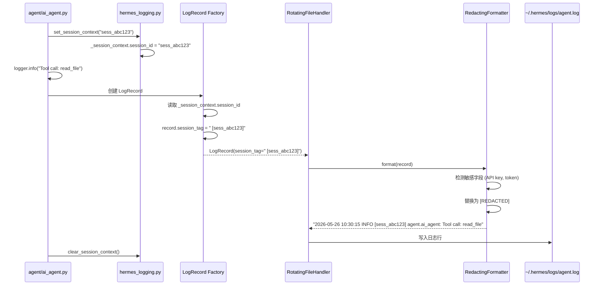
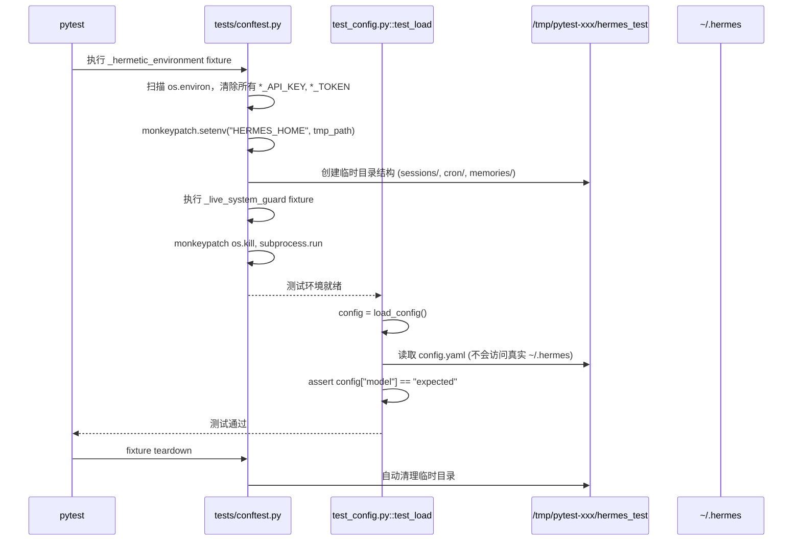
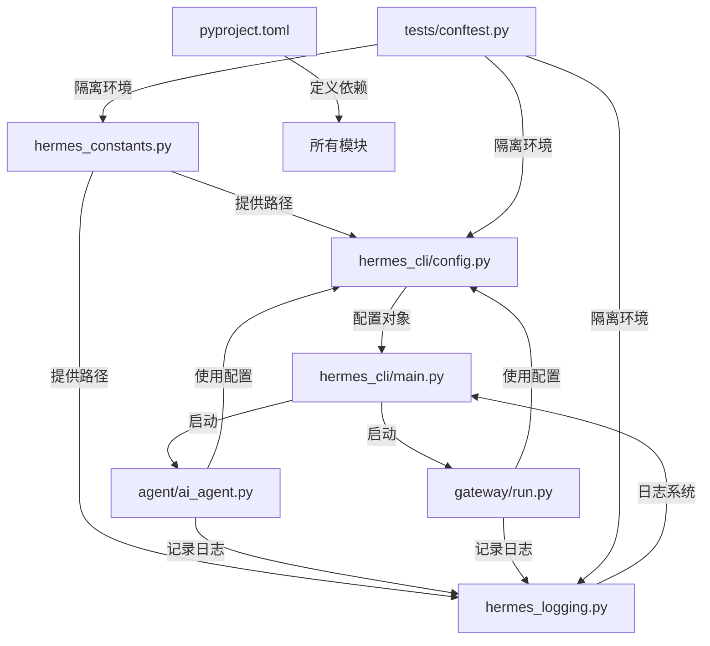

# Config / Profile / Logging / Packaging / Tests 技术设计方案

## 1. 模块定位

### 职责范围
本模块群是 Hermes Agent 的**基础设施层**，负责：
- **Config**：配置文件的加载、保存、迁移、验证和环境变量管理
- **Profile**：多 profile 隔离、路径解析、容器/平台检测
- **Logging**：日志系统初始化、会话上下文注入、敏感信息脱敏
- **Packaging**：依赖声明、构建配置、入口点定义、可选功能分组
- **Tests**：测试环境隔离、凭证过滤、进程保护、确定性运行时

### 不负责的内容
- **不负责业务逻辑**：不处理 agent 对话、工具调用、技能执行
- **不负责网络通信**：不直接处理 API 请求、gateway 消息分发
- **不负责数据持久化**：不管理会话历史、记忆存储、任务数据库

---

## 2. 核心能力

### 2.1 Config 模块
1. **配置文件管理**：读写 `~/.hermes/config.yaml`，支持深度合并用户配置与默认值
2. **环境变量管理**：读写 `~/.hermes/.env`，支持 `${VAR}` 模板展开
3. **版本迁移系统**：自动检测配置版本（当前 v23），执行增量迁移脚本
4. **Managed 模式支持**：NixOS/Homebrew 声明式配置，禁止运行时修改
5. **Provider 规范化**：统一 provider 名称（如 `anthropic-vertex` → `vertex`）
6. **配置结构验证**：检测 YAML 格式错误（如缩进问题导致的列表嵌套）

### 2.2 Profile 模块
1. **Profile 隔离**：通过 `HERMES_HOME` 环境变量支持多 profile（如 `~/.hermes-work`）
2. **路径解析**：提供 `get_hermes_home()`、`get_config_path()` 等 profile-aware 路径函数
3. **容器检测**：识别 Docker/Podman/LXC 环境，调整默认行为
4. **平台检测**：识别 WSL、Termux、macOS、Windows，适配平台特性
5. **Import-safe 设计**：`hermes_constants.py` 无外部依赖，避免循环导入

### 2.3 Logging 模块
1. **统一日志入口**：`setup_logging()` 被 CLI 和 gateway 在启动时调用
2. **多文件输出**：`agent.log`（INFO+）、`errors.log`（WARNING+）、`gateway.log`（gateway 组件专用）
3. **会话上下文注入**：通过 `set_session_context(session_id)` 在日志中添加 `[session_id]` 标签
4. **敏感信息脱敏**：`RedactingFormatter` 自动屏蔽 API key、token 等敏感字段
5. **日志轮转**：`RotatingFileHandler` 按大小轮转（默认 5MB），保留 3 个备份
6. **组件过滤**：gateway.log 仅接收 `gateway.*` 和 `hermes_plugins.*` logger 的记录

### 2.4 Packaging 模块
1. **精确版本锁定**：所有依赖使用 `==X.Y.Z` 精确版本（如 `openai==2.24.0`）
2. **可选依赖分组**：通过 `[project.optional-dependencies]` 按功能分组（如 `anthropic`、`messaging`）
3. **Lazy 安装策略**：非核心依赖（如 `anthropic`、`telegram`）在首次使用时通过 `tools/lazy_deps.py` 安装
4. **入口点定义**：`hermes`、`hermes-agent`、`hermes-acp` 三个命令行入口
5. **包数据声明**：包含 `web_dist`、`tui_dist`、`scripts/install.sh` 等静态资源

### 2.5 Tests 模块
1. **Hermetic 环境**：`_hermetic_environment` fixture 清空所有凭证环境变量，重定向 `HERMES_HOME` 到临时目录
2. **凭证过滤**：自动清除匹配 `_API_KEY`、`_TOKEN`、`_SECRET` 等后缀的环境变量
3. **进程保护**：`_live_system_guard` fixture 拦截 `os.kill`、`subprocess.run` 等调用，防止误杀真实 gateway 进程
4. **确定性运行时**：设置 `TZ=UTC`、`LANG=C.UTF-8`、`PYTHONHASHSEED=0` 保证测试可重现
5. **Per-file 进程隔离**：通过 `scripts/run_tests_parallel.py` 为每个测试文件启动独立 Python 进程

---

## 3. 关键入口文件

| 文件路径 | 主要类/函数 | 作用 | 为什么重要 |
|---------|-----------|------|-----------|
| `hermes_cli/config.py` | `load_config()`<br>`save_config()`<br>`migrate_config()`<br>`get_env_value()`<br>`save_env_value()` | 配置文件的加载、保存、迁移；环境变量读写 | 所有模块启动时都需要读取配置，是系统初始化的第一步 |
| `hermes_constants.py` | `get_hermes_home()`<br>`get_config_path()`<br>`is_container()`<br>`is_managed()` | Profile-aware 路径解析、平台检测 | Import-safe 设计，被所有模块依赖，无循环导入风险 |
| `hermes_logging.py` | `setup_logging()`<br>`set_session_context()`<br>`clear_session_context()` | 日志系统初始化、会话上下文管理 | CLI 和 gateway 启动时必须调用，确保日志正确输出和脱敏 |
| `pyproject.toml` | `[project.dependencies]`<br>`[project.optional-dependencies]`<br>`[project.scripts]` | 依赖声明、可选功能分组、入口点定义 | 定义了整个项目的依赖树和安装行为，影响供应链安全 |
| `tests/conftest.py` | `_hermetic_environment`<br>`_live_system_guard`<br>`mock_config` | 测试环境隔离、进程保护、配置 mock | 所有测试自动应用这些 fixture，保证测试不污染真实环境 |

---

## 4. 运行时流程

### 4.1 配置加载流程（CLI 启动）



**关键步骤说明**：
1. **Line 1-2**：用户执行 `hermes chat`，CLI 入口 `hermes_cli/main.py:main()` 被调用
2. **Line 3-4**：通过 `get_hermes_home()` 获取 profile 根目录（默认 `~/.hermes`，可通过 `HERMES_HOME` 覆盖）
3. **Line 5-7**：初始化日志系统，创建 `~/.hermes/logs/agent.log` 和 `errors.log`
4. **Line 8-9**：调用 `load_config()` 加载配置
5. **Line 10-11**：读取 `~/.hermes/config.yaml`（如果不存在则使用默认值）
6. **Line 12**：检查配置版本，如果 `config_version < 23`，执行迁移脚本（如添加新字段、重命名旧字段）
7. **Line 13**：读取 `~/.hermes/.env` 文件，加载环境变量（如 `ANTHROPIC_API_KEY`）
8. **Line 14**：深度合并用户配置与默认配置（用户配置优先级更高）
9. **Line 15**：展开配置中的 `${VAR}` 模板（如 `base_url: ${CUSTOM_API_URL}`）
10. **Line 16-17**：返回完整配置，CLI 使用该配置初始化 `AIAgent`

**源码引用**：
- `hermes_cli/main.py:main()` 调用 `setup_logging()` 和 `load_config()`
- `hermes_cli/config.py:load_config()` (Line 450-550) 实现配置加载逻辑
- `hermes_cli/config.py:migrate_config()` (Line 1200-1800) 实现版本迁移

### 4.2 日志记录流程（带会话上下文）



**关键机制**：
1. **Thread-local 存储**：`_session_context = threading.local()` 保证多线程环境下会话 ID 不混淆
2. **Record Factory 注入**：`_install_session_record_factory()` 在模块导入时替换全局 `LogRecord` 工厂，为每条记录添加 `session_tag` 属性
3. **RedactingFormatter**：扫描日志消息中的敏感模式（如 `sk-...`、`Bearer ...`），替换为 `[REDACTED]`

**源码引用**：
- `hermes_logging.py:set_session_context()` (Line 72-78)
- `hermes_logging.py:_install_session_record_factory()` (Line 90-114)
- `agent/redact.py:RedactingFormatter` 实现脱敏逻辑

### 4.3 测试环境隔离流程



**保护机制**：
1. **凭证过滤**：清除 85+ 个已知凭证环境变量（Line 59-163），防止本地开发者密钥泄露到测试断言
2. **HERMES_HOME 重定向**：所有 `get_hermes_home()` 调用返回临时目录，测试无法读写真实配置
3. **进程保护**：拦截 `os.kill(pid, signal)`，如果 `pid` 不在测试进程子树中则抛出 `RuntimeError`
4. **systemctl 拦截**：拦截 `systemctl restart hermes-gateway` 等命令，防止测试重启真实服务

**源码引用**：
- `tests/conftest.py:_hermetic_environment` (Line 311-374)
- `tests/conftest.py:_live_system_guard` (Line 518-822)

---

## 5. 核心数据结构 / 状态

### 5.1 配置对象结构（config.yaml）

```yaml
# 当前版本号（用于迁移检测）
config_version: 23

# 模型配置
model: "claude-opus-4"
provider: "anthropic"
inference_model: "gpt-4o"
inference_provider: "openai"

# 工具集配置
toolsets:
  - terminal
  - file
  - web

# 终端配置
terminal:
  backend: "local"  # 或 "modal", "daytona", "vercel"
  cwd: "/path/to/project"
  timeout: 120

# 压缩配置
compression:
  enabled: true
  min_turns: 10

# 记忆配置
memory:
  memory_enabled: true
  user_profile_enabled: true

# 日志配置
logging:
  level: "INFO"
  max_size_mb: 5
  backup_count: 3

# 命令白名单（安全控制）
command_allowlist:
  - "git"
  - "npm"
```

**字段说明**：
- `config_version`：配置格式版本，当前为 23。`migrate_config()` 根据此字段决定是否执行迁移
- `model` / `provider`：主模型配置，支持 `anthropic`、`openai`、`vertex` 等
- `inference_model` / `inference_provider`：推理模型配置（用于 Codex Responses 等功能）
- `toolsets`：启用的工具集列表，影响 agent 可用工具
- `terminal.backend`：终端沙箱后端，`local` 表示本地执行，`modal` 表示云端容器
- `compression.enabled`：是否启用对话历史压缩（长对话场景）
- `memory.memory_enabled`：是否启用记忆系统（auto-memory）
- `logging.*`：日志配置，覆盖 `hermes_logging.py` 的默认值
- `command_allowlist`：白名单模式下允许执行的命令前缀

**源码引用**：
- `hermes_cli/config.py:_get_default_config()` (Line 350-450) 定义默认配置结构
- `hermes_cli/config.py:migrate_config()` (Line 1200+) 处理版本迁移

### 5.2 环境变量文件（.env）

```bash
# Provider API Keys
ANTHROPIC_API_KEY=sk-ant-...
OPENAI_API_KEY=sk-...
GEMINI_API_KEY=...

# Gateway 配置
TELEGRAM_BOT_TOKEN=...
SLACK_BOT_TOKEN=...

# 自定义 Base URL
ANTHROPIC_BASE_URL=https://custom-proxy.com/v1
```

**管理原则**：
- **敏感信息隔离**：所有 API key、token 存储在 `.env`，不写入 `config.yaml`
- **优先级**：环境变量 > `.env` 文件 > `config.yaml` 默认值
- **模板展开**：`config.yaml` 中可使用 `${ANTHROPIC_API_KEY}` 引用 `.env` 中的值

**源码引用**：
- `hermes_cli/config.py:get_env_value()` (Line 250-280) 读取环境变量
- `hermes_cli/config.py:save_env_value()` (Line 290-320) 写入 `.env` 文件
- `hermes_cli/config.py:_expand_env_vars()` (Line 600-650) 展开 `${VAR}` 模板

### 5.3 日志文件结构

```
~/.hermes/logs/
├── agent.log          # 主日志（INFO+），所有组件
├── agent.log.1        # 轮转备份 1
├── agent.log.2        # 轮转备份 2
├── errors.log         # 错误日志（WARNING+）
├── errors.log.1
└── gateway.log        # Gateway 专用日志（仅 gateway.* logger）
```

**日志格式示例**：
```
2026-05-26 10:30:15,123 INFO [sess_abc123] agent.ai_agent: Starting conversation
2026-05-26 10:30:16,456 DEBUG [sess_abc123] tools.file_tools: Reading file: config.yaml
2026-05-26 10:30:17,789 WARNING hermes_cli.config: Config version mismatch, migrating from 22 to 23
2026-05-26 10:30:18,012 ERROR [sess_abc123] agent.ai_agent: API call failed: [REDACTED]
```

**字段说明**：
- `2026-05-26 10:30:15,123`：时间戳（毫秒精度）
- `INFO`：日志级别
- `[sess_abc123]`：会话 ID（通过 `set_session_context()` 注入）
- `agent.ai_agent`：Logger 名称（模块路径）
- `[REDACTED]`：敏感信息已脱敏

**源码引用**：
- `hermes_logging.py:setup_logging()` (Line 156-259) 创建日志文件和 handler
- `hermes_logging.py:_LOG_FORMAT` (Line 46) 定义日志格式

### 5.4 依赖分组（pyproject.toml）

```toml
[project.dependencies]
# 核心依赖（所有安装都包含）
openai = "==2.24.0"
python-dotenv = "==1.2.2"
rich = "==14.3.3"
# ... 共 15 个核心依赖

[project.optional-dependencies]
# 可选依赖（按需安装）
anthropic = ["anthropic==0.86.0"]
messaging = ["python-telegram-bot[webhooks]==22.6", "discord.py[voice]==2.7.1", ...]
voice = ["faster-whisper==1.2.1", "sounddevice==0.5.5", ...]
all = ["hermes-agent[cron]", "hermes-agent[cli]", "hermes-agent[dev]", ...]
```

**安装策略**：
- **核心依赖**：`pip install hermes-agent` 自动安装，体积小（~50MB）
- **可选依赖**：`pip install hermes-agent[anthropic]` 按需安装
- **Lazy 安装**：首次使用时通过 `tools/lazy_deps.py` 自动安装（如首次调用 Telegram gateway）
- **All 组合**：`pip install hermes-agent[all]` 安装所有非 lazy 依赖

**源码引用**：
- `pyproject.toml` (Line 13-67) 核心依赖列表
- `pyproject.toml` (Line 69-207) 可选依赖分组
- `tools/lazy_deps.py` 实现 lazy 安装逻辑

---

## 6. 与其他模块的关系

### 6.1 依赖关系图



### 6.2 模块边界说明

| 模块 | 被谁调用 | 调用谁 | 边界 |
|------|---------|--------|------|
| `hermes_constants.py` | 所有模块 | 仅 stdlib | **最底层**，无外部依赖，提供 profile 路径和平台检测 |
| `hermes_cli/config.py` | CLI、Gateway、Agent | `hermes_constants`、`yaml`、`dotenv` | **配置层**，负责配置文件 I/O，不处理业务逻辑 |
| `hermes_logging.py` | CLI、Gateway、Agent | `hermes_constants`、`agent.redact` | **日志层**，负责日志系统初始化，不处理日志内容生成 |
| `pyproject.toml` | pip/uv 安装器 | 无（声明式） | **打包层**，定义依赖和入口点，不参与运行时 |
| `tests/conftest.py` | pytest | 所有被测模块 | **测试层**，提供隔离环境，不被生产代码导入 |

### 6.3 关键交互场景

#### 场景 1：CLI 启动时的模块协作
```python
# hermes_cli/main.py:main()
from hermes_constants import get_hermes_home  # 1. 获取 profile 路径
from hermes_logging import setup_logging      # 2. 初始化日志
from hermes_cli.config import load_config     # 3. 加载配置

def main():
    home = get_hermes_home()                   # 返回 ~/.hermes 或 HERMES_HOME
    setup_logging(hermes_home=home, mode="cli")  # 创建 logs/agent.log
    config = load_config()                     # 读取 config.yaml + .env
    agent = AIAgent(config)                    # 使用配置初始化 agent
    agent.run()
```

#### 场景 2：Gateway 启动时的模块协作
```python
# gateway/run.py:main()
from hermes_constants import get_hermes_home
from hermes_logging import setup_logging, set_session_context
from hermes_cli.config import load_config

def main():
    home = get_hermes_home()
    setup_logging(hermes_home=home, mode="gateway")  # 额外创建 gateway.log
    config = load_config()
    
    # 启动 Telegram/Discord/Slack 等平台适配器
    for platform in config.get("platforms", []):
        adapter = create_adapter(platform, config)
        adapter.start()

def handle_message(session_id, message):
    set_session_context(session_id)  # 注入会话 ID 到日志
    logger.info(f"Received: {message}")
    # ... 处理消息
    clear_session_context()
```

#### 场景 3：测试运行时的模块协作
```python
# tests/test_config.py
def test_load_config_with_env_expansion(tmp_path, monkeypatch):
    # conftest.py 的 _hermetic_environment fixture 已自动执行：
    # - HERMES_HOME 已重定向到 tmp_path
    # - 所有 *_API_KEY 环境变量已清空
    
    # 测试代码可以安全地设置环境变量
    monkeypatch.setenv("CUSTOM_URL", "https://test.com")
    
    # 创建测试配置文件
    config_path = tmp_path / "hermes_test" / "config.yaml"
    config_path.write_text("base_url: ${CUSTOM_URL}")
    
    # 加载配置（会读取临时目录，不会污染真实 ~/.hermes）
    config = load_config()
    assert config["base_url"] == "https://test.com"
```

### 6.4 循环依赖避免策略

**问题**：`hermes_cli/config.py` 需要 `get_hermes_home()`，而 `hermes_logging.py` 也需要 `get_hermes_home()`，如果两者互相导入会形成循环。

**解决方案**：
1. **Import-safe 设计**：`hermes_constants.py` 只依赖 stdlib，不导入任何项目模块
2. **延迟导入**：`hermes_logging.py` 在函数内部导入 `agent.redact.RedactingFormatter`，避免模块级导入
3. **单向依赖**：所有模块都可以导入 `hermes_constants`，但 `hermes_constants` 不导入任何项目模块

**源码引用**：
- `hermes_constants.py` (Line 1-50) 注释说明 import-safe 设计原则
- `hermes_logging.py` (Line 211) 使用 `from agent.redact import RedactingFormatter` 延迟导入

---

## 7. 错误处理与降级策略

### 7.1 配置加载失败处理

**场景 1：config.yaml 不存在**
```python
# hermes_cli/config.py:load_config()
if not config_path.exists():
    logger.info("Config file not found, using defaults")
    config = _get_default_config()  # 返回默认配置
    save_config(config)             # 创建默认配置文件
    return config
```
- **策略**：使用内置默认配置，自动创建配置文件
- **用户体验**：首次运行时自动初始化，无需手动配置

**场景 2：config.yaml 格式错误**
```python
try:
    with open(config_path, "r", encoding="utf-8") as f:
        user_config = yaml.safe_load(f)
except yaml.YAMLError as e:
    logger.error(f"Config file is malformed: {e}")
    logger.info("Using default config due to YAML error")
    return _get_default_config()
```
- **策略**：记录错误日志，回退到默认配置
- **用户体验**：系统仍可启动，用户可通过日志定位问题

**场景 3：配置版本过旧**
```python
current_version = config.get("config_version", 1)
if current_version < LATEST_VERSION:
    logger.warning(f"Config version {current_version} is outdated, migrating to {LATEST_VERSION}")
    config = migrate_config(config, current_version)
    save_config(config)  # 保存迁移后的配置
```
- **策略**：自动执行增量迁移脚本，更新配置文件
- **用户体验**：无感知升级，旧配置自动兼容

**源码引用**：
- `hermes_cli/config.py:load_config()` (Line 450-550) 实现上述三种场景

### 7.2 日志系统降级策略

**场景 1：日志目录无写权限**
```python
# hermes_logging.py:setup_logging()
try:
    log_dir.mkdir(parents=True, exist_ok=True)
except PermissionError:
    # 降级到 stderr 输出
    handler = logging.StreamHandler(sys.stderr)
    root.addHandler(handler)
    logger.warning("Cannot create log directory, falling back to stderr")
```
- **策略**：降级到标准错误输出，不阻塞系统启动
- **用户体验**：日志仍可见（终端输出），但不持久化

**场景 2：日志文件轮转失败**
```python
# hermes_logging.py:_ManagedRotatingFileHandler.doRollover()
try:
    super().doRollover()
    self._chmod_if_managed()
except OSError as e:
    # 继续写入当前文件，不中断日志记录
    logger.error(f"Log rotation failed: {e}, continuing with current file")
```
- **策略**：跳过轮转，继续写入当前文件（可能超过大小限制）
- **用户体验**：日志不丢失，但可能占用更多磁盘空间

**场景 3：RedactingFormatter 失败**
```python
# agent/redact.py:RedactingFormatter.format()
try:
    message = record.getMessage()
    redacted = self._redact_secrets(message)
    record.msg = redacted
    return super().format(record)
except Exception as e:
    # 降级到原始格式化器，避免日志系统崩溃
    return logging.Formatter.format(self, record)
```
- **策略**：脱敏失败时使用原始消息，保证日志可写入
- **风险**：可能泄露敏感信息到日志文件（但系统不会崩溃）

**源码引用**：
- `hermes_logging.py:setup_logging()` (Line 156-259)
- `hermes_logging.py:_ManagedRotatingFileHandler` (Line 298-328)

### 7.3 测试环境隔离失败处理

**场景 1：临时目录创建失败**
```python
# tests/conftest.py:_hermetic_environment
try:
    fake_hermes_home = tmp_path / "hermes_test"
    fake_hermes_home.mkdir()
except OSError:
    # pytest 会自动跳过该测试
    pytest.skip("Cannot create temp directory for hermetic test")
```
- **策略**：跳过测试，不影响其他测试运行
- **CI 行为**：标记为 SKIPPED，不计入失败

**场景 2：进程保护拦截误报**
```python
# tests/conftest.py:_live_system_guard
def _is_own_subtree(pid: int) -> bool:
    if _psutil is None:
        return False  # psutil 不可用时，保守策略：拒绝所有 kill
    try:
        walker = _psutil.Process(pid)
    except psutil.NoSuchProcess:
        return True  # 进程已不存在，允许 kill（无害）
```
- **策略**：进程已消失时允许 kill 调用（因为 kill 会是 no-op）
- **避免误报**：防止测试因为 PID 回收导致的 false positive

**场景 3：凭证过滤遗漏**
```python
# tests/conftest.py:_hermetic_environment
# 如果新增了未知格式的凭证环境变量（如 NEW_SERVICE_AUTH），
# 测试可能会意外使用真实凭证。
# 解决方案：定期审查 _CREDENTIAL_NAMES 和 _CREDENTIAL_SUFFIXES
```
- **策略**：通过代码审查和 CI 检查发现遗漏
- **长期方案**：在 conftest.py 中添加 "未知环境变量" 警告

**源码引用**：
- `tests/conftest.py:_hermetic_environment` (Line 311-374)
- `tests/conftest.py:_live_system_guard` (Line 518-822)

### 7.4 依赖安装失败处理

**场景 1：核心依赖缺失**
```python
# hermes_cli/main.py
try:
    import openai
    import rich
except ImportError as e:
    print(f"FATAL: Core dependency missing: {e}")
    print("Please run: pip install hermes-agent")
    sys.exit(1)
```
- **策略**：立即退出，提示用户安装
- **用户体验**：清晰的错误消息，指导修复

**场景 2：可选依赖缺失（Lazy 安装）**
```python
# tools/lazy_deps.py:ensure_deps()
def ensure_deps(group: str):
    try:
        import anthropic  # 尝试导入
    except ImportError:
        logger.info(f"Installing optional dependency: {group}")
        subprocess.run([sys.executable, "-m", "pip", "install", f"hermes-agent[{group}]"])
        import anthropic  # 重新导入
```
- **策略**：首次使用时自动安装，用户无需手动操作
- **用户体验**：首次调用稍慢（安装时间），后续调用正常

**场景 3：依赖版本冲突**
```python
# pyproject.toml 使用精确版本锁定（==X.Y.Z）
# 如果用户环境中已有不兼容版本，pip 会报错：
# ERROR: Cannot install hermes-agent because these package versions have conflicting dependencies.
```
- **策略**：使用虚拟环境（venv/conda）隔离依赖
- **文档指导**：README 中建议使用 `uv venv` 或 `python -m venv`

**源码引用**：
- `pyproject.toml` (Line 13-67) 精确版本锁定策略
- `tools/lazy_deps.py` 实现 lazy 安装逻辑

### 7.5 Managed 模式权限处理

**场景：NixOS/Homebrew 管理的配置文件只读**
```python
# hermes_cli/config.py:save_config()
if is_managed():
    logger.warning("Running in managed mode, config changes will not persist")
    logger.info("To modify config, edit your NixOS configuration or Homebrew formula")
    return  # 不写入文件，避免权限错误
```
- **策略**：检测 managed 模式，拒绝写入操作
- **用户体验**：清晰的警告消息，指导用户修改声明式配置

**源码引用**：
- `hermes_cli/config.py:is_managed()` (Line 150-180) 检测 managed 模式
- `hermes_cli/config.py:save_config()` (Line 700-750) 实现写入保护

---

## 8. 设计亮点与最佳实践

### 8.1 供应链安全设计

**精确版本锁定**：
```toml
# pyproject.toml
dependencies = [
  "openai==2.24.0",  # 不使用 >=2.24.0 或 ^2.24.0
  "anthropic==0.86.0",
]
```
- **原因**：2026-05-12 Mini Shai-Hulud 蠕虫事件，`mistralai` 2.4.6 版本被投毒
- **效果**：恶意版本无法通过依赖范围自动安装，必须显式更新 `pyproject.toml`

**Lazy 安装策略**：
```python
# tools/lazy_deps.py
LAZY_DEPS = {
    "anthropic": ["anthropic==0.86.0"],
    "telegram": ["python-telegram-bot[webhooks]==22.6"],
}
```
- **原因**：减少核心依赖数量，降低供应链攻击面
- **效果**：基础安装仅 15 个依赖，可选功能按需安装

### 8.2 测试隔离设计

**Per-file 进程隔离**：
```bash
# scripts/run_tests_parallel.py
for test_file in test_files:
    subprocess.run(["python", "-m", "pytest", test_file])
```
- **原因**：模块级状态（如单例、ContextVar）在同一进程内会泄露
- **效果**：每个测试文件独立运行，状态完全隔离

**Live-system 保护**：
```python
# tests/conftest.py:_live_system_guard
def _guarded_kill(pid, sig):
    if not _is_own_subtree(pid):
        raise RuntimeError("Blocked kill to foreign process")
```
- **原因**：测试代码误调用 `os.kill(gateway_pid, SIGTERM)` 会杀死开发者的真实 gateway
- **效果**：5 天内捕获 5+ 次泄露，保护开发环境

### 8.3 配置迁移设计

**增量迁移脚本**：
```python
# hermes_cli/config.py:migrate_config()
def migrate_config(config, from_version):
    for version in range(from_version + 1, LATEST_VERSION + 1):
        migrator = globals().get(f"_migrate_to_v{version}")
        if migrator:
            config = migrator(config)
    return config
```
- **原因**：配置格式随版本演进，需要自动升级旧配置
- **效果**：用户无感知升级，旧版本配置自动兼容

### 8.4 日志脱敏设计

**RedactingFormatter**：
```python
# agent/redact.py
REDACT_PATTERNS = [
    r"sk-[a-zA-Z0-9]{20,}",  # OpenAI API key
    r"Bearer [a-zA-Z0-9_\-\.]+",  # Bearer token
]
```
- **原因**：日志文件可能被分享（如 bug 报告），不能泄露凭证
- **效果**：所有日志自动脱敏，无需开发者手动处理

---

## 9. 扩展指南

### 9.1 添加新的配置字段

**步骤**：
1. 在 `hermes_cli/config.py:_get_default_config()` 中添加默认值
2. 更新 `CONFIG_VERSION` 常量（如 23 → 24）
3. 编写迁移函数 `_migrate_to_v24(config)`
4. 在 `migrate_config()` 中注册迁移函数

**示例**：
```python
# hermes_cli/config.py
CONFIG_VERSION = 24

def _get_default_config():
    return {
        # ... 现有字段
        "new_feature": {
            "enabled": False,
            "timeout": 30,
        }
    }

def _migrate_to_v24(config):
    if "new_feature" not in config:
        config["new_feature"] = {"enabled": False, "timeout": 30}
    config["config_version"] = 24
    return config
```

### 9.2 添加新的日志组件

**步骤**：
1. 在 `hermes_logging.py:COMPONENT_PREFIXES` 中添加组件前缀
2. 在 `setup_logging()` 中添加新的 handler（如果需要独立日志文件）

**示例**：
```python
# hermes_logging.py
COMPONENT_PREFIXES = {
    "gateway": ("gateway", "hermes_plugins"),
    "agent": ("agent", "run_agent"),
    "new_component": ("new_component",),  # 新增
}

def setup_logging(...):
    # ... 现有 handler
    if mode == "new_component":
        _add_rotating_handler(
            root,
            log_dir / "new_component.log",
            level=logging.INFO,
            formatter=RedactingFormatter(_LOG_FORMAT),
            log_filter=_ComponentFilter(COMPONENT_PREFIXES["new_component"]),
        )
```

### 9.3 添加新的可选依赖

**步骤**：
1. 在 `pyproject.toml:[project.optional-dependencies]` 中添加新组
2. 在 `tools/lazy_deps.py:LAZY_DEPS` 中注册（如果需要 lazy 安装）
3. 在使用该依赖的代码中调用 `ensure_deps("new_group")`

**示例**：
```toml
# pyproject.toml
[project.optional-dependencies]
new-service = ["new-service-sdk==1.0.0"]
```

```python
# tools/lazy_deps.py
LAZY_DEPS = {
    "new-service": ["new-service-sdk==1.0.0"],
}
```

```python
# tools/new_service_tool.py
from tools.lazy_deps import ensure_deps

def call_new_service():
    ensure_deps("new-service")  # 首次调用时自动安装
    import new_service_sdk
    # ... 使用 SDK
```

---

## 10. 常见问题排查

### 10.1 配置文件不生效

**症状**：修改 `~/.hermes/config.yaml` 后，配置未生效

**排查步骤**：
1. 检查是否在 managed 模式：`hermes status` 查看 "Managed mode" 字段
2. 检查环境变量是否覆盖：`echo $HERMES_MODEL` 等
3. 检查配置文件格式：`python -c "import yaml; yaml.safe_load(open('~/.hermes/config.yaml'))"`
4. 查看日志：`tail -f ~/.hermes/logs/agent.log | grep config`

**常见原因**：
- Managed 模式下配置只读，需修改 NixOS/Homebrew 配置
- 环境变量优先级高于配置文件
- YAML 缩进错误导致解析失败

### 10.2 日志文件过大

**症状**：`~/.hermes/logs/agent.log` 占用数 GB 空间

**排查步骤**：
1. 检查日志轮转配置：`grep max_size_mb ~/.hermes/config.yaml`
2. 检查是否有日志轰炸：`tail -n 1000 ~/.hermes/logs/agent.log | grep -o '^[^ ]* [^ ]*' | uniq -c`
3. 手动触发轮转：`rm ~/.hermes/logs/agent.log.3 && mv ~/.hermes/logs/agent.log ~/.hermes/logs/agent.log.1`

**解决方案**：
- 调整 `logging.max_size_mb` 为更小值（如 2）
- 减少 `logging.backup_count`（如 1）
- 提高日志级别：`logging.level: WARNING`

### 10.3 测试失败：RuntimeError blocked os.kill

**症状**：测试运行时报错 `RuntimeError: tests/conftest.py live-system guard: blocked os.kill(...)`

**原因**：测试代码调用了 `os.kill()` 但未 mock，且目标 PID 不在测试进程子树中

**解决方案**：
```python
# 方案 1：Mock os.kill
def test_something(monkeypatch):
    mock_kill = Mock()
    monkeypatch.setattr("os.kill", mock_kill)
    # ... 测试代码

# 方案 2：标记为 bypass（仅当测试确实需要真实 kill）
@pytest.mark.live_system_guard_bypass
def test_pty_signal():
    # ... 测试代码
```

---

## 11. 参考资料

### 11.1 源码文件索引

- **配置管理**：`hermes_cli/config.py` (5591 行)
- **常量定义**：`hermes_constants.py` (439 行)
- **日志系统**：`hermes_logging.py` (390 行)
- **打包配置**：`pyproject.toml` (269 行)
- **测试 fixture**：`tests/conftest.py` (823 行)
- **日志脱敏**：`agent/redact.py`
- **Lazy 安装**：`tools/lazy_deps.py`

### 11.2 相关文档

- **配置迁移历史**：`hermes_cli/config.py` 中的 `_migrate_to_vXX()` 函数注释
- **测试隔离原理**：`tests/conftest.py` 顶部的 docstring
- **供应链安全事件**：`pyproject.toml` Line 19-22 注释（Mini Shai-Hulud 事件）

### 11.3 设计决策记录

1. **为什么使用精确版本锁定？**
   - 2026-05-12 `mistralai` 2.4.6 投毒事件，证明依赖范围（如 `>=2.3.0`）存在供应链风险
   - 精确锁定（`==X.Y.Z`）确保只有显式更新才能引入新版本

2. **为什么需要 per-file 进程隔离？**
   - 模块级单例（如 `_plugin_manager`）和 ContextVar 在同一进程内会泄露
   - 历史案例：`test_command_guards` 因 `tools.approval._session_approved` 泄露导致 12/15 CI 失败

3. **为什么日志需要脱敏？**
   - 用户在提交 bug 报告时可能附带日志文件
   - 未脱敏的日志可能包含 API key、token，导致凭证泄露

4. **为什么需要 managed 模式？**
   - NixOS/Homebrew 等包管理器要求声明式配置
   - Managed 模式禁止运行时修改配置，避免状态漂移

---

**文档版本**：v1.0  
**最后更新**：2026-05-26  
**适用代码版本**：hermes-agent 0.14.0  
**作者**：基于源码分析生成

