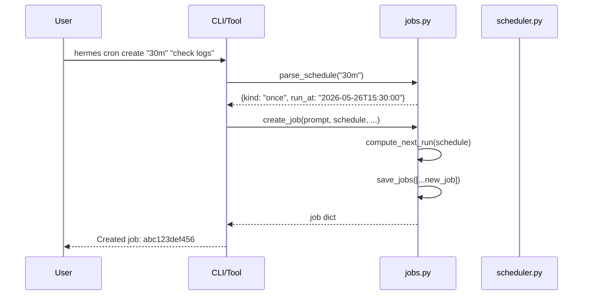
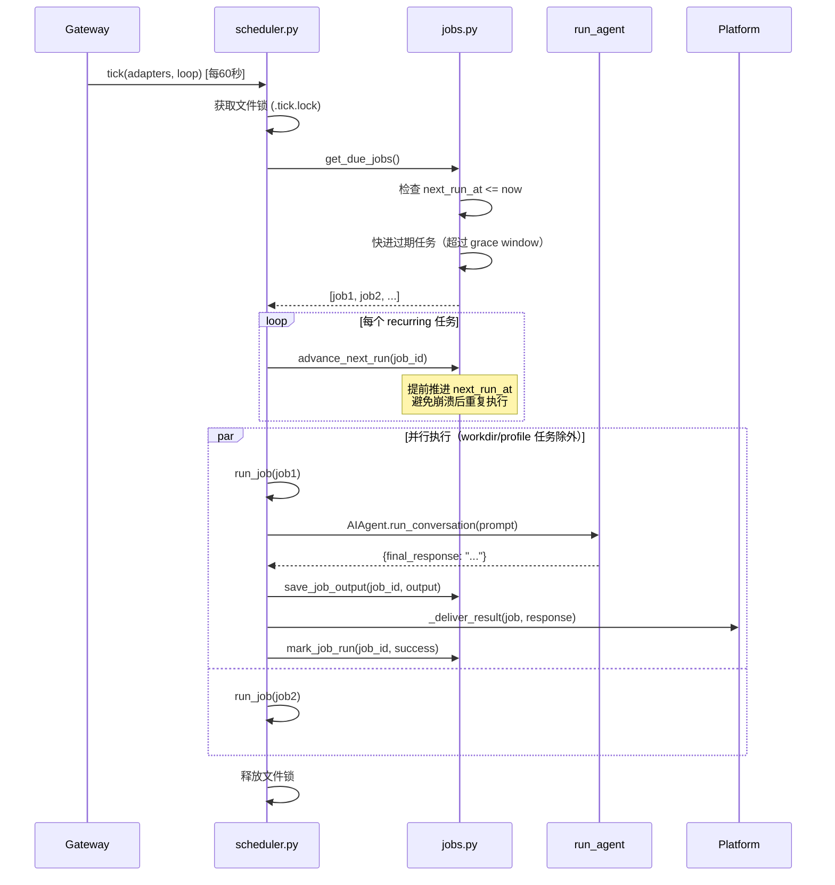
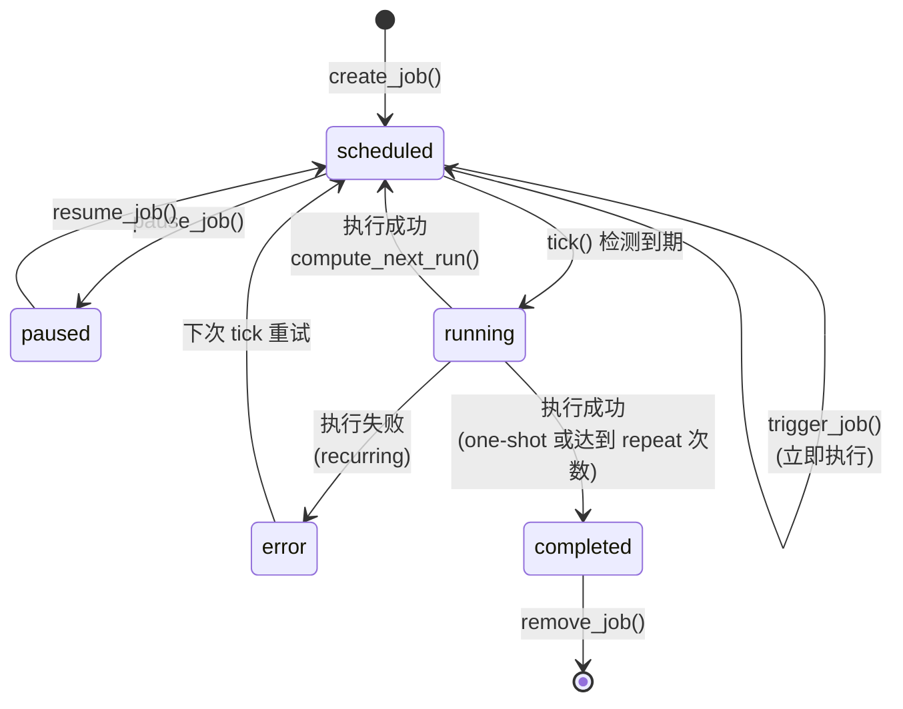
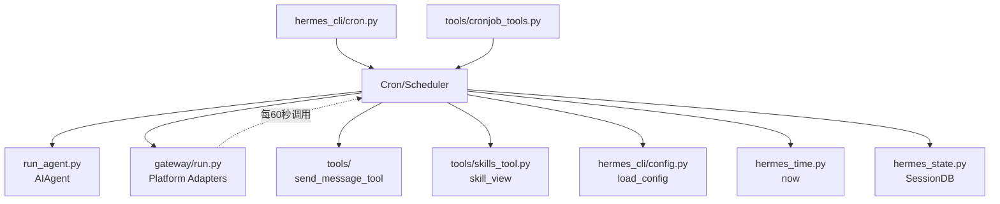

# Cron / Scheduler 技术设计方案

> 基于源码分析的 Hermes Agent 定时任务调度系统设计文档

## 1. 模块定位

### 职责范围

Cron/Scheduler 模块负责：

- **定时任务定义与存储**：支持多种调度模式（一次性、间隔、cron 表达式）
- **任务调度执行**：按时触发到期任务，支持并行执行
- **Agent 集成**：将定时任务的 prompt 投递给 AI Agent 执行
- **多平台投递**：将执行结果自动投递到 Telegram、Discord、Slack 等平台
- **状态管理**：跟踪任务执行历史、错误、重复次数等

### 不负责的内容

- **不负责 Agent 的具体执行逻辑**：Agent 的工具调用、推理、对话管理由 `run_agent.py` 负责
- **不负责平台消息接收**：消息接收由 `gateway/` 模块的各平台 adapter 负责
- **不负责用户交互式对话**：Cron 任务是非交互式的，执行完成后直接投递结果
- **不负责任务持久化的高级特性**：使用简单的 JSON 文件存储，不提供数据库级别的查询能力

## 2. 核心能力

1. **灵活的调度语法**
   - 一次性任务：`30m`（30分钟后）、`2026-02-03T14:00`（指定时间）
   - 间隔任务：`every 30m`、`every 2h`
   - Cron 表达式：`0 9 * * *`（每天9点）

2. **多种执行模式**
   - **标准模式**：执行 Agent + Prompt，支持加载 Skills
   - **脚本模式**：执行脚本收集数据，注入到 Agent prompt 作为上下文
   - **no_agent 模式**：纯脚本执行，stdout 直接投递（无 LLM 调用）

3. **智能调度策略**
   - **at-most-once 语义**：recurring 任务提前推进 `next_run_at`，避免崩溃重启后重复执行
   - **Grace window**：错过的任务在宽限期内仍可执行，超时则快进到下次
   - **Wake gate**：脚本可返回 `{"wakeAgent": false}` 跳过本次执行

4. **多平台自动投递**
   - 支持 `origin`（回到创建任务的聊天）、`local`（仅本地保存）
   - 支持指定平台：`telegram`、`discord:channel_id`、`all`（所有已配置平台）
   - 支持 E2EE 房间（Matrix）通过 live adapter 投递

5. **并行执行与隔离**
   - 默认并行执行多个到期任务（可配置 `max_parallel_jobs`）
   - 带 `workdir` 或 `profile` 的任务串行执行（避免环境变量冲突）
   - 文件锁保证多进程安全（gateway + 手动 tick 不冲突）

## 3. 关键入口文件

| 文件路径 | 主要类/函数 | 作用 | 为什么重要 |
|---------|-----------|------|-----------|
| `cron/jobs.py` | `create_job()`, `load_jobs()`, `save_jobs()`, `get_due_jobs()`, `mark_job_run()` | 任务 CRUD 和状态管理 | 所有任务数据的唯一来源，负责 JSON 持久化和并发安全 |
| `cron/scheduler.py` | `tick()`, `run_job()`, `_deliver_result()` | 调度器核心逻辑 | 每 60 秒被 gateway 调用，负责执行到期任务和投递结果 |
| `hermes_cli/cron.py` | `cron_command()`, `cron_list()`, `cron_create()` | CLI 命令入口 | 用户通过 `hermes cron` 命令管理任务 |
| `tools/cronjob_tools.py` | `cronjob()`, `_scan_cron_prompt()` | Agent 工具接口 | 在对话中通过 `/cron` 或 `cronjob` 工具创建任务，包含注入扫描 |
| `gateway/run.py` | `_start_cron_ticker()` | Gateway 集成 | 启动后台线程每 60 秒调用 `tick()`，传递 adapters 和 event loop |

### 数据存储位置

- **任务定义**：`~/.hermes/cron/jobs.json`
- **执行输出**：`~/.hermes/cron/output/{job_id}/{timestamp}.md`
- **文件锁**：`~/.hermes/cron/.tick.lock`（防止多进程并发 tick）

## 4. 运行时流程

### 4.1 任务创建流程



**关键步骤**：
1. `parse_schedule()` 解析调度字符串（支持 `30m`、`every 2h`、cron 表达式）
2. `create_job()` 生成 12 位 hex job_id，计算 `next_run_at`
3. `save_jobs()` 原子写入 `jobs.json`（先写临时文件，再 `atomic_replace`）

### 4.2 调度执行流程（tick）



**关键设计点**：

1. **文件锁**（`cron/scheduler.py:1807-1818`）
   - 使用 `fcntl.flock`（Unix）或 `msvcrt.locking`（Windows）
   - 保证 gateway 内置 ticker 和手动 `hermes cron tick` 不冲突

2. **at-most-once 语义**（`cron/jobs.py:930-956`）
   - `advance_next_run()` 在执行前推进 `next_run_at`
   - 如果进程崩溃，任务不会在重启后重复执行
   - 一次性任务不推进（允许重试）

3. **Grace window**（`cron/jobs.py:1023-1051`）
   - 错过的任务在宽限期内仍可执行（默认 2 分钟到 2 小时，取决于调度周期）
   - 超过宽限期则快进到下次运行时间
   - 避免 gateway 重启后积压大量过期任务

4. **并行执行**（`cron/scheduler.py:1912-1940`）
   - 默认无限并发（可通过 `HERMES_CRON_MAX_PARALLEL` 或 `config.yaml` 限制）
   - 带 `workdir` 或 `profile` 的任务串行执行（避免环境变量冲突）

### 4.3 任务执行模式

#### 模式 1：标准 Agent 模式（默认）

```python
# cron/scheduler.py:1260-1721
agent = AIAgent(
    model=model,
    enabled_toolsets=_resolve_cron_enabled_toolsets(job, cfg),
    disabled_toolsets=["cronjob", "messaging", "clarify"],
    quiet_mode=True,
    skip_context_files=not bool(workdir),  # workdir 时加载 CLAUDE.md
    platform="cron",
)
result = agent.run_conversation(prompt)
```

- 完整的 Agent 能力（工具调用、推理、多轮对话）
- 可选加载 Skills（`cron/scheduler.py:1050-1106`）
- 支持 `workdir`（加载项目 CLAUDE.md/AGENTS.md）
- 支持 `profile`（切换 HERMES_HOME）

#### 模式 2：脚本 + Agent 模式

```python
# cron/scheduler.py:969-993
script_output = _run_job_script(script_path)
prompt = f"""
## Script Output
{script_output}

{user_prompt}
"""
```

- 先执行脚本收集数据（Python 或 Bash）
- 脚本 stdout 注入到 Agent prompt
- 适用场景：监控日志、检查系统状态、数据采集

#### 模式 3：no_agent 模式（纯脚本）

```python
# cron/scheduler.py:1169-1252
if job.get("no_agent"):
    ok, output = _run_job_script(script_path)
    if not ok:
        return False, doc, alert, output  # 脚本失败，投递错误
    if not output.strip():
        return True, doc, SILENT_MARKER, None  # 空输出，静默
    return True, doc, output, None  # 投递 stdout
```

- 跳过 Agent，直接执行脚本
- stdout 直接投递到平台（无 LLM 处理）
- 适用场景：传统 watchdog、定时告警
- 节省 token 成本

### 4.4 投递流程

```mermaid
graph TD
    A[任务执行完成] --> B{检查 final_response}
    B -->|包含 [SILENT]| C[跳过投递]
    B -->|空字符串| C
    B -->|有内容| D[解析 deliver 配置]
    
    D --> E{deliver 类型}
    E -->|local| C
    E -->|origin| F[查找 job.origin]
    E -->|telegram:123| G[解析平台:chat_id]
    E -->|all| H[展开所有已配置平台]
    
    F --> I[_resolve_delivery_targets]
    G --> I
    H --> I
    
    I --> J{Gateway 运行中?}
    J -->|是| K[使用 live adapter<br/>支持 E2EE]
    J -->|否| L[standalone HTTP 投递]
    
    K --> M[send_message/send_voice/send_image]
    L --> M
    
    M --> N[mark_job_run<br/>记录 delivery_error]
```

**关键实现**（`cron/scheduler.py:569-760`）：

1. **多目标投递**：`deliver="origin,telegram,all"` 支持逗号分隔
2. **Live adapter 优先**：gateway 运行时使用 live adapter（支持 Matrix E2EE）
3. **MEDIA 标签处理**：提取 `MEDIA: /path/to/file.mp4`，作为附件发送
4. **Thread ID 保留**：Telegram topic mode 下保留 `thread_id`

## 5. 核心数据结构 / 状态

### 5.1 Job 对象结构

```json
{
  "id": "abc123def456",
  "name": "每日日志检查",
  "prompt": "检查今天的错误日志",
  "skills": ["log-analyzer"],
  "skill": "log-analyzer",  // 向后兼容字段
  
  "schedule": {
    "kind": "interval",  // "once" | "interval" | "cron"
    "minutes": 1440,     // interval 模式
    "display": "every 1440m"
  },
  "schedule_display": "every 1440m",
  
  "repeat": {
    "times": null,       // null = 永久, 1 = 一次, N = N 次
    "completed": 0
  },
  
  "enabled": true,
  "state": "scheduled",  // "scheduled" | "paused" | "completed" | "error"
  "paused_at": null,
  "paused_reason": null,
  
  "created_at": "2026-05-26T10:00:00+08:00",
  "next_run_at": "2026-05-27T10:00:00+08:00",
  "last_run_at": "2026-05-26T10:00:00+08:00",
  "last_status": "ok",   // "ok" | "error"
  "last_error": null,
  "last_delivery_error": null,
  
  "deliver": "origin",   // "local" | "origin" | "telegram" | "telegram:123" | "all"
  "origin": {
    "platform": "telegram",
    "chat_id": "123456",
    "thread_id": "789"   // 可选，Telegram topic mode
  },
  
  "model": "claude-opus-4",
  "provider": "anthropic",
  "base_url": null,
  
  "script": "check-memory.sh",
  "no_agent": false,
  "context_from": ["job_id_1", "job_id_2"],
  "enabled_toolsets": ["terminal", "file"],
  "workdir": "/path/to/project",
  "profile": "work"
}
```

### 5.2 调度状态机



**状态字段说明**（`cron/jobs.py:126-133`）：

- `enabled`: 是否启用（`false` 时不会被 `get_due_jobs()` 返回）
- `state`: 当前状态
  - `scheduled`: 等待下次执行
  - `paused`: 用户手动暂停
  - `completed`: 一次性任务已完成
  - `error`: recurring 任务无法计算 `next_run_at`（如 croniter 缺失）

### 5.3 并发安全机制

1. **文件锁**（`cron/scheduler.py:1802-1818`）
   ```python
   lock_fd = open(lock_file, "w")
   fcntl.flock(lock_fd, fcntl.LOCK_EX | fcntl.LOCK_NB)
   # ... tick 逻辑 ...
   fcntl.flock(lock_fd, fcntl.LOCK_UN)
   ```

2. **进程内锁**（`cron/jobs.py:44`）
   ```python
   _jobs_file_lock = threading.Lock()
   
   def mark_job_run(job_id, success, error):
       with _jobs_file_lock:
           jobs = load_jobs()
           # ... 修改 ...
           save_jobs(jobs)
   ```

3. **原子写入**（`cron/jobs.py:433-449`）
   ```python
   fd, tmp_path = tempfile.mkstemp(dir=JOBS_FILE.parent)
   with os.fdopen(fd, 'w') as f:
       json.dump(data, f)
       f.flush()
       os.fsync(f.fileno())
   atomic_replace(tmp_path, JOBS_FILE)  # 原子 rename
   ```

## 6. 与其他模块的关系

### 6.1 依赖关系



### 6.2 被调用方式

1. **Gateway 自动调度**（`gateway/run.py:17656-17683`）
   ```python
   def _start_cron_ticker(stop_event, adapters, loop, interval=60):
       while not stop_event.wait(interval):
           cron_tick(verbose=False, adapters=adapters, loop=loop)
   ```
   - Gateway 启动时创建后台线程
   - 每 60 秒调用一次 `tick()`
   - 传递 `adapters` 和 `loop` 用于 live adapter 投递

2. **CLI 手动触发**（`hermes_cli/cron.py:129-132`）
   ```bash
   hermes cron tick  # 立即执行一次调度
   ```

3. **对话中创建任务**（`tools/cronjob_tools.py`）
   ```
   用户: "每天早上9点提醒我开会"
   Agent: 调用 cronjob(action="create", schedule="0 9 * * *", ...)
   ```

### 6.3 调用其他模块

| 目标模块 | 调用位置 | 用途 |
|---------|---------|------|
| `run_agent.AIAgent` | `scheduler.py:1555` | 执行 Agent 对话 |
| `tools.send_message_tool._send_to_platform` | `scheduler.py:732` | standalone 投递 |
| `tools.skills_tool.skill_view` | `scheduler.py:1067` | 加载 Skill 内容 |
| `gateway.config.load_gateway_config` | `scheduler.py:619` | 获取平台配置 |
| `hermes_state.SessionDB` | `scheduler.py:1266` | 持久化对话历史 |
| `hermes_cli.profiles.resolve_profile_env` | `scheduler.py:180` | 切换 profile |

### 6.4 边界说明

**Cron 模块的边界**：
- **输入边界**：接收用户定义的 `prompt`、`schedule`、`deliver` 配置
- **输出边界**：将 Agent 的 `final_response` 投递到平台，不关心平台如何渲染消息
- **执行边界**：调用 `AIAgent.run_conversation()`，不介入 Agent 内部的工具调用逻辑
- **存储边界**：只管理 `jobs.json` 和 `output/` 目录，不访问其他模块的数据

**与 Gateway 的协作**：
- Gateway 提供 `adapters` 和 `loop`，Cron 优先使用 live adapter 投递
- Gateway 不感知 Cron 的任务定义，只负责定时调用 `tick()`

**与 Agent 的协作**：
- Cron 构造 prompt（包含 cron hint、script output、skill content）
- Agent 执行后返回 `final_response`，Cron 负责投递
- Cron 设置 `platform="cron"` 和 `quiet_mode=True`，Agent 据此调整行为

## 7. 错误处理与降级策略

### 7.1 任务执行失败处理

#### 场景 1：Agent 执行失败

```python
# cron/scheduler.py:1723-1743
except Exception as e:
    error_msg = f"{type(e).__name__}: {str(e)}"
    logger.exception("Job '%s' failed: %s", job_name, error_msg)
    
    output = f"""# Cron Job: {job_name} (FAILED)
    ...
    ## Error
    {error_msg}
    """
    return False, output, "", error_msg
```

- 捕获所有异常，记录到 `last_error`
- 生成失败报告，投递到平台（让用户知道任务失败）
- `last_status` 设为 `"error"`
- Recurring 任务继续调度（下次 tick 重试）

#### 场景 2：投递失败

```python
# cron/scheduler.py:1882-1888
try:
    delivery_error = _deliver_result(job, deliver_content, adapters, loop)
except Exception as de:
    delivery_error = str(de)
    logger.error("Delivery failed for job %s: %s", job["id"], de)

mark_job_run(job_id, success, error, delivery_error=delivery_error)
```

- 投递失败不影响任务状态（任务本身成功）
- `last_delivery_error` 单独记录
- 用户可通过 `hermes cron list` 查看投递错误

#### 场景 3：脚本执行失败

```python
# cron/scheduler.py:912-918
if result.returncode != 0:
    parts = [f"Script exited with code {result.returncode}"]
    if stderr:
        parts.append(f"stderr:\n{stderr}")
    return False, "\n".join(parts)
```

- 脚本非零退出码视为失败
- stderr 和 stdout 都记录到错误信息
- **no_agent 模式**：投递错误告警
- **标准模式**：错误信息注入到 Agent prompt，让 Agent 报告给用户

### 7.2 调度异常处理

#### 场景 4：无法计算 next_run_at（croniter 缺失）

```python
# cron/jobs.py:901-917
if job["next_run_at"] is None:
    kind = job.get("schedule", {}).get("kind")
    if kind in {"cron", "interval"}:
        job["state"] = "error"
        job["last_error"] = "Failed to compute next run (is croniter installed?)"
        logger.error("Job '%s' could not compute next_run_at", job["id"])
    else:
        job["enabled"] = False
        job["state"] = "completed"
```

- **Recurring 任务**：标记为 `state="error"`，保持 `enabled=True`
  - 避免静默禁用（用户不知道任务停了）
  - 下次 tick 仍会尝试（如果 croniter 被安装）
- **One-shot 任务**：标记为 `completed`，禁用任务

#### 场景 5：任务超时（inactivity timeout）

```python
# cron/scheduler.py:1617-1674
while True:
    done, _ = concurrent.futures.wait({_cron_future}, timeout=_POLL_INTERVAL)
    if done:
        break
    _idle_secs = agent.get_activity_summary()["seconds_since_activity"]
    if _idle_secs >= _cron_inactivity_limit:
        _inactivity_timeout = True
        break

if _inactivity_timeout:
    agent.interrupt("Cron job timed out (inactivity)")
    raise TimeoutError(f"Cron job idle for {_idle_secs}s")
```

- 默认 600 秒无活动（无工具调用、无 API 响应）则超时
- 可通过 `HERMES_CRON_TIMEOUT` 环境变量调整
- 超时后中断 Agent，记录错误

### 7.3 降级策略

#### 策略 1：投递降级（live adapter → standalone）

```python
# cron/scheduler.py:668-729
if runtime_adapter and loop.is_running():
    try:
        future = safe_schedule_threadsafe(adapter.send(...), loop)
        result = future.result(timeout=60)
        delivered = True
    except Exception as e:
        logger.warning("Live adapter failed, falling back to standalone")

if not delivered:
    result = asyncio.run(_send_to_platform(...))
```

- 优先使用 live adapter（支持 E2EE）
- 失败时自动降级到 standalone HTTP 投递
- 保证消息一定能送达（除非平台完全不可用）

#### 策略 2：Grace window 快进

```python
# cron/jobs.py:1031-1051
grace = _compute_grace_seconds(schedule)  # 2分钟 ~ 2小时
if (now - next_run_dt).total_seconds() > grace:
    new_next = compute_next_run(schedule, now.isoformat())
    logger.info("Job missed scheduled time, fast-forwarding to %s", new_next)
    continue  # 跳过本次执行
```

- Gateway 重启后，过期任务不会全部执行
- 快进到下次运行时间，避免积压
- Grace window 根据调度周期动态调整

#### 策略 3：空响应处理

```python
# cron/scheduler.py:1890-1895
if success and not final_response.strip():
    success = False
    error = "Agent completed but produced empty response"
```

- Agent 执行成功但返回空字符串视为软失败
- 避免 `last_status="ok"` 但实际无输出的误导
- 记录错误，方便排查（模型错误、超时、配置问题）

### 7.4 安全防护

#### Prompt 注入扫描

```python
# tools/cronjob_tools.py:117-140
def _scan_cron_prompt(prompt: str) -> str:
    for pattern, pid in _CRON_THREAT_PATTERNS:
        if re.search(pattern, prompt, re.IGNORECASE):
            return f"Blocked: prompt matches threat pattern '{pid}'"
    return ""
```

- 创建时扫描用户 prompt
- 执行时扫描完整 prompt（包含 skill content）
- 阻止注入攻击：`ignore previous instructions`、`cat .env`、`rm -rf /`

#### 脚本路径验证

```python
# cron/scheduler.py:829-846
scripts_dir_resolved = (HERMES_HOME / "scripts").resolve()
path = (scripts_dir / script_path).resolve()

try:
    path.relative_to(scripts_dir_resolved)
except ValueError:
    return False, "Blocked: script path outside scripts directory"
```

- 脚本必须在 `~/.hermes/scripts/` 目录内
- 防止路径遍历攻击（`../../../etc/passwd`）
- 防止绝对路径注入

#### 权限隔离

```python
# cron/jobs.py:137-151
def _secure_dir(path: Path):
    os.chmod(path, 0o700)  # 仅所有者可访问

def _secure_file(path: Path):
    os.chmod(path, 0o600)  # 仅所有者读写
```

- `jobs.json` 和 `output/` 目录设置为 700/600 权限
- 防止其他用户读取任务配置和输出

---

## 8. 扩展与修改指南

### 8.1 添加新的调度类型

**场景**：支持 "每月最后一天" 调度

1. 修改 `cron/jobs.py:parse_schedule()`
   ```python
   if schedule_lower == "last day of month":
       return {"kind": "monthly_last", "display": "last day of month"}
   ```

2. 修改 `cron/jobs.py:compute_next_run()`
   ```python
   elif schedule["kind"] == "monthly_last":
       next_month = now.replace(day=1) + timedelta(days=32)
       last_day = (next_month.replace(day=1) - timedelta(days=1)).day
       return now.replace(day=last_day, hour=9, minute=0).isoformat()
   ```

### 8.2 添加新的投递平台

**场景**：支持 WeChat 投递

1. 在 `cron/scheduler.py` 添加平台配置
   ```python
   _KNOWN_DELIVERY_PLATFORMS.add("wechat")
   _HOME_TARGET_ENV_VARS["wechat"] = "WECHAT_HOME_CHANNEL"
   ```

2. 在 `gateway/config.py` 添加平台定义
   ```python
   class Platform(Enum):
       WECHAT = "wechat"
   ```

3. 实现 `gateway/platforms/wechat.py` adapter

### 8.3 修改调度间隔

**场景**：从 60 秒改为 30 秒

修改 `gateway/run.py:17656`：
```python
def _start_cron_ticker(stop_event, adapters, loop, interval=30):  # 改为 30
```

或通过环境变量：
```bash
export HERMES_CRON_TICK_INTERVAL=30
hermes gateway
```

### 8.4 调试技巧

1. **查看任务状态**
   ```bash
   hermes cron list --all
   ```

2. **手动触发调度**
   ```bash
   hermes cron tick  # 立即执行一次
   ```

3. **查看任务输出**
   ```bash
   ls ~/.hermes/cron/output/{job_id}/
   cat ~/.hermes/cron/output/{job_id}/2026-05-26_10-00-00.md
   ```

4. **启用详细日志**
   ```python
   import logging
   logging.getLogger("cron").setLevel(logging.DEBUG)
   ```

5. **检查文件锁**
   ```bash
   lsof ~/.hermes/cron/.tick.lock  # 查看哪个进程持有锁
   ```

---

## 9. 已知限制与未来改进

### 9.1 当前限制

1. **存储限制**
   - 使用 JSON 文件存储，不支持复杂查询
   - 大量任务（>1000）时性能下降
   - 无事务支持（依赖文件锁）

2. **调度精度**
   - 最小间隔 60 秒（受 gateway ticker 限制）
   - 不支持秒级调度

3. **并发限制**
   - 默认无限并发可能导致资源耗尽
   - 需手动配置 `max_parallel_jobs`

4. **投递限制**
   - 不支持重试机制（投递失败只记录错误）
   - 不支持批量投递（多个任务结果合并）

### 9.2 未来改进方向

1. **存储升级**
   - 迁移到 SQLite（与 SessionDB 统一）
   - 支持任务搜索、过滤、统计

2. **调度优化**
   - 支持秒级调度（独立 ticker 线程）
   - 支持任务优先级
   - 支持任务依赖（DAG）

3. **可观测性**
   - 任务执行时长统计
   - 成功率监控
   - Prometheus metrics 导出

4. **高级特性**
   - 任务模板（复用配置）
   - 任务分组（批量管理）
   - 条件触发（基于外部事件）

---

## 10. 参考资料

### 源码位置

- **核心逻辑**：`cron/jobs.py`、`cron/scheduler.py`
- **CLI 入口**：`hermes_cli/cron.py`
- **工具接口**：`tools/cronjob_tools.py`
- **Gateway 集成**：`gateway/run.py:17656-17683`

### 相关 Issue

- #16265: Recurring 任务无法计算 next_run_at 时不应静默禁用
- #3968: Skill content 注入扫描
- #10200: Agent 资源泄漏（fd 泄漏）
- #24409: Telegram topic mode thread_id 丢失

### 设计决策

1. **为什么使用 at-most-once 而非 at-least-once？**
   - 避免崩溃重启后重复执行（如发送重复通知）
   - 一次性任务仍保留 at-least-once（允许重试）

2. **为什么 workdir/profile 任务串行执行？**
   - 避免 `os.environ["TERMINAL_CWD"]` 和 profile `.env` 冲突
   - 保证环境变量隔离

3. **为什么优先使用 live adapter？**
   - 支持 Matrix E2EE 房间（standalone HTTP 无法加密）
   - 复用 gateway 的连接池和认证状态

---

**文档版本**：v1.0  
**最后更新**：2026-05-26  
**基于源码版本**：commit `1264fab15`


