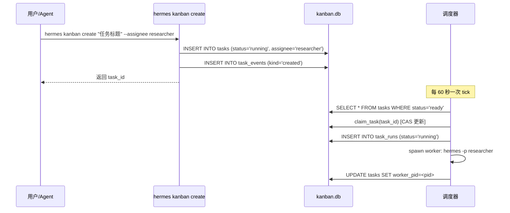
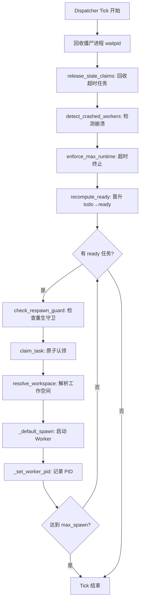
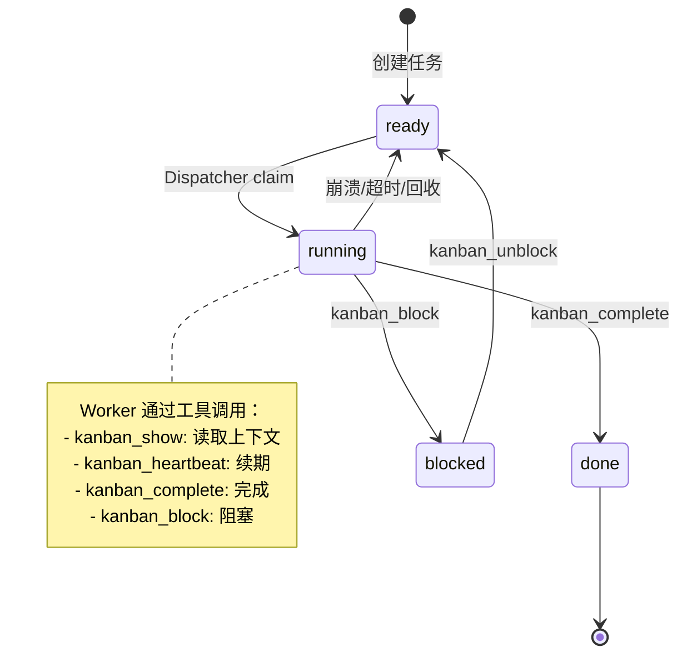
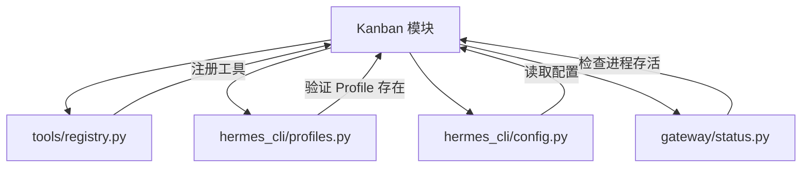

# Kanban / 多 Agent 任务板 技术设计方案

## 1. 模块定位

Kanban 模块是 Hermes Agent 系统中的**多 Profile 协作任务调度系统**，负责：

- **任务生命周期管理**：创建、分配、执行、完成任务的全流程
- **跨 Profile 协作**：多个 Agent Profile 通过共享任务板协同工作
- **自动化调度**：Dispatcher 自动认领 ready 任务并启动对应的 Worker
- **依赖关系管理**：支持任务间的父子依赖，自动晋升满足条件的任务
- **工作空间隔离**：为每个任务提供独立的工作目录（scratch/worktree/dir）

**不负责的内容**：
- 不负责 Agent 的具体执行逻辑（由各 Profile 的 Worker 负责）
- 不负责工具调用的实现（由 `tools/` 模块负责）
- 不负责 UI 展示（由 Dashboard 负责）

**来源**：`hermes_cli/kanban_db.py:1-69`

---

## 2. 核心能力

1. **任务状态机管理**
   - 支持 8 种状态：`triage` → `todo` → `ready` → `running` → `done`/`blocked`/`archived`
   - 自动状态转换：依赖满足时 `todo` → `ready`，认领时 `ready` → `running`

2. **原子化任务认领（Claim）**
   - 基于 SQLite WAL + CAS（Compare-And-Swap）实现无锁并发
   - TTL 机制：默认 15 分钟，超时自动回收

3. **多 Board 支持**
   - 每个 Board 独立的 DB、工作空间、日志目录
   - 支持项目/团队级别的任务隔离

4. **失败重试与熔断**
   - 统一失败计数器：spawn_failed / crashed / timed_out 累计
   - 达到阈值（默认 2 次）自动 block，防止无限重试

5. **工具化 API**
   - Worker 通过 `kanban_tools.py` 提供的工具调用生命周期方法
   - 支持 `kanban_complete`、`kanban_block`、`kanban_heartbeat` 等

**来源**：
- `hermes_cli/kanban_db.py:96-133` (状态常量)
- `tools/kanban_tools.py:1-28` (工具说明)
- `hermes_cli/kanban_db.py:2156-2268` (claim_task 实现)

---

## 3. 关键入口文件

| 文件路径 | 主要类/函数 | 作用 | 为什么重要 |
|---------|-----------|------|-----------|
| `hermes_cli/kanban_db.py` | `dispatch_once()` | 调度器核心：回收、晋升、认领、启动 Worker | 整个自动化调度的心脏 |
| `hermes_cli/kanban_db.py` | `Task`, `Run`, `Comment`, `Event` | 数据模型 | 定义任务、运行记录、评论、事件的结构 |
| `hermes_cli/kanban_db.py` | `claim_task()`, `complete_task()`, `block_task()` | 任务生命周期 API | Worker 和 Dispatcher 的核心交互接口 |
| `tools/kanban_tools.py` | `_handle_complete()`, `_handle_block()`, `_handle_show()` | 工具处理器 | Agent 通过工具调用操作任务 |
| `hermes_cli/kanban.py` | `kanban_command()`, `build_parser()` | CLI 入口 | 人工操作任务的命令行界面 |
| `hermes_cli/kanban.py` | `run_slash()` | Slash 命令解析 | 在 Chat 中通过 `/kanban` 操作 |

**来源**：
- `hermes_cli/kanban_db.py:4702-5001` (dispatch_once)
- `hermes_cli/kanban_db.py:600-802` (数据类)
- `tools/kanban_tools.py:255-771` (工具处理器)
- `hermes_cli/kanban.py:803-933` (CLI 入口)

---

## 4. 运行时流程

### 4.1 任务创建与分配流程



**来源**：`hermes_cli/kanban.py:1266-1327` (create 命令)

### 4.2 Dispatcher 调度循环



**来源**：`hermes_cli/kanban_db.py:4702-5001` (dispatch_once 完整实现)

### 4.3 Worker 生命周期



**来源**：
- `tools/kanban_tools.py:392-511` (complete 处理)
- `tools/kanban_tools.py:514-549` (block 处理)
- `tools/kanban_tools.py:552-600` (heartbeat 处理)

---

## 5. 核心数据结构 / 状态

### 5.1 数据库表结构

**tasks 表**（主表）
```sql
CREATE TABLE tasks (
    id                   TEXT PRIMARY KEY,      -- 任务 ID (t_<random>)
    title                TEXT NOT NULL,         -- 任务标题
    body                 TEXT,                  -- 任务描述
    assignee             TEXT,                  -- 分配的 Profile 名称
    status               TEXT NOT NULL,         -- 状态机：triage/todo/ready/running/blocked/done/archived
    priority             INTEGER DEFAULT 0,     -- 优先级（越高越先执行）
    workspace_kind       TEXT NOT NULL,         -- 工作空间类型：scratch/worktree/dir
    workspace_path       TEXT,                  -- 工作空间路径
    claim_lock           TEXT,                  -- 认领锁：<hostname>:<uuid>
    claim_expires        INTEGER,               -- 认领过期时间戳
    consecutive_failures INTEGER DEFAULT 0,     -- 连续失败次数
    worker_pid           INTEGER,               -- Worker 进程 PID
    current_run_id       INTEGER,               -- 当前运行记录 ID
    max_runtime_seconds  INTEGER,               -- 最大运行时间
    last_heartbeat_at    INTEGER,               -- 最后心跳时间
    skills               TEXT,                  -- 强制加载的技能（JSON 数组）
    max_retries          INTEGER,               -- 最大重试次数覆盖
    session_id           TEXT,                  -- 创建会话 ID
    ...
);
```

**task_runs 表**（运行记录）
```sql
CREATE TABLE task_runs (
    id                  INTEGER PRIMARY KEY,
    task_id             TEXT NOT NULL,
    profile             TEXT,                   -- 执行的 Profile
    status              TEXT NOT NULL,          -- running/done/crashed/...
    outcome             TEXT,                   -- completed/blocked/crashed/timed_out/gave_up
    summary             TEXT,                   -- 结构化交接摘要
    metadata            TEXT,                   -- JSON 元数据
    error               TEXT,                   -- 错误信息
    worker_pid          INTEGER,
    started_at          INTEGER NOT NULL,
    ended_at            INTEGER,
    ...
);
```

**task_links 表**（依赖关系）
```sql
CREATE TABLE task_links (
    parent_id  TEXT NOT NULL,
    child_id   TEXT NOT NULL,
    PRIMARY KEY (parent_id, child_id)
);
```

**来源**：`hermes_cli/kanban_db.py:808-945` (完整 schema)

### 5.2 关键数据类

```python
@dataclass
class Task:
    id: str
    title: str
    status: str                    # triage/todo/ready/running/blocked/done/archived
    assignee: Optional[str]
    workspace_kind: str            # scratch/worktree/dir
    workspace_path: Optional[str]
    claim_lock: Optional[str]      # <hostname>:<uuid>
    claim_expires: Optional[int]
    consecutive_failures: int      # 统一失败计数器
    worker_pid: Optional[int]
    current_run_id: Optional[int]
    skills: Optional[list]         # 强制加载的技能
    ...

@dataclass
class Run:
    id: int
    task_id: str
    profile: Optional[str]
    status: str                    # running/done/crashed/...
    outcome: Optional[str]         # completed/blocked/crashed/timed_out/gave_up
    summary: Optional[str]         # 交接摘要
    metadata: Optional[dict]       # 结构化元数据
    error: Optional[str]
    worker_pid: Optional[int]
    started_at: int
    ended_at: Optional[int]
    ...
```

**来源**：`hermes_cli/kanban_db.py:600-783` (数据类定义)

### 5.3 状态机

```
有效状态：
- triage:    待细化（需要 specifier 补充细节）
- todo:      待执行（等待依赖完成）
- scheduled: 已调度（等待时间触发，非人工输入）
- ready:     就绪（可被 Dispatcher 认领）
- running:   运行中（Worker 正在执行）
- blocked:   阻塞（需要人工介入）
- review:    审查中（PR 已创建，等待审查）
- done:      已完成
- archived:  已归档
```

**来源**：`hermes_cli/kanban_db.py:97` (VALID_STATUSES)

---

## 6. 与其他模块的关系

### 6.1 依赖的模块



**关键依赖**：
- `tools/registry.py`：注册 `kanban_*` 工具供 Agent 调用
- `hermes_cli/profiles.py`：验证 assignee 是否为有效 Profile
- `hermes_cli/config.py`：读取 `kanban.dispatch_interval_seconds` 等配置
- `gateway/status.py`：检查 Worker PID 是否存活（`_pid_exists`）

**来源**：
- `tools/kanban_tools.py:36` (registry 导入)
- `hermes_cli/kanban_db.py:4843-4847` (profile_exists 调用)
- `hermes_cli/kanban_db.py:3811` (_pid_exists 调用)

### 6.2 被调用的场景

```mermaid
graph LR
    CLI[hermes kanban CLI] --> KanbanDB[kanban_db.py]
    Dashboard[Dashboard Web UI] --> KanbanDB
    Agent[Agent Worker] --> KanbanTools[kanban_tools.py]
    Gateway[Gateway Dispatcher] --> KanbanDB
    SlashCmd[/kanban 命令] --> KanbanCLI[kanban.py run_slash]
    
    KanbanTools --> KanbanDB
    KanbanCLI --> KanbanDB
```

**调用路径**：
1. **CLI 路径**：`hermes kanban create` → `kanban.py:kanban_command()` → `kanban_db.create_task()`
2. **Agent 工具路径**：Agent 调用 `kanban_complete` → `kanban_tools._handle_complete()` → `kanban_db.complete_task()`
3. **Dispatcher 路径**：Gateway 定时器 → `kanban_db.dispatch_once()` → `_default_spawn()`
4. **Slash 命令路径**：Chat 输入 `/kanban list` → `kanban.py:run_slash()` → `kanban_command()`

**来源**：
- `hermes_cli/kanban.py:803-933` (CLI 入口)
- `tools/kanban_tools.py:392-511` (工具处理器)

### 6.3 边界说明

**Kanban 模块的边界**：
- **负责**：任务的创建、状态转换、认领、调度、失败重试
- **不负责**：
  - Agent 的具体执行逻辑（由 Worker Profile 负责）
  - 工具的实现细节（由 `tools/` 各模块负责）
  - UI 渲染（由 Dashboard 负责）
  - 网络通信（由 Gateway 负责）

**与 Agent Runtime 的交互**：
- Dispatcher 通过 `subprocess.Popen` 启动 Worker：`hermes -p <profile> --skills kanban-worker`
- Worker 通过环境变量接收上下文：`HERMES_KANBAN_TASK`, `HERMES_KANBAN_RUN_ID`, `HERMES_KANBAN_CLAIM_LOCK`
- Worker 通过工具调用报告状态：`kanban_complete`, `kanban_block`, `kanban_heartbeat`

**来源**：`hermes_cli/kanban_db.py:5200-5350` (_default_spawn 实现)

---

## 7. 错误处理与降级策略

### 7.1 失败重试机制

**统一失败计数器**（`consecutive_failures`）：
- 累计以下失败类型：
  - `spawn_failed`：Worker 启动失败
  - `crashed`：Worker 进程崩溃（PID 消失）
  - `timed_out`：超过 `max_runtime_seconds`
- 达到阈值（默认 2 次）自动 block，发出 `gave_up` 事件
- 仅在成功完成时重置为 0

**来源**：`hermes_cli/kanban_db.py:4361-4512` (_record_task_failure)

### 7.2 熔断策略

**自动 Block 条件**：
1. **连续失败达到阈值**：`consecutive_failures >= failure_limit`（默认 2）
2. **协议违规**：Worker 干净退出（exit 0）但未调用 `kanban_complete`/`kanban_block`
3. **系统性错误**：同一错误指纹在一次 tick 中出现 ≥3 次

**来源**：`hermes_cli/kanban_db.py:4329-4358` (detect_crashed_workers 中的熔断逻辑)

### 7.3 重生守卫（Respawn Guard）

防止无意义的重复启动，以下情况跳过本次 spawn：

1. **`blocker_auth`**：最后失败包含 quota/auth/429/403 等关键词
2. **`recent_success`**：1 小时内有成功完成的 run
3. **`active_pr`**：24 小时内评论中有 GitHub PR URL

**来源**：`hermes_cli/kanban_db.py:4576-4642` (check_respawn_guard)

### 7.4 超时处理

**Claim TTL**：
- 默认 15 分钟（`DEFAULT_CLAIM_TTL_SECONDS`）
- 可通过 `HERMES_KANBAN_CLAIM_TTL_SECONDS` 环境变量覆盖
- 超时后 `release_stale_claims()` 自动回收

**Max Runtime**：
- 任务级别：`task.max_runtime_seconds`
- Dispatcher 在每次 tick 检查，超时则 SIGTERM → SIGKILL

**来源**：
- `hermes_cli/kanban_db.py:109-133` (TTL 解析)
- `hermes_cli/kanban_db.py:3850-3900` (_terminate_reclaimed_worker)

### 7.5 崩溃检测

**PID 存活检查**：
- POSIX：`os.kill(pid, 0)` + `/proc/<pid>/status` 检查僵尸进程
- Windows：`OpenProcess` + `WaitForSingleObject`
- 检测到崩溃后：
  - 关闭当前 run（`outcome='crashed'`）
  - 增加 `consecutive_failures`
  - 达到阈值则自动 block

**来源**：`hermes_cli/kanban_db.py:3786-3847` (_pid_alive)

### 7.6 降级策略

**Board 隔离**：
- 每个 Board 独立的 DB、工作空间、日志
- 一个 Board 损坏不影响其他 Board

**DB 损坏检测**：
- 启动时检查 SQLite header（`_validate_sqlite_header`）
- 检测到 TLS record 等异常则拒绝连接

**Dispatcher 健康检查**：
- 连续 N 次 tick 有 ready 任务但 0 spawn → 发出警告
- 区分 "真正卡住" vs "正确空闲"（control-plane lanes）

**来源**：
- `hermes_cli/kanban_db.py:973-1000` (_validate_sqlite_header)
- `hermes_cli/kanban.py:2116-2147` (daemon 健康检查)

---

## 8. 关键设计决策

### 8.1 为什么用 SQLite 而非分布式锁？

**原因**：
- SQLite WAL 模式 + `BEGIN IMMEDIATE` 提供原子性
- CAS 更新（`UPDATE ... WHERE status='ready' AND claim_lock IS NULL`）天然防止竞争
- 单机部署足够，无需引入 Redis/etcd 等外部依赖

**来源**：`hermes_cli/kanban_db.py:60-68` (并发策略说明)

### 8.2 为什么 Worker 通过工具调用而非直接写 DB？

**原因**：
1. **权限隔离**：Worker 不需要直接访问 DB 文件
2. **跨后端兼容**：Docker/Modal/SSH 后端中 Worker 可能无法访问 `~/.hermes/kanban.db`
3. **结构化参数**：工具调用避免 shell 引号转义问题
4. **更好的错误处理**：工具返回结构化 JSON，模型可推理

**来源**：`tools/kanban_tools.py:9-27` (工具设计说明)

### 8.3 为什么需要 task_runs 表？

**原因**：
- 支持重试：一个 task 可能有多次 run
- 审计追踪：记录每次尝试的 profile、outcome、summary、error
- 结构化交接：`summary` 和 `metadata` 供下游 Worker 读取

**来源**：`hermes_cli/kanban_db.py:731-783` (Run 数据类)

### 8.4 为什么统一失败计数器？

**历史问题**：
- 旧版只计数 spawn 失败，Worker 启动后反复超时/崩溃不会触发熔断
- 导致无限重试循环

**新设计**：
- `consecutive_failures` 统一计数所有非成功结果
- 仅在 `complete_task` 时重置
- 防止任何类型的失败循环

**来源**：`hermes_cli/kanban_db.py:622-629` (consecutive_failures 注释)

---

## 9. 扩展点

### 9.1 自定义 Spawn 函数

Dispatcher 支持注入自定义 `spawn_fn`：

```python
def custom_spawn(task: Task, workspace: str, board: Optional[str] = None) -> Optional[int]:
    # 自定义启动逻辑（如 Docker、K8s）
    return pid

dispatch_once(conn, spawn_fn=custom_spawn)
```

**来源**：`hermes_cli/kanban_db.py:4895-4909` (spawn_fn 调用)

### 9.2 自定义工作空间类型

当前支持：
- `scratch`：临时目录
- `worktree`：Git worktree
- `dir`：指定目录

可扩展：修改 `resolve_workspace()` 添加新类型（如 S3、NFS）

**来源**：`hermes_cli/kanban_db.py:3513-3574` (resolve_workspace)

### 9.3 自定义失败阈值

**全局配置**：
```yaml
# config.yaml
kanban:
  failure_limit: 3  # 默认 2
```

**任务级覆盖**：
```bash
hermes kanban create "任务" --max-retries 1  # 首次失败即 block
```

**来源**：`hermes_cli/kanban_db.py:4406-4430` (failure_limit 解析)

---

## 10. 性能考虑

### 10.1 索引优化

关键索引：
```sql
CREATE INDEX idx_tasks_assignee_status ON tasks(assignee, status);
CREATE INDEX idx_tasks_status ON tasks(status);
CREATE INDEX idx_runs_task ON task_runs(task_id, started_at);
```

**来源**：`hermes_cli/kanban_db.py:936-945` (索引定义)

### 10.2 查询优化

- `dispatch_once` 中的 ready 查询按 `priority DESC, created_at ASC` 排序
- 使用 `LIMIT` 避免全表扫描
- `recompute_ready` 仅处理 `todo`/`blocked` 状态

**来源**：`hermes_cli/kanban_db.py:4807-4811` (ready 查询)

### 10.3 日志轮转

Worker 日志超过 2 MiB 自动轮转，保留 1 个备份

**来源**：`hermes_cli/kanban_db.py:3644-3647` (日志轮转常量)

---

## 11. 安全考虑

### 11.1 路径遍历防护

所有 `workspace_path` 必须是绝对路径，拒绝相对路径：

```python
if not p.is_absolute():
    raise ValueError("workspace paths must be absolute")
```

**来源**：`hermes_cli/kanban_db.py:3540-3544` (路径验证)

### 11.2 Worker 隔离

- 每个 Worker 通过 `start_new_session=True` 启动，脱离控制终端
- 环境变量注入：`HERMES_KANBAN_TASK`, `HERMES_KANBAN_RUN_ID`
- Worker 只能操作自己的任务（`_enforce_worker_task_ownership`）

**来源**：`tools/kanban_tools.py:132-162` (ownership 检查)

### 11.3 SQL 注入防护

所有查询使用参数化：

```python
conn.execute("SELECT * FROM tasks WHERE id = ?", (task_id,))
```

**来源**：整个 `kanban_db.py` 中的查询

---

## 12. 监控与可观测性

### 12.1 事件日志

所有状态变更记录到 `task_events` 表：
- `created`, `claimed`, `completed`, `blocked`, `crashed`, `timed_out`, `gave_up`, `promoted`, `respawn_guarded`

**来源**：`hermes_cli/kanban_db.py:882-889` (task_events 表)

### 12.2 运行记录

每次尝试记录到 `task_runs` 表，包含：
- `outcome`：completed/blocked/crashed/timed_out/gave_up
- `summary`：结构化交接摘要
- `error`：错误信息
- `metadata`：自定义元数据

**来源**：`hermes_cli/kanban_db.py:898-918` (task_runs 表)

### 12.3 诊断工具

```bash
# 查看任务详情
hermes kanban show <task_id>

# 查看运行历史
hermes kanban runs <task_id>

# 查看 Worker 日志
hermes kanban log <task_id>

# 实时监控事件
hermes kanban watch
```

**来源**：`hermes_cli/kanban.py:407-619` (CLI 命令定义)

---

## 13. 总结

Kanban 模块是 Hermes Agent 的**任务调度核心**，通过以下设计实现高可靠性：

1. **原子化并发控制**：SQLite WAL + CAS 无锁认领
2. **统一失败处理**：熔断机制防止无限重试
3. **工具化 API**：Worker 通过工具调用操作任务，跨后端兼容
4. **多 Board 隔离**：支持多项目/团队并行工作
5. **完善的可观测性**：事件日志、运行记录、诊断工具

**核心文件**：
- `hermes_cli/kanban_db.py`：数据库操作、调度器、生命周期管理（5000+ 行）
- `tools/kanban_tools.py`：工具化 API（1300+ 行）
- `hermes_cli/kanban.py`：CLI 入口（2600+ 行）

**关键流程**：
1. 创建任务 → 2. Dispatcher 认领 → 3. 启动 Worker → 4. Worker 执行 → 5. 报告结果 → 6. 状态转换

**扩展建议**：
- 支持分布式调度（多 Dispatcher 实例）
- 支持任务优先级动态调整
- 支持更细粒度的权限控制
