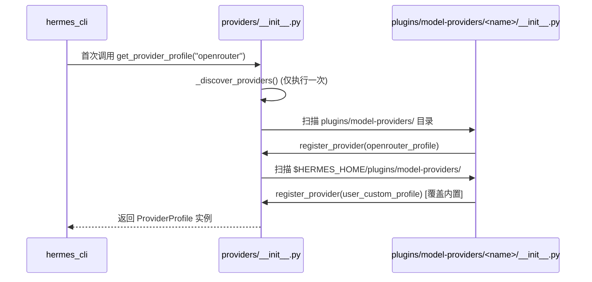
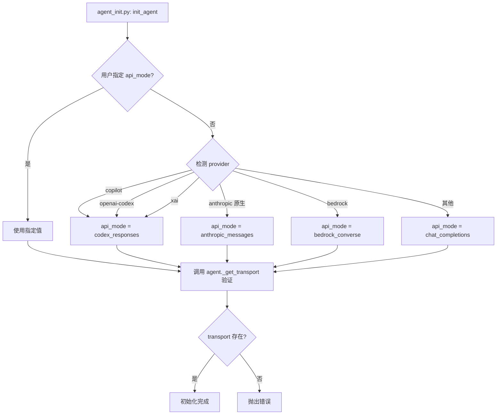

# LLM Transport / API 适配层技术设计方案

> **文档版本**: v1.0  
> **创建日期**: 2026-05-26  
> **目标读者**: 准备参与 Hermes Agent 开发的工程师  
> **源码版本**: 基于 hermes-agent main 分支 (commit 1264fab15)

---

## 1. 模块定位

### 1.1 核心职责

LLM Transport / API 适配层是 Hermes Agent 中负责**统一多种 LLM 提供商 API 差异**的抽象层，其核心职责包括：

1. **Provider Profile 管理**：声明式定义每个 LLM 提供商的元数据（认证方式、端点、默认参数、quirks）
2. **Transport 协议适配**：将 OpenAI 格式的消息/工具定义转换为各提供商的原生格式（Anthropic Messages API、OpenAI Responses API、AWS Bedrock Converse 等）
3. **响应标准化**：将各提供商的原生响应统一转换为 `NormalizedResponse` 类型
4. **请求参数构建**：根据提供商特性动态组装 API 请求参数（reasoning config、temperature、max_tokens、extra_body 等）

### 1.2 不负责的内容

- **客户端生命周期管理**：OpenAI/Anthropic SDK 客户端的创建、连接池、关闭由 `AIAgent` 负责
- **流式响应处理**：SSE 流解析、增量 delta 处理由 `AIAgent._run_codex_stream()` / `_anthropic_messages_create()` 负责
- **重试与降级**：API 调用失败重试、凭证轮换、提供商 fallback 由 `AIAgent` 的 `interruptible_api_call()` 负责
- **Prompt 缓存**：缓存键生成、缓存统计收集由 `AIAgent` 负责
- **工具调用执行**：工具函数的实际执行由 `tools/` 模块负责

---

## 2. 核心能力

### 2.1 Provider Profile 插件化注册

- **插件式发现**：从 `plugins/model-providers/<name>/` 和 `$HERMES_HOME/plugins/model-providers/<name>/` 自动发现并加载提供商配置
- **声明式配置**：通过 `ProviderProfile` dataclass 声明认证方式、端点 URL、默认模型、温度策略等
- **用户覆盖**：用户插件可覆盖内置插件（last-writer-wins），无需修改源码
- **别名支持**：支持多个别名指向同一提供商（如 `google` → `gemini`）

**来源**：`providers/__init__.py:140-192` (`_discover_providers`)、`providers/base.py:38-185` (`ProviderProfile`)

### 2.2 多协议 Transport 适配

支持 4 种主流 LLM API 协议：

| api_mode | 协议 | 代表提供商 | Transport 类 |
|----------|------|-----------|-------------|
| `chat_completions` | OpenAI Chat Completions API | OpenRouter, Nous, NVIDIA, Qwen, Ollama, DeepSeek, xAI, Kimi 等 16+ 提供商 | `ChatCompletionsTransport` |
| `anthropic_messages` | Anthropic Messages API | Anthropic Claude (原生)、Vertex AI | `AnthropicTransport` |
| `codex_responses` | OpenAI Responses API | OpenAI Codex (ChatGPT OAuth)、GitHub Copilot、xAI Grok | `ResponsesApiTransport` |
| `bedrock_converse` | AWS Bedrock Converse API | AWS Bedrock (Claude, Llama, Mistral 等) | `BedrockTransport` |

**来源**：`agent/transports/__init__.py:49-68` (transport 注册)、`agent/transports/base.py:16-90` (`ProviderTransport` ABC)

### 2.3 消息格式转换

- **OpenAI → Anthropic**：提取 `system` 消息为独立参数，转换 `tool_use` / `tool_result` 格式
- **OpenAI → Responses API**：转换为 `input` items 列表，处理 `reasoning_items` 加密内容回放
- **Codex 字段清理**：移除 `codex_reasoning_items`、`call_id`、`response_item_id` 等内部字段，避免严格提供商（Fireworks、Kimi）拒绝请求

**来源**：`agent/transports/chat_completions.py:112-169` (`convert_messages`)、`agent/anthropic_adapter.py` (Anthropic 转换逻辑)

### 2.4 响应标准化

将各提供商的原生响应统一转换为 `NormalizedResponse`：

```python
@dataclass
class NormalizedResponse:
    content: str | None              # 文本内容
    tool_calls: list[ToolCall] | None  # 工具调用列表
    finish_reason: str               # "stop" | "tool_calls" | "length" | "content_filter"
    reasoning: str | None            # 推理过程（thinking）
    usage: Usage | None              # token 使用统计
    provider_data: dict | None       # 提供商特定数据（reasoning_details、codex_reasoning_items 等）
```

**来源**：`agent/transports/types.py:89-133` (`NormalizedResponse`)、`agent/transports/anthropic.py:80-131` (`normalize_response`)

### 2.5 提供商特定 Quirks 处理

通过 `ProviderProfile` 的钩子方法处理提供商特定逻辑：

- **`prepare_messages()`**：消息预处理（Qwen 归一化为 list-of-parts、注入 cache_control）
- **`build_extra_body()`**：构建 `extra_body` 字段（OpenRouter provider prefs、Gemini thinking_config）
- **`build_api_kwargs_extras()`**：分离 top-level 和 extra_body 参数（Kimi 的 `reasoning_effort` 是 top-level，OpenRouter 的 `reasoning` 在 extra_body）
- **`fetch_models()`**：从提供商 API 获取模型列表（OpenRouter 公开目录、Anthropic OAuth 目录）

**来源**：`providers/base.py:95-184` (钩子方法定义)、`plugins/model-providers/openrouter/__init__.py:42-94` (OpenRouter 实现示例)

---

## 3. 关键入口文件

| 文件路径 | 主要类/函数 | 作用 | 为什么重要 |
|---------|-----------|------|-----------|
| `providers/base.py` | `ProviderProfile` (dataclass) | 提供商配置的基类，定义认证、端点、quirks 等字段 | 所有提供商配置的统一接口，下游所有层（auth、models、transport）都读取它 |
| `providers/__init__.py` | `register_provider()`, `get_provider_profile()`, `_discover_providers()` | 提供商注册表，负责插件发现和查询 | 系统启动时自动发现所有提供商插件，运行时通过 `get_provider_profile(name)` 获取配置 |
| `agent/transports/base.py` | `ProviderTransport` (ABC) | Transport 抽象基类，定义 `convert_messages()`, `convert_tools()`, `build_kwargs()`, `normalize_response()` | 所有 transport 实现的契约，确保不同协议的适配器有统一接口 |
| `agent/transports/__init__.py` | `register_transport()`, `get_transport()` | Transport 注册表，按 `api_mode` 查询 transport 实例 | 运行时根据 `agent.api_mode` 动态获取对应的 transport，支持渐进式迁移 |
| `agent/transports/types.py` | `NormalizedResponse`, `ToolCall`, `Usage` | 标准化响应的数据类型 | 定义跨提供商的统一响应格式，下游代码无需关心原始协议差异 |
| `agent/transports/chat_completions.py` | `ChatCompletionsTransport` | OpenAI Chat Completions API 的 transport 实现 | 处理 16+ OpenAI 兼容提供商，包含最复杂的 quirks 处理逻辑（Gemini thinking_config、Kimi reasoning_effort、Moonshot schema 等） |
| `agent/transports/anthropic.py` | `AnthropicTransport` | Anthropic Messages API 的 transport 实现 | 委托给 `agent/anthropic_adapter.py` 的现有函数，负责 system/messages 分离、thinking blocks 解析 |
| `agent/transports/codex.py` | `ResponsesApiTransport` | OpenAI Responses API 的 transport 实现 | 处理 Codex OAuth、GitHub Copilot、xAI Grok 的 Responses API 协议，支持 reasoning items 加密内容回放 |
| `plugins/model-providers/<name>/__init__.py` | 各提供商的 `ProviderProfile` 实例 | 声明式定义提供商配置（如 `openrouter`、`anthropic`、`gemini` 等） | 插件化扩展点，用户可在 `$HERMES_HOME/plugins/model-providers/` 添加自定义提供商而无需修改源码 |
| `agent/chat_completion_helpers.py` | `_build_api_kwargs()` | 构建 API 请求参数的主入口 | 调用 transport 的 `build_kwargs()`，处理 temperature、max_tokens、reasoning_config 等参数，是请求发送前的最后一道门 |
| `agent/auxiliary_client.py` | `call_llm()`, `_resolve_auxiliary_provider()` | 辅助任务（压缩、搜索、视觉）的 LLM 调用路由 | 独立的 provider 解析链，支持 fallback（主提供商 → OpenRouter → Nous → Anthropic → ...） |

---

## 4. 运行时流程

### 4.1 系统启动时：Provider 发现与注册



**关键代码路径**：
1. `providers/__init__.py:140-192` (`_discover_providers`)
2. `plugins/model-providers/openrouter/__init__.py:97-106` (注册示例)

### 4.2 Agent 初始化时：api_mode 检测



**关键代码路径**：
- `agent/agent_init.py:292-323` (api_mode 检测逻辑)
- `agent/agent_init.py:326-328` (transport 验证)

### 4.3 API 调用时：请求构建与响应标准化

```mermaid
sequenceDiagram
    participant Loop as conversation_loop.py
    participant Agent as AIAgent
    participant Helper as chat_completion_helpers.py
    participant Transport as agent/transports/
    participant Profile as ProviderProfile
    participant SDK as OpenAI/Anthropic SDK
    
    Loop->>Agent: 发起 API 调用
    Agent->>Helper: _build_api_kwargs(messages, tools)
    Helper->>Profile: get_provider_profile(agent.provider)
    Profile-->>Helper: 返回 ProviderProfile 实例
    Helper->>Transport: get_transport(agent.api_mode)
    Transport-->>Helper: 返回 ChatCompletionsTransport 实例
    Helper->>Transport: transport.build_kwargs(model, messages, tools, provider_profile=profile)
    Transport->>Profile: profile.prepare_messages(messages)
    Profile-->>Transport: 预处理后的 messages
    Transport->>Profile: profile.build_extra_body(session_id, ...)
    Profile-->>Transport: extra_body dict
    Transport->>Profile: profile.build_api_kwargs_extras(reasoning_config, ...)
    Profile-->>Transport: (extra_body_additions, top_level_kwargs)
    Transport-->>Helper: 完整的 api_kwargs
    Helper->>Agent: 返回 api_kwargs
    Agent->>SDK: client.chat.completions.create(**api_kwargs)
    SDK-->>Agent: 原始响应
    Agent->>Transport: transport.normalize_response(response)
    Transport-->>Agent: NormalizedResponse
    Agent->>Loop: 返回标准化响应
```

**关键代码路径**：
1. `agent/chat_completion_helpers.py:79-112` (`interruptible_api_call` 入口)
2. `agent/chat_completion_helpers.py:407-445` (`_build_api_kwargs` 调用 transport)
3. `agent/transports/chat_completions.py:175-406` (`build_kwargs` 主逻辑)
4. `agent/transports/chat_completions.py:408-499` (`_build_kwargs_from_profile` 使用 ProviderProfile)
5. `agent/transports/chat_completions.py:501-600` (`normalize_response` 标准化)

### 4.4 Provider Profile 路径 vs Legacy 路径

从 `build_kwargs()` 的实现可以看到两条路径：

```python
# agent/transports/chat_completions.py:229-234
_profile = params.get("provider_profile")
if _profile:
    return self._build_kwargs_from_profile(_profile, model, sanitized, tools, params)

# Legacy fallback (unregistered / unknown provider)
# 仅当 get_provider_profile() 返回 None 时才走这里
```

**Profile 路径**（推荐，所有已知提供商）：
- 从 `ProviderProfile` 读取所有配置
- 调用 `profile.prepare_messages()` / `build_extra_body()` / `build_api_kwargs_extras()`
- 无需硬编码 `is_openrouter` / `is_kimi` 等 flag

**Legacy 路径**（仅用于未注册的 custom provider）：
- 依赖传入的 boolean flags (`is_openrouter`, `is_kimi`, `is_nvidia_nim` 等)
- 硬编码各提供商的 quirks
- 逐步被 Profile 路径替代

**来源**：`agent/transports/chat_completions.py:229-406` (Legacy 路径)、`408-499` (Profile 路径)

---

## 5. 核心数据结构 / 状态

### 5.1 ProviderProfile (providers/base.py:38-185)

```python
@dataclass
class ProviderProfile:
    # ── Identity ─────────────────────────────────────────────
    name: str                        # 提供商唯一标识，如 "openrouter"
    api_mode: str = "chat_completions"  # 使用的 API 协议
    aliases: tuple = ()              # 别名，如 ("or",)
    
    # ── Human-readable metadata ───────────────────────────────
    display_name: str = ""           # UI 显示名称，如 "OpenRouter"
    description: str = ""            # 描述，显示在 setup picker
    signup_url: str = ""             # 注册链接
    
    # ── Auth & endpoints ─────────────────────────────────────
    env_vars: tuple = ()             # 环境变量，如 ("OPENROUTER_API_KEY",)
    base_url: str = ""               # API 端点，如 "https://openrouter.ai/api/v1"
    models_url: str = ""             # 模型列表端点（可选）
    auth_type: str = "api_key"       # 认证类型：api_key | oauth_device_code | copilot | aws_sdk
    supports_health_check: bool = True  # 是否支持 /models 健康检查
    
    # ── Model catalog ─────────────────────────────────────────
    fallback_models: tuple = ()      # 当 fetch_models() 失败时的备用模型列表
    hostname: str = ""               # 用于 URL → provider 反向映射
    
    # ── Client-level quirks ───────────────────────────────────
    default_headers: dict[str, str] = field(default_factory=dict)  # 默认请求头
    
    # ── Request-level quirks ─────────────────────────────────
    fixed_temperature: Any = None    # 固定温度值，或 OMIT_TEMPERATURE 表示不发送
    default_max_tokens: int | None = None  # 默认 max_tokens
    default_aux_model: str = ""      # 辅助任务使用的廉价模型
```

### 5.2 NormalizedResponse (agent/transports/types.py:89-133)

```python
@dataclass
class NormalizedResponse:
    content: str | None              # 文本内容（拼接所有 text blocks）
    tool_calls: list[ToolCall] | None  # 工具调用列表
    finish_reason: str               # 停止原因："stop" | "tool_calls" | "length" | "content_filter"
    reasoning: str | None            # 推理过程（Anthropic thinking blocks、Codex reasoning items）
    usage: Usage | None              # token 使用统计
    provider_data: dict | None       # 提供商特定数据：
                                     # - Anthropic: {"reasoning_details": [...]}
                                     # - Codex: {"codex_reasoning_items": [...], "codex_message_items": [...]}
```

### 5.3 ToolCall (agent/transports/types.py:18-77)

```python
@dataclass
class ToolCall:
    id: str | None                   # 工具调用 ID（OpenAI: call_XXX, Anthropic: toolu_XXX）
    name: str                        # 工具名称
    arguments: str                   # JSON 字符串形式的参数
    provider_data: dict | None       # 提供商特定数据：
                                     # - Codex: {"call_id": "call_XXX", "response_item_id": "fc_XXX"}
                                     # - Gemini: {"extra_content": {"google": {"thought_signature": "..."}}}
```

### 5.4 Transport 注册表 (agent/transports/__init__.py:17-46)

```python
_REGISTRY: dict = {}  # {api_mode: transport_cls}
_discovered: bool = False

# 示例内容（自动发现后）：
# {
#     "chat_completions": ChatCompletionsTransport,
#     "anthropic_messages": AnthropicTransport,
#     "codex_responses": ResponsesApiTransport,
#     "bedrock_converse": BedrockTransport,
# }
```

### 5.5 Provider 注册表 (providers/__init__.py:43-88)

```python
_REGISTRY: dict[str, ProviderProfile] = {}  # {name: profile}
_ALIASES: dict[str, str] = {}               # {alias: canonical_name}
_discovered = False

# 示例内容（自动发现后）：
# _REGISTRY = {
#     "openrouter": OpenRouterProfile(...),
#     "anthropic": AnthropicProfile(...),
#     "gemini": GeminiProfile(...),
#     ...
# }
# _ALIASES = {
#     "or": "openrouter",
#     "google": "gemini",
#     "claude": "anthropic",
#     ...
# }
```

---

## 6. 与其他模块的关系

### 6.1 依赖的模块

| 模块 | 依赖关系 | 边界 |
|------|---------|------|
| `hermes_cli/config.py` | 读取 `config.yaml` 中的 `model.provider`、`model.base_url`、`auxiliary.*` 配置 | Transport 层不直接读取配置，由 `AIAgent` 传入 |
| `hermes_cli/auth.py` | 从 `PROVIDER_REGISTRY` 读取 `env_vars` 字段，构建认证配置 | Transport 层不处理认证，仅声明需要哪些环境变量 |
| `hermes_cli/models.py` | 调用 `profile.fetch_models()` 获取模型列表 | Transport 层提供模型目录查询接口，但不负责模型选择 |
| `agent/anthropic_adapter.py` | `AnthropicTransport` 委托给该模块的转换函数 | 适配器函数是 Transport 的实现细节，外部不应直接调用 |
| `agent/codex_responses_adapter.py` | `ResponsesApiTransport` 委托给该模块的转换函数 | 同上 |
| `agent/model_metadata.py` | 通过 `profile.get_hostname()` 进行 URL → provider 反向映射 | Transport 层提供 hostname 信息，但不负责元数据查询 |

### 6.2 被调用的模块

| 调用方 | 调用接口 | 用途 |
|-------|---------|------|
| `agent/agent_init.py` | `get_provider_profile(name)` | Agent 初始化时获取提供商配置 |
| `agent/chat_completion_helpers.py` | `get_transport(api_mode)`, `transport.build_kwargs()`, `transport.normalize_response()` | 构建 API 请求、标准化响应 |
| `agent/auxiliary_client.py` | `get_provider_profile(name)` | 辅助任务路由时获取 `default_aux_model` |
| `hermes_cli/auth.py` | `list_providers()` | 枚举所有提供商，构建认证配置 |
| `hermes_cli/models.py` | `get_provider_profile(name)`, `profile.fetch_models()` | 获取模型列表 |
| `hermes_cli/doctor.py` | `list_providers()`, `profile.supports_health_check` | 健康检查时探测 `/models` 端点 |
| `hermes_cli/runtime_provider.py` | `profile.api_mode` | 当 URL 检测失败时，使用 profile 的 api_mode 作为 fallback |

### 6.3 模块边界

```
┌─────────────────────────────────────────────────────────────┐
│                      hermes_cli 层                           │
│  (config, auth, models, doctor, runtime_provider)           │
│  职责：配置管理、认证、模型选择、健康检查                      │
└────────────────────┬────────────────────────────────────────┘
                     │ 读取 ProviderProfile
                     ↓
┌─────────────────────────────────────────────────────────────┐
│              providers/ (Provider Profile 层)                │
│  职责：声明式定义提供商元数据、插件发现与注册                  │
└────────────────────┬────────────────────────────────────────┘
                     │ 传递 ProviderProfile
                     ↓
┌─────────────────────────────────────────────────────────────┐
│            agent/transports/ (Transport 层)                  │
│  职责：消息格式转换、请求参数构建、响应标准化                  │
└────────────────────┬────────────────────────────────────────┘
                     │ 返回 NormalizedResponse
                     ↓
┌─────────────────────────────────────────────────────────────┐
│                   agent/ (Agent 层)                          │
│  职责：客户端管理、流式处理、重试降级、工具调度                │
└─────────────────────────────────────────────────────────────┘
```

**关键边界**：
- **Provider Profile 层**：只负责"声明"提供商的特性，不执行 API 调用
- **Transport 层**：只负责"格式转换"和"参数构建"，不管理客户端生命周期
- **Agent 层**：负责"执行"API 调用、处理流式响应、重试降级

---

## 7. 错误处理与降级策略

### 7.1 Transport 层的错误处理

Transport 层**不负责重试和降级**，仅负责：

1. **格式验证**：`validate_response()` 检查响应结构是否有效
   - Anthropic: 允许空 `content` 当 `stop_reason == "end_turn"`
   - 来源：`agent/transports/anthropic.py:133-148`

2. **Finish Reason 映射**：`map_finish_reason()` 将提供商特定的停止原因映射为标准值
   - Anthropic: `"end_turn"` → `"stop"`, `"tool_use"` → `"tool_calls"`, `"max_tokens"` → `"length"`
   - 来源：`agent/transports/anthropic.py:162-173`

3. **Cache 统计提取**：`extract_cache_stats()` 提取缓存命中/创建 token 数
   - Anthropic: 读取 `usage.cache_read_input_tokens` / `cache_creation_input_tokens`
   - 来源：`agent/transports/anthropic.py:150-159`

### 7.2 Agent 层的重试与降级

由 `agent/chat_completion_helpers.py:79-112` (`interruptible_api_call`) 和 `agent/error_classifier.py` 负责：

1. **API 错误分类**：`classify_api_error()` 判断错误类型
   - `FailoverReason.PAYMENT_REQUIRED`：HTTP 402 或余额不足
   - `FailoverReason.RATE_LIMIT`：HTTP 429
   - `FailoverReason.AUTHENTICATION`：HTTP 401/403
   - `FailoverReason.STALE_CONNECTION`：连接超时/重置
   - 来源：`agent/error_classifier.py`

2. **自动 Fallback**：当主提供商失败时，自动切换到备用提供商
   - 辅助任务：`auxiliary_client.py` 的 auto-detection chain（主提供商 → OpenRouter → Nous → Anthropic → ...）
   - 主任务：用户需手动切换（`/model` 命令）
   - 来源：`agent/auxiliary_client.py:1-41` (注释说明)

3. **凭证轮换**：`agent/credential_pool.py` 管理多个 API key，失败时自动轮换
   - 来源：`agent/credential_pool.py`

### 7.3 提供商特定的兼容逻辑

Transport 层处理的兼容性问题：

1. **Codex 字段清理**：移除 `codex_reasoning_items`、`call_id`、`tool_name` 等内部字段
   - **原因**：严格提供商（Fireworks、Kimi）会拒绝包含未知字段的请求
   - 来源：`agent/transports/chat_completions.py:112-169`

2. **Moonshot/Kimi Schema 重写**：`sanitize_moonshot_tools()` 修复 JSON Schema
   - **原因**：Moonshot 使用更严格的 JSON Schema 验证
   - 来源：`agent/moonshot_schema.py`

3. **Gemini Thinking Config 转换**：`_build_gemini_thinking_config()` 将 Hermes 的 reasoning_config 转换为 Gemini 的 thinkingConfig
   - **原因**：Gemini 有独特的 thinking 配置格式（`includeThoughts`, `thinkingLevel`, `thinkingBudget`）
   - 来源：`agent/transports/chat_completions.py:22-75`

4. **Developer Role 替换**：GPT-5/Codex 模型将 `system` role 替换为 `developer`
   - **原因**：OpenAI 新模型使用 `developer` role 代替 `system`
   - 来源：`agent/transports/chat_completions.py:242-249`, `agent/prompt_builder.py` (DEVELOPER_ROLE_MODELS)

5. **Temperature 策略**：
   - Kimi: `OMIT_TEMPERATURE` (服务端管理温度)
   - 其他：使用 `profile.fixed_temperature` 或用户配置
   - 来源：`agent/transports/chat_completions.py:436-444`

### 7.4 权限校验

Transport 层**不负责权限校验**，由以下模块处理：

- **API Key 验证**：`hermes_cli/auth.py` 在启动时检查环境变量
- **模型访问权限**：`hermes_cli/models.py` 调用 `profile.fetch_models()` 获取可用模型列表
- **工具调用权限**：`agent/tool_guardrails.py` 在工具执行前检查

---

## 8. 扩展指南

### 8.1 添加新的 Provider

**场景**：添加一个新的 OpenAI 兼容提供商（如 `my-provider`）

**步骤**：

1. **创建插件目录**：
   ```bash
   mkdir -p plugins/model-providers/my-provider
   ```

2. **编写 `__init__.py`**：
   ```python
   # plugins/model-providers/my-provider/__init__.py
   from providers import register_provider
   from providers.base import ProviderProfile
   
   my_provider = ProviderProfile(
       name="my-provider",
       aliases=("mp",),
       display_name="My Provider",
       description="My custom LLM provider",
       signup_url="https://my-provider.example.com/signup",
       env_vars=("MY_PROVIDER_API_KEY",),
       base_url="https://api.my-provider.example.com/v1",
       api_mode="chat_completions",  # 使用标准 OpenAI 协议
       default_aux_model="my-provider/fast-model",  # 辅助任务使用的廉价模型
       fallback_models=(  # 当 fetch_models() 失败时的备用列表
           "my-provider/model-1",
           "my-provider/model-2",
       ),
   )
   
   register_provider(my_provider)
   ```

3. **创建 `plugin.yaml`**：
   ```yaml
   # plugins/model-providers/my-provider/plugin.yaml
   name: my-provider-profile
   kind: model-provider
   version: 1.0.0
   description: My Provider LLM API integration
   author: Your Name
   ```

4. **测试**：
   ```bash
   export MY_PROVIDER_API_KEY="your-key"
   hermes model  # 应该能看到 my-provider 出现在列表中
   hermes model my-provider:my-provider/model-1
   hermes  # 开始对话
   ```

**无需修改的文件**：
- `hermes_cli/auth.py`：自动从 `env_vars` 读取
- `hermes_cli/models.py`：自动调用 `profile.fetch_models()`
- `agent/transports/chat_completions.py`：自动使用 Profile 路径

### 8.2 添加 Provider 特定的 Quirks

**场景**：提供商需要特殊的 `extra_body` 字段或消息预处理

**步骤**：

1. **创建 ProviderProfile 子类**：
   ```python
   # plugins/model-providers/my-provider/__init__.py
   from typing import Any
   from providers import register_provider
   from providers.base import ProviderProfile
   
   class MyProviderProfile(ProviderProfile):
       def prepare_messages(self, messages: list[dict[str, Any]]) -> list[dict[str, Any]]:
           """消息预处理：例如注入特殊字段"""
           for msg in messages:
               if msg.get("role") == "user":
                   msg["my_custom_field"] = "value"
           return messages
       
       def build_extra_body(self, *, session_id: str | None = None, **context: Any) -> dict[str, Any]:
           """构建 extra_body"""
           body = {}
           if session_id:
               body["conversation_id"] = session_id
           # 添加提供商特定的配置
           body["my_provider_config"] = {"feature_x": True}
           return body
       
       def build_api_kwargs_extras(
           self,
           *,
           reasoning_config: dict | None = None,
           **context: Any,
       ) -> tuple[dict[str, Any], dict[str, Any]]:
           """分离 extra_body 和 top-level 参数"""
           extra_body = {}
           top_level = {}
           
           # 如果提供商需要 top-level reasoning_effort（类似 Kimi）
           if reasoning_config and reasoning_config.get("enabled") is not False:
               effort = reasoning_config.get("effort", "medium")
               top_level["reasoning_effort"] = effort
           
           return extra_body, top_level
   
   my_provider = MyProviderProfile(
       name="my-provider",
       # ... 其他配置
   )
   
   register_provider(my_provider)
   ```

2. **参考现有实现**：
   - OpenRouter: `plugins/model-providers/openrouter/__init__.py:14-95`
   - Gemini: `plugins/model-providers/gemini/__init__.py`
   - Qwen: `plugins/model-providers/qwen-oauth/__init__.py`

### 8.3 添加新的 Transport (新协议)

**场景**：添加对新 API 协议的支持（如 Google AI Studio 原生 API）

**步骤**：

1. **创建 Transport 类**：
   ```python
   # agent/transports/google_ai.py
   from typing import Any, Dict, List, Optional
   from agent.transports.base import ProviderTransport
   from agent.transports.types import NormalizedResponse, ToolCall, Usage
   
   class GoogleAITransport(ProviderTransport):
       @property
       def api_mode(self) -> str:
           return "google_ai"
       
       def convert_messages(self, messages: List[Dict[str, Any]], **kwargs) -> Any:
           """转换为 Google AI 格式"""
           # 实现转换逻辑
           pass
       
       def convert_tools(self, tools: List[Dict[str, Any]]) -> Any:
           """转换工具定义"""
           pass
       
       def build_kwargs(
           self,
           model: str,
           messages: List[Dict[str, Any]],
           tools: Optional[List[Dict[str, Any]]] = None,
           **params,
       ) -> Dict[str, Any]:
           """构建 API 请求参数"""
           converted_messages = self.convert_messages(messages)
           converted_tools = self.convert_tools(tools) if tools else None
           
           return {
               "model": model,
               "contents": converted_messages,
               "tools": converted_tools,
               # ... 其他参数
           }
       
       def normalize_response(self, response: Any, **kwargs) -> NormalizedResponse:
           """标准化响应"""
           # 解析 response，提取 content、tool_calls、finish_reason 等
           return NormalizedResponse(
               content=...,
               tool_calls=...,
               finish_reason=...,
               reasoning=...,
               usage=...,
           )
   
   # 自动注册
   from agent.transports import register_transport
   register_transport("google_ai", GoogleAITransport)
   ```

2. **更新 Provider Profile**：
   ```python
   # plugins/model-providers/google-ai/__init__.py
   my_provider = ProviderProfile(
       name="google-ai",
       api_mode="google_ai",  # 使用新的 api_mode
       # ...
   )
   ```

3. **更新 Agent 初始化逻辑**：
   ```python
   # agent/agent_init.py (在 api_mode 检测部分添加)
   if provider == "google-ai":
       agent.api_mode = "google_ai"
   ```

### 8.4 调试技巧

1. **查看实际发送的请求参数**：
   ```python
   # 在 agent/chat_completion_helpers.py:79 添加日志
   logger.debug(f"API kwargs: {json.dumps(api_kwargs, indent=2)}")
   ```

2. **查看 Provider Profile 内容**：
   ```python
   from providers import get_provider_profile
   profile = get_provider_profile("openrouter")
   print(profile)
   ```

3. **查看 Transport 注册表**：
   ```python
   from agent.transports import _REGISTRY
   print(_REGISTRY)
   ```

4. **测试 Transport 转换**：
   ```python
   from agent.transports import get_transport
   transport = get_transport("chat_completions")
   messages = [{"role": "user", "content": "Hello"}]
   result = transport.convert_messages(messages)
   print(result)
   ```

---

## 9. 常见问题

### Q1: 为什么有些提供商走 Profile 路径，有些走 Legacy 路径？

**A**: Profile 路径是新架构，逐步替代 Legacy 路径。所有在 `plugins/model-providers/` 中注册的提供商都走 Profile 路径。Legacy 路径仅用于：
- 未注册的 `custom` provider
- 测试时临时使用的端点

**来源**：`agent/transports/chat_completions.py:229-234`

### Q2: 如何判断一个提供商使用哪个 api_mode？

**A**: 检查顺序：
1. 用户显式指定：`hermes model --api-mode anthropic_messages`
2. Provider Profile 的 `api_mode` 字段
3. Agent 初始化时的自动检测逻辑（`agent/agent_init.py:292-323`）

### Q3: 为什么 Anthropic 有两条路径（原生 API 和 OpenRouter）？

**A**: 
- **原生 Anthropic**：`api_mode = "anthropic_messages"`，使用 Anthropic SDK，支持 thinking blocks、prompt caching
- **通过 OpenRouter/Nous**：`api_mode = "chat_completions"`，使用 OpenAI SDK，OpenRouter 会转换协议

**来源**：`agent/agent_init.py:308-314`

### Q4: 如何添加对新 reasoning 格式的支持？

**A**: 在 `ProviderProfile.build_api_kwargs_extras()` 中处理 `reasoning_config` 参数，参考：
- Kimi: top-level `reasoning_effort`（`plugins/model-providers/kimi-coding/__init__.py`）
- OpenRouter: `extra_body.reasoning`（`plugins/model-providers/openrouter/__init__.py:68-88`）
- Gemini: `thinking_config`（`agent/transports/chat_completions.py:22-75`）

### Q5: Transport 层可以访问 Agent 的状态吗？

**A**: 不可以。Transport 是无状态的，所有需要的信息通过 `build_kwargs()` 的 `params` 参数传入。这保证了 Transport 的可测试性和可复用性。

---

## 10. 参考资料

### 10.1 核心源码文件

- `providers/base.py` - ProviderProfile 基类定义
- `providers/__init__.py` - Provider 注册表
- `agent/transports/base.py` - ProviderTransport ABC
- `agent/transports/chat_completions.py` - Chat Completions Transport 实现
- `agent/transports/anthropic.py` - Anthropic Transport 实现
- `agent/transports/codex.py` - Responses API Transport 实现
- `plugins/model-providers/README.md` - Provider 插件开发指南

### 10.2 相关文档

- `AGENTS.md` - Agent 架构总览
- `CONTRIBUTING.md` - 贡献指南
- `README.md` - 项目介绍

### 10.3 设计决策

1. **为什么使用插件化 Provider Profile？**
   - 避免硬编码提供商配置
   - 支持用户自定义提供商而无需修改源码
   - 统一认证、模型列表、健康检查等逻辑

2. **为什么 Transport 不管理客户端？**
   - Transport 是无状态的，便于测试和并发调用
   - 客户端生命周期（连接池、超时、关闭）由 Agent 统一管理
   - 支持中断机制（每个请求使用独立客户端，中断时关闭该客户端）

3. **为什么需要 NormalizedResponse？**
   - 下游代码（conversation_loop、工具调度）无需关心原始协议差异
   - 统一的 `finish_reason` 映射（`"stop"` / `"tool_calls"` / `"length"` / `"content_filter"`）
   - 提供商特定数据通过 `provider_data` 传递，不污染共享字段

---

## 附录：架构演进历史

### Phase 1: 单一 OpenAI 路径 (v0.1-v0.5)
- 所有提供商都假设兼容 OpenAI API
- 硬编码 `is_openrouter` / `is_anthropic` 等 flag

### Phase 2: Anthropic 原生支持 (v0.6-v0.9)
- 添加 `api_mode` 概念
- 引入 `anthropic_adapter.py` 处理 Anthropic Messages API

### Phase 3: Codex Responses API (v0.10-v0.12)
- 支持 OpenAI Responses API（Codex OAuth）
- 添加 `codex_responses_adapter.py`

### Phase 4: Transport 抽象层 (v0.13)
- 提取 `ProviderTransport` ABC
- 统一 `NormalizedResponse` 类型
- 引入 `agent/transports/` 模块

### Phase 5: Provider Profile 插件化 (v0.14-current)
- 引入 `ProviderProfile` dataclass
- 插件化 Provider 配置（`plugins/model-providers/`）
- 逐步迁移到 Profile 路径，淘汰 Legacy flag-based 路径

---

**文档结束**
