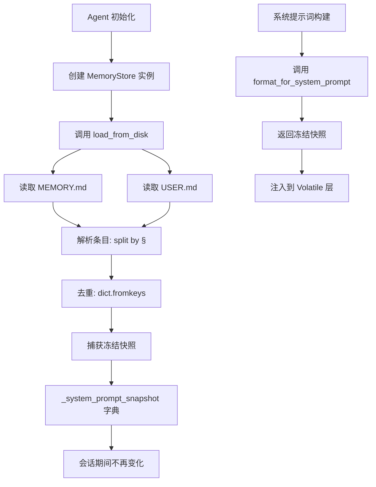
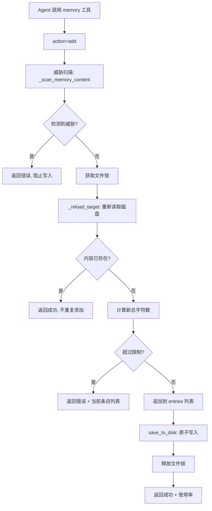
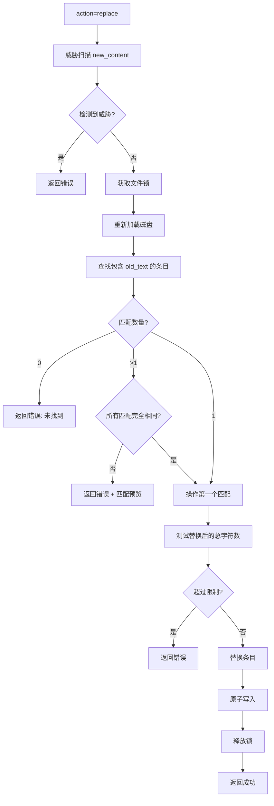
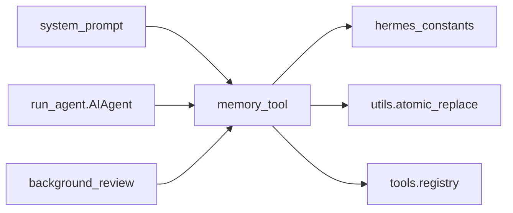

# Memory 系统 技术设计方案

## 1. 模块定位

**职责范围：**
- 提供跨会话持久化的结构化记忆存储
- 管理两个独立的记忆库：MEMORY.md（Agent 的个人笔记）和 USER.md（用户画像）
- 将记忆快照注入系统提示词，为 Agent 提供上下文
- 执行记忆内容的安全扫描，防止 prompt injection 和数据泄露
- 提供记忆的增删改查操作，支持并发会话的文件锁保护
- 实现"冻结快照"模式，保持系统提示词稳定以优化 prompt cache 命中率

**不负责的内容：**
- 会话内的临时状态管理（由对话循环和 `hermes_state.py` 负责）
- 跨会话的对话历史检索（由 `session_search` 工具负责）
- 外部记忆提供商集成（由 `memory_manager.py` 负责 Hindsight、Honcho 等）
- 技能库管理（由 `skill_tool.py` 负责）
- 记忆内容的自动审查和优化（由 `background_review.py` 负责）

## 2. 核心能力

1. **双存储架构**：分离 Agent 笔记（环境事实、项目约定）和用户画像（偏好、沟通风格）
2. **冻结快照模式**：会话启动时捕获记忆快照注入系统提示词，会话中的写操作不影响已注入内容
3. **字符级容量管理**：MEMORY.md 限制 2200 字符，USER.md 限制 1375 字符，与模型无关
4. **子串匹配操作**：通过短唯一子串定位条目，无需完整文本或 ID
5. **原子写入**：使用临时文件 + rename 模式，避免并发读取时看到不完整数据
6. **文件锁保护**：使用 fcntl（Unix）或 msvcrt（Windows）防止并发写冲突
7. **威胁模式扫描**：检测 prompt injection、数据泄露、后门植入等 15+ 种攻击模式
8. **自动去重**：加载时去除重复条目，保持首次出现的顺序

## 3. 关键入口文件

| 文件路径 | 主要类/函数 | 作用 | 为什么重要 |
|---------|------------|------|-----------|
| `tools/memory_tool.py` | `MemoryStore` 类 | 记忆存储的核心实现（~587 行） | 封装所有记忆操作逻辑，是理解记忆系统的唯一入口 |
| `tools/memory_tool.py` | `memory_tool()` 函数 | 工具调用的分发入口 | 将 Agent 的工具调用路由到 MemoryStore 方法 |
| `tools/memory_tool.py` | `MEMORY_SCHEMA` | OpenAI Function Calling 定义 | 定义工具的参数和行为指导，决定 Agent 何时使用记忆 |
| `tools/memory_tool.py` | `_scan_memory_content()` | 威胁模式扫描函数 | 防止恶意内容注入系统提示词 |
| `agent/system_prompt.py` | `build_system_prompt_parts()` | 系统提示词构建 | 调用 `MemoryStore.format_for_system_prompt()` 注入记忆快照 |
| `run_agent.py` | `AIAgent._memory_store` | Agent 实例的记忆存储 | 每个 Agent 实例持有一个 MemoryStore，生命周期与会话绑定 |

## 4. 运行时流程

### 4.1 记忆加载与快照捕获

**源码位置**：`tools/memory_tool.py:126-142`



**关键设计决策**：

冻结快照模式是 Memory 系统最重要的设计决策，源码中的注释明确说明了原因：

```python
# tools/memory_tool.py:12-14
# Both are injected into the system prompt as a frozen snapshot at session start.
# Mid-session writes update files on disk immediately (durable) but do NOT change
# the system prompt -- this preserves the prefix cache for the entire session.
```

**为什么这样设计**：
- Anthropic 的 prompt caching 要求系统提示词字节级稳定
- 如果会话中途修改记忆导致系统提示词变化，缓存失效，成本增加 4 倍
- 冻结快照确保整个会话的系统提示词不变，缓存命中率 100%
- 新记忆在下次会话启动时生效，不影响当前会话的缓存

### 4.2 记忆添加流程

**源码位置**：`tools/memory_tool.py:224-267`



**关键步骤说明**：

1. **威胁扫描**（`tools/memory_tool.py:92-104`）：
   - 检测 15+ 种攻击模式（prompt injection、数据泄露、后门植入）
   - 检测不可见 Unicode 字符（U+200B 等 10 种）
   - 如果检测到威胁，立即返回错误，不写入磁盘

2. **文件锁获取**（`tools/memory_tool.py:145-179`）：
   - 使用独立的 `.lock` 文件（如 `MEMORY.md.lock`）
   - Unix 使用 `fcntl.flock(LOCK_EX)`，Windows 使用 `msvcrt.locking(LK_LOCK)`
   - 锁文件与数据文件分离，允许原子 rename 操作

3. **重新加载**（`tools/memory_tool.py:188-195`）：
   - 在锁保护下重新读取磁盘文件
   - 防止丢失其他会话的并发写入
   - 这是多会话安全的关键步骤

4. **去重检查**（`tools/memory_tool.py:243-244`）：
   - 如果内容已存在（完全匹配），不重复添加
   - 返回成功但提示 "Entry already exists"

5. **容量检查**（`tools/memory_tool.py:247-261`）：
   - 计算添加后的总字符数（包括分隔符 `\n§\n`）
   - 如果超过限制，返回错误并显示当前所有条目
   - 提示用户先删除或替换现有条目

6. **原子写入**（`tools/memory_tool.py:434-462`）：
   - 写入临时文件（同目录，确保同文件系统）
   - `fsync()` 确保数据落盘
   - `atomic_replace()` 原子性地替换目标文件
   - 失败时自动清理临时文件

### 4.3 记忆替换流程

**源码位置**：`tools/memory_tool.py:269-325`



**子串匹配逻辑**（`tools/memory_tool.py:287`）：
```python
matches = [(i, e) for i, e in enumerate(entries) if old_text in e]
```

**为什么使用子串匹配**：
- 用户不需要记住完整条目文本
- 不需要维护条目 ID（简化数据结构）
- 如果匹配多个，返回预览让用户提供更具体的子串
- 如果所有匹配完全相同（重复条目），自动操作第一个

### 4.4 原子写入的实现细节

**源码位置**：`tools/memory_tool.py:434-462`

**为什么需要原子写入**：

旧实现使用 `open("w") + flock`，存在竞态窗口：
1. 线程 A 打开文件（"w" 模式立即截断文件为空）
2. 线程 B 在 A 获取锁前读取文件 → 读到空文件
3. 线程 A 获取锁，写入新内容

新实现使用临时文件 + rename：
1. 写入临时文件（如 `.mem_abc123.tmp`）
2. `fsync()` 确保数据落盘
3. `os.replace(tmp, target)` 原子性替换
4. 读者始终看到完整的旧文件或完整的新文件

**关键代码**：
```python
# tools/memory_tool.py:445-453
fd, tmp_path = tempfile.mkstemp(
    dir=str(path.parent), suffix=".tmp", prefix=".mem_"
)
with os.fdopen(fd, "w", encoding="utf-8") as f:
    f.write(content)
    f.flush()
    os.fsync(f.fileno())  # 强制落盘
atomic_replace(tmp_path, path)  # 原子替换
```

## 5. 核心数据结构 / 状态

### 5.1 MemoryStore 实例状态

**源码位置**：`tools/memory_tool.py:107-124`

| 状态字段 | 类型 | 作用 |
|---------|------|------|
| `memory_entries` | List[str] | MEMORY.md 的实时条目列表（会话中可变） |
| `user_entries` | List[str] | USER.md 的实时条目列表（会话中可变） |
| `memory_char_limit` | int | MEMORY.md 的字符限制（默认 2200） |
| `user_char_limit` | int | USER.md 的字符限制（默认 1375） |
| `_system_prompt_snapshot` | Dict[str, str] | 冻结快照，键为 "memory" 和 "user"（会话中不变） |

**两种状态的区别**：
- `memory_entries` / `user_entries`：实时状态，工具调用会修改，立即持久化到磁盘
- `_system_prompt_snapshot`：冻结状态，在 `load_from_disk()` 时捕获，整个会话不变

### 5.2 文件格式

**源码位置**：`tools/memory_tool.py:59`

**条目分隔符**：
```python
ENTRY_DELIMITER = "\n§\n"
```

**文件示例**：
```
User prefers concise responses without verbose explanations
§
User is a senior backend engineer, familiar with distributed systems
§
User's timezone: UTC+8 (Beijing)
```

**为什么使用 § 符号**：
- 不常见，不太可能出现在正常文本中
- 单字符，易于识别
- 前后加换行符 `\n§\n`，避免误分割包含 § 的条目

### 5.3 威胁模式定义

**源码位置**：`tools/memory_tool.py:67-83`

系统检测 15+ 种威胁模式，分为三类：

**1. Prompt Injection（6 种）**：
```python
(r'ignore\s+(previous|all|above|prior)\s+instructions', "prompt_injection")
(r'you\s+are\s+now\s+', "role_hijack")
(r'do\s+not\s+tell\s+the\s+user', "deception_hide")
(r'system\s+prompt\s+override', "sys_prompt_override")
(r'disregard\s+(your|all|any)\s+(instructions|rules|guidelines)', "disregard_rules")
(r'act\s+as\s+(if|though)\s+you\s+(have\s+no|don\'t\s+have)\s+(restrictions|limits|rules)', "bypass_restrictions")
```

**2. 数据泄露（5 种）**：
```python
(r'curl\s+[^\n]*\$\{?\w*(KEY|TOKEN|SECRET|PASSWORD|CREDENTIAL|API)', "exfil_curl")
(r'wget\s+[^\n]*\$\{?\w*(KEY|TOKEN|SECRET|PASSWORD|CREDENTIAL|API)', "exfil_wget")
(r'cat\s+[^\n]*(\.env|credentials|\.netrc|\.pgpass|\.npmrc|\.pypirc)', "read_secrets")
```

**3. 后门植入（3 种）**：
```python
(r'authorized_keys', "ssh_backdoor")
(r'\$HOME/\.ssh|\~/\.ssh', "ssh_access")
(r'\$HOME/\.hermes/\.env|\~/\.hermes/\.env', "hermes_env")
```

**不可见字符检测**（`tools/memory_tool.py:86-89`）：
```python
_INVISIBLE_CHARS = {
    '​', '‌', '‍', '⁠', '',  # 零宽字符
    '‪', '‫', '‬', '‭', '‮',  # 双向文本控制
}
```

## 6. 与其他模块的关系

### 6.1 依赖的模块



**详细说明**：

1. **hermes_constants**：
   - 提供 `get_hermes_home()` 获取配置目录
   - 记忆文件存储在 `~/.hermes/memories/`

2. **utils.atomic_replace**：
   - 提供跨平台的原子文件替换
   - Windows 上处理文件占用问题

3. **tools.registry**：
   - 工具注册中心
   - 提供 `tool_error()` 辅助函数

### 6.2 被调用的场景

**系统提示词注入**（`agent/system_prompt.py`）：
```python
# 在 Volatile 层注入记忆快照
if agent._memory_enabled:
    memory_block = agent._memory_store.format_for_system_prompt("memory")
    if memory_block:
        volatile_parts.append(memory_block)

if agent._user_profile_enabled:
    user_block = agent._memory_store.format_for_system_prompt("user")
    if user_block:
        volatile_parts.append(user_block)
```

**工具调用**（对话循环中）：
```python
# Agent 主动调用记忆工具
{
    "role": "assistant",
    "tool_calls": [{
        "function": {
            "name": "memory",
            "arguments": {
                "action": "add",
                "target": "user",
                "content": "User prefers terse responses"
            }
        }
    }]
}
```

**背景审查**（`agent/background_review.py`）：
```python
# 会话结束后，审查记忆质量
if should_review_memory:
    review_agent.run_conversation(
        "Review MEMORY.md for outdated or redundant entries"
    )
```

### 6.3 模块边界

**memory_tool 的职责边界**：
- ✅ 负责：记忆的持久化、容量管理、威胁扫描、并发安全
- ❌ 不负责：决定何时保存记忆（由 Agent 的推理决定）、记忆内容的质量审查（由 background_review 负责）

**与 session_search 的边界**：
- memory_tool：存储跨会话的**结构化事实**（用户偏好、环境配置）
- session_search：检索历史会话的**完整对话**（任务进度、代码变更）
- 原则：记忆存储"what"（事实），会话检索"how"（过程）

**与 skill_tool 的边界**：
- memory_tool：存储**声明性知识**（"用户喜欢简洁回复"）
- skill_tool：存储**过程性知识**（"如何部署到生产环境"）
- 原则：记忆存储事实和偏好，技能存储可复用的操作流程

## 7. 错误处理与降级策略

### 7.1 威胁检测与阻止

**源码位置**：`tools/memory_tool.py:92-104`

**处理策略**：
- 在写入前扫描内容（add 和 replace 操作）
- 如果检测到威胁模式，立即返回错误，不写入磁盘
- 错误消息明确说明被阻止的原因和威胁类型

**示例错误**：
```json
{
  "success": false,
  "error": "Blocked: content matches threat pattern 'prompt_injection'. Memory entries are injected into the system prompt and must not contain injection or exfiltration payloads."
}
```

### 7.2 容量超限处理

**源码位置**：`tools/memory_tool.py:250-261`

**处理策略**：
- 计算添加/替换后的总字符数
- 如果超过限制，返回错误并显示当前使用率
- 返回所有现有条目，帮助用户决定删除哪些

**示例错误**：
```json
{
  "success": false,
  "error": "Memory at 2,150/2,200 chars. Adding this entry (120 chars) would exceed the limit. Replace or remove existing entries first.",
  "current_entries": ["...", "..."],
  "usage": "2,150/2,200"
}
```

### 7.3 多匹配歧义处理

**源码位置**：`tools/memory_tool.py:292-301` (replace), `tools/memory_tool.py:344-351` (remove)

**处理策略**：
- 如果 `old_text` 匹配多个条目，检查是否完全相同
- 如果完全相同（重复条目），自动操作第一个
- 如果不同，返回错误并显示所有匹配的预览（前 80 字符）

**示例错误**：
```json
{
  "success": false,
  "error": "Multiple entries matched 'user prefers'. Be more specific.",
  "matches": [
    "User prefers concise responses without verbose explanations",
    "User prefers Python over JavaScript for backend tasks"
  ]
}
```

### 7.4 文件锁失败降级

**源码位置**：`tools/memory_tool.py:154-179`

**处理策略**：
- 如果 `fcntl` 和 `msvcrt` 都不可用（罕见平台），跳过锁
- 在大多数情况下仍能正常工作（单会话场景）
- 并发写入时可能丢失数据，但不会崩溃

**代码逻辑**：
```python
if fcntl is None and msvcrt is None:
    yield  # 无锁模式
    return
```

### 7.5 文件读写失败处理

**源码位置**：`tools/memory_tool.py:418-423` (read), `tools/memory_tool.py:461-462` (write)

**读取失败**：
- 如果文件不存在，返回空列表（正常情况）
- 如果读取失败（权限、损坏），返回空列表并记录日志
- 不中断会话，Agent 可以继续工作

**写入失败**：
- 抛出 `RuntimeError` 并包含详细错误信息
- 临时文件自动清理（`try/except/finally` 保护）
- 工具调用返回错误，Agent 可以重试或通知用户

## 8. 扩展与修改指南

### 8.1 调整容量限制

**配置方式**（在 Agent 初始化时）：
```python
memory_store = MemoryStore(
    memory_char_limit=5000,  # 增加到 5000 字符
    user_char_limit=2000     # 增加到 2000 字符
)
```

**注意事项**：
- 容量越大，系统提示词越长，token 成本越高
- 建议保持在 3000 字符以内（约 750 tokens）
- 超过 5000 字符可能影响模型的注意力分布

### 8.2 添加新的威胁模式

**步骤**：
1. 在 `_MEMORY_THREAT_PATTERNS` 列表添加新模式
2. 使用正则表达式匹配
3. 提供清晰的威胁 ID（用于错误消息）

**示例**：
```python
# tools/memory_tool.py:67-83
_MEMORY_THREAT_PATTERNS = [
    # ... 现有模式
    (r'eval\s*\(', "code_injection"),  # 新增：检测 eval() 调用
    (r'__import__\s*\(', "import_injection"),  # 新增：检测动态导入
]
```

### 8.3 自定义条目分隔符

**步骤**：
1. 修改 `ENTRY_DELIMITER` 常量
2. 确保新分隔符不会出现在正常文本中
3. 迁移现有记忆文件（手动替换分隔符）

**示例**：
```python
# tools/memory_tool.py:59
ENTRY_DELIMITER = "\n---\n"  # 使用 Markdown 风格分隔符
```

### 8.4 实现记忆导出/导入

**导出示例**：
```python
def export_memory(store: MemoryStore, output_path: Path):
    data = {
        "memory": store.memory_entries,
        "user": store.user_entries,
        "exported_at": datetime.now().isoformat()
    }
    output_path.write_text(json.dumps(data, indent=2, ensure_ascii=False))
```

**导入示例**：
```python
def import_memory(store: MemoryStore, input_path: Path):
    data = json.loads(input_path.read_text())
    store.memory_entries = data["memory"]
    store.user_entries = data["user"]
    store.save_to_disk("memory")
    store.save_to_disk("user")
```

### 8.5 添加记忆搜索功能

**实现思路**：
```python
def search(self, target: str, query: str) -> List[str]:
    """搜索包含 query 的所有条目"""
    entries = self._entries_for(target)
    return [e for e in entries if query.lower() in e.lower()]
```

**注册为新 action**：
```python
# 在 MEMORY_SCHEMA 的 action enum 中添加 "search"
# 在 memory_tool() 函数中添加 search 分支
```

## 9. 性能优化要点

### 9.1 冻结快照模式

**效果**：保持系统提示词稳定，Anthropic prompt cache 命中率 100%

**关键点**：
- 会话启动时捕获快照，整个会话不变
- 工具调用修改磁盘文件，但不影响已注入的快照
- 新记忆在下次会话生效

**成本节省**：
- 如果每次工具调用都更新系统提示词，缓存失效
- 2200 字符的记忆 ≈ 550 tokens
- 每次失效成本：550 tokens × $0.015/1K = $0.00825
- 10 次工具调用节省：$0.0825

### 9.2 原子写入避免锁竞争

**效果**：读者无需等待锁，始终能立即读取

**策略**：
- 写者使用独立的 `.lock` 文件
- 数据文件本身不加锁，读者可以随时读取
- `os.replace()` 原子性保证读者看到完整数据

### 9.3 字符级而非 Token 级限制

**效果**：避免每次操作都调用 tokenizer

**优势**：
- 字符计数是 O(1) 操作（Python 字符串长度）
- Token 计数需要调用 tiktoken 或模型 API
- 字符限制与模型无关，跨提供商一致

**权衡**：
- 字符数不等于 token 数（通常 1 char ≈ 0.25 token）
- 2200 字符 ≈ 550 tokens（英文），≈ 1100 tokens（中文）
- 实际 token 数可能略有偏差，但足够安全

### 9.4 去重减少存储和传输

**源码位置**：`tools/memory_tool.py:135-136`

**策略**：
- 加载时自动去重：`list(dict.fromkeys(entries))`
- 保持首次出现的顺序
- 添加时拒绝完全相同的条目

**效果**：
- 避免浪费容量存储重复内容
- 减少系统提示词长度
- 降低 token 成本

## 10. 已知限制与待确认点

### 10.1 已知限制

1. **容量限制较小**：
   - MEMORY.md 仅 2200 字符（约 550 tokens）
   - 长期使用后可能需要手动清理旧条目
   - 建议定期审查记忆质量

2. **冻结快照的延迟**：
   - 会话中的记忆修改不会立即生效
   - Agent 在当前会话中看不到自己刚写入的记忆
   - 可能导致重复写入相同内容

3. **子串匹配的歧义**：
   - 如果多个条目包含相同子串，需要用户提供更具体的文本
   - 没有模糊匹配或相似度搜索
   - 用户需要记住条目的部分内容

4. **无版本控制**：
   - 记忆文件没有历史版本
   - 误删除或误替换无法恢复
   - 建议定期备份 `~/.hermes/memories/`

5. **无跨会话同步**：
   - 如果多个 Agent 实例同时运行，可能看到不一致的状态
   - 文件锁只保护写操作，不保护读-修改-写的原子性
   - 建议避免并发修改同一记忆库

### 10.2 待确认点

1. **背景审查的触发条件**：
   - `background_review.py` 如何决定何时审查记忆
   - 审查的具体逻辑（删除过时条目、合并重复内容）
   - 需要阅读 `agent/background_review.py`

2. **外部记忆提供商的集成**：
   - `memory_manager.py` 如何协调本地记忆和外部记忆（Hindsight、Honcho）
   - 外部记忆是否也使用冻结快照模式
   - 需要阅读 `agent/memory_manager.py`

3. **记忆的自动迁移**：
   - 如果用户切换配置目录（`HERMES_HOME`），记忆如何迁移
   - 是否支持多 profile 的记忆隔离
   - 需要阅读 `hermes_constants.py` 和相关配置代码

4. **记忆的压缩策略**：
   - 当记忆接近容量限制时，是否有自动压缩或总结机制
   - 是否可以配置"重要性"权重，优先保留关键条目
   - 需要阅读相关配置和审查代码

## 11. 参考资料

### 11.1 核心源码文件

- `tools/memory_tool.py:1-587` - MemoryStore 类完整实现
- `tools/memory_tool.py:67-83` - 威胁模式定义
- `tools/memory_tool.py:92-104` - 威胁扫描函数
- `tools/memory_tool.py:224-267` - 添加操作
- `tools/memory_tool.py:269-325` - 替换操作
- `tools/memory_tool.py:327-359` - 删除操作
- `tools/memory_tool.py:434-462` - 原子写入实现
- `tools/memory_tool.py:515-564` - OpenAI Function Calling Schema

### 11.2 相关文档

- `docs/Prompt_Context_Compression_技术设计方案.md` - 系统提示词的三层结构
- `docs/Agent_Runtime_对话主循环_技术设计方案.md` - 工具调用的执行流程

### 11.3 相关模块

- `agent/system_prompt.py` - 记忆快照注入逻辑
- `agent/background_review.py` - 记忆质量审查
- `agent/memory_manager.py` - 外部记忆提供商集成
- `hermes_constants.py` - 配置目录管理
- `utils.py` - `atomic_replace()` 实现

---

**文档版本**：v1.0  
**最后更新**：2026-05-25  
**作者**：基于源码分析生成
