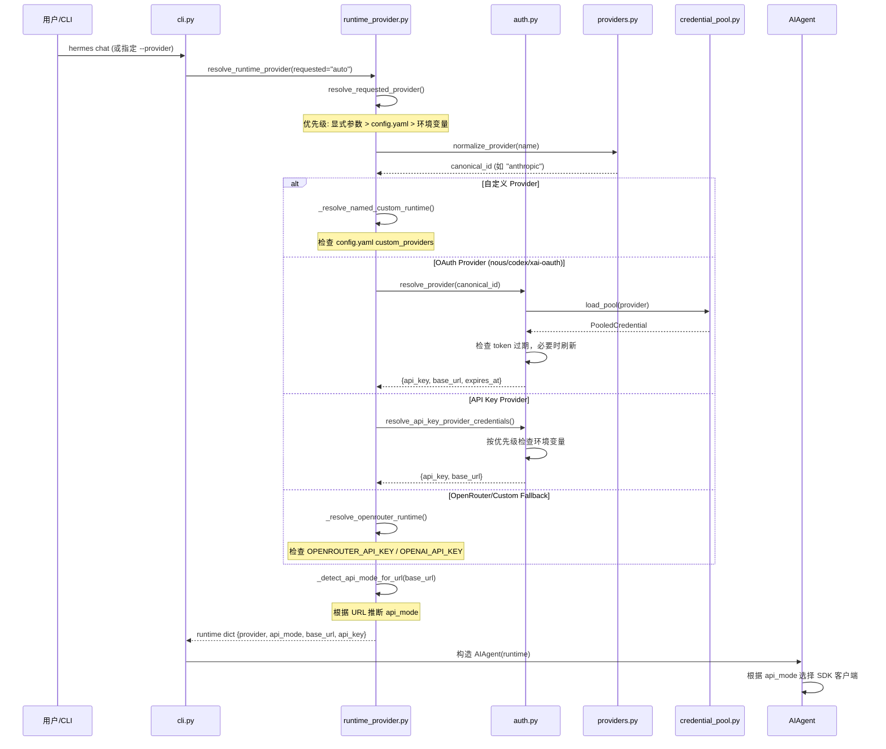

# Model Provider / Runtime Resolution 技术设计方案

## 1. 模块定位

### 职责范围
Model Provider / Runtime Resolution 模块负责在运行时将用户的 provider 请求（如 "anthropic"、"openrouter"、"custom" 等）解析为具体的运行时配置，包括：
- API endpoint (base_url)
- 认证凭据 (api_key / OAuth token)
- 传输协议 (api_mode: chat_completions / anthropic_messages / codex_responses / bedrock_converse)
- Provider 元数据（名称、能力、是否为聚合器等）

该模块是 Hermes Agent 与各类 LLM 服务商交互的**统一入口**，确保无论用户选择哪个 provider，系统都能正确构造 HTTP 客户端并发起请求。

### 不负责的内容
- **不负责** HTTP 请求的实际发送（由 `AIAgent` 类和 SDK 客户端负责）
- **不负责** 模型列表的获取和展示（由 `hermes_cli/models.py` 和 `model_catalog.py` 负责）
- **不负责** OAuth 流程的 UI 交互（由 `hermes_cli/auth.py` 负责）
- **不负责** 请求参数的构造（由 `AIAgent` 和 `ProviderProfile` 负责）

---

## 2. 核心能力

1. **Provider 标准化解析**：将用户输入的 provider 名称（含别名）规范化为内部 canonical ID
2. **多数据源融合**：合并 models.dev 数据库、Hermes 内置配置、用户自定义配置
3. **凭据解析与刷新**：支持 API Key、OAuth Device Code、OAuth External、AWS SDK 等多种认证方式
4. **传输协议自动检测**：根据 provider 类型和 base_url 自动推断 api_mode
5. **Credential Pool 集成**：支持多账号轮换和凭据池管理
6. **降级与 Fallback**：当首选 provider 不可用时，自动尝试备选方案（如 auto 模式）

---

## 3. 关键入口文件

| 文件路径 | 主要类/函数 | 作用 | 为什么重要 |
|---------|------------|------|-----------|
| `hermes_cli/providers.py` | `ProviderDef`, `resolve_provider_full()`, `get_provider()` | Provider 元数据的**单一数据源**，定义 109+ providers 的 transport、env vars、base_url 等 | 所有模块通过此文件获取 provider 定义，避免重复维护 |
| `hermes_cli/runtime_provider.py` | `resolve_runtime_provider()`, `resolve_requested_provider()` | **运行时解析主入口**，返回包含 api_key、base_url、api_mode 的 runtime dict | CLI、Gateway、Cron、Agent 都调用此函数获取运行时配置 |
| `hermes_cli/auth.py` | `resolve_provider()`, `resolve_*_runtime_credentials()` | 认证凭据解析，支持 OAuth、API Key、AWS SDK 等多种方式 | 处理 token 刷新、过期检测、credential pool 选择 |
| `agent/models_dev.py` | `get_provider_info()`, `get_model_info()` | 从 models.dev 数据库获取 provider 和 model 元数据 | 提供 4000+ 模型的上下文窗口、成本、能力等信息 |
| `providers/base.py` | `ProviderProfile` | Provider 行为的声明式描述（请求级 quirks、温度处理、extra_body 构造等） | 将 provider 特性从 AIAgent 解耦，便于扩展新 provider |
| `agent/auxiliary_client.py` | `resolve_provider_client()` | 为辅助任务（压缩、视觉分析等）解析 provider 客户端 | 提供独立于主 agent 的 fallback 链 |

---

## 4. 运行时流程

### 4.1 主流程：从用户请求到运行时配置



### 4.2 Provider 解析优先级

**resolve_runtime_provider() 的解析顺序**（源码：`hermes_cli/runtime_provider.py:1200-1662`）：

1. **Azure Anthropic 短路**：如果 `provider=anthropic` 且 `base_url` 包含 `azure.com`，直接返回 Azure 配置
2. **Azure Foundry**：如果 `provider=azure-foundry`，读取 `model.base_url` + `model.api_mode` + Entra ID 配置
3. **自定义 Provider**：`_resolve_named_custom_runtime()` 检查 `config.yaml` 的 `providers:` 和 `custom_providers:` 列表
4. **Credential Pool**：如果 provider 有 credential pool（OAuth providers），从 pool 中选择凭据
5. **OAuth Providers**：nous / openai-codex / xai-oauth / qwen-oauth / minimax-oauth / google-gemini-cli
6. **External Process**：copilot-acp（通过外部进程获取 token）
7. **Native Anthropic**：检查 `ANTHROPIC_TOKEN` / `ANTHROPIC_API_KEY` / Claude Code OAuth token
8. **AWS Bedrock**：使用 boto3 credential chain
9. **API Key Providers**：zai / kimi / minimax / deepseek / alibaba / copilot / xai 等
10. **OpenRouter Fallback**：`_resolve_openrouter_runtime()` 作为最终兜底

### 4.3 API Mode 自动检测

**_detect_api_mode_for_url() 逻辑**（源码：`hermes_cli/runtime_provider.py:76-100`）：

```python
# 根据 base_url 推断传输协议
if hostname == "api.x.ai":
    return "codex_responses"
if hostname == "api.openai.com":
    return "codex_responses"
if base_url.endswith("/anthropic"):
    return "anthropic_messages"
if hostname == "api.kimi.com" and "/coding" in base_url:
    return "anthropic_messages"
# 默认 chat_completions
```

**特殊处理**：
- **OpenCode Zen/Go**：根据 model 名称动态选择 api_mode（`opencode_model_api_mode()`）
- **Azure Foundry**：根据 model 名称推断（GPT-5.x / o1-o4 → `codex_responses`）
- **Copilot**：根据 model 名称推断（`copilot_model_api_mode()`）

---

## 5. 核心数据结构 / 状态

### 5.1 ProviderDef（providers.py:220-234）

```python
@dataclass
class ProviderDef:
    id: str                          # canonical provider ID
    name: str                        # 显示名称
    transport: str                   # openai_chat | anthropic_messages | codex_responses
    api_key_env_vars: Tuple[str, ...] # 环境变量列表（按优先级）
    base_url: str                    # 默认 API endpoint
    base_url_env_var: str            # 用户自定义 base_url 的环境变量
    is_aggregator: bool              # 是否为聚合器（OpenRouter/Vercel/OpenCode）
    auth_type: str                   # api_key | oauth_device_code | oauth_external | aws_sdk
    doc: str                         # 文档链接
    source: str                      # "models.dev" | "hermes" | "user-config"
```

**数据来源**：
- **models.dev**：109+ providers 的基础信息（name, base_url, env vars, doc）
- **HERMES_OVERLAYS**：Hermes 特有的 transport、auth_type、is_aggregator 标记
- **用户配置**：`config.yaml` 的 `providers:` 和 `custom_providers:` 覆盖

### 5.2 Runtime Dict（runtime_provider.py 返回值）

```python
{
    "provider": str,              # canonical provider ID
    "api_mode": str,              # chat_completions | anthropic_messages | codex_responses | bedrock_converse
    "base_url": str,              # 实际 API endpoint
    "api_key": str | Callable,    # API key 或 token provider（Azure Entra ID）
    "source": str,                # "pool" | "env" | "explicit" | "oauth" 等
    "requested_provider": str,    # 用户原始请求
    # 可选字段
    "expires_at": int,            # OAuth token 过期时间（Unix timestamp）
    "last_refresh": float,        # 上次刷新时间
    "credential_pool": CredentialPool,  # 凭据池对象
    "region": str,                # AWS Bedrock region
    "auth_mode": str,             # Azure Foundry: "api_key" | "entra_id"
    "entra": dict,                # Azure Entra ID 配置
    "model": str,                 # custom provider 的默认模型
    "request_overrides": dict,    # extra_body 等请求级覆盖
}
```

### 5.3 Credential Pool（agent/credential_pool.py）

**用途**：管理多账号轮换，支持 OAuth providers（nous / openai-codex / xai-oauth 等）

**存储位置**：`~/.hermes/credential_pools/<provider_id>.json`

**PooledCredential 字段**：
```python
{
    "access_token": str,          # OAuth access token
    "refresh_token": str,         # OAuth refresh token
    "expires_at": int,            # 过期时间
    "runtime_api_key": str,       # 用于推理的 key（可能是 invoke JWT 或 agent_key）
    "runtime_base_url": str,      # 推理 endpoint
    "source": str,                # "device_code" | "oauth_external"
    "scope": str,                 # OAuth scope
}
```

### 5.4 配置文件结构

**config.yaml 相关字段**：
```yaml
model:
  provider: anthropic           # 当前 provider
  default: claude-opus-4.7      # 当前模型
  base_url: https://...         # 自定义 endpoint
  api_mode: anthropic_messages  # 显式指定传输协议
  auth_mode: entra_id           # Azure Foundry 认证模式

providers:                      # 新式用户自定义 providers
  my-endpoint:
    name: My Custom Endpoint
    api: https://my-api.com/v1
    key_env: MY_API_KEY
    transport: chat_completions
    default_model: my-model

custom_providers:               # 旧式自定义 providers（列表）
  - name: Local Ollama
    base_url: http://localhost:11434/v1
    api_key: ""
    provider_key: ollama-local
```

---

## 6. 与其他模块的关系

### 6.1 依赖的模块

| 模块 | 依赖关系 | 说明 |
|------|---------|------|
| `agent/models_dev.py` | 读取 provider 和 model 元数据 | 从 models.dev 数据库获取 109+ providers 的基础信息 |
| `agent/credential_pool.py` | 加载和选择凭据 | OAuth providers 的多账号管理 |
| `hermes_cli/config.py` | 读取用户配置 | 获取 `config.yaml` 中的 provider、base_url、custom_providers 等 |
| `utils.py` | URL 解析和安全检查 | `base_url_host_matches()` 防止 lookalike 攻击 |

### 6.2 被调用的模块

| 调用方 | 调用场景 | 接口 |
|-------|---------|------|
| `cli.py` | CLI 启动时解析 provider | `resolve_runtime_provider(requested=...)` |
| `run_agent.py` | Agent 初始化 | `resolve_runtime_provider()` |
| `gateway/` | Gateway 服务启动 | `resolve_runtime_provider()` |
| `cron/` | 定时任务执行 | `resolve_runtime_provider()` |
| `agent/auxiliary_client.py` | 辅助任务（压缩、视觉等） | `resolve_provider_client()` |
| `tools/delegate_tool.py` | 子 agent 调用 | `resolve_runtime_provider(requested=..., target_model=...)` |
| `batch_runner.py` | 批量任务 | `resolve_runtime_provider()` |

### 6.3 模块边界

**输入边界**：
- 用户通过 CLI 参数（`--provider`）、配置文件（`config.yaml`）、环境变量指定 provider
- 输入可以是别名（如 "claude" → "anthropic"）或 canonical ID

**输出边界**：
- 返回标准化的 runtime dict，包含 `api_key`、`base_url`、`api_mode`
- 不涉及 HTTP 请求的实际发送，由 `AIAgent` 和 SDK 客户端负责

**职责分离**：
- **本模块**：解析 provider → 返回运行时配置
- **auth.py**：OAuth 流程、token 刷新、credential pool 管理
- **AIAgent**：根据 runtime dict 构造 SDK 客户端、发送请求
- **ProviderProfile**：声明 provider 的请求级行为（temperature、extra_body 等）

---

## 7. 错误处理与降级策略

### 7.1 认证失败处理

**源码位置**：`hermes_cli/runtime_provider.py:1338-1379`

```python
# Nous OAuth 失败时的降级逻辑
if provider == "nous":
    try:
        creds = resolve_nous_runtime_credentials(...)
        return {...}
    except AuthError:
        if requested_provider != "auto":
            raise  # 用户显式指定 nous，直接抛出错误
        # auto 模式：降级到下一个 provider（如 OpenRouter）
        logger.info("Auto-detected Nous provider but credentials failed; "
                    "falling through to next provider.")
```

**降级策略**：
- **显式指定 provider**：认证失败时直接抛出 `AuthError`，不尝试其他 provider
- **auto 模式**：按优先级尝试下一个 provider（Nous → Codex → OpenRouter → Custom → Anthropic）

### 7.2 Token 过期处理

**Nous Portal 的 token 刷新**（源码：`hermes_cli/auth.py`）：

1. **检查过期时间**：`_agent_key_is_usable()` 检查 `agent_key_expires_at`，预留 30 分钟 buffer
2. **自动刷新**：`resolve_nous_runtime_credentials()` 在 token 即将过期时自动调用 refresh API
3. **Fallback**：如果 refresh 失败，尝试使用 raw `access_token`（invoke JWT）

**其他 OAuth providers**：
- **OpenAI Codex**：`resolve_codex_runtime_credentials()` 检查 `expires_at`，预留 2 分钟 buffer
- **xAI OAuth**：`resolve_xai_oauth_runtime_credentials()` 同样预留 2 分钟 buffer
- **Qwen OAuth**：`resolve_qwen_runtime_credentials()` 预留 2 分钟 buffer

### 7.3 Base URL 安全检查

**防止 lookalike 攻击**（源码：`utils.py:base_url_host_matches()`）：

```python
# 错误示例：api.openrouter.ai.attacker.com
# 正确检查：只匹配 registrable domain（openrouter.ai）
def base_url_host_matches(url: str, target_host: str) -> bool:
    hostname = base_url_hostname(url)
    # 提取 registrable domain（倒数第二个 label）
    # api.openrouter.ai.attacker.com → attacker.com ✗
    # api.openrouter.ai → openrouter.ai ✓
```

**应用场景**：
- 检查 `OPENROUTER_API_KEY` 是否应该发送到当前 base_url
- 检查 `OPENAI_API_KEY` 是否应该发送到当前 base_url
- 防止凭据泄露到恶意 endpoint

### 7.4 API Key 环境变量优先级

**源码位置**：`hermes_cli/runtime_provider.py:712-724`

```python
# 自定义 provider 的 API key 解析优先级
api_key_candidates = [
    explicit_api_key,                    # 1. 显式传入的 key
    custom_provider.get("api_key"),      # 2. config.yaml 中的 inline key
    os.getenv(custom_provider.get("key_env")),  # 3. 用户指定的环境变量
    os.getenv("OPENAI_API_KEY") if _is_openai_url else "",  # 4. 仅当 URL 是 openai.com 时
    os.getenv("OPENROUTER_API_KEY") if _is_openrouter_url else "",  # 5. 仅当 URL 是 openrouter.ai 时
    _host_derived_api_key(base_url),     # 6. 从 hostname 推断（如 DEEPSEEK_API_KEY）
]
api_key = next((c for c in api_key_candidates if has_usable_secret(c)), "")
```

**安全设计**：
- **Host-gated keys**：`OPENAI_API_KEY` 只发送到 `openai.com`，防止泄露到其他 endpoint
- **Host-derived keys**：自动从 hostname 推断环境变量（如 `api.deepseek.com` → `DEEPSEEK_API_KEY`）
- **No-key-required**：本地 endpoint（localhost / 127.0.0.1）自动使用 `"no-key-required"` placeholder

### 7.5 Stale Config 自愈

**问题**：用户切换 provider 后，`config.yaml` 中的 `model.api_mode` 可能与新 provider 不匹配

**解决方案**（源码：`hermes_cli/runtime_provider.py:205-219`）：

```python
def _provider_supports_explicit_api_mode(provider, configured_provider):
    """只有当 config 中的 provider 与当前 provider 匹配时，才使用 persisted api_mode"""
    if not configured_provider:
        return True
    if provider == "custom":
        return configured_provider == "custom" or configured_provider.startswith("custom:")
    return configured_provider == provider
```

**效果**：
- 用户从 Anthropic 切换到 OpenRouter 后，旧的 `api_mode: anthropic_messages` 不会被应用
- 系统自动重新检测 api_mode（通过 URL 或 provider 默认值）

---

## 8. 扩展指南

### 8.1 添加新 Provider

**步骤 1**：在 `hermes_cli/providers.py` 添加 overlay

```python
HERMES_OVERLAYS: Dict[str, HermesOverlay] = {
    "new-provider": HermesOverlay(
        transport="openai_chat",           # 或 anthropic_messages / codex_responses
        auth_type="api_key",               # 或 oauth_device_code / oauth_external
        base_url_override="https://api.new-provider.com/v1",
        base_url_env_var="NEW_PROVIDER_BASE_URL",
        extra_env_vars=("NEW_PROVIDER_API_KEY",),
    ),
}
```

**步骤 2**：在 `hermes_cli/auth.py` 添加 ProviderConfig（如果需要 OAuth）

```python
PROVIDER_REGISTRY: Dict[str, ProviderConfig] = {
    "new-provider": ProviderConfig(
        id="new-provider",
        name="New Provider",
        auth_type="oauth_device_code",
        portal_base_url="https://portal.new-provider.com",
        inference_base_url="https://api.new-provider.com/v1",
        client_id="hermes-cli",
        scope="inference:invoke",
    ),
}
```

**步骤 3**：在 `hermes_cli/runtime_provider.py` 添加解析逻辑（如果需要特殊处理）

```python
if provider == "new-provider":
    creds = resolve_new_provider_credentials()
    return {
        "provider": "new-provider",
        "api_mode": "chat_completions",
        "base_url": creds.get("base_url"),
        "api_key": creds.get("api_key"),
        "source": "oauth",
    }
```

### 8.2 添加新 API Mode

**步骤 1**：在 `hermes_cli/runtime_provider.py` 添加到 `_VALID_API_MODES`

```python
_VALID_API_MODES = {
    "chat_completions",
    "codex_responses",
    "anthropic_messages",
    "bedrock_converse",
    "new_api_mode",  # 新增
}
```

**步骤 2**：在 `AIAgent` 中添加对应的客户端构造逻辑（`run_agent.py`）

```python
if api_mode == "new_api_mode":
    # 构造新的 SDK 客户端
    self.client = NewProviderClient(api_key=api_key, base_url=base_url)
```

### 8.3 调试技巧

**查看 runtime 解析结果**：

```bash
# 在 cli.py 中添加日志
runtime = resolve_runtime_provider(requested="auto")
logger.info(f"Resolved runtime: {runtime}")
```

**测试 provider 解析**：

```python
from hermes_cli.providers import get_provider, normalize_provider

# 测试别名解析
canonical = normalize_provider("claude")  # → "anthropic"
pdef = get_provider(canonical)
print(pdef.transport, pdef.base_url, pdef.api_key_env_vars)
```

**测试 runtime 解析**：

```python
from hermes_cli.runtime_provider import resolve_runtime_provider

runtime = resolve_runtime_provider(requested="anthropic")
print(runtime["api_mode"], runtime["base_url"], runtime["source"])
```

---

## 9. 常见问题

### Q1: 为什么有些 provider 在 `providers.py` 中，有些在 `auth.py` 中？

**A**: 
- `providers.py`：定义所有 providers 的**元数据**（transport、env vars、base_url）
- `auth.py`：定义需要 **OAuth 流程**的 providers（device code、external OAuth）
- API Key providers 只需要在 `providers.py` 中定义，OAuth providers 需要在两处都定义

### Q2: `api_mode` 和 `transport` 有什么区别？

**A**:
- `transport`（providers.py）：provider 的**默认**传输协议（openai_chat / anthropic_messages / codex_responses）
- `api_mode`（runtime dict）：**实际使用**的传输协议，可能被 URL 检测或用户配置覆盖
- 例如：OpenCode Zen 的 `transport="openai_chat"`，但某些模型会被检测为 `api_mode="anthropic_messages"`

### Q3: 为什么 OpenRouter 既是 provider 又是 fallback？

**A**:
- **作为 provider**：用户显式指定 `--provider openrouter` 或 `config.yaml` 中设置 `provider: openrouter`
- **作为 fallback**：`auto` 模式下，当其他 providers 不可用时，自动尝试 OpenRouter（如果有 `OPENROUTER_API_KEY`）
- 这是 `_resolve_openrouter_runtime()` 的设计：既处理显式请求，也作为最终兜底

### Q4: Credential Pool 什么时候会被使用？

**A**:
- **OAuth providers**：nous / openai-codex / xai-oauth / qwen-oauth / minimax-oauth / google-gemini-cli
- **多账号场景**：用户通过 `hermes auth add` 添加多个账号后，系统自动轮换
- **Token 刷新**：pool 中的 token 过期时，自动调用 refresh API 更新

### Q5: 如何支持本地模型服务（Ollama / LM Studio）？

**A**:
- **方式 1**：使用 `custom_providers` 配置
  ```yaml
  custom_providers:
    - name: Local Ollama
      base_url: http://localhost:11434/v1
      api_key: ""
  ```
- **方式 2**：使用 `lmstudio` provider（内置）
  ```bash
  export LM_BASE_URL=http://localhost:1234/v1
  hermes chat --provider lmstudio
  ```
- **方式 3**：使用 `custom` provider + 环境变量
  ```bash
  export CUSTOM_BASE_URL=http://localhost:11434/v1
  hermes chat --provider custom
  ```

---

## 10. 参考资料

### 源码文件
- `hermes_cli/providers.py` - Provider 元数据定义
- `hermes_cli/runtime_provider.py` - 运行时解析主逻辑
- `hermes_cli/auth.py` - 认证凭据管理
- `agent/models_dev.py` - models.dev 数据库集成
- `providers/base.py` - ProviderProfile 基类
- `agent/credential_pool.py` - 凭据池管理

### 外部依赖
- **models.dev**：https://models.dev/api.json（109+ providers 的元数据数据库）
- **OpenRouter**：https://openrouter.ai/docs（聚合器 API 文档）
- **Anthropic SDK**：https://github.com/anthropics/anthropic-sdk-python
- **OpenAI SDK**：https://github.com/openai/openai-python

### 设计文档
- `hermes-already-has-routines.md` - Hermes 的整体架构
- `AGENTS.md` - Agent 系统设计
- `CONTRIBUTING.md` - 贡献指南

---

**文档版本**: v1.0  
**最后更新**: 2026-05-26  
**维护者**: Hermes Agent Team
