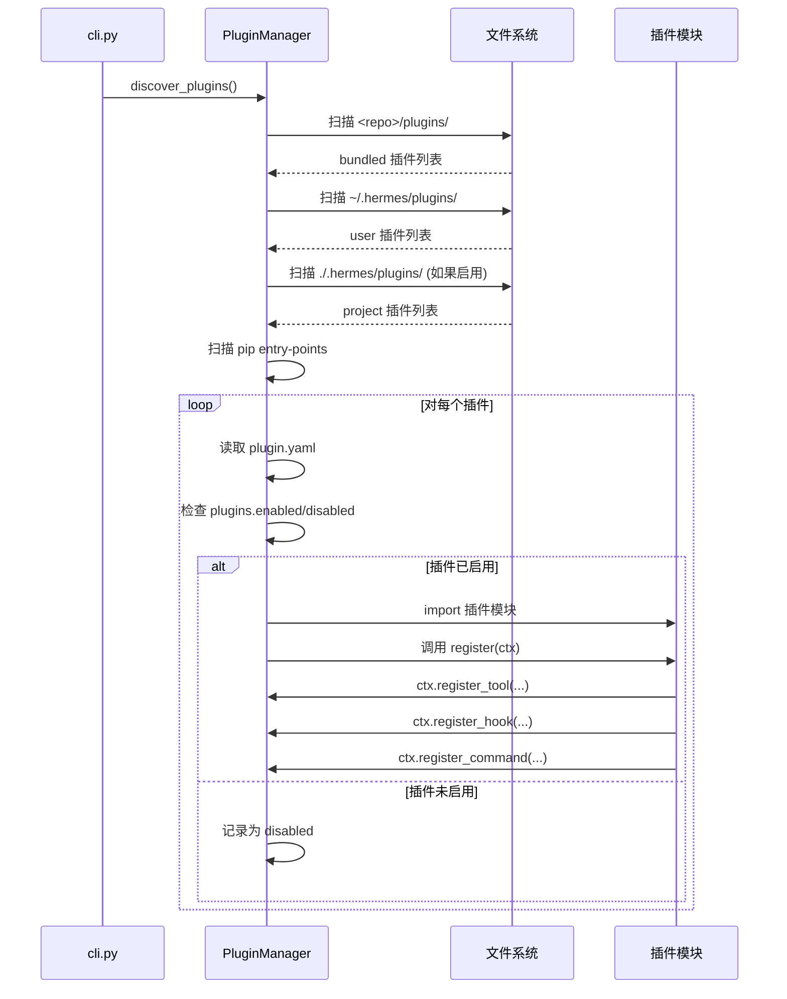
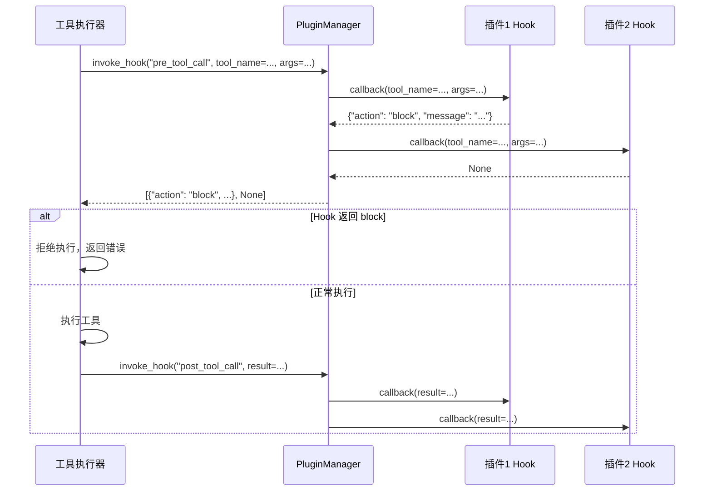
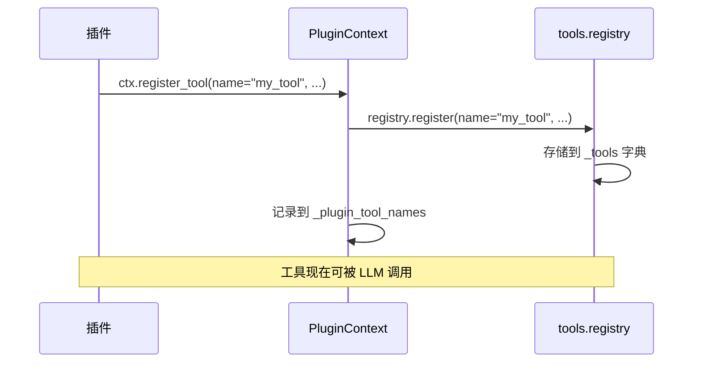
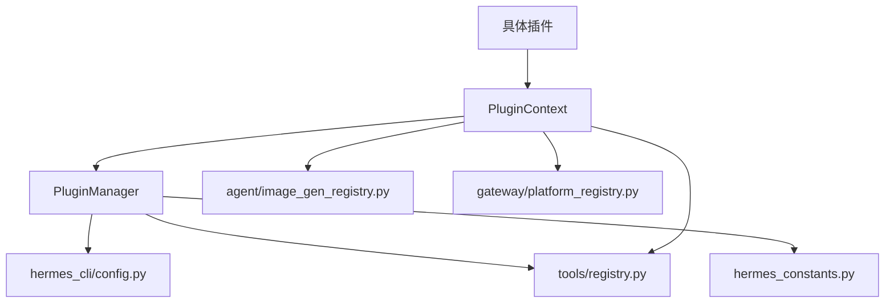
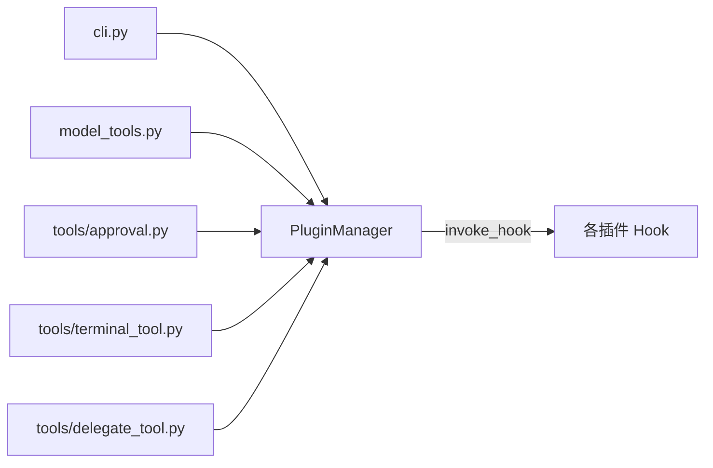

# Plugin System / 通用插件框架 技术设计方案

## 1. 模块定位

### 职责范围
插件系统是 Hermes Agent 的核心扩展机制，负责：
- **插件发现与加载**：从多个来源（bundled、user、project、pip）自动发现并加载插件
- **生命周期管理**：管理插件的注册、初始化、hook 调用和卸载
- **能力注册**：为插件提供统一的注册接口（工具、hook、命令、provider）
- **隔离与安全**：通过 opt-in 机制和配置控制插件的启用/禁用

### 不负责的内容
- **具体业务逻辑**：插件系统只提供框架，具体功能由各插件实现
- **工具执行**：工具的实际执行由 `tools/registry.py` 负责
- **配置存储**：配置的持久化由 `hermes_cli/config.py` 负责
- **权限控制**：命令审批由 `tools/approval.py` 负责

**来源**：`hermes_cli/plugins.py:1-32`

---

## 2. 核心能力

1. **多源插件发现**
   - 支持 4 种插件来源：bundled（内置）、user（用户）、project（项目）、pip（entry-point）
   - 支持扁平和分类两种目录结构（如 `disk-cleanup/` 和 `image_gen/openai/`）
   - 后加载的插件可覆盖先加载的同名插件

2. **插件分类系统**
   - `standalone`：独立插件，需通过 `plugins.enabled` 配置启用
   - `backend`：可插拔后端（如图像生成），bundled 版本自动加载
   - `exclusive`：独占类别（如 memory provider），通过专用配置选择
   - `platform`：消息平台适配器，bundled 版本自动加载
   - `model-provider`：模型提供商插件，由 `providers/` 模块管理

3. **生命周期 Hook**
   - 工具调用前后：`pre_tool_call`、`post_tool_call`
   - LLM 调用前后：`pre_llm_call`、`post_llm_call`
   - 会话生命周期：`on_session_start`、`on_session_end`、`on_session_finalize`、`on_session_reset`
   - 网关消息处理：`pre_gateway_dispatch`
   - 审批流程：`pre_approval_request`、`post_approval_response`
   - 输出转换：`transform_terminal_output`、`transform_tool_result`、`transform_llm_output`

4. **能力注册接口**
   - 工具注册：`ctx.register_tool()` → 注册到全局工具注册表
   - Hook 注册：`ctx.register_hook()` → 在特定生命周期点被调用
   - 命令注册：`ctx.register_command()` → 注册 slash 命令（如 `/disk-cleanup`）
   - CLI 命令注册：`ctx.register_cli_command()` → 注册 `hermes <subcommand>`
   - Provider 注册：`ctx.register_image_gen_provider()`、`ctx.register_video_gen_provider()` 等

5. **配置驱动的启用控制**
   - `plugins.enabled`：允许列表（opt-in 机制）
   - `plugins.disabled`：拒绝列表（优先级最高）
   - 通过 `hermes plugins enable/disable <name>` 管理

**来源**：`hermes_cli/plugins.py:128-168, 287-764`

---

## 3. 关键入口文件

| 文件路径 | 主要类/函数 | 作用 | 为什么重要 |
|---------|------------|------|-----------|
| `hermes_cli/plugins.py` | `PluginManager`<br>`PluginContext`<br>`discover_plugins()` | 插件系统核心：发现、加载、hook 调用 | 整个插件系统的大脑，管理所有插件的生命周期 |
| `hermes_cli/plugins_cmd.py` | `cmd_install()`<br>`cmd_enable()`<br>`cmd_toggle()` | CLI 命令实现：安装、启用、配置插件 | 用户与插件系统交互的主要入口 |
| `plugins/__init__.py` | （空文件） | 标记 plugins 为 Python 包 | 使 bundled 插件可被导入 |
| `plugins/disk-cleanup/__init__.py` | `register(ctx)` | 示例：独立插件实现 | 展示如何注册 hook 和命令 |
| `plugins/image_gen/openai/__init__.py` | `OpenAIImageGenProvider`<br>`register(ctx)` | 示例：backend 插件实现 | 展示如何注册可插拔 provider |
| `agent/image_gen_provider.py` | `ImageGenProvider` (ABC) | 图像生成 provider 的抽象基类 | 定义 backend 插件的接口契约 |
| `agent/image_gen_registry.py` | `register_provider()`<br>`get_provider()` | Provider 注册表 | 管理所有图像生成 backend 的注册和查找 |

**来源**：
- `hermes_cli/plugins.py:1-1594`
- `hermes_cli/plugins_cmd.py:1-1617`
- `plugins/disk-cleanup/__init__.py:1-317`
- `plugins/image_gen/openai/__init__.py:1-304`

---

## 4. 运行时流程

### 4.1 插件发现与加载流程



**关键代码路径**：
1. `cli.py` → `model_tools.py:discover_plugins()` （在工具初始化时调用）
2. `PluginManager.discover_and_load()` → `_scan_directory()` → `_parse_manifest()`
3. `_load_plugin()` → `_load_directory_module()` → `register(ctx)`

**来源**：`hermes_cli/plugins.py:790-949, 1167-1234`

### 4.2 Hook 调用流程



**关键代码路径**：
1. `model_tools.py` → `get_pre_tool_call_block_message()` → `invoke_hook("pre_tool_call")`
2. `model_tools.py` → 工具执行后 → `invoke_hook("post_tool_call")`
3. `PluginManager.invoke_hook()` → 遍历所有注册的回调

**来源**：
- `hermes_cli/plugins.py:1296-1330, 1428-1469`
- `model_tools.py:invoke_hook` 调用点
- `plugins/disk-cleanup/__init__.py:128-153` (hook 实现示例)

### 4.3 工具注册流程



**来源**：`hermes_cli/plugins.py:317-356`

---

## 5. 核心数据结构 / 状态

### 5.1 PluginManifest（插件清单）
```python
@dataclass
class PluginManifest:
    name: str                          # 插件名称
    version: str                       # 版本号
    description: str                   # 描述
    author: str                        # 作者
    requires_env: List[Union[str, Dict]]  # 必需的环境变量
    provides_tools: List[str]          # 提供的工具列表
    provides_hooks: List[str]          # 提供的 hook 列表
    source: str                        # "user" | "project" | "bundled" | "entrypoint"
    path: Optional[str]                # 插件目录路径
    kind: str                          # "standalone" | "backend" | "exclusive" | "platform" | "model-provider"
    key: str                           # 注册表键（路径派生，如 "image_gen/openai"）
```

**来源**：`hermes_cli/plugins.py:233-268`

### 5.2 LoadedPlugin（已加载插件）
```python
@dataclass
class LoadedPlugin:
    manifest: PluginManifest           # 插件清单
    module: Optional[types.ModuleType] # 已导入的 Python 模块
    tools_registered: List[str]        # 已注册的工具名称
    hooks_registered: List[str]        # 已注册的 hook 名称
    commands_registered: List[str]     # 已注册的命令名称
    enabled: bool                      # 是否已启用
    error: Optional[str]               # 加载错误信息
```

**来源**：`hermes_cli/plugins.py:271-281`

### 5.3 PluginManager 状态
```python
class PluginManager:
    _plugins: Dict[str, LoadedPlugin]           # key → 已加载插件
    _hooks: Dict[str, List[Callable]]           # hook_name → 回调列表
    _plugin_tool_names: Set[str]                # 插件注册的工具名称集合
    _plugin_platform_names: Set[str]            # 插件注册的平台名称集合
    _cli_commands: Dict[str, dict]              # CLI 子命令注册表
    _plugin_commands: Dict[str, dict]           # Slash 命令注册表
    _context_engine: Optional[ContextEngine]    # 插件注册的上下文引擎
    _plugin_skills: Dict[str, Dict[str, Any]]   # 插件技能注册表
    _discovered: bool                           # 是否已完成发现
    _cli_ref: Optional[Any]                     # CLI 实例引用
```

**来源**：`hermes_cli/plugins.py:770-785`

### 5.4 配置文件结构（config.yaml）
```yaml
plugins:
  enabled:                    # 允许列表（opt-in）
    - disk-cleanup
    - image_gen/openai
  disabled:                   # 拒绝列表（优先级最高）
    - some-plugin

image_gen:
  provider: openai            # 选择 backend 插件
  model: gpt-image-2-medium   # 选择模型

memory:
  provider: honcho            # 选择 exclusive 插件
```

**来源**：`hermes_cli/plugins.py:180-224, hermes_cli/plugins_cmd.py:578-628`

---

## 6. 与其他模块的关系

### 6.1 依赖关系



**依赖的模块**：
- `hermes_cli/config.py`：读取 `plugins.enabled/disabled` 配置
- `tools/registry.py`：注册插件提供的工具
- `hermes_constants.py`：获取 `HERMES_HOME` 路径
- `agent/image_gen_registry.py`：注册图像生成 provider
- `gateway/platform_registry.py`：注册消息平台适配器

**来源**：`hermes_cli/plugins.py:50-53, 337-350, 531-555, 677-697`

### 6.2 被调用关系



**被调用的场景**：
1. **启动时**：`cli.py` 和 `model_tools.py` 调用 `discover_plugins()` 初始化
2. **工具执行前后**：`model_tools.py` 调用 `invoke_hook("pre_tool_call")` 和 `invoke_hook("post_tool_call")`
3. **会话生命周期**：`cli.py` 调用 `invoke_hook("on_session_end")` 等
4. **审批流程**：`tools/approval.py` 调用 `invoke_hook("pre_approval_request")`

**来源**：
- `cli.py:get_plugin_manager()` 调用
- `model_tools.py:discover_plugins()` 调用
- `model_tools.py:invoke_hook()` 调用

### 6.3 边界说明

| 边界 | 插件系统负责 | 其他模块负责 |
|------|------------|------------|
| 工具注册 | 提供 `ctx.register_tool()` 接口 | `tools/registry.py` 存储和查找工具 |
| 工具执行 | 通过 hook 观察执行前后 | `model_tools.py` 实际执行工具 |
| 配置管理 | 读取 `plugins.enabled/disabled` | `hermes_cli/config.py` 持久化配置 |
| 命令审批 | 提供审批 hook | `tools/approval.py` 实现审批逻辑 |
| Provider 选择 | 注册所有 provider | `agent/image_gen_registry.py` 根据配置选择 |

---

## 7. 错误处理与降级策略

### 7.1 插件加载失败处理
```python
# 来源：hermes_cli/plugins.py:1167-1234
def _load_plugin(self, manifest: PluginManifest) -> None:
    loaded = LoadedPlugin(manifest=manifest)
    try:
        # 导入插件模块
        module = self._load_directory_module(manifest)
        # 调用 register()
        register_fn = getattr(module, "register", None)
        if register_fn is None:
            loaded.error = "no register() function"
            logger.warning("Plugin '%s' has no register() function", manifest.name)
        else:
            ctx = PluginContext(manifest, self)
            register_fn(ctx)
            loaded.enabled = True
    except Exception as exc:
        loaded.error = str(exc)
        logger.warning("Failed to load plugin '%s': %s", manifest.name, exc)
    
    # 即使失败也记录到 _plugins，状态为 disabled
    self._plugins[manifest.key or manifest.name] = loaded
```

**策略**：
- 单个插件加载失败不影响其他插件
- 失败的插件记录错误信息，状态设为 `enabled=False`
- 通过 `hermes plugins list` 可查看失败原因

### 7.2 Hook 执行失败处理
```python
# 来源：hermes_cli/plugins.py:1296-1330
def invoke_hook(self, hook_name: str, **kwargs: Any) -> List[Any]:
    callbacks = self._hooks.get(hook_name, [])
    results: List[Any] = []
    for cb in callbacks:
        try:
            ret = cb(**kwargs)
            if ret is not None:
                results.append(ret)
        except Exception as exc:
            # 单个 hook 失败不影响其他 hook
            logger.warning(
                "Hook '%s' callback %s raised: %s",
                hook_name,
                getattr(cb, "__name__", repr(cb)),
                exc,
            )
    return results
```

**策略**：
- 单个 hook 回调失败不影响其他回调
- 异常被捕获并记录日志
- 返回所有成功的回调结果

### 7.3 配置缺失降级
```python
# 来源：hermes_cli/plugins.py:180-224
def _get_enabled_plugins() -> Optional[set]:
    try:
        from hermes_cli.config import load_config
        config = load_config()
        plugins_cfg = config.get("plugins")
        if not isinstance(plugins_cfg, dict):
            return None  # 配置缺失，返回 None
        if "enabled" not in plugins_cfg:
            return None  # 未配置，返回 None
        enabled = plugins_cfg.get("enabled")
        if not isinstance(enabled, list):
            return None
        return set(enabled)
    except Exception:
        return None  # 任何异常都返回 None
```

**策略**：
- 配置缺失时返回 `None`，表示"尚未配置"
- 首次运行时，`migrate_config` 会自动填充已安装的插件
- 用户可通过 `hermes plugins enable <name>` 手动配置

### 7.4 环境变量缺失处理
```python
# 来源：plugins/image_gen/openai/__init__.py:136-142, 190-200
def is_available(self) -> bool:
    if not os.environ.get("OPENAI_API_KEY"):
        return False  # 缺少 API key，标记为不可用
    try:
        import openai
    except ImportError:
        return False  # 缺少依赖，标记为不可用
    return True

def generate(self, prompt: str, **kwargs) -> Dict[str, Any]:
    if not os.environ.get("OPENAI_API_KEY"):
        return error_response(
            error="OPENAI_API_KEY not set. Run `hermes tools` to configure",
            error_type="auth_required",
        )
```

**策略**：
- Provider 通过 `is_available()` 检查依赖
- 运行时再次检查，返回友好的错误信息
- 安装时通过 `_prompt_plugin_env_vars()` 引导用户配置

**来源**：`hermes_cli/plugins_cmd.py:194-286`

### 7.5 权限校验
```python
# 来源：hermes_cli/plugins.py:1428-1469
def get_pre_tool_call_block_message(...) -> Optional[str]:
    # 线程级工具白名单检查
    allowed = getattr(_thread_tool_whitelist, "allowed", None)
    if allowed is not None and tool_name not in allowed:
        return "Tool denied: not in whitelist"
    
    # 调用 pre_tool_call hook
    hook_results = invoke_hook("pre_tool_call", ...)
    for result in hook_results:
        if isinstance(result, dict) and result.get("action") == "block":
            message = result.get("message")
            if isinstance(message, str) and message:
                return message  # 返回阻止消息
    
    return None  # 允许执行
```

**策略**：
- 插件可通过 `pre_tool_call` hook 返回 `{"action": "block"}` 阻止工具执行
- 第一个返回 block 的 hook 生效
- 用于实现速率限制、安全策略等

### 7.6 兼容性处理
```python
# 来源：hermes_cli/plugins.py:1076-1108
# 自动检测 memory provider 插件
if kind == "standalone" and "kind" not in data:
    init_file = plugin_dir / "__init__.py"
    if init_file.exists():
        source_text = init_file.read_text(errors="replace")[:8192]
        if "register_memory_provider" in source_text:
            kind = "exclusive"  # 自动升级为 exclusive
        elif "register_provider" in source_text and "ProviderProfile" in source_text:
            kind = "model-provider"  # 自动升级为 model-provider
```

**策略**：
- 旧版插件未声明 `kind` 时，通过代码特征自动推断
- 保持向后兼容，避免破坏现有插件

---

## 附录：插件开发示例

### A.1 独立插件示例（disk-cleanup）

**目录结构**：
```
plugins/disk-cleanup/
├── plugin.yaml          # 插件清单
├── __init__.py          # 注册入口
├── disk_cleanup.py      # 核心逻辑
└── README.md
```

**plugin.yaml**：
```yaml
name: disk-cleanup
version: 2.0.0
description: "Auto-track and clean up ephemeral files"
author: "@LVT382009, NousResearch"
hooks:
  - post_tool_call
  - on_session_end
```

**__init__.py 关键代码**：
```python
def register(ctx) -> None:
    # 注册 hook
    ctx.register_hook("post_tool_call", _on_post_tool_call)
    ctx.register_hook("on_session_end", _on_session_end)
    
    # 注册 slash 命令
    ctx.register_command(
        "disk-cleanup",
        handler=_handle_slash,
        description="Track and clean up ephemeral files.",
    )
```

**来源**：`plugins/disk-cleanup/__init__.py:309-317`

### A.2 Backend 插件示例（image_gen/openai）

**目录结构**：
```
plugins/image_gen/openai/
├── plugin.yaml
└── __init__.py
```

**plugin.yaml**：
```yaml
name: openai
version: 1.0.0
description: "OpenAI image generation backend (gpt-image-2)"
author: NousResearch
kind: backend
requires_env:
  - OPENAI_API_KEY
```

**__init__.py 关键代码**：
```python
class OpenAIImageGenProvider(ImageGenProvider):
    @property
    def name(self) -> str:
        return "openai"
    
    def generate(self, prompt: str, **kwargs) -> Dict[str, Any]:
        # 实现图像生成逻辑
        ...

def register(ctx) -> None:
    ctx.register_image_gen_provider(OpenAIImageGenProvider())
```

**来源**：`plugins/image_gen/openai/__init__.py:124-304`

---

## 总结

Hermes Agent 的插件系统通过以下设计实现了高度的可扩展性：

1. **多源发现**：支持 bundled、user、project、pip 四种来源，后者可覆盖前者
2. **分类管理**：通过 `kind` 字段区分插件类型，不同类型有不同的加载策略
3. **生命周期 Hook**：在关键节点（工具调用、LLM 调用、会话生命周期）提供扩展点
4. **统一注册接口**：`PluginContext` 提供一致的 API 注册工具、hook、命令、provider
5. **配置驱动**：通过 `plugins.enabled/disabled` 实现 opt-in 安全机制
6. **容错设计**：单个插件失败不影响系统，hook 异常被隔离

该系统使得开发者可以在不修改核心代码的情况下，通过插件扩展 Hermes Agent 的功能。
