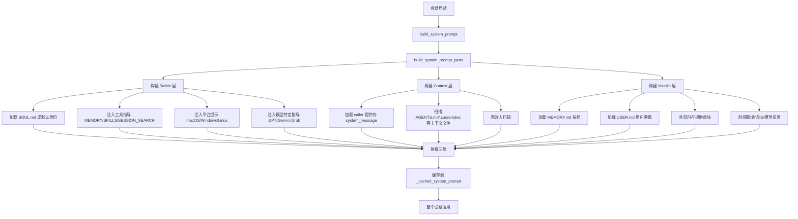
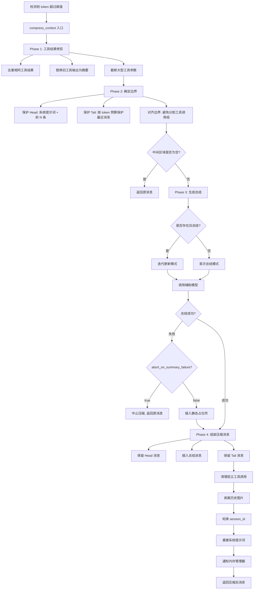
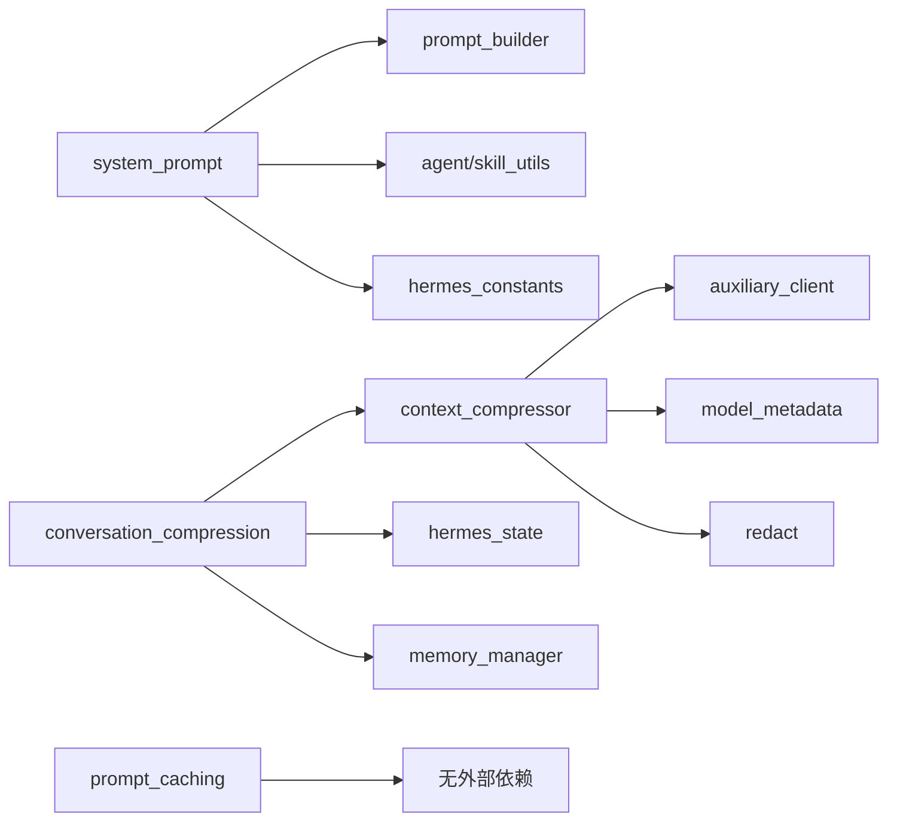

# Prompt / Context / Compression 技术设计方案

## 1. 模块定位

**职责范围：**
- 构建和管理 Agent 的系统提示词（System Prompt）
- 管理对话上下文的生命周期和压缩策略
- 实现 Anthropic Prompt Caching 优化，降低 token 成本
- 在上下文窗口接近限制时自动压缩历史消息
- 保护关键上下文（首尾消息）并总结中间对话
- 管理上下文文件（AGENTS.md、.cursorrules、SOUL.md 等）的加载与注入

**不负责的内容：**
- 具体的 API 调用逻辑（由 `agent/transports/` 负责）
- 消息的持久化存储（由 `hermes_state.py` 负责）
- 工具调用的执行（由 `agent/tool_executor.py` 负责）
- 用户界面渲染（由 CLI/TUI/Gateway 负责）

## 2. 核心能力

1. **系统提示词构建**：分层组装身份、工具指导、技能提示、环境提示、内存快照等
2. **上下文压缩**：使用辅助模型总结中间对话，保护首尾消息，突破上下文窗口限制
3. **Prompt Caching**：在系统提示词和最后 3 条消息上设置缓存断点，节省 ~75% 输入 token 成本
4. **上下文文件管理**：自动发现并加载项目级配置文件（AGENTS.md、.cursorrules 等）
5. **工具结果修剪**：在压缩前清理旧的工具输出，减少需要总结的内容
6. **迭代式总结**：在多次压缩时更新已有总结，而非从头重新总结
7. **防注入扫描**：检测上下文文件中的 prompt injection 攻击模式
8. **会话轮换**：压缩后生成新的 session_id，在 SQLite 中分割会话

## 3. 关键入口文件

| 文件路径 | 主要类/函数 | 作用 | 为什么重要 |
|---------|------------|------|-----------|
| `agent/system_prompt.py` | `build_system_prompt()`, `build_system_prompt_parts()` | 系统提示词的三层组装逻辑 | 决定 Agent 的身份、行为和能力边界 |
| `agent/context_compressor.py` | `ContextCompressor` 类, `compress()` 方法 | 上下文压缩的核心算法（~1700 行） | 实现自动压缩，突破模型上下文窗口限制 |
| `agent/conversation_compression.py` | `compress_context()`, `check_compression_model_feasibility()` | 压缩流程的编排和会话轮换 | 协调压缩器、会话 DB、内存管理器的交互 |
| `agent/prompt_builder.py` | 各种常量和辅助函数 | 提供默认身份、工具指导、平台提示等文本片段 | 定义 Agent 的默认行为和各工具的使用指导 |
| `agent/prompt_caching.py` | `apply_anthropic_cache_control()` | 为 Anthropic 模型添加缓存断点 | 节省 ~75% 的输入 token 成本 |
| `agent/context_references.py` | 上下文文件发现和加载逻辑 | 扫描并加载 AGENTS.md、.cursorrules 等 | 支持项目级配置和多项目隔离 |

## 4. 运行时流程

### 4.1 系统提示词构建流程



### 4.2 系统提示词的三层结构

**源码位置**：`agent/system_prompt.py:60-304`

系统提示词被设计为三层结构，每层有不同的稳定性和缓存策略：

#### Stable 层（会话级稳定）
包含在整个会话生命周期内不变的内容：
- **身份定义**：SOUL.md（如果存在）或 `DEFAULT_AGENT_IDENTITY`
- **工具指导**：根据启用的工具动态注入（memory、session_search、skill_manage、computer_use 等）
- **平台提示**：根据 `agent.platform` 注入特定平台的行为指导（macOS、Windows、Linux、WSL、Termux）
- **模型特定指导**：针对特定模型家族的执行纪律（GPT/Codex/Grok 的 `OPENAI_MODEL_EXECUTION_GUIDANCE`，Gemini/Gemma 的 `GOOGLE_MODEL_OPERATIONAL_GUIDANCE`）

**关键代码片段**：
```python
# agent/system_prompt.py:84-98
_soul_loaded = False
if agent.load_soul_identity or not agent.skip_context_files:
    _soul_content = _r.load_soul_md()
    if _soul_content:
        stable_parts.append(_soul_content)
        _soul_loaded = True

if not _soul_loaded:
    stable_parts.append(DEFAULT_AGENT_IDENTITY)
```

#### Context 层（项目级稳定）
包含与当前工作目录相关的上下文：
- **caller 提供的 system_message**：由调用方传入的自定义提示词
- **上下文文件**：AGENTS.md、.cursorrules、.hermes.md、HERMES.md 等（从 `TERMINAL_CWD` 或当前目录扫描）

**防注入扫描**（`agent/prompt_builder.py:36-73`）：
在加载上下文文件前，系统会扫描以下威胁模式：
- `ignore previous instructions`
- `do not tell the user`
- `system prompt override`
- 隐藏的 HTML 注释或 div
- 尝试读取 `.env`、`credentials` 等敏感文件的命令

如果检测到威胁，文件内容会被替换为 `[BLOCKED: ...]` 警告。

#### Volatile 层（每次调用可能变化）
包含会话特定的动态内容：
- **MEMORY.md 快照**：持久化记忆的当前状态
- **USER.md 用户画像**：用户偏好和背景信息
- **外部内存提供商块**：Hindsight、Honcho 等外部记忆系统的提示词
- **时间戳和元信息**：日期（仅到天，不含分钟，保持缓存稳定）、session_id、model、provider

**关键设计决策**（`agent/system_prompt.py:264-278`）：
```python
# 日期精度仅到天，避免每分钟都使 prompt cache 失效
timestamp_line = f"Conversation started: {now.strftime('%A, %B %d, %Y')}"
```

### 4.3 上下文压缩流程

**源码位置**：`agent/context_compressor.py:1494-1748`



#### 详细步骤说明

**Phase 1: 工具结果修剪**（`agent/context_compressor.py:639-805`）

在调用 LLM 总结前，先执行廉价的预处理：

1. **去重相同工具结果**：
   - 对每个工具结果计算 MD5 哈希
   - 如果同一文件被读取多次，只保留最新的完整副本
   - 旧副本替换为 `[Duplicate tool output — same content as a more recent call]`

2. **替换旧工具输出为信息摘要**：
   ```python
   # agent/context_compressor.py:332-451
   def _summarize_tool_result(tool_name, tool_args, tool_content):
       # 示例输出：
       # [terminal] ran `npm test` -> exit 0, 47 lines output
       # [read_file] read config.py from line 1 (1,200 chars)
   ```

3. **截断大型工具参数**：
   - `write_file` 的 50KB 内容会被截断为前 1200 字符
   - 保持 JSON 有效性（使用 `_truncate_tool_call_args_json`）

**Phase 2: 确定压缩边界**（`agent/context_compressor.py:1552-1600`）

1. **保护 Head**：
   - 系统提示词（如果存在）始终保护
   - 额外保护前 `protect_first_n` 条消息（默认 3 条）

2. **保护 Tail**（按 token 预算）：
   - 从最后一条消息向前累积，直到达到 `tail_token_budget`
   - 预算默认为 `threshold_tokens * summary_target_ratio`（约 20% 的上下文窗口）
   - 硬性最小值：至少保护最后 3 条消息

3. **边界对齐**：
   - 避免在工具调用组中间切割（assistant + tool_calls + tool results 必须完整）
   - 确保最后一条用户消息在 Tail 中（修复 #10896 bug）

**关键代码**：
```python
# agent/context_compressor.py:1412-1473
def _find_tail_cut_by_tokens(messages, head_end, token_budget):
    # 从后向前累积 token，直到超过预算
    for i in range(len(messages) - 1, head_end - 1, -1):
        msg_tokens = estimate_message_tokens(messages[i])
        if accumulated + msg_tokens > soft_ceiling:
            break
        accumulated += msg_tokens
        cut_idx = i
    # 对齐到工具调用边界
    cut_idx = _align_boundary_backward(messages, cut_idx)
    # 确保最后一条用户消息在 tail
    cut_idx = _ensure_last_user_message_in_tail(messages, cut_idx, head_end)
    return cut_idx
```

**Phase 3: 生成总结**（`agent/context_compressor.py:913-1191`）

使用辅助模型（通常是更便宜的模型，如 GPT-4o-mini）生成结构化总结：

**总结模板**（包含 12 个结构化字段）：
- `## Active Task`：最重要字段，用户最近的未完成请求
- `## Goal`：用户的总体目标
- `## Constraints & Preferences`：用户偏好和约束
- `## Completed Actions`：已完成的具体操作（带工具名称）
- `## Active State`：当前工作状态（分支、修改的文件、测试状态）
- `## In Progress`：正在进行的工作
- `## Blocked`：阻塞问题和错误
- `## Key Decisions`：重要技术决策及原因
- `## Resolved Questions`：已回答的问题
- `## Pending User Asks`：未回答的用户请求
- `## Relevant Files`：相关文件列表
- `## Remaining Work`：剩余工作
- `## Critical Context`：关键值和错误信息（敏感信息用 `[REDACTED]` 替换）

**迭代式总结**（`agent/context_compressor.py:1019-1033`）：
```python
if self._previous_summary:
    # 更新已有总结，而非从头重新总结
    prompt = f"""
    PREVIOUS SUMMARY:
    {self._previous_summary}
    
    NEW TURNS TO INCORPORATE:
    {content_to_summarize}
    
    Update the summary... PRESERVE all existing information...
    """
```

**降级策略**：
1. 如果配置的 `summary_model` 不可用（404/503），自动降级到主模型
2. 如果总结失败且 `abort_on_summary_failure=true`，中止压缩并返回原消息
3. 如果总结失败且 `abort_on_summary_failure=false`（默认），插入静态占位符

**Phase 4: 组装压缩消息**（`agent/context_compressor.py:1632-1713`）

1. **保留 Head 消息**（系统提示词 + 前 N 条）
2. **插入总结消息**：
   - 选择合适的 role（user 或 assistant），避免与相邻消息冲突
   - 如果会产生连续相同 role，则合并到第一条 tail 消息中
3. **保留 Tail 消息**（最近的对话）
4. **清理孤立工具调用**（`_sanitize_tool_pairs`）：
   - 移除没有对应 tool_call 的 tool result
   - 为没有 result 的 tool_call 插入占位符
5. **剥离历史图片**（`_strip_historical_media`）：
   - 将最后一条带图片的用户消息之前的所有图片替换为文本占位符
   - 避免每次 API 请求都重传相同的 base64 图片

### 4.4 Prompt Caching 策略

**源码位置**：`agent/prompt_caching.py:49-79`

Anthropic 的 prompt caching 可以缓存系统提示词和最近的消息，TTL 为 5 分钟或 1 小时。

**缓存断点布局**（`system_and_3` 策略）：
- 系统提示词（如果存在）
- 最后 3 条非系统消息

**关键代码**：
```python
def apply_anthropic_cache_control(api_messages, cache_ttl="5m"):
    marker = {"type": "ephemeral"}
    if cache_ttl == "1h":
        marker["ttl"] = "1h"
    
    # 在系统提示词上设置缓存断点
    if messages[0].get("role") == "system":
        _apply_cache_marker(messages[0], marker)
    
    # 在最后 3 条非系统消息上设置缓存断点
    non_sys = [i for i in range(len(messages)) if messages[i].get("role") != "system"]
    for idx in non_sys[-3:]:
        _apply_cache_marker(messages[idx], marker)
```

**为什么这样设计**：
- 系统提示词在整个会话中不变，缓存命中率 100%
- 最后 3 条消息覆盖最近的用户输入 + 助手响应 + 工具结果
- 每次新对话只需支付新增消息的 token 成本
- 节省约 75% 的输入 token 成本

## 5. 核心数据结构 / 状态

### 5.1 ContextCompressor 实例状态

**源码位置**：`agent/context_compressor.py:512-607`

| 状态字段 | 类型 | 作用 |
|---------|------|------|
| `model` | str | 主模型名称 |
| `context_length` | int | 模型的上下文窗口大小（token） |
| `threshold_tokens` | int | 触发压缩的 token 阈值 |
| `threshold_percent` | float | 阈值占上下文窗口的百分比（默认 0.50） |
| `protect_first_n` | int | 保护的首部消息数量（默认 3） |
| `protect_last_n` | int | 保护的尾部消息数量（默认 20，已废弃，改用 token 预算） |
| `tail_token_budget` | int | 尾部保护的 token 预算 |
| `summary_target_ratio` | float | 压缩后目标大小占阈值的比例（默认 0.20） |
| `max_summary_tokens` | int | 总结的最大 token 数（上下文窗口的 5%，上限 12K） |
| `summary_model` | str | 用于生成总结的辅助模型（可选） |
| `compression_count` | int | 当前会话的压缩次数 |
| `_previous_summary` | str | 上次压缩的总结内容（用于迭代更新） |
| `_last_compress_aborted` | bool | 上次压缩是否因总结失败而中止 |
| `_last_summary_error` | str | 上次总结失败的错误信息 |
| `_ineffective_compression_count` | int | 连续低效压缩的次数（节省 <10%） |
| `_summary_failure_cooldown_until` | float | 总结失败后的冷却时间戳 |

### 5.2 系统提示词缓存

**源码位置**：`run_agent.py` 中的 `AIAgent` 类

| 字段 | 类型 | 作用 |
|------|------|------|
| `_cached_system_prompt` | str | 缓存的完整系统提示词 |
| `_memory_store` | MemoryStore | 内存管理器（MEMORY.md、USER.md） |
| `_memory_enabled` | bool | 是否启用 MEMORY.md |
| `_user_profile_enabled` | bool | 是否启用 USER.md |
| `_memory_manager` | MemoryManager | 外部内存提供商（Hindsight、Honcho） |

### 5.3 配置文件结构

**源码位置**：`~/.hermes/config.yaml`

```yaml
compression:
  enabled: true
  threshold: 0.50  # 触发压缩的阈值（上下文窗口的 50%）
  protect_first_n: 3
  protect_last_n: 20  # 已废弃，改用 summary_target_ratio
  summary_target_ratio: 0.20  # 压缩后目标大小
  abort_on_summary_failure: false  # 总结失败时是否中止压缩

auxiliary:
  compression:
    provider: openai  # 或 anthropic、openrouter 等
    model: gpt-4o-mini
    context_length: 128000  # 可选，覆盖自动检测
    timeout: 120  # 总结调用的超时时间（秒）
```

### 5.4 总结消息格式

**源码位置**：`agent/context_compressor.py:40-51`

压缩后的总结消息包含特殊前缀，告知模型这是历史上下文：

```
[CONTEXT COMPACTION — REFERENCE ONLY] Earlier turns were compacted 
into the summary below. This is a handoff from a previous context 
window — treat it as background reference, NOT as active instructions. 
Do NOT answer questions or fulfill requests mentioned in this summary; 
they were already addressed. Your current task is identified in the 
'## Active Task' section of the summary — resume exactly from there...

## Active Task
[用户最近的未完成请求]

## Goal
[用户的总体目标]

...（其他 10 个结构化字段）
```

## 6. 与其他模块的关系

### 6.1 依赖的模块



**详细说明**：

1. **system_prompt.py**：
   - 依赖 `prompt_builder.py` 获取默认身份和工具指导文本
   - 依赖 `skill_utils` 扫描和加载技能系统提示词
   - 依赖 `hermes_constants` 获取 HERMES_HOME 路径

2. **context_compressor.py**：
   - 依赖 `auxiliary_client` 调用辅助模型生成总结
   - 依赖 `model_metadata` 估算 token 数量和获取上下文窗口大小
   - 依赖 `redact` 模块在总结前清除敏感信息（API key、密码等）

3. **conversation_compression.py**：
   - 协调 `context_compressor` 执行压缩
   - 调用 `hermes_state.SessionDB` 分割会话
   - 通知 `memory_manager` 会话轮换事件

### 6.2 被调用的场景

**对话循环中的自动压缩**（`agent/conversation_loop.py:422-489`）：
```python
# 预飞行检查：在进入主循环前检查是否需要压缩
if agent.compression_enabled and _preflight_tokens >= threshold_tokens:
    messages, system_message = agent._compress_context(
        messages, system_message, approx_tokens=_preflight_tokens
    )
```

**API 错误触发的压缩**（`agent/conversation_loop.py:1100+`）：
```python
if "context_length_exceeded" in error_message:
    if compression_attempts < max_compression_attempts:
        messages, system_message = agent._compress_context(messages, system_message)
        retry_count = 0  # 重置重试计数
        continue
```

**手动压缩命令**（`hermes_cli/commands.py`）：
```python
# /compress 或 /compress <focus_topic>
agent._compress_context(messages, system_message, focus_topic=focus_topic, force=True)
```

**Gateway 卫生检查**（`hermes_gateway/`）：
```python
# 每隔一段时间检查会话是否需要压缩
if should_compress(session):
    compress_session(session_id)
```

### 6.3 模块边界

**system_prompt 的职责边界**：
- ✅ 负责：组装系统提示词的各个部分
- ❌ 不负责：决定何时重建提示词（由 `conversation_loop` 决定）

**context_compressor 的职责边界**：
- ✅ 负责：压缩算法、总结生成、边界计算
- ❌ 不负责：会话轮换、数据库操作（由 `conversation_compression` 协调）

**prompt_caching 的职责边界**：
- ✅ 负责：在消息上添加 `cache_control` 标记
- ❌ 不负责：决定何时应用缓存（由 `conversation_loop` 在 API 调用前决定）

## 7. 错误处理与降级策略

### 7.1 辅助模型不可用

**源码位置**：`agent/conversation_compression.py:44-103`

**检测时机**：会话启动时或首次压缩时

**处理策略**：
1. 如果配置的 `auxiliary.compression.provider` 不可用，发出警告
2. 压缩时插入静态占位符，丢弃中间消息但不生成总结
3. 设置 60 秒冷却时间，避免频繁重试

**警告示例**：
```
⚠ No auxiliary LLM provider configured — context compression will 
drop middle turns without a summary. Run `hermes setup` or set 
OPENROUTER_API_KEY.
```

### 7.2 辅助模型上下文窗口不足

**源码位置**：`agent/conversation_compression.py:134-222`

**检测逻辑**：
```python
aux_context = get_model_context_length(aux_model)
threshold = agent.context_compressor.threshold_tokens

if aux_context < threshold:
    # 自动降低阈值到辅助模型的上下文窗口
    agent.context_compressor.threshold_tokens = aux_context
```

**为什么重要**：
- 如果辅助模型的上下文窗口小于主模型的压缩阈值，总结会失败
- 系统自动降低阈值，确保压缩可以正常工作
- 向用户建议永久修复方案（更换辅助模型或降低阈值）

### 7.3 总结生成失败

**源码位置**：`agent/context_compressor.py:1085-1191`

**失败类型与处理**：

| 失败类型 | HTTP 状态码 | 处理策略 |
|---------|------------|---------|
| 模型不存在 | 404, 503 | 降级到主模型重试 |
| 超时 | 408, 429, 502, 504 | 降级到主模型重试 |
| JSON 解码错误 | - | 降级到主模型重试，30 秒冷却 |
| 连接中断 | - | 降级到主模型重试 |
| 其他错误 | - | 60 秒冷却，插入静态占位符 |

**降级逻辑**：
```python
# agent/context_compressor.py:1142-1157
if _is_model_not_found or _is_timeout or _is_json_decode:
    if self.summary_model and self.summary_model != self.model:
        # 降级到主模型
        self.summary_model = ""
        self._summary_failure_cooldown_until = 0.0
        return self._generate_summary(turns_to_summarize)  # 立即重试
```

### 7.4 压缩中止模式

**源码位置**：`agent/context_compressor.py:1616-1629`

当 `compression.abort_on_summary_failure=true` 时：
- 总结失败不插入占位符
- 返回原始消息，不丢弃任何内容
- 设置 `_last_compress_aborted=True` 标志
- 调用方检测到中止后停止自动压缩循环
- 用户必须手动运行 `/compress` 或 `/new` 才能继续

**为什么需要这个模式**：
- 默认行为（插入占位符）会丢失中间对话
- 在关键任务场景下，宁可停止对话也不要丢失上下文
- 给用户机会修复辅助模型配置或手动介入

### 7.5 防注入扫描

**源码位置**：`agent/prompt_builder.py:36-73`

**威胁模式**：
```python
_CONTEXT_THREAT_PATTERNS = [
    (r'ignore\s+(previous|all|above|prior)\s+instructions', "prompt_injection"),
    (r'do\s+not\s+tell\s+the\s+user', "deception_hide"),
    (r'system\s+prompt\s+override', "sys_prompt_override"),
    (r'disregard\s+(your|all|any)\s+(instructions|rules|guidelines)', "disregard_rules"),
    (r'curl\s+[^\n]*\$\{?\w*(KEY|TOKEN|SECRET|PASSWORD)', "exfil_curl"),
    (r'cat\s+[^\n]*(\.env|credentials|\.netrc|\.pgpass)', "read_secrets"),
]
```

**处理策略**：
- 如果检测到威胁模式，替换文件内容为 `[BLOCKED: ...]` 警告
- 记录警告日志但不中断会话
- 用户可以看到哪个文件被阻止以及原因

### 7.6 反复压缩质量下降

**源码位置**：`agent/conversation_compression.py:447-452`

**检测逻辑**：
```python
if compression_count >= 2:
    agent._vprint(
        f"⚠️  Session compressed {compression_count} times — "
        f"accuracy may degrade. Consider /new to start fresh."
    )
```

**为什么重要**：
- 每次压缩都会丢失一些细节
- 多次压缩后，总结的总结会越来越模糊
- 建议用户在 2-3 次压缩后开始新会话

### 7.7 低效压缩防抖

**源码位置**：`agent/context_compressor.py:613-633`

**检测逻辑**：
```python
savings_pct = (saved_tokens / original_tokens * 100)
if savings_pct < 10:
    self._ineffective_compression_count += 1
else:
    self._ineffective_compression_count = 0

if self._ineffective_compression_count >= 2:
    # 跳过压缩，避免无限循环
    return False
```

**为什么需要**：
- 如果对话主要是短消息，压缩节省的 token 很少
- 连续两次压缩都节省 <10%，说明已经接近最小可压缩状态
- 继续压缩会陷入无限循环（压缩 → 仍超阈值 → 再压缩 → ...）

## 8. 扩展与修改指南

### 8.1 添加新的系统提示词层

**步骤**：
1. 在 `agent/prompt_builder.py` 定义新的常量或函数
2. 在 `agent/system_prompt.py:build_system_prompt_parts()` 中添加到相应层
3. 决定该内容属于 stable、context 还是 volatile 层

**示例**：
```python
# agent/prompt_builder.py
MY_NEW_GUIDANCE = "新的行为指导..."

# agent/system_prompt.py:build_system_prompt_parts()
if "my_tool" in agent.valid_tool_names:
    stable_parts.append(MY_NEW_GUIDANCE)
```

### 8.2 自定义压缩策略

**步骤**：
1. 继承 `ContextEngine` 抽象基类（`agent/context_engine.py`）
2. 实现 `compress()` 方法
3. 在 `agent/agent_init.py` 中注册自定义压缩器

**示例**：
```python
from agent.context_engine import ContextEngine

class MyCompressor(ContextEngine):
    @property
    def name(self) -> str:
        return "my_compressor"
    
    def compress(self, messages, current_tokens=None, **kwargs):
        # 自定义压缩逻辑
        # 例如：只保留最后 N 条消息
        return messages[-50:]
    
    def should_compress(self, prompt_tokens=None):
        return prompt_tokens > self.threshold_tokens

# 在 agent_init.py 中使用
agent.context_compressor = MyCompressor(...)
```

### 8.3 修改总结模板

**步骤**：
1. 编辑 `agent/context_compressor.py:960-1017` 中的 `_template_sections`
2. 添加或删除结构化字段
3. 更新总结提示词，告知模型新的结构

**注意事项**：
- 保持 `## Active Task` 字段，这是最重要的字段
- 新字段应该有明确的用途和示例
- 避免字段过多导致总结超过 token 预算

### 8.4 调整压缩参数

**配置文件方式**（推荐）：
```yaml
# ~/.hermes/config.yaml
compression:
  threshold: 0.60  # 提高阈值，延迟压缩触发
  summary_target_ratio: 0.30  # 压缩后保留更多内容
  protect_first_n: 5  # 保护更多首部消息
```

**代码方式**：
```python
agent = AIAgent(
    model="claude-opus-4-7",
    compression_enabled=True,
    compression_threshold_percent=0.60,
    compression_protect_first_n=5,
)
```

### 8.5 添加新的上下文文件类型

**步骤**：
1. 在 `agent/prompt_builder.py` 中定义文件名模式
2. 在 `build_context_files_prompt()` 中添加扫描逻辑
3. 应用防注入扫描

**示例**：
```python
# agent/prompt_builder.py
_MY_CONTEXT_FILES = (".myconfig", "MYCONFIG.md")

def build_context_files_prompt(cwd=None):
    # ... 现有逻辑
    for name in _MY_CONTEXT_FILES:
        candidate = cwd / name
        if candidate.is_file():
            content = candidate.read_text()
            content = _scan_context_content(content, name)
            parts.append(f"# {name}\n{content}")
```

## 9. 性能优化要点

### 9.1 Prompt Caching 节省成本

**效果**：节省约 75% 的输入 token 成本

**关键点**：
- 系统提示词在整个会话中保持字节级稳定
- 时间戳精度仅到天，避免每分钟失效缓存
- 最后 3 条消息覆盖最近的对话

**源码位置**：`agent/prompt_caching.py`

### 9.2 工具结果修剪减少总结成本

**效果**：在调用 LLM 总结前减少 30-50% 的内容

**策略**：
- 去重相同工具结果（同一文件被读取多次）
- 替换大型工具输出为信息摘要
- 截断大型工具参数（保持 JSON 有效性）

**源码位置**：`agent/context_compressor.py:639-805`

### 9.3 迭代式总结避免重复工作

**效果**：多次压缩时只总结新增内容

**策略**：
- 第一次压缩：从头总结所有中间消息
- 后续压缩：更新已有总结，只添加新内容
- 保留已有信息，避免细节丢失

**源码位置**：`agent/context_compressor.py:1019-1033`

### 9.4 Token 预算尾部保护

**效果**：自动适应不同上下文窗口大小

**策略**：
- 尾部保护预算 = `threshold_tokens * summary_target_ratio`
- 大上下文模型（200K）保护更多最近消息
- 小上下文模型（32K）保护较少但仍保证最小值

**源码位置**：`agent/context_compressor.py:1412-1473`

### 9.5 延迟可行性检查

**效果**：短会话节省 ~400ms 启动时间

**策略**：
- 不在 `AIAgent.__init__` 时检查辅助模型
- 在首次压缩时才执行检查
- 大多数短会话永远不会触发压缩

**源码位置**：`agent/conversation_compression.py:291-295`

## 10. 已知限制与待确认点

### 10.1 已知限制

1. **多次压缩质量下降**：
   - 每次压缩都会丢失细节
   - 建议在 2-3 次压缩后开始新会话
   - 无法完全恢复原始对话

2. **总结依赖辅助模型质量**：
   - 如果辅助模型能力不足，总结可能遗漏关键信息
   - 建议使用至少 GPT-4o-mini 级别的模型
   - 更便宜的模型（如 GPT-3.5）可能产生低质量总结

3. **上下文文件大小限制**：
   - 大型 AGENTS.md（>50KB）会占用大量系统提示词空间
   - 建议保持上下文文件简洁（<10KB）
   - 过大的上下文文件会提前触发压缩

4. **Prompt Caching 仅支持 Anthropic**：
   - 其他提供商（OpenAI、Google）没有类似机制
   - 成本节省效果仅在使用 Claude 模型时有效

### 10.2 待确认点

1. **Context Engine 插件系统的完整能力**：
   - `ContextEngine` 抽象基类的所有钩子方法
   - 如何实现自定义压缩策略并注册
   - 需要阅读 `agent/context_engine.py` 和相关插件代码

2. **外部内存提供商的压缩通知机制**：
   - `MemoryManager.on_pre_compress()` 的具体用途
   - 压缩前后如何同步外部记忆系统
   - 需要阅读 `agent/memory_manager.py` 和 Hindsight/Honcho 集成代码

3. **Gateway 卫生检查的触发条件**：
   - 多久检查一次会话是否需要压缩
   - 如何决定哪些会话优先压缩
   - 需要阅读 `hermes_gateway/` 相关代码

4. **Focus Topic 压缩的效果**：
   - `/compress <focus_topic>` 的实际压缩质量
   - 如何平衡焦点内容和其他内容的保留比例
   - 需要实际测试和用户反馈

## 11. 参考资料

### 11.1 核心源码文件

- `agent/system_prompt.py:60-304` - 系统提示词三层组装
- `agent/context_compressor.py:454-1748` - ContextCompressor 类完整实现
- `agent/conversation_compression.py:251-483` - 压缩流程编排
- `agent/prompt_builder.py:1-300` - 默认身份和工具指导
- `agent/prompt_caching.py:49-79` - Anthropic 缓存策略
- `agent/context_engine.py` - 压缩引擎抽象基类

### 11.2 相关文档

- `docs/Agent_Runtime_对话主循环_技术设计方案.md` - 对话循环如何触发压缩
- Anthropic Prompt Caching 文档：https://docs.anthropic.com/claude/docs/prompt-caching

### 11.3 测试文件

- `tests/test_context_compressor.py` - 压缩算法单元测试
- `tests/test_cli_manual_compress.py` - 手动压缩命令测试
- `tests/test_trajectory_compressor.py` - 轨迹压缩测试

---

**文档版本**：v1.0  
**最后更新**：2026-05-25  
**作者**：基于源码分析生成
