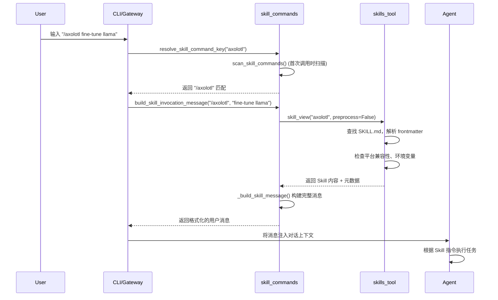
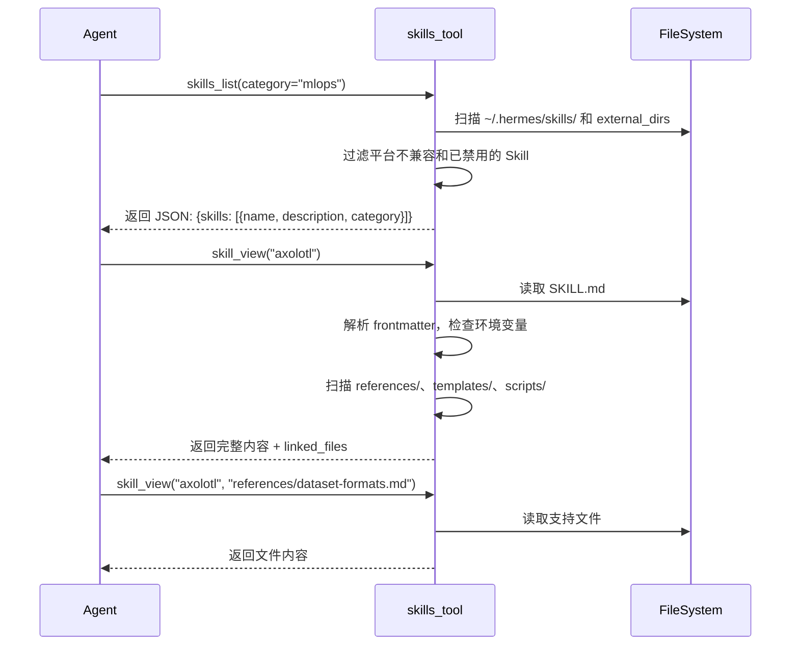
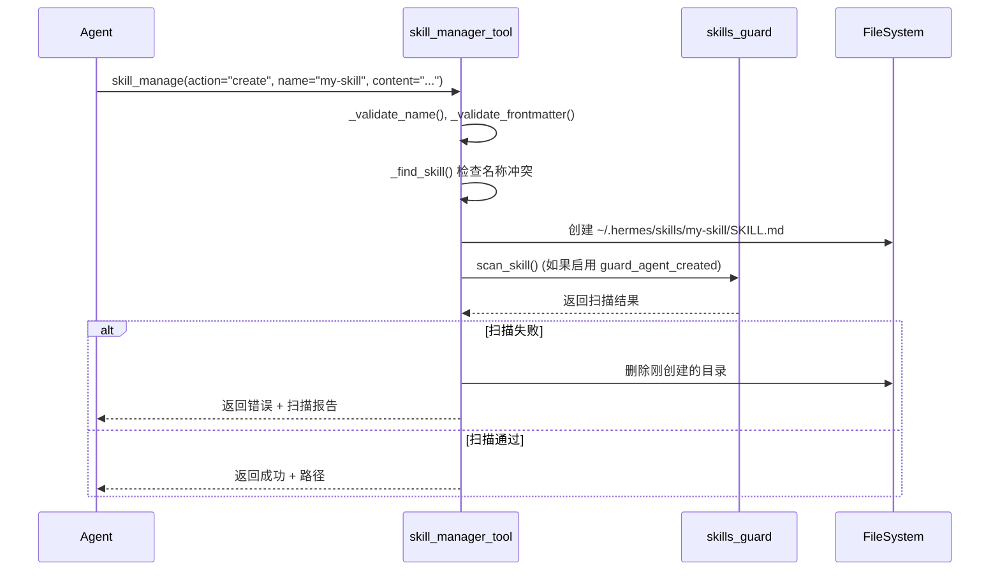

# Skills / Optional Skills 技术设计方案

## 1. 模块定位

### 职责
Skills 系统是 Hermes Agent 的**程序性知识库**（Procedural Memory），负责：
- 存储和管理可复用的任务执行指南（SKILL.md 文件）
- 提供渐进式披露机制（Progressive Disclosure）：列表 → 完整内容 → 支持文件
- 支持 Skill 的动态加载、创建、编辑、删除
- 管理 Skill 的生命周期（安装、禁用、卸载、归档）
- 提供 Skill Hub 集成，支持从外部源（GitHub、官方仓库）安装 Skill
- 支持插件（Plugin）提供的命名空间 Skill

### 不负责什么
- **不负责**通用声明式记忆（由 `MEMORY.md`、`USER.md` 管理）
- **不负责**工具（Tool）的注册和执行（由 `tools/registry.py` 管理）
- **不负责**对话历史管理（由 `agent/context_compressor.py` 管理）
- **不负责**实际命令执行（由 `terminal`、`execute_code` 等工具完成）

---

## 2. 核心能力

1. **Skill 发现与列表**：扫描本地和外部目录，返回 Skill 元数据
2. **Skill 加载**：读取 SKILL.md 及其支持文件（references、templates、scripts、assets）
3. **Skill 管理**：Agent 可创建、编辑、打补丁、删除 Skill
4. **Slash 命令调用**：用户通过 `/skill-name` 快速激活 Skill
5. **Skill Bundle**：将多个 Skill 打包为一个命令（如 `/backend-dev` 加载 3 个相关 Skill）
6. **平台过滤**：根据 OS 平台（macOS、Linux、Windows）过滤不兼容的 Skill
7. **环境变量管理**：Skill 可声明所需环境变量，系统自动提示用户配置
8. **模板变量替换**：支持 `${HERMES_SKILL_DIR}`、`${HERMES_SESSION_ID}` 等动态变量
9. **内联 Shell 执行**：支持 `!`date +%Y-%m-%d`` 语法在加载时执行命令
10. **安全扫描**：通过 `skills_guard` 检测恶意代码、prompt injection
11. **Skill Hub 集成**：从远程仓库搜索、安装、更新 Skill
12. **Curator 自动归档**：根据使用频率自动归档不活跃的 Skill

---

## 3. 关键入口文件

| 文件路径 | 主要类/函数 | 作用 | 为什么重要 |
|---------|------------|------|-----------|
| `tools/skills_tool.py` | `skills_list()`, `skill_view()` | Agent 工具：列出和查看 Skill | Agent 通过这两个工具发现和加载 Skill |
| `agent/skill_commands.py` | `scan_skill_commands()`, `build_skill_invocation_message()` | Slash 命令扫描和消息构建 | 用户输入 `/skill-name` 时的核心调度逻辑 |
| `agent/skill_utils.py` | `parse_frontmatter()`, `skill_matches_platform()`, `get_disabled_skill_names()` | 轻量级元数据解析工具 | 被所有 Skill 模块共享，避免循环依赖 |
| `agent/skill_bundles.py` | `get_skill_bundles()`, `build_bundle_invocation_message()` | Skill Bundle 管理 | 支持一次加载多个相关 Skill |
| `agent/skill_preprocessing.py` | `substitute_template_vars()`, `expand_inline_shell()` | 模板变量和内联 Shell 处理 | 让 Skill 内容动态化 |
| `tools/skill_manager_tool.py` | `skill_manage()` | Agent 工具：创建/编辑/删除 Skill | Agent 的程序性记忆写入接口 |
| `hermes_cli/skills_config.py` | `skills_command()` | CLI 命令：`hermes skills` | 用户通过 TUI 启用/禁用 Skill |
| `tools/skills_hub.py` | `GitHubSource`, `HubLockFile` | Skill Hub 源适配器和安装状态管理 | 从外部仓库安装 Skill 的核心逻辑 |
| `tools/skills_guard.py` | `scan_skill()`, `should_allow_install()` | 安全扫描 | 防止恶意 Skill 注入 |
| `tools/skill_usage.py` | `bump_use()`, `bump_view()` | 使用遥测 | Curator 根据使用频率决定归档策略 |

---

## 4. 运行时流程

### 4.1 用户通过 Slash 命令调用 Skill



### 4.2 Agent 通过工具调用查看 Skill



### 4.3 Agent 创建新 Skill



---

## 5. 核心数据结构 / 状态

### 5.1 SKILL.md 文件格式

```yaml
---
name: skill-name              # 必需，≤64 字符
description: Brief description # 必需，≤1024 字符
version: 1.0.0                # 可选
platforms: [macos, linux]     # 可选，限制 OS 平台
required_environment_variables:  # 可选，声明所需环境变量
  - name: API_KEY
    prompt: "Enter your API key"
    help: "Get it from https://example.com/api"
metadata:                     # 可选
  hermes:
    tags: [mlops, fine-tuning]
    related_skills: [peft, lora]
    config:                   # Skill 配置变量
      - key: wiki.path
        description: "Wiki directory path"
        default: "~/wiki"
---

# Skill Title

Full instructions and content here...
```

### 5.2 目录结构

```
~/.hermes/skills/
├── my-skill/
│   ├── SKILL.md           # 主指令文件（必需）
│   ├── references/        # 参考文档
│   │   └── api.md
│   ├── templates/         # 模板文件
│   │   └── config.yaml
│   ├── scripts/           # 可执行脚本
│   │   └── setup.sh
│   └── assets/            # 其他资源文件
│       └── diagram.png
├── mlops/                 # 分类目录
│   └── axolotl/
│       └── SKILL.md
└── .hub/                  # Hub 元数据
    ├── lock.json          # 已安装 Skill 的来源记录
    ├── quarantine/        # 隔离区（安装前扫描）
    ├── audit.log          # 安装审计日志
    └── taps.json          # 自定义源配置
```

### 5.3 配置文件（~/.hermes/config.yaml）

```yaml
skills:
  disabled: [skill-a, skill-b]  # 全局禁用列表
  platform_disabled:            # 按平台禁用
    telegram: [skill-c]
    cli: []
  external_dirs:                # 外部 Skill 目录
    - ~/my-custom-skills
    - /opt/company-skills
  template_vars: true           # 启用模板变量替换
  inline_shell: false           # 启用内联 Shell 执行
  inline_shell_timeout: 10      # 内联 Shell 超时（秒）
  guard_agent_created: false    # 扫描 Agent 创建的 Skill
  config:                       # Skill 配置变量存储
    wiki.path: ~/wiki
```

### 5.4 Skill Bundle 文件（~/.hermes/skill-bundles/*.yaml）

```yaml
name: backend-dev
description: Backend feature work — code review, testing, PR workflow.
skills:
  - github-code-review
  - test-driven-development
  - github-pr-workflow
instruction: |
  Optional extra guidance to inject above the skill bodies.
```

### 5.5 运行时缓存

- **`_skill_commands`**（`agent/skill_commands.py`）：Slash 命令映射 `{"/skill-name": {name, description, skill_md_path, skill_dir}}`
- **`_bundles_cache`**（`agent/skill_bundles.py`）：Bundle 映射，按 mtime 自动刷新
- **`_EXTERNAL_DIRS_CACHE`**（`agent/skill_utils.py`）：外部目录缓存，按 config.yaml mtime 刷新

---

## 6. 与其他模块的关系

### 6.1 依赖的模块

| 模块 | 依赖关系 | 说明 |
|------|---------|------|
| `tools/registry.py` | Skills 工具注册到全局工具注册表 | `skills_list`、`skill_view`、`skill_manage` 作为 Agent 工具 |
| `hermes_cli/config.py` | 读取 `config.yaml` 中的 `skills.*` 配置 | 禁用列表、外部目录、配置变量 |
| `gateway/session_context.py` | 获取 `HERMES_SESSION_PLATFORM` | 支持按平台（Telegram、Discord）禁用 Skill |
| `tools/path_security.py` | 路径遍历检测 | 防止 `skill_view(file_path="..")` 逃逸 |
| `tools/skills_guard.py` | 安全扫描 | 检测恶意代码、prompt injection |
| `tools/env_passthrough.py` | 环境变量传递 | 将 Skill 所需环境变量传递到沙箱环境 |
| `tools/credential_files.py` | 凭证文件挂载 | 将 Skill 所需凭证文件挂载到远程沙箱 |
| `agent/prompt_builder.py` | 系统提示词构建 | 将可用 Skill 列表注入系统提示词 |

### 6.2 被调用的模块

| 调用方 | 调用方式 | 说明 |
|-------|---------|------|
| CLI (`cli.py`) | `scan_skill_commands()` → 处理 `/skill-name` | 用户在 CLI 输入 Slash 命令 |
| Gateway (`gateway/run.py`) | `scan_skill_commands()` → 处理 `/skill-name` | 用户在 Telegram/Discord 输入 Slash 命令 |
| Agent | `skills_list()` 工具调用 | Agent 主动发现可用 Skill |
| Agent | `skill_view()` 工具调用 | Agent 加载 Skill 内容 |
| Agent | `skill_manage()` 工具调用 | Agent 创建/编辑/删除 Skill |
| Curator (`agent/curator.py`) | `skill_usage.py` 遥测数据 | 自动归档不活跃的 Skill |
| Background Review (`agent/background_review.py`) | `skill_manage(action="create")` | 任务完成后自动创建 Skill |

### 6.3 边界

- **Skill 内容 vs 工具实现**：Skill 只提供指令文本，不包含可执行代码。Agent 读取 Skill 后，通过 `terminal`、`execute_code` 等工具执行命令。
- **Skill vs Memory**：Skill 是程序性知识（"如何做"），Memory 是声明式知识（"是什么"）。
- **Skill vs Plugin**：Plugin 提供工具（Tool）和 Skill，Skill 系统负责加载 Plugin 提供的 Skill。

---

## 7. 错误处理与降级策略

### 7.1 平台不兼容

**源码位置**：`agent/skill_utils.py:128-169`

```python
def skill_matches_platform(frontmatter: Dict[str, Any]) -> bool:
    platforms = frontmatter.get("platforms")
    if not platforms:
        return True  # 未声明 platforms 则兼容所有平台
    # ... 检查当前 sys.platform 是否匹配
```

**策略**：不兼容的 Skill 在 `skills_list()` 和 `scan_skill_commands()` 时被过滤，不会出现在列表中。

### 7.2 环境变量缺失

**源码位置**：`tools/skills_tool.py:295-365`

```python
def _capture_required_environment_variables(
    skill_name: str,
    missing_entries: List[Dict[str, Any]],
) -> Dict[str, Any]:
    # 如果是 Gateway 环境，返回提示信息
    if _is_gateway_surface():
        return {"gateway_setup_hint": _gateway_setup_hint()}
    
    # 如果有 secret_capture_callback，提示用户输入
    if _secret_capture_callback is not None:
        # 调用回调函数收集环境变量
        ...
```

**策略**：
1. **CLI 环境**：通过 `secret_capture_callback` 提示用户输入，存储到 `~/.hermes/.env`
2. **Gateway 环境**：返回 `gateway_setup_hint`，告知用户在本地 CLI 配置
3. **缺失时**：Skill 仍然加载，但 `readiness_status` 为 `setup_needed`，Agent 收到提示

### 7.3 Skill 文件不存在

**源码位置**：`tools/skills_tool.py:1038-1048`

```python
if not skill_md or not skill_md.exists():
    available = [s["name"] for s in _sort_skills(_find_all_skills())[:20]]
    return json.dumps({
        "success": False,
        "error": f"Skill '{name}' not found.",
        "available_skills": available,
        "hint": "Use skills_list to see all available skills",
    }, ensure_ascii=False)
```

**策略**：返回错误 + 可用 Skill 列表，Agent 可以自我纠正。

### 7.4 名称冲突（多个同名 Skill）

**源码位置**：`tools/skills_tool.py:1011-1033`

```python
if len(candidates) > 1:
    paths = [str(smd) for _, smd in candidates]
    return json.dumps({
        "success": False,
        "error": (
            f"Ambiguous skill name '{name}': {len(candidates)} skills "
            "match across your local skills dir and external_dirs. "
            "Refusing to guess — load one explicitly by its categorized path."
        ),
        "matches": paths,
        "hint": "Pass the full relative path instead of the bare name",
    }, ensure_ascii=False)
```

**策略**：拒绝加载，返回所有匹配路径，要求用户使用完整路径（如 `mlops/axolotl`）。

### 7.5 安全扫描失败

**源码位置**：`tools/skill_manager_tool.py:410-413`

```python
scan_error = _security_scan_skill(skill_dir)
if scan_error:
    shutil.rmtree(skill_dir, ignore_errors=True)  # 回滚
    return {"success": False, "error": scan_error}
```

**策略**：
1. **Agent 创建的 Skill**：默认不扫描（`guard_agent_created: false`），因为 Agent 可以通过 `terminal` 执行相同代码
2. **Hub 安装的 Skill**：强制扫描，失败则隔离到 `quarantine/`
3. **扫描失败**：回滚文件系统操作，返回扫描报告

### 7.6 Prompt Injection 检测

**源码位置**：`tools/skills_tool.py:134-144`

```python
_INJECTION_PATTERNS: list = [
    "ignore previous instructions",
    "you are now",
    "disregard your",
    # ...
]

if any(p in _content_lower for p in _INJECTION_PATTERNS):
    logger.warning("Skill security warning for '%s': prompt injection detected", name)
```

**策略**：记录警告日志，但仍然加载 Skill（因为可能是误报）。

### 7.7 文件大小限制

**源码位置**：`tools/skill_manager_tool.py:164-165`

```python
MAX_SKILL_CONTENT_CHARS = 100_000   # ~36k tokens
MAX_SKILL_FILE_BYTES = 1_048_576    # 1 MiB
```

**策略**：超过限制时拒绝写入，提示 Agent 拆分为多个文件。

### 7.8 Pinned Skill 删除保护

**源码位置**：`tools/skill_manager_tool.py:137-161`

```python
def _pinned_guard(name: str) -> Optional[str]:
    rec = skill_usage.get_record(name)
    if rec.get("pinned"):
        return (
            f"Skill '{name}' is pinned and cannot be deleted by skill_manage. "
            f"Ask the user to run `hermes curator unpin {name}`."
        )
```

**策略**：Pinned Skill 只能由用户手动删除，Agent 无法删除（但可以编辑）。

### 7.9 外部目录不存在

**源码位置**：`agent/skill_utils.py:316-320`

```python
if p.is_dir():
    seen.add(p)
    result.append(p)
else:
    logger.debug("External skills dir does not exist, skipping: %s", p)
```

**策略**：静默跳过不存在的外部目录，不影响其他目录的扫描。

### 7.10 YAML 解析失败

**源码位置**：`agent/skill_utils.py:110-121`

```python
try:
    parsed = yaml_load(yaml_content)
    if isinstance(parsed, dict):
        frontmatter = parsed
except Exception:
    # Fallback: simple key:value parsing for malformed YAML
    for line in yaml_content.strip().split("\n"):
        if ":" not in line:
            continue
        key, value = line.split(":", 1)
        frontmatter[key.strip()] = value.strip()
```

**策略**：YAML 解析失败时，回退到简单的 `key: value` 解析，尽量提取元数据。

---

## 附录：关键调用链示例

### 示例 1：用户输入 `/axolotl` 的完整流程

1. **CLI 接收输入**：`cli.py` → `_check_slash_command()`
2. **解析命令**：`agent/skill_commands.py:resolve_skill_command_key("axolotl")` → 返回 `"/axolotl"`
3. **构建消息**：`agent/skill_commands.py:build_skill_invocation_message("/axolotl", user_instruction="")`
4. **加载 Skill**：`tools/skills_tool.py:skill_view("axolotl", preprocess=False)`
5. **解析 frontmatter**：`agent/skill_utils.py:parse_frontmatter(content)`
6. **检查平台**：`agent/skill_utils.py:skill_matches_platform(frontmatter)`
7. **检查环境变量**：`tools/skills_tool.py:_capture_required_environment_variables()`
8. **模板替换**：`agent/skill_preprocessing.py:substitute_template_vars()`
9. **构建完整消息**：`agent/skill_commands.py:_build_skill_message()`
10. **注入对话**：CLI 将消息作为 `user` 角色注入对话上下文
11. **Agent 执行**：Agent 根据 Skill 指令调用工具完成任务

### 示例 2：Agent 创建新 Skill 的完整流程

1. **Agent 调用工具**：`skill_manage(action="create", name="my-skill", content="...")`
2. **验证名称**：`tools/skill_manager_tool.py:_validate_name("my-skill")`
3. **验证 frontmatter**：`tools/skill_manager_tool.py:_validate_frontmatter(content)`
4. **检查冲突**：`tools/skill_manager_tool.py:_find_skill("my-skill")`
5. **创建目录**：`~/.hermes/skills/my-skill/`
6. **写入文件**：`tools/skill_manager_tool.py:_atomic_write_text(skill_md, content)`
7. **安全扫描**：`tools/skills_guard.py:scan_skill(skill_dir)` （如果启用）
8. **清除缓存**：`agent/prompt_builder.py:clear_skills_system_prompt_cache()`
9. **记录遥测**：`tools/skill_usage.py:mark_agent_created("my-skill")`
10. **返回结果**：JSON `{"success": true, "path": "my-skill", "hint": "..."}`

---

## 总结

Skills 系统是 Hermes Agent 的核心能力之一，通过以下设计实现了高效的程序性知识管理：

1. **渐进式披露**：列表 → 完整内容 → 支持文件，减少 Token 消耗
2. **多源支持**：本地、外部目录、Plugin、Hub，灵活扩展
3. **安全防护**：路径遍历检测、安全扫描、Prompt Injection 检测
4. **动态化**：模板变量、内联 Shell、环境变量管理
5. **生命周期管理**：创建、编辑、禁用、归档、删除
6. **平台适配**：按 OS 平台过滤，支持多平台部署

该系统的设计遵循了"轻量级元数据 + 按需加载"的原则，确保在大规模 Skill 库（100+ Skill）下仍能保持高性能。
