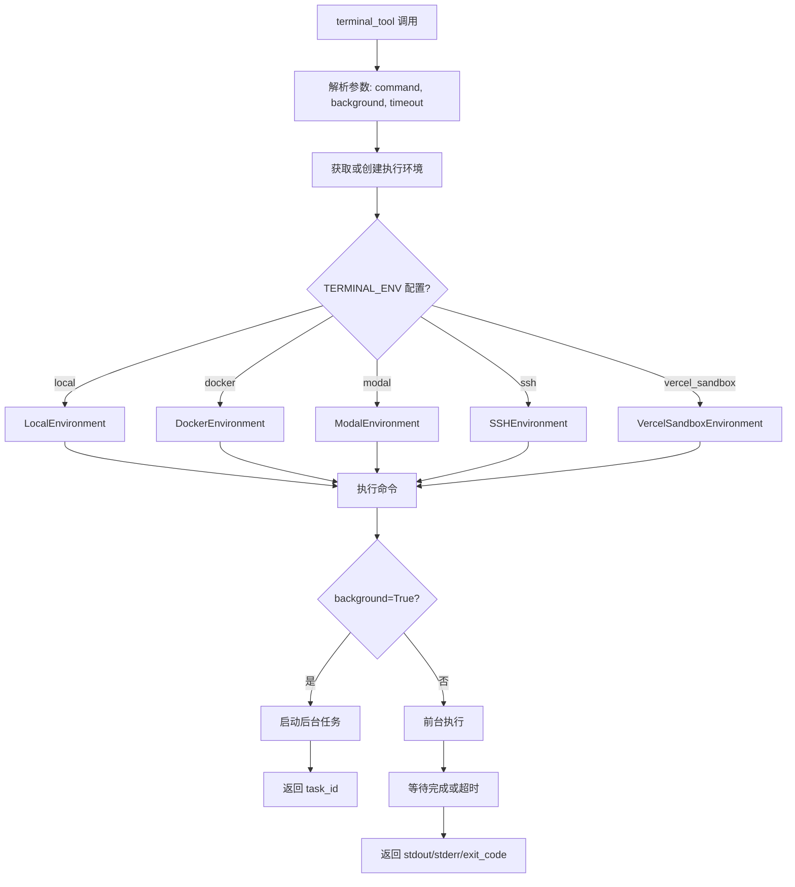
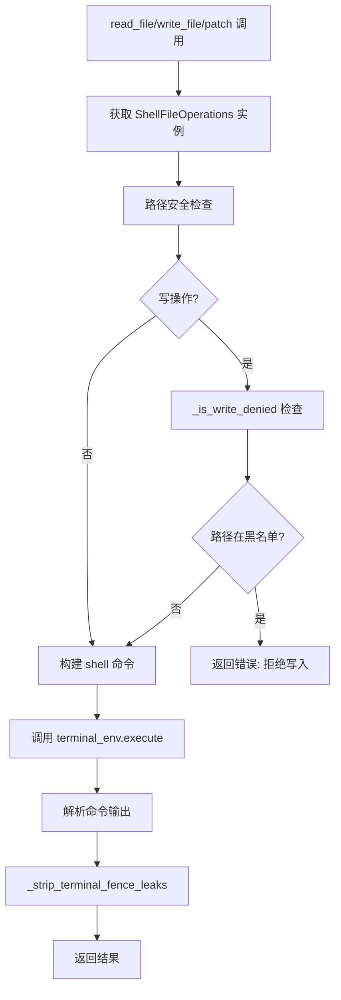
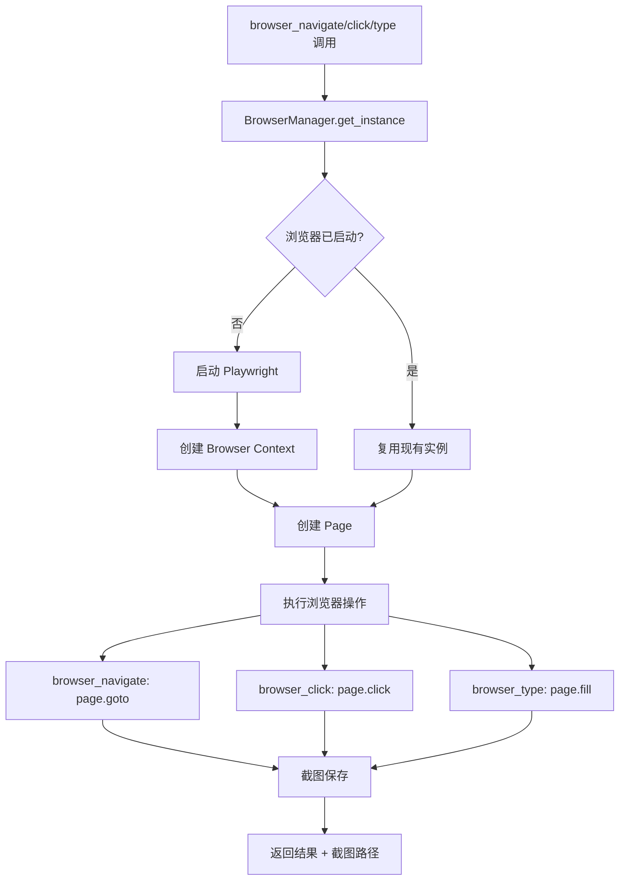
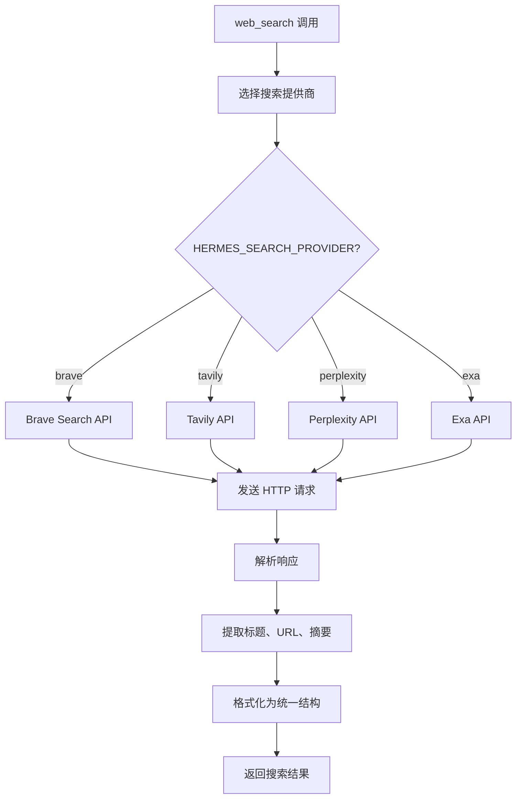
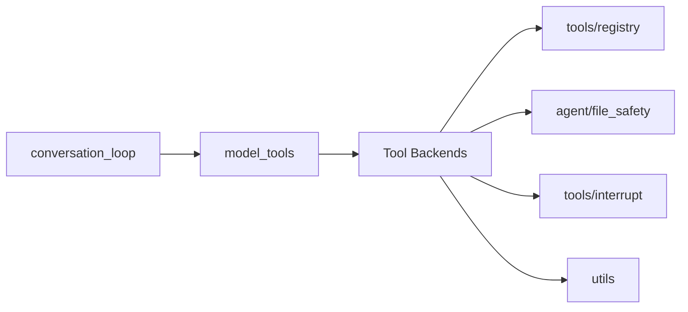

# Tool Backends / 内置工具能力 技术设计方案

## 1. 模块定位

**职责范围：**
- 提供 Agent 可调用的具体工具实现（terminal、file_operations、browser、web_search 等）
- 支持多种执行后端（local、docker、modal、ssh、vercel_sandbox 等）
- 实现跨后端的统一接口，屏蔽底层差异
- 管理工具的生命周期（环境创建、清理、超时控制）
- 提供安全机制（路径校验、权限检查、资源限制）
- 处理工具特定的错误和降级策略

**不负责的内容：**
- 工具的注册和发现（由 `tools/registry.py` 负责）
- 工具调用的分发和路由（由 `model_tools.py` 负责）
- 工具调用的时机决策（由 `agent/conversation_loop.py` 负责）
- 工具结果的压缩和修剪（由 `agent/context_compressor.py` 负责）

## 2. 核心能力

1. **多后端终端执行**：支持 local、docker、modal、ssh、singularity、vercel_sandbox 等 7+ 种后端
2. **统一文件操作接口**：read、write、patch、search 跨所有终端后端工作
3. **浏览器自动化**：基于 Playwright 的无头浏览器控制（CDP 协议）
4. **Web 搜索集成**：支持多个搜索提供商（Brave、Tavily、Perplexity、Exa）
5. **后台任务管理**：支持长时间运行的命令在后台执行
6. **环境生命周期管理**：自动创建、复用、清理执行环境
7. **安全路径校验**：阻止写入敏感文件（.env、credentials、SSH keys）
8. **资源限制**：磁盘使用警告、超时控制、并发限制

## 3. 关键入口文件

| 文件路径 | 主要类/函数 | 作用 | 为什么重要 |
|---------|------------|------|-----------|
| `tools/terminal_tool.py` | `terminal_tool()` | 终端命令执行的统一入口（~2500 行） | 支持 7+ 种执行后端，是最复杂的工具 |
| `tools/file_operations.py` | `ShellFileOperations` 类 | 跨后端的文件操作抽象（~2000 行） | 将文件操作转换为 shell 命令 |
| `tools/browser_tool.py` | `BrowserManager` 类 | 浏览器自动化管理（~4000 行） | 封装 Playwright，提供高级浏览器控制 |
| `tools/web_tools.py` | `web_search()`, `web_extract()` | Web 搜索和内容提取（~1700 行） | 集成多个搜索提供商 |
| `tools/environments/` | 各后端实现 | 终端后端的具体实现 | 每个后端有独立的环境管理逻辑 |
| `tools/tool_backend_helpers.py` | 后端选择和配置 | 解析 TERMINAL_ENV 等配置 | 决定使用哪个执行后端 |
| `agent/file_safety.py` | 路径安全检查 | 阻止写入敏感文件 | 防止工具破坏系统或泄露凭证 |

## 4. 运行时流程

### 4.1 终端工具执行流程

**源码位置**：`tools/terminal_tool.py:1-2500+`



**关键设计决策**：

1. **环境复用**（`tools/terminal_tool.py:300-400+`）：
   - 每个 `task_id` 对应一个独立环境
   - 环境在首次使用时创建，后续复用
   - 空闲超时后自动清理（默认 30 分钟）

2. **后端选择**（`tools/tool_backend_helpers.py`）：
   ```python
   def get_active_env(task_id: str = None):
       env_type = os.getenv("TERMINAL_ENV", "local")
       if env_type == "docker":
           return DockerEnvironment(task_id)
       elif env_type == "modal":
           return ModalEnvironment(task_id)
       # ... 其他后端
   ```

### 4.2 文件操作流程

**源码位置**：`tools/file_operations.py:1-2000+`



**关键实现**（`tools/file_operations.py:80-120`）：

**写入黑名单**：
```python
WRITE_DENIED_PATHS = [
    "~/.ssh/id_rsa", "~/.ssh/id_ed25519",
    "~/.aws/credentials", "~/.config/gcloud/credentials.json",
    ".env", ".env.local", "credentials.json",
    # ... 更多敏感文件
]

WRITE_DENIED_PREFIXES = [
    "/etc/", "/sys/", "/proc/", "/dev/",
    "~/.ssh/", "~/.gnupg/",
]
```

**为什么用 Shell 命令**：
- 所有终端后端都支持 shell 命令
- 避免为每个后端实现文件 API
- 利用 shell 工具（cat、echo、grep）的成熟能力

### 4.3 浏览器工具流程

**源码位置**：`tools/browser_tool.py:1-4000+`



**关键特性**：
1. **单例模式**：整个会话共享一个浏览器实例
2. **自动截图**：每次操作后自动截图，便于调试
3. **CDP 协议**：使用 Chrome DevTools Protocol 控制浏览器
4. **无头模式**：默认无头，可通过环境变量切换有头模式

### 4.4 Web 搜索流程

**源码位置**：`tools/web_tools.py:1-1700+`



**提供商选择逻辑**（`tools/web_tools.py:100-200`）：
```python
def get_search_provider():
    provider = os.getenv("HERMES_SEARCH_PROVIDER", "brave")
    if provider == "brave" and os.getenv("BRAVE_API_KEY"):
        return BraveSearchProvider()
    elif provider == "tavily" and os.getenv("TAVILY_API_KEY"):
        return TavilySearchProvider()
    # ... 其他提供商
    return None  # 降级到无搜索
```

## 5. 核心数据结构 / 状态

### 5.1 终端环境抽象

**源码位置**：`tools/terminal_tool.py:500-800`

**BaseEnvironment 接口**：
```python
class BaseEnvironment(ABC):
    @abstractmethod
    def execute(self, command: str, timeout: int) -> ExecuteResult:
        """执行命令并返回结果"""
        pass
    
    @abstractmethod
    def cleanup(self):
        """清理环境资源"""
        pass
    
    @abstractmethod
    def get_cwd(self) -> str:
        """获取当前工作目录"""
        pass
```

**ExecuteResult 结构**：
```python
@dataclass
class ExecuteResult:
    stdout: str
    stderr: str
    exit_code: int
    timed_out: bool = False
    error: Optional[str] = None
```

### 5.2 活跃环境管理

**源码位置**：`tools/terminal_tool.py:200-300`

**全局状态**：
```python
_active_environments: Dict[str, BaseEnvironment] = {}
_environment_lock = threading.Lock()
_cleanup_timers: Dict[str, threading.Timer] = {}
```

**环境生命周期**：
1. 首次使用时创建并缓存
2. 每次使用后重置清理定时器
3. 空闲超时后自动清理
4. 进程退出时强制清理所有环境

### 5.3 文件操作结果

**源码位置**：`tools/file_operations.py:90-150`

```python
@dataclass
class ReadResult:
    content: str = ""
    error: Optional[str] = None
    line_count: int = 0
    truncated: bool = False

@dataclass
class WriteResult:
    success: bool = False
    error: Optional[str] = None
    bytes_written: int = 0

@dataclass
class SearchResult:
    matches: List[SearchMatch] = field(default_factory=list)
    total_matches: int = 0
    error: Optional[str] = None

@dataclass
class SearchMatch:
    file_path: str
    line_number: int
    line_content: str
    context_before: List[str] = field(default_factory=list)
    context_after: List[str] = field(default_factory=list)
```

### 5.4 浏览器状态

**源码位置**：`tools/browser_tool.py:100-300`

```python
class BrowserManager:
    _instance: Optional['BrowserManager'] = None
    _lock = threading.Lock()
    
    def __init__(self):
        self.playwright: Optional[Playwright] = None
        self.browser: Optional[Browser] = None
        self.context: Optional[BrowserContext] = None
        self.page: Optional[Page] = None
        self.screenshot_dir: Path = Path.home() / ".hermes" / "screenshots"
```

**单例模式保证**：
- 整个会话只有一个浏览器实例
- 避免重复启动浏览器的开销
- 保持浏览器状态（cookies、localStorage）

## 6. 与其他模块的关系

### 6.1 依赖的模块



**详细说明**：

1. **tools/registry**：
   - 每个工具通过 `registry.register()` 注册自己
   - 提供 schema 和 handler 函数

2. **agent/file_safety**：
   - 提供 `is_write_denied()` 检查路径安全
   - 提供 `get_safe_write_root()` 获取安全根目录

3. **tools/interrupt**：
   - 提供 `is_interrupted()` 检查用户中断
   - 长时间运行的命令定期检查并提前退出

4. **utils**：
   - 提供 `env_var_enabled()` 解析布尔环境变量
   - 提供通用工具函数

### 6.2 被调用的场景

**终端命令执行**（`agent/conversation_loop.py`）：
```python
# Agent 调用 terminal 工具
result = handle_function_call(
    "terminal",
    {"command": "ls -la", "timeout": 30}
)
```

**文件读写**（`agent/conversation_loop.py`）：
```python
# Agent 调用 read_file 工具
result = handle_function_call(
    "read_file",
    {"file_path": "/path/to/file.py"}
)
```

**浏览器自动化**（用户请求）：
```
User: "打开 example.com 并点击登录按钮"
Agent: 调用 browser_navigate → browser_click
```

### 6.3 模块边界

**Tool Backends 的职责边界**：
- ✅ 负责：工具的具体实现、后端管理、安全检查
- ❌ 不负责：工具的注册、调用分发、结果压缩

**与 terminal_tool 的特殊关系**：
- file_operations 依赖 terminal_tool 的执行能力
- 所有需要执行 shell 命令的工具都间接依赖 terminal_tool

## 7. 错误处理与降级策略

### 7.1 终端后端不可用

**源码位置**：`tools/terminal_tool.py:150-250`

**处理策略**：
1. 检查后端依赖（Docker daemon、Modal credentials）
2. 如果不可用，工具从可用列表中移除
3. 用户看到友好错误消息

**示例**（Docker 后端）：
```python
def check_terminal_requirements():
    env_type = os.getenv("TERMINAL_ENV", "local")
    if env_type == "docker":
        if not shutil.which("docker"):
            return False
        try:
            subprocess.run(["docker", "info"], 
                         capture_output=True, timeout=5)
            return True
        except Exception:
            return False
    return True
```

### 7.2 命令超时

**源码位置**：`tools/terminal_tool.py:1000-1200`

**处理策略**：
1. 前台命令默认超时 600 秒（可配置）
2. 超时后发送 SIGTERM，等待 5 秒
3. 仍未退出则发送 SIGKILL
4. 返回部分输出 + 超时标记

**关键代码**：
```python
try:
    result = subprocess.run(
        command,
        timeout=timeout,
        capture_output=True
    )
except subprocess.TimeoutExpired:
    process.terminate()
    time.sleep(5)
    if process.poll() is None:
        process.kill()
    return ExecuteResult(
        stdout=partial_output,
        stderr="Command timed out",
        exit_code=-1,
        timed_out=True
    )
```

### 7.3 写入敏感文件

**源码位置**：`agent/file_safety.py:1-200`

**处理策略**：
1. 维护黑名单（路径和前缀）
2. 写入前检查目标路径
3. 匹配黑名单则拒绝并返回错误

**错误消息**：
```json
{
  "error": "Write denied: /home/user/.ssh/id_rsa is a protected file",
  "reason": "security"
}
```

### 7.4 浏览器启动失败

**源码位置**：`tools/browser_tool.py:200-400`

**处理策略**：
1. 检查 Playwright 是否安装
2. 检查浏览器二进制是否存在
3. 失败时返回友好错误，建议运行 `playwright install`

**降级路径**：
- 浏览器工具不可用时，从工具列表移除
- Agent 可以使用 web_search 和 web_extract 作为替代

### 7.5 搜索 API 配额耗尽

**源码位置**：`tools/web_tools.py:500-700`

**处理策略**：
1. 捕获 HTTP 429 错误（配额耗尽）
2. 记录警告日志
3. 返回空结果 + 错误消息
4. 不中断会话，允许 Agent 继续

**错误消息**：
```json
{
  "results": [],
  "error": "Search API quota exceeded. Please check your API key or upgrade your plan."
}
```

### 7.6 环境清理失败

**源码位置**：`tools/terminal_tool.py:1500-1700`

**处理策略**：
1. 清理时捕获所有异常
2. 记录错误日志但不抛出
3. 确保其他环境的清理继续进行
4. 进程退出时强制清理（atexit hook）

**关键代码**：
```python
def cleanup_all_environments():
    for task_id, env in list(_active_environments.items()):
        try:
            env.cleanup()
        except Exception as e:
            logger.error(f"Failed to cleanup {task_id}: {e}")
        finally:
            _active_environments.pop(task_id, None)

atexit.register(cleanup_all_environments)
```

## 8. 扩展与修改指南

### 8.1 添加新的终端后端

**步骤**：
1. 在 `tools/environments/` 创建新文件（如 `my_backend.py`）
2. 继承 `BaseEnvironment` 并实现所有抽象方法
3. 在 `tools/terminal_tool.py` 中注册新后端
4. 添加环境变量支持（如 `TERMINAL_ENV=my_backend`）

**示例**：
```python
# tools/environments/my_backend.py
from tools.terminal_tool import BaseEnvironment, ExecuteResult

class MyBackendEnvironment(BaseEnvironment):
    def execute(self, command: str, timeout: int) -> ExecuteResult:
        # 实现命令执行逻辑
        pass
    
    def cleanup(self):
        # 实现清理逻辑
        pass
    
    def get_cwd(self) -> str:
        return "/workspace"
```

### 8.2 添加新的搜索提供商

**步骤**：
1. 在 `tools/web_tools.py` 中创建新的 Provider 类
2. 实现 `search()` 方法，返回统一格式
3. 在 `get_search_provider()` 中添加选择逻辑
4. 添加环境变量支持（如 `HERMES_SEARCH_PROVIDER=my_provider`）

**示例**：
```python
class MySearchProvider:
    def __init__(self):
        self.api_key = os.getenv("MY_SEARCH_API_KEY")
    
    def search(self, query: str, num_results: int = 10) -> List[SearchResult]:
        response = requests.get(
            "https://api.mysearch.com/search",
            params={"q": query, "limit": num_results},
            headers={"Authorization": f"Bearer {self.api_key}"}
        )
        # 解析响应并返回统一格式
        return [SearchResult(...) for item in response.json()["results"]]
```

### 8.3 扩展文件操作能力

**步骤**：
1. 在 `ShellFileOperations` 类中添加新方法
2. 将操作转换为 shell 命令
3. 调用 `self.terminal_env.execute()`
4. 解析输出并返回结构化结果

**示例**：
```python
def list_directory(self, path: str) -> List[FileInfo]:
    """列出目录内容"""
    command = f"ls -la {shlex.quote(path)}"
    result = self.terminal_env.execute(command, timeout=10)
    if result.exit_code != 0:
        return []
    # 解析 ls 输出
    files = []
    for line in result.stdout.splitlines():
        # 解析每一行...
        files.append(FileInfo(...))
    return files
```

### 8.4 添加浏览器新操作

**步骤**：
1. 在 `BrowserManager` 类中添加新方法
2. 使用 Playwright API 实现操作
3. 在 `tools/browser_tool.py` 中注册新工具
4. 定义 JSON Schema 并注册到 registry

**示例**：
```python
def browser_hover(self, selector: str) -> Dict:
    """悬停在元素上"""
    try:
        self.page.hover(selector, timeout=5000)
        screenshot_path = self._take_screenshot()
        return {
            "success": True,
            "screenshot": str(screenshot_path)
        }
    except Exception as e:
        return {"success": False, "error": str(e)}
```

### 8.5 调试工具执行

**查看活跃环境**：
```python
from tools.terminal_tool import _active_environments
print(_active_environments.keys())
```

**手动清理环境**：
```python
from tools.terminal_tool import cleanup_all_environments
cleanup_all_environments()
```

**测试文件操作**：
```python
from tools.file_operations import ShellFileOperations
from tools.terminal_tool import get_active_env

env = get_active_env()
file_ops = ShellFileOperations(env)
result = file_ops.read_file("/tmp/test.txt")
print(result.content)
```

**查看浏览器状态**：
```python
from tools.browser_tool import BrowserManager
manager = BrowserManager.get_instance()
print(f"Browser running: {manager.browser is not None}")
print(f"Page URL: {manager.page.url if manager.page else None}")
```

## 9. 性能优化要点

### 9.1 环境复用

**效果**：避免重复创建和销毁执行环境

**策略**：
- 每个 task_id 对应一个持久环境
- 环境在首次使用时创建，后续复用
- 空闲超时后自动清理（默认 30 分钟）

**性能数据**（估算）：
- Docker 容器创建：~2-5 秒
- 环境复用：~0.01 秒
- 节省：~99%

### 9.2 浏览器单例

**效果**：避免重复启动浏览器

**策略**：
- 整个会话共享一个浏览器实例
- 使用单例模式 + 线程锁保证唯一性
- 会话结束时统一清理

**性能数据**（估算）：
- 浏览器启动：~3-5 秒
- 页面导航：~0.5-2 秒
- 复用节省：每次操作节省 3-5 秒

### 9.3 命令输出流式处理

**效果**：避免大输出占用内存

**策略**：
- 使用 `subprocess.PIPE` 流式读取
- 超过限制时截断输出
- 保留头部和尾部，丢弃中间部分

### 9.4 文件操作批处理

**效果**：减少 shell 命令调用次数

**策略**：
- 使用 `find` + `xargs` 批量处理文件
- 使用 `grep -r` 而非逐文件搜索
- 利用 shell 管道组合多个操作

## 10. 已知限制与待确认点

### 10.1 已知限制

1. **终端后端切换需要重启**：
   - `TERMINAL_ENV` 在进程启动时读取
   - 运行时切换后端需要重启 Agent

2. **Docker 后端需要 Docker daemon**：
   - 本地必须安装 Docker
   - Docker daemon 必须运行
   - 无法在某些受限环境使用

3. **浏览器内存占用**：
   - Chromium 进程占用 ~200-500MB
   - 长时间运行可能内存泄漏
   - 需要定期重启浏览器

4. **文件操作依赖 shell 工具**：
   - 需要 cat、echo、grep 等工具
   - 某些最小化容器可能缺少这些工具
   - 无法在纯 Python 环境使用

5. **搜索 API 配额限制**：
   - 免费层通常有每日配额
   - 配额耗尽后搜索不可用
   - 需要手动切换提供商或升级

### 10.2 待确认点

1. **Modal 后端的完整流程**：
   - 如何创建和管理 Modal 沙箱
   - 文件系统持久化机制
   - 需要阅读 `tools/environments/modal.py`

2. **SSH 后端的连接管理**：
   - 如何建立和维护 SSH 连接
   - 连接断开后的重连策略
   - 需要阅读 `tools/environments/ssh.py`

3. **浏览器截图的存储策略**：
   - 截图文件如何清理
   - 是否有大小限制
   - 需要阅读 `tools/browser_tool.py` 的截图逻辑

4. **后台任务的生命周期**：
   - 后台任务如何与环境关联
   - 环境清理时后台任务如何处理
   - 需要阅读 `tools/process_registry.py`

## 11. 参考资料

### 11.1 核心源码文件

- `tools/terminal_tool.py:1-2500+` - 终端工具完整实现
- `tools/file_operations.py:1-2000+` - 文件操作抽象
- `tools/browser_tool.py:1-4000+` - 浏览器自动化
- `tools/web_tools.py:1-1700+` - Web 搜索和提取
- `tools/environments/` - 各终端后端实现
- `agent/file_safety.py:1-200` - 路径安全检查

### 11.2 相关文档

- Playwright 文档：https://playwright.dev/python/
- Docker SDK 文档：https://docker-py.readthedocs.io/
- `docs/工具系统_技术设计方案.md` - 工具注册和分发机制

### 11.3 相关模块

- `tools/registry.py` - 工具注册表
- `model_tools.py` - 工具调用分发
- `agent/conversation_loop.py` - 工具调用时机
- `tools/interrupt.py` - 用户中断处理

---

**文档版本**：v1.0  
**最后更新**：2026-05-25  
**作者**：基于源码分析生成
