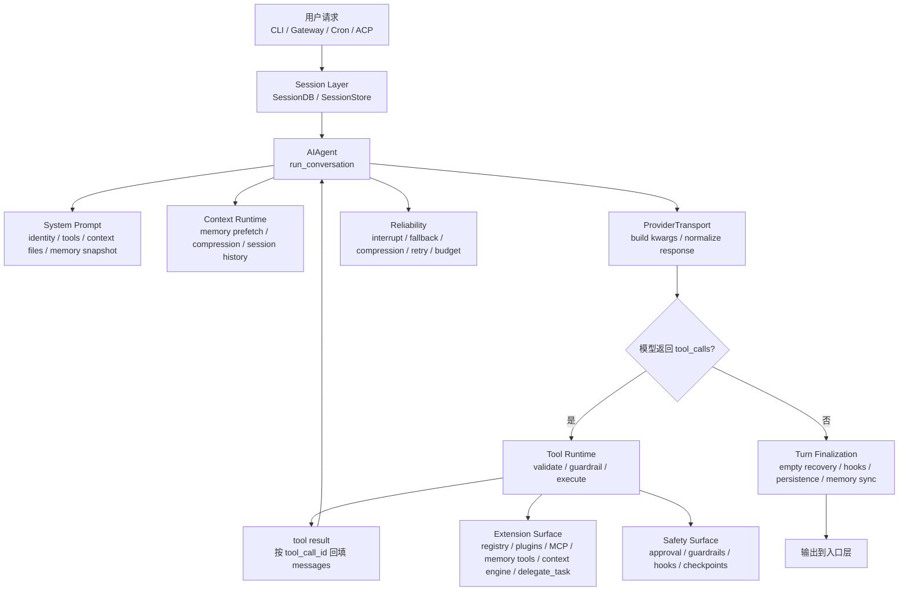

# Hermes-Agent Runtime：一个可持续工作的 Agent 是如何组织起来的

> 这是一份面向工程师的 Hermes-Agent Runtime 导读文档。它不做源码逐行讲解，也不展开所有产品功能，只围绕 Hermes-Agent 的核心运行时能力展开：多入口会话编排、Agent Loop、模型行为约束、上下文与记忆、工具调用、安全防线、能力扩展和长任务可靠性。

本文参考 `docs/ClaudeCode/claude-code-agent-runtime-sharing.md` 的文档组织方式，但源码事实来自 Hermes-Agent 本身。Hermes-Agent 源码路径为：

```text
/Users/wangzhongbin/Documents/code/fangzhen/hermes-agent
```

需要先强调一个边界：

```text
Hermes-Agent 默认不是 Claude Code Runtime 的包装器。
它默认运行自己的 AIAgent + Tool Registry + Provider Transport 循环。
Codex app-server / Codex Responses 只是可选 provider/runtime 分支。
```

---

## 0. 先建立一个整体认知

Hermes-Agent 最值得学习的地方，不是它支持多少聊天平台，也不是它有多少工具，而是它把一个可长期运行的 Agent 拆成了多层可替换的运行时系统：

```text
入口层：CLI / TUI / Gateway / Cron / ACP 把不同来源的请求归一化为会话 turn
会话层：SessionDB / Gateway SessionStore / ACP SessionManager 管理历史、恢复和隔离
Agent Loop：AIAgent.run_conversation 推进模型调用、工具执行、恢复和结束
模型层：ProviderTransport 适配 OpenAI wire、Anthropic、Bedrock、Codex Responses 等协议
上下文层：System Prompt、context files、memory prefetch、compression 共同决定模型每轮看到什么
工具层：ToolRegistry、toolsets、plugin tools、MCP tools、memory/context-engine tools 统一暴露能力
安全层：tool guardrails、plugin pre_tool_call、terminal approval、credential refresh、prompt injection scan
扩展层：Skills、Plugins、Memory providers、Context engines、Gateway platforms、delegate_task
可靠性层：interrupt、fallback provider、context compression、stream retry、session persistence、cron inactivity timeout
```

一句话概括：

```text
Hermes-Agent 不是一个模型调用器，
而是一个围绕 AIAgent Loop 构建的多入口任务运行时。
```

整体链路可以先看成这样：



后面所有章节都是这张图上的局部放大。

---

## 1. 任务是怎么被推进的

### 这一章解决什么问题

Agent 系统最核心的问题不是“怎么调一次模型”，而是：

```text
模型回复之后，系统怎么判断下一步该继续执行工具、恢复、切换模型、压缩上下文，还是结束？
```

如果这个问题没有被清楚建模，Agent 很容易变成脆弱脚本：调模型、解析工具、执行工具、再调模型。能跑，但一遇到模型返回空内容、工具参数坏掉、上下文过长、平台中断、provider 超时，就不知道该继续还是退出。

### Hermes-Agent 怎么做

Hermes-Agent 把任务推进集中在 `AIAgent.run_conversation()`，实际实现位于：

```text
run_agent.py
agent/conversation_loop.py
```

`run_agent.py` 里的 `AIAgent` 是对外主类；`run_conversation()` 的大段运行时逻辑已经外提到 `agent/conversation_loop.py`，`AIAgent.run_conversation()` 只是薄转发。

一轮用户请求的大致过程是：

```text
创建 / 恢复 session
  -> 绑定 task_id、日志上下文、interrupt 状态、迭代预算
  -> 追加当前 user message
  -> 构造或恢复 system prompt
  -> 预检上下文长度，必要时压缩
  -> 注入 memory prefetch / plugin context
  -> 进入 while loop
       -> 构造 provider API messages
       -> 调模型并归一化响应
       -> 如果有 tool_calls：执行工具，回填 tool results，继续
       -> 如果没有 tool_calls：进入最终响应与恢复判断
  -> 持久化 session
  -> 同步 external memory
  -> 触发 post hooks / background review
```

这里最重要的分岔是：

```text
有 tool_calls：
  模型还要行动
  -> 校验 tool name / JSON arguments
  -> 写入 assistant(tool_calls)
  -> 执行工具
  -> 写入 role=tool 的结果
  -> 回到下一轮模型调用

没有 tool_calls：
  可能是正常最终回答
  也可能是空响应、thinking-only、stream 中断、Codex 中间确认
  -> 继续做恢复判断
```

这意味着：

```text
没有 tool_calls 不等于无条件结束；
有 tool_calls 也不等于直接执行。
```

### 核心实现逻辑

Hermes-Agent 的 loop 不是一个单纯的 `while model wants tools`，而是一组带恢复路径的状态迁移。

典型主路径：

```text
user message
  -> run_conversation
  -> build api_messages
  -> ProviderTransport.build_kwargs
  -> streaming / non-streaming model call
  -> ProviderTransport.normalize_response
  -> assistant_message.tool_calls?
       yes:
         validate tool names
         validate JSON args
         cap / dedupe delegate_task
         append assistant message
         execute tool calls
         append tool results
         maybe compress context
         continue
       no:
         recover empty / thinking-only / partial stream if needed
         append final assistant message
         break
```

它还维护一组跨迭代状态，例如：

| 状态 | 作用 |
|---|---|
| `api_call_count` | 当前 turn 已经调模型多少次 |
| `IterationBudget` | 控制父子 agent 共享或局部的工具调用预算 |
| `_invalid_tool_retries` | 模型幻觉工具名时的自修复次数 |
| `_invalid_json_retries` | tool arguments 不是合法 JSON 时的恢复次数 |
| `_empty_content_retries` | 模型空响应重试次数 |
| `_thinking_prefill_retries` | reasoning-only / thinking-only 续推次数 |
| `compression_attempts` | 上下文过长时的压缩尝试次数 |
| `_tool_guardrail_halt_decision` | 工具重复无进展时的结构化停止原因 |
| `_turn_exit_reason` | 结束诊断，用于日志解释 turn 为什么结束 |

`turn_exit_reason` 很关键。它让运行时能在日志里回答“为什么停了”，例如：

```text
text_response(finish_reason=stop)
guardrail_halt
interrupted_by_user
budget_exhausted
max_iterations_reached(...)
empty_response_exhausted
partial_stream_recovery
fallback_prior_turn_content
```

### 示例解释

用户让 Hermes-Agent 修改一个文件并验证，可能发生这样的链路：

```text
用户输入任务
  -> AIAgent 构造请求
  -> 模型返回 search_files / read_file
  -> Tool Runtime 执行并回填 tool result
  -> 下一轮模型返回 patch / terminal
  -> 工具执行，文件变更结果回填
  -> 下一轮模型返回最终总结
  -> run_conversation 进入 no tool_calls 分支
  -> 检查空响应 / thinking-only / hooks / mutation footer
  -> 持久化 session 并输出
```

如果模型执行工具后返回空内容，Hermes-Agent 不会直接结束。它会判断最近是否有 tool result，并注入一个合成 user nudge：

```text
tool(result)
  -> assistant("(empty)")
  -> user("You just executed tool calls but returned an empty response...")
  -> continue
```

这是运行时裁决，不是提示词“希望模型继续”那么简单。

### 工程启发

Hermes-Agent 的任务推进值得借鉴的点是：

```text
每个继续、恢复和结束路径都要有显式原因；
工具结果必须作为 conversation history 的一等消息回填；
空响应、坏 tool args、上下文过长、provider 错误都应该进入同一个 loop 的恢复体系。
```

不要把 Agent Loop 写成“模型没工具就结束”。真正的运行时需要把“没工具”之后的收尾检查建模清楚。

---

## 2. 模型行为是怎么被约束的

### 这一章解决什么问题

模型天然会有一些不稳定倾向：

- 明明有工具却只描述计划；
- 工具参数 JSON 写坏；
- 工具名幻觉；
- 执行失败后过度自信；
- 把历史压缩摘要误当成当前任务；
- 把外部内容当成系统指令；
- 在有工具结果后返回空内容或只返回 reasoning。

所以 Hermes-Agent 不只是把工具交给模型，还要从 prompt、tool schema、runtime guardrail 三层同时约束模型。

### Hermes-Agent 怎么做

Hermes-Agent 的模型行为控制主要有三层：

1. **System Prompt 分层**
   `agent/system_prompt.py` 把 prompt 组装成 `stable / context / volatile` 三层。

2. **工具感知行为指导**
   根据当前可用工具注入 memory、session search、skills、kanban、computer use、tool-use enforcement 等指导。

3. **运行时纠偏**
   模型产生无效工具名、坏 JSON、空响应、thinking-only、重复无进展工具调用时，runtime 会注入错误结果、重试、fallback 或 halt。

### 核心实现逻辑

`agent/system_prompt.py` 的注释已经把设计讲得很直白：system prompt 只在 session 生命周期内构建一次并缓存，只有上下文压缩等边界才会重建。

它的三层含义是：

| 层 | 内容 | 生命周期 |
|---|---|---|
| `stable` | identity、工具行为指导、skills prompt、环境提示、平台提示、模型家族操作建议 | 尽量稳定 |
| `context` | caller system message、AGENTS.md / CLAUDE.md / `.cursorrules` 等 context files | session 稳定 |
| `volatile` | memory snapshot、USER profile、external memory provider block、日期、model/provider | 构建时快照 |

按源码角色整理后的近似结构：

```text
build_system_prompt_parts(agent)
  -> stable:
       SOUL.md 或 DEFAULT_AGENT_IDENTITY
       Hermes help guidance
       MEMORY / SESSION_SEARCH / SKILLS / KANBAN guidance
       COMPUTER_USE guidance
       tool-use enforcement guidance
       model-family operational guidance
       skills system prompt
       environment hints
       platform hints
  -> context:
       custom system_message
       context files from working directory
  -> volatile:
       MEMORY.md / USER.md snapshot
       external memory provider system block
       date / session id / model / provider line
```

需要注意：

```text
Hermes-Agent 为了保持 prompt cache 稳定，不会在每一轮随意重写 system prompt。
每轮临时上下文通常注入当前 user message，而不是 system prompt。
```

例如 `pre_llm_call` plugin hook 或 external memory prefetch 得到的上下文，会在 API-call-time 拼到当前 user message 上，不会持久化到 session DB，也不会改变 cached system prompt。

### Prompt 不是全部

Hermes-Agent 并不把行为约束全押在提示词上。运行时还会做硬约束：

| 问题 | Runtime 处理 |
|---|---|
| 工具名不存在 | 尝试 repair，失败则返回 tool error 给模型自修复 |
| tool arguments 非 JSON | 最多重试，必要时注入 recovery tool result |
| `delegate_task` 过多 | `_cap_delegate_task_calls` 按并发上限截断 |
| 重复 tool call | `_deduplicate_tool_calls` 去重 |
| 工具重复失败或无进展 | `ToolCallGuardrailController` 发出 warn / halt |
| patch / write_file 失败但模型声称成功 | turn-end file mutation verifier 添加提醒 footer |

### 工程启发

Prompt Engineering 决定模型“应该怎么做”，但 Runtime 决定系统“接受什么结果”。

更稳的 Agent 设计应该把两者分开：

```text
提示词负责引导；
运行时负责校验、纠偏、拒绝和恢复。
```

这也是阅读 Hermes-Agent 时容易误读的地方：tool-use enforcement guidance 是模型行为提示，不等于运行时自动替模型选择工具；而 tool validation / guardrail / JSON repair 才是运行时裁决。

---

## 3. 模型每轮基于什么工作

### 这一章解决什么问题

长期会话里，模型每轮能看到什么，决定了它能不能持续工作：

- 历史消息要不要全带？
- 系统提示词什么时候重建？
- memory 写入后是否马上进入 system prompt？
- 外部记忆召回放在哪？
- 上下文超长时压缩哪些内容？

这些问题如果处理不好，要么成本暴涨，要么模型丢任务，要么 prompt cache 每轮失效。

### Hermes-Agent 怎么做

Hermes-Agent 把“模型每轮上下文”拆成几类来源：

| 来源 | 进入方式 | 是否持久 |
|---|---|---|
| session history | `messages` / `SessionDB` | 是 |
| system prompt | session 首次构建并缓存 | 是，存入 session row |
| context files | system prompt 的 context tier | 随 prompt 快照 |
| built-in memory | system prompt 的 volatile tier 快照 | memory 本身持久，prompt 中是快照 |
| external memory prefetch | 当前 user message 临时注入 | 否 |
| plugin `pre_llm_call` context | 当前 user message 临时注入 | 否 |
| prefill messages | API-call-time 注入 system 之后 | 否 |
| tool results | role=`tool` 消息回填 | 是 |
| compression summary | 压缩后替代旧历史 | 是 |

### SessionDB

Hermes-Agent 使用 `hermes_state.py` 里的 `SessionDB` 做会话持久化，设计点包括：

- SQLite；
- WAL mode，遇到 NFS/SMB/FUSE 不兼容时降级 DELETE journal；
- sessions / messages 表；
- FTS5 和 trigram FTS；
- `parent_session_id` 支持压缩、分支和恢复链路；
- 记录 token、cache、cost、model、source 等元数据。

它替代了单纯 JSONL transcript 的能力，支撑 `/resume`、`session_search`、Gateway 会话恢复、ACP session 恢复等功能。

### Memory

Hermes-Agent 有两类 memory：

1. **内建 memory**
   `tools/memory_tool.py` 的 `MemoryStore` 管理 `MEMORY.md` / `USER.md` 这类本地持久记忆。

2. **外部 memory provider**
   `agent/memory_manager.py` 编排 Honcho、Hindsight 等 provider。Provider 通过 `MemoryProvider` 接口提供：

```text
initialize
system_prompt_block
prefetch
queue_prefetch
sync_turn
get_tool_schemas
handle_tool_call
on_session_end
on_pre_compress
on_delegation
```

需要特别注意：

```text
内建 memory 写入是 durable 的，
但不会在同一个 session 每轮即时改写 cached system prompt。
```

这是为了保持 system prompt byte-stable，尽量维持 provider prompt cache。新的 memory 内容会在 session 边界、prompt invalidation 或压缩后重建时进入 prompt。

外部 memory provider 的 prefetch 则是另一条路径：每个 turn 开始前召回相关内容，并作为临时上下文注入当前 user message。

### Compression

默认压缩实现是 `agent/context_compressor.py` 的 `ContextCompressor`。它不是简单截断，而是：

- 保护开头和尾部消息；
- 用辅助模型总结中间历史；
- 结构化保留 resolved / pending / active task；
- 压缩旧 tool outputs；
- 对图片内容做 token 预算估算；
- 在 context overflow / 413 / preflight 检测时触发；
- 压缩后可能切换 session，并通过 `parent_session_id` 保留 lineage。

压缩摘要的前缀明确告诉模型：

```text
这是历史上下文的参考摘要，不是当前 active instruction。
当前任务以后续最新 user message 为准。
```

这是一条重要安全边界：压缩不是把旧指令重新激活，而是让模型知道之前发生了什么。

### 工程启发

Hermes-Agent 的上下文设计重点不是“尽量塞更多内容”，而是：

```text
稳定内容走 cached system prompt；
每轮动态召回走 user-message injection；
长期历史走 SessionDB；
超长历史走 compression summary；
工具结果必须保留 role/tool_call_id 结构。
```

这套分层能同时服务成本、恢复、可解释性和多入口一致性。

---

## 4. 工具调用如何被接住

### 这一章解决什么问题

工具调用是 Agent Runtime 最容易出事故的地方：

- 模型可能调用不存在的工具；
- 参数可能不是 JSON；
- 多个工具可能有顺序或路径冲突；
- 工具输出可能太大；
- shell 命令可能危险；
- 外部 MCP / plugin 工具可能动态变化；
- 工具执行中可能被用户 interrupt。

所以工具系统不能只是 `function_name -> Python function`。

### Hermes-Agent 怎么做

Hermes-Agent 的工具路径分成三层：

```text
Tool Registry
  -> 收集工具 schema / handler / availability check / toolset

AIAgent Tool Runtime
  -> 校验 tool_calls、决定顺序或并发、处理 agent 级特殊工具

Tool Handler Dispatch
  -> model_tools.handle_function_call / registry.dispatch / plugin hooks / MCP
```

核心文件：

```text
tools/registry.py
model_tools.py
agent/tool_executor.py
toolsets.py
```

### ToolRegistry

`tools/registry.py` 中的 `ToolRegistry` 是工具注册中心。各 `tools/*.py` 模块在 import 时调用 `registry.register()` 自注册，`model_tools.py` 负责发现这些模块。

一个工具 entry 包含：

| 字段 | 含义 |
|---|---|
| `name` | 工具名 |
| `toolset` | 所属工具集 |
| `schema` | 给模型的 function schema |
| `handler` | 实际执行函数 |
| `check_fn` | 可用性检查 |
| `requires_env` | 需要的环境变量 |
| `is_async` | 是否异步 |
| `dynamic_schema_overrides` | 根据运行时配置动态改 schema |

Toolset 则在 `toolsets.py` 中组织，例如：

```text
web / browser / terminal / file / skills / memory / delegation / cronjob /
computer_use / session_search / code_execution / messaging / kanban
```

### 工具执行链路

当模型返回 `tool_calls` 后，`agent/conversation_loop.py` 会先做 runtime 校验：

```text
assistant_message.tool_calls
  -> repair unknown tool name
  -> validate tool name in valid_tool_names
  -> validate JSON arguments
  -> cap delegate_task calls
  -> deduplicate duplicate calls
  -> append assistant(tool_calls)
  -> _execute_tool_calls(...)
```

`AIAgent._execute_tool_calls()` 会根据工具批次是否独立，选择顺序或并发执行：

```text
if not _should_parallelize_tool_batch(tool_calls):
    execute_tool_calls_sequential(...)
else:
    execute_tool_calls_concurrent(...)
```

并发路径不是无脑并发。`agent.tool_dispatch_helpers` 会区分：

- 永远不要并行的工具；
- 可安全并行的只读工具；
- 路径作用域工具是否互相重叠；
- 破坏性 terminal 命令；
- 文件 mutation 的目标路径。

并发执行后，Hermes-Agent 会按原始 tool_call 顺序把结果 append 回 `messages`，保证 provider 看到的 `tool_call_id` 顺序和语义一致。

### Agent 级特殊工具

并不是所有工具都直接走 registry dispatch。`agent/tool_executor.py` 会对一些 agent 级工具做特判：

| 工具 | Runtime 特判原因 |
|---|---|
| `todo` | 需要操作当前 AIAgent 的 in-memory todo store |
| `session_search` | 需要当前 session DB 和 current_session_id |
| `memory` | 需要内建 memory store，并桥接 external memory provider |
| `clarify` | 需要当前入口层的 clarify callback |
| `delegate_task` | 需要 parent agent、task budget、工具限制和子 agent 管理 |
| context engine tools | 不在普通 registry 中，路由给 `context_compressor.handle_tool_call` |
| memory provider tools | 外部 memory provider 动态暴露，由 `MemoryManager` 处理 |

其他普通工具最终走：

```text
model_tools.handle_function_call
  -> plugin pre_tool_call
  -> registry.dispatch
  -> plugin post_tool_call / transform_tool_result
```

### 工具结果处理

工具执行不是把字符串丢回模型那么简单。Hermes-Agent 还会做：

- progress callbacks；
- long-running tool activity heartbeat；
- terminal approval / sudo callback 传播到 worker thread；
- checkpoint before `write_file` / `patch` / destructive terminal；
- tool guardrail after_call；
- file mutation verifier 记录；
- oversized tool result 持久化并替换为引用；
- per-turn tool result budget enforcement；
- subdirectory hints；
- multimodal tool result 转换；
- `/steer` 注入到最近 tool result。

最终回填消息类似：

```text
{
  "role": "tool",
  "name": "...",
  "content": "...",
  "tool_call_id": "..."
}
```

### 工程启发

工具运行时应该是一条完整流水线：

```text
模型输出 tool_call
  -> schema / name / args 校验
  -> 安全与策略拦截
  -> 执行与进度回调
  -> 输出预算与持久化
  -> tool_result 回填
  -> 下一轮模型判断
```

不要把工具调用看成“函数映射表”。Hermes-Agent 的可维护性来自 registry 管工具定义，runtime 管执行语义，plugin/MCP 管扩展边界。

---

## 5. 安全不是一个模块

### 这一章解决什么问题

Agent 安全不是加一个 `security.py` 就结束。风险散布在：

- shell 命令；
- 文件写入；
- 插件 hook；
- cron 非交互执行；
- 外部平台消息；
- prompt injection；
- credentials；
- MCP / plugin 动态工具；
- 会话恢复和旧历史。

### Hermes-Agent 怎么做

Hermes-Agent 的安全边界分布在多处：

| 边界 | 机制 |
|---|---|
| 工具执行前 | plugin `pre_tool_call`、tool guardrails、terminal approval |
| 危险命令 | destructive command detection、approval callback、sudo callback |
| 文件 mutation | checkpoint、file mutation verifier |
| 插件加载 | enabled allow-list、disabled deny-list、manifest、hook 白名单 |
| Cron prompt | assembled prompt injection scanner、script path 限制在 `HERMES_HOME/scripts` |
| 平台入口 | pairing / allowed users / platform auth / session isolation |
| 状态库 | SQLite WAL fallback、FTS search、session source tagging |
| Provider 错误 | auth refresh、credential pool、fallback provider、rate-limit breaker |
| 输出展示 | transform hooks、reasoning / tool XML scrubber、stream consumer filtering |

### Approval 与 Guardrail

Terminal 类工具会通过 `tools.terminal_tool` 的 approval callback 进入 CLI / Gateway / ACP 等不同 surface 的确认流程。并发 worker thread 会显式传播 approval / sudo callback，避免工具线程退化成裸 `input()`。

Tool guardrail 则更像运行时保险丝：当工具调用重复失败或无进展时，可以返回 synthetic tool result，甚至设置 `_tool_guardrail_halt_decision`，让 turn 以 `guardrail_halt` 结束。

### Plugin Hook 的边界

`hermes_cli/plugins.py` 定义了 hook 白名单，例如：

```text
pre_tool_call
post_tool_call
transform_tool_result
pre_llm_call
post_llm_call
pre_api_request
post_api_request
transform_llm_output
pre_gateway_dispatch
pre_approval_request
post_approval_response
on_session_start
on_session_end
```

插件可以扩展能力，但不是任意时刻插入任意逻辑。Hook 名称、触发点和返回值语义都是运行时 contract。

### Cron 的特殊安全面

Cron 是非交互执行，因此风险更高。`cron/scheduler.py` 里有几个明显的防线：

- job script 必须解析到 `HERMES_HOME/scripts/` 内；
- `.sh/.bash` 只走 bash，其他走当前 Python；
- script stdout/stderr 会做 secret redaction；
- assembled prompt 会经过 injection scanner；
- cron agent 默认 `skip_memory=True`，避免 cron 系统提示污染用户记忆；
- cron delivery target 做平台白名单或 plugin platform 注册校验；
- 支持 `[SILENT]` 抑制投递，但输出仍保存本地审计。

### 工程启发

安全防线应该贴近风险发生点：

```text
工具前拦截，工具中审批，工具后审计；
插件只走受控 hook；
cron 降低默认权限；
会话历史和压缩摘要不重新激活旧指令。
```

这比“有一个安全模块”更实际，也更容易定位问题。

---

## 6. 能力扩展是怎么进入 Runtime 的

### 这一章解决什么问题

Agent 要长期演进，不能每加一种能力都改主循环。Hermes-Agent 的扩展面很多：

- tools；
- toolsets；
- skills；
- plugins；
- MCP；
- memory providers；
- context engines；
- gateway platforms；
- subagents；
- cron；
- ACP editor sessions。

关键问题是：这些能力如何进入模型上下文、工具 schema 和运行时执行路径？

### Toolsets

Toolset 是用户和平台选择工具能力的主要边界。`toolsets.py` 把工具按场景组合，`model_tools.get_tool_definitions()` 根据 enabled/disabled toolsets 解析最终 schema。

这使 Hermes-Agent 可以在不同入口加载不同工具：

```text
CLI：通常加载完整或用户选择的 toolsets
Gateway：按平台配置加载
Cron：禁用 cronjob / messaging / clarify，并可按 job 限定 enabled_toolsets
ACP：加载 editor integration 所需工具与 explicit MCP toolsets
Subagent：由 delegate_task 传入受限 toolsets
```

### Skills

Skills 是 procedural memory。它们通过 skills tools 进入模型可用工具，并通过 system prompt 的 skills guidance 告诉模型何时查看和使用技能。

Hermes-Agent 还有 skill 自我维护链路：

- 使用 `skill_manage` 创建、修改、归档技能；
- `agent/curator.py` 周期性维护 agent-created skills；
- background review 会在 memory 或 skill nudge 触发后 fork 辅助 agent；
- cron job 的 skill 引用会在 curator 合并或归档后修复。

需要区分：

```text
Skill 是任务级知识和流程；
Tool 是一次可执行动作；
Plugin 是运行时扩展包。
```

不要把 Skill 和 Tool 混成一层。

### Plugins

Plugin 系统扫描四类来源：

```text
bundled plugins: <repo>/plugins/<name>
user plugins: ~/.hermes/plugins/<name>
project plugins: ./.hermes/plugins/<name>，需要显式启用
pip plugins: hermes_agent.plugins entry point
```

插件可以通过 `PluginContext` 注册：

- tools；
- hooks；
- gateway platform；
- browser provider；
- web provider；
- skills；
- context engine；
- model provider 等。

插件的关键价值是：能力可以在主循环之外演进，但通过统一 registry / hook / provider contract 进入运行时。

### MCP

MCP 工具通过 `tools/mcp_tool.py` 动态发现并注册到工具 registry。源码中特别避免在 `model_tools.py` import 时做 MCP discovery，因为这可能在 Gateway async event loop 中阻塞 120 秒。不同入口在自己的启动阶段显式发现：

```text
Gateway startup
CLI startup
TUI startup
ACP session init
Cron job run
```

这说明扩展发现本身也是运行时设计的一部分：不能为了“自动”而阻塞主事件循环。

### Subagents

`delegate_task` 是任务级派生，不是并行 tool call。它会创建新的 `AIAgent`：

```text
parent AIAgent
  -> delegate_task
  -> build child AIAgent
       independent session_id
       independent task_id
       restricted toolsets
       skip_memory=True
       shared / bounded iteration budget
  -> child run_conversation
  -> parent receives summarized result
```

这与 `_execute_tool_calls_concurrent` 的区别很重要：

| 机制 | 层级 | 共享上下文 | 目的 |
|---|---|---|---|
| concurrent tool calls | 动作级 | 同一个 assistant tool batch | 加速彼此独立的工具动作 |
| delegate_task | 任务级 | 子 agent 独立上下文，父级只收结果 | 拆分复杂任务、并行工作流、隔离上下文 |

### 工程启发

扩展系统的关键不是“能加载插件”，而是：

```text
扩展能力进入 Runtime 的路径必须清楚：
schema 如何给模型？
执行如何分发？
上下文如何注入？
状态如何持久？
失败如何降级？
```

Hermes-Agent 的扩展面多，但核心还是围绕 `AIAgent.run_conversation`、ToolRegistry 和 SessionDB 收敛。

---

## 7. 长任务可靠性如何支撑

### 这一章解决什么问题

长任务会遇到非常多非业务问题：

- provider stream 中断；
- 响应被截断；
- 上下文超长；
- token 预算耗尽；
- credential 过期；
- rate limit；
- Gateway restart；
- 用户在执行中追加新消息；
- cron job 卡住；
- session DB 在网络盘上无法 WAL。

一个可持续工作的 Agent Runtime 必须让这些情况可恢复、可观测、可解释。

### Hermes-Agent 怎么做

Hermes-Agent 的可靠性机制分布在多个层面。

#### 7.1 Provider 与错误恢复

`agent/conversation_loop.py` 的 retry block 会区分很多错误类型：

| 场景 | 恢复策略 |
|---|---|
| invalid / empty response | 重试，必要时 fallback |
| 401 auth | 尝试 refresh provider credentials |
| rate limit / billing | credential pool 或 fallback provider |
| context overflow | 降低 context length、压缩、重试 |
| payload too large 413 | compression retry |
| image rejected | strip images，切换 text-only |
| image too large | shrink image parts |
| thinking signature invalid | strip reasoning_details 重试 |
| llama.cpp grammar error | strip schema pattern / format 重试 |
| stream drop | streaming path诊断，必要时 fallback |

这不是一个 generic retry，而是按 failure reason 分流。

#### 7.2 Streaming 健康检查

Hermes-Agent 默认倾向 streaming，即使没有 UI streaming consumer，也因为 streaming 能提供更细粒度健康检查：

```text
waiting for provider response
receiving stream response
stream read timeout
stale stream detection
partial stream recovery
```

CLI / Gateway 通过 stream callbacks 分别更新 TUI 或平台消息。Gateway 的 `stream_consumer.py` 还处理平台编辑限流、draft streaming、think block 过滤、媒体提取和 final edit。

#### 7.3 Interrupt 与 Busy Input

CLI 和 Gateway 都支持运行中打断：

- CLI 中用户在 agent 运行时输入新消息，可根据 busy mode 选择 interrupt / queue / steer；
- Gateway 中新消息可 interrupt 当前 running agent，也可 queue 或 steer；
- `AIAgent.interrupt()` 会影响 API loop 和工具 worker thread；
- `/steer` 不中断，而是把用户指导注入下一条 tool result，让模型下一轮看到。

这体现了三个不同语义：

| 模式 | 含义 |
|---|---|
| interrupt | 停掉当前 turn，转向新输入 |
| queue | 当前 turn 完成后再处理 |
| steer | 不打断，把指导注入正在进行的任务 |

#### 7.4 Gateway 会话可靠性

Gateway 有更复杂的长期运行问题：

- 多平台 adapter；
- per-session running agent；
- agent cache；
- session expiry；
- restart drain；
- shutdown timeout；
- restart-interrupted session auto-resume；
- handoff watcher；
- cron scheduler tick；
- kanban dispatcher watcher。

`gateway/session.py` 的 `SessionStore` 用 session key 映射平台消息到 session_id，并持久化 `sessions.json` 与 SQLite transcript。它能标记：

```text
suspended
resume_pending
resume_reason
auto_reset_pending
expired_from_session_id
```

这些状态是 Gateway 能在进程重启和用户 `/stop` 后正确恢复或清理的基础。

#### 7.5 Cron 的可靠性

Cron job 通过 gateway background tick 执行，也可以独立运行。它有几个可靠性设计：

- file lock 防止多个 tick 重叠；
- workdir job 串行，避免同目录并发冲突；
- non-workdir job 可并行；
- inactivity timeout，而不是固定总时长 timeout；
- agent activity heartbeat 判断是否卡住；
- job output 保存到本地；
- delivery 失败单独记录，不等于 agent 执行失败；
- recurring job stale schedule 会 fast-forward，避免 gateway down 后爆发补跑。

### 工程启发

长任务可靠性不是“多 retry 几次”。更好的设计是：

```text
按错误原因选择恢复策略；
每个入口层都要能表达 interrupt / resume / timeout；
长任务要有 activity heartbeat；
持久化要发生在足够细的边界；
结束时要能解释 turn_exit_reason。
```

Hermes-Agent 把这些逻辑分散在 Agent Loop、Gateway、Cron、SessionDB、Transport 中，但它们共同服务一个目标：让 Agent 不因为一个 provider 或平台异常就失去任务连续性。

---

## 8. 和 Claude Code Runtime 对照时不要误读

参考 Claude Code 文档整理 Hermes-Agent 时，最容易犯的错误是把 Claude Code 的名词硬套到 Hermes-Agent 上。

下面这些边界需要明确：

| 容易误读 | 更准确的说法 |
|---|---|
| Hermes-Agent 默认就是 Claude Code runtime | 默认是 Hermes 自己的 `AIAgent + ToolRegistry + ProviderTransport`；Codex app-server 是可选 api_mode |
| Transport 是主控 runtime | Transport 只负责 provider 格式转换和响应归一化；主控在 `run_conversation` |
| `todo` 是持久项目任务系统 | `todo` 是当前 AIAgent 的会话内任务表，压缩后可注入活动项，但不是跨 session 数据库任务 |
| memory 写入会马上改变 system prompt | memory 持久化立即发生，但 cached system prompt 通常不在同一 session 每轮重建 |
| 子代理和并行工具调用是一回事 | 子代理是任务级新 AIAgent；并行工具调用是同一个 tool batch 的动作级调度 |
| plugin 可以任意改运行时 | plugin 通过 hook / registry / provider contract 进入，hook 名称和语义受控 |
| no tool_calls 就一定成功完成 | no tool_calls 后仍可能进入空响应恢复、thinking-only prefill、partial stream recovery、Codex ack continuation、post hooks 等路径 |

---

## 9. 进一步阅读

下面是本文主要依赖的源码入口。阅读时建议先看 runtime 主链路，再看局部能力。

| 主题 | 文件 |
|---|---|
| 包入口与 console scripts | `/Users/wangzhongbin/Documents/code/fangzhen/hermes-agent/pyproject.toml` |
| 对外 Agent 主类 | `/Users/wangzhongbin/Documents/code/fangzhen/hermes-agent/run_agent.py` |
| AIAgent 初始化 | `/Users/wangzhongbin/Documents/code/fangzhen/hermes-agent/agent/agent_init.py` |
| 主 Agent Loop | `/Users/wangzhongbin/Documents/code/fangzhen/hermes-agent/agent/conversation_loop.py` |
| System Prompt 组装 | `/Users/wangzhongbin/Documents/code/fangzhen/hermes-agent/agent/system_prompt.py` |
| Provider Transport 抽象 | `/Users/wangzhongbin/Documents/code/fangzhen/hermes-agent/agent/transports/base.py` |
| Tool Registry | `/Users/wangzhongbin/Documents/code/fangzhen/hermes-agent/tools/registry.py` |
| Tool Dispatch | `/Users/wangzhongbin/Documents/code/fangzhen/hermes-agent/model_tools.py` |
| Tool Execution | `/Users/wangzhongbin/Documents/code/fangzhen/hermes-agent/agent/tool_executor.py` |
| Toolsets | `/Users/wangzhongbin/Documents/code/fangzhen/hermes-agent/toolsets.py` |
| Context Compressor | `/Users/wangzhongbin/Documents/code/fangzhen/hermes-agent/agent/context_compressor.py` |
| Context Engine 抽象 | `/Users/wangzhongbin/Documents/code/fangzhen/hermes-agent/agent/context_engine.py` |
| Memory Store | `/Users/wangzhongbin/Documents/code/fangzhen/hermes-agent/tools/memory_tool.py` |
| Memory Manager | `/Users/wangzhongbin/Documents/code/fangzhen/hermes-agent/agent/memory_manager.py` |
| Plugin System | `/Users/wangzhongbin/Documents/code/fangzhen/hermes-agent/hermes_cli/plugins.py` |
| Delegate Task / Subagents | `/Users/wangzhongbin/Documents/code/fangzhen/hermes-agent/tools/delegate_tool.py` |
| SessionDB | `/Users/wangzhongbin/Documents/code/fangzhen/hermes-agent/hermes_state.py` |
| Gateway Runner | `/Users/wangzhongbin/Documents/code/fangzhen/hermes-agent/gateway/run.py` |
| Gateway Session | `/Users/wangzhongbin/Documents/code/fangzhen/hermes-agent/gateway/session.py` |
| Gateway Streaming | `/Users/wangzhongbin/Documents/code/fangzhen/hermes-agent/gateway/stream_consumer.py` |
| Cron Scheduler | `/Users/wangzhongbin/Documents/code/fangzhen/hermes-agent/cron/scheduler.py` |
| ACP Session Manager | `/Users/wangzhongbin/Documents/code/fangzhen/hermes-agent/acp_adapter/session.py` |

---

## 10. 总结

Hermes-Agent 的 Runtime 可以用一句话收束：

```text
多入口把请求归一到 session turn，
AIAgent Loop 负责推进和恢复，
ProviderTransport 负责协议适配，
ToolRegistry 与 Plugin/MCP/Memory/Context Engine 负责能力注入，
SessionDB、Compression、Interrupt、Fallback 和 Cron/Gateway 状态机负责长期可靠性。
```

真正值得学习的不是某一个模块，而是这些模块之间的边界：

```text
入口层不直接管理工具；
Transport 不主导任务推进；
Prompt 不替代运行时校验；
Memory 不破坏 prompt cache；
Subagent 不共享父级上下文；
Cron 不污染用户记忆；
插件不越过 hook contract。
```

这也是 Hermes-Agent 能同时支持 CLI、TUI、消息平台、定时任务、ACP 编辑器集成和自我改进循环的关键。
