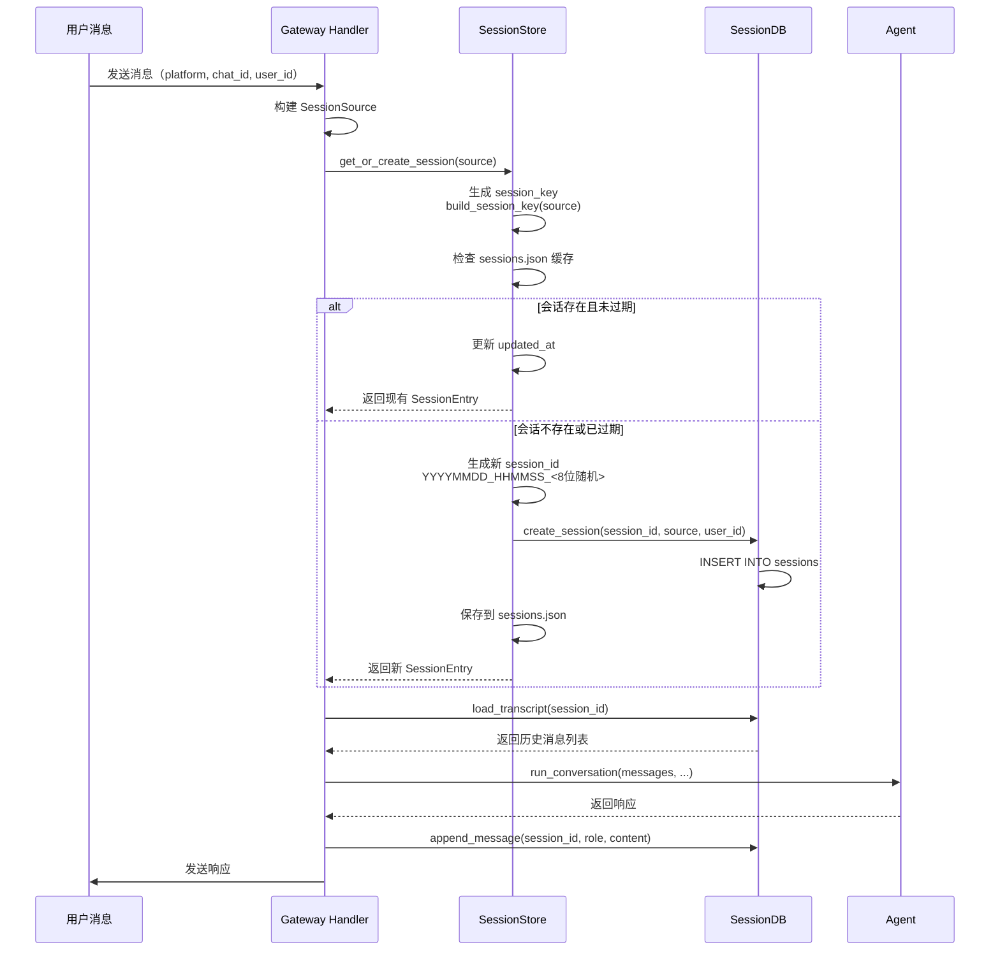
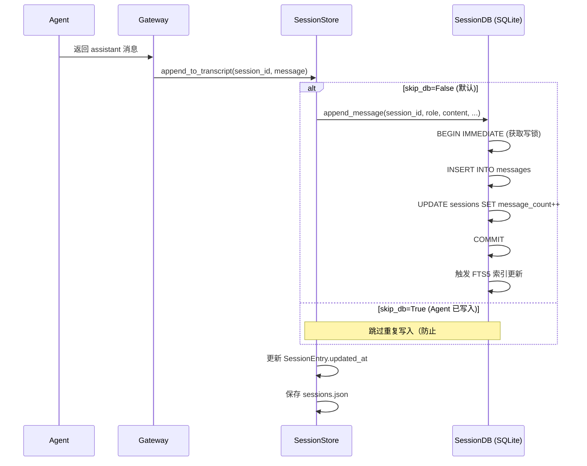
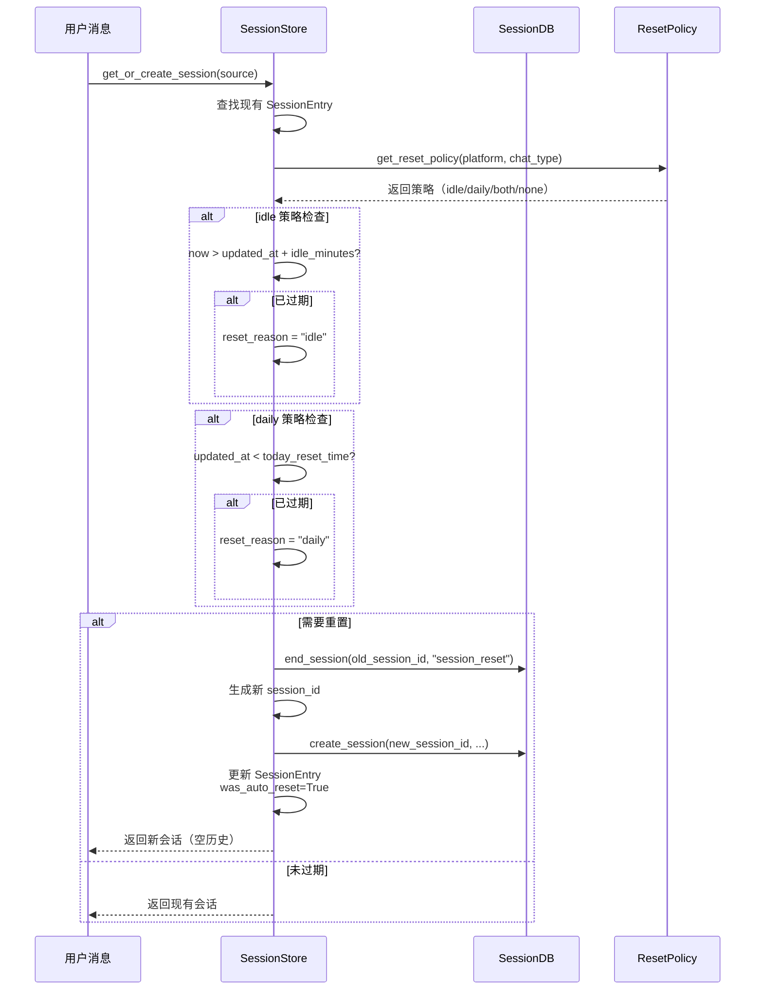
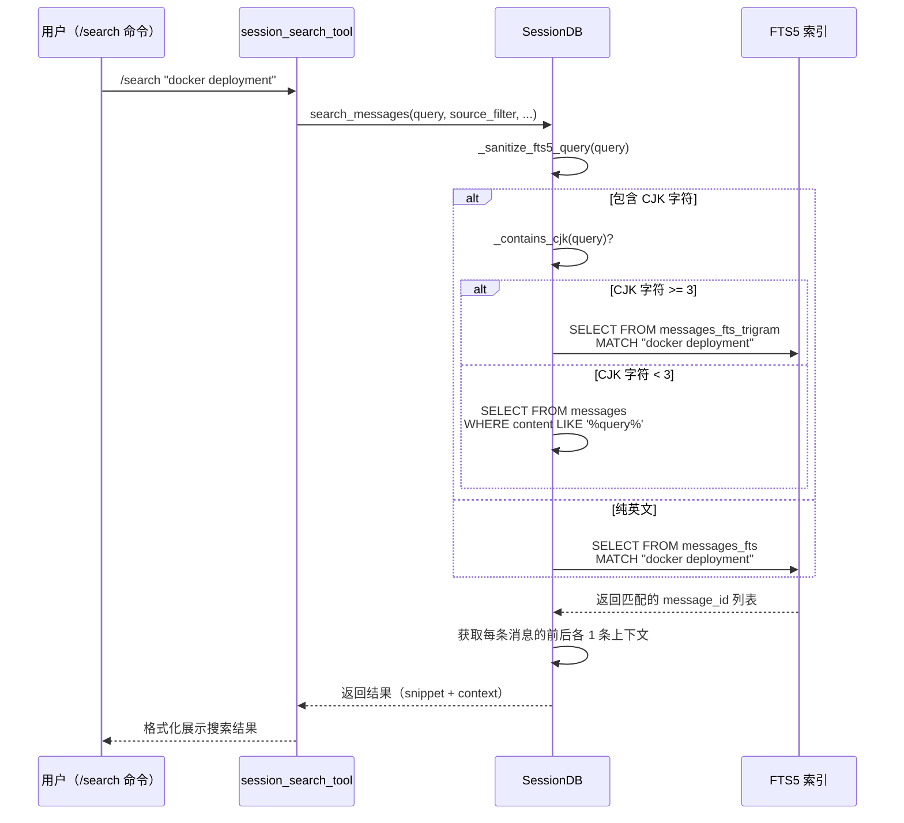

# Session / State Persistence 技术设计方案

## 1. 模块定位

### 职责范围
Session / State Persistence 模块负责 Hermes Agent 的**会话状态持久化**和**消息历史管理**，是整个系统的数据持久层核心。

**主要职责：**
- 会话生命周期管理（创建、恢复、结束、重置）
- 消息历史的持久化存储与检索
- 会话元数据管理（token 统计、成本追踪、标题管理）
- 全文搜索能力（支持多语言，包括 CJK）
- 会话隔离策略（多用户、多平台、多线程）
- 跨平台会话切换（handoff 机制）

**不负责：**
- 实时消息传输（由 gateway 模块负责）
- 业务逻辑处理（由 agent 模块负责）
- 工具调用执行（由 tools 模块负责）
- 用户认证授权（由各平台适配器负责）

### 架构定位
```
┌─────────────────────────────────────────────────────────┐
│                    Gateway / CLI                         │
│              (消息入口、用户交互)                          │
└────────────────────┬────────────────────────────────────┘
                     │
                     ▼
┌─────────────────────────────────────────────────────────┐
│              Session Management Layer                    │
│  ┌──────────────┐         ┌──────────────┐             │
│  │ SessionStore │◄────────┤SessionContext│             │
│  │  (Gateway)   │         │   (运行时)    │             │
│  └──────┬───────┘         └──────────────┘             │
│         │                                                │
│         ▼                                                │
│  ┌──────────────────────────────────────┐              │
│  │         SessionDB (SQLite)            │              │
│  │  - sessions 表 (会话元数据)            │              │
│  │  - messages 表 (消息历史)              │              │
│  │  - messages_fts (全文搜索索引)         │              │
│  └──────────────────────────────────────┘              │
└─────────────────────────────────────────────────────────┘
                     │
                     ▼
┌─────────────────────────────────────────────────────────┐
│                  Filesystem                              │
│         ~/.hermes/state.db (SQLite 数据库)               │
└─────────────────────────────────────────────────────────┘
```

## 2. 核心能力

### 2.1 会话生命周期管理
- **会话创建**：根据平台、用户、聊天类型自动生成唯一 session_id
- **会话恢复**：支持通过 session_id、title、前缀匹配恢复历史会话
- **会话重置**：支持手动重置（/new）和自动重置（idle/daily 策略）
- **会话结束**：标记会话结束原因（compression、branched、session_reset 等）
- **会话分支**：支持从历史会话创建分支（/branch）
- **会话压缩**：当上下文超限时自动创建子会话继续对话

### 2.2 消息持久化
- **消息存储**：支持 user、assistant、tool 三种角色的消息
- **多模态内容**：支持文本、图片、工具调用等结构化内容
- **增量追加**：实时追加消息到 SQLite，无需等待会话结束
- **批量重写**：支持 /retry、/undo、/compress 等操作的事务性重写
- **平台消息 ID**：保留原始平台消息 ID（用于消息撤回等场景）

### 2.3 会话隔离策略
- **DM 隔离**：每个私聊对话独立会话（通过 chat_id 区分）
- **群组隔离**：可配置按用户隔离或共享会话（group_sessions_per_user）
- **线程隔离**：可配置线程内共享或按用户隔离（thread_sessions_per_user）
- **平台隔离**：不同平台的会话完全独立
- **WhatsApp 规范化**：处理 JID/LID 别名问题，确保同一用户不会产生多个会话

### 2.4 全文搜索
- **FTS5 索引**：基于 SQLite FTS5 的全文搜索引擎
- **CJK 支持**：
  - 3+ 字符：使用 trigram 索引（支持子串匹配）
  - 1-2 字符：降级到 LIKE 查询
- **布尔查询**：支持 AND、OR、NOT 逻辑运算符
- **短语匹配**：支持 "exact phrase" 精确匹配
- **前缀搜索**：支持 deploy* 通配符
- **上下文预览**：返回匹配消息前后各 1 条消息作为上下文

### 2.5 元数据管理
- **Token 统计**：input_tokens、output_tokens、cache_read/write_tokens、reasoning_tokens
- **成本追踪**：estimated_cost_usd、actual_cost_usd、cost_status
- **会话标题**：支持自定义标题（唯一性约束）、自动生成编号（title #2）
- **会话链**：parent_session_id 追踪压缩链和分支关系
- **活跃时间**：started_at、ended_at、last_active（最后消息时间）

### 2.6 并发控制
- **WAL 模式**：支持多读单写并发访问
- **写锁重试**：应用层随机退避重试（避免 convoy effect）
- **定期 checkpoint**：每 50 次写操作触发 PASSIVE checkpoint
- **NFS 降级**：在不支持 WAL 的文件系统上自动降级到 DELETE 模式

## 3. 关键入口文件

| 文件路径 | 主要类/函数 | 作用 | 为什么重要 |
|---------|-----------|------|-----------|
| `hermes_state.py` | `SessionDB` | SQLite 数据库封装，提供所有持久化操作 | **核心存储层**，所有会话和消息数据的唯一真实来源 |
| `gateway/session.py` | `SessionStore`<br>`SessionEntry`<br>`SessionSource`<br>`SessionContext` | Gateway 的会话管理层，负责会话生命周期和路由 | **Gateway 会话管理**，处理多平台并发会话、重置策略、会话隔离 |
| `gateway/session_context.py` | `set_session_vars()`<br>`get_session_env()`<br>`ContextVar` | 基于 contextvars 的并发安全上下文传递 | **并发安全**，解决 asyncio 并发消息处理时的上下文隔离问题 |
| `tools/tool_result_storage.py` | `maybe_persist_tool_result()`<br>`enforce_turn_budget()` | 大型工具输出持久化到沙箱临时目录 | **防止上下文溢出**，将超大工具输出写入文件而非内存 |
| `tools/file_state.py` | `FileStateRegistry` | 追踪文件编辑状态，支持 /undo | 文件操作的状态管理 |
| `tools/browser_camofox_state.py` | `BrowserState` | 浏览器会话状态持久化 | 浏览器工具的状态管理 |

### 3.1 核心类关系

```python
# hermes_state.py
class SessionDB:
    """SQLite 数据库封装 - 数据持久层"""
    def create_session(session_id, source, model, ...)
    def append_message(session_id, role, content, ...)
    def get_messages_as_conversation(session_id)
    def search_messages(query, source_filter, ...)
    def set_session_title(session_id, title)
    def resolve_session_id(session_id_or_prefix)
    
# gateway/session.py
class SessionStore:
    """Gateway 会话管理 - 业务逻辑层"""
    def __init__(sessions_dir, config, has_active_processes_fn)
    def get_or_create_session(source, force_new=False)
    def reset_session(session_key, display_name)
    def suspend_session(session_key)  # /stop 使用
    def mark_resume_pending(session_key)  # 重启恢复
    
class SessionEntry:
    """会话元数据 - 内存缓存"""
    session_key: str      # 会话唯一标识
    session_id: str       # 当前活跃的 session_id
    created_at: datetime
    updated_at: datetime
    origin: SessionSource # 消息来源
    was_auto_reset: bool  # 是否自动重置
    suspended: bool       # 是否挂起
    resume_pending: bool  # 是否等待恢复
```

## 4. 运行时流程

### 4.1 会话创建流程（Gateway）



### 4.2 消息持久化流程



### 4.3 会话重置流程（自动过期）



### 4.4 全文搜索流程



## 5. 核心数据结构 / 状态

### 5.1 SQLite 数据库表结构

#### sessions 表（会话元数据）
```sql
CREATE TABLE sessions (
    id TEXT PRIMARY KEY,                    -- session_id: YYYYMMDD_HHMMSS_<8位随机>
    source TEXT NOT NULL,                   -- 来源平台: cli, telegram, discord, etc.
    user_id TEXT,                           -- 用户标识
    model TEXT,                             -- 使用的模型
    model_config TEXT,                      -- 模型配置（JSON）
    system_prompt TEXT,                     -- 系统提示词快照
    parent_session_id TEXT,                 -- 父会话 ID（压缩链/分支）
    started_at REAL NOT NULL,               -- 创建时间（Unix timestamp）
    ended_at REAL,                          -- 结束时间
    end_reason TEXT,                        -- 结束原因: compression, branched, session_reset
    message_count INTEGER DEFAULT 0,        -- 消息总数
    tool_call_count INTEGER DEFAULT 0,      -- 工具调用次数
    input_tokens INTEGER DEFAULT 0,         -- 输入 token 数
    output_tokens INTEGER DEFAULT 0,        -- 输出 token 数
    cache_read_tokens INTEGER DEFAULT 0,    -- 缓存读取 token 数
    cache_write_tokens INTEGER DEFAULT 0,   -- 缓存写入 token 数
    reasoning_tokens INTEGER DEFAULT 0,     -- 推理 token 数
    estimated_cost_usd REAL,                -- 预估成本
    actual_cost_usd REAL,                   -- 实际成本
    cost_status TEXT,                       -- 成本状态
    title TEXT,                             -- 会话标题（唯一）
    handoff_state TEXT,                     -- 跨平台切换状态
    handoff_platform TEXT,                  -- 目标平台
    FOREIGN KEY (parent_session_id) REFERENCES sessions(id)
);

-- 索引
CREATE INDEX idx_sessions_source ON sessions(source);
CREATE INDEX idx_sessions_parent ON sessions(parent_session_id);
CREATE INDEX idx_sessions_started ON sessions(started_at DESC);
CREATE UNIQUE INDEX idx_sessions_title_unique ON sessions(title) WHERE title IS NOT NULL;
```

#### messages 表（消息历史）
```sql
CREATE TABLE messages (
    id INTEGER PRIMARY KEY AUTOINCREMENT,   -- 消息自增 ID
    session_id TEXT NOT NULL,               -- 所属会话
    role TEXT NOT NULL,                     -- user, assistant, tool
    content TEXT,                           -- 消息内容（可能是 JSON 编码的多模态内容）
    tool_call_id TEXT,                      -- 工具调用 ID
    tool_calls TEXT,                        -- 工具调用列表（JSON）
    tool_name TEXT,                         -- 工具名称
    timestamp REAL NOT NULL,                -- 消息时间戳
    token_count INTEGER,                    -- token 数量
    finish_reason TEXT,                     -- 完成原因
    reasoning TEXT,                         -- 推理标记
    reasoning_content TEXT,                 -- 推理内容
    reasoning_details TEXT,                 -- 推理详情（JSON）
    codex_reasoning_items TEXT,             -- Codex 推理项（JSON）
    codex_message_items TEXT,               -- Codex 消息项（JSON）
    platform_message_id TEXT,               -- 平台原始消息 ID
    FOREIGN KEY (session_id) REFERENCES sessions(id)
);

-- 索引
CREATE INDEX idx_messages_session ON messages(session_id, timestamp);
CREATE INDEX idx_messages_platform_msg_id ON messages(session_id, platform_message_id) 
    WHERE platform_message_id IS NOT NULL;
```

#### messages_fts 表（全文搜索索引 - 英文）
```sql
CREATE VIRTUAL TABLE messages_fts USING fts5(
    content  -- 索引内容: content + tool_name + tool_calls
);

-- 自动同步触发器
CREATE TRIGGER messages_fts_insert AFTER INSERT ON messages BEGIN
    INSERT INTO messages_fts(rowid, content) VALUES (
        new.id,
        COALESCE(new.content, '') || ' ' || 
        COALESCE(new.tool_name, '') || ' ' || 
        COALESCE(new.tool_calls, '')
    );
END;
```

#### messages_fts_trigram 表（全文搜索索引 - CJK）
```sql
CREATE VIRTUAL TABLE messages_fts_trigram USING fts5(
    content,
    tokenize='trigram'  -- 三元组分词，支持 CJK 子串匹配
);
```

### 5.2 内存数据结构

#### SessionEntry（会话缓存条目）
```python
@dataclass
class SessionEntry:
    session_key: str              # 会话唯一键（由平台+用户+聊天生成）
    session_id: str               # 当前活跃的 session_id
    created_at: datetime          # 创建时间
    updated_at: datetime          # 最后活跃时间
    origin: SessionSource         # 消息来源
    display_name: str             # 显示名称
    platform: Platform            # 平台枚举
    chat_type: str                # dm, group, channel, thread
    
    # Token 统计
    input_tokens: int = 0
    output_tokens: int = 0
    cache_read_tokens: int = 0
    cache_write_tokens: int = 0
    total_tokens: int = 0
    last_prompt_tokens: int = 0   # 最后一次 API 返回的 prompt tokens
    
    # 成本追踪
    estimated_cost_usd: float = 0.0
    cost_status: str = "unknown"
    
    # 重置标记
    was_auto_reset: bool = False          # 是否自动重置
    auto_reset_reason: str = None         # idle / daily
    reset_had_activity: bool = False      # 重置前是否有活动
    is_fresh_reset: bool = False          # 是否手动重置
    
    # 状态标记
    expiry_finalized: bool = False        # 是否已完成过期清理
    suspended: bool = False               # 是否挂起（/stop）
    resume_pending: bool = False          # 是否等待恢复（重启中断）
    resume_reason: str = None             # restart_timeout
    last_resume_marked_at: datetime = None
```

#### SessionSource（消息来源）
```python
@dataclass
class SessionSource:
    platform: Platform            # LOCAL, TELEGRAM, DISCORD, WHATSAPP, etc.
    chat_id: str                  # 聊天 ID
    chat_name: str = None         # 聊天名称
    chat_type: str = "dm"         # dm, group, channel, thread
    user_id: str = None           # 用户 ID
    user_name: str = None         # 用户名
    thread_id: str = None         # 线程 ID（论坛主题、Discord 线程）
    chat_topic: str = None        # 频道主题
    user_id_alt: str = None       # 平台特定的备用 ID（Signal UUID）
    chat_id_alt: str = None       # Signal 群组内部 ID
    is_bot: bool = False          # 是否机器人消息
    guild_id: str = None          # Discord guild / Slack workspace
    parent_chat_id: str = None    # 父频道 ID（线程的父频道）
    message_id: str = None        # 触发消息 ID
```

#### SessionContext（会话上下文）
```python
@dataclass
class SessionContext:
    source: SessionSource                      # 消息来源
    connected_platforms: List[Platform]        # 已连接的平台
    home_channels: Dict[Platform, HomeChannel] # 各平台的 home 频道
    shared_multi_user_session: bool = False    # 是否多用户共享会话
    
    # 会话元数据
    session_key: str = ""
    session_id: str = ""
    created_at: datetime = None
    updated_at: datetime = None
```

### 5.3 配置文件

#### sessions.json（会话索引缓存）
```json
{
  "agent:main:telegram:dm:123456789": {
    "session_key": "agent:main:telegram:dm:123456789",
    "session_id": "20260526_143022_a1b2c3d4",
    "created_at": "2026-05-26T14:30:22.123456",
    "updated_at": "2026-05-26T15:45:30.654321",
    "origin": {
      "platform": "telegram",
      "chat_id": "123456789",
      "user_id": "123456789",
      "chat_type": "dm"
    },
    "display_name": "John Doe",
    "platform": "telegram",
    "chat_type": "dm",
    "input_tokens": 15234,
    "output_tokens": 8765,
    "suspended": false,
    "resume_pending": false
  }
}
```

#### state.db（SQLite 数据库文件）
- 位置：`~/.hermes/state.db`
- 模式：WAL（Write-Ahead Logging）
- 大小：随消息数量增长，定期 VACUUM 压缩
- 备份：支持 `sqlite3 state.db .dump` 导出

## 6. 与其他模块的关系

### 6.1 依赖关系图

```
┌─────────────────────────────────────────────────────────────┐
│                      上层调用者                               │
├─────────────────────────────────────────────────────────────┤
│  cli.py          │  run_agent.py  │  gateway/         │     │
│  (CLI 入口)       │  (Agent 运行器) │  (多平台网关)      │     │
└────────┬─────────┴────────┬────────┴──────┬───────────┴─────┘
         │                  │               │
         │                  │               │
         ▼                  ▼               ▼
┌─────────────────────────────────────────────────────────────┐
│              Session / State Persistence 层                  │
├─────────────────────────────────────────────────────────────┤
│  hermes_state.py (SessionDB)                                │
│  gateway/session.py (SessionStore, SessionEntry)            │
│  gateway/session_context.py (ContextVar)                    │
└────────┬─────────────────────────────────────┬──────────────┘
         │                                     │
         │ 依赖                                 │ 依赖
         ▼                                     ▼
┌──────────────────────┐            ┌──────────────────────┐
│  SQLite 数据库        │            │  工具状态持久化       │
│  ~/.hermes/state.db  │            │  tool_result_storage │
└──────────────────────┘            │  file_state          │
                                    │  browser_state       │
                                    └──────────────────────┘
```

### 6.2 被调用关系

#### 6.2.1 CLI 调用
**文件：** `cli.py`

```python
# CLI 启动时初始化 SessionDB
from hermes_state import SessionDB
session_db = SessionDB()

# 恢复会话
session_id = session_db.resolve_session_id(session_id_or_prefix)
messages = session_db.get_messages_as_conversation(session_id)

# 搜索历史
results = session_db.search_messages(query, source_filter=["cli"])

# 设置标题
session_db.set_session_title(session_id, title)
```

#### 6.2.2 Gateway 调用
**文件：** `gateway/session.py`

```python
# Gateway 启动时初始化
from hermes_state import SessionDB
from gateway.session import SessionStore

session_db = SessionDB()
session_store = SessionStore(
    sessions_dir=Path("~/.hermes/sessions"),
    config=gateway_config,
    has_active_processes_fn=process_registry.has_active_for_session
)

# 处理消息时
session_entry = session_store.get_or_create_session(source)
messages = session_store.load_transcript(session_entry.session_id)
# ... 调用 agent ...
session_store.append_to_transcript(session_entry.session_id, message)
```

#### 6.2.3 Agent 调用
**文件：** `run_agent.py`

```python
# Agent 内部直接写入 SessionDB
from hermes_state import SessionDB

def _flush_messages_to_session_db(self):
    """将内存中的消息批量写入 SessionDB"""
    if not self._session_db:
        return
    for msg in self._pending_messages:
        self._session_db.append_message(
            session_id=self.session_id,
            role=msg["role"],
            content=msg["content"],
            tool_calls=msg.get("tool_calls"),
            ...
        )
```

### 6.3 调用其他模块

#### 6.3.1 调用工具状态模块
```python
# tools/tool_result_storage.py
from tools.tool_result_storage import maybe_persist_tool_result

# 大型工具输出持久化到沙箱
result = maybe_persist_tool_result(
    content=tool_output,
    tool_name="search_files",
    tool_use_id=tool_call_id,
    env=environment,
    threshold=50000  # 50KB
)
```

#### 6.3.2 调用文件系统
```python
# 读写 sessions.json
import json
from pathlib import Path
from utils import atomic_replace

sessions_file = Path("~/.hermes/sessions/sessions.json")
data = {key: entry.to_dict() for key, entry in self._entries.items()}
atomic_replace(tmp_path, sessions_file)
```

### 6.4 边界说明

#### SessionDB 的边界
- **负责**：数据持久化、查询、索引维护
- **不负责**：
  - 会话生命周期策略（由 SessionStore 负责）
  - 消息路由和分发（由 Gateway 负责）
  - 业务逻辑处理（由 Agent 负责）

#### SessionStore 的边界
- **负责**：会话生命周期管理、重置策略、会话隔离
- **不负责**：
  - 底层数据存储（委托给 SessionDB）
  - 消息内容处理（由 Agent 负责）
  - 平台特定逻辑（由各平台适配器负责）

#### 数据流向
```
用户消息 → Gateway → SessionStore → SessionDB → SQLite
                ↓
              Agent ← SessionDB.load_transcript()
                ↓
         生成响应 → SessionDB.append_message()
                ↓
            Gateway → 发送给用户
```

## 7. 错误处理与降级策略

### 7.1 SQLite 初始化失败

**场景：** NFS/SMB 文件系统不支持 WAL 模式

**源码位置：** `hermes_state.py:354-372`

```python
def __init__(self, db_path: Path = None):
    try:
        self._conn = sqlite3.connect(str(self.db_path), ...)
        apply_wal_with_fallback(self._conn, db_label="state.db")
        # ...
    except Exception as exc:
        _set_last_init_error(f"{type(exc).__name__}: {exc}")
        raise
```

**降级策略：**
1. 尝试设置 `PRAGMA journal_mode=WAL`
2. 捕获 `sqlite3.OperationalError("locking protocol")`
3. 自动降级到 `PRAGMA journal_mode=DELETE`
4. 记录警告日志（每个数据库每进程只记录一次）
5. 继续运行（并发性能下降，但功能正常）

**用户影响：**
- 并发读写性能下降
- 多进程同时访问时可能出现短暂的 `database is locked` 错误
- 功能完全正常，只是性能受限

### 7.2 写锁竞争

**场景：** 多个进程同时写入 state.db（Gateway + CLI + Worktree Agent）

**源码位置：** `hermes_state.py:376-426`

```python
def _execute_write(self, fn: Callable[[sqlite3.Connection], T]) -> T:
    """执行写事务，带随机退避重试"""
    last_err = None
    for attempt in range(self._WRITE_MAX_RETRIES):  # 最多重试 15 次
        try:
            with self._lock:
                self._conn.execute("BEGIN IMMEDIATE")  # 立即获取写锁
                try:
                    result = fn(self._conn)
                    self._conn.commit()
                except BaseException:
                    self._conn.rollback()
                    raise
            return result
        except sqlite3.OperationalError as exc:
            if "locked" in str(exc).lower() or "busy" in str(exc).lower():
                last_err = exc
                if attempt < self._WRITE_MAX_RETRIES - 1:
                    jitter = random.uniform(0.020, 0.150)  # 20-150ms 随机退避
                    time.sleep(jitter)
                    continue
            raise
    raise last_err
```

**降级策略：**
1. 使用 `BEGIN IMMEDIATE` 立即获取写锁（而非等到 COMMIT 时）
2. 捕获 `database is locked` 错误
3. 随机退避 20-150ms（避免 convoy effect）
4. 最多重试 15 次
5. 失败后抛出异常，由上层处理

**用户影响：**
- 正常情况下用户无感知
- 极端高并发时可能出现短暂延迟（最多 2-3 秒）
- 失败后会向用户报错，提示稍后重试

### 7.3 会话恢复失败

**场景：** 用户指定的 session_id 不存在或已被压缩

**源码位置：** `hermes_state.py:1847-1910`

```python
def resolve_resume_session_id(self, session_id: str) -> str:
    """重定向到包含消息的后代会话"""
    # 如果当前会话有消息，直接返回
    if self._has_messages(session_id):
        return session_id
    
    # 否则沿着 parent_session_id 链向前查找
    current = session_id
    for _ in range(32):  # 最多查找 32 层
        child = self._get_latest_child(current)
        if child is None:
            return session_id  # 找不到子会话，返回原始 ID
        if self._has_messages(child):
            return child  # 找到有消息的子会话
        current = child
    return session_id  # 超过深度限制，返回原始 ID
```

**降级策略：**
1. 检查指定的 session_id 是否有消息
2. 如果没有，沿着压缩链向前查找（最多 32 层）
3. 返回第一个包含消息的会话 ID
4. 如果都没有消息，返回原始 ID（会话为空）

**用户影响：**
- 透明恢复到正确的会话
- 用户无需关心压缩链的内部结构

### 7.4 全文搜索失败

**场景：** FTS5 查询语法错误或索引损坏

**源码位置：** `hermes_state.py:2113-2343`

```python
def search_messages(self, query: str, ...):
    query = self._sanitize_fts5_query(query)  # 清理特殊字符
    
    try:
        cursor = self._conn.execute(sql, params)
    except sqlite3.OperationalError:
        # FTS5 查询失败，返回空结果
        return []
    
    matches = [dict(row) for row in cursor.fetchall()]
```

**降级策略：**
1. 预处理查询字符串，移除 FTS5 特殊字符
2. 捕获 `sqlite3.OperationalError`
3. 返回空结果列表（而非崩溃）
4. CJK 短查询自动降级到 LIKE 查询

**用户影响：**
- 搜索失败时返回空结果
- 用户可以调整查询语法后重试

### 7.5 会话过期清理失败

**场景：** 后台清理任务失败（磁盘满、权限问题）

**源码位置：** `hermes_state.py:3101-3172`

```python
def maybe_auto_prune_and_vacuum(self, ...):
    """自动维护：清理旧会话 + VACUUM"""
    result = {"skipped": False, "pruned": 0, "vacuumed": False}
    try:
        # 检查是否在最小间隔内
        last_raw = self.get_meta("last_auto_prune")
        if last_raw and now - float(last_raw) < min_interval_hours * 3600:
            result["skipped"] = True
            return result
        
        # 清理旧会话
        pruned = self.prune_sessions(older_than_days=retention_days)
        result["pruned"] = pruned
        
        # VACUUM 压缩
        if vacuum and pruned > 0:
            self.vacuum()
            result["vacuumed"] = True
        
        # 记录执行时间
        self.set_meta("last_auto_prune", str(now))
    except Exception as exc:
        logger.warning("state.db auto-maintenance failed: %s", exc)
        result["error"] = str(exc)
    
    return result
```

**降级策略：**
1. 捕获所有异常，记录警告日志
2. 返回错误信息（不阻塞启动）
3. 下次启动时重试
4. 最小间隔保护（24 小时内不重复执行）

**用户影响：**
- 清理失败不影响正常使用
- 数据库文件可能持续增长
- 用户可以手动执行 `hermes db vacuum`

### 7.6 并发上下文隔离失败

**场景：** asyncio 并发处理消息时上下文混乱

**源码位置：** `gateway/session_context.py:86-114`

```python
def set_session_vars(...) -> list:
    """设置会话上下文变量（线程安全）"""
    tokens = [
        _SESSION_PLATFORM.set(platform),
        _SESSION_CHAT_ID.set(chat_id),
        _SESSION_CHAT_NAME.set(chat_name),
        _SESSION_THREAD_ID.set(thread_id),
        _SESSION_USER_ID.set(user_id),
        _SESSION_USER_NAME.set(user_name),
        _SESSION_KEY.set(session_key),
        _SESSION_MESSAGE_ID.set(message_id),
    ]
    return tokens

def get_session_env(name: str, default: str = "") -> str:
    """读取会话上下文变量"""
    var = _VAR_MAP.get(name)
    if var is not None:
        value = var.get()
        if value is not _UNSET:
            return value
    # 降级到 os.environ（CLI/cron 兼容）
    return os.getenv(name, default)
```

**降级策略：**
1. 使用 `contextvars.ContextVar` 实现任务级隔离
2. 如果 ContextVar 未设置，降级到 `os.environ`
3. 保持向后兼容（CLI 和 cron 仍使用环境变量）

**用户影响：**
- Gateway 并发消息处理完全隔离
- CLI 和 cron 继续使用环境变量
- 无缝兼容新旧代码

### 7.7 工具输出过大

**场景：** 工具返回超大结果（如 `find` 返回 10 万个文件）

**源码位置：** `tools/tool_result_storage.py:122-178`

```python
def maybe_persist_tool_result(content: str, tool_name: str, ...):
    """持久化超大工具输出"""
    if len(content) <= threshold:
        return content  # 小于阈值，直接返回
    
    # 生成预览
    preview, has_more = generate_preview(content, max_chars=2000)
    
    # 尝试写入沙箱
    if env is not None:
        try:
            if _write_to_sandbox(content, remote_path, env):
                return _build_persisted_message(preview, has_more, ...)
        except Exception as exc:
            logger.warning("Sandbox write failed: %s", exc)
    
    # 降级：内联截断
    return f"{preview}\n\n[Truncated: {len(content):,} chars. Full output could not be saved.]"
```

**降级策略：**
1. 检查输出大小是否超过阈值（默认 50KB）
2. 尝试写入沙箱临时目录（`/tmp/hermes-results/`）
3. 如果写入失败，降级到内联截断
4. 返回预览 + 文件路径（或截断提示）

**用户影响：**
- 正常情况下工具输出保存到文件，Agent 可以用 `read_file` 读取
- 沙箱写入失败时，Agent 只能看到截断的预览
- 不会因为超大输出导致上下文溢出

## 8. 关键设计决策与权衡

### 8.1 为什么选择 SQLite 而非其他数据库？

**决策：** 使用 SQLite 作为唯一持久化存储

**理由：**
1. **零配置**：无需独立数据库服务，开箱即用
2. **单文件**：所有数据在一个文件中，易于备份和迁移
3. **跨平台**：支持 Linux、macOS、Windows、Termux
4. **FTS5 支持**：内置全文搜索引擎，无需 Elasticsearch
5. **WAL 模式**：支持多读单写并发，满足 Gateway 需求
6. **成熟稳定**：SQLite 是世界上部署最广泛的数据库

**权衡：**
- ❌ 不支持多写并发（但 Hermes 场景下单写足够）
- ❌ 不支持分布式（但 Hermes 是单机部署）
- ✅ 简单可靠，维护成本低

### 8.2 为什么使用 WAL 模式？

**决策：** 默认启用 WAL（Write-Ahead Logging）模式

**理由：**
1. **并发读写**：读操作不阻塞写操作，写操作不阻塞读操作
2. **性能提升**：写操作更快（顺序写 WAL 文件）
3. **崩溃恢复**：WAL 文件提供更好的崩溃恢复能力

**降级策略：**
- NFS/SMB 文件系统不支持 WAL 时自动降级到 DELETE 模式
- 记录警告日志，但不影响功能

**源码位置：** `hermes_state.py:127-183`

### 8.3 为什么需要 sessions.json 缓存？

**决策：** 在内存中维护 `sessions.json` 索引文件

**理由：**
1. **快速查找**：根据 session_key 快速定位 session_id（无需查询数据库）
2. **重置策略**：缓存 `updated_at` 用于判断会话是否过期
3. **状态标记**：缓存 `suspended`、`resume_pending` 等运行时状态
4. **减少 I/O**：避免每次消息都查询数据库

**权衡：**
- ❌ 需要同步内存和磁盘状态
- ❌ 多进程场景下可能不一致（但通过 session_id 最终一致）
- ✅ 性能提升显著（每条消息节省 1 次数据库查询）

**源码位置：** `gateway/session.py:668-743`

### 8.4 为什么需要两个 FTS5 索引？

**决策：** 维护 `messages_fts`（unicode61）和 `messages_fts_trigram`（trigram）两个索引

**理由：**
1. **unicode61 索引**：适合英文和词语分隔的语言（空格分词）
2. **trigram 索引**：适合 CJK 语言（无空格分词，支持子串匹配）
3. **查询路由**：
   - 纯英文 → unicode61 索引
   - CJK ≥3 字符 → trigram 索引
   - CJK <3 字符 → LIKE 查询（trigram 最小匹配长度为 3）

**权衡：**
- ❌ 双倍索引空间（约为原始数据的 50%）
- ❌ 写入时需要更新两个索引
- ✅ 搜索体验大幅提升（CJK 用户可以搜索任意子串）

**源码位置：** `hermes_state.py:254-307, 2083-2106`

### 8.5 为什么使用 session_key 而非 session_id？

**决策：** 使用 `session_key` 作为会话的稳定标识符

**session_key 生成规则：**
```python
# DM: agent:main:{platform}:dm:{chat_id}
# 群组: agent:main:{platform}:group:{chat_id}:{user_id}
# 线程: agent:main:{platform}:group:{chat_id}:{thread_id}
```

**理由：**
1. **稳定性**：session_key 在会话重置后保持不变
2. **隔离性**：不同平台、用户、聊天的 session_key 不同
3. **可预测**：根据消息来源可以确定性地生成 session_key
4. **重置支持**：重置会话时只需更换 session_id，session_key 不变

**session_id vs session_key：**
- `session_id`：具体的会话实例（如 `20260526_143022_a1b2c3d4`）
- `session_key`：会话的逻辑标识（如 `agent:main:telegram:dm:123456789`）
- 一个 session_key 可以对应多个 session_id（重置、压缩）

**源码位置：** `gateway/session.py:600-665`

### 8.6 为什么需要 parent_session_id？

**决策：** 使用 `parent_session_id` 追踪会话链

**使用场景：**
1. **压缩链**：上下文压缩后创建子会话继续对话
2. **分支**：从历史会话创建分支（/branch）
3. **子代理**：delegate_task 创建的子会话

**查询策略：**
```python
# 查找压缩链的最新会话
def get_compression_tip(session_id):
    while True:
        child = find_child_where(
            parent_id=session_id,
            parent.end_reason='compression',
            child.started_at >= parent.ended_at
        )
        if child is None:
            return session_id
        session_id = child
```

**权衡：**
- ❌ 增加查询复杂度（需要递归查找）
- ✅ 保留完整的会话历史（压缩前的消息不丢失）
- ✅ 支持 /resume 恢复到正确的会话

**源码位置：** `hermes_state.py:1140-1174, 1847-1910`

### 8.7 为什么需要 ContextVar？

**决策：** 使用 `contextvars.ContextVar` 替代 `os.environ`

**问题背景：**
- Gateway 使用 asyncio 并发处理多个平台的消息
- 旧代码使用 `os.environ` 传递会话上下文
- `os.environ` 是进程全局的，导致并发消息的上下文混乱

**解决方案：**
```python
# 旧代码（有 bug）
os.environ["HERMES_SESSION_CHAT_ID"] = chat_id  # 全局变量，会被覆盖

# 新代码（正确）
_SESSION_CHAT_ID = ContextVar("HERMES_SESSION_CHAT_ID")
_SESSION_CHAT_ID.set(chat_id)  # 任务级变量，不会被覆盖
```

**权衡：**
- ❌ 需要修改所有读取上下文的代码
- ✅ 完全解决并发上下文混乱问题
- ✅ 向后兼容（CLI 和 cron 仍使用 os.environ）

**源码位置：** `gateway/session_context.py:1-165`

### 8.8 为什么需要工具输出持久化？

**决策：** 超大工具输出写入沙箱临时文件

**问题背景：**
- 某些工具（如 `find`、`grep`）可能返回 MB 级别的输出
- 直接放入上下文会导致 token 超限
- 截断输出会丢失重要信息

**解决方案：**
```python
# 1. 检查输出大小
if len(output) > 50_000:  # 50KB
    # 2. 写入沙箱
    path = f"/tmp/hermes-results/{tool_use_id}.txt"
    env.execute(f"cat > {path}", stdin_data=output)
    
    # 3. 返回预览 + 路径
    return f"""
    <persisted-output>
    Full output saved to: {path}
    Use read_file to access specific sections.
    
    Preview (first 2000 chars):
    {output[:2000]}
    ...
    </persisted-output>
    """
```

**权衡：**
- ❌ 增加文件 I/O 开销
- ✅ 防止上下文溢出
- ✅ Agent 可以按需读取（read_file with offset/limit）

**源码位置：** `tools/tool_result_storage.py:1-233`

