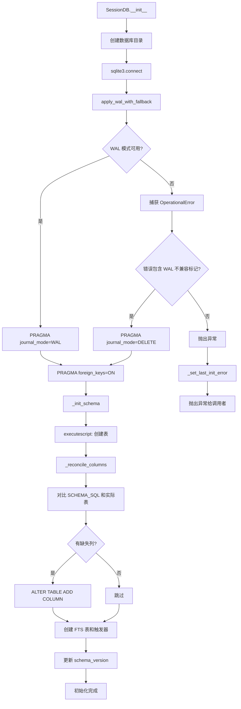
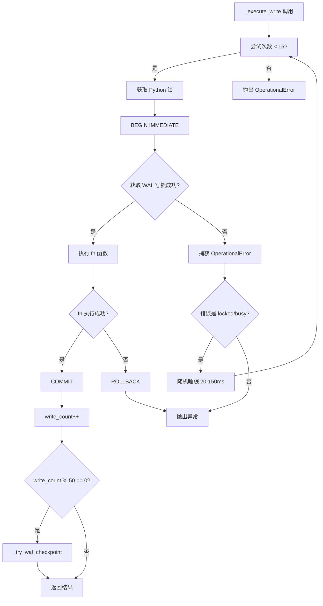
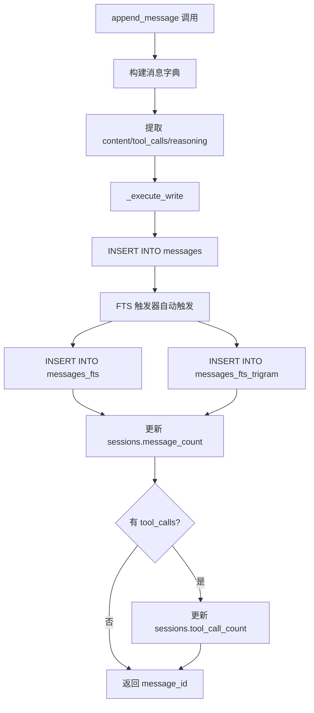
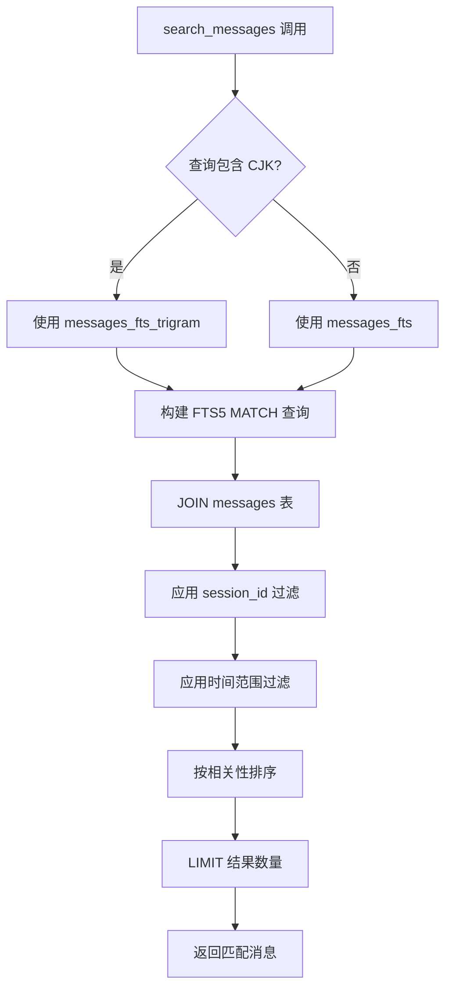
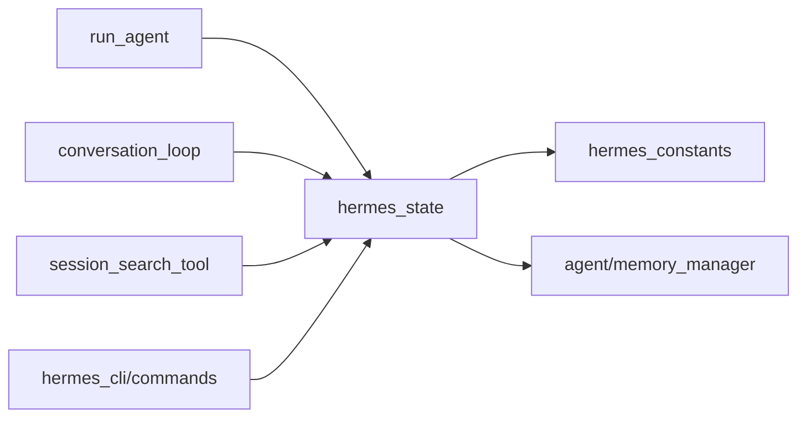

# 会话状态管理（Session State Management）技术设计方案

## 1. 模块定位

**职责范围：**
- 提供基于 SQLite 的持久化会话存储
- 管理会话元数据（模型配置、token 统计、成本估算）
- 存储完整的消息历史（用户输入、模型响应、工具调用）
- 实现 FTS5 全文搜索，支持跨会话检索
- 处理会话分割（上下文压缩触发的 parent_session_id 链）
- 支持多平台并发访问（CLI、Gateway、TUI）
- 提供会话恢复、标题生成、历史查询等功能

**不负责的内容：**
- 批量运行器和 RL 轨迹存储（使用独立的 JSONL 文件）
- 会话内的临时状态（由 `AIAgent` 实例管理）
- 记忆系统的持久化（由 `tools/memory_tool.py` 负责）
- 工具调用的执行逻辑（由 `agent/conversation_loop.py` 负责）

## 2. 核心能力

1. **WAL 模式并发访问**：支持多个读者 + 单个写者，适配 Gateway 多平台场景
2. **FTS5 全文搜索**：两个 FTS 表（unicode61 + trigram），支持英文和 CJK 子串搜索
3. **声明式 Schema 管理**：自动对比 SCHEMA_SQL 和实际表结构，添加缺失列
4. **写入重试与抖动**：应用层重试 + 随机抖动，避免 SQLite 内置 busy handler 的车队效应
5. **WAL 降级策略**：在 NFS/SMB/FUSE 文件系统上自动降级到 DELETE 模式
6. **会话分割链**：通过 `parent_session_id` 追踪压缩触发的会话分割
7. **平台标记**：通过 `source` 字段区分 CLI、Telegram、Discord 等来源
8. **成本追踪**：记录 token 使用、缓存命中、估算成本和实际成本

## 3. 关键入口文件

| 文件路径 | 主要类/函数 | 作用 | 为什么重要 |
|---------|------------|------|-----------|
| `hermes_state.py` | `SessionDB` 类 | 会话数据库的核心实现（~3700 行） | 所有会话持久化的单一入口 |
| `hermes_state.py` | `_execute_write()` | 写入事务的重试逻辑 | 处理 WAL 写锁竞争，避免 TUI 冻结 |
| `hermes_state.py` | `apply_wal_with_fallback()` | WAL 模式降级 | 在 NFS/SMB 上自动降级到 DELETE 模式 |
| `hermes_state.py` | `_reconcile_columns()` | 声明式 Schema 管理 | 自动添加缺失列，无需版本门控迁移 |
| `hermes_state.py` | `create_session()` | 创建新会话 | 初始化会话元数据 |
| `hermes_state.py` | `append_message()` | 追加消息 | 存储对话历史和工具调用 |
| `hermes_state.py` | `search_messages()` | 全文搜索 | 跨会话检索历史对话 |
| `tools/session_search_tool.py` | `session_search()` | 会话搜索工具 | Agent 调用的搜索接口 |

## 4. 运行时流程

### 4.1 数据库初始化流程

**源码位置**：`hermes_state.py:333-372`, `hermes_state.py:551-620`



**关键设计决策**：

1. **WAL 降级策略**（`hermes_state.py:128-162`）：
   ```python
   try:
       conn.execute("PRAGMA journal_mode=WAL")
       return "wal"
   except sqlite3.OperationalError as exc:
       if any(marker in str(exc).lower() for marker in _WAL_INCOMPAT_MARKERS):
           _log_wal_fallback_once(db_label, exc)
           conn.execute("PRAGMA journal_mode=DELETE")
           return "delete"
       raise
   ```
   - NFS/SMB/FUSE 不支持 WAL 的 mmap 协调
   - 自动降级到 DELETE 模式（功能可用，但并发性降低）
   - 每个数据库只记录一次警告，避免日志泛滥

2. **声明式 Schema 管理**（`hermes_state.py:507-549`）：
   - 使用内存 SQLite 解析 SCHEMA_SQL，提取期望列
   - 对比实际表结构，自动添加缺失列
   - 无需版本门控迁移，添加列只需修改 SCHEMA_SQL

### 4.2 写入事务流程

**源码位置**：`hermes_state.py:376-426`



**关键代码**（`hermes_state.py:392-426`）：
```python
for attempt in range(self._WRITE_MAX_RETRIES):
    try:
        with self._lock:
            self._conn.execute("BEGIN IMMEDIATE")
            try:
                result = fn(self._conn)
                self._conn.commit()
            except BaseException:
                self._conn.rollback()
                raise
        # 成功后定期 checkpoint
        self._write_count += 1
        if self._write_count % 50 == 0:
            self._try_wal_checkpoint()
        return result
    except sqlite3.OperationalError as exc:
        if "locked" in str(exc).lower() or "busy" in str(exc).lower():
            if attempt < self._WRITE_MAX_RETRIES - 1:
                jitter = random.uniform(0.020, 0.150)
                time.sleep(jitter)
                continue
        raise
```

**为什么这样设计**：
- **BEGIN IMMEDIATE**：立即获取写锁，而非在 COMMIT 时才获取
- **随机抖动**：避免 SQLite 内置 busy handler 的确定性退避导致的车队效应
- **短超时 + 应用层重试**：SQLite timeout 设为 1 秒，应用层重试最多 15 次
- **定期 checkpoint**：每 50 次写入执行一次 PASSIVE checkpoint，防止 WAL 无限增长

### 4.3 消息追加流程

**源码位置**：`hermes_state.py:800-900+`



**FTS 触发器**（`hermes_state.py:259-276`）：
```sql
CREATE TRIGGER messages_fts_insert AFTER INSERT ON messages BEGIN
    INSERT INTO messages_fts(rowid, content) VALUES (
        new.id,
        COALESCE(new.content, '') || ' ' || 
        COALESCE(new.tool_name, '') || ' ' || 
        COALESCE(new.tool_calls, '')
    );
END;
```

**为什么使用触发器**：
- 自动保持 FTS 表和主表同步
- 无需在应用代码中手动维护 FTS 索引
- 支持 UPDATE 和 DELETE 操作的自动同步

### 4.4 全文搜索流程

**源码位置**：`hermes_state.py:1200-1400+`



**CJK 检测逻辑**：
```python
def _contains_cjk(text: str) -> bool:
    for char in text:
        if '一' <= char <= '鿿':  # 中文
            return True
        if '぀' <= char <= 'ゟ':  # 日文平假名
            return True
        if '゠' <= char <= 'ヿ':  # 日文片假名
            return True
        if '가' <= char <= '힯':  # 韩文
            return True
    return False
```

**两个 FTS 表的作用**：
- `messages_fts`（unicode61）：适合英文单词搜索
- `messages_fts_trigram`（trigram）：适合 CJK 子串搜索

## 5. 核心数据结构 / 状态

### 5.1 sessions 表结构

**源码位置**：`hermes_state.py:190-222`

| 字段 | 类型 | 作用 |
|------|------|------|
| `id` | TEXT PRIMARY KEY | 会话唯一标识符（UUID） |
| `source` | TEXT NOT NULL | 会话来源（cli/telegram/discord/gateway） |
| `user_id` | TEXT | 用户标识符（多租户场景） |
| `model` | TEXT | 使用的模型名称 |
| `model_config` | TEXT | 模型配置 JSON |
| `system_prompt` | TEXT | 系统提示词快照 |
| `parent_session_id` | TEXT | 父会话 ID（压缩分割链） |
| `started_at` | REAL NOT NULL | 会话开始时间戳 |
| `ended_at` | REAL | 会话结束时间戳 |
| `end_reason` | TEXT | 结束原因（user_exit/error/timeout） |
| `message_count` | INTEGER | 消息总数 |
| `tool_call_count` | INTEGER | 工具调用总数 |
| `input_tokens` | INTEGER | 输入 token 数 |
| `output_tokens` | INTEGER | 输出 token 数 |
| `cache_read_tokens` | INTEGER | 缓存读取 token 数 |
| `cache_write_tokens` | INTEGER | 缓存写入 token 数 |
| `reasoning_tokens` | INTEGER | 推理 token 数（o1 模型） |
| `estimated_cost_usd` | REAL | 估算成本（美元） |
| `actual_cost_usd` | REAL | 实际成本（来自提供商 API） |
| `title` | TEXT | 会话标题（自动生成或用户设置） |
| `handoff_state` | TEXT | 交接状态（Gateway 场景） |

### 5.2 messages 表结构

**源码位置**：`hermes_state.py:224-241`

| 字段 | 类型 | 作用 |
|------|------|------|
| `id` | INTEGER PRIMARY KEY | 消息唯一标识符（自增） |
| `session_id` | TEXT NOT NULL | 所属会话 ID |
| `role` | TEXT NOT NULL | 消息角色（user/assistant/tool/system） |
| `content` | TEXT | 消息内容 |
| `tool_call_id` | TEXT | 工具调用 ID（tool 角色） |
| `tool_calls` | TEXT | 工具调用列表 JSON（assistant 角色） |
| `tool_name` | TEXT | 工具名称（tool 角色） |
| `timestamp` | REAL NOT NULL | 消息时间戳 |
| `token_count` | INTEGER | 消息 token 数 |
| `finish_reason` | TEXT | 完成原因（stop/tool_calls/length） |
| `reasoning` | TEXT | 推理内容（Claude thinking） |
| `reasoning_content` | TEXT | 推理内容（o1 模型） |
| `codex_reasoning_items` | TEXT | Codex 推理项 JSON |
| `platform_message_id` | TEXT | 平台消息 ID（Discord/Telegram） |

### 5.3 FTS 表结构

**unicode61 tokenizer**（`hermes_state.py:254-277`）：
```sql
CREATE VIRTUAL TABLE messages_fts USING fts5(content);
```
- 按 Unicode 单词边界分词
- 适合英文、欧洲语言
- 不适合 CJK（每个字符成为独立 token）

**trigram tokenizer**（`hermes_state.py:283-307`）：
```sql
CREATE VIRTUAL TABLE messages_fts_trigram USING fts5(
    content,
    tokenize='trigram'
);
```
- 创建 3 字节重叠序列
- 支持任意脚本的子串搜索
- 索引更大，但搜索更灵活

### 5.4 SessionDB 实例状态

**源码位置**：`hermes_state.py:333-372`

| 状态字段 | 类型 | 作用 |
|---------|------|------|
| `db_path` | Path | 数据库文件路径 |
| `_conn` | sqlite3.Connection | 数据库连接 |
| `_lock` | threading.Lock | 保护并发访问的锁 |
| `_write_count` | int | 写入计数器（用于定期 checkpoint） |

## 6. 与其他模块的关系

### 6.1 依赖的模块



**详细说明**：

1. **hermes_constants**：
   - 提供 `get_hermes_home()` 获取配置目录
   - 数据库默认路径：`~/.hermes/state.db`

2. **agent/memory_manager**：
   - 提供 `sanitize_context()` 清理敏感信息
   - 在存储前清除 API key、密码等

### 6.2 被调用的场景

**会话创建**（`run_agent.py`）：
```python
agent._ensure_db_session()
# 内部调用 session_db.create_session()
```

**消息持久化**（`agent/conversation_loop.py`）：
```python
agent._persist_session(messages, conversation_history)
# 内部调用 session_db.append_message()
```

**会话搜索**（`tools/session_search_tool.py`）：
```python
results = session_db.search_messages(
    query="bug fix",
    limit=10,
    session_id=current_session_id
)
```

**CLI 命令**（`hermes_cli/commands.py`）：
```python
# /resume
sessions = session_db.list_sessions(source="cli", limit=20)

# /title
session_db.update_session_title(session_id, title)

# /history
messages = session_db.get_session_messages(session_id)
```

### 6.3 模块边界

**hermes_state 的职责边界**：
- ✅ 负责：会话和消息的持久化、全文搜索、Schema 管理
- ❌ 不负责：会话的业务逻辑（何时创建、何时结束）、消息的生成和处理

**与 memory_tool 的边界**：
- hermes_state：存储**对话历史**（完整的消息序列）
- memory_tool：存储**结构化记忆**（用户偏好、环境事实）
- 原则：会话存储"what happened"，记忆存储"what to remember"

## 7. 错误处理与降级策略

### 7.1 WAL 模式不可用

**源码位置**：`hermes_state.py:128-183`

**处理策略**：
1. 尝试设置 `PRAGMA journal_mode=WAL`
2. 捕获 `OperationalError`，检查错误消息
3. 如果包含 WAL 不兼容标记，降级到 DELETE 模式
4. 记录一次警告（每个数据库每个进程）
5. 功能正常工作，但并发性降低

**错误消息示例**：
```
state.db: WAL journal_mode unsupported on this filesystem 
(locking protocol) — falling back to journal_mode=DELETE 
(slower rollback-journal mode; reduces concurrency but works 
on NFS/SMB/FUSE). See https://www.sqlite.org/wal.html for details.
```

### 7.2 写入锁竞争

**源码位置**：`hermes_state.py:376-426`

**处理策略**：
1. 使用 `BEGIN IMMEDIATE` 立即获取写锁
2. 如果失败（database is locked），随机睡眠 20-150ms
3. 最多重试 15 次
4. 重试耗尽后抛出 `OperationalError`

**为什么有效**：
- 随机抖动打破车队效应
- 多个进程自然错开写入时间
- 避免 SQLite 内置 busy handler 的确定性退避

### 7.3 Schema 迁移失败

**源码位置**：`hermes_state.py:507-549`

**处理策略**：
1. 使用 `ALTER TABLE ADD COLUMN` 添加缺失列
2. 捕获 `OperationalError`（如 "duplicate column name"）
3. 记录 DEBUG 日志但不中断
4. 下次启动时重试（幂等操作）

**示例日志**：
```
reconcile sessions.handoff_state: duplicate column name
```

### 7.4 数据库初始化失败

**源码位置**：`hermes_state.py:358-372`

**处理策略**：
1. 捕获所有初始化异常
2. 调用 `_set_last_init_error()` 记录原因
3. 抛出异常给调用者
4. 调用者设置 `_session_db = None`
5. 相关功能降级（/resume、/history 等返回友好错误）

**用户友好错误**（`hermes_state.py:105-125`）：
```python
def format_session_db_unavailable(prefix: str) -> str:
    cause = get_last_init_error()
    if not cause:
        return f"{prefix}."
    hint = ""
    if any(marker in cause.lower() for marker in _WAL_INCOMPAT_MARKERS):
        hint = " (state.db may be on NFS/SMB/FUSE — see ...)"
    return f"{prefix}: {cause}{hint}."
```

### 7.5 FTS 查询失败

**处理策略**：
- FTS 查询语法错误时，捕获异常并返回空结果
- 记录警告日志，提示用户修正查询
- 不中断会话，允许用户继续对话

## 8. 扩展与修改指南

### 8.1 添加新列

**步骤**：
1. 在 `SCHEMA_SQL` 的相应表定义中添加列
2. 重启应用，`_reconcile_columns()` 自动添加列
3. 无需编写迁移代码

**示例**：
```python
# hermes_state.py:190-222
CREATE TABLE IF NOT EXISTS sessions (
    id TEXT PRIMARY KEY,
    # ... 现有列
    my_new_field TEXT,  # 新增列
);
```

### 8.2 添加新索引

**步骤**：
1. 在 `_init_schema()` 中添加 `CREATE INDEX` 语句
2. 使用 `IF NOT EXISTS` 确保幂等性
3. 如果索引引用新列，在 `_reconcile_columns()` 之后创建

**示例**：
```python
# hermes_state.py:575-586
cursor.execute(
    "CREATE INDEX IF NOT EXISTS idx_sessions_my_field "
    "ON sessions(my_new_field) "
    "WHERE my_new_field IS NOT NULL"
)
```

### 8.3 实现自定义查询

**步骤**：
1. 在 `SessionDB` 类中添加新方法
2. 使用 `_execute_write()` 包装写操作
3. 读操作直接使用 `self._conn.execute()`

**示例**：
```python
def get_sessions_by_model(self, model: str, limit: int = 10) -> List[Dict]:
    cursor = self._conn.execute(
        "SELECT * FROM sessions WHERE model = ? "
        "ORDER BY started_at DESC LIMIT ?",
        (model, limit)
    )
    return [dict(row) for row in cursor.fetchall()]
```

### 8.4 实现数据迁移

**步骤**：
1. 增加 `SCHEMA_VERSION` 常量
2. 在 `_init_schema()` 中添加版本门控逻辑
3. 执行数据转换（UPDATE/DELETE 语句）

**示例**：
```python
# hermes_state.py:588-620
current_version = row["version"]
if current_version < 13:
    # 迁移逻辑
    cursor.execute(
        "UPDATE sessions SET new_field = old_field WHERE ..."
    )
    cursor.execute(
        "UPDATE schema_version SET version = 13"
    )
```

### 8.5 调试数据库

**查看会话列表**：
```bash
sqlite3 ~/.hermes/state.db "SELECT id, source, model, started_at FROM sessions ORDER BY started_at DESC LIMIT 10"
```

**查看消息数量**：
```bash
sqlite3 ~/.hermes/state.db "SELECT session_id, COUNT(*) FROM messages GROUP BY session_id"
```

**测试 FTS 搜索**：
```bash
sqlite3 ~/.hermes/state.db "SELECT * FROM messages_fts WHERE content MATCH 'bug fix' LIMIT 5"
```

**检查 WAL 模式**：
```bash
sqlite3 ~/.hermes/state.db "PRAGMA journal_mode"
```

## 9. 性能优化要点

### 9.1 WAL 模式并发

**效果**：支持多个读者 + 单个写者，无阻塞

**关键点**：
- 读者不阻塞写者，写者不阻塞读者
- 适合 Gateway 多平台场景（Discord、Telegram 同时访问）
- 在 NFS/SMB 上自动降级，保证功能可用

### 9.2 定期 WAL Checkpoint

**源码位置**：`hermes_state.py:428-447`

**效果**：防止 WAL 文件无限增长

**策略**：
- 每 50 次写入执行一次 PASSIVE checkpoint
- 不阻塞其他连接
- 失败时静默忽略（best effort）

### 9.3 FTS 索引优化

**效果**：快速全文搜索，无需扫描所有消息

**策略**：
- 使用 FTS5（比 FTS3/FTS4 更快）
- 两个 FTS 表分别优化英文和 CJK
- 触发器自动维护索引

### 9.4 索引覆盖常见查询

**源码位置**：`hermes_state.py:248-252`

**索引列表**：
```sql
CREATE INDEX idx_sessions_source ON sessions(source);
CREATE INDEX idx_sessions_parent ON sessions(parent_session_id);
CREATE INDEX idx_sessions_started ON sessions(started_at DESC);
CREATE INDEX idx_messages_session ON messages(session_id, timestamp);
```

**覆盖的查询**：
- 按来源过滤会话（CLI、Gateway）
- 追踪会话分割链
- 按时间排序会话
- 获取会话的所有消息

## 10. 已知限制与待确认点

### 10.1 已知限制

1. **WAL 模式在 NFS/SMB 上不可用**：
   - 自动降级到 DELETE 模式
   - 并发性降低，写入时阻塞读取
   - 功能正常，但性能下降

2. **写入锁竞争**：
   - 多个进程同时写入时可能重试多次
   - 最多重试 15 次，耗时约 2-3 秒
   - 极端情况下可能失败

3. **FTS 索引大小**：
   - trigram tokenizer 创建大量 token
   - 索引大小约为原始数据的 3-5 倍
   - 磁盘空间占用较大

4. **无自动清理**：
   - 旧会话不会自动删除
   - 数据库会持续增长
   - 需要手动清理或归档

5. **Schema 迁移有限**：
   - 只支持添加列，不支持删除或重命名
   - 复杂迁移需要手动编写 SQL

### 10.2 待确认点

1. **会话分割链的完整性**：
   - `parent_session_id` 链是否有深度限制
   - 如何处理循环引用
   - 需要阅读压缩触发的会话创建代码

2. **成本追踪的准确性**：
   - `estimated_cost_usd` 和 `actual_cost_usd` 的差异
   - 哪些提供商返回实际成本
   - 需要阅读 `agent/account_usage.py`

3. **平台消息 ID 的用途**：
   - `platform_message_id` 如何与 Discord/Telegram 集成
   - 是否支持消息编辑和删除
   - 需要阅读 Gateway 相关代码

4. **handoff 机制的完整流程**：
   - `handoff_state`、`handoff_platform`、`handoff_error` 的具体含义
   - 如何实现跨平台会话交接
   - 需要阅读 Gateway handoff 代码

## 11. 参考资料

### 11.1 核心源码文件

- `hermes_state.py:1-3700+` - SessionDB 类完整实现
- `hermes_state.py:128-183` - WAL 降级策略
- `hermes_state.py:376-426` - 写入重试逻辑
- `hermes_state.py:507-549` - 声明式 Schema 管理
- `hermes_state.py:185-307` - Schema 和 FTS 定义
- `tools/session_search_tool.py` - 会话搜索工具

### 11.2 相关文档

- SQLite WAL 模式：https://www.sqlite.org/wal.html
- SQLite FTS5：https://www.sqlite.org/fts5.html
- `docs/Agent_Runtime_对话主循环_技术设计方案.md` - 会话持久化的调用时机

### 11.3 相关模块

- `hermes_constants.py` - 配置目录管理
- `agent/memory_manager.py` - 敏感信息清理
- `agent/conversation_loop.py` - 消息持久化调用
- `hermes_cli/commands.py` - CLI 会话管理命令

---

**文档版本**：v1.0  
**最后更新**：2026-05-25  
**作者**：基于源码分析生成
