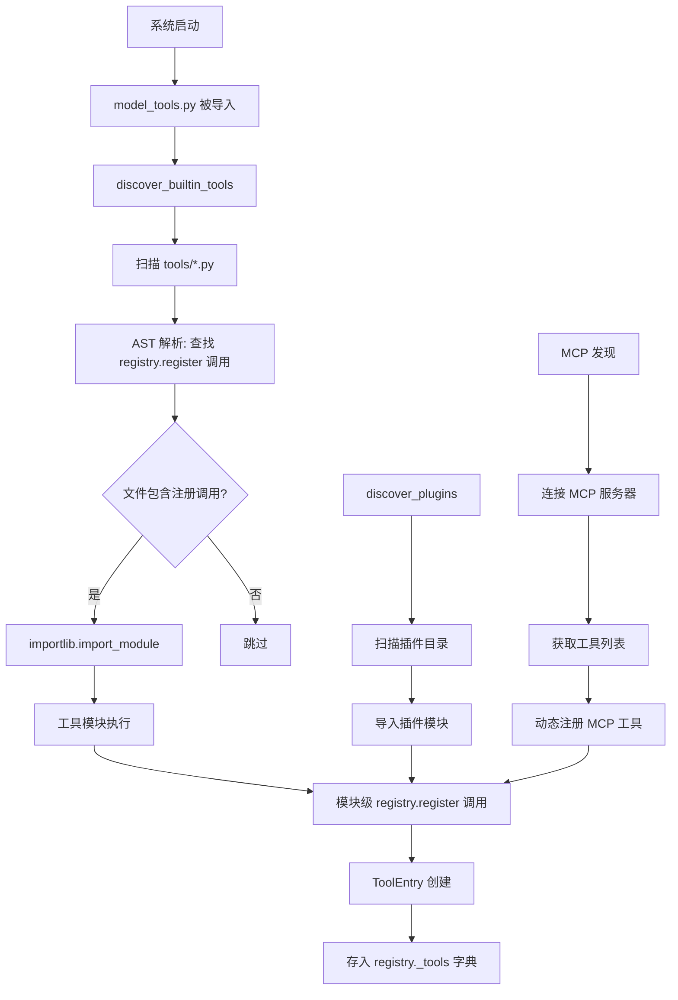
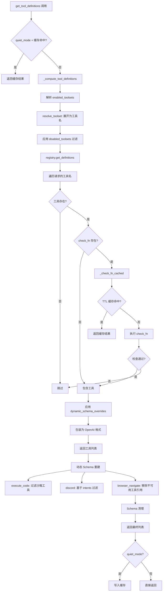
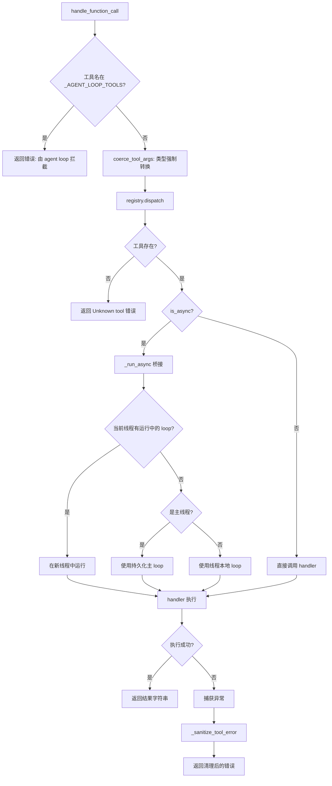
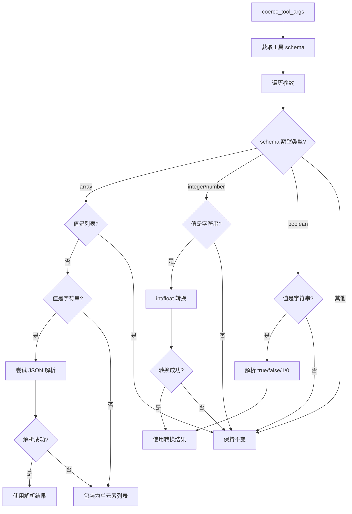
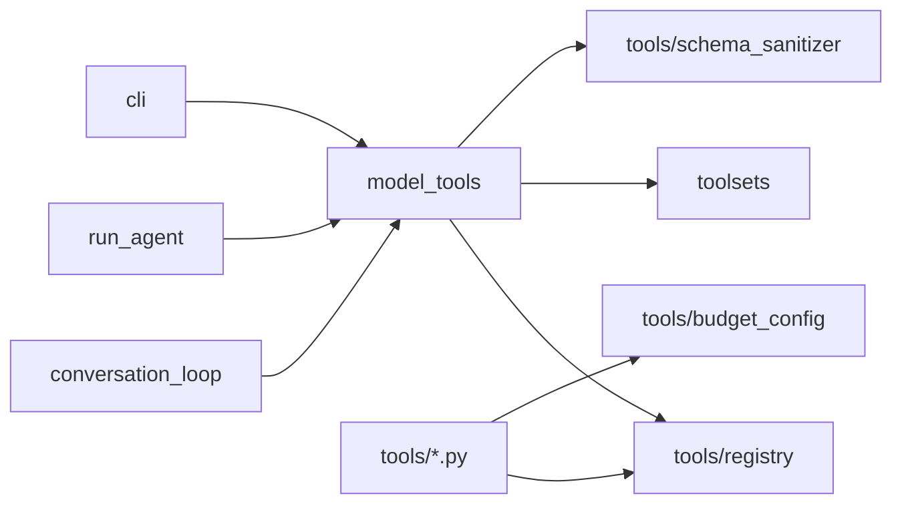

# 工具系统（Tool System）技术设计方案

## 1. 模块定位

**职责范围：**
- 提供工具的注册、发现、管理的中心化机制
- 管理工具的 JSON Schema 定义和执行处理器（handler）
- 实现工具集（toolset）的组织和过滤逻辑
- 提供工具可用性检查（check_fn）和 TTL 缓存
- 协调工具调用的分发和异步桥接
- 支持动态工具注册（MCP 服务器、插件系统）
- 实现工具参数的类型强制转换和错误清理

**不负责的内容：**
- 具体工具的业务逻辑实现（由 `tools/*.py` 各工具文件负责）
- 工具调用的执行时机和顺序（由 `agent/conversation_loop.py` 负责）
- 工具结果的压缩和修剪（由 `agent/context_compressor.py` 负责）
- 工具权限和安全审查（由 `tools/tirith_security.py` 和 `tools/approval.py` 负责）

## 2. 核心能力

1. **自注册机制**：工具文件通过 `registry.register()` 在模块级自动注册，无需中心化配置
2. **工具集管理**：通过 toolset 组织工具，支持启用/禁用整个工具集
3. **可用性检查**：每个工具可定义 `check_fn` 检查依赖（Docker、API key 等），结果 TTL 缓存 30 秒
4. **动态 Schema 覆盖**：支持运行时动态修改工具 schema（如 delegate_task 的并发限制）
5. **异步桥接**：自动将异步工具处理器桥接到同步上下文，支持多线程和嵌套事件循环
6. **参数类型强制转换**：自动将字符串参数转换为 schema 期望的类型（数字、布尔、数组）
7. **错误清理**：清除工具错误中的结构化标记（XML 标签、代码围栏），防止注入
8. **Schema 缓存**：基于 registry generation 和配置文件 mtime 的多级缓存
9. **插件和 MCP 支持**：支持外部工具动态注册和刷新

## 3. 关键入口文件

| 文件路径 | 主要类/函数 | 作用 | 为什么重要 |
|---------|------------|------|-----------|
| `tools/registry.py` | `ToolRegistry` 类 | 工具注册表的核心实现（~590 行） | 所有工具元数据的单一数据源 |
| `tools/registry.py` | `registry.register()` | 工具注册入口 | 每个工具文件调用此方法声明自己 |
| `tools/registry.py` | `registry.dispatch()` | 工具调用分发 | 根据工具名路由到对应 handler |
| `tools/registry.py` | `discover_builtin_tools()` | 内置工具发现 | 通过 AST 扫描自动导入工具模块 |
| `model_tools.py` | `get_tool_definitions()` | Schema 提供者 | 构建传递给模型 API 的工具定义列表 |
| `model_tools.py` | `handle_function_call()` | 工具调用入口 | 对话循环调用此函数执行工具 |
| `model_tools.py` | `_run_async()` | 异步桥接 | 在同步上下文中运行异步工具 |
| `model_tools.py` | `coerce_tool_args()` | 参数类型强制转换 | 修复模型返回的类型错误 |
| `toolsets.py` | `resolve_toolset()` | 工具集解析 | 将工具集名称展开为工具名列表 |

## 4. 运行时流程

### 4.1 工具发现与注册流程

**源码位置**：`tools/registry.py:57-74`, `model_tools.py:180-200`



**关键设计决策**：

1. **AST 扫描避免盲目导入**（`tools/registry.py:42-54`）：
   ```python
   def _module_registers_tools(module_path: Path) -> bool:
       source = module_path.read_text(encoding="utf-8")
       tree = ast.parse(source, filename=str(module_path))
       return any(_is_registry_register_call(stmt) for stmt in tree.body)
   ```
   - 只导入包含 `registry.register()` 的模块
   - 避免导入辅助模块（如 `lazy_deps.py`）触发副作用
   - 跳过 `mcp_tool.py`（由单独的 MCP 发现流程处理）

2. **循环导入安全**（`tools/registry.py:7-15`）：
   ```
   导入链：
   tools/registry.py  (无工具文件导入)
        ↑
   tools/*.py  (导入 registry)
        ↑
   model_tools.py  (导入 registry + 所有工具)
        ↑
   run_agent.py, cli.py
   ```

### 4.2 工具 Schema 获取流程

**源码位置**：`model_tools.py:264-327`, `tools/registry.py:337-384`



**关键步骤说明**：

1. **缓存键构造**（`model_tools.py:298-304`）：
   ```python
   cache_key = (
       frozenset(enabled_toolsets),
       frozenset(disabled_toolsets),
       registry._generation,  # 注册表变更计数器
       cfg_fp,  # 配置文件 (mtime, size)
       bool(os.environ.get("HERMES_KANBAN_TASK")),
   )
   ```

2. **check_fn TTL 缓存**（`tools/registry.py:126-141`）：
   - 缓存时长 30 秒
   - 避免每次调用都探测 Docker daemon、playwright 等外部依赖
   - 足够短以响应环境变化（`hermes tools enable`）

3. **动态 Schema 覆盖**（`tools/registry.py:372-382`）：
   - `execute_code`：根据可用工具过滤沙箱工具列表
   - `discord`/`discord_admin`：根据 bot intents 隐藏不支持的操作
   - `browser_navigate`：移除对不可用 web 工具的引用

### 4.3 工具调用分发流程

**源码位置**：`model_tools.py:487-700+`, `tools/registry.py:390-416`



**异步桥接的关键设计**（`model_tools.py:84-173`）：

**问题**：工具处理器可能是异步的（如 `browser_tool`），但对话循环是同步的。

**解决方案**：
1. **主线程持久化 loop**：
   - 避免 `asyncio.run()` 每次创建新 loop 并关闭
   - 缓存的 httpx/AsyncOpenAI 客户端绑定到持久 loop
   - 防止 "Event loop is closed" 错误

2. **嵌套事件循环处理**：
   - 如果当前已有运行中的 loop（Gateway 场景），在新线程中运行
   - 新线程有自己的 loop，避免冲突
   - 超时后通过 `call_soon_threadsafe` 取消任务

3. **工作线程本地 loop**：
   - 并发工具执行时，每个线程有自己的持久 loop
   - 避免与主线程 loop 竞争
   - 保持缓存客户端有效

### 4.4 参数类型强制转换流程

**源码位置**：`model_tools.py:545-650+`



**常见转换示例**：
```python
# 模型输出 → 强制转换后
{"limit": "10"}        → {"limit": 10}
{"enabled": "true"}    → {"enabled": True}
{"urls": "https://a"}  → {"urls": ["https://a"]}
{"items": "[1,2,3]"}   → {"items": [1, 2, 3]}
```

## 5. 核心数据结构 / 状态

### 5.1 ToolEntry 结构

**源码位置**：`tools/registry.py:77-106`

| 字段 | 类型 | 作用 |
|------|------|------|
| `name` | str | 工具名称（唯一标识符） |
| `toolset` | str | 所属工具集 |
| `schema` | dict | OpenAI Function Calling Schema |
| `handler` | Callable | 工具执行函数 |
| `check_fn` | Callable | 可用性检查函数（可选） |
| `requires_env` | list | 需要的环境变量列表 |
| `is_async` | bool | 是否为异步处理器 |
| `description` | str | 工具描述 |
| `emoji` | str | 工具图标（用于 UI 显示） |
| `max_result_size_chars` | int/float | 结果最大字符数 |
| `dynamic_schema_overrides` | Callable | 动态 schema 覆盖函数 |

### 5.2 ToolRegistry 实例状态

**源码位置**：`tools/registry.py:151-167`

| 状态字段 | 类型 | 作用 |
|---------|------|------|
| `_tools` | Dict[str, ToolEntry] | 工具名 → ToolEntry 映射 |
| `_toolset_checks` | Dict[str, Callable] | 工具集 → check_fn 映射 |
| `_toolset_aliases` | Dict[str, str] | 工具集别名 → 规范名映射 |
| `_lock` | threading.RLock | 保护并发访问的锁 |
| `_generation` | int | 注册表变更计数器（单调递增） |

**generation 计数器的作用**：
- 每次 `register()` / `deregister()` / `register_toolset_alias()` 时递增
- 外部调用者（如 `get_tool_definitions`）可以基于 generation 缓存
- 只要 generation 不变，缓存有效

### 5.3 工具 Schema 格式

**OpenAI Function Calling 格式**：
```json
{
  "type": "function",
  "function": {
    "name": "read_file",
    "description": "Read a file from the filesystem...",
    "parameters": {
      "type": "object",
      "properties": {
        "file_path": {
          "type": "string",
          "description": "Absolute path to the file"
        },
        "offset": {
          "type": "integer",
          "description": "Line number to start reading from"
        }
      },
      "required": ["file_path"]
    }
  }
}
```

### 5.4 缓存结构

**check_fn TTL 缓存**（`tools/registry.py:122`）：
```python
_check_fn_cache: Dict[Callable, tuple[float, bool]] = {}
# 键: check_fn 函数对象
# 值: (时间戳, 检查结果)
```

**get_tool_definitions 缓存**（`model_tools.py:254`）：
```python
_tool_defs_cache: Dict[tuple, List[Dict[str, Any]]] = {}
# 键: (enabled_toolsets, disabled_toolsets, generation, cfg_fp, kanban_flag)
# 值: 工具定义列表
```

## 6. 与其他模块的关系

### 6.1 依赖的模块



**详细说明**：

1. **toolsets.py**：
   - 提供 `resolve_toolset()` 将工具集名展开为工具名列表
   - 提供 `validate_toolset()` 检查工具集是否存在
   - 支持组合工具集（如 `hermes-cli` 包含多个子工具集）

2. **tools/schema_sanitizer.py**：
   - 清理工具 schema 以兼容 llama.cpp 的 GBNF 解析器
   - 移除空 `properties`、修复字符串值的 schema 节点

3. **tools/budget_config.py**：
   - 提供 `DEFAULT_RESULT_SIZE_CHARS` 全局默认值
   - 工具可以覆盖此默认值

### 6.2 被调用的场景

**Agent 初始化**（`run_agent.py`）：
```python
agent = AIAgent(
    enabled_toolsets=["hermes-cli"],
    disabled_toolsets=["browser"]
)
# 内部调用 get_tool_definitions() 构建 agent.tools
```

**对话循环中的工具调用**（`agent/conversation_loop.py`）：
```python
for tool_call in assistant_message.tool_calls:
    result = handle_function_call(
        tool_call.function.name,
        json.loads(tool_call.function.arguments)
    )
```

**CLI 工具管理命令**（`hermes_cli/commands.py`）：
```python
# hermes tools list
toolsets = registry.get_available_toolsets()

# hermes tools check
available, unavailable = registry.check_tool_availability()
```

### 6.3 模块边界

**model_tools 的职责边界**：
- ✅ 负责：工具发现、schema 提供、调用分发、参数强制转换
- ❌ 不负责：工具的具体实现、工具调用的时机和顺序

**registry 的职责边界**：
- ✅ 负责：工具元数据存储、可用性检查、schema 过滤
- ❌ 不负责：工具集的组合逻辑（由 `toolsets.py` 负责）

**与 conversation_loop 的边界**：
- model_tools 提供 `handle_function_call()` 接口
- conversation_loop 决定何时调用、如何处理结果
- 某些工具（memory、todo、session_search）由 conversation_loop 拦截

## 7. 错误处理与降级策略

### 7.1 工具注册冲突处理

**源码位置**：`tools/registry.py:258-289`

**处理策略**：
1. **同工具集覆盖**：允许（正常更新）
2. **MCP 间覆盖**：允许（服务器刷新或重名）
3. **显式 override=True**：允许（插件替换内置工具）
4. **其他跨工具集覆盖**：拒绝并记录错误

**示例错误**：
```
Tool registration REJECTED: 'read_file' (toolset 'my-plugin') would 
shadow existing tool from toolset 'file'. Pass override=True to 
register() if the replacement is intentional.
```

### 7.2 check_fn 失败降级

**源码位置**：`tools/registry.py:182-190`

**处理策略**：
- 如果 `check_fn` 抛出异常，视为不可用
- 记录 debug 日志但不中断
- 工具从可用列表中移除

**示例**：
```python
def check_terminal_requirements():
    if not shutil.which("docker"):
        return False
    # 如果 Docker daemon 连接失败，抛出异常
    docker_client.ping()  # 可能抛出 ConnectionError
    return True

# registry 捕获异常，返回 False
```

### 7.3 工具错误清理

**源码位置**：`model_tools.py:515-538`

**威胁模式**：
- XML 角色标签：`<assistant>`, `<tool_call>`, `</function_call>`
- 代码围栏：` ```json`, ` ``` `
- CDATA 块：`<![CDATA[...]]>`

**清理策略**：
```python
def _sanitize_tool_error(error_msg: str) -> str:
    sanitized = _TOOL_ERROR_ROLE_TAG_RE.sub("", error_msg)
    sanitized = _TOOL_ERROR_FENCE_OPEN_RE.sub("", sanitized)
    sanitized = _TOOL_ERROR_FENCE_CLOSE_RE.sub("", sanitized)
    sanitized = _TOOL_ERROR_CDATA_RE.sub("", sanitized)
    if len(sanitized) > 2000:
        sanitized = sanitized[:1997] + "..."
    return f"[TOOL_ERROR] {sanitized}"
```

**为什么需要**：
- 工具异常可能包含任意文本
- 虽然 JSON 转义防止了结构破坏，但模型仍会读取这些 token
- 清理防止角色混淆和注入攻击

### 7.4 异步工具超时处理

**源码位置**：`model_tools.py:144-161`

**处理策略**：
- 在独立线程中运行异步工具，超时 300 秒
- 超时后通过 `call_soon_threadsafe` 取消任务
- 清理所有待处理任务并关闭 loop
- 使用 `shutdown(wait=False)` 避免阻塞主线程

**关键代码**：
```python
try:
    return future.result(timeout=300)
except concurrent.futures.TimeoutError:
    if worker_loop is not None:
        for t in asyncio.all_tasks(worker_loop):
            worker_loop.call_soon_threadsafe(t.cancel)
    raise
finally:
    pool.shutdown(wait=False)  # 不等待卡住的协程
```

### 7.5 参数强制转换失败处理

**源码位置**：`model_tools.py:545-650+`

**处理策略**：
- 转换失败时保留原始值
- 记录警告日志但不中断工具调用
- 让工具自己处理类型错误（更清晰的错误消息）

**示例**：
```python
# 模型返回 {"limit": "abc"}，schema 期望 integer
# 转换失败，保留 "abc"
# 工具执行时抛出 TypeError: expected int, got str
```

## 8. 扩展与修改指南

### 8.1 添加新工具

**步骤**：
1. 在 `tools/` 目录创建新文件（如 `my_tool.py`）
2. 定义工具 schema 和 handler
3. 调用 `registry.register()` 注册
4. 在 `toolsets.py` 中将工具加入工具集

**示例**：
```python
# tools/my_tool.py
from tools.registry import registry, tool_result, tool_error

MY_TOOL_SCHEMA = {
    "name": "my_tool",
    "description": "Does something useful",
    "parameters": {
        "type": "object",
        "properties": {
            "input": {"type": "string"}
        },
        "required": ["input"]
    }
}

def my_tool_handler(args, **kwargs):
    input_text = args.get("input", "")
    if not input_text:
        return tool_error("input is required")
    result = do_something(input_text)
    return tool_result(success=True, output=result)

def check_my_tool_requirements():
    return os.environ.get("MY_API_KEY") is not None

registry.register(
    name="my_tool",
    toolset="my_toolset",
    schema=MY_TOOL_SCHEMA,
    handler=my_tool_handler,
    check_fn=check_my_tool_requirements,
    emoji="🔧"
)
```

### 8.2 实现动态 Schema

**步骤**：
1. 定义返回 schema 覆盖的函数
2. 在 `register()` 时传递 `dynamic_schema_overrides`

**示例**：
```python
def get_dynamic_overrides():
    from hermes_cli.config import get_config
    config = get_config()
    max_items = config.get("my_tool.max_items", 10)
    return {
        "description": f"Process up to {max_items} items..."
    }

registry.register(
    name="my_tool",
    toolset="my_toolset",
    schema=BASE_SCHEMA,
    handler=my_tool_handler,
    dynamic_schema_overrides=get_dynamic_overrides
)
```

### 8.3 添加新工具集

**步骤**：
1. 在 `toolsets.py` 的 `TOOLSETS` 字典添加条目
2. 定义工具列表或组合其他工具集

**示例**：
```python
# toolsets.py
TOOLSETS = {
    # ... 现有工具集
    "my-suite": {
        "tools": ["my_tool", "another_tool"],
        "description": "My custom tool suite"
    },
    "my-combo": {
        "includes": ["file", "my-suite"],  # 组合现有工具集
        "description": "Combined toolset"
    }
}
```

### 8.4 实现插件工具

**步骤**：
1. 创建插件目录（`~/.hermes/plugins/my_plugin/`）
2. 添加 `__init__.py` 调用 `registry.register()`
3. 系统启动时自动发现并加载

**插件结构**：
```
~/.hermes/plugins/my_plugin/
├── __init__.py
├── tool_impl.py
└── requirements.txt
```

**`__init__.py` 示例**：
```python
from tools.registry import registry

def my_plugin_tool(args, **kwargs):
    return '{"result": "from plugin"}'

registry.register(
    name="plugin_tool",
    toolset="my-plugin",
    schema={...},
    handler=my_plugin_tool
)
```

### 8.5 调试工具系统

**查看已注册工具**：
```python
from tools.registry import registry
print(registry.get_all_tool_names())
```

**检查工具可用性**：
```python
available, unavailable = registry.check_tool_availability()
print(f"Available: {available}")
print(f"Unavailable: {unavailable}")
```

**清除缓存**：
```python
from tools.registry import invalidate_check_fn_cache
from model_tools import _clear_tool_defs_cache

invalidate_check_fn_cache()  # 清除 check_fn 缓存
_clear_tool_defs_cache()     # 清除 schema 缓存
```

**查看工具 schema**：
```python
schema = registry.get_schema("read_file")
print(json.dumps(schema, indent=2))
```

## 9. 性能优化要点

### 9.1 多级缓存策略

**效果**：避免重复的工具发现和 schema 构建

**三级缓存**：
1. **check_fn TTL 缓存**（30 秒）：
   - 避免重复探测外部依赖
   - 每个 check_fn 独立缓存
   
2. **get_tool_definitions 缓存**（基于 generation）：
   - 缓存完整的工具定义列表
   - 键包含所有影响因素（toolsets、generation、config mtime）
   
3. **per-call check_fn 缓存**（`model_tools.py:352`）：
   - 单次 `get_definitions()` 调用内的去重
   - 避免同一 check_fn 被调用多次

### 9.2 AST 扫描避免盲目导入

**效果**：减少启动时间和内存占用

**策略**：
- 只导入包含 `registry.register()` 的模块
- 跳过辅助模块（`lazy_deps.py`、`path_security.py`）
- 避免触发不必要的副作用

**性能数据**（估算）：
- 盲目导入所有 `.py` 文件：~500ms
- AST 扫描 + 选择性导入：~200ms
- 节省：~60%

### 9.3 持久化事件循环

**效果**：避免 "Event loop is closed" 错误，减少 loop 创建开销

**策略**：
- 主线程使用全局持久 loop
- 工作线程使用线程本地持久 loop
- 缓存的 httpx/AsyncOpenAI 客户端保持有效

**对比**：
- `asyncio.run()`：每次创建新 loop，执行后关闭
- 持久 loop：创建一次，复用整个会话

### 9.4 浅拷贝缓存结果

**源码位置**：`model_tools.py:312-313`, `324-325`

**问题**：
- 缓存返回引用，下游修改会污染缓存
- Gateway 长期运行时累积重复工具名
- 某些提供商（DeepSeek、Moonshot）拒绝重复工具名

**解决方案**：
```python
# 返回浅拷贝，共享 dict 引用（schema 只读）
return list(cached)
```

## 10. 已知限制与待确认点

### 10.1 已知限制

1. **工具名全局唯一**：
   - 不支持同名工具来自不同工具集
   - 插件必须使用唯一名称或显式 `override=True`

2. **check_fn 无参数**：
   - 不能根据用户或会话定制可用性检查
   - 所有会话共享相同的可用性状态

3. **动态 schema 无版本控制**：
   - `dynamic_schema_overrides` 每次调用都执行
   - 无法追踪 schema 变更历史

4. **异步工具超时固定**：
   - 硬编码 300 秒超时
   - 不能根据工具类型调整

5. **参数强制转换有限**：
   - 只处理基本类型（int、bool、array）
   - 不处理嵌套对象或复杂类型

### 10.2 待确认点

1. **MCP 工具刷新机制**：
   - `notifications/tools/list_changed` 如何触发重新注册
   - 是否支持增量更新还是全量替换
   - 需要阅读 `tools/mcp_tool.py`

2. **插件优先级**：
   - 多个插件注册同名工具时的行为
   - 是否有加载顺序保证
   - 需要阅读 `hermes_cli/plugins.py`

3. **工具结果大小限制的执行**：
   - `max_result_size_chars` 在哪里被应用
   - 是否有自动截断机制
   - 需要阅读 `tools/budget_config.py`

4. **工具集别名的用途**：
   - `register_toolset_alias()` 的实际使用场景
   - 是否有内置别名
   - 需要阅读 `toolsets.py`

## 11. 参考资料

### 11.1 核心源码文件

- `tools/registry.py:1-590` - ToolRegistry 类完整实现
- `tools/registry.py:29-54` - AST 扫描逻辑
- `tools/registry.py:234-305` - 工具注册逻辑
- `tools/registry.py:337-384` - Schema 获取和过滤
- `model_tools.py:1-700+` - 工具系统公共 API
- `model_tools.py:84-173` - 异步桥接实现
- `model_tools.py:264-484` - get_tool_definitions 实现
- `model_tools.py:545-650+` - 参数类型强制转换

### 11.2 相关文档

- `docs/Agent_Runtime_对话主循环_技术设计方案.md` - 工具调用的执行流程
- OpenAI Function Calling 文档：https://platform.openai.com/docs/guides/function-calling

### 11.3 相关模块

- `toolsets.py` - 工具集定义和解析
- `tools/schema_sanitizer.py` - Schema 清理
- `tools/budget_config.py` - 结果大小限制配置
- `hermes_cli/plugins.py` - 插件发现和加载
- `tools/mcp_tool.py` - MCP 服务器集成

---

**文档版本**：v1.0  
**最后更新**：2026-05-25  
**作者**：基于源码分析生成
